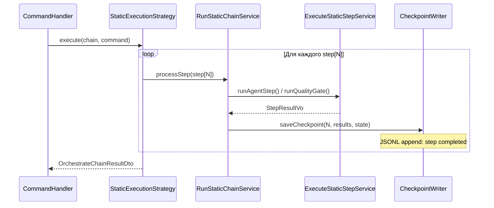
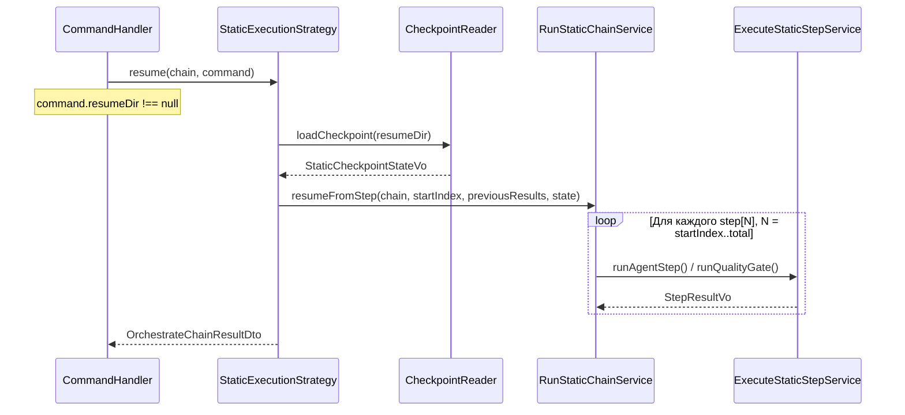

# ADR-010: Возобновление (Resume) цепочек Static и Conditional

| Поле        | Значение                                                        |
|-------------|-----------------------------------------------------------------|
| Статус      | Принято (реализация отложена до Q4 2026)                       |
| Дата        | 2026-05-02                                                      |
| Автор       | Архитектор (Гэндальф)                                          |
| Участники   | Гэндальф, Шерлок                                                |
| Источник    | [TASK-docs-resume-adr](../../todo/done/TASK-docs-resume-adr.todo.md) |

## Контекст

### Проблема

`StaticExecutionStrategy` и `ConditionalExecutionStrategy` не поддерживают возобновление — при вызове `resume()` бросают `LogicException`:

- `StaticExecutionStrategy::resume()` → `LogicException('Static chain does not support resume.')`
- `ConditionalExecutionStrategy::resume()` → `LogicException('Conditional chain does not support resume.')`

Только `DynamicExecutionStrategy` реализует возобновление через [`ChainSessionLoggerInterface`](../../src/Module/ChainDefinition/Domain/Service/Chain/Session/ChainSessionLoggerInterface.php) — механизм чекпоинтов/сессий на основе JSONL (JSONL-based checkpoint/session mechanism).

**Финансовая боль:** цепочка из 10 шагов, падение на 8-м → все результаты теряются. При стоимости LLM-вызова $0.50–$2.00 за шаг это потеря $3.50–$14.00 на каждый неудачный запуск.

### Существующая инфраструктура

| Компонент | Назначение | Используется в |
|-----------|------------|----------------|
| [`ExecutionStrategyInterface::resume()`](../../src/Module/ChainDefinition/Application/Service/Chain/ExecutionStrategyInterface.php) | Контракт возобновления | Dynamic ✅, Static ❌, Conditional ❌ |
| [`OrchestrateChainCommand::$resumeDir`](../../src/Module/ChainDefinition/Application/UseCase/Command/OrchestrateChain/OrchestrateChainCommand.php) | Путь к директории с контрольной точкой | Dynamic ✅ |
| [`OrchestrateChainCommandHandler`](../../src/Module/ChainDefinition/Application/UseCase/Command/OrchestrateChain/OrchestrateChainCommandHandler.php) | Диспетчер: `resumeDir !== null` → `resume()` | Все стратегии |
| [`ChainSessionLoggerInterface`](../../src/Module/ChainDefinition/Domain/Service/Chain/Session/ChainSessionLoggerInterface.php) | Жизненный цикл сессии JSONL (начало/запись раунда/завершение/возобновление) | Dynamic |
| [`ChainSessionStateVo`](../../src/Module/ChainDefinition/Domain/ValueObject/ChainSessionStateVo.php) | VO восстановленного состояния | Dynamic |
| [`AuditLoggerInterface`](../../src/Module/ChainDefinition/Domain/Service/Chain/Audit/AuditLoggerInterface.php) | Журнал аудита JSONL: `logStepStart`, `logStepResult` | Dynamic |
| [`StaticChainExecution`](../../src/Module/StaticExecution/Domain/Entity/StaticChainExecution.php) | Изменяемое состояние в памяти | Static (без сохранения) |
| [`StaticAuditServiceInterface`](../../src/Module/StaticExecution/Domain/Service/StaticAuditServiceInterface.php) | Журнал аудита для цепочек Static | Static (необязательный) |

### Почему сейчас не реализовано

1. **`StaticChainExecution` — в памяти:** нет механизма сохранения. Состояние живёт только в рамках одного вызова `runStaticChain()`.
2. **`ChainSessionStateVo` — специфичен для Dynamic:** содержит `facilitator`, `participants`, `discussionHistory`, `facilitatorJournal` — поля, не применимые к Static и Conditional.
3. **`ConditionalExecutionStrategy` собирает `$context` на лету:** ассоциативный массив `stepName → {passed, exitCode, status}` накапливается итеративно — его нужно восстанавливать при возобновлении.

### Аналог: поток возобновления для Dynamic

```
resumeDir → ChainSessionLogger::resumeSession()
          → ChainSessionReader::getResumedState() → ChainSessionStateVo
          → BuildDynamicContextService::buildContext(state)
          → RunDynamicLoopService::execute(chain, context, startRound, history, journal)
          → finalizeSession()
```

## Решение

Применить паттерн **контрольная точка + возобновление (Checkpoint + Resume)** к стратегиям Static и Conditional, переиспользуя существующую инфраструктуру сессий JSONL.

### Чекпоинт: что сохранять

#### Контрольная точка цепочки Static

```json
{
  "chain_name": "code-review",
  "chain_type": "static",
  "task": "Review PR #42",
  "completed_steps": 7,
  "total_steps": 10,
  "results": [
    {
      "step_index": 0,
      "role": "system_architect",
      "runner": "pi",
      "output_text": "...",
      "input_tokens": 4500,
      "output_tokens": 2200,
      "cost": 1.34,
      "duration": 12.5,
      "passed": true
    }
  ],
  "accumulated_context": "...",
  "budget_state": {
    "total_cost": 8.45,
    "role_costs": {"system_architect": 3.20, "backend_dev": 5.25}
  },
  "iteration_state": {
    "group_iterations": {"fix_loop": 2},
    "total_iterations": 1
  },
  "created_at": "2026-05-02T14:30:00+00:00"
}
```

#### Контрольная точка цепочки Conditional

```json
{
  "chain_name": "adaptive-review",
  "chain_type": "conditional",
  "task": "Review PR #42",
  "completed_steps": 5,
  "total_steps": 8,
  "results": ["...аналогично static..."],
  "condition_context": {
    "lint": {"passed": true, "exitCode": 0, "status": "passed"},
    "tests": {"passed": false, "exitCode": 1, "status": "failed"}
  },
  "budget_state": {"total_cost": 3.50},
  "created_at": "2026-05-02T14:30:00+00:00"
}
```

### Точка сохранения

Контрольная точка записывается **после каждого успешно выполненного шага** (после выполнения перехватчика шага, но до проверки бюджета):



### Поток возобновления



### Архитектурные изменения

#### 1. Новый Domain VO: `StaticCheckpointStateVo`

В `src/Module/ChainDefinition/Domain/ValueObject/`:

```
StaticCheckpointStateVo {
    int $completedSteps,
    string $accumulatedContext,
    float $totalCost,
    int $totalInputTokens,
    int $totalOutputTokens,
    array $roleCosts,
    array $groupIterations,
    int $totalIterations,
    list<StepResultDto> $completedResults,
}
```

Отдельный от `ChainSessionStateVo` (специфичного для Dynamic). Оба реализуют общий интерфейс `CheckpointStateInterface`, если в Q4 это окажется целесообразным — решение на этапе реализации.

#### 2. Новый Domain интерфейс: `CheckpointWriterInterface` / `CheckpointReaderInterface`

В `src/Module/ChainDefinition/Domain/Service/Chain/Checkpoint/`:

```php
interface CheckpointWriterInterface {
    public function startCheckpoint(string $chainName, string $chainType, string $task): string;
    public function saveStepResult(int $stepIndex, StepResultDto $result, array $state): void;
    public function completeCheckpoint(): void;
}

interface CheckpointReaderInterface {
    public function loadCheckpoint(string $sessionDir): ?StaticCheckpointStateVo;
}
```

Формат хранения — JSONL с дозаписью, аналогично `ChainSessionWriter`. Реализация — Infrastructure.

#### 3. Изменение `StaticExecutionStrategy`

```php
// execute() — добавить checkpoint после каждого шага
// resume() — загрузить checkpoint, восстановить state, продолжить с шага N+1
```

#### 4. Изменение `ConditionalExecutionStrategy`

```php
// execute() — сохранять condition_context в checkpoint
// resume() — восстановить condition_context, продолжить с шага N+1
```

#### 5. `RunStaticChainService` — поддержка смещения старта (startOffset)

Метод `execute()` получает опциональные параметры: `$startStepIndex`, `$previousResults`, `$restoredState`.

### Интеграция с существующим кодом

| Существующий компонент | Взаимодействие |
|------------------------|----------------|
| `ExecutionStrategyInterface::resume()` | Без изменений контракта. Static/Conditional убирают `LogicException`. |
| `OrchestrateChainCommand::$resumeDir` | Без изменений. Уже передаётся в `resume()`. |
| `OrchestrateChainCommandHandler` | Без изменений. Диспетчер уже выбирает стратегию по `resumeDir`. |
| `AuditLoggerInterface` | `CheckpointWriter` может делегировать записи аудита в `AuditLoggerInterface` для единообразия. |
| `StaticAuditServiceInterface` | Продолжает работать параллельно. Журнал аудита ≠ контрольная точка: первое — наблюдаемость, второе — восстановление. |
| `ChainSessionLoggerInterface` | Специфичен для Dynamic. Напрямую не переиспользуется: модели раундов и шагов слишком различаются. |

### Критерий реализации (Q4 2026)

| Условие | Значение |
|---------|----------|
| Триггер | Повторяющиеся падения цепочек Static из ≥5 шагов в рабочей среде либо финансовая потеря > $50/месяц на повторные запуски |
| Необходимые предпосылки | Стабильный API перехватчиков (перехватчики `post_step`, MVP завершён в спринте 10) |
| Объём работ | ~300–400 строк (Domain VO + интерфейсы + Infrastructure JSONL), ~200 строк (изменения стратегий), ~500 строк тестов |
| Сроки | Q4 2026, спринты 13–14 |
| Зависимости | Нет блокирующих. Может выполняться параллельно с другими задачами. |

## Последствия

### Положительные

- **Экономия средств:** возобновление с 8-го шага вместо полного повторного запуска экономит $3.50–$14.00 за неудачный запуск.
- **Единый пользовательский опыт:** `--resume <dir>` работает для всех трёх стратегий (Static, Conditional, Dynamic).
- **Без изменения контракта:** `ExecutionStrategyInterface::resume()` уже существует, меняем только реализацию.
- **Контрольная точка с дозаписью:** JSONL-формат устойчив к частичным записям: сбой в середине записи означает потерю последней строки, а не всего файла.

### Отрицательные

- **Накладные расходы ввода-вывода:** запись контрольной точки после каждого шага добавляет дисковые операции ввода-вывода. Митигируется: дозапись JSONL имеет сложность O(1), данные минимальны (~1–5 КБ на шаг).
- **Состояние `StaticChainExecution` частично дублируется** в контрольной точке. При реализации нужно решить, не выделить ли состояние контрольной точки в отдельный VO, который делегирует `StaticChainExecution`.
- **Действительность контрольной точки:** конфигурация цепочки может измениться между запуском и возобновлением (шаги добавлены или удалены). Нужна проверка контрольной суммы или версии определения цепочки.

### Риски

1. **Группы итераций исправления + возобновление:** при возобновлении в середине группы повторов (шаги 3→4→5 с повтором) нужно корректно восстановить итерационное состояние. Сложность: средняя.
2. **Пересборка контекста Conditional:** при возобновлении цепочки Conditional выражения условий переоцениваются. Если данные окружения изменились между запуском и возобновлением, ветвление может пойти иначе. Это ожидаемое поведение, но оно должно быть задокументировано.
3. **Обратная совместимость:** существующие цепочки без контрольной точки не ломаются — возобновление продолжает бросать `LogicException` до миграции. Миграция прозрачна: контрольная точка создаётся автоматически при следующем запуске.

## Альтернативы

### A1: Общий `ChainSessionLoggerInterface` для всех стратегий

Переиспользовать `ChainSessionLoggerInterface` (сессию JSONL) для Static и Conditional.

**Плюсы:** меньше нового кода, единая модель сессии.

**Минусы:** `ChainSessionLoggerInterface` ориентирован на модель Dynamic (раунды, фасилитатор, участники, история обсуждения). Поля `logRound()` не соответствуют семантике Static и Conditional. Результат: неаккуратное преобразование либо раздувание интерфейса.

**Вердикт:** ❌ Отвергнуто. Семантическое несовпадение (semantic mismatch) перевешивает экономию LOC. Лучше отдельный `CheckpointWriterInterface` с чистым контрактом.

### A2: Контрольная точка в памяти (без сохранения)

Сохранять результаты в памяти, доступные через `StaticChainExecution`.

**Плюсы:** нет операций ввода-вывода, простота.

**Минусы:** при сбое процесса (OOM, segfault, отключение питания) все результаты теряются — та же проблема, что сейчас. Возобновление требует работающего процесса.

**Вердикт:** ❌ Отвергнуто. Не решает исходную проблему потери результатов при сбое.

### A3: Внешнее хранилище состояния (Redis / DB)

Записывать контрольную точку в Redis или базу данных.

**Плюсы:** централизованное, доступное для запросов и разделяемое между экземплярами.

**Минусы:** добавляет зависимость от Infrastructure. Для инструмента оркестрации, ориентированного на CLI и локальный процесс, это избыточное усложнение. JSONL-файлы уже доказали свою работоспособность в цепочках Dynamic.

**Вердикт:** ❌ Отвергнуто на данном этапе. Может быть пересмотрено при появлении распределённой оркестрации в Q1 2027+.

### A4: Частичное повторное выполнение с кэшированием (без контрольной точки)

Вместо контрольной точки кэшировать результаты шагов по (`chainName` + `stepIndex` + `inputHash`). При повторном запуске проверять кэш.

**Плюсы:** не требует явной контрольной точки — автоматическое возобновление.

**Минусы:** хэш входных данных сложен для LLM-вызовов: промпт может быть недетерминированным. Инвалидация кэша — классическая «проблема двух сложных вещей». Нет гарантии, что закэшированный результат актуален.

**Вердикт:** ❌ Отвергнуто. Ненадёжно для недетерминированных AI-вызовов. Явная контрольная точка обеспечивает предсказуемость.

## Ссылки

- [ADR-006: ExecutionStrategy Composition](006-execution-strategy-composition.md) — архитектурный контракт стратегий
- [ADR-008: контракт общего ядра](008-shared-kernel-contract.md) — общее ядро модулей
- [ADR-009: Dynamic остаётся в Orchestrator](009-dynamic-split-decision.md) — почему Dynamic не выделен в отдельный модуль
- [ExecutionStrategyInterface](../../src/Module/ChainExecution/Application/Contract/Chain/ExecutionStrategyInterface.php) — контракт `resume()`
- [ChainSessionLogger](../../src/Module/DynamicLoop/Infrastructure/Service/ChainSessionLogger.php) — эталонная реализация сессии JSONL
- [StaticChainExecution](../../src/Module/ChainExecution/Domain/Entity/StaticChainExecution.php) — состояние цепочки Static в памяти
- [RunStaticChainService](../../src/Module/ChainExecution/Domain/Service/Static/RunStaticChainService.php) — цикл выполнения static-цепочки
