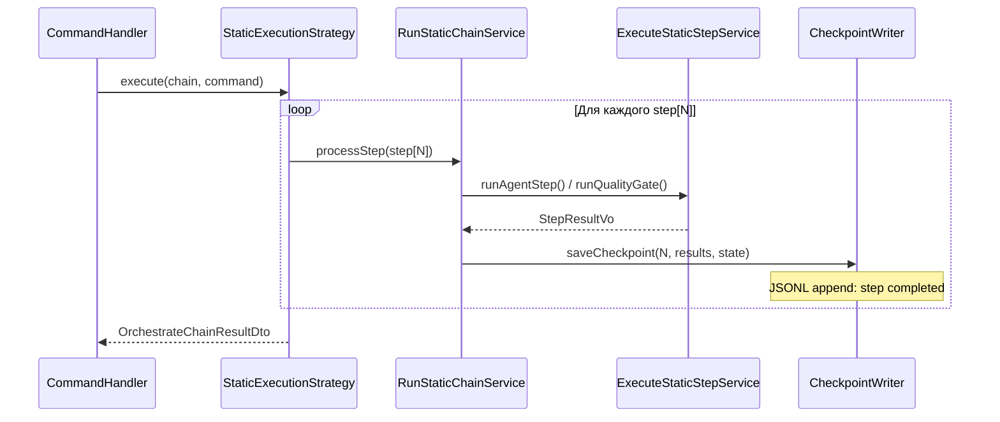
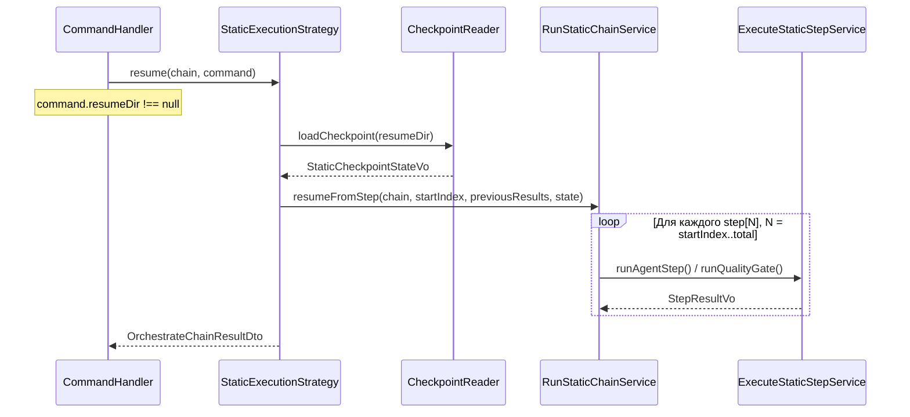

# ADR-010: Resume для Static и Conditional цепочек

| Поле        | Значение                                                        |
|-------------|-----------------------------------------------------------------|
| Статус      | Принято (реализация отложена до Q4 2026)                       |
| Дата        | 2026-05-02                                                      |
| Автор       | Архитектор (Гэндальф)                                          |
| Участники   | Гэндальф, Шерлок                                                |
| Источник    | [TASK-docs-resume-adr](../../todo/TASK-docs-resume-adr.todo.md) |

## Контекст

### Проблема

`StaticExecutionStrategy` и `ConditionalExecutionStrategy` не поддерживают resume — при вызове `resume()` бросают `LogicException`:

- `StaticExecutionStrategy::resume()` → `LogicException('Static chain does not support resume.')`
- `ConditionalExecutionStrategy::resume()` → `LogicException('Conditional chain does not support resume.')`

Только `DynamicExecutionStrategy` реализует resume через [`ChainSessionLoggerInterface`](../../src/Module/Orchestrator/Domain/Service/Chain/Session/ChainSessionLoggerInterface.php) — JSONL-based checkpoint/session mechanism.

**Финансовая боль:** цепочка из 10 шагов, падение на 8-м → все результаты теряются. При стоимости LLM-вызова $0.50–$2.00 за шаг это потеря $3.50–$14.00 на каждый failed run.

### Существующая инфраструктура

| Компонент | Назначение | Используется в |
|-----------|------------|----------------|
| [`ExecutionStrategyInterface::resume()`](../../src/Module/Orchestrator/Application/Service/Chain/ExecutionStrategyInterface.php) | Контракт resume | Dynamic ✅, Static ❌, Conditional ❌ |
| [`OrchestrateChainCommand::$resumeDir`](../../src/Module/Orchestrator/Application/UseCase/Command/OrchestrateChain/OrchestrateChainCommand.php) | Путь к директории с checkpoint | Dynamic ✅ |
| [`OrchestrateChainCommandHandler`](../../src/Module/Orchestrator/Application/UseCase/Command/OrchestrateChain/OrchestrateChainCommandHandler.php) | Диспетчер: `resumeDir !== null` → `resume()` | Все стратегии |
| [`ChainSessionLoggerInterface`](../../src/Module/Orchestrator/Domain/Service/Chain/Session/ChainSessionLoggerInterface.php) | JSONL session lifecycle (start/logRound/complete/resume) | Dynamic |
| [`ChainSessionStateVo`](../../src/Module/Orchestrator/Domain/ValueObject/ChainSessionStateVo.php) | VO восстановленного состояния | Dynamic |
| [`AuditLoggerInterface`](../../src/Module/Orchestrator/Domain/Service/Chain/Audit/AuditLoggerInterface.php) | JSONL audit: logStepStart, logStepResult | Dynamic |
| [`StaticChainExecution`](../../src/Module/StaticExecution/Domain/Entity/StaticChainExecution.php) | In-memory mutable state | Static (no persistence) |
| [`StaticAuditServiceInterface`](../../src/Module/StaticExecution/Domain/Service/StaticAuditServiceInterface.php) | Audit для static цепочек | Static (optional) |

### Почему сейчас не реализовано

1. **`StaticChainExecution` — in-memory:** нет persistence-механизма. State живёт только в рамках одного вызова `runStaticChain()`.
2. **`ChainSessionStateVo` — dynamic-specific:** содержит `facilitator`, `participants`, `discussionHistory`, `facilitatorJournal` — поля, не применимые к static/conditional.
3. **`ConditionalExecutionStrategy` собирает `$context` на лету:** ассоциативный массив `stepName → {passed, exitCode, status}` накапливается итеративно — его нужно восстанавливать при resume.

### Аналог: Dynamic resume flow

```
resumeDir → ChainSessionLogger::resumeSession()
          → ChainSessionReader::getResumedState() → ChainSessionStateVo
          → BuildDynamicContextService::buildContext(state)
          → RunDynamicLoopService::execute(chain, context, startRound, history, journal)
          → finalizeSession()
```

## Решение

Применить паттерн **Checkpoint + Resume** к static и conditional стратегиям, переиспользуя существующую JSONL-session инфраструктуру.

### Чекпоинт: что сохранять

#### Static Chain Checkpoint

```json
{
  "chain_name": "code-review",
  "chain_type": "static",
  "task": "Review PR #42",
  "completed_steps": 7,
  "total_steps": 10,
  "results": [
    {
      "step_index": 0,
      "role": "system_architect",
      "runner": "pi",
      "output_text": "...",
      "input_tokens": 4500,
      "output_tokens": 2200,
      "cost": 1.34,
      "duration": 12.5,
      "passed": true
    }
  ],
  "accumulated_context": "...",
  "budget_state": {
    "total_cost": 8.45,
    "role_costs": {"system_architect": 3.20, "backend_dev": 5.25}
  },
  "iteration_state": {
    "group_iterations": {"fix_loop": 2},
    "total_iterations": 1
  },
  "created_at": "2026-05-02T14:30:00+00:00"
}
```

#### Conditional Chain Checkpoint

```json
{
  "chain_name": "adaptive-review",
  "chain_type": "conditional",
  "task": "Review PR #42",
  "completed_steps": 5,
  "total_steps": 8,
  "results": ["...аналогично static..."],
  "condition_context": {
    "lint": {"passed": true, "exitCode": 0, "status": "passed"},
    "tests": {"passed": false, "exitCode": 1, "status": "failed"}
  },
  "budget_state": {"total_cost": 3.50},
  "created_at": "2026-05-02T14:30:00+00:00"
}
```

### Точка сохранения

Checkpoint записывается **после каждого успешно выполненного шага** (post-step hook execution, но до budget check):



### Resume Flow



### Архитектурные изменения

#### 1. Новый Domain VO: `StaticCheckpointStateVo`

В `src/Module/Orchestrator/Domain/ValueObject/`:

```
StaticCheckpointStateVo {
    int $completedSteps,
    string $accumulatedContext,
    float $totalCost,
    int $totalInputTokens,
    int $totalOutputTokens,
    array $roleCosts,
    array $groupIterations,
    int $totalIterations,
    list<StepResultDto> $completedResults,
}
```

Отдельный от `ChainSessionStateVo` (dynamic-specific). Оба имплементируют общий интерфейс `CheckpointStateInterface`, если в Q4 это окажется целесообразным — решение на этапе реализации.

#### 2. Новый Domain интерфейс: `CheckpointWriterInterface` / `CheckpointReaderInterface`

В `src/Module/Orchestrator/Domain/Service/Chain/Checkpoint/`:

```php
interface CheckpointWriterInterface {
    public function startCheckpoint(string $chainName, string $chainType, string $task): string;
    public function saveStepResult(int $stepIndex, StepResultDto $result, array $state): void;
    public function completeCheckpoint(): void;
}

interface CheckpointReaderInterface {
    public function loadCheckpoint(string $sessionDir): ?StaticCheckpointStateVo;
}
```

Формат хранения — JSONL (append-only, аналогично `ChainSessionWriter`). Реализация — Infrastructure.

#### 3. Изменение `StaticExecutionStrategy`

```php
// execute() — добавить checkpoint после каждого шага
// resume() — загрузить checkpoint, восстановить state, продолжить с шага N+1
```

#### 4. Изменение `ConditionalExecutionStrategy`

```php
// execute() — сохранять condition_context в checkpoint
// resume() — восстановить condition_context, продолжить с шага N+1
```

#### 5. `RunStaticChainService` — поддержка startOffset

Метод `execute()` получает опциональные параметры: `$startStepIndex`, `$previousResults`, `$restoredState`.

### Интеграция с существующим кодом

| Существующий компонент | Взаимодействие |
|------------------------|----------------|
| `ExecutionStrategyInterface::resume()` | Без изменений контракта. Static/Conditional убирают `LogicException`. |
| `OrchestrateChainCommand::$resumeDir` | Без изменений. Уже передаётся в `resume()`. |
| `OrchestrateChainCommandHandler` | Без изменений. Диспетчер уже роутит по `resumeDir`. |
| `AuditLoggerInterface` | CheckpointWriter может делегировать audit-записи в `AuditLoggerInterface` для единообразия. |
| `StaticAuditServiceInterface` | Продолжает работать параллельно. Audit ≠ checkpoint (audit = наблюдаемость, checkpoint = recovery). |
| `ChainSessionLoggerInterface` | Dynamic-специфичный. Не переиспользуется напрямую — слишком разные модели (rounds vs steps). |

### Критерий реализации (Q4 2026)

| Условие | Значение |
|---------|----------|
| Триггер | Повторяющиеся падения static цепочек ≥5 шагов на проде, либо финансовая потеря > $50/месяц на re-runs |
| Необходимые предпосылки | Стабильный hooks API (post_step hooks MVP завершён в Sprint 10) |
| Объём работ | ~300–400 LOC (Domain VO + интерфейсы + Infrastructure JSONL), ~200 LOC (изменения стратегий), ~500 LOC тесты |
| Сроки | Q4 2026, Sprint 13–14 |
| Зависимости | Нет блокирующих. Может выполняться параллельно с другими задачами. |

## Последствия

### Положительные

- **Экономия средств:** resume с 8-го шага вместо полного re-run экономит $3.50–$14.00 за failed run.
- **Единый UX:** `--resume <dir>` работает для всех трёх стратегий (static, conditional, dynamic).
- **Без изменения контракта:** `ExecutionStrategyInterface::resume()` уже существует, меняем только реализацию.
- **Append-only checkpoint:** JSONL-формат устойчив к partial writes (краш в середине записи = потеря последней строки, не всего файла).

### Отрицательные

- **I/O overhead:** запись checkpoint после каждого шага добавляет disk I/O. Митигируется: JSONL append = O(1), данные минимальны (~1–5 КБ на шаг).
- **Состояние `StaticChainExecution` частично дублируется** в checkpoint. При реализации — продумать, не выделить ли checkpoint state в отдельный VO, который делегирует `StaticChainExecution`.
- **Checkpoint валидность:** конфигурация цепочки может измениться между run и resume (шаги добавлены/удалены). Необходима валидация чексаммы или версии определения цепочки.

### Риски

1. **Fix Iteration Groups + resume:** при resume в середине retry-группы (шаги 3→4→5 с retry) нужно корректно восстановить итерационное состояние. Сложность: medium.
2. **Conditional context rebuilding:** при resume conditional-цепочки condition expressions переоцениваются. Если данные окружения изменились между run и resume — ветвление может пойти иначе. Это ожидаемое поведение (fresh evaluation), но должно быть задокументировано.
3. **Backward compatibility:** существующие цепочки без checkpoint не ломаются — resume продолжает бросать `LogicException` до миграции. Миграция = transparent (checkpoint создаётся автоматически при следующем run).

## Альтернативы

### A1: Общий `ChainSessionLoggerInterface` для всех стратегий

Переиспользовать `ChainSessionLoggerInterface` (JSONL session) для static/conditional.

**Плюсы:** меньше нового кода, единая session model.

**Минусы:** `ChainSessionLoggerInterface` заточен под dynamic модель (rounds, facilitator, participants, discussionHistory). Поля `logRound()` (step, round, isFacilitator) не маппятся на static/conditional семантику. Результат: грязный mapping или раздувание интерфейса.

**Вердикт:** ❌ Отвергнуто. Semantic mismatch перевешивает экономию LOC. Лучше отдельный `CheckpointWriterInterface` с чистым контрактом.

### A2: In-memory checkpoint (no persistence)

Сохранять результаты в memory (array), доступные через `StaticChainExecution`.

**Плюсы:** ноль I/O, простота.

**Минусы:** при crash процесса (OOM, segfault, power loss) все результаты теряются — та же проблема, что сейчас. Resume требует living process.

**Вердикт:** ❌ Отвергнуто. Не решает исходную проблему (потеря результатов при crash).

### A3: External state store (Redis / DB)

Писать checkpoint в Redis или database.

**Плюсы:** centralised, queryable, shared между instances.

**Минусы:** добавляет infrastructure dependency. Для CLI-first orchestration tool (единственный consumer — локальный процесс) это overengineering. JSONL-файлы уже доказали свою работоспособность в dynamic chains.

**Вердикт:** ❌ Отвергнуто на данном этапе. Может быть пересмотрено при появлении distributed orchestration (Q1 2027+).

### A4: Partial re-execution с caching (no checkpoint)

Вместо checkpoint — кэшировать результаты шагов по (chainName + stepIndex + inputHash). При re-run проверять кэш.

**Плюсы:** не требует явного checkpoint — «автоматический» resume.

**Минусы:** input hash сложен для LLM-вызовов (промпт может быть nondeterministic). Кэш invalidation — классическая проблема двух hard things. Нет гарантии, что закэшированный результат актуален.

**Вердикт:** ❌ Отвергнуто. Ненадёжно для nondeterministic AI-вызовов. Explicit checkpoint = предсказуемость.

## Ссылки

- [ADR-006: ExecutionStrategy Composition](006-execution-strategy-composition.md) — архитектурный контракт стратегий
- [ADR-008: Shared Kernel Contract](008-shared-kernel-contract.md) — общий kernel для модулей
- [ADR-009: Dynamic остаётся в Orchestrator](009-dynamic-split-decision.md) — почему Dynamic не выделен в отдельный модуль
- [ExecutionStrategyInterface](../../src/Module/Orchestrator/Application/Service/Chain/ExecutionStrategyInterface.php) — контракт `resume()`
- [ChainSessionLoggerInterface](../../src/Module/Orchestrator/Domain/Service/Chain/Session/ChainSessionLoggerInterface.php) — reference implementation JSONL session
- [StaticChainExecution](../../src/Module/StaticExecution/Domain/Entity/StaticChainExecution.php) — in-memory state static-цепочки
- [RunStaticChainService](../../src/Module/StaticExecution/Domain/Service/RunStaticChainService.php) — цикл выполнения static-цепочки
