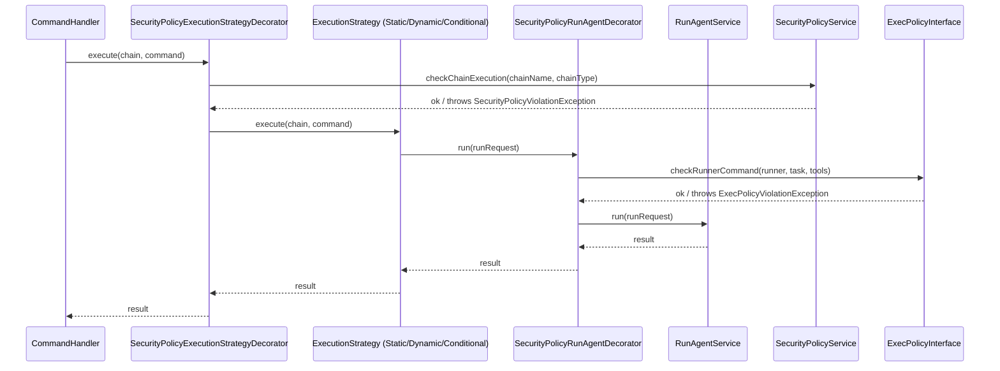

# ADR-010: Security Policy Architecture

| Поле        | Значение                                                         |
|-------------|------------------------------------------------------------------|
| Статус      | Принято                                                          |
| Дата        | 2026-05-02                                                       |
| Автор       | Архитектор (Гэндальф)                                           |
| Участники   | Гэндальф, Локи, Левша, Шерлок                                  |
| Источник    | Brainstorm #2 (консенсус: отдельный модуль), анализ Локи (Sprint 2) |
| Epic        | [EPIC-sprint-9-security-policy](../../todo/EPIC-sprint-9-security-policy.md) |

## Контекст

task-orchestrator выполняет AI-агентные цепочки, в которых runner'ы (LLM, shell, quality gates) получают команды без ограничений. Исследование 16 AI-agent фреймворков (Codex, Claude Code, Copilot Cloud Agent, Crush) подтверждает: exec policy и permission system — обязательный слой для безопасного автономного выполнения.

В Roadmap 2026 Q2–Q3 (OQ-3) зафиксирован открытый вопрос: Security Policy — единственный roadmap-сценарий, где разделение Static/Dynamic может создать архитектурную проблему. Cross-cutting concern зависит от обоих subdomain'ов.

### Предпосылки

1. **Brainstorm #2 (2026-04-30):** консенсус 4 участников — SecurityPolicy = безусловный отдельный модуль, cross-cutting concern с собственным Ubiquitous Language.
2. **Анализ Локи (AI#14, Sprint 2):** G4-триггер НЕ срабатывает — permission model одна для Static и Dynamic, различие только в точках применения (per-step vs per-role/per-turn). Shared Kernel не расрастается.
3. **Decorator pattern валидирован:** `RetryingAgentRunner`, `CircuitBreakerAgentRunner` — существующие decorators для cross-cutting concerns.
4. **ExecutionStrategy pattern (ADR-006):** CommandHandler — чистый диспетчер, стратегии типизированы через `supports()`. Decorator ложится поверх стратегии без изменения Domain-кода.
5. **Shared Kernel Contract (ADR-008):** `ChainDefinitionInterface` = name + budget + roles. SecurityPolicy не требует расширения Shared Kernel.

### 6 точек вмешательства Security Policy

Анализ кодовой базы `src/Module/Orchestrator/` выявил 6 точек, где security checks должны вмешиваться в процесс выполнения:

| # | Точка | Компонент | Что проверяется | Static | Dynamic |
|---|-------|-----------|-----------------|--------|---------|
| 1 | Вход в оркестрацию | `OrchestrateChainCommandHandler` | Авторизация запуска цепочки (имя, окружение) | ✅ | ✅ |
| 2 | Начало выполнения | `ExecutionStrategy::execute()` | Разрешён ли тип выполнения в окружении | ✅ | ✅ |
| 3 | Выполнение шага (Static) | `RunStaticChainService::executeStep()` | Runner/tool/model для конкретного шага | ✅ | — |
| 4 | Вызов runner'а | `RunAgentServiceInterface::run()` | Exec policy: banned prefixes, runner, tools | ✅ | ✅ |
| 5 | Dynamic turn | `RunDynamicLoopService::execute()` | Runner для конкретной роли в runtime | — | ✅ |
| 6 | Quality gate shell | `QualityGateRunnerInterface::run()` | Exec policy: shell-команды, banned prefixes | ✅ | — |

## Решение

### 1. SecurityPolicy — отдельный модуль

```
src/Module/SecurityPolicy/
├── Domain/
│   ├── Entity/
│   │   └── ExecRule.php                      # Декларативное правило (banned prefix, allowed runner, etc.)
│   ├── Enum/
│   │   ├── RuleActionEnum.php                # allow | deny
│   │   ├── RuleTargetEnum.php                # command | runner | tool | model | chain
│   │   └── RuleSeverityEnum.php              # block | warn
│   ├── Exception/
│   │   ├── SecurityPolicyException.php       # базовый exception модуля
│   │   ├── SecurityPolicyViolationException.php
│   │   └── ExecPolicyViolationException.php
│   ├── Service/
│   │   ├── ExecPolicyCheckService.php        # проверка exec rules
│   │   └── SecurityPolicyService.php         # агрегация: chain-level + exec-level checks
│   └── ValueObject/
│       ├── ExecRuleId.php                    # идентификатор правила
│       ├── Permission.php                    # allow/deny для конкретного ресурса
│       ├── PermissionSet.php                 # набор permissions для chain
│       └── RulePattern.php                   # glob/regex/exact matching
├── Application/
│   └── Service/
│       └── SecurityPolicyApplicationService.php  # Application-level orchestration
├── Infrastructure/
│   ├── Orchestrator/                         # Реализация ports Orchestrator'а
│   │   ├── ChainSecurityPolicy.php           # implements ChainSecurityPolicyInterface
│   │   └── ExecPolicyCheck.php              # implements ExecPolicyInterface
│   └── Persistence/
│       └── InMemoryExecRuleRepository.php    # In-memory для Sprint 9
└── Integration/                              # (пока пусто — интеграция через Orchestrator ports)
```

**Ubiquitous Language модуля SecurityPolicy:**

| Термин | Значение |
|--------|----------|
| ExecRule | Декларативное правило: шаблон (glob/regex/exact) + действие (allow/deny) + цель (command/runner/tool/model) |
| Permission | Разрешение/запрет на конкретный ресурс для конкретной цепочки |
| PermissionSet | Набор permissions для одной chain-конфигурации |
| RulePattern | Шаблон матчинга (glob/regex/exact) для идентификации ресурса |
| ExecPolicy | Политика выполнения: набор ExecRules, применяемых к runner'ам и командам |
| SecurityPolicy | Агрегация: chain-level authorization + exec-level policy checks |

### 2. Dependency Inversion: ports в Orchestrator Domain

Интерфейсы (ports) определяются в **Orchestrator Domain**, реализуются в **SecurityPolicy Infrastructure**:

```php
// src/Module/Orchestrator/Domain/Service/Security/

/**
 * Проверка security policy перед выполнением цепочки.
 * Порт в Orchestrator Domain, реализация — в SecurityPolicy Infrastructure.
 */
interface ChainSecurityPolicyInterface
{
    /**
     * Проверяет, авторизован ли запуск цепочки.
     * @throws SecurityPolicyViolationException если цепочка запрещена
     */
    public function checkChainExecution(string $chainName, ChainTypeEnum $type): void;
}

/**
 * Проверка exec policy для команды runner'а.
 * Порт в Orchestrator Domain, реализация — в SecurityPolicy Infrastructure.
 */
interface ExecPolicyInterface
{
    /**
     * Проверяет, разрешена ли команда runner'а.
     * @throws ExecPolicyViolationException если команда запрещена
     */
    public function checkRunnerCommand(string $runnerName, string $task, ?string $tools = null): void;

    /**
     * Проверяет, разрешена ли shell-команда (quality gates).
     * @throws ExecPolicyViolationException если команда запрещена
     */
    public function checkShellCommand(string $command): void;
}
```

**Зависимости (Deptrac):**

```
SecurityPolicy Infrastructure → Orchestrator Domain (interfaces only) ✅
Orchestrator Domain → (не зависит от SecurityPolicy) ✅
Orchestrator Application → Orchestrator Domain (interfaces) ✅
```

### 3. Decorator pattern для интеграции

Два decorator'а внедряют security checks без изменения Domain-кода Orchestrator'а:

#### SecurityPolicyExecutionStrategyDecorator

Оборачивает `ExecutionStrategyInterface` — проверяет chain-level permissions перед делегированием:

```php
// Оборачивает ВСЕ стратегии (Static, Dynamic, Conditional...)
class SecurityPolicyExecutionStrategyDecorator implements ExecutionStrategyInterface
{
    public function execute(ChainDefinitionVo $chain, OrchestrateChainCommand $command): OrchestrateChainResultDto
    {
        $this->chainSecurityPolicy->checkChainExecution(
            $chain->getName(),
            $chain->getType(),
        );

        return $this->decoratedStrategy->execute($chain, $command);
    }
    // ...
}
```

**Точка вмешательства:** #1 (CommandHandler) + #2 (ExecutionStrategy::execute).

#### SecurityPolicyRunAgentDecorator

Оборачивает `RunAgentServiceInterface` — проверяет exec policy перед runner-вызовом:

```php
// Оборачивает RunAgentService — проверяет runner/tool/command
class SecurityPolicyRunAgentDecorator implements RunAgentServiceInterface
{
    public function run(ChainRunRequestVo $request): ChainRunResultVo
    {
        $this->execPolicy->checkRunnerCommand(
            $request->getRunnerName(),
            $request->getTask(),
            $request->getTools(),
        );

        return $this->decoratedService->run($request);
    }
}
```

**Точка вмешательства:** #4 (Agent run) — общая для Static и Dynamic.

### 4. Модель: Rules Filter → Permission Check → Execution

Поток выполнения security checks:



**Логика проверки ExecRule:**

1. Загрузить правила из PermissionSet для текущей цепочки.
2. Для каждого правила: матчить `RulePattern` против целевого значения (runner name, command, tool).
3. Если `RuleAction::DENY` + совпадение → `ExecPolicyViolationException`.
4. Если `RuleAction::ALLOW` + совпадение → пропустить (whitelist).
5. Если ни одно правило не сработало → default policy (deny-by-default для production, allow-by-default для dev).

### 5. Доменные сущности

#### ExecRule (Entity)

```php
class ExecRule
{
    private function __construct(
        private readonly ExecRuleId $id,
        private readonly RuleTargetEnum $target,    // command | runner | tool | model
        private readonly RulePattern $pattern,       // glob/regex/exact
        private readonly RuleActionEnum $action,     // allow | deny
        private readonly RuleSeverityEnum $severity, // block | warn
    ) {}

    public function matches(string $value): bool
    {
        return $this->pattern->matches($value);
    }

    public function isDeny(): bool
    {
        return $this->action === RuleActionEnum::DENY;
    }
}
```

#### Permission (Value Object)

```php
class Permission
{
    private function __construct(
        private readonly RuleTargetEnum $target,
        private readonly string $resource,
        private readonly RuleActionEnum $action,
    ) {}

    public static function allow(RuleTargetEnum $target, string $resource): self { ... }
    public static function deny(RuleTargetEnum $target, string $resource): self { ... }
}
```

#### RulePattern (Value Object)

```php
class RulePattern
{
    private function __construct(
        private readonly PatternTypeEnum $type,   // glob | regex | exact
        private readonly string $pattern,
    ) {}

    public function matches(string $value): bool { ... }
}
```

### 6. Эскиз YAML DSL (`permissions:` block)

> ⚠️ Подробная спецификация YAML DSL — в отдельной задаче (Task 5). Здесь — только эскиз для связи.

```yaml
chains:
  code-review:
    runner: openai
    type: static
    steps: [...]
    permissions:
      runners:
        allow: [openai, anthropic]
        deny: [local-shell]
      tools:
        allow: [read, grep, test]
      commands:
        deny:
          - pattern: "rm -rf *"
            type: glob
          - pattern: "bash -c *"
            type: glob
          - pattern: "/usr/bin/sudo *"
            type: glob
      models:
        allow: [gpt-4, claude-3.5]
      severity: block  # block | warn
```

### 7. Эскиз Exec Policy File

```yaml
# config/security_policy.yaml — default policy для всех цепочек
default_policy: deny  # deny | allow (default action при отсутствии правил)

rules:
  - target: command
    pattern: "rm -rf *"
    type: glob
    action: deny
    severity: block

  - target: command
    pattern: "bash -c *"
    type: glob
    action: deny
    severity: block

  - target: runner
    pattern: "local-shell"
    type: exact
    action: deny
    severity: block
```

## Обоснование

| Критерий | ACL (Anti-Corruption Layer) | Decorator + Domain Ports (выбрано) |
|----------|----------------------------|--------------------------------------|
| Сложность интеграции | DTO mapping, adapters, 2 набора interfaces | 2 interfaces (ports) + 2 decorator'а |
| Консистентность с проектом | Новый паттерн для cross-cutting | Согласуется с `RetryingAgentRunner`, `CircuitBreakerAgentRunner` |
| Shared Kernel impact | SecurityPolicy добавляет типы в Shared Kernel | Shared Kernel не меняется |
| Включение/выключение | ACL убрать сложно | Decorator убирается через DI-конфигурацию |

| Критерий | Shared Kernel interfaces | Domain Ports (выбрано) |
|----------|-------------------------|------------------------|
| Расположение interfaces | В Shared Kernel (между модулями) | В Orchestrator Domain |
| Зависимость方向 | Оба модуля → Shared Kernel | SecurityPolicy → Orchestrator Domain only |
| Расширение Shared Kernel | Нарушает ADR-008 (scope = name + budget + roles) | Shared Kernel неизменен |
| Количество зависимых | 2+ модуля зависят от SK | Только SecurityPolicy зависит от Orchestrator |

## Последствия

### Положительные

1. **Shared Kernel не расширяется.** SecurityPolicy не добавляет методов в `SharedChainDefinitionVo`. ADR-008 соблюдён.
2. **OCP-совместимо.** Новые типы checks (Docker sandbox, LLM Guardian) добавляются как новые rules и decorators без изменения существующего кода.
3. **Включение/выключение через DI.** Decorator'ы можно отключить через `config/services.yaml` без изменения Domain-кода.
4. **Deptrac-clean.** Зависимость `SecurityPolicy Infrastructure → Orchestrator Domain (interfaces)` — валидная, не создаёт circular dependency.
5. **Тестируемость.** Каждый decorator и service тестируется изолированно через unit-тесты с mock-портами.
6. **Единая permission model.** G4-триггер НЕ срабатывает: exec policy и permission checks работают через одни и те же interfaces для Static и Dynamic.

### Отрицательные

1. **Три модуля в Deptrac.** SecurityPolicy — третий модуль (после Orchestrator, StaticExecution). Deptrac-конфигурация должна быть обновлена для корректного описания всех 3+ модулей.
2. **DI wiring complexity.** Decorator'ы добавляют слой в DI-конфигурацию: decorator оборачивает реальные сервисы. Symfony service decoration (`#[AsDecorator]`) упрощает wiring, но требует аккуратной конфигурации.
3. **Два decorator'а = два слоя indirection.** При отладке stack trace может быть менее очевидным. Митигируется: логирование в decorator'ах (`@todo` для Sprint 10+ audit trail).

### Риски

| Риск | Вероятность | Влияние | Митигация |
|------|-------------|---------|-----------|
| Deptrac circular dependency на 3+ модулях | Низкая | Задержка Sprint 9 | Interfaces (ports) в Orchestrator Domain — однонаправленная зависимость |
| YAML DSL недостаточно выразителен для сложных правил | Средняя | Расширение DSL в Sprint 10+ | Sprint 9: basic glob/regex/exact patterns, AND/OR composition — Could Have |
| Decorator ordering (security → retry → circuit breaker) | Низкая | Некорректный порядок проверок | Symfony decoration priority в `services.yaml` |
| Performance overhead на rule matching | Низкая | Замедление chain execution | In-memory rules, indexed by target type |

## Альтернативы

### Альтернатива 1: ACL (Anti-Corruption Layer)

SecurityPolicy определяет свои interfaces, Orchestrator создаёт adapters/DTO mapping — как при интеграции двух bounded context'ов.

**Почему отвергнуто:** SecurityPolicy — cross-cutting concern, а не bounded context с собственной бизнес-логикой. Он не производит данные — он фильтрует и проверяет. ACL между Orchestrator и SecurityPolicy — overengineering: 2 набора interfaces, DTO mapping, 2 adapter'а вместо 2 портов и 2 decorator'ов. Кроме того, ACL не согласуется с существующим подходом к retry/circuit breaker (decorators).

### Альтернатива 2: Shared Kernel interfaces

Interfaces (`ChainSecurityPolicyInterface`, `ExecPolicyInterface`) размещаются в Shared Kernel, чтобы оба модуля (Orchestrator, SecurityPolicy) зависели от общего контракта.

**Почему отвергнуто:** Нарушает ADR-008 (Shared Kernel scope = name + budget + roles). SecurityPolicy — не bounded context, равноправный с Orchestrator. Dependency Inversion (ports в Orchestrator Domain) точнее отражает отношение: Orchestrator определяет, что ему нужно от security, SecurityPolicy это предоставляет.

### Альтернатива 3: Middleware pipeline

Вместо 2 decorators — единый middleware pipeline, через который проходят все вызовы.

**Почему отвергнуто:** Overengineering для текущих потребностей (2 точки interception). Middleware pipeline оправдан при 5+ cross-cutting concerns с вариативным порядком. Сейчас retry + circuit breaker + security = 3 concerns, и decorator'ы справляются. Если количество Concern'ов вырастет до 5+ — решение пересматривается отдельным ADR.

### Альтернатива 4: Event-driven security checks

Orchestrator генерирует события (`ChainExecutionRequested`, `AgentRunRequested`), SecurityPolicy подписывается и валидирует.

**Почему отвергнуто:** Security checks — синхронная операция: если policy violated, выполнение не должно стартовать. Event-driven подход вводит eventual consistency, которая неприемлема для безопасности. Sync exceptions из decorator'ов — прямой и надёжный механизм.

## Точки расширения (Sprint 10+)

| Расширение | Как интегрируется | Когда |
|------------|-------------------|-------|
| **LLM Guardian** (semantic analysis) | Новый `RuleType::LLM_REVIEW` + async pre-check перед runner call | Sprint 10+ |
| **Docker sandbox** | Infrastructure-level isolation, не Domain concern. Security Policy определяет sandbox policy, Infrastructure обеспечивает isolation | Q4 |
| **Org-level policy engine** | Новый `PolicySourceInterface` — remote policy fetch | Долгосрочная перспектива |
| **Audit trail** | Security events logging в decorator'ах | Sprint 10+ |
| **Runtime policy hot-reload** | `PolicySourceInterface::reload()` + cache invalidation | Долгосрочная перспектива |

## Связанные ADR

- [ADR-006: ExecutionStrategy Composition](006-execution-strategy-composition.md) — decorator оборачивает `ExecutionStrategyInterface`
- [ADR-008: Shared Kernel Contract](008-shared-kernel-contract.md) — SecurityPolicy не расширяет Shared Kernel
- [ADR-007: VO ACL Boundary](007-vo-acl-boundary.md) — SecurityPolicy не нарушает ACL между Orchestrator и AgentRunner

## Источники

- [Security Policy Cross-Cutting Analysis (Локи, Sprint 2)](../releases/security-policy-cross-cutting-analysis.md)
- [Roadmap 2026 Q2–Q3: Sprint 9](../releases/ROADMAP-2026-Q2-Q3.md)
- [Протокол brainstorm #2 (2026-04-30)](../../var/sessions/brainstorm/2026-04-30_16-02-26/result.md)
- [Исследование AI-agent фреймворков](../research/agent-frameworks-summary.md)

---

*Документ подготовлен Архитектором Гэндальфом на основе анализа Локи (AI#14, Sprint 2), консенсуса brainstorm #2 и Roadmap 2026 Q2–Q3.*
