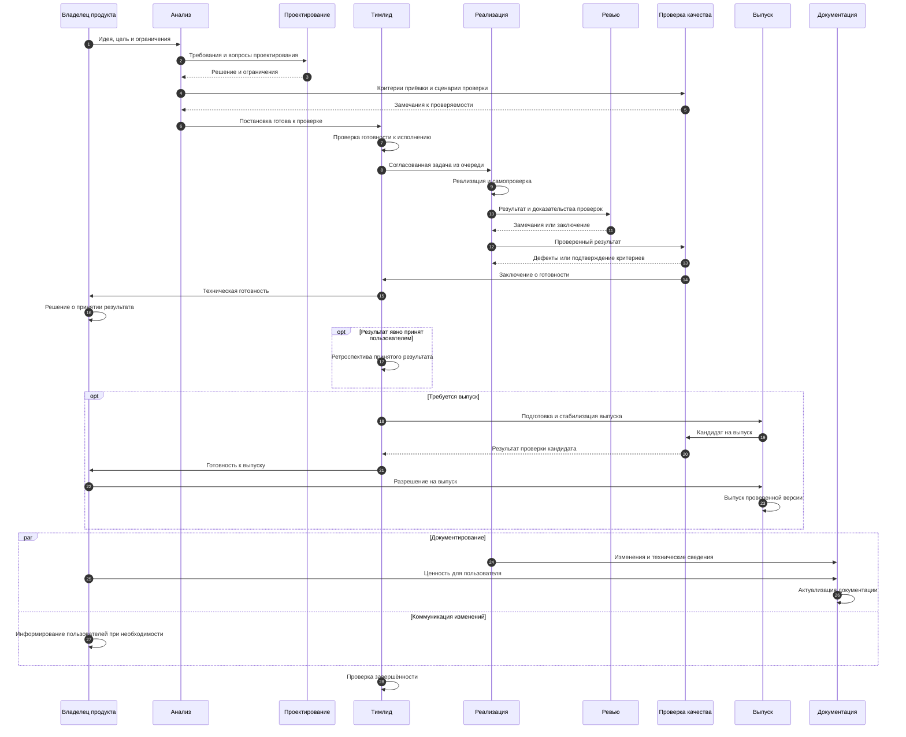

# SDLC — жизненный цикл разработки

Общий процесс взаимодействия команды от идеи до принятого результата. Включает этапы, контроль готовности, вытягивание задач из очереди и обратную связь при доработках.

Документ входит в поставку task-orchestrator и не зависит от конкретного проекта, стека, инструментов или навыков. Описывает **что происходит и при каких условиях**, а не команды и способы выполнения работы. Тимлид руководствуется этим процессом и ведёт документ: вносит согласованные изменения и поддерживает его актуальность.

## Участники и ответственность

В схеме указаны функции участников, а не обязательный штат команды. Распределение ответственности между доступными ролями определяет матрица RACI (распределение ответственности) проекта. [Матрица task-orchestrator](../raci-matrix.md) описывает команду самого оркестратора, а не назначает участников другим проектам.

SDLC определяет последовательность и условия переходов; матрица ответственности — исполнителей и принимающих результат. Если назначение отсутствует или документы противоречат друг другу, тимлид разрешает вопрос до продолжения работы, не подставляя предполагаемого исполнителя.

## Поток работы

Замечания возвращают работу на затронутый этап. Повторное ревью и проверки продолжаются до устранения блокирующих замечаний. Документация может готовиться параллельно; необходимая для использования результата документация должна быть готова к его передаче пользователю.

## Этапы и условия переходов

| Этап | Результат, необходимый для перехода |
|---|---|
| Очередь идей | Определены потребность, цель и владелец решения |
| Анализ | Согласованы границы, требования, ограничения и критерии приёмки |
| Проектирование | Приняты необходимые решения, выявлены зависимости и риски |
| Готовность к исполнению | Тимлид проверил полноту постановки, проверяемость результата и готовность зависимостей; назначены участники |
| Реализация | Получен результат и выполнена самопроверка |
| Ревью | Проведена независимая проверка, устранены блокирующие замечания |
| Проверка качества | Подтверждены критерии приёмки, зафиксированы результаты проверок |
| Приёмка | Подтверждены техническая готовность и решение уполномоченного участника о принятии результата |
| Подготовка выпуска | Если требуется выпуск: сформирован и проверен кандидат, устранены блокирующие дефекты |
| Выпуск | Получено разрешение и выпущена именно проверенная версия |
| Завершение | Переданы результат и документация, выполнены применимые обязательства; после пользовательской приёмки проведена ретроспектива |

Этапы процесса не являются перечнем статусов файлов задач. Формат задач, допустимые статусы и переходы определяет регламент учёта задач. Слияние изменений, выпуск и пользовательская приёмка — разные события; одно не означает автоматического разрешения на другое.

## Принципы потока

- **Ограничение незавершённой работы.** Участники завершают текущую работу, прежде чем брать новую; блокеры делают видимыми тимлиду.
- **Вытягивание из очереди.** Исполнители берут готовые задачи из согласованной очереди, а не начинают несогласованные работы.
- **Обогащение задачи.** Каждый этап добавляет сведения, решения и доказательства, необходимые следующему участнику.
- **Контроль объёма.** До реализации тимлид сверяет цель, критерии приёмки, ограничения и план с согласованными продуктовыми решениями. Упрощения не определяются личными предпочтениями исполнителя.
- **Контроль готовности.** Тимлид проверяет постановку перед исполнением и техническую готовность перед приёмкой; его заключение не заменяет решение владельца продукта.
- **Сходимость ревью.** Повторная проверка получает незакрытые замечания и перечень изменений. Сбой инструмента без заключения не считается содержательной итерацией; необязательные предложения не блокируют результат.
- **Достоверность завершения.** Работа не объявляется завершённой без обязательных проверок и ревью. Изменения поведения, контрактов, архитектуры или конфигурации после ревью требуют повторных проверок. Изменения после слияния оформляются отдельной работой.
- **Обратная связь после приёмки.** Ретроспектива — самостоятельный цикл самоулучшения (self-improvement cycle). После каждой явной пользовательской приёмки результата тимлид проводит ретроспективу без дополнительного поручения. Фиксируются и проблемы, и успешные практики. При отсутствии оснований для изменений улучшения и задачи не создаются.
- **Изоляция выпуска.** Текущая разработка может опережать выпущенную версию. Выпускается проверенный кандидат, без несвязанных изменений. Имена веток и способы доставки определяет регламент выпуска, а не SDLC.
- **Срочные исправления.** Исправление начинается от текущей выпущенной версии, проходит ревью и проверку, получает разрешение на выпуск. Затем оно включается в основную разработку, чтобы дефект не вернулся.

## Ведение процесса

Тимлид фиксирует изменения этапов, переходов и условий готовности в этом документе, а изменения ответственности — в матрице RACI. Согласованность двух документов проверяется при каждом изменении процесса. Оформление можно поручить техническому писателю; ответственность за содержание и актуальность SDLC остаётся у тимлида.
