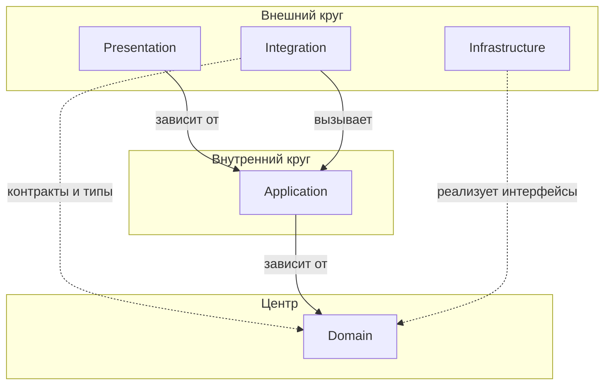

# Взаимодействие слоёв (Layer Interaction)

**Взаимодействие слоёв** — правила зависимостей между слоями архитектуры, основанные на принципах Clean Architecture (луковичная архитектура).

Подробнее: [Clean Architecture by Robert C. Martin](https://blog.cleancoder.com/uncle-bob/2012/08/13/the-clean-architecture.html)

## Общие правила

- Зависимости направлены **только внутрь**, к центру
- Внутренние слои не зависят от внешних
- Внешние слои зависят от внутренних через контракты и согласованные типы (`interface`/`DTO`/`VO`/`Enum`) в рамках разрешённых правил
- DI-контейнер связывает интерфейсы с реализациями на уровне конфигурации

## Диаграмма зависимостей

## Описание слоёв

| Слой | Назначение | Зависимости |
|------|------------|-------------|
| **Domain** | Бизнес-логика, сущности, Value Object, интерфейсы репозиториев | Нет |
| **Application** | Use Cases, оркестрация, DTO | Domain |
| **Infrastructure** | Реализация репозиториев, кэш, персистентность | Domain (контракты и типы) |
| **Integration** | Внешние API, события, межмодульное взаимодействие | Application, Domain (контракты и типы) |
| **Presentation** | Web, API, Console, Blog — точки входа | Application |

## Правила взаимодействия

### Domain → (никто)

Domain слой не зависит ни от кого:
- Нет зависимостей на Application, Infrastructure, Integration, Presentation
- Может использовать только стандартные типы PHP и свои интерфейсы

### Application → Domain

Application зависит только от Domain:
- Вызывает методы сущностей и Value Object
- Использует интерфейсы репозиториев из Domain
- Использует спецификации и сервисы из Domain
- Важно: `Application DTO` не должны зависеть от `Domain` и остаются только в рамках `Application`.

### Infrastructure → Domain

Infrastructure реализует интерфейсы Domain:
- Реализует `RepositoryInterface` из Domain
- Может использовать доменные типы (`VO`, `Enum`, доменные `DTO`) в сигнатурах и маппинге
- Подключается через DI-контейнер
- Не используется напрямую из Application

### Integration → Application

Integration вызывает Application чужого модуля:
- Обрабатывает внешние события и инициирует соответствующие Use Cases.
- Реализует интеграции через интерфейсы сервисов своего Domain.
- Может использовать доменные типы в сигнатурах контрактов (`VO`, `Enum`, доменные `DTO`).
- Не зависит от слоя Infrastructure.
- Формирует антикоррупционный слой (ACL) на границе с внешними системами.

### Presentation → Application

Presentation зависит только от Application:
- Контроллеры вызывают Command/Query через Handler
- Не обращается к Domain, Infrastructure, Integration напрямую
- Валидация на уровне формы/DTO

## Матрица зависимостей

| Откуда ↓ / Куда → | Domain | Application | Infrastructure | Integration | Presentation |
|-------------------|--------|-------------|----------------|-------------|--------------|
| **Domain** | — | ❌ | ❌ | ❌ | ❌ |
| **Application** | ✅ | — | ❌ | ❌ | ❌ |
| **Infrastructure** | ✅ | ❌ | — | ❌ | ❌ |
| **Integration** | ✅* | ✅ | ❌ | — | ❌ |
| **Presentation** | ❌ | ✅ | ❌ | ❌ | — |

\* Только контракты и типы Domain (интерфейсы сервисов, `VO`/`Enum`/доменные `DTO` в сигнатурах), без зависимости на доменные реализации.
