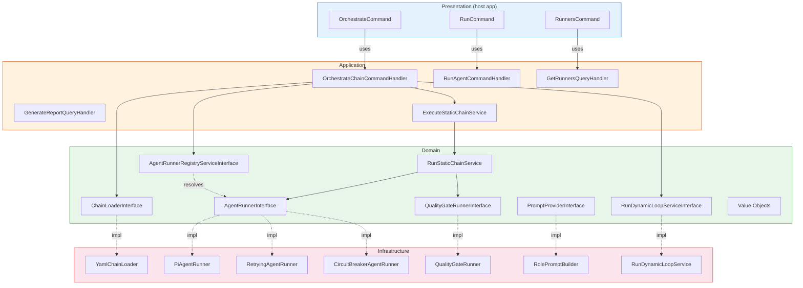
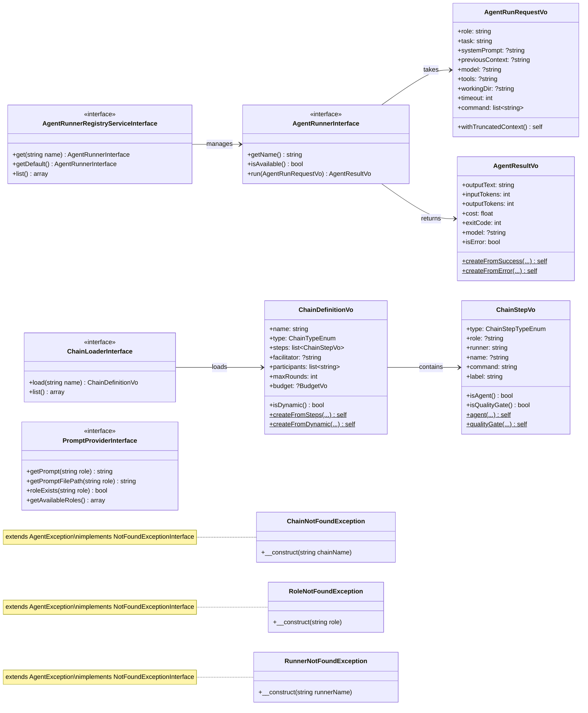
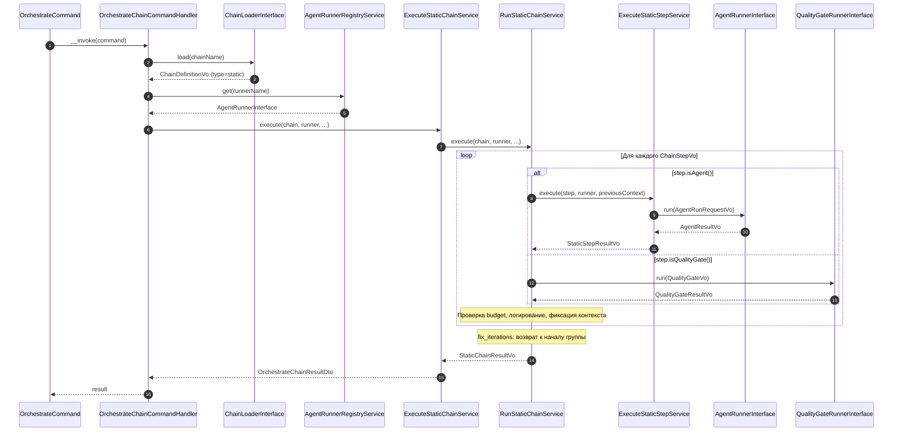
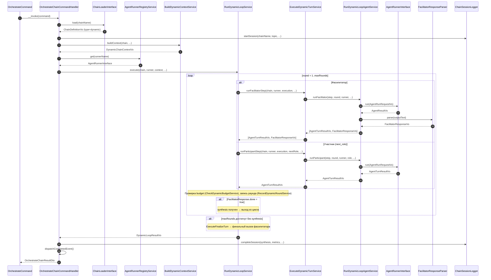
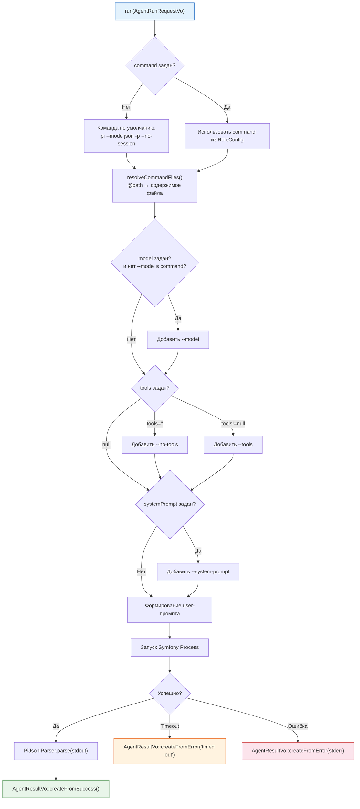

# Диаграммы

Mermaid-диаграммы Orchestrator. Рендерятся нативно в GitHub markdown preview.

## Component-диаграмма слоёв

Обзор DDD-слоёв и их связи. Сплошные стрелки — прямые зависимости, пунктирные — реализация интерфейса.

## Class-диаграмма Domain-слоя

Интерфейсы, Value Objects и исключения Domain-слоя.

## Sequence: оркестрация static-цепочки

Линейное выполнение шагов с поддержкой итерационных циклов и quality gates.

## Sequence: оркестрация dynamic-цепочки

Фасилитатор решает в рантайме, кому дать слово. Цикл завершается когда фасилитатор возвращает `{done: true}`.

## Flowchart: PiAgentRunner

Внутренний поток `PiAgentRunner::run()` — разрешение команды, формирование аргументов, запуск процесса, парсинг результата.

