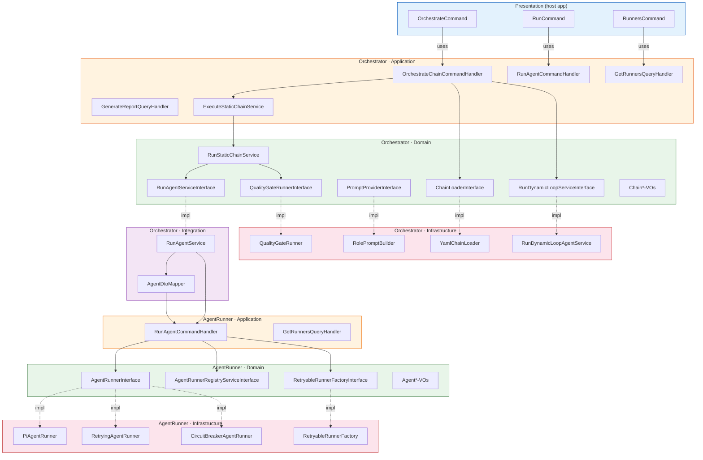
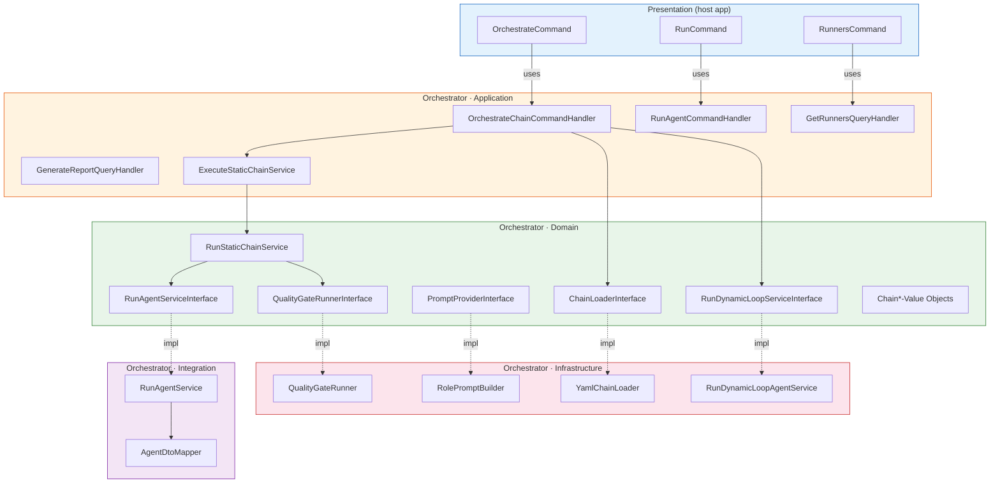
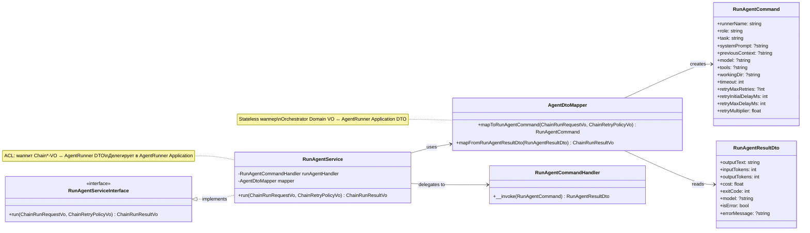
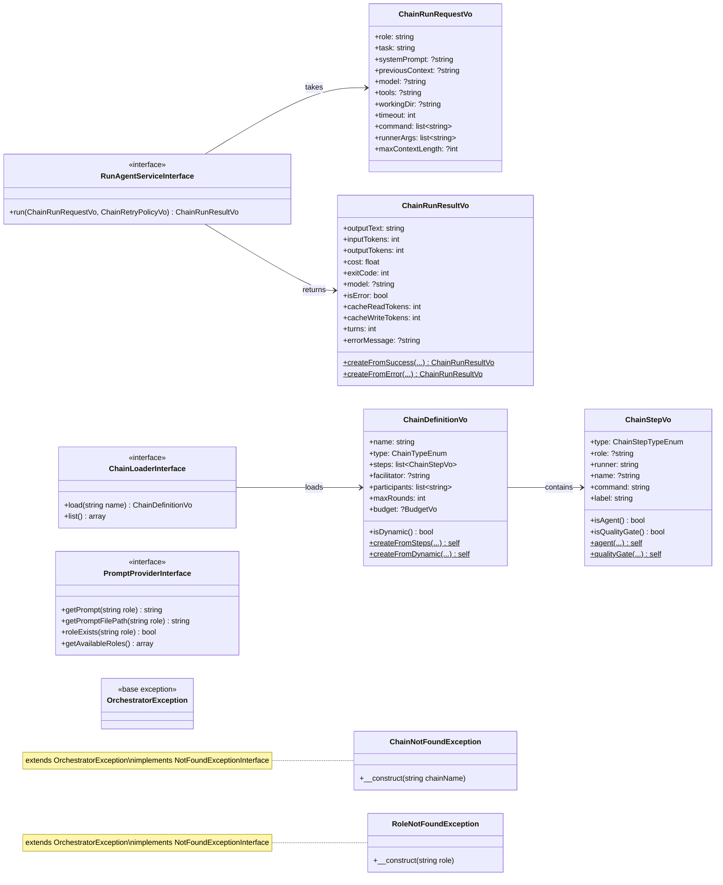
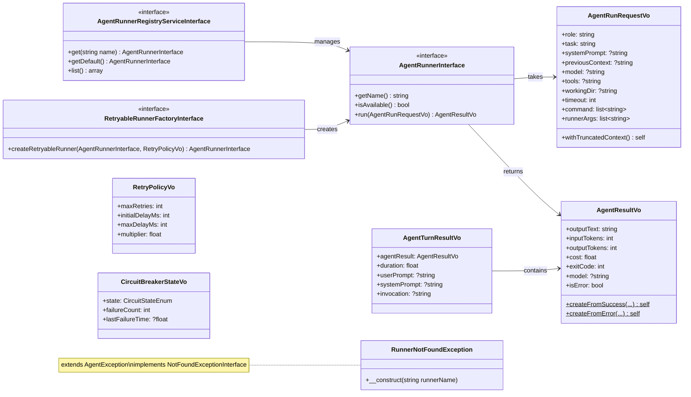
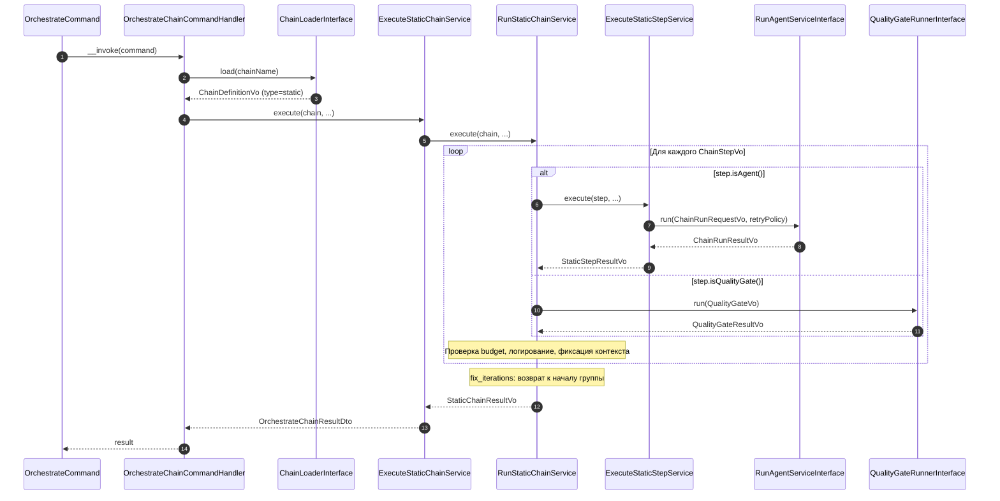
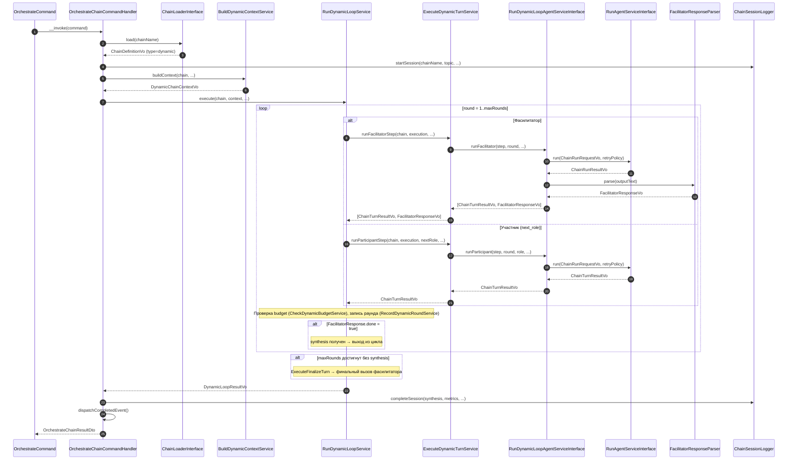
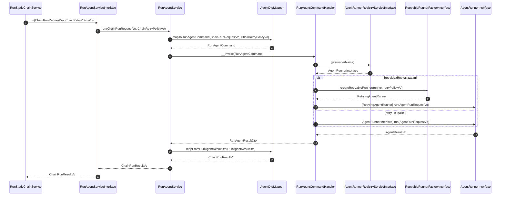
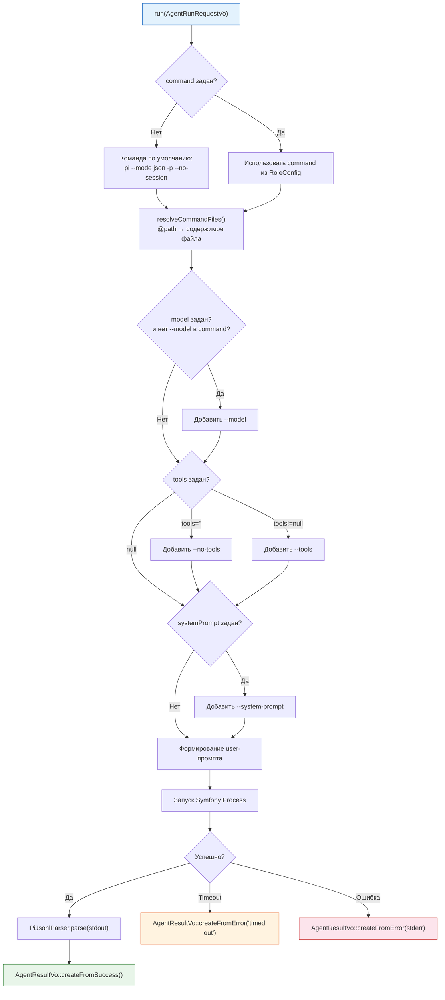

# Диаграммы

Mermaid-диаграммы Orchestrator. Рендерятся нативно в GitHub markdown preview.

## Component-диаграмма: два модуля

Обзор модулей AgentRunner и Orchestrator, их DDD-слоёв и связей через Integration-слой.

## Component-диаграмма слоёв (детализация)

Детальный обзор DDD-слоёв внутри каждого модуля. Сплошные стрелки — прямые зависимости, пунктирные — реализация интерфейса.

## Class-диаграмма: Integration-слой (ACL)

Механизм связи между Orchestrator и AgentRunner через Integration-слой.

## Class-диаграмма Domain-слоя Orchestrator

Интерфейсы, Value Objects и исключения Orchestrator Domain.

## Class-диаграмма Domain-слоя AgentRunner

Интерфейсы и Value Objects модуля AgentRunner.

## Sequence: оркестрация static-цепочки

Линейное выполнение шагов с поддержкой итерационных циклов и quality gates.

## Sequence: оркестрация dynamic-цепочки

Фасилитатор решает в рантайме, кому дать слово. Цикл завершается когда фасилитатор возвращает `{done: true}`.

## Sequence: Integration → AgentRunner Application

Детализация вызова через Integration-слой при `RunAgentServiceInterface::run()`.

## Flowchart: PiAgentRunner

Внутренний поток `PiAgentRunner::run()` — разрешение команды, формирование аргументов, запуск процесса, парсинг результата.

