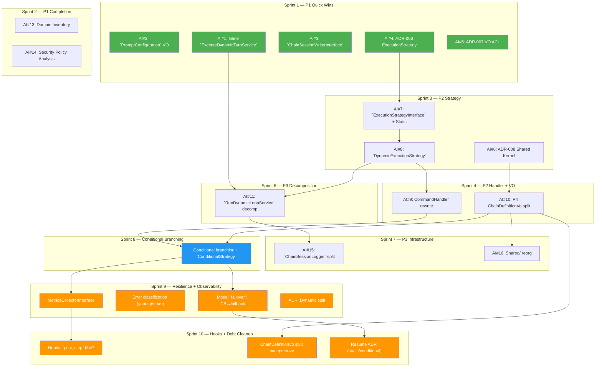

# Roadmap 2026 Q2–Q3: Декомпозиция Orchestrator + Расширение оркестрации

**Статус:** ✅ Готово (Все 10 спринтов выполнены)  
**Владелец:** Шерлок (system_analyst_sherlock)  
**Дата создания:** 2026-04-29  
**Дата обновления:** 2026-05-02
**Дата закрытия:** 2026-05-02  
**Источники:**
- Протокол brainstorm #1: `var/sessions/brainstorm/2026-04-29_08-06-49/result.md`
- Протокол brainstorm #2 (декомпозиция на модули): `var/sessions/brainstorm/2026-04-30_16-02-26/result.md`
- Исследование AI-agent фреймворков: `docs/research/agent-frameworks-summary.md`
- Архитектура проекта: `docs/guide/architecture.md`

> **⚠️ Это черновик.** Владелец проекта уточнит приоритеты и привязку к реальным спринтам. Порядок задач внутри спринта — рекомендательный.

---

## Обзор

Roadmap покрывает два крупных направления:

1. **Декомпозиция модуля Orchestrator** (P1–P3) — устранение оверсложнения, выявленного на brainstorm-сессии (120 файлов, 9890 строк, 7 уровней вложенности, God-объекты).
2. **Расширение моделей оркестрации** (Roadmap-фичи) — условное ветвление (conditional branching), параллельное выполнение (parallel execution), `sub-agents`, `security` policy, типизированный ввод-вывод (typed I/O), система хуков (hooks system) — паттерны, заимствованные из исследования 16 AI-agent фреймворков.

### Метрики отправной точки

| Метрика | Значение | Источник |
|---|---|---|
| Файлов в Orchestrator | 120 | brainstorm |
| Строк кода (Orchestrator) | 9890 | brainstorm |
| Domain-слой (% модуля) | 57% (5643 строки) | brainstorm |
| Вложенность вызовов (dynamic path) | 7 уровней | brainstorm |
| God-объекты | 2 (`ChainSessionLogger` 536 LOC, `OrchestrateChainCommandHandler` 328 LOC) | brainstorm |
| Action `items` из brainstorm | 16 | brainstorm |
| Исследованных фреймворков | 16 | research |
| Кластеров рекомендаций | 5 | research |

---

## Квартальная разбивка

### Q2 2026 (Май — Июнь): Декомпозиция + Архитектурные контракты

**Цель:** Устранить оверсложнение в Orchestrator, зафиксировать архитектурные решения ADR, подготовить почву для расширения оркестрации.

| Спринт | Даты | Тема | Ключевые результаты |
|---|---|---|---|
| **Sprint 1** | 05 мая — 18 мая | P1: Быстрые победы + ADR | `PromptConfiguration` VO, инлайнинг `ExecuteDynamicTurnService`, `ChainSessionWriterInterface`, ADR-006, ADR-007 |
| **Sprint 2** | 19 мая — 01 июня | P1: Завершение + Инвентаризация | Roadmap (✅), инвентаризация Domain-слоя, Security Policy анализ |
| **Sprint 3** | 02 июня — 15 июня | P2: ExecutionStrategy | `ExecutionStrategyInterface` + `StaticExecutionStrategy`, `DynamicExecutionStrategy`, ADR-008 |
| **Sprint 4** | 16 июня — 29 июня | P2: Переписывание CommandHandler | CommandHandler как диспетчер (~30 строк), P4 расщепление ChainDefinitionVo |
| **Sprint 5** | 30 июня — 13 июля | P2: Завершение + Переход | Завершение P2 задач, тестирование, подготовка к P3 |

### Q3 2026 (Июль — Сентябрь): P3 Декомпозиция + Roadmap-фичи

**Цель:** Завершить декомпозицию God-объектов, реализовать conditional branching, error handling и hooks system.

| Спринт | Даты | Тема | Ключевые результаты |
|---|---|---|---|
| **Sprint 6** | 14 июля — 27 июля | P3: `RunDynamicLoopService` | Декомпозиция на `LoopOrchestrator` + `TurnExecutor` + `BudgetChecker` + `Finalizer` |
| **Sprint 7** | 28 июля — 10 августа | P3: Очистка Infrastructure | Расщепление `ChainSessionLogger`, реорганизация (reorg) Shared/, расщепление `DynamicTurnResultVo` |
| **Sprint 8** | 11 августа — 24 августа | Условное ветвление | Расширение YAML DSL, ExecutionStrategy для conditional, выражения (expressions) `when:` |
| **Sprint 9** | 08 сентября — 21 сентября | Отказоустойчивость + наблюдаемость | Model `failover` (CB→fallback), классификация (classification) ошибок (упрощённая), `MetricsCollector`, ADR о расщеплении Dynamic |
| **Sprint 10** | 22 сентября — 05 октября | Хуки + погашение техдолга | Хуки `post_step` MVP, завершение расщепления ChainDefinitionVo, Resume ADR |

---

## Детализация спринтов

### Sprint 1 (05 мая — 18 мая): P1 Быстрые победы + ADR

> **Тема:** Минимальные изменения с максимальной отдачей (ROI). Устранение болевых точек (pain points), выявленных brainstorm-сессией.

| AI# | Задача | Ответственный | Область влияния | Оценка |
|---|---|---|---|---|
| **#2** | **`PromptConfiguration` VO** — создать [`Value Object`](../conventions/core_patterns/value-object.md) для 7 промпт-полей, добавить `getPromptConfiguration()` в `ChainDefinitionVo`, пометить старые геттеры `@deprecated` | Левша | 1 VO + 1 метод | 2–3 часа |
| **#1** | **Инлайнинг `ExecuteDynamicTurnService`** — удалить сервис (308 строк), перенести 3 метода как `private` в `RunDynamicLoopService`. Вложенность: 7 → 5 уровней | Левша | 1 файл удалён, 1 файл +90 строк | 3–4 часа |
| **#3** | **Переключение 3 потребителей на `ChainSessionWriterInterface`** — `RecordDynamicRoundService`, `CheckDynamicBudgetService`, `RunDynamicLoopAgentService` инжектят `Writer` вместо `Logger` | Левша | 3 файла + DI-конфиг | 1–2 часа |
| **#4** | **ADR-006: композиция ExecutionStrategy** — зафиксировать решение, альтернативы, критерий реализации (conditional branching) | Гэндальф | 1 документ | 1 час |
| **#5** | **ADR-007: VO ACL между Orchestrator и AgentRunner** — зафиксировать ACL как осознанное решение, порог пересмотра (>3 общих поля или typed I/O) | Гэндальф | 1 документ | 1 час |

**Критерии готовности Sprint 1:**
- [x] `ExecuteDynamicTurnService.php` удалён
- [x] `PromptConfigurationVo` создан, `getPromptConfiguration()` работает, старые геттеры `@deprecated`
- [x] 3 сервиса инжектят `ChainSessionWriterInterface`
- [x] ADR-006 и ADR-007 записаны в `docs/adr/`
- [x] `vendor/bin/phpunit` и `vendor/bin/psalm` — зелёные

---

### Sprint 2 (19 мая — 01 июня): P1 Завершение + Инвентаризация

> **Тема:** Завершение P1 блока, подготовка аналитической базы для P2.

| AI# | Задача | Ответственный | Область влияния | Оценка |
|---|---|---|---|---|
| **#12** | **Roadmap** — ✅ выполняется этим документом | Шерлок | 1 документ | — |
| **#13** | **Инвентаризация Domain-слоя Orchestrator** — каталогизация 64 Domain-файлов: категория (VO/Service/Entity/Interface), LOC, зависимости | Шерлок | 1 документ | 4–6 часов |
| **#14** | **Анализ Security Policy как сквозной задачи (cross-cutting concern)** — оценка влияния разделения Static/Dynamic на будущий модуль Security Policy | Локи | 1 документ (2–3 стр.) | 3–4 часа |
| — | **Техдолг:** замена комментариев «дубликат» на «ACL boundary VO» в 4 парах VO (следствие ADR-007) | Левша | 8 файлов (комментарии) | 30 мин |

**Критерии готовности Sprint 2:**
- [x] Roadmap создан в `docs/releases/`
- [ ] Инвентаризация Domain-слоя завершена (100% покрытие)
- [ ] Security Policy анализ завершён
- [ ] Комментарии «дубликат» → «ACL boundary VO»
- [x] Все P1 задачи закрыты

---

### Sprint 3 (02 июня — 15 июня): P2 ExecutionStrategy

> **Тема:** Внедрение паттерна стратегий (strategy pattern) — ключевое архитектурное изменение, открывающее путь к conditional branching.

| AI# | Задача | Ответственный | Область влияния | Оценка |
|---|---|---|---|---|
| **#7** | **`ExecutionStrategyInterface` + `StaticExecutionStrategy`** — интерфейс (3 метода: `execute()`, `resume()`, `supports()`) + Static-реализация (thin wrapper, C1) | Левша | 2 новых файла | 2–3 часа |
| **#8** | **`DynamicExecutionStrategy`** — обёртка над dynamic path (execute + resume + finalize + DTO-маппинг), 4 зависимости в конструкторе, C4 | Левша | 1 новый файл (~200 строк) | 1–1.5 дня |
| **#6** | **ADR-008: контракт Shared Kernel (contract)** — зафиксировать: Shared Kernel = chain identity (name, budget, roles). Данные, специфичные для стратегии (strategy-specific data), НЕ входят | Гэндальф | 1 документ | 1 час |

**Зависимости:** AI#4 (ADR-006) должен быть завершён → ✅ Sprint 1

**Критерии готовности Sprint 3:**
- [x] `ExecutionStrategyInterface` в Application-слое с методами `execute()`, `resume()`, `supports()`
- [x] `StaticExecutionStrategy` — тонкая обёртка (thin wrapper), unit-тесты
- [x] `DynamicExecutionStrategy` — инкапсулирует dynamic path, unit-тесты
- [x] ADR-008 записан
- [x] `vendor/bin/phpunit` и `vendor/bin/psalm` — зелёные

---

### Sprint 4 (16 июня — 29 июня): P2 Переписывание CommandHandler + расщепление ChainDefinitionVo

> **Тема:** Устранение God-объекта CommandHandler (328 LOC), выделение контрактов для ограниченных контекстов (bounded contexts).

| AI# | Задача | Ответственный | Область влияния | Оценка |
|---|---|---|---|---|
| **#9** | **Переписывание CommandHandler** — `OrchestrateChainCommandHandler` как чистый диспетчер (~30 строк) через `resolveStrategy()` + `supports()`. Тест (1095 строк) адаптируется | Левша | 1 файл handler + 1 файл теста | 1 день |
| **#10** | **P4: Расщепление ChainDefinitionVo** — выделить 3 общих метода (`getName()`, `getBudget()`, `getRoleConfig()`) в `ChainDefinitionInterface`. Static/Dynamic-specific — в sub-интерфейсы | Левша | ~15 файлов | 1.5 дня |

**Зависимости:**
- AI#7, #8 (ExecutionStrategy) → ✅ Sprint 3
- AI#6 (ADR-008) → ✅ Sprint 3

**Критерии готовности Sprint 4:**
- [x] `OrchestrateChainCommandHandler` — 58 строк, 2 switch-точки устранены
- [x] Существующий тест адаптирован
- [x] `SharedChainDefinitionVo` создан (ChainDefinitionVo split)
- [x] Все потребители обновлены
- [x] `vendor/bin/phpunit` и `vendor/bin/psalm` — зелёные

---

### Sprint 5 (30 июня — 13 июля): P2 Завершение

> **Тема:** Буферный спринт для завершения P2, стабилизация, подготовка к P3.

| Задача | Ответственный | Оценка |
|---|---|---|
| Завершение незаконченных P2 задач (буфер) | Левша | — |
| Интеграционное тестирование паттерна стратегий (strategy pattern) `end-to-end` | Хаус | 0.5 дня |
| Код-ревью P2 изменений | Пуаро | 0.5 дня |
| Обновление документации: `docs/guide/architecture.md` | Гермиона | 2–3 часа |

**Критерии готовности Sprint 5:**
- [ ] Все P2 задачи закрыты
- [ ] Интеграционные тесты паттерна стратегий проходят
- [ ] Архитектурная документация обновлена
- [ ] Уровень Psalm не снижен (degraded)

---

### Sprint 6 (14 июля — 27 июля): P3 Декомпозиция `RunDynamicLoopService`

> **Тема:** Декомпозиция крупнейшего God-объекта dynamic path (503 строки, 11 методов, 1 unit-тест).

| AI# | Задача | Ответственный | Область влияния | Оценка |
|---|---|---|---|---|
| **#11** | **Декомпозиция `RunDynamicLoopService`** — написать unit-тесты (которых нет!), затем расщепить на `LoopOrchestrator` + `TurnExecutor` + `BudgetChecker` + `Finalizer` | Левша | ~8–10 файлов | 2 дня |
| — | **Расщепление `DynamicTurnResultVo`** — размеченное объединение (discriminated union) → `TurnContinueVo` + `TurnBreakVo` (часть AI#11) | Левша | ~5 файлов | 0.5 дня |

**Зависимости:**
- AI#1 (инлайнинг `ExecuteDynamicTurnService`) → ✅ Sprint 1
- AI#8 (`DynamicExecutionStrategy`) → ✅ Sprint 3

**Предусловие:** Unit-тесты на основную логику цикла написаны ДО декомпозиции (покрытие ≥80%).

**Критерии готовности Sprint 6:**
- [ ] Unit-тесты на `RunDynamicLoopService` ≥80% покрытия
- [ ] 4 сервиса вместо 1 (`LoopOrchestrator`, `TurnExecutor`, `BudgetChecker`, `Finalizer`)
- [ ] `DynamicTurnResultVo` → `TurnContinueVo` + `TurnBreakVo`
- [ ] `vendor/bin/phpunit` и `vendor/bin/psalm` — зелёные

---

### Sprint 7 (28 июля — 10 августа): P3 Очистка Infrastructure + физическое расщепление Static

> **Тема:** Завершение декомпозиции Infrastructure-слоя. Во второй половине спринта — физическое расщепление (split) Static-стратегии в отдельный модуль как первая проверка Integration-паттерна.

| AI# | Задача | Ответственный | Область влияния | Оценка |
|---|---|---|---|---|
| **#15** | **Расщепление `ChainSessionLogger`** — `Writer` (~280 LOC) + `Reader` (~60 LOC) + `FileStorage` (~60 LOC) + `BudgetFormatter` (~40 LOC). Интерфейсы не меняются | Левша | 1 → 4 класса | 1 день |
| **#16** | **Переразложение Shared/ каталога** — только Static → `Static/`, только Dynamic → `Dynamic/`, `ChainLoader` → `Application/` | Левша | 6 интерфейсов | 0.5 дня |
| **#17** | **Физическое расщепление StaticExecution в отдельный модуль** — перенос ~8 файлов (4 сервиса + 1 entity + 3 VO) в `src/Module/StaticExecution/`. Integration-слой (ACL, DTO-маппинг, межмодульная коммутация (cross-module wiring)). Deptrac на двух модулях | Левша + Локи | ~15–20 файлов | 2 дня |

**Зависимости для AI#17:**
- `ExecutionStrategyInterface` (Sprint 3) → ✅
- расщепление ChainDefinitionVo (Sprint 4) → ✅
- декомпозиция `RunDynamicLoopService` (Sprint 6) → ✅
- реорганизация (reorg) Shared/ (AI#16) → та же половина Sprint 7

**Критерии готовности Sprint 7:**
- [ ] 4 класса вместо `ChainSessionLogger` (536 LOC)
- [ ] 6 интерфейсов перемещены в правильные namespace
- [ ] StaticExecution — отдельный модуль, Deptrac — зелёный на двух модулях
- [ ] Integration-слой между Orchestrator и StaticExecution работает
- [ ] Все P3 задачи закрыты
- [ ] `vendor/bin/phpunit` и `vendor/bin/psalm` — зелёные

---

### Sprint 8 (11 августа — 24 августа): Условное ветвление

> **Тема:** Первая roadmap-фича, требующая расширения DSL цепочек YAML (YAML-chain). Подтверждена 4+ фреймворками (`LangGraph`, `Archon`, `Mastra AI`, `Agno`). **Вторая стратегия** в Integration-паттерне — валидация G6 (масштабируемость паттерна на ≥2 стратегии).

| Задача | Описание | Источник | Оценка |
|---|---|---|---|
| **YAML DSL: выражения (expressions) `when:`** | Условное ветвление внутри цепочки: `when: "result.exitCode == 0"` → step A, иначе → step B | `Archon`, `Mastra AI` | 1.5 дня |
| **`ConditionalExecutionStrategy`** | Третья реализация `ExecutionStrategyInterface`. Триггер для реализации паттерна стратегий (strategy pattern, подтверждён ADR-006) | brainstorm AI#4 | 1 день |
| **Unit + Integration тесты** | Покрытие нового DSL-синтаксиса и стратегии | — | 0.5 дня |

**Зависимости:**
- `ExecutionStrategyInterface` (Sprint 3) → ✅
- ADR-006 (Sprint 1) → ✅
- переписывание CommandHandler (Sprint 4) → ✅

**Критерии готовности Sprint 8:**
- [x] YAML поддерживает выражения (expressions) `when:`
- [x] `ConditionalExecutionStrategy` реализован
- [x] Integration-тесты с реальными YAML-файлами
- [x] Обратная совместимость: цепочки без `when:` работают без изменений

---

### Sprint 9 (08 сентября — 21 сентября): Отказоустойчивость + наблюдаемость

> **Тема:** Повышение отказоустойчивости цепочек и закладка фундамента наблюдаемости (observability). Рекомендовано Локи: модель `failover` — реальная боль (pain 7/10), метрики — упущенная потребность, классификация (classification) ошибок — дешёвое улучшение.
>
> **Источник:** [`docs/research/analytical/loki-roadmap-review-2026-05.md`](../research/analytical/loki-roadmap-review-2026-05.md)

| # | Задача | Оценка | Боль (pain) |
|---|--------|--------|------|
| **1** | **Model `failover`: `CB` open → триггер (trigger) fallback** | 1 день | 7/10 |
| **2** | **Классификация (classification) ошибок: упрощённая по exitCode/timeout** | 0.5 дня | 2/10 |
| **3** | **`MetricsCollectorInterface` + `in-memory` реализация** | 1 день | 5/10 |
| **4** | **ADR: расщепление Dynamic — решение** | 2 часа | — |

#### Описание задач

**Задача 1: Model `failover` (`CB` open → триггер fallback)**
`CircuitBreakerAgentRunner` при open-состоянии блокирует вызов и возвращает ошибку — цепочка падает. `FallbackConfigVo` уже существует (другой runner), но `CB` и fallback не связаны. Нужно: `CB` open → автоматически триггерить fallback runner, если сконфигурирован. Это коммутация (wiring) существующего кода, не новая архитектура.

**Задача 2: Классификация ошибок (classification, упрощённая)**
`RetryingAgentRunner` `retry-all` без разбора. Добавить классификацию по полям `AgentResultVo` (`exitCode`, `isTimedOut`, `isError`): `TRANSIENT` → retry, `FATAL` → не retry. Минимальная реализация (~30 строк в `RetryingAgentRunner`).

**Задача 3: `MetricsCollectorInterface`**
Пробел в наблюдаемости (observability gap) — `AuditLoggerInterface` пишет в JSONL, но нет способа агрегировать метрики (какая цепочка дольше, какая роль дороже, какой runner чаще падает). Добавить `MetricsCollectorInterface` в Domain с `in-memory` реализацией в Infrastructure. Система хуков (Sprint 10) будет использовать его.

**Задача 4: ADR о расщеплении Dynamic**
`OQ-6` открыт: остаётся ли Dynamic в Orchestrator навсегда или планируется расщепление? Sprint 8 завершён, Conditional Branching валидировал Integration-паттерн — пора принимать решение.

**Критерии готовности Sprint 9:**
- [ ] `CB` open → fallback runner (если сконфигурирован)
- [ ] `RetryingAgentRunner` классифицирует ошибки по `exitCode`/`isTimedOut`/`isError` (`FATAL`/`TRANSIENT`)
- [ ] `MetricsCollectorInterface` в Domain + `in-memory` реализация в Infrastructure
- [ ] Записан ADR о расщеплении Dynamic
- [ ] Unit + Integration тесты

---

### Sprint 10 (22 сентября — 05 октября): Хуки + погашение техдолга

> **Тема:** Хуки (MVP) для observability + завершение технического долга (расщепление ChainDefinitionVo). Рекомендовано Локи: хуки `post_step` — реальная боль (pain 6/10), `God-VO` — долг от Sprint 4.
>
> **Источник:** [`docs/research/analytical/loki-roadmap-review-2026-05.md`](../research/analytical/loki-roadmap-review-2026-05.md)

| # | Задача | Оценка | Боль (pain) |
|---|--------|--------|------|
| **1** | **Система хуков: `post_step` (MVP)** | 1.5 дня | 6/10 |
| **2** | **Завершение расщепления ChainDefinitionVo** | 1.5 дня | 4/10 |
| **3** | **Resume для static цепочек: ADR** | 0.5 дня | — |

#### Описание задач

**Задача 1: Хуки `post_step` (MVP)**
Только хуки `post_step` (observability/notification), не `pre_step` как поток управления (control flow). `pre_step` — это conditional branching (уже есть через `when:`). Хук = shell-скрипт через Symfony Process с таймаутом 30с. Сбой хука (hook failure) = предупреждение (warning), не прерывание цепочки. stdout/stderr хука — в audit log.

**Задача 2: Завершение расщепления ChainDefinitionVo**
`God-VO` 483 LOC, 17 параметров, 3 фабричных метода (`createFromSteps`, `createFromDynamic`, `createFromConditionalSteps`). Создать `StaticChainDefinitionVo`, `DynamicChainDefinitionVo`, `ConditionalChainDefinitionVo` с общим `ChainDefinitionInterface`. Заложено в ADR-008 (Shared Kernel Contract), но не реализовано. Sprint 4 создал `SharedChainDefinitionVo`, но оригинальный `ChainDefinitionVo` не стал легче.

**Задача 3: Resume для static цепочек ADR**
Static/Conditional стратегии не поддерживают resume — падение на 8-м из 10 шагов = всё сначала. Для дорогих LLM-вызовов ($0.50–2.00 за шаг) это реальная потеря. ADR фиксирует паттерн checkpoint + resume для static/conditional. Реализация — Q4.

**Критерии готовности Sprint 10:**
- [ ] хуки `post_step` работают (shell-скрипты через Symfony Process, таймаут 30с)
- [ ] Сбой хука (hook failure) = только предупреждение (warning) в логе, не прерывание цепочки
- [ ] `ChainDefinitionVo` расщеплён на `StaticChainDefinitionVo`, `DynamicChainDefinitionVo`, `ConditionalChainDefinitionVo`
- [ ] Resume ADR записан
- [ ] Unit-тесты на hooks-конвейер и расщеплённый VO

---

## Сводная таблица: Action Items → Спринты

| AI# | Задача | Приоритет | Спринт | Статус |
|---|---|---|---|---|
| #1 | Инлайнинг `ExecuteDynamicTurnService` | P1 | Sprint 1 | ✅ Done — [TASK](../../todo/done/TASK-refactor-inline-execute-dynamic-turn.todo.md) PR #101 |
| #2 | `PromptConfiguration` VO | P1 | Sprint 1 | ✅ Done — [TASK](../../todo/done/TASK-refactor-prompt-configuration-vo.todo.md) PR #102 |
| #3 | Переключение на `ChainSessionWriterInterface` | P1 | Sprint 1 | ✅ Done — [TASK](../../todo/done/TASK-refactor-session-writer-consumers.todo.md) PR #103 |
| #4 | ADR-006: композиция ExecutionStrategy | P1 | Sprint 1 | ✅ Done — [ADR](../../docs/adr/006-execution-strategy-composition.md) |
| #5 | ADR-007: VO ACL Orchestrator ↔ AgentRunner | P1 | Sprint 1 | ✅ Done — [ADR](../../docs/adr/007-vo-acl-boundary.md) |
| #12 | Roadmap (этот документ) | P1 | Sprint 2 | ✅ Draft |
| #13 | Инвентаризация Domain-слоя | P2 | Sprint 2 | ✅ Done — [Инвентаризация (inventory)](domain-inventory-orchestrator.md) [TASK](../../todo/done/TASK-docs-domain-inventory.todo.md) |
| #14 | Security Policy анализ | P2 | Sprint 2 | ✅ Done — [Анализ (analysis)](security-policy-cross-cutting-analysis.md) [TASK](../../todo/done/TASK-docs-security-policy-analysis.todo.md) |
| #6 | ADR-008: Shared Kernel Contract | P2 | Sprint 3 | ✅ Done — [ADR](../../docs/adr/008-shared-kernel-contract.md) |
| #7 | `ExecutionStrategyInterface` + `StaticExecutionStrategy` | P2 | Sprint 3 | ✅ Done — [TASK](../../todo/done/TASK-refactor-execution-strategy.todo.md) PR #104 |
| #8 | `DynamicExecutionStrategy` | P2 | Sprint 3 | ✅ Done — [TASK](../../todo/done/TASK-refactor-execution-strategy.todo.md) PR #104 |
| #9 | Переписывание CommandHandler | P2 | Sprint 4 | ✅ Done — [TASK](../../todo/done/TASK-refactor-execution-strategy.todo.md) PR #104 |
| #10 | P4: расщепление ChainDefinitionVo | P2 | Sprint 4 | ✅ Done — [TASK](../../todo/done/TASK-refactor-chain-definition-split.todo.md) PR #105 |
| — | Интеграционное тестирование P2 | — | Sprint 5 | ✅ Done — [TASK](../../todo/done/TASK-chore-p2-integration-testing.todo.md) |
| #11 | Декомпозиция `RunDynamicLoopService` | P3 | Sprint 6 | ✅ Done — [TASK](../../todo/done/TASK-refactor-dynamic-loop-decomposition.todo.md) PR #114 |
| #15 | Расщепление `ChainSessionLogger` | P3 | Sprint 7 | ✅ Done — [TASK](../../todo/done/TASK-refactor-session-logger-split.todo.md) PR #115 |
| #16 | Переразложение Shared/ каталога | P3 | Sprint 7 | ✅ Done — [TASK](../../todo/done/TASK-refactor-shared-reorg.todo.md) PR #116 |
| #17 | Физическое расщепление StaticExecution в отдельный модуль | P3 | Sprint 7 | ✅ Done — [TASK](../../todo/done/TASK-refactor-static-execution-split.todo.md) PR #117 |
| — | Conditional branching (`when:` + стратегия) | Roadmap | Sprint 8 | ✅ Done |
| — | ~~Security Policy (exec policy + permissions)~~ | Roadmap | — | ❌ Отменено — `security` `theater`: правила проверяют текст промпта, но не видят реальные shell-команды внутри сессии |
| — | Model `failover`: `CB` open → триггер fallback | Roadmap | Sprint 9 | ✅ Done |
| — | Классификация ошибок (упрощённая по exitCode/timeout) | Roadmap | Sprint 9 | ✅ Done |
| — | `MetricsCollectorInterface` + `in-memory` реализация | Roadmap | Sprint 9 | ✅ Done |
| — | ADR: расщепление Dynamic — решение | Roadmap | Sprint 9 | ✅ Done |
| — | Система хуков: `post_step` (MVP) | Roadmap | Sprint 10 | ✅ Done |
| — | Завершение расщепления ChainDefinitionVo | Roadmap | Sprint 10 | ✅ Done |
| — | Resume для static цепочек: ADR | Roadmap | Sprint 10 | ✅ Done |
| — | ~~Обнаружение циклов (loop detection, fix_iterations)~~ | Roadmap | — | ❌ Отменено — `maxIterations` уже ограничивает циклы; сходство текстов (LLM-text similarity) ненадёжно (unreliable); боль (pain) 0/10. [Обоснование](../research/analytical/loki-roadmap-review-2026-05.md) |
| — | ~~Типизированный ввод-вывод (typed I/O) на шаг (JSON Schema)~~ | Roadmap | — | ❌ Отменено — нет `structured` `output` между шагами, строить не на чем; боль (pain) 1/10. [Обоснование](../research/analytical/loki-roadmap-review-2026-05.md) |
| — | ~~Паттерн субагента (sub-agent): ADR + дизайн~~ | Roadmap | — | ❌ Отменено — спекулятивный (speculative) ADR без опыта эксплуатации conditional chains; отложено до Q4. [Обоснование](../research/analytical/loki-roadmap-review-2026-05.md) |

---

## Roadmap-фичи: привязка к исследованным паттернам

> Источник: `docs/research/agent-frameworks-summary.md`, 16 фреймворков, 5 кластеров рекомендаций.

| Фича | Кластер | Спринт | Ключевые источники | Примечание |
|---|---|---|---|---|
| **Conditional branching** | Кластер 3: Оркестрация | Sprint 8 | `Archon` (`when:`), `Mastra AI` (`.branch()`), `LangGraph` (conditional edges), `Agno` (Condition + Router) | Подтверждена 4+ проектами. Реализуема через `ExecutionStrategyInterface` |
| ~~**Security policy**~~ | Кластер 2: Безопасность | — | `Codex` (exec policy + Guardian + Docker sandbox), Claude Code (permissions), Copilot Cloud Agent (policy engine) | ❌ **Отменено:** `security` `theater` — правила проверяют текст промпта, но не видят реальные shell-команды внутри сессии. Контроль доступа — через песочницу (OS sandbox) при необходимости |
| **Error classification** | Кластер 1: Обработка ошибок | Sprint 9 | `RetryingAgentRunner`, `AgentResultVo` | Упрощённая классификация по `exitCode`/`isTimedOut`/`isError`. ~30 строк, не парсинг текста |
| ~~**Typed I/O**~~ | Кластер 3: Оркестрация | — | `Mastra AI` (Zod), `LangGraph` (TypedDict), `Archon` (JSON Schema) | ❌ **Отменено:** нет `structured` `output` между шагами (`outputText` — сырой текст), JSON Schema не на что накладывать. Отложено до Q4 2026 / Q1 2027. [Обоснование](../research/analytical/loki-roadmap-review-2026-05.md) |
| **Hooks system** | Кластер 3: Оркестрация | Sprint 10 | Claude Code (20+ events), `OpenHands SDK` (6 lifecycle events), `Codex` (hooks) | MVP (минимальная версия): только хуки `post_step` (observability/notification). `pre_step` = conditional branching (уже есть через `when:`) |
| ~~**Sub-agents**~~ | Кластер 3: Оркестрация | — | Claude Code (Task tool), `Codex` (spawn/wait), `OpenHands SDK` (DelegateTool) | ❌ **Отменено (Q3):** спекулятивный (speculative) ADR без опыта эксплуатации conditional chains. Отложено до Q4 Sprint 1. [Обоснование](../research/analytical/loki-roadmap-review-2026-05.md) |
| ~~**Обнаружение циклов (loop detection)**~~ | Кластер 1: Обработка ошибок | — | `Crush` (`window-based`), `OpenHands SDK` (4+1), Paperclip AI (`evidence-based`) | ❌ **Отменено:** `maxIterations` уже ограничивает циклы; сходство текстов (LLM-text similarity) ненадёжно (unreliable); проблема качества модели, не оркестратора. [Обоснование](../research/analytical/loki-roadmap-review-2026-05.md) |
| **Model `failover`** | Кластер 1: Обработка ошибок | Sprint 9 | `OpenClaw` (`per-profile`), `Archon` (`fallbackModel`), Paperclip AI (`escalation`) | `CB` open → автоматически триггерить fallback runner. Коммутация (wiring) существующих `CB` + `FallbackConfigVo`, не новая архитектура. Боль (pain) 7/10 |
| **Параллельное выполнение (parallel execution)** | Кластер 3: Оркестрация | Q4 2026 | `Archon` (DAG layers), `Mastra AI` (`.parallel()`), pi_agent_rust (`read-only` tools) | Требует фундамента DAG. `ChainStepVo` nullable-поля: `?array $dependsOn`, `?string $parallelGroup` |
| **Автосжатие (auto-compaction)** | Кластер 4: Контекст | Q4 2026 | `Crush`, `OpenHands SDK`, `Mastra AI`, Claude Code, `Codex` (6/13 проектов) | LLM-суммаризация при переполнении (context overflow). Для длинных dynamic loops |
| **DAG-оркестрация** | Кластер 5: Архитектура | Q1 2027 | `LangGraph` (StateGraph), `Archon` (DAG + topological layers) | Самый гибкий подход, высокий порог входа. Отдельный PR с обоснованием |
| **Человек в цикле (human-in-the-loop)** | Кластер 5: Архитектура | R&D | `Archon` (approval nodes), `Mastra AI` (`suspend/resume`), `Agno` (3 режима) | ⚠️ В CLI ограниченно: только интерактивный режим |

---

## Зависимости между задачами

---

## Открытые вопросы и риски

### Открытые вопросы

| # | Вопрос | Владелец | Срок решения | Влияние |
|---|--------|----------|--------------|---------|
| **`OQ-1`** | **Roadmap не существует** (до этого документа). Нет sprint-обязательства (commitment) на conditional branching или параллельное выполнение (parallel execution). Все приоритеты — из research-документа, а не из бизнес-плана. | Владелец проекта | До Sprint 3 | Если conditional branching не нужен в Q3 → Sprint 8 перепланируется |
| **`OQ-2`** | **Контракт Shared Kernel (contract): scope = 3 метода, но дизайн-ментальная модель влияет.** Если P4 формулировать как «ISP-рефакторинг» — можно добавить method, который с conditional branching станет стратегия-специфичным (strategy-specific). Если как «контракт между ограниченными контекстами (bounded contexts)» — строже. | Гэндальф (ADR до P4) | До Sprint 4 | Влияет на AI#10 (расщепление ChainDefinitionVo) |
| **`OQ-3`** | ~~**Security Policy module — единственный roadmap-сценарий, где разделение Static/Dynamic создаёт проблему.**~~ Сквозная задача (cross-cutting concern) зависит от обоих поддоменов (subdomain). | — | — | ✅ **Решено (resolved):** Security Policy отменён. Контроль доступа решается через песочницу (OS sandbox) при необходимости |
| **`OQ-4`** | **Инвентаризация Domain-слоя (57% модуля = 5643 строки) не проведена.** Static-поддомен (subdomain, 770 строк, 4 сервиса), сущности (Entities, 594 строки), `Session`/`Audit` (242 строки) — не анализировались. | Шерлок | Sprint 2 | Может вскрыть новые God-объекты или скрытые зависимости |
| **`OQ-5`** | **`DynamicTurnResultVo` — размеченное объединение (discriminated union), не VO.** 6 полей, 13 точек создания, 3 семантические «фигуры» (Continue/Break/Completion). Конкретные VO-имена не утверждены (предложение: `TurnContinueVo` + `TurnBreakVo`). | Левша | До Sprint 6 | Блокирует AI#11 |
| **`OQ-6`** | ~~**Физическое разделение Static/Dynamic на модули**~~ | — | — | ✅ **Решено (resolved, ADR-009):** Dynamic остаётся в Orchestrator. Integration-слой для 11+ bridge-интерфейсов (~500+ LOC) нарушает критерий успеха расщепления (split). Dynamic — ядро домена Orchestrator. [ADR-009](../../docs/adr/009-dynamic-split-decision.md) |
| **`OQ-7`** | **Loop с `until_bash` / `end_condition`** — усиление fix_iterations детерминированной проверкой завершения. Не включён в спринты — нужен ли? | Владелец проекта | До Sprint 10 | Если да → добавить в Sprint 10 |

### Риски

| # | Риск | Вероятность | Влияние | Митигация |
|---|------|-------------|---------|-----------|
| **R-1** | **Переписывание CommandHandler (1095-строчный тест)** — адаптация теста может занять больше времени, чем само переписывание | Средняя | Задержка Sprint 4 | Буферный Sprint 5 |
| **R-2** | **Conditional branching YAML DSL** — выбор синтаксиса может стать предметом длительных обсуждений | Средняя | Задержка Sprint 8 | Зафиксировать DSL в ADR до Sprint 8 |
| **R-3** | **P3 → Roadmap-фичи overlap** — декомпозиция `RunDynamicLoopService` (Sprint 6) может пересечься с conditional branching (Sprint 8) по срокам | Низкая | Сдвиг Sprint 8 | Sprint 5 как буфер |
| **R-4** | ~~**Security Policy `cross-cutting`** — может потребовать архитектурное решение (architecture decision), замедляющего Sprint 9~~ | — | — | ✅ **Решено (resolved):** Security Policy отменён |
| **R-5** | ~~**Typed I/O (JSON Schema)** — может потребовать значительных изменений в YAML-парсере и `ChainLoader`~~ | — | — | ✅ **Решено (resolved):** Типизированный ввод-вывод (typed I/O) отменён. Нет `structured` `output` между шагами, строить не на чем. [Обоснование](../research/analytical/loki-roadmap-review-2026-05.md) |
| **R-6** | **Static split Integration-паттерн не масштабируется** — Integration-слой для Static (~1270 LOC, 4 зависимости от ChainDefinitionVo) может оказаться недостаточным для Conditional Branching (Sprint 8) | Средняя | Merge Static обратно в Orchestrator | Sprint 8 (Conditional Branching) валидировал паттерн ✅ |

---

## Вехи (Milestones)

| Веха | Спринт | Дата | Критерий |
|---|---|---|---|
| **M1: Завершение P1** | Sprint 2 | ~01 июня | Все 6 P1 задач закрыты. ADR-006, ADR-007 записаны |
| **M2: Запуск паттерна стратегий** | Sprint 4 | ~29 июня | CommandHandler — диспетчер. ExecutionStrategy работает `end-to-end` |
| **M3: Завершение P2** | Sprint 5 | ~13 июля | Все P2 задачи закрыты. Архитектурная документация обновлена |
| **M4: Устранение God-объектов** | Sprint 7 | ~10 августа | `RunDynamicLoopService` декомпозирован. `ChainSessionLogger` расщеплён |
| **M5: Условное ветвление (Conditional Branching)** | Sprint 8 | ~24 августа | YAML-выражения (expressions) `when:` работают. Integration-тесты проходят |
| **M6: Отказоустойчивость + наблюдаемость** | Sprint 9 | ~21 сентября | Model `failover` работает (CB→fallback). Классификация (classification) ошибок интегрирована. `MetricsCollector` доступен |
| **M7: Завершение Q3** | Sprint 10 | ~05 октября | Хуки `post_step` (MVP) работают. ChainDefinitionVo расщеплён. Resume ADR утверждён. Roadmap Q4 готов |

---

## Выход за рамки Q2–Q3 (Preview Q4 2026)

Следующие фичи **не включены** в текущий roadmap, но зафиксированы как направление:

| Фича | Кластер | Предварительный спринт | Примечание |
|---|---|---|---|
| **Параллельное выполнение (parallel execution)** | Оркестрация | Q4 Sprint 1–2 | Требует `?array $dependsOn` и `?string $parallelGroup` на `ChainStepVo` |
| **Субагенты (sub-agents, реализация)** | Оркестрация | Q4 Sprint 2–3 | «Chain внутри chain» с изолированным контекстом. ADR отложен до Q4 Sprint 1 |
| **Автосжатие / саммаризация (auto-compaction / summarization)** | Контекст | Q4 Sprint 3–4 | LLM-саммаризация при переполнении (context overflow) |
| ~~**Model `failover` с остыванием (cooldown)**~~ | Обработка ошибок | — | ✅ **Перенесено в Sprint 9** как «CB open → триггер fallback». Коммутация (wiring) существующих CB + `FallbackConfigVo` |
| **Песочница на базе Docker (Docker-based sandboxing)** | Безопасность | Q4 Sprint 4–5 | **Приоритет повышен:** единственный реальный механизм контроля доступа после отмены Security Policy. Изоляция контейнера (container isolation) для `CI/CD` |
| **DAG-оркестрация** | Архитектура | Q1 2027 | Графовое выполнение (graph-based execution). Отдельный PR с обоснованием |
| **Человек в цикле (human-in-the-loop)** | Архитектура | R&D | ⚠️ Ограничено в CLI |

---

## Результаты Brainstorm #2 (2026-04-30): Декомпозиция на модули

> **Источник:** `var/sessions/brainstorm/2026-04-30_16-02-26/result.md`  
> **Участники:** `system_architect_gandalf`, `system_architect_loki`, `backend_developer_levsha`, `system_analyst_sherlock`  
> **Раундов:** 25 (~25 минут) | **Токены:** ↑307.6k ↓55.1k

### Принятые решения (консенсус)

| # | Решение | Кто инициировал |
|---|---|---|
| 1 | ~~**`SecurityPolicy` — безусловный отдельный модуль** (Sprint 9). Сквозная задача (cross-cutting concern) с собственным единым языком (Ubiquitous Language)~~ | ❌ **Отменено:** `security` `theater` — правила проверяют текст промпта, но не видят реальные shell-команды внутри сессии. ~6000 строк реализации отменены (PR #131, ветка удалена) |
| 2 | **Conditional branching, hooks, типизированный ввод-вывод (typed I/O), error handling, context management, параллельное выполнение (parallel execution) — развитие внутри Orchestrator** через паттерн стратегий (ExecutionStrategy pattern) | Все 4 единогласно |
| 3 | **`SubOrchestration` (`sub-agents`) — вероятный отдельный модуль Q4**, решение после ADR в Sprint 10 | Гэндальф → все согласны |
| 4 | **`ExecutionStrategyInterface` (Sprint 3) — первый шаг** | Все 4 |
| 5 | **Расщепление ChainDefinitionVo (Sprint 4) — обязательно до любых физических расщеплений (split)** | Все 4 |
| 6 | **Внутренняя декомпозиция `RunDynamicLoopService` (Sprint 6)** | Все 4 |
| 7 | **Физическое расщепление (split) Static в Sprint 7 (вторая половина)** — после стабилизации контрактов из Sprint 3–4 | Левша + Шерлок, Локи принял компромисс |

### Главное поле конфликта: КОГДА split Static

| Участник | Срок | Аргумент |
|---|---|---|
| Локи | Sprint 5 | «Узнать дёшево», namespace-перемещение = реальная проверка |
| Гэндальф | Q4 | Пакетное извлечение (batch-extraction) всех стратегий разом, стабильный Shared Kernel |
| **Левша** | **Sprint 7** | Решение по данным, после внутренней декомпозиции, порог ≥6800 LOC |
| **Шерлок** | **Sprint 7** | G3-стабильность + G6-валидация Integration-паттерна |

**Итог:** компромисс — Sprint 7 (вторая половина). Принят Локи при условии: Sprint 8 (Conditional Branching) валидирует масштабируемость.

### Ключевые инсайты

1. **Static/ и Dynamic/ — 0 `cross-imports`** (эмпирический факт). Граница уже существует в коде.
2. **Декомпозиция God-объектов РАСТЁТ в LOC** (+580 LOC от частичного расщепления `RunDynamicLoopService`). Прогноз «−650 LOC» Гэндальфа ошибочен.
3. **`SharedChainDefinitionVo` существует, но нигде не используется как тип параметра** — подготовка без подключения.
4. **Прогноз Domain LOC к концу Q3: ~7200** (Левша+Локи) — порог сработает после Sprint 8–9.

### Триггеры для split (приняты командой)

| Триггер | Порог | Смысл |
|---|---|---|
| G1 | Domain LOC ≥ 7000 | Модуль растёт даже при декомпозиции (пересмотрено с 7500) |
| G2 | Shared Kernel > 12 файлов или нарушение ISP (violation) | Два ограниченных контекста (bounded contexts) принудительно склеены |
| G3 | Контракты стабильны ≥3 спринтов | Можно доверять Integration-слою |
| ~~G4~~ | ~~`SecurityPolicy` требует раздельных моделей~~ | ⛔ **Неактуально:** Security Policy отменён |
| G5 | Скорость доставки фичи в Orchestrator ≥ 2× от AgentRunner | Когнитивная нагрузка убивает продуктивность |
| G6 | Integration-паттерн работает для ≥2 стратегий | Проверка масштабируемости |

**Критерий успеха расщепления (split):** не «Deptrac green», а «Integration-слой для второй стратегии создан по тому же паттерну без `God-interface` на 15 методов».

---

## Конвенции и стандарты

Все задачи в рамках roadmap следуют:

- [Конвенции проекта](../conventions/index.md) — именование, структура кода, паттерны
- [Архитектура](../guide/architecture.md) — DDD-слои, зависимости между модулями
- [Commits](../git-workflow/commits.md) — Conventional Commits
- [Pull Requests](../git-workflow/pull-request.md) — процесс ревью и мержа
- [Правила задач](../../todo/AGENTS.md) — жизненный цикл задач

Ревью каждой задачи — **Пуаро** (code_reviewer_backend_puaro).  
Тест-план перед каждой задачей — **Хаус** (qa_backend_house).

---

*Документ подготовлен Аналитиком Шерлоком на основе протокола brainstorm-сессии (40 раундов, 16 `action` `items`), исследования 16 AI-agent фреймворков и актуальной архитектуры проекта.*

---

## Changelog

| Дата | Автор | Изменение |
|------|-------|----------|
| 2026-04-29 | Шерлок | Черновик roadmap создан |
| 2026-04-30 | Шерлок | Добавлены результаты Brainstorm #2, триггеры для split, ключевые инсайты |
| 2026-05-02 | Гермиона | **Sprint 9–10 переписаны по рекомендациям Локи** ([`docs/research/analytical/loki-roadmap-review-2026-05.md`](../research/analytical/loki-roadmap-review-2026-05.md)). Sprint 9: Resilience + Observability (Model `failover`, Error classification упрощённая, MetricsCollector, ADR Dynamic split). Sprint 10: Hooks + Debt Cleanup (`post_step` MVP, ChainDefinitionVo split завершение, Resume ADR). Loop detection, Typed I/O, Sub-agent ADR — ❌ Cancelled. Вехи M6/M7 обновлены. OQ-6 — решение перенесено в Sprint 9. R-5 закрыт |
