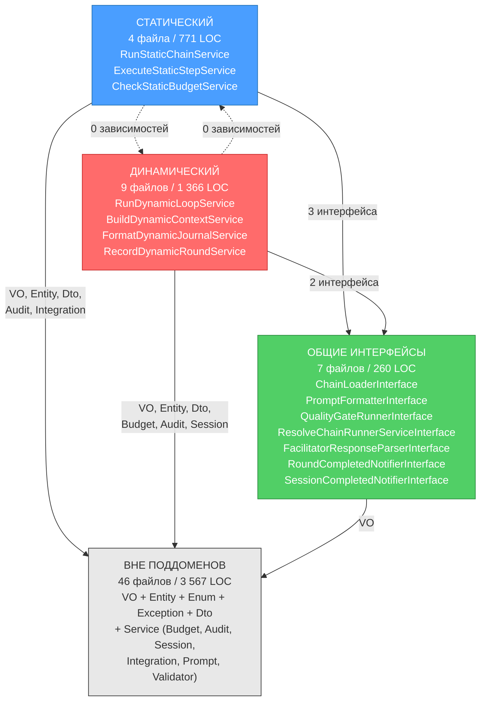
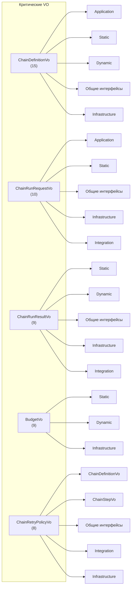

# Инвентаризация доменного модуля Orchestrator

**Дата:** 2026-05-01
**Аналитик:** Шерлок (system_analyst_sherlock)
**Задача:** [TASK-docs-domain-inventory](../../todo/done/TASK-docs-domain-inventory.todo.md)
**Эпик:** EPIC-refactor-orchestrator-p3
**Объект:** `src/Module/ChainDefinition/Domain/`

---

## Сводка

| Метрика | Значение |
|---|---|
| Всего файлов | **66** |
| Всего LOC | **5 964** |
| Средний размер файла | **90 LOC** |
| Медианный размер файла | **37 LOC** |

---

## 1. Распределение по категориям

| Категория | Файлов | LOC | % LOC | Описание |
|---|---|---|---|---|
| Сервис (реализация) | 8 | 2 016 | 33.8% | Доменные сервисы с реализацией |
| Сервис (интерфейс) | 21 | 879 | 14.7% | Интерфейсы доменных сервисов |
| Сервисы (всего) | **29** | **2 895** | **48.5%** | |
| Объекты-значения | 27 | 2 337 | 39.2% | Объекты-значения |
| Сущности | 2 | 594 | 10.0% | Сущности |
| DTO | 2 | 50 | 0.8% | Объекты передачи данных (Data Transfer Objects) |
| Исключения | 4 | 54 | 0.9% | Исключения |
| Перечисления | 2 | 34 | 0.6% | Перечисления |

> **Ключевое наблюдение:** Сервисы и VO составляют 87.7% всей кодовой базы доменного слоя. Сущности составляют всего 10%.

---

## 2. Распределение по поддоменам

Поддомен определяется путём пространства имён внутри `Service/Chain/`:

| Поддомен | Файлов | LOC | % LOC | Описание |
|---|---|---|---|---|
| ВНЕ ПОДДОМЕНОВ | 46 | 3 567 | 59.8% | VO, сущности, перечисления, исключения, DTO, `Service/Budget`, `Service/Chain/Audit`, `Service/Chain/Session`, `Service/Agent`, `Service/Prompt` |
| ДИНАМИЧЕСКИЙ | 9 | 1 366 | 22.9% | `Service/Chain/Dynamic/` — логика динамических цепей |
| СТАТИЧЕСКИЙ | 4 | 771 | 12.9% | `Service/Chain/Static/` — логика статических цепей |
| ОБЩИЕ ИНТЕРФЕЙСЫ | 7 | 260 | 4.4% | `Service/Chain/Shared/` — общие интерфейсы |

> **Ключевое наблюдение:** Код вне поддоменов — «общий котёл» без чётких границ. Более 59% кода не относится к конкретному поддомену. Из них VO занимают 2 337 LOC (40% всего доменного слоя).

---

## 3. Полный каталог файлов

### 3.1. Объекты-значения (27 файлов, 2 337 LOC)

| # | Файл | LOC | Поддомен | Описание |
|---|---|---|---|---|
| 1 | `ValueObject/ChainDefinitionVo.php` | 483 | ВНЕ ПОДДОМЕНОВ | Определение цепи (конфигурация) |
| 2 | `ValueObject/BudgetVo.php` | 208 | ВНЕ ПОДДОМЕНОВ | Бюджет (токены, стоимость) |
| 3 | `ValueObject/ChainStepVo.php` | 195 | ВНЕ ПОДДОМЕНОВ | Определение шага цепи |
| 4 | `ValueObject/ChainRunResultVo.php` | 144 | ВНЕ ПОДДОМЕНОВ | Результат выполнения цепи |
| 5 | `ValueObject/ChainRunRequestVo.php` | 145 | ВНЕ ПОДДОМЕНОВ | Запрос на выполнение цепи |
| 6 | `ValueObject/ChainRetryPolicyVo.php` | 134 | ВНЕ ПОДДОМЕНОВ | Политика повторных попыток |
| 7 | `ValueObject/FixIterationGroupVo.php` | 102 | ВНЕ ПОДДОМЕНОВ | Группа итераций исправления |
| 8 | `ValueObject/PromptConfigurationVo.php` | 103 | ВНЕ ПОДДОМЕНОВ | Конфигурация промпта |
| 9 | `ValueObject/RoleConfigVo.php` | 70 | ВНЕ ПОДДОМЕНОВ | Конфигурация роли агента |
| 10 | `ValueObject/FallbackConfigVo.php` | 53 | ВНЕ ПОДДОМЕНОВ | Конфигурация резервного варианта |
| 11 | `ValueObject/DynamicLoopResultVo.php` | 55 | ВНЕ ПОДДОМЕНОВ | Результат динамического цикла |
| 12 | `ValueObject/ChainSessionStateVo.php` | 61 | ВНЕ ПОДДОМЕНОВ | Состояние сессии цепи |
| 13 | `ValueObject/FacilitatorResponseVo.php` | 62 | ВНЕ ПОДДОМЕНОВ | Ответ фасилитатора |
| 14 | `ValueObject/StaticStepResultVo.php` | 56 | ВНЕ ПОДДОМЕНОВ | Результат шага статической цепи |
| 15 | `ValueObject/SharedChainDefinitionVo.php` | 121 | ВНЕ ПОДДОМЕНОВ | Общее определение цепи |
| 16 | `ValueObject/DynamicChainContextVo.php` | 27 | ВНЕ ПОДДОМЕНОВ | Контекст динамической цепи |
| 17 | `ValueObject/DynamicRoundResultVo.php` | 32 | ВНЕ ПОДДОМЕНОВ | Результат раунда динамической цепи |
| 18 | `ValueObject/DynamicBudgetCheckVo.php` | 25 | ВНЕ ПОДДОМЕНОВ | Результат проверки бюджета |
| 19 | `ValueObject/ChainTurnResultVo.php` | 26 | ВНЕ ПОДДОМЕНОВ | Результат хода цепи |
| 20 | `ValueObject/DynamicTurnResultVo.php` | 26 | ВНЕ ПОДДОМЕНОВ | Результат хода динамической цепи |
| 21 | `ValueObject/StaticChainResultVo.php` | 29 | ВНЕ ПОДДОМЕНОВ | Результат статической цепи |
| 22 | `ValueObject/StaticProcessResultVo.php` | 26 | ВНЕ ПОДДОМЕНОВ | Результат статического процесса |
| 23 | `ValueObject/FacilitatorTurnResultVo.php` | 21 | ВНЕ ПОДДОМЕНОВ | Результат хода фасилитатора |
| 24 | `ValueObject/FallbackAttemptVo.php` | 28 | ВНЕ ПОДДОМЕНОВ | Попытка резервного варианта |
| 25 | `ValueObject/QualityGateResultVo.php` | 29 | ВНЕ ПОДДОМЕНОВ | Результат контроля качества |
| 26 | `ValueObject/QualityGateVo.php` | 35 | ВНЕ ПОДДОМЕНОВ | Определение контроля качества |
| 27 | `ValueObject/ChainConfigViolationVo.php` | 41 | ВНЕ ПОДДОМЕНОВ | Нарушение конфигурации цепи |

### 3.2. Сущности (2 файла, 594 LOC)

| # | Файл | LOC | Поддомен | Описание |
|---|---|---|---|---|
| 1 | `Entity/DynamicLoopExecution.php` | 307 | ВНЕ ПОДДОМЕНОВ | Сущность выполнения динамического цикла |
| 2 | `Entity/StaticChainExecution.php` | 287 | ВНЕ ПОДДОМЕНОВ | Сущность выполнения статической цепи |

### 3.3. Перечисления (2 файла, 34 LOC)

| # | Файл | LOC | Поддомен | Описание |
|---|---|---|---|---|
| 1 | `Enum/ChainStepTypeEnum.php` | 17 | ВНЕ ПОДДОМЕНОВ | Тип шага цепи |
| 2 | `Enum/ChainTypeEnum.php` | 17 | ВНЕ ПОДДОМЕНОВ | Тип цепи (static/dynamic) |

### 3.4. Исключения (4 файла, 54 LOC)

| # | Файл | LOC | Поддомен | Описание |
|---|---|---|---|---|
| 1 | `Exception/OrchestratorException.php` | 12 | ВНЕ ПОДДОМЕНОВ | Базовое исключение модуля |
| 2 | `Exception/NotFoundExceptionInterface.php` | 12 | ВНЕ ПОДДОМЕНОВ | Интерфейс «не найдено» |
| 3 | `Exception/ChainNotFoundException.php` | 15 | ВНЕ ПОДДОМЕНОВ | Цепь не найдена |
| 4 | `Exception/RoleNotFoundException.php` | 15 | ВНЕ ПОДДОМЕНОВ | Роль не найдена |

### 3.5. DTO (2 файла, 50 LOC)

| # | Файл | LOC | Поддомен | Описание |
|---|---|---|---|---|
| 1 | `Dto/ChainResultAuditDto.php` | 31 | ВНЕ ПОДДОМЕНОВ | DTO аудита результата цепи |
| 2 | `Dto/StepAuditStatusDto.php` | 19 | ВНЕ ПОДДОМЕНОВ | DTO статуса аудита шага |

### 3.6. Сервисы — основной поддомен (13 файлов, 1 093 LOC)

#### Service/Budget (1 файл)

| # | Файл | LOC | Тип | Описание |
|---|---|---|---|---|
| 1 | `Service/Budget/CheckDynamicBudgetServiceInterface.php` | 28 | интерфейс | Проверка бюджета динамической цепи |

#### Service/Chain/Audit (2 файла)

| # | Файл | LOC | Тип | Описание |
|---|---|---|---|---|
| 1 | `Service/Chain/Audit/AuditLoggerInterface.php` | 49 | интерфейс | Логирование аудита |
| 2 | `Service/Chain/Audit/AuditLoggerFactoryInterface.php` | 19 | интерфейс | Фабрика логгеров аудита |

#### Service/Chain/ChainDefinitionValidator (1 файл)

| # | Файл | LOC | Тип | Описание |
|---|---|---|---|---|
| 1 | `Service/Chain/ChainDefinitionValidator.php` | 164 | реализация | Валидация определения цепи |

#### Service/Chain/Session (3 файла)

| # | Файл | LOC | Тип | Описание |
|---|---|---|---|---|
| 1 | `Service/Chain/Session/ChainSessionWriterInterface.php` | 105 | интерфейс | Запись состояния сессии |
| 2 | `Service/Chain/Session/ChainSessionReaderInterface.php` | 37 | интерфейс | Чтение состояния сессии |
| 3 | `Service/Chain/Session/ChainSessionLoggerInterface.php` | 32 | интерфейс | Логирование сессии |

#### Service/Agent (1 файл)

| # | Файл | LOC | Тип | Описание |
|---|---|---|---|---|
| 1 | `Service/Agent/RunAgentServiceInterface.php` | 27 | интерфейс | Запуск AI-агента |

#### Service/Prompt (1 файл)

| # | Файл | LOC | Тип | Описание |
|---|---|---|---|---|
| 1 | `Service/Prompt/PromptProviderInterface.php` | 37 | интерфейс | Провайдер промптов |

### 3.7. Сервисы — СТАТИЧЕСКИЙ ПОДДОМЕН (4 файла, 771 LOC)

| # | Файл | LOC | Тип | Описание |
|---|---|---|---|---|
| 1 | `Service/Chain/Static/RunStaticChainService.php` | 404 | реализация | Оркестрация статической цепи |
| 2 | `Service/Chain/Static/ExecuteStaticStepService.php` | 228 | реализация | Исполнение одного шага |
| 3 | `Service/Chain/Static/CheckStaticBudgetService.php` | 102 | реализация | Проверка бюджета статической цепи |
| 4 | `Service/Chain/Static/CheckStaticBudgetServiceInterface.php` | 37 | интерфейс | Интерфейс проверки бюджета |

### 3.8. Сервисы — ДИНАМИЧЕСКИЙ ПОДДОМЕН (9 файлов, 1 366 LOC)

| # | Файл | LOC | Тип | Описание |
|---|---|---|---|---|
| 1 | `Service/Chain/Dynamic/RunDynamicLoopService.php` | 786 | реализация | Главный сервис динамического цикла |
| 2 | `Service/Chain/Dynamic/FormatDynamicJournalService.php` | 122 | реализация | Форматирование журнала |
| 3 | `Service/Chain/Dynamic/BuildDynamicContextService.php` | 112 | реализация | Построение контекста |
| 4 | `Service/Chain/Dynamic/RecordDynamicRoundService.php` | 98 | реализация | Запись раунда |
| 5 | `Service/Chain/Dynamic/RunDynamicLoopAgentServiceInterface.php` | 78 | интерфейс | Запуск агента динамического цикла |
| 6 | `Service/Chain/Dynamic/FormatDynamicJournalServiceInterface.php` | 63 | интерфейс | Интерфейс форматирования журнала |
| 7 | `Service/Chain/Dynamic/BuildDynamicContextServiceInterface.php` | 49 | интерфейс | Интерфейс построения контекста |
| 8 | `Service/Chain/Dynamic/RunDynamicLoopServiceInterface.php` | 28 | интерфейс | Интерфейс запуска динамического цикла |
| 9 | `Service/Chain/Dynamic/RecordDynamicRoundServiceInterface.php` | 30 | интерфейс | Интерфейс записи раунда |

### 3.9. Сервисы — общий поддомен (7 файлов, 260 LOC)

| # | Файл | LOC | Тип | Описание |
|---|---|---|---|---|
| 1 | `Service/Chain/Shared/PromptFormatterInterface.php` | 86 | интерфейс | Форматирование промптов |
| 2 | `Service/Chain/Shared/ResolveChainRunnerServiceInterface.php` | 32 | интерфейс | Определение раннера цепи |
| 3 | `Service/Chain/Shared/ChainLoaderInterface.php` | 35 | интерфейс | Загрузка определения цепи |
| 4 | `Service/Chain/Shared/SessionCompletedNotifierInterface.php` | 29 | интерфейс | Уведомление о завершении сессии |
| 5 | `Service/Chain/Shared/RoundCompletedNotifierInterface.php` | 30 | интерфейс | Уведомление о завершении раунда |
| 6 | `Service/Chain/Shared/QualityGateRunnerInterface.php` | 22 | интерфейс | Запуск контроля качества |
| 7 | `Service/Chain/Shared/FacilitatorResponseParserInterface.php` | 26 | интерфейс | Разбор ответа фасилитатора |

---

## 4. Карта зависимостей между поддоменами

### 4.1. Топология

```
             ┌──────────────┐
             │ВНЕ ПОДДОМЕНОВ│ ← VO, сущности, перечисления, исключения, DTO, Service
             │  46 файлов   │
             │  3 567 LOC   │
             └──────┬───────┘
                    │
          ┌─────────┼──────────┐
          │         │          │
          ▼         ▼          ▼
   ┌────────────┐ ┌──────────┐ ┌─────────────┐
   │   СТАТИЧЕСКИЙ   │ │ОБЩИЕ ИНТ.│ │   ДИНАМИЧЕСКИЙ   │
   │  4 файла   │ │ 7 файлов │ │  9 файлов   │
   │  771 LOC   │ │ 260 LOC  │ │  1 366 LOC  │
   └─────┬──────┘ └────┬─────┘ └──────┬──────┘
         │              │              │
         └─►ОБЩИЕ ИНТЕРФЕЙСЫ◄─┘
```

### 4.2. Таблица перекрёстных ссылок

| Откуда ↓ / Куда → | ВНЕ ПОДДОМЕНОВ | СТАТИЧЕСКИЙ | ДИНАМИЧЕСКИЙ | ОБЩИЕ ИНТЕРФЕЙСЫ |
|---|---|---|---|---|
| **ВНЕ ПОДДОМЕНОВ** | — | — | — | — |
| **СТАТИЧЕСКИЙ** | ✅ (VO, Entity, Dto, Audit, Integration) | — | ❌ **0** | ✅ 3 ссылки |
| **ДИНАМИЧЕСКИЙ** | ✅ (VO, Entity, Dto, Budget, Audit, Session) | ❌ **0** | — | ✅ 2 ссылки |
| **ОБЩИЕ ИНТЕРФЕЙСЫ** | ✅ (VO) | ❌ **0** | ❌ **0** | — |

### 4.3. Детализация перекрёстных ссылок

#### СТАТИЧЕСКИЙ → ОБЩИЕ ИНТЕРФЕЙСЫ (3 ссылки)

| Файл СТАТИЧЕСКИЙ | Зависит от общих интерфейсов |
|---|---|
| `ExecuteStaticStepService.php` | `PromptFormatterInterface` |
| `ExecuteStaticStepService.php` | `QualityGateRunnerInterface` |
| `ExecuteStaticStepService.php` | `ResolveChainRunnerServiceInterface` |

#### ДИНАМИЧЕСКИЙ → ОБЩИЕ ИНТЕРФЕЙСЫ (2 ссылки)

| Файл ДИНАМИЧЕСКИЙ | Зависит от общих интерфейсов |
|---|---|
| `RecordDynamicRoundService.php` | `RoundCompletedNotifierInterface` |
| `RunDynamicLoopService.php` | `FacilitatorResponseParserInterface` |

#### СТАТИЧЕСКИЙ ↔ ДИНАМИЧЕСКИЙ

| Направление | Количество ссылок |
|---|---|
| СТАТИЧЕСКИЙ → ДИНАМИЧЕСКИЙ | **0** |
| ДИНАМИЧЕСКИЙ → СТАТИЧЕСКИЙ | **0** |

> **Вывод:** Прямых зависимостей между статическим и динамическим поддоменами **нет**. Оба поддомена зависят только от общего кода вне поддоменов (VO/Entity/Enum/Exception/Dto) и от общих интерфейсов. Это чистая граница для потенциального разделения.

---

## 5. Таблица «VO → число потребителей» (радиус последствий, радиус влияния)

Ранжирование по количеству потребителей внутри Orchestrator-модуля (Domain + Application + Infrastructure + Integration):

| # | Value Object | Потребители | Радиус влияния | Примечание |
|---|---|---|---|---|
| 1 | `ChainDefinitionVo` | 15 | 🔴 Критический | Ядро конфигурации цепи — используется везде |
| 2 | `ChainRunRequestVo` | 10 | 🔴 Критический | Запрос на выполнение — используется в Application |
| 3 | `ChainRunResultVo` | 9 | 🔴 Критический | Результат выполнения — сквозная структура |
| 4 | `BudgetVo` | 9 | 🔴 Критический | Бюджет — используется в Static, Dynamic, Infrastructure |
| 5 | `ChainRetryPolicyVo` | 8 | 🟡 Высокий | Политика повторных попыток —VO→VO и Service→VO |
| 6 | `ChainStepVo` | 5 | 🟡 Высокий | Шаг цепи — Static + Validator |
| 7 | `DynamicChainContextVo` | 5 | 🟡 Высокий | Контекст Dynamic — Application + Domain |
| 8 | `DynamicRoundResultVo` | 5 | 🟡 Высокий | Результат раунда Dynamic |
| 9 | `FixIterationGroupVo` | 4 | 🟢 Средний | Группа итераций — Static + Infrastructure |
| 10 | `DynamicLoopResultVo` | 4 | 🟢 Средний | Результат Dynamic — Application + Entity |
| 11 | `DynamicBudgetCheckVo` | 4 | 🟢 Средний | Проверка бюджета Dynamic |
| 12 | `FacilitatorResponseVo` | 4 | 🟢 Средний | Ответ фасилитатора — Dynamic + Shared |
| 13 | `ChainTurnResultVo` | 3 | 🟢 Средний | Ход цепи — только Dynamic |
| 14 | `FacilitatorTurnResultVo` | 3 | 🟢 Средний | Ход фасилитатора — только Dynamic |
| 15 | `RoleConfigVo` | 3 | 🟢 Средний | Конфигурация роли — Static + Dynamic |
| 16 | `StaticStepResultVo` | 3 | 🟢 Средний | Результат шага Static |
| 17 | `FallbackConfigVo` | 3 | 🟢 Средний | Резервный вариант — Shared + Infrastructure |
| 18 | `StaticChainResultVo` | 2 | ⚪ Низкий | Результат Static — Application |
| 19 | `QualityGateResultVo` | 2 | ⚪ Низкий | Контроль качества — Shared + Infrastructure |
| 20 | `QualityGateVo` | 2 | ⚪ Низкий | Контроль качества — Shared + Infrastructure |
| 21 | `ChainSessionStateVo` | 2 | ⚪ Низкий | Состояние сессии — Session + Infrastructure |
| 22 | `ChainConfigViolationVo` | 2 | ⚪ Низкий | Нарушение конфигурации — Application |
| 23 | `StaticProcessResultVo` | 1 | ⚪ Низкий | Только RunStaticChainService |
| 24 | `DynamicTurnResultVo` | 1 | ⚪ Низкий | Только RunDynamicLoopService |
| 25 | `PromptConfigurationVo` | 1 | ⚪ Низкий | Только BuildDynamicContextService |
| 26 | `FallbackAttemptVo` | 1 | ⚪ Низкий | Только ExecuteStaticStepService |
| 27 | `SharedChainDefinitionVo` | 0 | ⚪ Не используется | **Нет потребителей!** Кандидат на удаление |

> **Вывод:** 4 VO (`ChainDefinitionVo`, `ChainRunRequestVo`, `ChainRunResultVo`, `BudgetVo`) имеют ≥9 потребителей — изменение любого из них затронет 9–15 файлов. `SharedChainDefinitionVo` не имеет потребителей — потенциально мёртвый код.

---

## 6. Кластерный анализ для разделения

### Кластер 1: Выполнение Static (4 файла, 771 LOC)

| Файл | LOC |
|---|---|
| `RunStaticChainService.php` | 404 |
| `ExecuteStaticStepService.php` | 228 |
| `CheckStaticBudgetService.php` | 102 |
| `CheckStaticBudgetServiceInterface.php` | 37 |

**Зависимости:** общие VO вне поддоменов (`BudgetVo`, `ChainDefinitionVo`, `ChainStepVo`, `ChainRunRequestVo`, `ChainRunResultVo`, `StaticStepResultVo`, `StaticChainResultVo`, `StaticProcessResultVo`, `FixIterationGroupVo`, `RoleConfigVo`, `FallbackAttemptVo`), сущность (`StaticChainExecution`), DTO, аудит, Integration + общие интерфейсы (`PromptFormatterInterface`, `QualityGateRunnerInterface`, `ResolveChainRunnerServiceInterface`).

### Кластер 2: Выполнение Dynamic (9 файлов, 1 366 LOC)

| Файл | LOC |
|---|---|
| `RunDynamicLoopService.php` | 786 |
| `FormatDynamicJournalService.php` | 122 |
| `BuildDynamicContextService.php` | 112 |
| `RecordDynamicRoundService.php` | 98 |
| `RunDynamicLoopAgentServiceInterface.php` | 78 |
| `FormatDynamicJournalServiceInterface.php` | 63 |
| `BuildDynamicContextServiceInterface.php` | 49 |
| `RecordDynamicRoundServiceInterface.php` | 30 |
| `RunDynamicLoopServiceInterface.php` | 28 |

**Зависимости:** общие VO вне поддоменов (`BudgetVo`, `ChainDefinitionVo`, `ChainTurnResultVo`, `DynamicBudgetCheckVo`, `DynamicChainContextVo`, `DynamicLoopResultVo`, `DynamicRoundResultVo`, `DynamicTurnResultVo`, `FacilitatorResponseVo`, `FacilitatorTurnResultVo`, `RoleConfigVo`, `ChainRunResultVo`), сущность (`DynamicLoopExecution`), DTO, Budget, аудит, Session + общие интерфейсы (`FacilitatorResponseParserInterface`, `RoundCompletedNotifierInterface`).

### Кластер 3: Общие интерфейсы (7 файлов, 260 LOC)

Все файлы — интерфейсы. Они зависят только от общих VO вне поддоменов.

### Кластер 4: Код вне поддоменов — общий котёл (46 файлов, 3 567 LOC)

Включает все VO, сущности, перечисления, исключения, DTO, и «остаточные» сервисы (Budget, Audit, Session, ChainDefinitionValidator, Integration, Prompt). Значительная часть — VO (2 337 LOC / 65%).

---

## 7. Mermaid: граф зависимостей (уровень поддоменов)



---

## 8. Mermaid: карта потребителей VO (топ-6 критичных VO)



---

## 9. Ключевые находки

### 🟢 Позитивные
1. **Чистая граница статического ↔ динамического поддоменов:** 0 прямых зависимостей между поддоменами. Оба общаются только через общие VO вне поддоменов и общие интерфейсы.
2. **Общие интерфейсы не зависят ни от статического, ни от динамического поддоменов:** чистый «общий знаменатель».
3. **Интерфейс-ориентированность:** 21 из 29 файлов сервисов — интерфейсы (72%). Конкретных реализаций всего 8.

### 🟡 Точки внимания
1. **Код вне поддоменов — монолитный котёл (3 567 LOC, 59.8%):** VO не распределены по поддоменам. Все 27 VO лежат в общем пространстве имён `Domain/ValueObject/`, хотя 8 из них носят имена с префиксом `Dynamic*` или `Static*`.
2. **RunDynamicLoopService — крупнейший файл (786 LOC):** один сервис содержит 13% всей кодовой базы Domain-слоя.
3. **SharedChainDefinitionVo — 0 потребителей:** потенциально мёртвый код.
4. **4 критических VO** с радиус влияния ≥9: `ChainDefinitionVo` (15), `ChainRunRequestVo` (10), `ChainRunResultVo` (9), `BudgetVo` (9). Любое изменение затрагивает 9–15 файлов.

### 🔴 Архитектурные риски
1. **Высокая связанность через общие VO вне поддоменов:** и статический, и динамический поддомены используют одни и те же VO (`BudgetVo`, `ChainDefinitionVo`). При разделении эти VO придётся либо дублировать, либо выделять в отдельный Shared Kernel.
2. **Budget-интерфейсы расположены вне поддоменов:** `CheckDynamicBudgetServiceInterface` находится вне поддоменов, хотя его единственный потребитель — динамический поддомен.
3. **Session-интерфейсы расположены вне поддоменов, хотя используются статическим и динамическим поддоменами:** `ChainSessionWriterInterface` используется `RecordDynamicRoundService` (Dynamic), а `ChainSessionReaderInterface` — Application-слоем.

---

## 10. Рекомендации для следующих шагов (вне объёма задачи, но отмечены)

> ⚠️ Рекомендации по декомпозиции не входят в объём данной задачи (не будет выполнено в этой задаче). Они будут выполнены в отдельном анализе.

Данный каталог предоставляет данные для:
- AI#11: Декомпозиция RunDynamicLoopService (786 LOC)
- AI#15: Расщепление ChainSessionLogger
- AI#16: Переразложение Shared/ каталога
- AI#17: Физическое разделение StaticExecution в отдельный модуль
