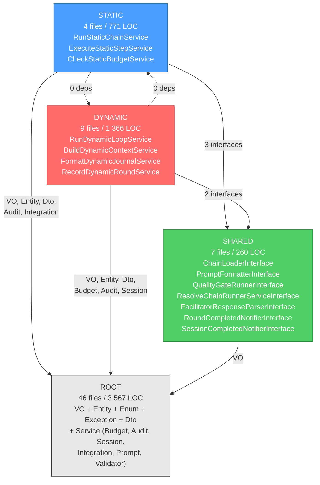
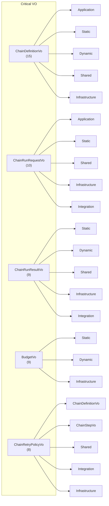

# Domain Inventory: Orchestrator Module

**Дата:** 2026-05-01
**Аналитик:** Шерлок (system_analyst_sherlock)
**Задача:** [TASK-docs-domain-inventory](../../todo/done/TASK-docs-domain-inventory.todo.md)
**Epic:** EPIC-refactor-orchestrator-p3
**Объект:** `src/Module/ChainDefinition/Domain/`

---

## Summary

| Метрика | Значение |
|---|---|
| Всего файлов | **66** |
| Всего LOC | **5 964** |
| Средний размер файла | **90 LOC** |
| Медианный размер файла | **37 LOC** |

---

## 1. Распределение по категориям

| Категория | Файлов | LOC | % LOC | Описание |
|---|---|---|---|---|
| Service (concrete) | 8 | 2 016 | 33.8% | Доменные сервисы с реализацией |
| Service (interface) | 21 | 879 | 14.7% | Интерфейсы доменных сервисов |
| Service (total) | **29** | **2 895** | **48.5%** | |
| ValueObject | 27 | 2 337 | 39.2% | Value Objects |
| Entity | 2 | 594 | 10.0% | Сущности |
| Dto | 2 | 50 | 0.8% | Data Transfer Objects |
| Exception | 4 | 54 | 0.9% | Исключения |
| Enum | 2 | 34 | 0.6% | Перечисления |

> **Ключевое наблюдение:** Services + VO = 87.7% всей кодовой базы Domain-слоя. Entity составляют всего 10%.

---

## 2. Распределение по subdomain

Subdomain определяется namespace-путём внутри `Service/Chain/`:

| Subdomain | Файлов | LOC | % LOC | Описание |
|---|---|---|---|---|
| ROOT | 46 | 3 567 | 59.8% | VO, Entity, Enum, Exception, Dto, Service/Budget, Service/Chain/Audit, Service/Chain/Session, Service/Agent, Service/Prompt |
| DYNAMIC | 9 | 1 366 | 22.9% | `Service/Chain/Dynamic/` — логика динамических цепей |
| STATIC | 4 | 771 | 12.9% | `Service/Chain/Static/` — логика статических цепей |
| SHARED | 7 | 260 | 4.4% | `Service/Chain/Shared/` — общие интерфейсы |

> **Ключевое наблюдение:** ROOT — «общий котёл» без чётких границ. Более 59% кода не относится к конкретному subdomain. Из них VO = 2 337 LOC (40% всего Domain).

---

## 3. Полный каталог файлов

### 3.1. Value Objects (27 файлов, 2 337 LOC)

| # | Файл | LOC | Subdomain | Описание |
|---|---|---|---|---|
| 1 | `ValueObject/ChainDefinitionVo.php` | 483 | ROOT | Определение цепи (конфигурация) |
| 2 | `ValueObject/BudgetVo.php` | 208 | ROOT | Бюджет (tokens, cost) |
| 3 | `ValueObject/ChainStepVo.php` | 195 | ROOT | Определение шага цепи |
| 4 | `ValueObject/ChainRunResultVo.php` | 144 | ROOT | Результат выполнения цепи |
| 5 | `ValueObject/ChainRunRequestVo.php` | 145 | ROOT | Запрос на выполнение цепи |
| 6 | `ValueObject/ChainRetryPolicyVo.php` | 134 | ROOT | Политика retry |
| 7 | `ValueObject/FixIterationGroupVo.php` | 102 | ROOT | Группа итераций исправления |
| 8 | `ValueObject/PromptConfigurationVo.php` | 103 | ROOT | Конфигурация промпта |
| 9 | `ValueObject/RoleConfigVo.php` | 70 | ROOT | Конфигурация роли агента |
| 10 | `ValueObject/FallbackConfigVo.php` | 53 | ROOT | Конфигурация fallback |
| 11 | `ValueObject/DynamicLoopResultVo.php` | 55 | ROOT | Результат динамического цикла |
| 12 | `ValueObject/ChainSessionStateVo.php` | 61 | ROOT | Состояние сессии цепи |
| 13 | `ValueObject/FacilitatorResponseVo.php` | 62 | ROOT | Ответ фасилитатора |
| 14 | `ValueObject/StaticStepResultVo.php` | 56 | ROOT | Результат шага статической цепи |
| 15 | `ValueObject/SharedChainDefinitionVo.php` | 121 | ROOT | Общее определение цепи |
| 16 | `ValueObject/DynamicChainContextVo.php` | 27 | ROOT | Контекст динамической цепи |
| 17 | `ValueObject/DynamicRoundResultVo.php` | 32 | ROOT | Результат раунда динамической цепи |
| 18 | `ValueObject/DynamicBudgetCheckVo.php` | 25 | ROOT | Результат проверки бюджета |
| 19 | `ValueObject/ChainTurnResultVo.php` | 26 | ROOT | Результат хода цепи |
| 20 | `ValueObject/DynamicTurnResultVo.php` | 26 | ROOT | Результат хода динамической цепи |
| 21 | `ValueObject/StaticChainResultVo.php` | 29 | ROOT | Результат статической цепи |
| 22 | `ValueObject/StaticProcessResultVo.php` | 26 | ROOT | Результат статического процесса |
| 23 | `ValueObject/FacilitatorTurnResultVo.php` | 21 | ROOT | Результат хода фасилитатора |
| 24 | `ValueObject/FallbackAttemptVo.php` | 28 | ROOT | Попытка fallback |
| 25 | `ValueObject/QualityGateResultVo.php` | 29 | ROOT | Результат quality gate |
| 26 | `ValueObject/QualityGateVo.php` | 35 | ROOT | Определение quality gate |
| 27 | `ValueObject/ChainConfigViolationVo.php` | 41 | ROOT | Нарушение конфигурации цепи |

### 3.2. Entities (2 файла, 594 LOC)

| # | Файл | LOC | Subdomain | Описание |
|---|---|---|---|---|
| 1 | `Entity/DynamicLoopExecution.php` | 307 | ROOT | Сущность выполнения динамического цикла |
| 2 | `Entity/StaticChainExecution.php` | 287 | ROOT | Сущность выполнения статической цепи |

### 3.3. Enums (2 файла, 34 LOC)

| # | Файл | LOC | Subdomain | Описание |
|---|---|---|---|---|
| 1 | `Enum/ChainStepTypeEnum.php` | 17 | ROOT | Тип шага цепи |
| 2 | `Enum/ChainTypeEnum.php` | 17 | ROOT | Тип цепи (static/dynamic) |

### 3.4. Exceptions (4 файла, 54 LOC)

| # | Файл | LOC | Subdomain | Описание |
|---|---|---|---|---|
| 1 | `Exception/OrchestratorException.php` | 12 | ROOT | Базовое исключение модуля |
| 2 | `Exception/NotFoundExceptionInterface.php` | 12 | ROOT | Интерфейс «не найдено» |
| 3 | `Exception/ChainNotFoundException.php` | 15 | ROOT | Цепь не найдена |
| 4 | `Exception/RoleNotFoundException.php` | 15 | ROOT | Роль не найдена |

### 3.5. DTO (2 файла, 50 LOC)

| # | Файл | LOC | Subdomain | Описание |
|---|---|---|---|---|
| 1 | `Dto/ChainResultAuditDto.php` | 31 | ROOT | DTO аудита результата цепи |
| 2 | `Dto/StepAuditStatusDto.php` | 19 | ROOT | DTO статуса аудита шага |

### 3.6. Services — ROOT (13 файлов, 1 093 LOC)

#### Service/Budget (1 файл)

| # | Файл | LOC | Type | Описание |
|---|---|---|---|---|
| 1 | `Service/Budget/CheckDynamicBudgetServiceInterface.php` | 28 | interface | Проверка бюджета динамической цепи |

#### Service/Chain/Audit (2 файла)

| # | Файл | LOC | Type | Описание |
|---|---|---|---|---|
| 1 | `Service/Chain/Audit/AuditLoggerInterface.php` | 49 | interface | Логирование аудита |
| 2 | `Service/Chain/Audit/AuditLoggerFactoryInterface.php` | 19 | interface | Фабрика логгеров аудита |

#### Service/Chain/ChainDefinitionValidator (1 файл)

| # | Файл | LOC | Type | Описание |
|---|---|---|---|---|
| 1 | `Service/Chain/ChainDefinitionValidator.php` | 164 | concrete | Валидация определения цепи |

#### Service/Chain/Session (3 файла)

| # | Файл | LOC | Type | Описание |
|---|---|---|---|---|
| 1 | `Service/Chain/Session/ChainSessionWriterInterface.php` | 105 | interface | Запись состояния сессии |
| 2 | `Service/Chain/Session/ChainSessionReaderInterface.php` | 37 | interface | Чтение состояния сессии |
| 3 | `Service/Chain/Session/ChainSessionLoggerInterface.php` | 32 | interface | Логирование сессии |

#### Service/Agent (1 файл)

| # | Файл | LOC | Type | Описание |
|---|---|---|---|---|
| 1 | `Service/Agent/RunAgentServiceInterface.php` | 27 | interface | Запуск AI-агента |

#### Service/Prompt (1 файл)

| # | Файл | LOC | Type | Описание |
|---|---|---|---|---|
| 1 | `Service/Prompt/PromptProviderInterface.php` | 37 | interface | Провайдер промптов |

### 3.7. Services — STATIC (4 файла, 771 LOC)

| # | Файл | LOC | Type | Описание |
|---|---|---|---|---|
| 1 | `Service/Chain/Static/RunStaticChainService.php` | 404 | concrete | Оркестрация статической цепи |
| 2 | `Service/Chain/Static/ExecuteStaticStepService.php` | 228 | concrete | Исполнение одного шага |
| 3 | `Service/Chain/Static/CheckStaticBudgetService.php` | 102 | concrete | Проверка бюджета статической цепи |
| 4 | `Service/Chain/Static/CheckStaticBudgetServiceInterface.php` | 37 | interface | Интерфейс проверки бюджета |

### 3.8. Services — DYNAMIC (9 файлов, 1 366 LOC)

| # | Файл | LOC | Type | Описание |
|---|---|---|---|---|
| 1 | `Service/Chain/Dynamic/RunDynamicLoopService.php` | 786 | concrete | Главный сервис динамического цикла |
| 2 | `Service/Chain/Dynamic/FormatDynamicJournalService.php` | 122 | concrete | Форматирование журнала |
| 3 | `Service/Chain/Dynamic/BuildDynamicContextService.php` | 112 | concrete | Построение контекста |
| 4 | `Service/Chain/Dynamic/RecordDynamicRoundService.php` | 98 | concrete | Запись раунда |
| 5 | `Service/Chain/Dynamic/RunDynamicLoopAgentServiceInterface.php` | 78 | interface | Запуск агента динамического цикла |
| 6 | `Service/Chain/Dynamic/FormatDynamicJournalServiceInterface.php` | 63 | interface | Интерфейс форматирования журнала |
| 7 | `Service/Chain/Dynamic/BuildDynamicContextServiceInterface.php` | 49 | interface | Интерфейс построения контекста |
| 8 | `Service/Chain/Dynamic/RunDynamicLoopServiceInterface.php` | 28 | interface | Интерфейс запуска динамического цикла |
| 9 | `Service/Chain/Dynamic/RecordDynamicRoundServiceInterface.php` | 30 | interface | Интерфейс записи раунда |

### 3.9. Services — SHARED (7 файлов, 260 LOC)

| # | Файл | LOC | Type | Описание |
|---|---|---|---|---|
| 1 | `Service/Chain/Shared/PromptFormatterInterface.php` | 86 | interface | Форматирование промптов |
| 2 | `Service/Chain/Shared/ResolveChainRunnerServiceInterface.php` | 32 | interface | Резолв раннера цепи |
| 3 | `Service/Chain/Shared/ChainLoaderInterface.php` | 35 | interface | Загрузка определения цепи |
| 4 | `Service/Chain/Shared/SessionCompletedNotifierInterface.php` | 29 | interface | Уведомление о завершении сессии |
| 5 | `Service/Chain/Shared/RoundCompletedNotifierInterface.php` | 30 | interface | Уведомление о завершении раунда |
| 6 | `Service/Chain/Shared/QualityGateRunnerInterface.php` | 22 | interface | Запуск quality gate |
| 7 | `Service/Chain/Shared/FacilitatorResponseParserInterface.php` | 26 | interface | Парсинг ответа фасилитатора |

---

## 4. Карта зависимостей между subdomain'ами

### 4.1. Топология

```
             ┌──────────────┐
             │     ROOT     │ ← VO, Entity, Enum, Exception, Dto, Service (core)
             │  46 files    │
             │  3 567 LOC   │
             └──────┬───────┘
                    │
          ┌─────────┼──────────┐
          │         │          │
          ▼         ▼          ▼
   ┌────────────┐ ┌──────────┐ ┌─────────────┐
   │   STATIC   │ │  SHARED  │ │   DYNAMIC   │
   │  4 files   │ │ 7 files  │ │  9 files    │
   │  771 LOC   │ │ 260 LOC  │ │  1 366 LOC  │
   └─────┬──────┘ └────┬─────┘ └──────┬──────┘
         │              │              │
         └──────►SHARED◄──────┘
```

### 4.2. Cross-reference таблица

| Откуда ↓ / Куда → | ROOT | STATIC | DYNAMIC | SHARED |
|---|---|---|---|---|
| **ROOT** | — | — | — | — |
| **STATIC** | ✅ (VO, Entity, Dto, Audit, Integration) | — | ❌ **0** | ✅ 3 ссылки |
| **DYNAMIC** | ✅ (VO, Entity, Dto, Budget, Audit, Session) | ❌ **0** | — | ✅ 2 ссылки |
| **SHARED** | ✅ (VO) | ❌ **0** | ❌ **0** | — |

### 4.3. Детализация cross-references

#### STATIC → SHARED (3 ссылки)

| Файл STATIC | Зависит от SHARED |
|---|---|
| `ExecuteStaticStepService.php` | `PromptFormatterInterface` |
| `ExecuteStaticStepService.php` | `QualityGateRunnerInterface` |
| `ExecuteStaticStepService.php` | `ResolveChainRunnerServiceInterface` |

#### DYNAMIC → SHARED (2 ссылки)

| Файл DYNAMIC | Зависит от SHARED |
|---|---|
| `RecordDynamicRoundService.php` | `RoundCompletedNotifierInterface` |
| `RunDynamicLoopService.php` | `FacilitatorResponseParserInterface` |

#### STATIC ↔ DYNAMIC

| Направление | Количество ссылок |
|---|---|
| STATIC → DYNAMIC | **0** |
| DYNAMIC → STATIC | **0** |

> **Вывод:** Прямых зависимостей между Static и Dynamic **нет**. Оба subdomain зависят только от ROOT (VO/Entity/Enum/Exception/Dto) и от SHARED (интерфейсы). Это чистая граница для потенциального split.

---

## 5. Таблица «VO → consumer count» (blast radius)

Ранжирование по количеству потребителей (consumers) внутри Orchestrator-модуля (Domain + Application + Infrastructure + Integration):

| # | Value Object | Consumers | Blast Radius | Примечание |
|---|---|---|---|---|
| 1 | `ChainDefinitionVo` | 15 | 🔴 Critical | Ядро конфигурации цепи — используется везде |
| 2 | `ChainRunRequestVo` | 10 | 🔴 Critical | Запрос на выполнение — используется в Application |
| 3 | `ChainRunResultVo` | 9 | 🔴 Critical | Результат выполнения — сквозная структура |
| 4 | `BudgetVo` | 9 | 🔴 Critical | Бюджет — используется в Static, Dynamic, Infrastructure |
| 5 | `ChainRetryPolicyVo` | 8 | 🟡 High | Политика retry —VO→VO и Service→VO |
| 6 | `ChainStepVo` | 5 | 🟡 High | Шаг цепи — Static + Validator |
| 7 | `DynamicChainContextVo` | 5 | 🟡 High | Контекст Dynamic — Application + Domain |
| 8 | `DynamicRoundResultVo` | 5 | 🟡 High | Результат раунда Dynamic |
| 9 | `FixIterationGroupVo` | 4 | 🟢 Medium | Группа итераций — Static + Infrastructure |
| 10 | `DynamicLoopResultVo` | 4 | 🟢 Medium | Результат Dynamic — Application + Entity |
| 11 | `DynamicBudgetCheckVo` | 4 | 🟢 Medium | Проверка бюджета Dynamic |
| 12 | `FacilitatorResponseVo` | 4 | 🟢 Medium | Ответ фасилитатора — Dynamic + Shared |
| 13 | `ChainTurnResultVo` | 3 | 🟢 Medium | Ход цепи — только Dynamic |
| 14 | `FacilitatorTurnResultVo` | 3 | 🟢 Medium | Ход фасилитатора — только Dynamic |
| 15 | `RoleConfigVo` | 3 | 🟢 Medium | Конфигурация роли — Static + Dynamic |
| 16 | `StaticStepResultVo` | 3 | 🟢 Medium | Результат шага Static |
| 17 | `FallbackConfigVo` | 3 | 🟢 Medium | Fallback — Shared + Infrastructure |
| 18 | `StaticChainResultVo` | 2 | ⚪ Low | Результат Static — Application |
| 19 | `QualityGateResultVo` | 2 | ⚪ Low | Quality Gate — Shared + Infrastructure |
| 20 | `QualityGateVo` | 2 | ⚪ Low | Quality Gate — Shared + Infrastructure |
| 21 | `ChainSessionStateVo` | 2 | ⚪ Low | Состояние сессии — Session + Infrastructure |
| 22 | `ChainConfigViolationVo` | 2 | ⚪ Low | Нарушение конфигурации — Application |
| 23 | `StaticProcessResultVo` | 1 | ⚪ Low | Только RunStaticChainService |
| 24 | `DynamicTurnResultVo` | 1 | ⚪ Low | Только RunDynamicLoopService |
| 25 | `PromptConfigurationVo` | 1 | ⚪ Low | Только BuildDynamicContextService |
| 26 | `FallbackAttemptVo` | 1 | ⚪ Low | Только ExecuteStaticStepService |
| 27 | `SharedChainDefinitionVo` | 0 | ⚪ Unused | **Нет потребителей!** Кандидат на удаление |

> **Вывод:** 4 VO (`ChainDefinitionVo`, `ChainRunRequestVo`, `ChainRunResultVo`, `BudgetVo`) имеют ≥9 потребителей — изменение любого из них затронет 9–15 файлов. `SharedChainDefinitionVo` не имеет потребителей — потенциально мёртвый код.

---

## 6. Кластерный анализ для split

### Кластер 1: Static Execution (4 файла, 771 LOC)

| Файл | LOC |
|---|---|
| `RunStaticChainService.php` | 404 |
| `ExecuteStaticStepService.php` | 228 |
| `CheckStaticBudgetService.php` | 102 |
| `CheckStaticBudgetServiceInterface.php` | 37 |

**Зависимости:** ROOT VO (`BudgetVo`, `ChainDefinitionVo`, `ChainStepVo`, `ChainRunRequestVo`, `ChainRunResultVo`, `StaticStepResultVo`, `StaticChainResultVo`, `StaticProcessResultVo`, `FixIterationGroupVo`, `RoleConfigVo`, `FallbackAttemptVo`), Entity (`StaticChainExecution`), Dto, Audit, Integration + SHARED (`PromptFormatterInterface`, `QualityGateRunnerInterface`, `ResolveChainRunnerServiceInterface`).

### Кластер 2: Dynamic Execution (9 файлов, 1 366 LOC)

| Файл | LOC |
|---|---|
| `RunDynamicLoopService.php` | 786 |
| `FormatDynamicJournalService.php` | 122 |
| `BuildDynamicContextService.php` | 112 |
| `RecordDynamicRoundService.php` | 98 |
| `RunDynamicLoopAgentServiceInterface.php` | 78 |
| `FormatDynamicJournalServiceInterface.php` | 63 |
| `BuildDynamicContextServiceInterface.php` | 49 |
| `RecordDynamicRoundServiceInterface.php` | 30 |
| `RunDynamicLoopServiceInterface.php` | 28 |

**Зависимости:** ROOT VO (`BudgetVo`, `ChainDefinitionVo`, `ChainTurnResultVo`, `DynamicBudgetCheckVo`, `DynamicChainContextVo`, `DynamicLoopResultVo`, `DynamicRoundResultVo`, `DynamicTurnResultVo`, `FacilitatorResponseVo`, `FacilitatorTurnResultVo`, `RoleConfigVo`, `ChainRunResultVo`), Entity (`DynamicLoopExecution`), Dto, Budget, Audit, Session + SHARED (`FacilitatorResponseParserInterface`, `RoundCompletedNotifierInterface`).

### Кластер 3: Shared Interfaces (7 файлов, 260 LOC)

Все файлы — интерфейсы. Зависят только от ROOT VO.

### Кластер 4: ROOT — общий котёл (46 файлов, 3 567 LOC)

Включает все VO, Entity, Enum, Exception, Dto, и «остаточные» сервисы (Budget, Audit, Session, ChainDefinitionValidator, Integration, Prompt). Значительная часть — VO (2 337 LOC / 65%).

---

## 7. Mermaid: Dependency Graph (subdomain level)



---

## 8. Mermaid: VO Consumer Map (top-6 critical VO)



---

## 9. Ключевые находки

### 🟢 Позитивные
1. **Чистая граница Static ↔ Dynamic:** 0 прямых зависимостей между subdomain'ами. Оба общаются только через ROOT VO и SHARED интерфейсы.
2. **SHARED не зависит ни от Static, ни от Dynamic:** чистый «общий знаменатель».
3. **Интерфейс-ориентированность:** 21 из 29 Service-файлов — интерфейсы (72%). Конкретных реализаций всего 8.

### 🟡 Точки внимания
1. **ROOT — монолитный котёл (3 567 LOC, 59.8%):** VO не распределены по subdomain'ам. Все 27 VO лежат в общем namespace `Domain/ValueObject/`, хотя 8 из них носят имена с префиксом `Dynamic*` или `Static*`.
2. **RunDynamicLoopService — крупнейший файл (786 LOC):** один сервис содержит 13% всей кодовой базы Domain-слоя.
3. **SharedChainDefinitionVo — 0 потребителей:** потенциально мёртвый код.
4. **4 критических VO** с blast radius ≥9: `ChainDefinitionVo` (15), `ChainRunRequestVo` (10), `ChainRunResultVo` (9), `BudgetVo` (9). Любое изменение затрагивает 9–15 файлов.

### 🔴 Архитектурные риски
1. **Высокая coupling через ROOT VO:** и Static, и Dynamic используют одни и те же VO (`BudgetVo`, `ChainDefinitionVo`). При split эти VO придётся либо дублировать, либо выделять в отдельный Shared Kernel.
2. **Budget-интерфейсы в ROOT, а не в subdomain:** `CheckDynamicBudgetServiceInterface` лежит в ROOT, хотя его единственный потребитель — Dynamic.
3. **Session-интерфейсы в ROOT, хотя используются Static и Dynamic:** `ChainSessionWriterInterface` используется `RecordDynamicRoundService` (Dynamic), а `ChainSessionReaderInterface` — Application-слоем.

---

## 10. Recommendations for next steps (not in scope, but noted)

> ⚠️ Рекомендации по декомпозиции не входят в scope данной задачи (Won't Have). Они будут выполнены в отдельном анализе.

Данный каталог предоставляет данные для:
- AI#11: Декомпозиция RunDynamicLoopService (786 LOC)
- AI#15: Расщепление ChainSessionLogger
- AI#16: Переразложение Shared/ каталога
- AI#17: Физический split StaticExecution в отдельный модуль
