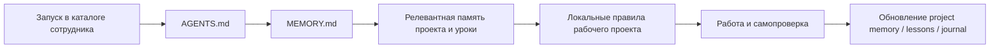

# agents_crew — сравнение подхода с процессом task-orchestrator

**Роль:** Аналитик (Шерлок)  
**Дата:** 2026-08-16  
**Объект:** Rai220/agents_crew — подход «сотрудник — это каталог»  
**Задача:** [TASK-research-agents-crew](../../../todo/done/TASK-research-agents-crew.todo.md)  
**Эпик:** [EPIC-research-approaches-comparison](../../../todo/EPIC-research-approaches-comparison.md)

---

## Сводка

`agents_crew` решает не задачу исполнения цепочек, а задачу преемственности AI-сотрудника
между запусками и проектами. Единица организации — каталог специальности: компактный
`AGENTS.md` задаёт роль и регламент, `memory/MEMORY.md` маршрутизирует к релевантной
памяти, `memory/projects/` хранит невыводимый из кода проектный опыт,
`memory/lessons.md` — обратную связь и выводы из провалов, `journal/` — хронологию.
Харнесс при этом заменяем: состояние остаётся в обычных Markdown-файлах.

**Итоговый вердикт для task-orchestrator:** **adapt** (адаптировать). Наш процесс уже
сильнее в проектных правилах, ролях, скиллах, оркестрации, проверках и человеческом
подтверждении. Но гипотеза тимлида подтверждена: у ролей нет персистентной памяти по
специальности. Целевая доработка — не копировать весь каталог сотрудника, а добавить
управляемый слой памяти роли: индекс + уроки + выборочные заметки по проектам, с
приоритетом конвенций и обязательной проверкой актуальности.

### Легенда оценок

| Символ | Значение | Балл |
|--------|----------|------|
| ✅ | Сильное совпадение с нашим процессом / высокая применимость | 3 |
| ⚠️ | Частичное совпадение, нужен `adapt` (адаптация) | 2 |
| ❌ | Низкая применимость или прямое несоответствие | 1 |

### Итог по 8 критериям

| Критерий | Оценка | Ключевой вывод |
|----------|--------|----------------|
| 1. Тезис / проблема | ✅ 3 | Межсессионная память по специальности закрывает реальный пробел нашего процесса. |
| 2. Модель процесса | ⚠️ 2 | Сильный рабочий протокол, но не полный SDLC/PDLC и без формальных контрольных точек проверки. |
| 3. Уровень автономии | ✅ 3 | Автономия ограничена специализацией, подтверждениями и консультацией глубины 1. |
| 4. Качество / поддерживаемость | ⚠️ 2 | Уроки и регламент накапливают качество, но независимый review и автоматические gates не встроены. |
| 5. Context engineering | ✅ 3 | Индекс и выборочная загрузка дают компактный, изолированный контекст специальности. |
| 6. Артефакты процесса | ✅ 3 | Markdown-артефакты переносимы, версионируемы и разделяют правила, память и хронологию. |
| 7. Маппинг на наш процесс | ✅ 3 | Все семь паттернов имеют явные аналоги или целевые точки адаптации. |
| 8. Применяемость | ✅ 3 | Подход совместим; адаптация памяти роли даёт пользу без замены нашей оркестрации. |
| **Итого** | **22 / 24** | Высокая применимость; два ограничения относятся к полноте SDLC и формальным quality gates. |

## Критерий 1. Тезис и решаемая проблема

### Что утверждает подход

Два распространённых скоупа памяти дают перекос: общая память тредов смешивает
несвязанные контексты, а память внутри одного репозитория не переносит опыт
специалиста между проектами. `agents_crew` помещает память между этими крайностями:
один сотрудник обслуживает несколько проектов своей специальности, а пересекающиеся
проекты получают разные заметки у разных специалистов.

Подход опирается на четыре тезиса:

1. сотрудник — это версия правил и записанного опыта, а не один промпт или сессия;
2. между запусками сохраняется только явно записанное;
3. полезная единица памяти — не факты, читаемые из кода, а причины решений, провалы,
   договорённости и ограничения;
4. память должна быть изолирована по специальности, иначе нерелевантный опыт
   загрязняет контекст.

### Маппинг на task-orchestrator

Наши [роли команды](../../agents/roles/team/) уже изолируют специализацию и стиль, а
[`become-role`](../../agents/skills/become-role/SKILL.md) загружает личность и объявляет
скиллы. [Задачи](../../../todo/) и
[отчёты ролей](../../agents/reports/) сохраняют проектные результаты. Однако ни файл
роли, ни `become-role` не загружают накопленные уроки этой специальности из прошлых
запусков. Поэтому проблема релевантна не теоретически, а как фактический разрыв между
стабильной ролью и накоплением опыта.

**Оценка:** ✅ 3/3. Подход точно формулирует обнаруженный у нас пробел, не отменяя
существующие проектные источники истины.

## Критерий 2. Модель процесса

`agents_crew` задаёт повторяемый цикл работы сотрудника:

При работе в чужом проекте его локальные правила имеют приоритет над домашним
регламентом сотрудника в вопросах кода, тестов и процесса. Перед работой читается
заметка проекта, после — обновляется. Дорогие или необратимые действия требуют
подтверждения. Вопрос вне специальности направляется соседу как консультация, а не
как делегирование изменения файлов.

Это не полный SDLC/PDLC: схема не формализует постановку, архитектурный дизайн,
обязательное независимое ревью, выпуск и наблюдаемость. Это операционный протокол,
который можно вложить в наш более полный цикл
[`task-via-subagents`](../../agents/skills/task-via-subagents/SKILL.md): задача → роль →
реализация → самопроверка → независимое ревью → человеческое решение.

**Оценка:** ⚠️ 2/3. Цикл чтения и записи памяти хорошо определён, но не заменяет
полный жизненный цикл и его контрольные точки.

## Критерий 3. Уровень автономии

Подход не является ни полностью автономной `dark factory` (тёмной фабрикой), ни
ручным чатом без инициативы. Сотрудник самостоятельно читает код и память, запускает
проверки, выполняет обратимые действия и фиксирует знания, но его автономия ограничена:

| Граница | Правило agents_crew | Соответствие у нас |
|---------|---------------------|--------------------|
| Специальность | Не изображать чужую компетенцию; назвать подходящего соседа. | Роль выбирается из [команды](../../agents/roles/team/) по типу задачи. |
| Риск | Перед дорогой или необратимой операцией спросить, назвав цену и время. | [AGENTS.md](../../../AGENTS.md#что-запрещено) требует согласования деструктивных действий и `merge`. |
| Git | Не коммитить, не отправлять ветку и не создавать PR без прямого запроса. | [AGENTS.md / Работа с кодом](../../../AGENTS.md#работа-с-кодом) задаёт те же границы строже. |
| Консультация | Сосед только советует, файлы не меняет; глубина ровно 1. | [`run-subagent`](../../agents/skills/run-subagent/SKILL.md) даёт запуск роли, но не устанавливает общий предел глубины 1. |
| Проверяемость | Ответ соседа — мнение; вызывающий обязан перепроверить. | Наш оркестратор отвечает за review (проверку) и проверки результата. |

Человек инициирует основную задачу и подтверждает рискованные действия. Внутри этих
границ агент действует самостоятельно. Ограничение глубины консультации делает цену
предсказуемой и предотвращает рекурсивное размножение запусков.

**Оценка:** ✅ 3/3. Модель автономии совместима с нашим `lit-factory workflow`
(процессом освещённой фабрики) и даёт полезную явную границу для консультаций.

## Критерий 4. Механизм качества и поддерживаемости

Качество в `agents_crew` создаётся не отдельным проверяющим конвейером, а накоплением
специализированного регламента и обратной связи:

| Механизм | Как работает |
|----------|--------------|
| Регламент специальности | В `AGENTS.md` фиксируются обязательные действия, типовые ошибки, запреты и формат отчёта. |
| `memory/lessons.md` | Поправки создателя, собственные провалы и одобренные неочевидные решения превращаются в повторно используемые правила. |
| Проектная память | Записываются грабли, неудачные попытки и договорённости, которые нельзя надёжно восстановить из кода. |
| Самопроверка | Результат требуется реально запустить или проверить; «должно работать» не считается сдачей. |
| Проверка актуальности | Ссылку из памяти на файл, функцию или флаг надо проверять; расхождение исправляется в заметке. |
| Git-история | Изменение правил и памяти версионируется и может быть проверено ретроспективно. |

Наш процесс дополняет эту модель более сильными механизмами: первичностью
[конвенций](../../conventions/index.md), независимым ревью через
[`task-via-subagents`](../../agents/skills/task-via-subagents/SKILL.md), ролью
[Пуаро](../../agents/roles/team/code_reviewer_backend_puaro.ru.md), обязательными
тестами и статическим анализом из [AGENTS.md](../../../AGENTS.md#тесты-и-проверки).
Поэтому память роли должна быть советующим слоем, а не новым источником истины:
`conventions → project AGENTS.md/task → role rules → role memory`.

**Оценка:** ⚠️ 2/3. Обратная связь повышает качество между запусками, но сам подход
не содержит обязательного независимого ревью и автоматических quality gates
(контрольных проверок).

## Критерий 5. Управление контекстом

### Progressive disclosure (поэтапное раскрытие)

`AGENTS.md` сотрудника читается целиком и намеренно остаётся компактным.
`memory/MEMORY.md` — не сама память, а короткий индекс с «крючками»: агент открывает
только заметки, релевантные текущей работе. Детали проекта, окружения и уроки
разнесены по файлам; журнал не загружается целиком на каждом старте.

Это даёт четыре свойства контекста:

- **изоляция:** ML-опыт не смешивается с бекенд-опытом;
- **выборочность:** индекс не вытесняет задачу полной историей сотрудника;
- **преемственность:** одна специальность переносит уроки между несколькими проектами;
- **проверяемость:** память — обычный текст с датой и источником, а не скрытое состояние
  платформы.

Наш [`become-role`](../../agents/skills/become-role/SKILL.md) реализует похожую
двухступенчатую загрузку для роли и скиллов: роль читается целиком, а `SKILL.md`
подгружается только при совпадении задачи с описанием. Но третьего слоя — индекса
памяти специальности — нет. [Отчёты ролей](../../agents/reports/) можно найти вручную,
однако они не объявлены ролью и не выбираются через компактный индекс при старте.

**Оценка:** ✅ 3/3. Поэтапная загрузка хорошо дополняет наш существующий механизм
роль → подходящие скиллы уровнем роль → релевантная память.

## Критерий 6. Артефакты процесса

| Артефакт agents_crew | Назначение | Ближайший артефакт task-orchestrator | Различие |
|----------------------|------------|--------------------------------------|----------|
| `crew_<name>/AGENTS.md` | Идентичность, специализация, обязательный регламент | [Файл роли](../../agents/roles/team/system_analyst_sherlock.ru.md) + [корневой AGENTS.md](../../../AGENTS.md) + [скиллы](../../agents/skills/) | У нас правила разнесены и имеют более явную иерархию. |
| `CREW.md` | Состав, зоны ответственности, пересечения проектов | [AGENTS.md / Роль](../../../AGENTS.md#роль), файлы ролей | Нет единой таблицы проектных скоупов ролей; для текущего одного проекта она не обязательна. |
| `memory/MEMORY.md` | Компактный индекс релевантной памяти | Прямого аналога нет | Главный gap (пробел). |
| `memory/projects/*.md` | Причины решений, грабли, попытки, договорённости по проекту глазами специальности | `todo/`, `docs/research/`, [отчёты ролей](../../agents/reports/) | Наши записи ориентированы на задачу/запуск, а не на накопленный опыт специальности. |
| `memory/lessons.md` | Обратная связь и устойчивые уроки роли | [team-retro](../../agents/team-retro/) | Ретро описывает командный процесс и конкретные инциденты, не загружается ролью как её память. |
| `memory/stack.md` | Окружение и правила обращения с доступами | [AGENTS.md / секреты](../../../AGENTS.md#работа-с-секретами), `.env.local`, проектная документация | Дублировать секретный регламент по ролям опасно; у нас источник истины уже централизован. |
| `journal/YYYY-MM.md` | Хронология дорогих разборов и отрицательных результатов | `docs/agents/reports/*`, `team-retro/*`, `var/log/*` | Логи не являются отобранным знанием; отчёты и ретро уже дают проверяемую историю. |

Артефакты `agents_crew` переносимы через `git clone`, версионируемы и не зависят от
формата сессии конкретного харнесса. Однако версия в Git не гарантирует истинность:
сам источник прямо признаёт протухание памяти и требует проверять ссылки перед
действием. Для нас это особенно важно, потому что память не должна отменять
первичность [конвенций](../../conventions/index.md).

**Оценка:** ✅ 3/3. Разделение правил, индекса, устойчивой памяти и хронологии чёткое;
часть артефактов уже покрыта сильнее, а индекс и память специальности отсутствуют.

## Критерий 7. Маппинг на наш процесс

| Паттерн agents_crew | Наш артефакт | Вердикт | Effort (усилия) |
|---------------------|--------------|---------|-----------------|
| (а) Роль-каталог с регламентом | [Роли](../../agents/roles/team/) + [`become-role`](../../agents/skills/become-role/SKILL.md) + [скиллы](../../agents/skills/) + [корневой AGENTS.md](../../../AGENTS.md) | **adapt** — сохранить централизованные конвенции и скиллы, но дать роли логический каталог/манифест, объявляющий её память; не копировать общие правила в каждый каталог. | Medium |
| (б) `memory/lessons.md` | Частично: [team-retro](../../agents/team-retro/) и точечные правки ролей/AGENTS.md | **adapt** — завести уроки по специальности с датой, источником, областью действия и ссылкой на породивший отчёт; запретить переопределять конвенции. | Medium |
| (в) `memory/projects/` | [Задачи](../../../todo/), [research](../), [отчёты ролей](../../agents/reports/) | **adapt** — хранить только невыводимые из репозитория причины, провалы и договорённости глазами роли; для одного проекта начать с одного компактного файла, а не копировать задачи. | Medium |
| (г) `memory/MEMORY.md`-индекс | Прямого аналога нет; ближайший механизм — объявления скиллов в [`become-role`](../../agents/skills/become-role/SKILL.md) | **adopt** — добавить компактный индекс с описанием и датой; детали загружать только по релевантности. | Low |
| (д) `journal/` | [Отчёты ролей](../../agents/reports/), [team-retro](../../agents/team-retro/), технические `var/log/` | **reject** как новый параллельный журнал — он дублирует существующую историю и увеличивает расхождения. Устойчивый урок извлекать из отчёта/ретро в память роли со ссылкой на источник. | None |
| (е) Консультация соседа | [`run-subagent`](../../agents/skills/run-subagent/SKILL.md), [`task-via-subagents`](../../agents/skills/task-via-subagents/SKILL.md) | **adapt** — явно отделить read-only consultation (консультацию без правок) от делегирования, ограничить глубину 1 по умолчанию и обязать вызывающего перепроверять ответ. | Low |
| (ж) Файловый мета-харнес | [`run-subagent`](../../agents/skills/run-subagent/SKILL.md), `AgentRunner` в [архитектуре](../../guide/architecture.md), [omnigent comparison](../framework-comparisons/omnigent-comparison.md) | **adapt** — принять переносимый файловый контракт роли/памяти, но не заменять им программный слой retry, timeout, JSONL, gates и runner profiles. | Medium |

### Сопоставление двух мета-харнесов

`agents_crew` является **файловым мета-харнесом**: он стандартизует входной контекст
и состояние, а запуск, повторы, таймауты и инструменты оставляет выбранному CLI.
[Omnigent](../framework-comparisons/omnigent-comparison.md) и task-orchestrator
представляют **программный мета-харнес**: унифицируют исполнителей, сессии, политики,
изоляцию или контроль цепочки.

| Свойство | agents_crew | task-orchestrator / omnigent-класс |
|----------|-------------|--------------------------------------|
| Что стандартизуется | Правила, память, структура файлов | Протокол запуска, состояние исполнения, инструменты, политики |
| Переносимость | Высокая: Markdown + Git, слабая зависимость от раннера | Требует совместимого программного рантайма и контракта раннера |
| Надёжность исполнения | Делегирована конкретному харнессу | Таймауты, retry, gates, журналы и маршрутизация реализуются программно |
| Персистентное знание роли | Явно является ядром | Не следует автоматически из унификации раннеров |

Это комплементарные уровни. Переносимая файловая память может быть входным слоем
нашего `AgentRunner`, но не альтернативой ему.

**Оценка:** ✅ 3/3. Все паттерны сопоставлены с конкретными артефактами; главный
новый слой — память специальности, а не новая оркестрация.

## Проверка гипотезы о персистентной памяти ролей

**Вердикт:** гипотеза **подтверждена**.

Факты по состоянию репозитория на 2026-08-16:

1. В [каталоге ролей](../../agents/roles/team/) находятся плоские `*.ru.md`-файлы с
   personality (личностью), expertise (экспертизой), описанием работы и перечнем
   скиллов. Рядом с ролью нет `memory/`, `lessons.md`, индекса или проектных заметок.
2. [`become-role`](../../agents/skills/become-role/SKILL.md) требует прочитать роль
   целиком и объявляет доступные скиллы. Он не ищет и не загружает память прошлых
   запусков.
3. [`run-subagent`](../../agents/skills/run-subagent/SKILL.md) запускает роль в
   изолированном/эфемерном контексте и хранит технические логи в
   `var/log/watch-subagent/`. Эти логи нужны для диагностики запуска, не являются
   отобранными уроками специальности и не загружаются следующим агентом.
4. [Отчёты ролей](../../agents/reports/) сохраняют результаты отдельных запусков, но
   не имеют ролевого индекса знаний и не объявлены обязательным стартовым контекстом.
5. [Командные ретроспективы](../../agents/team-retro/) действительно содержат ценные
   уроки и оценки отдельных ролей, но их единица — задача/инцидент и процесс команды.
   Например, правила после инцидента могут попасть в корневой `AGENTS.md`, однако нет
   механизма извлечь все устойчивые уроки Аналитика или Бэкендера и загрузить их при
   следующем входе в эту роль.
6. [Конвенции](../../conventions/index.md) являются долговременной нормативной памятью
   проекта, но это общий источник истины по архитектуре и коду, а не эмпирическая
   память конкретной специальности о неудачных попытках и обратной связи.

Следовательно, у нас есть **персистентные проектные артефакты**, но нет
**персистентной памяти по специальности** в смысле `agents_crew`.

**Рекомендация:** отдельной задачей спроектировать минимальный прототип для 1–2 ролей:

- `MEMORY.md` как короткий индекс, читаемый после файла роли;
- `lessons.md` с полями «правило / почему / область действия / источник / дата /
  проверить после»;
- `projects/task-orchestrator.md` только для невыводимых из кода причин, провалов и
  договорённостей;
- лимит размера стартового индекса и выборочная загрузка деталей;
- явная иерархия: конвенции и проектные правила выше памяти роли;
- периодическая ревизия устаревших записей владельцем роли.

## Критерий 8. Применяемость и итоговый вердикт

### Что мы уже делаем

- роли имеют чёткую специализацию, личность, скиллы и критерии качества;
- корневой `AGENTS.md`, конвенции и проектная задача задают явные источники истины;
- `become-role` реализует выборочную загрузку скиллов по описаниям;
- `run-subagent` позволяет вызвать другого специалиста в отдельном контексте;
- задачи, отчёты и ретроспективы переживают сессии и дают проверяемую историю;
- программный оркестратор добавляет retry (повторы), timeout (таймауты), quality gates
  (контрольные проверки), JSONL и предсказуемые цепочки — того в `agents_crew` нет.

### Что стоит усилить

| Gap (пробел) | Рекомендация | Effort |
|--------------|--------------|--------|
| Нет памяти по специальности | Пилот индекса, уроков и одной проектной заметки для 1–2 ролей | Medium |
| Ролевые отчёты трудно превратить в следующий стартовый контекст | Добавить процесс извлечения устойчивого урока из report/retro в память роли | Medium |
| Консультация и делегирование формально не разделены | Описать read-only consultation, глубину 1 и ответственность вызывающего за проверку | Low |
| Нет жизненного цикла памяти | Определить владельца, дату пересмотра, лимит размера и правила удаления/архивации | Medium |

### Что отвергнуть

| Идея | Причина |
|------|---------|
| Копировать общий `AGENTS.md` и конвенции в каждый каталог роли | Дублирование создаст конкурирующие источники истины и рассинхронизацию. |
| Загружать всю память и все ретро на каждом старте | Контекст раздуется и вытеснит текущую задачу; нужен короткий индекс и выборка. |
| Создавать новый `journal/` параллельно отчётам и ретро | История раздвоится; полезное знание должно ссылаться на существующий первичный отчёт. |
| Считать память истинной без перепроверки | Файл может протухнуть; конвенции, текущий код и проектные правила имеют приоритет. |
| Заменять `AgentRunner` файловой схемой | Файлы не обеспечивают retry, timeout, audit trail (журнал исполнения) и quality gates. |

**Итоговый вердикт:** **adapt**. Заимствовать модель памяти по специальности и
поэтапной загрузки, встроив её в существующую иерархию ролей/скиллов/конвенций.
Не переносить дублирующий журнал и не подменять программную оркестрацию файловым
мета-харнесом.

**Оценка:** ✅ 3/3. Польза высокая, границы адаптации понятны, внедрение может быть
изолировано в отдельной задаче без изменения текущего исследования.

## Риски внедрения

| Риск | Последствие | Контрмера |
|------|-------------|------------|
| Устаревание памяти | Агент применяет правило к уже изменившемуся коду или процессу | Поле `updated/review_after`, проверка ссылок перед действием, регулярная ревизия |
| Конфликт с конвенциями | Эмпирический урок закрепляет архитектурный долг | Явный приоритет конвенций; конфликт помечается и выносится на review, а не исполняется |
| Раздувание стартового контекста | Текущая задача получает меньше полезного контекста | Компактный индекс, лимит размера, загрузка деталей только по релевантности |
| Дублирование задач/отчётов | Несколько файлов расходятся и теряют источник | В памяти хранить краткий вывод и ссылку на первичный артефакт, не его копию |
| Непроверенная обратная связь | Ситуативное пожелание превращается в глобальное правило роли | Поля «область действия» и «источник», подтверждение владельца роли для глобальных уроков |
| Чувствительные данные | Память случайно сохраняет токен, путь к секрету или внутренние данные | Следовать [регламенту секретов](../../../AGENTS.md#работа-с-секретами), не хранить значения секретов, проверять diff |
| Конкурентная запись | Два агента одновременно меняют один файл памяти | Один владелец изменения/ветка, маленькие атомарные правки, review конфликтов |

## Источники

1. Rai220 — [agents_crew](https://github.com/Rai220/agents_crew) — основной
   первоисточник; локальный snapshot изучен в `/tmp/agents_crew`.
2. [README agents_crew](https://github.com/Rai220/agents_crew/blob/main/README.md) —
   тезис, структура сотрудника, память по специальности, мета-харнес и ограничения.
3. [Корневой AGENTS.md agents_crew](https://github.com/Rai220/agents_crew/blob/main/AGENTS.md) —
   запуск, консультации, процедура найма и общие границы автономии.
4. [Шаблон сотрудника](https://github.com/Rai220/agents_crew/tree/main/crew_template) и
   примеры `crew_lora`, `crew_steve`, `crew_alfred` — протокол памяти, регламенты и
   разные единицы проектного знания.
5. Локальные источники task-orchestrator: [AGENTS.md](../../../AGENTS.md),
   [роли](../../agents/roles/team/), [скиллы](../../agents/skills/),
   [ретроспективы](../../agents/team-retro/), [конвенции](../../conventions/index.md),
   [сравнение omnigent](../framework-comparisons/omnigent-comparison.md).
