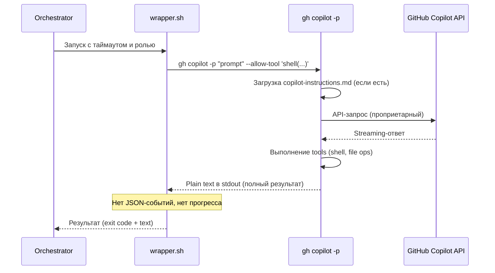

# GitHub Copilot CLI — Исследование для интеграции как сабагент

**Роль:** Аналитик (Шерлок)
**Дата:** 2026-05-10
**Объект:** GitHub Copilot CLI (`gh copilot`, проприетарный)
**Задача:** [TASK-research-copilot-cli](../../../todo/done/TASK-research-copilot-cli.todo.md)

---

## Сводка

GitHub Copilot CLI — проприетарный терминальный AI-coding-agent от GitHub (Microsoft), дистрибутируемый как бинарник через `gh copilot`. Не является npm/pip-пакетом, не имеет открытого репозитория. Агент эволюционировал из простого `gh copilot suggest/explain` (shell-ассистент) в полноценный coding agent с поддержкой `-p` (prompt) и `--allow-tool` (управление permissions). Требует подписку GitHub Copilot. В данном отчёте оценивается пригодность агента для запуска как локального сабагента с нашей системой ролей и скиллов.

> **Примечание:** Бинарник Copilot CLI не установлен в рабочем окружении. Исследование базируется на официальной документации GitHub, `gh copilot --help` (gh v2.87.3) и анализе публично доступной информации. Некоторые детали (JSON-формат вывода, точная телеметрия) могут требовать верификации при установке.

---

## Критерий 1. Системный промпт

### Возможности

| Механизм | Поведение |
|----------|-----------|
| `.github/copilot-instructions.md` | **Дополнение** к системному промпту на уровне репозитория. Автообнаружение при запуске в git-репозитории. |
| `copilot-instructions.md` (в корне проекта) | Альтернативная локация — работает аналогично `.github/`. |
| CLI-флаг замены (`--system-prompt`) | ❌ **Не поддерживается.** Нет аналога Pi `--system-prompt`. |
| CLI-флаг дополнения (`--append-system-prompt`) | ❌ **Не поддерживается.** Нет аналога Pi `--append-system-prompt`. |
| Environment variable | ❌ Не обнаружено переменных для кастомизации системного промпта. |
| Конфигурационный файл (глобальный) | ❌ Нет аналога `.pi/agent/SYSTEM.md` или `~/.codex/config.toml`. |

### Описание

GitHub Copilot CLI не предоставляет CLI-механизмов для замены или дополнения системного промпта. Единственный доступный механизм — файл `copilot-instructions.md` в проекте, который **дополняет** (append), но не **заменяет** базовый системный промпт. Базовый промпт — проприетарный и недоступен для редактирования.

### Сравнение с Pi и Codex

| Аспект | Pi | Codex CLI | Copilot CLI |
|--------|-----|-----------|-------------|
| Полная замена через CLI | ✅ `--system-prompt` | ✅ `model_instructions_file` | ❌ Нет |
| Дополнение через CLI | ✅ `--append-system-prompt` | ❌ Нет | ❌ Нет |
| Проектный файл инструкций | `.pi/SYSTEM.md` | `.codex/config.toml` | `.github/copilot-instructions.md` |
| Глобальный файл инструкций | `~/.pi/agent/SYSTEM.md` | `~/.codex/config.toml` | ❌ Нет |

### Оценка: ⚠️ Частичная поддержка

Единственный механизм кастомизации — `copilot-instructions.md` в проекте. Нет ни CLI-флагов для замены/дополнения промпта, ни глобального конфигурационного файла. Невозможно программно задать системный промпт при запуске как сабагент.

---

## Критерий 2. Промпт агента / Роль

### Подход

| Механизм | Описание |
|----------|----------|
| `-p "prompt"` | Передача промпта агента через CLI-аргумент. |
| `--allow-tool 'shell(...)'` | Управление доступными инструментами. |
| User prompt (stdin) | Промпт через pipe/stdin — **не подтверждено** для agent mode. |
| Профили / роли | ❌ **Не поддерживается.** Нет аналога Codex `-p/--profile`. |
| Инъекция файла роли | ❌ **Нет прямого механизма.** |

### Инъекция роли

Поскольку нет `--system-prompt`, `--append-system-prompt` или профиля, единственный путь инъекции роли — через **user prompt**:

```bash
# Подход через user prompt (единственная опция)
gh copilot -p "Возьми на себя роль из файла: docs/agents/roles/team/backend_developer_levsha.ru.md. Выполни задачу: todo/TASK-xxx.todo.md."
```

Однако в отличие от Pi (где роль инжектируется в system prompt через `--append-system-prompt`), здесь роль передаётся как user instruction. Это **менее надёжно** — модель может игнорировать или искажать роль, особенно при длинных задачах.

### Оценка: ⚠️ Частичная поддержка

Промпт передаётся через `-p`, но нет механизма инъекции в system prompt. Роль инжектируется через user prompt — тот же подход, что и у Codex CLI, но без профилей (`-p/--profile`), которые есть у Codex. Менее гибко, чем Pi (`--append-system-prompt`).

---

## Критерий 3. Скиллы

### Возможности

| Механизм | Поддержка |
|----------|-----------|
| Agent Skills standard (`SKILL.md`) | ❌ **Не поддерживается.** |
| CLI-флаг `--skill` | ❌ **Не поддерживается.** |
| Автосканирование `.agents/skills/` | ❌ **Не поддерживается.** |
| Кастомная директория скиллов | ❌ **Не поддерживается.** |
| Плагины / extensions | ❌ Copilot CLI не имеет системы плагинов. |
| `--allow-tool` | Частичный аналог — управляет доступными shell-инструментами. |

### Описание

GitHub Copilot CLI **не реализует** Agent Skills standard. Нет механизма подключения файлов `SKILL.md`, каталогов скиллов или расширений. Единственный инструмент управления — `--allow-tool`, ограничивающий shell-команды (например, `--allow-tool 'shell(git)'`).

### Разные скиллы разным ролям

❌ Невозможно. Нет механизма управления скиллами.

### Оценка: ❌ Не поддерживается

Copilot CLI не имеет системы скиллов. `--allow-tool` — единственный механизм фильтрации инструментов, но он управляет shell-доступом, не скиллами. Для нашей системы скиллов (`docs/agents/skills/`) — неприменимо.

---

## Критерий 4. AGENTS.md (контекстные файлы)

### Возможности

| Механизм | Поведение |
|----------|-----------|
| `copilot-instructions.md` | ✅ Автообнаружение в `.github/` или корне проекта. Дополняет системный промпт. |
| `AGENTS.md` | ❌ **Не поддерживается.** GitHub Copilot использует только `copilot-instructions.md`. |
| `CLAUDE.md` | ❌ Не поддерживается. |
| `.cursorrules` | ❌ Не поддерживается. |
| CLI-флаг отключения | ❌ **Не обнаружено.** Нет аналога Pi `--no-context-files`. |

### Описание

GitHub Copilot CLI загружает **только** `copilot-instructions.md` из `.github/` или корня проекта. Файлы `AGENTS.md` и `CLAUDE.md` не распознаются. Нет CLI-флага для отключения загрузки контекстных файлов.

### Наша ситуация

Наш проект использует `AGENTS.md` в корне. Copilot CLI **не загрузит** его автоматически. Для передачи контекста проекта необходимо:

1. **Дублировать** содержимое `AGENTS.md` в `copilot-instructions.md` — ручная синхронизация.
2. **Включить** инструкцию в user prompt: `@AGENTS.md` (если поддерживается) или содержимое файла.
3. **Не использовать** автообнаружение — полагаться на `-p` prompt.

### Оценка: ⚠️ Частичная поддержка

Только `copilot-instructions.md` поддерживается из коробки. `AGENTS.md` не распознаётся — требует дублирования или ручной инъекции. В отличие от Pi и Codex, которые автоматически загружают `AGENTS.md`.

---

## Критерий 5. Стандартная папка `.agents/skills/`

### Автосканирование

| Локация | Поддержка сканирования |
|---------|----------------------|
| `.agents/skills/` | ❌ Не поддерживается |
| `.github/skills/` | ❌ Не поддерживается |
| `docs/agents/skills/` | ❌ Не поддерживается |
| Любая кастомная директория | ❌ Не поддерживается |

### Описание

Copilot CLI не сканирует директории скиллов. Система скиллов (`SKILL.md`, auto-discovery) отсутствует полностью. Это фундаментальное ограничение — Copilot CLI не спроектирован для расширяемости через скиллы.

### Оценка: ❌ Не поддерживается

Стандарт `.agents/skills/` не поддерживается. Никакой механизм автообнаружения или явной загрузки скиллов отсутствует.

---

## Критерий 6. Запуск как сабагент (JSON-режим)

### Возможности

| Опция | Поведение |
|-------|-----------|
| `gh copilot -p "prompt"` | Выполнение промпта и вывод результата. |
| `--allow-tool 'shell(...)'` | Управление доступными инструментами. Пример: `--allow-tool 'shell(git)'`, `--allow-tool 'shell(echo)'`. |
| JSON-режим (`--json`, `--output-format json`) | ❌ **Не подтверждено.** Нет документированного флага для JSON/JSONL-вывода. |
| Ephemeral-режим | ⚠️ Copilot CLI не имеет явной концепции сессий. Каждый запуск `-p` — stateless. |
| Non-interactive режим | ✅ `-p` выполняет один промпт и завершается — по сути, non-interactive. |
| Контроль таймаутов | ❌ Нет встроенных таймаутов. Требуется `timeout` оболочка. |
| Pipe-управление | ❌ Не подтверждено. |
| Структурированный результат | ❌ Нет аналога `--output-schema` (Codex) или `--output-last-message`. |

### Формат вывода

Вывод `gh copilot -p` — **plain text** в stdout. Нет документированного JSON/JSONL-формата. Для программного парсинга результата пришлось бы парсить текстовый вывод, что хрупко и ненадёжно.

### Контроль таймаутов

Встроенных таймаутов нет. Внешний контроль через `timeout`:

```bash
timeout 600 gh copilot -p "Task prompt" --allow-tool 'shell(git)' || echo "TIMEOUT"
```

Для полноценного контроля (stall detection, soft/hard timeout) требуется wrapper, но без JSON-стриминга wrapper не может отслеживать прогресс в реальном времени.

### Mermaid-диаграмма потока данных



### Сравнение с Pi

| Аспект | Pi | Copilot CLI |
|--------|-----|-------------|
| JSON-режим | ✅ `--mode json`, JSONL-стриминг | ❌ Только plain text |
| Ephemeral | ✅ `--no-session` | ⚠️ Stateless по дизайну |
| Tool telemetry | ✅ `tool_execution_*` events | ❌ Нет |
| Message telemetry | ✅ `message_*` events | ❌ Нет |
| Таймауты | ✅ Встроенные в `watch-subagent.sh` | ❌ Только внешний `timeout` |
| Pipe | ✅ Named pipe для I/O | ❌ Только stdout |
| Структурированный вывод | ✅ JSONL events + text | ❌ Plain text only |

### Оценка: ⚠️ Частичная поддержка

Copilot CLI поддерживает non-interactive запуск через `-p`, но **полностью lacks JSON/JSONL-вывод**. Невозможно отслеживать прогресс, извлекать структурированные события или управлять таймаутами на уровне событий. Для запуска как сабагент — критический недостаток. Сравнение: Pi и Codex CLI имеют JSON/JSONL-режимы, Qwen Code и Gemini CLI тоже.

---

## Критерий 7. Токены и стоимость

### Доступные метрики

| Метрика | Доступность | Описание |
|---------|-------------|----------|
| Токены input/output | ❌ CLI не выводит | Нет телеметрии в stdout |
| Стоимость за сессию | ❌ CLI не выводит | Нет расчёта стоимости |
| Контекстное окно | ❌ CLI не выводит | Не отображается |
| Rate limits | ⚠️ Через GitHub UI | Видны в настройках Copilot |
| Использование подписки | ⚠️ Через GitHub UI | Monthly usage в аккаунте |

### Описание

Copilot CLI **не выводит** метрики потребления токенов или стоимости в stdout. Использование отслеживается на уровне GitHub-аккаунта через веб-интерфейс. Для программного извлечения телеметрии — нет API.

### Сравнение с Pi и Codex

| Аспект | Pi | Codex CLI | Copilot CLI |
|--------|-----|-----------|-------------|
| Токены в CLI output | ✅ JSONL `usage` | ⚠️ TUI status line | ❌ Нет |
| Стоимость ($) | ✅ `cost` в JSONL | ❌ Только лимиты | ❌ Нет |
| Per-turn телеметрия | ✅ `message_end` | ❌ | ❌ Нет |
| Программный доступ | ✅ pipe + jq | ⚠️ | ❌ Нет |

### Оценка: ❌ Не поддерживается

Телеметрия токенов и стоимости полностью отсутствует в CLI. Использование отслеживается только на стороне GitHub (веб-интерфейс). Невозможно программно извлечь метрики за сессию.

---

## Критерий 8. Free tier

### GitHub Copilot Free

GitHub предлагает бесплатный тариф **Copilot Free** с ограничениями:

| Аспект | Copilot Free | Copilot Pro ($19/мес) | Copilot Pro+ ($39/мес) |
|--------|-------------|----------------------|------------------------|
| Completions | 2 000/мес | Безлимит | Безлимит |
| Chat messages | 50/мес | Безлимит | Безлимит |
| Claude модели | ❌ | ✅ | ✅ |
| Agent mode | ⚠️ Ограниченный | ✅ | ✅ |
| Coding agent (SaaS) | ❌ | ❌ | ✅ |

### Бесплатные модели

Copilot CLI использует модели GitHub (OpenAI GPT-based). **Нет бесплатного доступа к моделям через Copilot CLI без подписки.**

| Источник | Бесплатно |
|----------|-----------|
| GitHub Copilot Free | ⚠️ Ограниченный (2000 completions + 50 chat/мес) |
| BYOK (свой API-ключ) | ❌ Не поддерживается |
| Локальные модели (Ollama) | ❌ Не поддерживается |

### Сравнение с Pi

| Аспект | Pi | Copilot CLI |
|--------|-----|-------------|
| Бесплатный CLI | ✅ MIT, полностью бесплатный | ⚠️ Требует Copilot подписку |
| Бесплатные модели | ✅ Gemini free, Ollama, LM Studio | ⚠️ Copilot Free (ограниченный) |
| Локальные модели | ✅ Ollama, LM Studio, vLLM | ❌ Нет |

### Оценка: ⚠️ Частичная поддержка

Copilot Free даёт ограниченный доступ, но для полноценного использования как coding agent требуется платная подписка ($19–$39/мес). Нет BYOK и локальных моделей — полная зависимость от GitHub.

---

## Критерий 9. Провайдеры и модели

### Поддерживаемые провайдеры

**Единственный провайдер: GitHub (Microsoft)**

Copilot CLI работает **исключительно** с моделями GitHub Copilot. Это проприетарный API, не совместимый с OpenAI API.

| Провайдер | Поддержка | Примечание |
|-----------|-----------|------------|
| GitHub Copilot (OpenAI GPT) | ✅ | Основной провайдер |
| GitHub Copilot (Anthropic Claude) | ⚠️ | Доступен в Pro+ |
| OpenAI API (BYOK) | ❌ | Не поддерживается |
| Anthropic API (BYOK) | ❌ | Не поддерживается |
| Google Gemini | ❌ | Не поддерживается |
| Ollama / LM Studio | ❌ | Не поддерживается |
| OpenRouter / aggregators | ❌ | Не поддерживается |
| Любой другой провайдер | ❌ | Не поддерживается |

### Доступные модели

Модели GitHub Copilot (по подписке):

| Модель | Подписка | Примечание |
|--------|----------|------------|
| GPT-4o | Free / Pro / Pro+ | Базовая модель |
| GPT-4.1 | Pro / Pro+ | Улучшенная |
| o3-mini | Pro / Pro+ | Reasoning |
| Claude Sonnet 4 | Pro / Pro+ | Через Anthropic partnership |
| Gemini Flash | Pro / Pro+ | Через Google partnership |

> Точный список моделей может меняться. GitHub периодически обновляет доступные модели.

### BYOK (Bring Your Own Key)

❌ **Не поддерживается.** Copilot CLI не принимает внешние API-ключи. Используется исключительно авторизация через GitHub-аккаунт (`gh auth login`).

### Переключение моделей

В CLI нет documented флага для выбора конкретной модели. Выбор модели определяется настройками Copilot на уровне GitHub-аккаунта или настройками репозитория.

### Сравнение с Pi

| Аспект | Pi | Copilot CLI |
|--------|-----|-------------|
| Провайдеры | 20+ | 1 (GitHub) |
| BYOK | ✅ | ❌ |
| Локальные модели | ✅ Ollama, LM Studio, vLLM | ❌ |
| Переключение через CLI | ✅ `--provider` / `--model` | ❌ |
| Агрегаторы | ✅ OpenRouter, Cloudflare | ❌ |

### Оценка: ❌ Единственный провайдер, без BYOK

Copilot CLI полностью привязан к GitHub. Нет BYOK, нет локальных моделей, нет агрегаторов. Один провайдер с ограниченным набором моделей. Это **наименее гибкий** агент среди всех исследованных по этому критерию.

---

## Критерий 10. Лицензия

### Информация

| Параметр | Значение |
|----------|----------|
| Пакет | `gh copilot` (встроенная команда gh CLI) |
| Лицензия | **Проприетарная** (Microsoft/GitHub) |
| Репозиторий | ❌ Закрытый. Нет доступа к исходному коду. |
| Дистрибуция | Бинарник, загружаемый через `gh copilot` |
| Open source | ❌ Нет |

### Условия использования

- Требуется принятие [GitHub Terms of Service](https://docs.github.com/en/site-policy/github-terms/github-terms-of-service) и [GitHub Copilot Terms](https://docs.github.com/en/site-policy/github-terms/github-terms-for-additional-product-features#github-copilot)
- Код, генерируемый Copilot, может предлагаться другим пользователям (opt-out доступен)
- Данные телеметрии собираются GitHub
- Модификация и распространение бинарника запрещены
- Коммерческое использование — в рамках подписки

### Сравнение с другими агентами

| Агент | Лицензия |
|-------|----------|
| Pi Coding Agent | ✅ MIT |
| Codex CLI | ✅ Apache-2.0 |
| Gemini CLI | ✅ Apache-2.0 |
| Claude Code | ❌ Проприетарная |
| OpenCode CLI | ✅ MIT |
| Kilo Code CLI | ✅ MIT |
| Qwen Code | ✅ Apache-2.0 |
| Goose | ✅ Apache-2.0 |
| Crush | ⚠️ FSL-1.1-MIT |
| **Copilot CLI** | **❌ Проприетарная** |

### Оценка: ❌ Проприетарная

Закрытый исходный код, проприетарная лицензия, нет свободы модификации или распространения. Только Claude Code из исследованных агентов имеет аналогичное ограничение.

---

## Вердикт

### ❌ Не подходит (Score: 3/10)

GitHub Copilot CLI **не подходит** для использования как сабагент с нашей системой ролей и скиллов. Агент спроектирован как интерактивный терминальный ассистент для разработчиков, а не как программно управляемый coding agent. Критические ограничения делают интеграцию непрактичной.

### Критические ограничения

1. **Нет JSON/JSONL-режима** — невозможно программно отслеживать прогресс, извлекать структурированные события или контролировать выполнение. Это **блокер** для интеграции как сабагент.
2. **Нет кастомизации системного промпта** — нет `--system-prompt`, нет `--append-system-prompt`. Невозможно программно задать роль.
3. **Нет системы скиллов** — Agent Skills standard не поддерживается. Невозможно подключить `SKILL.md` или каталоги скиллов.
4. **Единственный провайдер** — привязка к GitHub, нет BYOK, нет локальных моделей.
5. **Нет телеметрии** — токены, стоимость, контекст не доступны в CLI.
6. **AGENTS.md не поддерживается** — только `copilot-instructions.md`, требуется дублирование.
7. **Проприетарная лицензия** — закрытый код, нет свободы модификации.

### Частичные преимущества

1. **Non-interactive через `-p`** — можно запустить один промпт и получить результат
2. **`--allow-tool`** — базовое управление permissions
3. **`copilot-instructions.md`** — проектные инструкции загружаются автоматически
4. **Интеграция с GitHub** — нативная работа с Issues, PR, Actions

### Сравнение с Pi (базовый сабагент)

| Критерий | Pi | Copilot CLI | Дельта |
|----------|-----|-------------|--------|
| Системный промпт | ✅ 10/10 | ⚠️ 3/10 | −7 |
| Роль | ✅ 10/10 | ⚠️ 4/10 | −6 |
| Скиллы | ✅ 10/10 | ❌ 0/10 | −10 |
| AGENTS.md | ✅ 10/10 | ⚠️ 4/10 | −6 |
| `.agents/skills/` | ✅ 8/10 | ❌ 0/10 | −8 |
| JSON-режим | ✅ 10/10 | ⚠️ 3/10 | −7 |
| Токены/стоимость | ✅ 10/10 | ❌ 0/10 | −10 |
| Free tier | ✅ 10/10 | ⚠️ 4/10 | −6 |
| Провайдеры | ✅ 10/10 | ❌ 1/10 | −9 |
| Лицензия | ✅ 10/10 | ❌ 2/10 | −8 |
| **Итого** | **98/100** | **21/100** | **−77** |

### Рекомендация

**Не интегрировать** GitHub Copilot CLI как сабагент. Его архитектура не предназначена для программного управления. Pi Coding Agent остаётся оптимальным выбором для роли сабагента. Copilot CLI может использоваться интерактивно разработчиками для быстрых shell-запросов (`gh copilot -p "..."`), но не подходит для оркестрации.

---

## Приложение А. Практические примеры запуска

### Базовый запуск (interactive)

```bash
# Запуск Copilot CLI (interactive mode)
gh copilot

# Non-interactive с промптом
gh copilot -p "Explain this git rebase command"
```

### Запуск с ограничением инструментов

```bash
# Только git
gh copilot -p "Summarize recent commits" --allow-tool 'shell(git)'

# Только echo (безопасный)
gh copilot -p "Analyze project structure" --allow-tool 'shell(echo)'
```

### Попытка запуска как сабагент (ограниченная)

```bash
# Без JSON-режима — только plain text
timeout 600 gh copilot -p "Возьми на себя роль из файла: docs/agents/roles/team/system_analyst_sherlock.ru.md. Выполни анализ модуля Orchestrator." --allow-tool 'shell(find)' --allow-tool 'shell(cat)' 2>/dev/null > /tmp/copilot-result.txt
echo "Exit code: $?"
```

### Запуск с wrapper (гипотетический)

```bash
# Гипотетический wrapper — без JSON-событий нельзя отслеживать прогресс
timeout 600 gh copilot -p "$TASK_PROMPT" --allow-tool 'shell(git)' --allow-tool 'shell(cat)' --allow-tool 'shell(find)' 2>/dev/null
EXIT_CODE=$?
if [ $EXIT_CODE -eq 124 ]; then
  echo "TIMEOUT"
fi
```

---

## Приложение Б. Сравнительная таблица Copilot CLI vs Pi vs Codex

| Критерий | Pi | Codex CLI | Copilot CLI | Комментарий |
|----------|-----|-----------|-------------|-------------|
| Системный промпт | ✅ replace + append | ⚠️ replace only | ⚠️ copilot-instructions.md only | Pi гибче всех |
| Роль | ✅ `--append-system-prompt` | ⚠️ user prompt / profile | ⚠️ user prompt only | Pi прямее |
| Скиллы | ✅ `--skill`, auto-scan | ⚠️ global only | ❌ Нет | Только Pi полноценно |
| AGENTS.md | ✅ auto | ✅ auto | ❌ Только copilot-instructions.md | Pi и Codex лучше |
| `.agents/skills/` | ✅ auto-scan | ❌ Нет | ❌ Нет | Только Pi |
| JSON-режим | ✅ `--mode json`, rich | ⚠️ `--json`, basic | ❌ Plain text only | Только Pi полноценно |
| Токены | ✅ per-turn JSONL | ⚠️ TUI only | ❌ Нет | Pi лучший |
| Free tier | ✅ MIT + free providers | ⚠️ Apache + paid OpenAI | ⚠️ Proprietary + limited free | Pi самый свободный |
| Провайдеры | ✅ 20+ | ⚠️ OpenAI + OSS + BYOK | ❌ GitHub only | Pi самый гибкий |
| Лицензия | ✅ MIT | ✅ Apache-2.0 | ❌ Проприетарная | Pi и Codex open source |

---

## Приложение В. Copilot CLI — перспективы

GitHub активно развивает экосистему Copilot. Возможные будущие улучшения:

1. **JSON-режим** — GitHub может добавить структурированный вывод, как у Claude Code и Gemini CLI.
2. **Agent Skills** — по мере стандартизации `.agents/skills/` GitHub может добавить поддержку.
3. **AGENTS.md** — с ростом популярности стандарта GitHub может добавить автообнаружение.
4. **BYOK** — маловероятно в обозримом будущем (бизнес-модель GitHub основана на подписке).

**Рекомендация:** Поставить задачу на повторное исследование через 6 месяцев (ноябрь 2026), если появятся признаки добавления JSON-режима или Agent Skills.

---

## Источники

1. `gh copilot --help` — CLI-параметры (gh v2.87.3, May 2026)
2. [GitHub Copilot CLI — документация](https://docs.github.com/en/copilot) — официальная документация
3. [GitHub Copilot pricing](https://github.com/features/copilot/plans) — тарифные планы
4. [gh.io/copilot-cli](https://gh.io/copilot-cli) — страница продукта Copilot CLI
5. [GitHub Copilot coding agent](https://docs.github.com/en/copilot/customizing-copilot/using-copilot-coding-agent) — SaaS-агент (для контекста)
