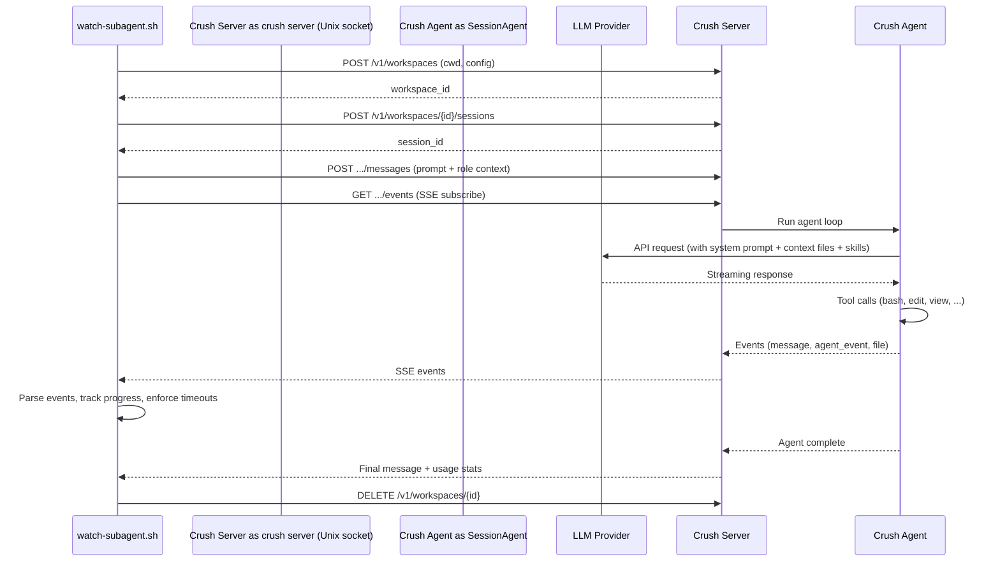

# Crush (Charmbracelet) — Исследование для интеграции как сабагент

**Роль:** Аналитик (Шерлок)
**Дата:** 2026-05-10
**Объект:** Crush v0.66.1 (`github.com/charmbracelet/crush`, Go)
**Задача:** [TASK-research-crush-agent](../../../todo/TASK-research-crush-agent.todo.md)

---

## Сводка

Crush — терминальный AI-кодинг-ассистент от Charmbracelet (авторы Bubbletea, Lip Gloss, VHS), написанный на Go. Версия 0.66.1, лицензия FSL-1.1-MIT (Functional Source License с автоматическим переходом в MIT через 2 года). Crush — мощный интерактивный TUI-агент с мультиагентной архитектурой (Coder → Task), LSP/MCP-поддержкой, но **ограниченными возможностями программного управления** — нет JSON-режима, нет RPC, нет ephemeral-режима.

**Базовое исследование:** [crush-comparison.md](../framework-comparisons/crush-comparison.md) — архитектура, оркестрационные паттерны, детальный анализ исходного кода.

---

## Критерий 1. Системный промпт

### Возможности

Crush **не предоставляет** CLI-флагов для управления системным промптом (`--system-prompt`, `--append-system-prompt`). Системный промпт генерируется динамически из Go-template (`coder.md.tpl` / `task.md.tpl`) и включает контекстные файлы + skills metadata.

| Механизм | Поведение |
|----------|-----------|
| Go-template (`coder.md.tpl`) | Дефолтный системный промпт coder-агента. Жёстко зашит в бинарник. |
| Go-template (`task.md.tpl`) | Системный промпт task-субагента. Жёстко зашит. |
| `context_paths` в `crush.json` | Дополнительные файлы контекста, внедряемые в системный промпт. |
| `AGENTS.md` / `CRUSH.md` / `CLAUDE.md` / `GEMINI.md` | Автообнаружение из коробки (см. Критерий 4). |
| Server API (`SetSystemPrompt()`) | Программная замена промпта через HTTP API сервера. |

### Конфигурация context_paths

```json
{
  "options": {
    "context_paths": [
      "docs/agents/roles/team/backend_developer_levsha.ru.md",
      ".cursorrules"
    ]
  }
}
```

Файлы из `context_paths` внедряются в системный промпт как часть `ContextFiles` — аналогично контекстным файлам из автообнаружения. Содержимое файлов встраивается **полностью** в системный промпт, без lazy loading.

### Сравнение с Pi (`--system-prompt`, `--append-system-prompt`)

Pi позволяет **полностью заменить** системный промпт (`--system-prompt`) и **дополнить** его (`--append-system-prompt`). Crush не имеет аналогичных CLI-флагов. Единственный путь инъекции дополнительного контекста — `context_paths` или файл `CRUSH.md` / `AGENTS.md`.

### Оценка: ⚠️ Частичная поддержка

Нет CLI-флагов для управления системным промптом. Контекстные файлы позволяют дополнить промпт, но **полная замена** невозможна через CLI. Программная замена доступна только через Server API.

---

## Критерий 2. Промпт агента / Роль

### Подход

Crush **не имеет** встроенного механизма «ролей». Как и Pi, роль можно инжектировать через контекстные файлы. Но в отличие от Pi, Crush не имеет `--append-system-prompt`, поэтому инъекция роли возможна только через:

1. **`context_paths` в `crush.json`** — добавить путь к файлу роли:
   ```json
   {
     "options": {
       "context_paths": ["docs/agents/roles/team/backend_developer_levsha.ru.md"]
     }
   }
   ```
   Минус: содержимое файла встраивается **полностью** в системный промпт на старте, тратя токены. Содержимое файла роли (~3–5KB) будет в каждом запросе.

2. **`AGENTS.md` в корне проекта** — уже используется для инструкций проекта. Файл роли можно включить ссылкой в AGENTS.md, но модель не обязана его читать.

3. **`crush run "prompt"`** — промпт передаётся как user-message, не как system-prompt.

### Ограничения

- Нет CLI-флага для инъекции контекста роли в system prompt
- Нет механизма on-demand загрузки файла роли (модель должна сама прочитать файл через tool `view`)
- `context_paths` внедряет полный текст файла — дорого в токенах для ролей

### Оценка: ⚠️ Частичная поддержка (через context_paths)

Можно инжектировать контекст роли через `context_paths` или инструкцию модели прочитать файл. Но нет прямого CLI-механизма, аналогичного `--append-system-prompt` в Pi.

---

## Критерий 3. Скиллы

### Возможности

Crush **полностью поддерживает** [Agent Skills standard](https://agentskills.io) с развитым механизмом discovery и lazy loading.

| Механизм | Поведение |
|----------|-----------|
| Автосканирование | Глобальные (`~/.config/agents/skills/`, `~/.config/crush/skills/`) + проектные (`.agents/skills/`, `.crush/skills/`, `.claude/skills/`, `.cursor/skills/`) |
| `skills_paths` в `crush.json` | Явное указание путей к скиллам |
| `disabled_skills` в `crush.json` | Отключение конкретных скиллов |
| `CRUSH_SKILLS_DIR` env | Переопределение глобальной директории скиллов |

### Механика

1. При старте Crush параллельно сканирует все пути скиллов через `fastwalk`
2. Для каждого `SKILL.md` — парсинг YAML frontmatter (`name`, `description`) + markdown body
3. Валидация: regex `^[a-zA-Z0-9]+(-[a-zA-Z0-9]+)*$` для имени, max 64 символа
4. Дедупликация: user skills override builtin skills с тем же именем
5. XML injection в system prompt: `<available_skills>` блок с метаданными
6. Lazy loading: модель instructed «If any entry matches the current task, you MUST call `view` on its `<location>` before taking any other action»

### Примеры конфигурации

```json
{
  "options": {
    "skills_paths": [
      "~/.config/crush/skills",
      "./docs/agents/skills"
    ]
  }
}
```

### Разные скиллы разным ролям

Crush имеет только два типа агентов: Coder (полный набор инструментов) и Task (read-only). Оба получают одинаковый набор скиллов — нет механизма назначения разных скиллов разным «ролям» в нашем понимании.

Для разных сабагентов с разными ролями потребуется **отдельный процесс Crush** с разной конфигурацией `skills_paths` через разные `crush.json` или переменные окружения.

### Оценка: ✅ Полная поддержка скиллов, но ограниченное назначение ролям

Agent Skills standard реализован полноценно. Но нет CLI-управления скиллами на уровне запуска (`--skill` / `--no-skills` как в Pi) — только через конфигурационный файл.

---

## Критерий 4. AGENTS.md (контекстные файлы)

### Возможности

| Файл | Автообнаружение |
|------|----------------|
| `AGENTS.md` | ✅ Да (по умолчанию) |
| `CRUSH.md` / `crush.md` | ✅ Да |
| `CLAUDE.md` | ✅ Да |
| `GEMINI.md` | ✅ Да |
| `.cursorrules` | ✅ Да |
| `.github/copilot-instructions.md` | ✅ Да |
| `.cursor/rules/` | ✅ Да (директория, рекурсивно) |

### Порядок загрузки

Crush загружает контекстные файлы из предопределённого списка путей:

```go
var defaultContextPaths = []string{
    ".github/copilot-instructions.md",
    ".cursorrules",
    ".cursor/rules/",
    "CLAUDE.md", "CLAUDE.local.md",
    "GEMINI.md", "gemini.md",
    "crush.md", "crush.local.md",
    "CRUSH.md", "CRUSH.local.md",
    "AGENTS.md", "agents.md", "Agents.md",
}
```

Все найденные файлы внедряются в системный промпт как `ContextFiles`. Содержимое файлов читается полностью и встраивается в Go-template.

### Можно ли отключить

Нет явного CLI-флага `--no-context-files` (как в Pi). Однако:
- Можно удалить/переместить файлы из отслеживаемых путей
- Можно переопределить `context_paths` в `crush.json` — при этом дефолтные пути **дополняются**, а не заменяются

### Инициализация

При `crush init` (или первом запуске) Crush анализирует проект и создаёт файл с контекстом. Имя файла по умолчанию — `AGENTS.md`, настраивается через `initialize_as`:

```json
{
  "options": {
    "initialize_as": "AGENTS.md"
  }
}
```

### Оценка: ✅ Полная поддержка

Crush автоматически обнаруживает и загружает `AGENTS.md` и множество других контекстных файлов. Широкая совместимость с экосистемой AI-инструментов.

---

## Критерий 5. Стандартная папка `.agents/skills/`

### Автосканирование

Crush **поддерживает** автосканирование `.agents/skills/` из коробки:

| Локация | Автосканирование |
|---------|------------------|
| `~/.config/agents/skills/` | ✅ Глобально |
| `~/.config/crush/skills/` | ✅ Глобально |
| `.agents/skills/` (в проекте) | ✅ Проектно |
| `.crush/skills/` (в проекте) | ✅ Проектно |
| `.claude/skills/` (в проекте) | ✅ Проектно |
| `.cursor/skills/` (в проекте) | ✅ Проектно |
| `CRUSH_SKILLS_DIR` env | ✅ Переопределение |
| `skills_paths` в `crush.json` | ✅ Явное указание |

### Наша структура

Наши скиллы лежат в `docs/agents/skills/`. Для подключения:

```json
{
  "options": {
    "skills_paths": ["docs/agents/skills"]
  }
}
```

### Оценка: ✅ Полная поддержка

`.agents/skills/` поддерживается из коробки. Наша структура `docs/agents/skills/` подключается через `skills_paths` в конфигурации.

---

## Критерий 6. Запуск как сабагент (JSON-режим)

### Возможности

| Механизм | Поддержка |
|----------|-----------|
| JSON / JSONL streaming | ❌ **Нет** |
| RPC-режим (stdin/stdout) | ❌ **Нет** |
| Ephemeral / no-session | ❌ **Нет** |
| `crush run "prompt"` | ✅ Non-interactive, один запрос |
| Server mode (HTTP API) | ✅ Unix socket / named pipe |
| `--yolo` | ✅ Авто-подтверждение всех permissions |
| `--model` / `--small-model` | ✅ Выбор модели при запуске |

### `crush run` — Non-interactive режим

```bash
# Простой запуск
crush run "Опиши архитектуру проекта"

# Pipe
cat README.md | crush run "Улучши документацию" > GLAMOROUS_README.md

# С выбором модели
crush run --model anthropic/claude-sonnet-4 "Проанализируй код"

# Yolo (без подтверждений)
crush run --yolo "Отрефактори модуль X"

# Quiet (без спиннера)
crush run --quiet "Сгенерируй README"
```

**Вывод:** `crush run` выводит **только текстовый ответ** модели в stdout. Нет структурированного JSONL-вывода, нет телеметрии по токенам в stdout, нет событий о tool calls.

### Server Mode (HTTP API)

Crush может работать как сервер через Unix socket:

```bash
# Запуск сервера
crush server

# Клиент автоматически подключается через CRUSH_CLIENT_SERVER=1
CRUSH_CLIENT_SERVER=1 crush run "prompt"
```

Server API предоставляет:
- `POST /v1/workspaces` — создание workspace
- `POST /v1/workspaces/{id}/sessions` — создание сессии
- `POST /v1/workspaces/{id}/sessions/{sid}/messages` — отправка сообщения
- `GET /v1/workspaces/{id}/events` (SSE) — подписка на события

Через Server API доступна подписка на события (messages, agent events, permission requests). Это ближе к JSONL-стримингу, но требует запуска сервера и HTTP-клиента.

### Ограничения для интеграции как сабагент

1. **Нет JSON-вывода в stdout** — `crush run` выводит plain text
2. **Нет ephemeral-режима** — сессия сохраняется в SQLite
3. **Нет контроля таймаутов** через CLI — только SIGINT/SIGTERM
4. **Нет структурированного результата** — только текстовый ответ
5. **Server API** — возможный путь интеграции, но сложнее, чем pipe-based подход Pi

### Сравнение с Pi (`--mode json`, `--no-session`)

Pi позволяет: `pi --mode json --no-session "prompt" | jq ...` — полная телеметрия в JSONL-стриме. Crush не имеет аналога.

### Оценка: ⚠️ Частичная поддержка

Non-interactive режим через `crush run` работает, но без JSON/JSONL-вывода и без ephemeral-режима. Server API — более мощный, но требует отдельного запуска сервера и HTTP-клиента. Для pipe-based интеграции как сабагент Crush **существенно уступает** Pi.

---

## Критерий 7. Токены и стоимость

### Доступные метрики

Crush отслеживает per-session метрики через SQLite:

```go
type Session struct {
    PromptTokens     int64
    CompletionTokens int64
    Cost             float64
}
```

### Формула расчёта стоимости

```
cost = CostPer1MInCached/1M × cache_creation_tokens
     + CostPer1MOutCached/1M × cache_read_tokens
     + CostPer1MIn/1M × input_tokens
     + CostPer1MOut/1M × output_tokens
```

Для OpenRouter — используется override cost из provider metadata.

### Доступ к метрикам

| Способ | Доступность |
|--------|-------------|
| `crush stats` | ✅ Web-отчёт с токенами, стоимостью, активностью (открывает браузер) |
| `crush stats --json` | ❌ Нет JSON-вывода stats |
| В TUI (footer) | ✅ Отображается в интерактивном режиме |
| SQLite напрямую | ✅ Можно прочитать `.crush/crush.db` |
| В `crush run` stdout | ❌ Не выводится |
| Hierarchical cost propagation | ✅ Стоимость субагентов аккумулируется на родителе |

### Ограничения

- Нет JSONL-стрима с usage-событиями (как в Pi)
- В non-interactive режиме метрики не доступны в stdout
- `crush stats` генерирует HTML-отчёт, неудобный для парсинга

### Оценка: ⚠️ Частичная поддержка

Токены и стоимость отслеживаются per-session и доступны через TUI / `crush stats` / SQLite. Но в non-interactive режиме (`crush run`) метрики **не выводятся в stdout** — нельзя получить телеметрию программно без обращения к SQLite или Server API.

---

## Критерий 8. Free tier

### Crush как продукт

Crush — **FSL-1.1-MIT** лицензированный инструмент. Сам по себе бесплатный. Стоимость определяется провайдером LLM.

### Бесплатные модели / провайдеры

| Провайдер | Бесплатные возможности |
|-----------|----------------------|
| Google Gemini API | Free tier: Gemini 2.5 Flash — 15 RPM, 1M tokens/min |
| Ollama / LM Studio | Полностью бесплатно при локальных моделях |
| Cloudflare Workers AI | Бесплатный tier |
| Synthetic | Subscription-based, возможен free trial |
| ZAI (GLM) | Subscription-based coding plan |

### Подписочные модели

Crush поддерживает подписочные провайдеры:
- Synthetic — subscription
- GLM Coding Plan (ZAI) — subscription
- Kimi Code — subscription
- MiniMax Coding Plan — subscription

### Оценка: ✅ Бесплатный инструмент, стоимость зависит от LLM-провайдера

Аналогично Pi: Crush бесплатный, стоимость определяется провайдером. Для бесплатного использования подходят Google Gemini API free tier или локальные модели через Ollama/LM Studio.

---

## Критерий 9. Провайдеры и модели

### Поддерживаемые провайдеры

Crush поддерживает 20+ провайдеров через библиотеку `charm.land/fantasy` и [Catwalk](https://github.com/charmbracelet/catwalk) (community-driven база моделей):

| Провайдер | API | Тип |
|-----------|-----|-----|
| Anthropic | Messages API | Native |
| OpenAI | Completions / Responses | Native |
| Google Gemini | Generative AI | Native |
| OpenRouter | Aggregator | Native |
| Bedrock (Claude через AWS) | Native | |
| Azure OpenAI | Native | |
| Vertex AI (Gemini через GCP) | Native | |
| Vercel AI Gateway | Native | |
| Groq | Fast inference | |
| Cerebras | Fast inference | |
| Hugging Face | Open-source models | |
| xAI (Grok) | — | |
| DeepSeek | — | |
| Synthetic | — | |
| ZAI (GLM) | — | |
| MiniMax | — | |
| io.net | — | |
| Avian | — | |
| OpenCode Zen/Go | — | |

### Кастомные провайдеры

```json
{
  "providers": {
    "ollama": {
      "type": "openai-compat",
      "base_url": "http://localhost:11434/v1/",
      "models": [
        {
          "id": "qwen3:30b",
          "name": "Qwen 3 30B",
          "context_window": 256000,
          "default_max_tokens": 20000
        }
      ]
    }
  }
}
```

### BYOK (Bring Your Own Key)

Да, полная поддержка. API-ключи передаются через:
- Environment variables (`ANTHROPIC_API_KEY`, `OPENAI_API_KEY`, и т.д.)
- Конфигурация `crush.json` (`api_key` field, с поддержкой `$VAR` expansion)
- Interactive setup при первом запуске

### Переключение моделей

```bash
# CLI при запуске
crush run --model anthropic/claude-sonnet-4 "prompt"
crush run --model gemini-2.5-pro "prompt"

# Interactive — переключение mid-session через TUI
# В TUI: выбирается из списка моделей
```

### Dual Model Architecture

Crush использует две модели:
- **Large model** — основная для agent loop
- **Small model** — для генерации заголовков, summarization

Можно задать обе:
```bash
crush run --model claude-sonnet-4 --small-model gemini-2.0-flash "prompt"
```

### Оценка: ✅ 20+ провайдеров, BYOK, кастомные провайдеры

Crush поддерживает более 20 провайдеров с полным BYOK. Локальные модели (Ollama, LM Studio) подключаются через кастомные провайдеры. Автообновление базы моделей через Catwalk. Dual model architecture для оптимизации стоимости.

---

## Критерий 10. Лицензия

### Информация

| Параметр | Значение |
|----------|----------|
| Лицензия | **FSL-1.1-MIT** (Functional Source License, MIT Future) |
| Репозиторий | https://github.com/charmbracelet/crush |
| Язык | Go |
| Авторы | Charmbracelet, Inc. |

### Условия FSL-1.1-MIT

**Текущие ограничения:**
- ✅ Использование для внутренних целей
- ✅ Некоммерческое образование и исследования
- ✅ Профессиональные услуги для лицензиата
- ❌ **Competing Use** — создание конкурирующего коммерческого продукта
- ✅ Модификация и создание derivative works
- ✅ Распространение с сохранением лицензии

**Через 2 года после публикации** — автоматически переходит в **MIT**:
- Полная свобода использования, модификации, коммерциализации

### Для нашего случая

Использование Crush как сабагента в task-orchestrator **является Permitted Purpose** (internal use). FSL не ограничивает использование инструмента, а ограничивает создание конкурирующего продукта на его основе.

### Оценка: ⚠️ FSL-1.1-MIT — допустимо для внутреннего использования

Не open source в классическом смысле, но допустимо для нашего сценария (internal use как сабагент). Через 2 года — MIT.

---

## Вердикт

### ⚠️ Частично подходит (Score: 6/10)

Crush — мощный интерактивный AI-кодинг-ассистент с богатой архитектурой, но **ограниченно подходит** для использования как программно управляемый сабагент.

**Сильные стороны:**
1. Agent Skills standard с полноценным discovery + lazy loading
2. Широкая поддержка контекстных файлов (AGENTS.md + CRUSH.md + CLAUDE.md + GEMINI.md + .cursorrules)
3. Автосканирование `.agents/skills/` из коробки
4. 20+ LLM-провайдеров, BYOK, кастомные провайдеры, Ollama, LM Studio
5. Dual model architecture (large + small) для оптимизации стоимости
6. Cost tracking per-session с hierarchical propagation от субагентов
7. Server mode (HTTP API over Unix socket) для программного управления
8. Мультиагентная архитектура (Coder → Task) с Principle of Least Privilege
9. LSP/MCP поддержка для расширенного контекста

**Критические ограничения для интеграции:**
1. ❌ **Нет JSON/JSONL streaming** — `crush run` выводит только plain text
2. ❌ **Нет ephemeral-режима** — сессии сохраняются в SQLite
3. ❌ **Нет CLI-флагов для управления системным промптом** (`--system-prompt`, `--append-system-prompt`)
4. ❌ **Нет CLI-управления скиллами** (`--skill`, `--no-skills`)
5. ⚠️ Телеметрия (токены, стоимость) не доступна в stdout при `crush run`
6. ⚠️ FSL-1.1-MIT лицензия — допустима, но не open source

**Сравнение с Pi (10/10):**

| Критерий | Pi | Crush |
|----------|-----|-------|
| JSON-режим | ✅ `--mode json` | ❌ Нет |
| Ephemeral | ✅ `--no-session` | ❌ Нет |
| System prompt CLI | ✅ `--system-prompt` / `--append-system-prompt` | ❌ Только `context_paths` в конфиге |
| Skills CLI | ✅ `--skill` / `--no-skills` | ❌ Только конфиг |
| Токены в stdout | ✅ JSONL usage events | ❌ Нет |
| AGENTS.md | ✅ | ✅ |
| `.agents/skills/` | ✅ | ✅ |
| Провайдеры | 20+ | 20+ |
| Лицензия | MIT | FSL-1.1-MIT |

**Рекомендация:** Crush **не рекомендуется** как основной сабагент из-за отсутствия JSON-режима и программного управления. Однако Server API (HTTP over Unix socket) предоставляет потенциальный путь интеграции — при условии разработки HTTP-клиента в `watch-subagent.sh`. Это значительно сложнее, чем pipe-based подход Pi.

---

## Приложение А. Практические примеры запуска

### Non-interactive запуск (аналог `pi --print`)

```bash
crush run "Проанализируй архитектуру проекта"

# С pipe
cat src/Module/Orchestrator/Domain/Entity/TaskChain.php | \
  crush run --yolo "Проведи ревью этого файла"
```

### С кастомной моделью

```bash
crush run --model anthropic/claude-sonnet-4 "Опиши паттерны проектирования"
crush run --model gemini-2.5-flash --yolo "Найди баги в тестах"
```

### С контекстом через AGENTS.md

```bash
# AGENTS.md в корне проекта подхватится автоматически
cd /home/dp/MyProjects/task-orchestrator
crush run "Какие конвенции применяются для Entity?"
```

### Через Server API (программный запуск)

```bash
# Запуск сервера
crush server &

# Создание workspace + session
curl -X POST --unix-socket /tmp/crush.sock \
  -H "Content-Type: application/json" \
  -d '{"path":"/home/dp/MyProjects/task-orchestrator"}' \
  http://localhost/v1/workspaces

# Отправка сообщения
curl -X POST --unix-socket /tmp/crush.sock \
  -H "Content-Type: application/json" \
  -d '{"role":"user","content":"Проанализируй код"}' \
  http://localhost/v1/workspaces/{ws-id}/sessions/{sess-id}/messages

# Подписка на события (SSE)
curl -N --unix-socket /tmp/crush.sock \
  http://localhost/v1/workspaces/{ws-id}/events
```

---

## Приложение Б. Конфигурация для подключения наших скиллов

```json
{
  "$schema": "https://charm.land/crush.json",
  "options": {
    "skills_paths": [
      "docs/agents/skills"
    ],
    "context_paths": [
      "AGENTS.md"
    ],
    "disabled_tools": ["sourcegraph"]
  },
  "permissions": {
    "allowed_tools": [
      "view",
      "ls",
      "grep",
      "glob",
      "edit",
      "write",
      "bash"
    ]
  }
}
```

---

## Приложение В. Mermaid-диаграмма потока данных (потенциальная интеграция через Server API)



---

## Источники

1. [github.com/charmbracelet/crush](https://github.com/charmbracelet/crush) — репозиторий проекта (v0.66.1)
2. [agentskills.io](https://agentskills.io) — стандарт Agent Skills
3. [charm.land](https://charm.land) — экосистема Charmbracelet
4. [FSL-1.1-MIT License](https://github.com/charmbracelet/crush/blob/main/LICENSE.md) — лицензия
5. [github.com/charmbracelet/catwalk](https://github.com/charmbracelet/catwalk) — community-driven база моделей
