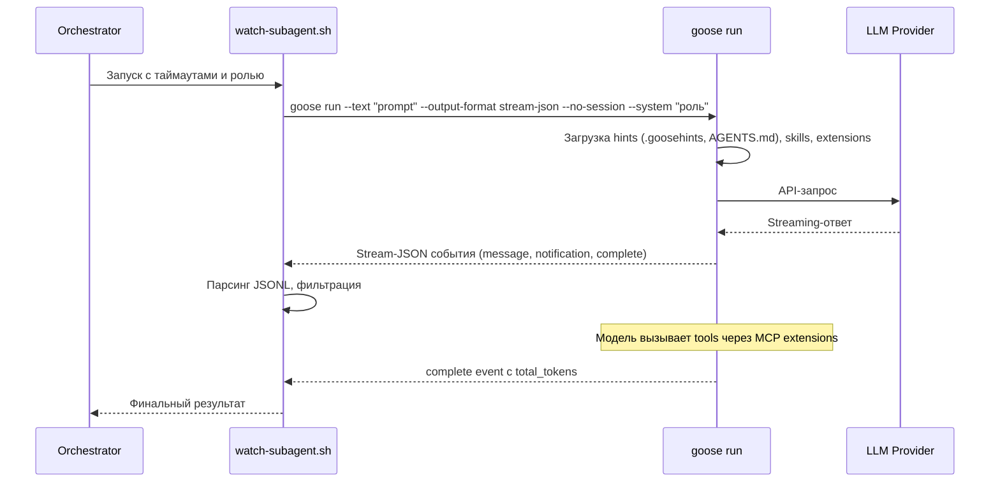

# Goose — Исследование для интеграции как сабагент

**Роль:** Аналитик (Шерлок)
**Дата:** 2026-05-10
**Объект:** Goose (Block/AAIF Goose AI Agent, Rust), репозиторий migrated → `aaif-goose/goose` (Linux Foundation)
**Задача:** [TASK-research-goose-agent](../../../todo/done/TASK-research-goose-agent.todo.md)

---

## Сводка

Goose — универсальный open-source AI-агент от Agentic AI Foundation (AAIF) при Linux Foundation (ранее Block/Square). Написан на Rust, имеет Desktop-приложение (Electron) и CLI. Поддерживает 30+ LLM-провайдеров, 70+ MCP-расширений, систему навыков (skills) по стандарту agentskills.io. Лицензия Apache-2.0. Интегрируется через CLI (`goose run`), ACP-протокол (Agent Client Protocol) и HTTP/WebSocket API (`goose serve`).

---

## Критерий 1. Системный промпт

### Возможности

| Механизм | Поведение |
|----------|-----------|
| `--system <text>` (в `goose run`) | **Дополнение** к дефолтному системному промпту (additional_system_prompt) |
| `GOOSE_SYSTEM_PROMPT_FILE_PATH` (config) | **Полная замена** дефолтного системного промпта содержимым файла |
| Рецепт (recipe) `response` | Кастомизация через YAML-рецепт |

### Механика

В отличие от Pi, Goose **не имеет** отдельного CLI-флага для полной замены системного промпта. CLI-флаг `--system` (в `goose run`) работает как **дополнение** (`extend_system_prompt`). Полная замена возможна **только** через конфигурационный параметр `GOOSE_SYSTEM_PROMPT_FILE_PATH` в `~/.config/goose/config.yaml`.

Код в `builder.rs` → `configure_session_prompts()`:
1. Сначала применяется `extend_system_prompt("additional", additional_prompt)` — если передан `--system`
2. Затем `override_system_prompt(override_prompt)` — если задан `GOOSE_SYSTEM_PROMPT_FILE_PATH`

Порядок важен: override применяется **после** extend, поэтому файловая замена побеждает CLI-дополнение.

### Примеры CLI

```bash
# Дополнение к системному промпту (CLI)
goose run --text "Опиши архитектуру проекта" --system "Следуй стандартам PSR-12."

# Полная замена системного промпта (config.yaml)
# В ~/.config/goose/config.yaml:
# GOOSE_SYSTEM_PROMPT_FILE_PATH: /path/to/custom-system.md

# Non-interactive run с дополнением
goose run --text "Проанализируй код" --system "Ты — ревьювер." \
  --output-format stream-json --no-session
```

### Сравнение с Pi

| Возможность | Pi | Goose |
|-------------|-----|-------|
| Полная замена через CLI-флаг | `--system-prompt <text>` | ❌ Нет CLI-флага |
| Дополнение через CLI-флаг | `--append-system-prompt <text>` | `--system <text>` (в `goose run`) |
| Полная замена через файл | `.pi/SYSTEM.md` | `GOOSE_SYSTEM_PROMPT_FILE_PATH` в config |
| Дополнение через файл | `.pi/APPEND_SYSTEM.md` | ❌ Нет |

### Оценка: ⚠️ Частичная поддержка

Дополнение системного промпта через CLI есть, но **полная замена только через конфигурационный файл**, что неудобно для динамического управления при запуске сабагентов с разными ролями. Нельзя указать файл замены прямо в команде запуска.

---

## Критерий 2. Промпт агента / Роль

### Подход

Goose не имеет встроенного механизма «ролей» как у нас в проекте. Инъекция роли возможна через:

1. **`--system <text>`** — дополнение к системному промпту:
   ```bash
   goose run --text "Выполни задачу" \
     --system "Возьми на себя роль из файла: docs/agents/roles/team/backend_developer_levsha.ru.md"
   ```
   Модель прочитает файл роли через инструмент чтения при первом обращении.

2. **Рецепт (recipe)** — YAML-файл с полной конфигурацией агента:
   ```yaml
   # recipe.yml
   title: "Backend Developer"
   description: "Бэкенд-разработчик"
   response:
     system_prompt: |
       Ты — Бэкендер Левша. Следуй инструкциям из файла роли.
   settings:
     goose_provider: openai
     goose_model: gpt-4o
   ```
   Запуск: `goose run --recipe recipe.yml`

3. **Inline-содержимое** через `--system "$(cat role.md)"` — раздувает промпт, но работает.

### Ограничения

- Нет прямого CLI-аргумента для указания файла роли (как `--append-system-prompt "Возьми на себя роль из файла: ..."` у Pi)
- Рецепты позволяют конфигурировать провайдера, модель и промпт, но не поддерживают динамическую подстановку путей к файлам ролей
- В отличие от Pi, goose **автоматически загружает hints** (`.goosehints`, `AGENTS.md`), что может конфликтовать с ролью, если не отключить

### Оценка: ⚠️ Частичная поддержка

Инъекция роли возможна через `--system`, но механизм менее гибкий, чем у Pi. Нет отдельного CLI-флага для ролей. Рецепты — мощный инструмент, но YAML-формат затрудняет быструю смену ролей.

---

## Критерий 3. Скиллы

### Возможности

| Механизм | Поведение |
|----------|-----------|
| Автообнаружение | Автосканирование директорий скиллов при запуске сессии |
| `.agents/skills/<name>/SKILL.md` | Стандарт agentskills.io — поддерживается из коробки |
| `.goose/skills/<name>/SKILL.md` | Альтернативная директория Goose |
| `.claude/skills/<name>/SKILL.md` | Совместимость с Claude Code |
| Плагины | `goose plugin install <git-url>` — установка скиллов из Git |
| `~/.config/goose/skills/` | Глобальные скиллы |
| Встроенные скиллы | `builtin://skills/` — bundled с goose |

### Механика скиллов

Goose реализует стандарт [agentskills.io](https://agentskills.io/specification):
- Скилл = директория с обязательным `SKILL.md` (YAML frontmatter: `name`, `description`, `metadata`)
- Вспомогательные файлы рядом с `SKILL.md` автоматически обнаруживаются
- Скиллы регистрируются как source type `Skill` и доступны агенту через встроенный MCP-сервер `SkillsClient`

### Назначение скиллов разным ролям

**Нет CLI-управления скиллами.** Нет эквивалента `--skill` или `--no-skills` как в Pi. Скиллы загружаются автоматически из стандартных директорий.

Частичные обходные пути:
- Использовать `.goose/skills/` в проекте вместо `.agents/skills/`
- Установить скиллы как плагины (изолированные)
- Через рецепт можно ограничить доступные расширения (extensions), но не скиллы напрямую

### Оценка: ⚠️ Частичная поддержка

Стандарт agentskills.io поддерживается, автосканирование `.agents/skills/` из коробки. Но **нет CLI-управления**: нельзя загрузить конкретный скилл через флаг, нельзя отключить автосканирование, нельзя назначить разные скиллы разным ролям через CLI.

---

## Критерий 4. AGENTS.md (контекстные файлы)

### Возможности

| Механизм | Поведение |
|----------|-----------|
| `.goosehints` | Собственный формат hints-файлов Goose (поддержка `@file` для импорта файлов) |
| `AGENTS.md` | Автообнаружение из коробки |
| `CONTEXT_FILE_NAMES` (config) | Кастомизация списка имён контекстных файлов |

### Автообнаружение

Goose загружает контекстные файлы из:
1. Рабочая директория (cwd)
2. Подкаталоги при доступе к файлам (subdirectory hint tracking)
3. По умолчанию сканирует `.goosehints` и `AGENTS.md`

Значение по умолчанию можно изменить через `CONTEXT_FILE_NAMES` в config.yaml.

### Подкаталоги

Уникальная особенность: Goose автоматически подгружает hints из подкаталогов, к которым агент обращается через инструменты (`path`, `command`). Это реализовано через `SubdirectoryHintTracker`, который отслеживает обращения к файлам и загружает hints «на лету».

### Отключение

Нет прямого CLI-флага для отключения загрузки контекстных файлов (как `--no-context-files` у Pi). Можно только изменить `CONTEXT_FILE_NAMES` на пустой список в config.

### Примеры

```bash
# AGENTS.md будет автоматически обнаружен
goose run --text "Выполни задачу"

# Поддержка @file в .goosehints
# .goosehints:
# Project instructions
# @AGENTS.md
# @docs/conventions/index.md
```

### Оценка: ✅ Полная поддержка

`AGENTS.md` поддерживается из коробки. `.goosehints` — мощный механизм с поддержкой импорта файлов и подкаталогов. Отсутствие CLI-отключения — минимальное неудобство.

---

## Критерий 5. Стандартная папка `.agents/skills/`

### Автосканирование

Goose **поддерживает** автосканирование `.agents/skills/` из коробки — это стандартная локация в приоритете:

```rust
// Из skills/mod.rs — all_skill_dirs()
// Project-scoped:
wd.join(".agents").join("skills"),    // ✅ .agents/skills/
wd.join(".goose").join("skills"),     // .goose/skills/
wd.join(".claude").join("skills"),    // .claude/skills/ (совместимость)
// Global:
home.join(".agents").join("skills"),  // ~/.agents/skills/
config_dir.join("skills"),            // ~/.config/goose/skills/
home.join(".claude").join("skills"),  // ~/.claude/skills/
home.join(".config").join("agents").join("skills"), // ~/.config/agents/skills/
```

### Наша структура

Наши скиллы лежат в `docs/agents/skills/`, а не в `.agents/skills/`. Goose **не автосканирует** `docs/agents/skills/`.

Обходные пути:
1. **Символическая ссылка:** `ln -s docs/agents/skills .agents/skills`
2. **Перенос скиллов** в `.agents/skills/` (нарушит нашу структуру)
3. **Плагины:** `goose plugin install <url>` — но не подходит для локальных скиллов

### Оценка: ✅ Поддерживается из коробки

`.agents/skills/` автосканируется. Наша структура `docs/agents/skills/` требует настройки (symlink).

---

## Критерий 6. Запуск как сабагент (JSON-режим)

### Возможности

| Опция | Поведение |
|-------|-----------|
| `goose run --text <prompt>` | Non-interactive запуск с текстовым промптом |
| `--no-session` | Ephemeral режим — сессия не сохраняется в истории |
| `--output-format json` | Вывод финального JSON с сообщениями и метаданными |
| `--output-format stream-json` | Streaming JSONL-события в реальном времени |
| `--quiet` | Только ответ модели в stdout |
| `--max-turns N` | Ограничение числа витков (по умолчанию 1000) |
| `--max-tool-repetitions N` | Защита от зацикливания |
| `goose acp` | ACP-протокол через stdio (для глубокой интеграции) |
| `goose serve` | HTTP + WebSocket ACP-сервер |

### Формат JSON (`--output-format json`)

Финальный JSON-вывод:
```json
{
  "messages": [...],
  "metadata": {
    "total_tokens": 12345,
    "status": "completed"
  }
}
```

### Формат Stream-JSON (`--output-format stream-json`)

JSONL-события:
```json
{"type": "message", "message": {...}}
{"type": "notification", "extension_id": "...", "data": {...}}
{"type": "error", "error": "..."}
{"type": "complete", "total_tokens": 12345}
```

### ACP-протокол

`goose acp` запускает ACP-сервер на stdio — Agent Client Protocol для межагентной коммуникации. Это стандартный протокол для запуска goose как сабагента других систем.

### Non-interactive ограничения

В non-interactive режиме (`goose run` без `-s`/`--interactive`) goose **требует** `GooseMode::Auto`. При `Approve` или `SmartApprove` — ошибка, так как нет интерактивного терминала для подтверждения инструментов.

### Примеры CLI

```bash
# Простой non-interactive запуск
goose run --text "Проанализируй архитектуру проекта" \
  --output-format stream-json \
  --no-session \
  --max-turns 50

# С ролью через --system
goose run --text "Выполни задачу X" \
  --system "Возьми на себя роль из файла: docs/agents/roles/team/backend_developer_levsha.ru.md" \
  --output-format json \
  --no-session \
  --quiet

# С конкретным провайдером и моделью
goose run --text "Отрефактори код" \
  --provider openai \
  --model gpt-4o \
  --output-format stream-json \
  --no-session

# ACP-сервер на stdio
goose acp --with-builtin developer

# HTTP-сервер
goose serve --host 127.0.0.1 --port 3284
```

### Пример потока данных



### Оценка: ✅ Полная поддержка

Goose поддерживает три режима интеграции: JSON, stream-json и ACP. `--no-session` обеспечивает изоляцию, `--max-turns` и `--max-tool-repetitions` защищают от зависаний. Stream-json формат подходит для `watch-subagent.sh`.

---

## Критерий 7. Токены и стоимость

### Доступные метрики

В JSON/Stream-JSON выводе:
- `total_tokens` — общее количество токенов за сессию

В сессии (Session metadata):
- `total_tokens`, `input_tokens`, `output_tokens`
- `accumulated_total_tokens`, `accumulated_input_tokens`, `accumulated_output_tokens`

### Механика подсчёта

1. Если провайдер возвращает usage-данные — используются напрямую
2. Если провайдер не возвращает — Goose оценивает токены через `tiktoken` (`o200k_base` tokenizer)
3. Счётчик кэшируется (DashMap, до 10 000 записей) для производительности

### Стоимость в долларах

**Нет расчёта стоимости.** Goose отслеживает токены, но **не вычисляет стоимость** в долларах. Нет эквивалента Pi's `cost: {input, output, cacheRead, cacheWrite}`.

### Session Insights

```bash
# Информация о токенах через JSON output
goose run --text "prompt" --output-format json --no-session | jq '.metadata.total_tokens'
```

### Оценка: ⚠️ Частичная поддержка

Токены отслеживаются, но нет расчёта стоимости в долларах и детальной разбивки (cache read/write). Для сабагентной интеграции `total_tokens` в JSON-выводе достаточно для базовой телеметрии.

---

## Критерий 8. Free tier

### Goose как продукт

Goose — **open-source** (Apache-2.0) CLI-инструмент, сам по себе полностью бесплатный. Стоимость определяется провайдером LLM.

### Бесплатные модели / провайдеры

| Провайдер | Бесплатные возможности |
|-----------|----------------------|
| Ollama | Полностью бесплатно при локальных моделях |
| LM Studio | Полностью бесплатно при локальных моделях |
| Docker Model Runner | Полностью бесплатно при локальных моделях |
| Ramalama | Полностью бесплатно при локальных моделях |
| Google Gemini API | Free tier: Gemini 2.5 Flash — 15 RPM, 1M tokens/min |
| NanoGPT | Интегрирован в `goose configure` — регистрация через device flow |
| OpenRouter | BYOK, есть бесплатные модели |

### Глобальная конфигурация

```bash
# Настроить бесплатного провайдера
goose configure  # Интерактивный выбор провайдера
```

### Оценка: ✅ Бесплатный инструмент, стоимость зависит от провайдера

Goose бесплатный (Apache-2.0). Для бесплатного использования подходят Ollama, LM Studio или Google Gemini free tier.

---

## Критерий 9. Провайдеры и модели

### Поддерживаемые провайдеры (30+)

**API-ключи (BYOK):**

| Провайдер | API | Примечание |
|-----------|-----|------------|
| OpenAI | Completions / Responses | GPT серии |
| Anthropic | Messages API | Claude серии |
| Google Gemini | Generative AI | Gemini серии |
| Amazon Bedrock | AWS credentials | Claude, GPT через AWS |
| Amazon SageMaker TGI | AWS credentials | TGI модели |
| Azure OpenAI | Azure credentials | GPT серии |
| GCP Vertex AI | GCP credentials | Gemini, Claude |
| Databricks | Host + Token | Databricks модели |
| Ollama | Local API | Локальные модели |
| Ollama Cloud | API key | Хостируемые модели |
| LM Studio | Local API | Локальные модели |
| Docker Model Runner | Local API | Локальные модели |
| Ramalama | Local API | OCI-контейнеры с моделями |
| OpenRouter | API key | Агрегатор провайдеров |
| LiteLLM | Host | Прокси для мульти-провайдеров |
| Groq | API key | Быстрый инференс |
| Cerebras | API key | Быстрый инференс |
| xAI (Grok) | API key | Grok серии |
| Mistral AI | API key | Mistral серия |
| NanoGPT | Device flow auth | Мульти-провайдер |
| Tetrate ARS | API key | Мульти-провайдер |
| Venice AI | API key | Privacy-first |
| Snowflake | Host + Token | Cortex AI |
| Avian | API key | Бюджетный инференс |
| Novita AI | API key | 90+ OSS моделей |
| OVHcloud AI | API key | OSS модели |
| VMware Tanzu | API key | Enterprise |

**Подписочные (OAuth):**
- ChatGPT Plus/Pro (Codex) — OpenAI
- Claude Code — Anthropic
- GitHub Copilot
- Cursor Agent

**ACP-провайдеры:**
- Claude ACP — Claude Code через ACP
- Codex ACP — OpenAI Codex через ACP

**Declarative providers (JSON-конфиг):**
- DeepSeek, MiniMax, Moonshot, Zhipu, NVIDIA, Inception, Llama Swap, Tensorix

### BYOK (Bring Your Own Key)

Полная поддержка. API-ключи передаются через:
- Environment variables (основной способ)
- `goose configure` — интерактивная настройка с хранением в keyring/secrets.yaml
- Declarative provider JSON-файлы — `api_key_env` для переменной окружения

### Переключение провайдеров/моделей

```bash
# CLI
goose run --text "prompt" --provider openai --model gpt-4o
goose run --text "prompt" --provider ollama --model qwen3:32b

# Config (~/.config/goose/config.yaml)
GOOSE_PROVIDER: openai
GOOSE_MODEL: gpt-4o

# Environment variables
GOOSE_PROVIDER=openai GOOSE_MODEL=gpt-4o goose run --text "prompt"
```

### Кастомные провайдеры

Declarative providers — JSON-файлы в `~/.config/goose/providers/`:
```json
{
  "name": "custom_provider",
  "engine": "openai",
  "base_url": "https://api.example.com",
  "api_key_env": "MY_API_KEY",
  "models": [{"name": "model-name", "context_limit": 128000}]
}
```

### Оценка: ✅ Поддержка 30+ провайдеров

Goose поддерживает более 30 провайдеров с полным BYOK. Локальные модели (Ollama, LM Studio, Docker Model Runner) подключаются из коробки. Переключение провайдеров — через CLI, env vars или config. Declarative providers — мощный механизм добавления кастомных провайдеров.

---

## Критерий 10. Лицензия

### Информация

| Параметр | Значение |
|----------|----------|
| Репозиторий | https://github.com/aaif-goose/goose (ранее `block/goose`) |
| Организация | Agentic AI Foundation (AAIF) при Linux Foundation |
| Лицензия | **Apache-2.0** |
| Язык | Rust |
| Звёзд | ~44 800 |
| Платформы | macOS, Linux, Windows |

### Условия

Apache-2.0 разрешает:
- Коммерческое использование
- Модификацию
- Распространение
- Private use
- Патентную лицензию

Требования:
- Включить копию лицензии
- Уведомление об изменениях (для модифицированных файлов)
- NOTICE-файл (если есть)

### Оценка: ✅ Open source, Apache-2.0

---

## Вердикт

### ⚠️ Частично подходит (Score: 7/10)

Goose — мощный и зрелый AI-агент с отличной поддержкой провайдеров и MCP-экосистемой. Однако для нашей задачи (использование как сабагент с динамическими ролями и скиллами) есть существенные ограничения.

**Сильные стороны:**
1. **30+ провайдеров** — больше, чем у Pi (20+). Declarative providers для быстрого добавления кастомных.
2. **JSON / stream-json / ACP** — три режима программного управления. Stream-json подходит для `watch-subagent.sh`.
3. **MCP-экосистема** — 70+ расширений через Model Context Protocol, встроенные developer tools.
4. **AGENTS.md + .goosehints** — автообнаружение с продвинутым subdirectory hint tracking.
5. **`.agents/skills/`** — полная поддержка стандарта agentskills.io из коробки.
6. **Apache-2.0** — open source, перешёл под Linux Foundation.
7. **Рецепты (recipes)** — YAML-конфигурация агентов для воспроизводимых запусков.
8. **Планировщик (scheduler)** — встроенный cron для повторяющихся задач.

**Ключевые ограничения (для нашей интеграции):**
1. **Системный промпт** — дополнение через CLI (`--system`) есть, но **полная замена только через config.yaml**, а не через CLI-флаг. Это затрудняет запуск разных ролей в параллельных сабагентах.
2. **Нет CLI-управления скиллами** — нельзя загрузить/отключить конкретный скилл через флаг. Все скиллы из `.agents/skills/` загружаются автоматически. Нельзя назначить разные скиллы разным ролям.
3. **Нет расчёта стоимости** — токены подсчитываются, но стоимость в $ не рассчитывается (в отличие от Pi с детальной разбивкой).
4. **Нет CLI-отключения контекстных файлов** — нельзя отключить загрузку AGENTS.md/hints для конкретного запуска.

---

## Приложение А. Практические примеры запуска

### Запуск Бэкендера Левши (через goose run)

```bash
goose run --text "Выполни задачу: todo/TASK-feat-example.todo.md. Следуй инструкциям из AGENTS.md." \
  --system "Возьми на себя роль из файла: docs/agents/roles/team/backend_developer_levsha.ru.md" \
  --output-format stream-json \
  --no-session \
  --max-turns 100 \
  --quiet
```

### Запуск Аналитика (только чтение, stream-json)

```bash
goose run --text "Проанализируй требования в todo/TASK-xxx.todo.md" \
  --system "Возьми на себя роль из файла: docs/agents/roles/team/system_analyst_sherlock.ru.md" \
  --output-format stream-json \
  --no-session \
  --max-turns 50 \
  --quiet
```

### Запуск с конкретным провайдером

```bash
goose run --text "Отрефактори модуль Orchestrator" \
  --provider anthropic \
  --model claude-sonnet-4-20250514 \
  --output-format json \
  --no-session
```

### Запуск через рецепт

```yaml
# recipes/backend-dev.yml
title: Backend Developer Agent
description: Запуск бэкенд-разработчика как сабагента
settings:
  goose_provider: openai
  goose_model: gpt-4o
response:
  system_prompt: |
    Ты — Бэкендер Левша.
    Возьми на себя роль из файла: docs/agents/roles/team/backend_developer_levsha.ru.md
    Следуй инструкциям из AGENTS.md.
```

```bash
goose run --recipe recipes/backend-dev.yml
```

### ACP-режим (stdio)

```bash
goose acp --with-builtin developer
# Взаимодействие через Agent Client Protocol на stdin/stdout
```

---

## Приложение Б. Сравнение с Pi по ключевым критериям

| Критерий | Pi | Goose | Разница |
|----------|-----|-------|---------|
| Системный промпт: полная замена CLI | ✅ `--system-prompt` | ❌ Только через config | Pi удобнее |
| Системный промпт: дополнение CLI | ✅ `--append-system-prompt` | ✅ `--system` | Эквивалент |
| Скиллы: CLI-управление | ✅ `--skill`, `--no-skills` | ❌ Только автосканирование | Pi гибче |
| AGENTS.md: автообнаружение | ✅ | ✅ | Эквивалент |
| `.agents/skills/`: автосканирование | ✅ | ✅ | Эквивалент |
| JSON-режим | ✅ `--mode json` (JSONL) | ✅ `--output-format stream-json` | Эквивалент |
| Ephemeral | ✅ `--no-session` | ✅ `--no-session` | Эквивалент |
| Провайдеры | 20+ | 30+ | Goose шире |
| Токены/стоимость | ✅ Токены + $ | ⚠️ Только токены | Pi детальнее |
| Лицензия | MIT | Apache-2.0 | Оба open source |

---

## Источники

1. [Goose — GitHub (aaif-goose/goose)](https://github.com/aaif-goose/goose) — основной репозиторий (ранее `block/goose`)
2. [Goose CLI source: cli.rs](https://github.com/block/goose/blob/main/crates/goose-cli/src/cli.rs) — CLI-параметры и структура команд
3. [Goose providers documentation](https://github.com/block/goose/blob/main/documentation/docs/getting-started/providers.md) — поддерживаемые провайдеры
4. [Goose skills/mod.rs](https://github.com/block/goose/blob/main/crates/goose/src/skills/mod.rs) — система скиллов и автосканирование
5. [Goose session builder](https://github.com/block/goose/blob/main/crates/goose-cli/src/session/builder.rs) — конфигурация системного промпта
