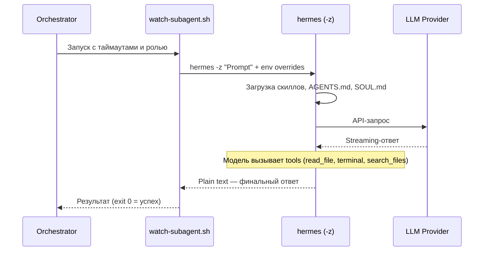

# Hermes Agent (Nous Research) — Исследование для интеграции как сабагент

**Роль:** Аналитик (Шерлок)
**Дата:** 2026-05-10
**Объект:** Hermes Agent v0.8.x (Nous Research, Python)
**Задача:** [TASK-research-hermes-agent](../../../todo/TASK-research-hermes-agent.todo.md)

---

## Сводка

Hermes Agent — полнофункциональный AI-агент от Nous Research (создатели Hermes LLM). Написан на Python, лицензия MIT, 140K+ звёзд на GitHub. Агент позиционируется как «self-improving AI agent» с встроенным learning loop: создаёт скиллы из опыта, улучшает их при использовании, строит модель пользователя между сессиями. Поддерживает 30+ провайдеров LLM, работу через CLI/Telegram/Discord/Slack/WhatsApp/Signal, ACP/MCP-интеграции, встроенный cron-планировщик и систему делегирования сабагентов.

**Ключевое отличие от Pi:** Hermes — это комплексная платформа (CLI + messaging gateway + API server), а не минималистичный CLI-harness. Это даёт богатый функционал, но усложняет интеграцию как сабагента.

---

## Критерий 1. Системный промпт

### Возможности

| Механизм | Поведение |
|----------|-----------|
| `~/.hermes/SOUL.md` | **Полная замена** идентичности агента. Занимает slot #1 в system prompt. |
| `.hermes.md` / `HERMES.md` | Проектный контекст (highest priority). Walks to git root. |
| `AGENTS.md` | Проектный контекст. Progressive subdirectory discovery. |
| `CLAUDE.md` | Совместимость с Claude Code. |
| `.cursorrules` | Совместимость с Cursor IDE. |
| `--ignore-rules` | Отключает авто-инъекцию AGENTS.md, SOUL.md, .cursorrules, persistent memory, preloaded skills. |
| `HERMES_EPHEMERAL_SYSTEM_PROMPT` | Ephemeral-слой — добавляется к API-вызову, не входит в кешированный промпт. |
| `system_message` в config.yaml | Опциональный системный сообщение-овердрайд. |
| `/personality <name>` | Session-level overlay — временная смена персоны. |

### Сравнение с Pi

| Аспект | Pi | Hermes |
|--------|----|----|
| Замена системного промпта | `--system-prompt <text>` | SOUL.md (файл), нет CLI-аргумента для inline-замены |
| Дополнение к промпту | `--append-system-prompt <text>` | Нет прямого CLI-аналога; только `HERMES_EPHEMERAL_SYSTEM_PROMPT` env |
| Файловое дополнение | `.pi/APPEND_SYSTEM.md` | Нет аналога |
| Проектный контекст | AGENTS.md, CLAUDE.md | AGENTS.md, .hermes.md, CLAUDE.md, .cursorrules |

### Примеры CLI

```bash
# Запуск с игнорированием всех правил проекта (чистый запуск)
hermes chat --ignore-rules -q "Проанализируй код"

# Запуск с игнорированием конфигурации пользователя
hermes chat --ignore-user-config --ignore-rules -q "Чистый запуск"

# Изолированный one-shot
hermes -z "Опиши архитектуру проекта"
```

### Ограничения для интеграции как сабагент

Hermes **не имеет** CLI-аргументов `--system-prompt` или `--append-system-prompt` для inline-замены/дополнения системного промпта. Для изменения идентичности нужно:
1. Редактировать `~/.hermes/SOUL.md` перед запуском (race condition при параллельных запусках)
2. Использовать `HERMES_EPHEMERAL_SYSTEM_PROMPT` env var (дополнение, не замена)
3. Использовать профили (`hermes profile`) — каждый профиль имеет свой `SOUL.md`

### Оценка: ⚠️ Частичная поддержка

Полная замена идентичности через SOUL.md работает, но **нет CLI-флагов** для inline-замены/дополнения системного промпта при запуске. Это усложняет интеграцию — нужно управлять файлами или профилями вместо передачи строки через CLI.

---

## Критерий 2. Промпт агента / Роль

### Подход

Hermes не имеет механизма «ролей» в нашем понимании. Идентичность агента определяется через:

1. **SOUL.md** — глобальная персона (slot #1 в system prompt)
2. **Персональности** (`/personality`) — session-level overlays, не персистентные
3. **Профили** (`hermes profile`) — изолированные экземпляры с собственной конфигурацией

### Инъекция контекста роли

Для инъекции роли через CLI можно использовать:

```bash
# Через env var (ephemeral, не кешированный)
HERMES_EPHEMERAL_SYSTEM_PROMPT="Возьми на себя роль из файла: docs/agents/roles/team/backend_developer_levsha.ru.md" \
  hermes chat -q "Выполни задачу"

# Через one-shot режим с user prompt
hermes -z "Возьми на себя роль из файла: docs/agents/roles/team/backend_developer_levsha.ru.md. Выполни задачу: todo/TASK-xxx.todo.md"
```

### Ограничения

- Нет прямого CLI-флага для инъекции роли (как `--append-system-prompt` в Pi)
- `HERMES_EPHEMERAL_SYSTEM_PROMPT` — дополнение, не замена
- Профили требуют предварительной настройки (`hermes profile create`)
- Нет механизма передачи файла роли через CLI-аргумент

### Оценка: ⚠️ Частичная поддержка (через env var или профили)

Роль можно инжектировать через `HERMES_EPHEMERAL_SYSTEM_PROMPT` env var или через профили, но это менее удобно, чем `--append-system-prompt` у Pi. Модель должна прочитать файл роли через инструмент `read`.

---

## Критерий 3. Скиллы

### Возможности

| Механизм | Поведение |
|----------|-----------|
| `~/.hermes/skills/` | Основной каталог скиллов (read-write) |
| `skills.external_dirs` в config.yaml | Внешние каталоги скиллов (read-only) |
| `-s` / `--skills <name>` | Preload скиллов для сессии (CLI-флаг, repeatable) |
| `hermes skills browse/search/install` | Skills Hub — поиск и установка из реестров |
| `skill_manage` tool | Агент может создавать/редактировать/удалять скиллы |
| Agent Skills standard | Совместимость с [agentskills.io](https://agentskills.io) |
| Условная активация | `fallback_for_toolsets`, `requires_toolsets` в SKILL.md |
| Curator | Фоновый curator-процесс для автоматического улучшения скиллов |

### Формат SKILL.md

Полностью совместим с [Agent Skills standard](https://agentskills.io/specification), расширен метаданными Hermes:

```yaml
metadata:
  hermes:
    tags: [python, automation]
    category: devops
    fallback_for_toolsets: [web]
    requires_toolsets: [terminal]
    config:
      - key: my.setting
        description: "What this controls"
        default: "value"
```

### Разные скиллы разным ролям

Через CLI-флаг `--skills`:

```bash
# Запуск с конкретными скиллами
hermes chat --skills agent-report,run-pi-subagent -q "Создай отчёт"

# Запуск без скиллов
hermes chat --ignore-rules -q "Чистый анализ"
```

Через профили — каждый профиль может иметь свой набор скиллов.

### Оценка: ✅ Полная поддержка

Hermes реализует Agent Skills standard с развитой системой управления (Skills Hub, curator, условная активация). CLI-флаг `--skills` позволяет задавать скиллы при запуске. Поддерживаются внешние каталоги скиллов через `skills.external_dirs`.

---

## Критерий 4. AGENTS.md (контекстные файлы)

### Возможности

| Файл | Приоритет | Обнаружение |
|------|-----------|-------------|
| `.hermes.md` / `HERMES.md` | Highest | Walks to git root |
| `AGENTS.md` | Second | CWD + progressive subdirectory discovery |
| `CLAUDE.md` | Third | CWD + progressive subdirectory discovery |
| `.cursorrules` / `.cursor/rules/*.mdc` | Fourth | CWD only |
| `SOUL.md` | Independent | `HERMES_HOME` only (глобальная персона) |

### Progressive Subdirectory Discovery

Hermes загружает `AGENTS.md` из CWD при старте, а затем **прогрессивно обнаруживает** контекстные файлы в подкаталогах по мере навигации агента. Это уникальная особенность — нет раздувания системного промпта на старте.

### Отключение

```bash
# Полностью отключить загрузку контекстных файлов
hermes chat --ignore-rules -q "Запрос без контекста проекта"
```

### Безопасность

Все контекстные файлы проходят security scan на prompt injection. Файлы ограничены 20,000 символов (70/20 head/tail truncation).

### Оценка: ✅ Полная поддержка

Hermes автоматически обнаруживает `AGENTS.md` из нашего проекта, поддерживает progressive subdirectory discovery. Отключение через `--ignore-rules`.

---

## Критерий 5. Стандартная папка `.agents/skills/`

### Поддержка

Hermes **поддерживает** стандарт `.agents/skills/` через механизм внешних каталогов:

```yaml
# ~/.hermes/config.yaml
skills:
  external_dirs:
    - ~/.agents/skills
    - .agents/skills
```

### Особенности

- Внешние каталоги — **read-only**: агент-созданные скиллы всегда пишутся в `~/.hermes/skills/`
- Локальный приоритет: если скилл с таким именем есть в `~/.hermes/skills/`, он побеждает
- Несуществующие пути игнорируются без ошибок
- Поддерживается `${VAR}` подстановка в путях

### Наша структура

Наши скиллы лежат в `docs/agents/skills/`, а не в `.agents/skills/`. Решение — аналогичное Pi:

```yaml
skills:
  external_dirs:
    - docs/agents/skills
```

Или через CLI-флаг при запуске:

```bash
hermes chat --skills agent-report -q "..."
```

### Оценка: ✅ Поддерживается с минимальной настройкой

Стандарт `.agents/skills/` поддерживается через `skills.external_dirs`. Наша структура `docs/agents/skills/` тоже подключается этим механизмом. CLI-флаг `--skills` позволяет точечно загружать скиллы.

---

## Критерий 6. Запуск как сабагент (JSON-режим)

### Возможности

| Опция | Поведение |
|-------|-----------|
| `hermes -z <prompt>` | **Scripted one-shot** — один запрос, финальный ответ как plain text, ничего лишнего на stdout. Для программного вызова. |
| `hermes chat -q <prompt>` | Non-interactive один запрос с выводом tool previews. |
| `hermes chat --quiet` | Programmatic mode — подавляет banner/spinner/tool previews. |
| `hermes chat --yolo` | Skip approval prompts — автономная работа без интерактива. |
| API Server (`/v1/chat/completions`) | OpenAI-совместимый HTTP endpoint. Streaming SSE. |
| API Server (`/v1/responses`) | OpenAI Responses API с server-side conversation state. |
| `delegate_task` tool | Встроенная система делегирования — spawn сабагентов с изолированным контекстом. |
| ACP (`hermes acp`) | Agent Client Protocol stdio-сервер для editor-интеграции. |
| MCP (`hermes mcp serve`) | Model Context Protocol — exposure conversations to other agents. |

### Scripted one-shot (`hermes -z`)

Это ближайший аналог `pi --mode json --no-session`:

```bash
# Прямой захват ответа
answer=$(hermes -z "Проанализируй архитектуру проекта")

# С provider override
hermes -z "..." --provider openrouter --model anthropic/claude-sonnet-4

# Через env
HERMES_INFERENCE_MODEL=anthropic/claude-sonnet-4 hermes -z "..."
```

**Но:** `hermes -z` выводит **только plain text** — нет JSONL-стриминга событий, нет токен-метрик, нет tool execution trace. Это существенное ограничение по сравнению с Pi.

### API Server

Альтернатива — запустить Hermes как API Server и вызывать через HTTP:

```bash
# Запуск gateway с API server
hermes gateway

# Вызов через curl
curl http://127.0.0.1:8642/v1/chat/completions \
  -H "Authorization: Bearer change-me-local-dev" \
  -H "Content-Type: application/json" \
  -d '{"model": "hermes-agent", "messages": [{"role": "user", "content": "Анализ"}]}'
```

API Server возвращает `usage` с `prompt_tokens`, `completion_tokens`, `total_tokens`. Streaming SSE поддерживается.

### Контроль таймаутов

```bash
# max-turns — лимит итераций tool-calling
hermes chat --max-turns 50 -q "Задача"

# child_timeout_seconds (для delegate_task)
# В config.yaml:
# delegation:
#   child_timeout_seconds: 600
```

### Пример потока данных



### Оценка: ⚠️ Частичная поддержка

`hermes -z` обеспечивает non-interactive one-shot, но выводит **только plain text** без JSONL-стриминга, токен-метрик и tool trace. API Server (`/v1/chat/completions`) даёт структурированный ответ с `usage`, но требует запущенного gateway-процесса. Встроенная система `delegate_task` не применима для нашего сценария (мы управляем сабагентами извне через `watch-subagent.sh`).

---

## Критерий 7. Токены и стоимость

### Интерактивный режим

| Команда | Информация |
|---------|-----------|
| `/usage` | Token usage, cost breakdown (input/output), session duration, account limits |
| `/insights [--days N]` | Usage analytics за N дней |
| `/compress` | Компрессия контекста (flush memories + summarize) |
| Status bar | Токены, cost, context window fill indicator |

### Программный доступ

| Режим | Доступ к метрикам |
|-------|-------------------|
| `hermes -z` | ❌ Выводит только plain text ответ, без метрик |
| `hermes chat -q --quiet` | ❌ Тоже plain text без метрик |
| API Server `/v1/chat/completions` | ✅ Возвращает `usage` (prompt_tokens, completion_tokens, total_tokens) |
| API Server `/v1/responses` | ✅ Возвращает `usage` (input_tokens, output_tokens, total_tokens) |

### Оценка: ⚠️ Частичная поддержка

Полная телеметрия доступна в интерактивном режиме и через API Server. При запуске через `hermes -z` (наш сценарий сабагента) токен-метрики **недоступны** — нужно использовать API Server или парсить логи.

---

## Критерий 8. Free tier

### Hermes как продукт

Hermes — **open-source** (MIT) CLI-инструмент. Сам по себе полностью бесплатный. Стоимость определяется провайдером LLM.

### Бесплатные провайдеры

| Провайдер | Бесплатные возможности |
|-----------|----------------------|
| Google Gemini (OAuth) | Free tier через `google-gemini-cli` provider — browser PKCE login, generous daily quota |
| Google Gemini API | Free tier: Gemini 2.5 Flash — 15 RPM, 1M tokens/min |
| Ollama / LM Studio | Полностью бесплатно при локальных моделях |
| Nous Portal | Subscription-based, нет бесплатного тарифа |
| GitHub Copilot | Требует Copilot-подписку. Бесплатно для verified students/oss. |

### Оценка: ✅ Бесплатный инструмент, стоимость зависит от провайдера

Аналогично Pi — Hermes бесплатный (MIT), для бесплатного использования подходят Google Gemini OAuth/API free tier или локальные модели через Ollama/LM Studio.

---

## Критерий 9. Провайдеры и модели

### Поддерживаемые провайдеры (30+)

**OAuth/Subscription:**
- Nous Portal (OAuth)
- OpenAI Codex (ChatGPT OAuth)
- GitHub Copilot (OAuth device code / ACP)
- Anthropic (Claude OAuth / API key)
- Google Gemini (OAuth PKCE / API key)
- MiniMax (OAuth)
- Qwen Portal (OAuth)
- Kilo Code (API key)

**API-ключи:**

| Провайдер | API | Примечание |
|-----------|-----|------------|
| OpenRouter | OpenAI-compatible | 200+ моделей, рекомендованный |
| OpenAI | Completions / Responses | GPT серия |
| Anthropic | Messages API | Claude серия |
| Google Gemini | Generative AI | Gemini серия |
| DeepSeek | — | DeepSeek-V3/R1 |
| z.ai / GLM | — | GLM серия |
| Kimi / Moonshot | — | Moonshot серия |
| MiniMax | — | MiniMax серия |
| Hugging Face | — | Open-source модели |
| xAI (Grok) | — | Grok серия |
| NVIDIA NIM | — | Nemotron, open models |
| Alibaba Cloud | DashScope | Qwen серия |
| Xiaomi MiMo | — | Китайский провайдер |
| Tencent TokenHub | — | Китайский провайдер |
| Arcee AI | — | Арче серия |
| GMI Cloud | — | GMI серия |
| StepFun | — | Step серия |
| OpenCode Zen/Go | — | Альтернативные |
| Kilo Code | — | Кило серия |
| LM Studio | OpenAI-compatible | Локальные модели |
| Ollama Cloud | — | Managed Ollama |
| AI Gateway (Vercel) | — | Маршрутизация |
| AWS Bedrock | — | Enterprise (Claude, GPT через AWS) |
| Azure AI Foundry | — | Enterprise (OpenAI, Anthropic через Azure) |
| Custom Endpoint | OpenAI/Anthropic-compatible | Любой self-hosted API |

### BYOK (Bring Your Own Key)

Да, полная поддержка. API-ключи передаются через:
- `~/.hermes/.env` — основной способ
- `hermes config set VAR value` — CLI
- `hermes auth add <provider> --api-key <key>` — credential pools
- Environment variables — `${VAR}` в config.yaml

### Переключение

```bash
# CLI
hermes chat --provider openrouter --model anthropic/claude-sonnet-4
hermes chat --provider gemini --model gemini-2.5-pro
hermes -z "..." --provider anthropic --model claude-opus-4

# Внутри сессии
/model claude-sonnet-4
/model openrouter:anthropic/claude-sonnet-4 --global
```

### Fallback chain

```bash
hermes fallback list
hermes fallback add  # interactive provider picker
```

Автоматический fallback при rate-limit, overload, connection errors.

### Оценка: ✅ Поддержка 30+ провайдеров

Hermes поддерживает более 30 провайдеров с полным BYOK. Локальные модели (Ollama, LM Studio) через custom endpoint. Переключение — через CLI, config, или `/model` mid-session. Fallback chain для надёжности.

---

## Критерий 10. Лицензия

### Информация

| Параметр | Значение |
|----------|----------|
| Пакет | `hermes-agent` |
| Организация | Nous Research |
| Лицензия | **MIT** |
| Репозиторий | https://github.com/NousResearch/hermes-agent |
| Сайт | https://hermes-agent.nousresearch.com |
| Звёзды | 140K+ |
| Язык | Python |

### Условия

MIT-лицензия разрешает:
- Коммерческое использование
- Модификацию
- Распространение
- Private use

Единственное требование — включить копию лицензии и уведомление об авторских правах.

### Оценка: ✅ Open source, MIT — максимальная свобода

---

## Вердикт

### ⚠️ Частично подходит (7/10)

Hermes Agent — мощная, полнофункциональная платформа AI-агента с богатейшим функционалом. Однако для нашего сценария (запуск как сабагент через `watch-subagent.sh` с ролями и скиллами) есть существенные ограничения.

**Сильные стороны:**
1. ✅ MIT-лицензия, open-source, активное развитие (140K+ звёзд)
2. ✅ 30+ провайдеров LLM, BYOK, локальные модели, fallback chain
3. ✅ Agent Skills standard (agentskills.io) с CLI-управлением (`--skills`)
4. ✅ Автообнаружение AGENTS.md с progressive subdirectory discovery
5. ✅ Внешние каталоги скиллов через `skills.external_dirs`
6. ✅ One-shot режим (`hermes -z`) для программного вызова
7. ✅ API Server (OpenAI-совместимый) как альтернативный способ интеграции
8. ✅ Встроенная система делегирования (`delegate_task`)
9. ✅ Кроссплатформенный: CLI + Telegram + Discord + Slack + WhatsApp + Signal
10. ✅ Профили для изоляции конфигураций

**Ключевые ограничения для нашего сценария:**
1. ⚠️ **Нет CLI-флагов для inline-замены/дополнения системного промпта** — нет аналога `--system-prompt` / `--append-system-prompt` из Pi. Идентичность меняется только через файл SOUL.md или env var.
2. ⚠️ **`hermes -z` выводит только plain text** — нет JSONL-стриминга событий, токен-метрик, tool trace. Наш `watch-subagent.sh` не может отслеживать прогресс в реальном времени.
3. ⚠️ **Инъекция роли через env var** — менее удобна, чем через CLI-флаг. Требует `HERMES_EPHEMERAL_SYSTEM_PROMPT` или управление профилями.
4. ⚠️ **Токен-метрики недоступны** при `hermes -z` — только через API Server.

**Что нужно для интеграции:**

```bash
# Вариант 1: через hermes -z (простой, но без метрик)
HERMES_EPHEMERAL_SYSTEM_PROMPT="Возьми на себя роль из файла: $ROLE_FILE" \
  hermes -z "Выполни задачу: $TASK" --yolo

# Вариант 2: через API Server (полный контроль)
hermes gateway &
curl http://127.0.0.1:8642/v1/chat/completions \
  -H "Authorization: Bearer $API_KEY" \
  -d '{"model":"hermes-agent","messages":[{"role":"user","content":"..."}]}'

# Вариант 3: через профиль (изолированная конфигурация)
hermes profile create backend-dev
hermes profile use backend-dev
# Настроить SOUL.md, skills, tools для роли
hermes -z "..."
```

---

## Сравнение с Pi (ключевые отличия)

| Критерий | Pi | Hermes | Преимущество |
|----------|----|----|------|
| Системный промпт (CLI) | `--system-prompt`, `--append-system-prompt` | SOUL.md, `HERMES_EPHEMERAL_SYSTEM_PROMPT` | **Pi** — inline CLI-флаги |
| JSONL-стриминг | `--mode json` (полный JSONL) | Plain text (`-z`) или API Server | **Pi** — нативный JSONL |
| Скиллы (CLI) | `--skill`, `--no-skills` | `--skills`, `skills.external_dirs` | **Ничья** — оба хороши |
| AGENTS.md | Автообнаружение + subdirectory | Автообнаружение + progressive subdirectory | **Hermes** — progressive discovery |
| Провайдеры | 20+ | 30+ | **Hermes** — больше провайдеров |
| Токены (программно) | Полные в JSONL | Только через API Server | **Pi** — нативно в CLI |
| Messaging | CLI only | CLI + 15+ платформ | **Hermes** — гораздо шире |
| Делегирование | Нет встроенного | `delegate_task` (parallel) | **Hermes** |
| Cron/Automation | Нет | Встроенный cron + goals | **Hermes** |
| Профили | Нет | `hermes profile` | **Hermes** |
| Альт. JSON-режим | `--mode rpc` | API Server, ACP, MCP | **Hermes** — больше вариантов |

---

## Приложение А. Практические примеры запуска

### Запуск как сабагент (через `hermes -z`)

```bash
# Базовый one-shot
hermes -z "Проанализируй архитектуру проекта в текущей директории"

# С ролью через ephemeral system prompt
HERMES_EPHEMERAL_SYSTEM_PROMPT="Возьми на себя роль из файла: docs/agents/roles/team/backend_developer_levsha.ru.md" \
  hermes -z "Выполни задачу: todo/TASK-feat-example.todo.md"

# С конкретными скиллами
hermes chat --skills agent-report -q "Создай отчёт о ревью кода"

# Изолированный запуск (без контекста пользователя)
hermes chat --ignore-user-config --ignore-rules --yolo \
  -q "Проанализируй файлы в tests/Unit/"

# Через watch-subagent.sh (адаптированный)
HERMES_EPHEMERAL_SYSTEM_PROMPT="Возьми на себя роль из файла: $ROLE_FILE" \
  timeout 600 hermes -z "$PROMPT"
```

### Запуск через API Server

```bash
# Запуск gateway с API server (в фоне)
API_SERVER_ENABLED=true API_SERVER_KEY=my-secret hermes gateway &

# Вызов через curl
curl -s http://127.0.0.1:8642/v1/chat/completions \
  -H "Authorization: Bearer my-secret" \
  -H "Content-Type: application/json" \
  -d '{
    "model": "hermes-agent",
    "messages": [
      {"role": "system", "content": "Ты — экспертный PHP-разработчик."},
      {"role": "user", "content": "Проанализируй код в src/"}
    ],
    "stream": false
  }' | jq '.choices[0].message.content, .usage'
```

---

## Приложение Б. Конфигурация Hermes для нашего проекта

### Минимальная конфигурация для сабагента

```yaml
# ~/.hermes/config.yaml
model:
  provider: openrouter
  default: anthropic/claude-sonnet-4

terminal:
  backend: local
  timeout: 180

skills:
  external_dirs:
    - docs/agents/skills

agent:
  max_turns: 90

delegation:
  child_timeout_seconds: 600
```

### SOUL.md для изолированного сабагента

```markdown
# System Analyst

Ты — AI-ассистент, работающий как сабагент в команде.
Выполняй задачу точно и лаконично.
Следуй инструкциям из файла задачи и AGENTS.md.
```

---

## Источники

1. [Hermes Agent GitHub](https://github.com/NousResearch/hermes-agent) — репозиторий, README
2. [Hermes Agent Docs](https://hermes-agent.nousresearch.com/docs/) — документация
3. [CLI Commands Reference](https://hermes-agent.nousresearch.com/docs/reference/cli-commands) — CLI-параметры
4. [Skills System](https://hermes-agent.nousresearch.com/docs/user-guide/features/skills) — система скиллов
5. [AI Providers](https://hermes-agent.nousresearch.com/docs/integrations/providers) — провайдеры и аутентификация
