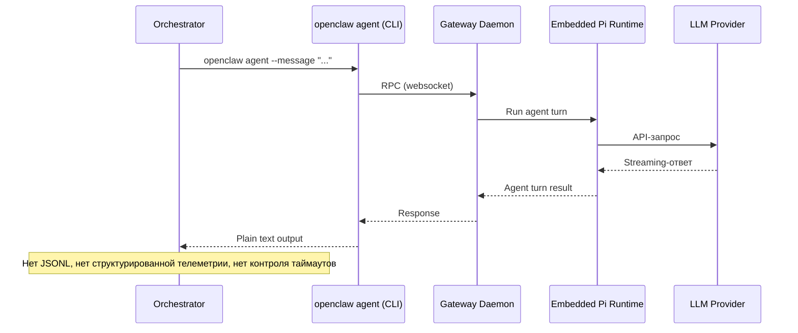

# OpenClaw — Исследование для интеграции как сабагент

**Роль:** Аналитик (Шерлок)
**Дата:** 2026-05-10
**Объект:** OpenClaw (`openclaw`, TypeScript/Node.js, 362k★ GitHub)
**Задача:** [TASK-research-openclaw-agent](../../../todo/TASK-research-openclaw-agent.todo.md)

---

## Сводка

OpenClaw — это **personal AI assistant gateway** с multi-channel поддержкой (20+ мессенджеров), написанный на TypeScript (Node.js). Лицензия MIT. Спонсируется OpenAI, GitHub, NVIDIA. Архитектурно OpenClaw — это persistent daemon (gateway), а не CLI-утилита для кодинга. Встроенный агентный runtime основан на Pi core (models, tools, prompt pipeline), но обёрнут в собственные слои OpenClaw: session management, channel delivery, tool wiring, multi-agent routing. Поддерживает 40+ LLM-провайдеров через plugin-систему, систему скиллов по стандарту agentskills.io, ACP sub-agent spawning.

**Ключевое отличие от Pi:** OpenClaw — это не CLI-coding agent. Это **gateway-платформа** для персонального AI-ассистента. CLI-команда `openclaw agent --message` взаимодействует с работающим демоном gateway, а не запускает автономный процесс кодинга.

---

## Критерий 1. Системный промпт

### Возможности

| Механизм | Поведение |
|----------|-----------|
| `SOUL.md` (workspace) | Персона, boundaries, tone — инжектируется в system prompt при старте сессии |
| `AGENTS.md` (workspace) | Операционные инструкции + «memory» — инжектируется в system prompt |
| `TOOLS.md` (workspace) | Пользовательские заметки по инструментам |
| `IDENTITY.md` (workspace) | Имя агента, vibe, emoji |
| `BOOTSTRAP.md` (workspace) | One-time first-run ритуал (удаляется после выполнения) |
| `USER.md` (workspace) | Профиль пользователя |
| `agents.defaults.skipBootstrap: true` | Отключить инъекцию bootstrap-файлов |

### Архитектура

Системный промпт OpenClaw формируется из **workspace-файлов**, а не из CLI-аргументов. Файлы читаются из `agents.defaults.workspace` (по умолчанию `~/.openclaw/workspace`). Содержимое инжектируется в Project Context при первом ходе новой сессии.

**Нет CLI-флагов** для замены или дополнения системного промпта (`--system-prompt`, `--append-system-prompt`). Кастомизация возможна только через редактирование workspace-файлов.

### Примеры

```bash
# Нет прямого CLI-механизма замены промпта.
# Кастомизация — через workspace-файлы:

# ~/.openclaw/workspace/SOUL.md — персона агента
# ~/.openclaw/workspace/AGENTS.md — инструкции проекта
```

### Сравнение с Pi

| Возможность | Pi | OpenClaw |
|-------------|-----|----------|
| Полная замена через CLI-флаг | `--system-prompt <text>` | ❌ Нет |
| Дополнение через CLI-флаг | `--append-system-prompt <text>` | ❌ Нет |
| Файловая замена (проект) | `.pi/SYSTEM.md` | `SOUL.md` (workspace) |
| Файловое дополнение | `.pi/APPEND_SYSTEM.md` | `AGENTS.md` + `TOOLS.md` |

### Оценка: ⚠️ Частичная поддержка

Системный промпт кастомизируется через workspace-файлы (`SOUL.md`, `AGENTS.md`), но **нет CLI-флагов** для динамической замены/дополнения при запуске. Для сабагента это означает: нужно предварительно записать workspace-файлы перед запуском, что менее гибко, чем Pi с `--system-prompt`.

---

## Критерий 2. Промпт агента / Роль

### Подход

OpenClaw не имеет механизма инъекции «роли» через CLI-аргумент. Поддерживается **multi-agent routing** — каждый агент имеет изолированный workspace, auth profiles, sessions:

```json5
// ~/.openclaw/openclaw.json
{
  agents: {
    list: [
      { id: "coding", workspace: "~/.openclaw/workspace-coding" },
      { id: "reviewer", workspace: "~/.openclaw/workspace-reviewer" },
    ],
  },
}
```

Каждый агент получает свои `SOUL.md`, `AGENTS.md`, `USER.md` из своего workspace. Это аналог «ролей», но на уровне **конфигурации gateway**, а не CLI-аргумента при запуске.

### Ограничения

1. **Нет CLI-инъекции роли** — нельзя передать файл роли в команде запуска.
2. **Конфигурация через gateway** — агенты предопределены в `openclaw.json`, а не создаются динамически.
3. **Workspace-изоляция** — каждый агент работает в своём workspace, но все запускаются через один gateway-демон.

### Оценка: ⚠️ Частичная поддержка (через multi-agent config)

Multi-agent routing позволяет создавать изолированных агентов с разными workspace (ролями), но это статическая конфигурация, не динамическая инъекция через CLI.

---

## Критерий 3. Скиллы

### Возможности

OpenClaw загружает скиллы из множества локаций (по приоритету):

| Локация | Описание |
|---------|----------|
| `<workspace>/skills` | Workspace-скиллы (наивысший приоритет) |
| `<workspace>/.agents/skills` | Project agent skills |
| `~/.agents/skills` | Personal agent skills |
| `~/.openclaw/skills` | Managed/local skills |
| Bundled (53 скилла) | Поставляются с установкой |
| `skills.load.extraDirs` | Дополнительные директории |

### Управление через конфигурацию

```json5
// ~/.openclaw/openclaw.json
{
  skills: {
    entries: {
      "image-lab": { enabled: true, apiKey: { source: "env", id: "GEMINI_API_KEY" } },
      "sag": { enabled: false },
    },
    allowBundled: ["gemini", "coding-agent"],  // allowlist для bundled skills
  },
}
```

### Агентные скиллы

Per-agent skill allowlists поддерживаются через `agents.list[].skills`. Каждый агент может иметь свой набор доступных скиллов.

### Отсутствующие возможности

1. **Нет CLI-флага `--skill`** — нельзя динамически загрузить скилл при запуске.
2. **Нет `--no-skills`** — нельзя отключить автосканирование из командной строки.
3. **Скиллы snapshot-ятся при старте сессии** — изменения вступают в силу при следующей сессии.

### Оценка: ⚠️ Частичная поддержка

Agent Skills standard поддерживается, автосканирование `.agents/skills/` есть, per-agent фильтрация через конфигурацию доступна. Но **нет CLI-управления** — нельзя динамически добавлять/удалять скиллы при запуске сабагента.

---

## Критерий 4. AGENTS.md (контекстные файлы)

### Возможности

OpenClaw ожидает `AGENTS.md` в **workspace-директории** (а не в корне проекта):

```
~/.openclaw/workspace/
  AGENTS.md       — операционные инструкции + «memory»
  SOUL.md         — персона, boundaries, tone
  TOOLS.md        — заметки по инструментам
  BOOTSTRAP.md    — one-time first-run ритуал
  IDENTITY.md     — имя, vibe, emoji
  USER.md         — профиль пользователя
```

### Отличие от Pi

Pi автосканирует `AGENTS.md` из CWD и ancestor-директорий (до git root). OpenClaw загружает `AGENTS.md` **только из workspace**. Это принципиальная разница:

- **Pi:** Запускаешь `pi` в корне проекта → Pi сам находит `/project/AGENTS.md`.
- **OpenClaw:** Нужно чтобы `AGENTS.md` лежал в workspace (`~/.openclaw/workspace/AGENTS.md`).

### Отключение

```json5
{ agents: { defaults: { skipBootstrap: true } } }
```

### Оценка: ⚠️ Частичная поддержка

`AGENTS.md` поддерживается, но загружается **только из workspace-директории**, а не из корня проекта. Для интеграции сабагентом потребуется symlink или копирование файла проекта в workspace.

---

## Критерий 5. Стандартная папка `.agents/skills/`

### Автосканирование

OpenClaw **поддерживает** автосканирование `.agents/skills/` из коробки:

| Локация | Правила |
|---------|---------|
| `<workspace>/.agents/skills` | Project agent skills — директории с `SKILL.md` |
| `~/.agents/skills` | Personal agent skills — директории с `SKILL.md` |

Но — аналогично AGENTS.md — сканирование идёт от **workspace root**, а не от CWD проекта. Наша структура `docs/agents/skills/` не будет обнаружена автоматически.

### Дополнительные пути

```json5
{
  skills: {
    load: {
      extraDirs: ["/path/to/project/docs/agents/skills"],
    },
  },
}
```

### Оценка: ✅ Поддерживается с настройкой

`.agents/skills/` поддерживается из коробки, но scoped к workspace. Наша структура требует `extraDirs` в конфигурации.

---

## Критерий 6. Запуск как сабагент (JSON-режим)

### CLI-команда

```bash
openclaw agent --message "Ship checklist" --thinking high
```

Эта команда отправляет сообщение через gateway daemon. Она **не запускает автономный процесс** — gateway должен быть запущен (`openclaw gateway`).

### ACP Sub-agent Spawning

OpenClaw поддерживает sub-agent spawning через ACP (Agent Client Protocol):

```typescript
SpawnAcpParams = {
  task: string;
  label?: string;
  agentId?: string;
  model?: string;
  thinking?: string;
  runTimeoutSeconds?: number;
  cwd?: string;
  mode?: "run" | "session";
  sandbox?: "inherit" | "require";
  streamTo?: "parent";
};
```

Лимиты:
```
DEFAULT_SUBAGENT_MAX_CHILDREN_PER_AGENT = 5;
DEFAULT_SUBAGENT_MAX_SPAWN_DEPTH = 1;
```

### Критические ограничения для сабагента

1. **Нет JSONL-стриминга** — нет эквивалента Pi `--mode json`.
2. **Нет ephemeral-режима** — нет эквивалента Pi `--no-session`. Сессии сохраняются как JSONL в `~/.openclaw/agents/<agentId>/sessions/`.
3. **Требует запущенного gateway** — `openclaw agent` отправляет RPC в gateway, не запускает автономный процесс.
4. **Нет pipe-управления** — нет эквивалента Pi `--mode rpc` через stdin/stdout.
5. **Нет `--print` / non-interactive** — агент ориентирован на интерактивные сессии.

### Пример потока данных (гипотетический)



### Оценка: ❌ Не поддерживается

OpenClaw **не подходит** для запуска как CLI-сабагент. Нет JSON-режима, нет ephemeral-сессий, нет pipe-управления, нет структурированного вывода. Требует запущенного gateway-демона. ACP sub-agent spawning работает внутри gateway, но не предоставляет внешний CLI-интерфейс для управления.

---

## Критерий 7. Токены и стоимость

### Доступные метрики

OpenClaw хранит session transcripts как JSONL:
```
~/.openclaw/agents/<agentId>/sessions/<SessionId>.jsonl
```

### CLI-команды

```bash
/usage off|tokens|full    # В чате — показать использование токенов
openclaw models status     # Статус моделей и аутентификации
```

### Встроенный Pi Runtime

Поскольку OpenClaw использует Pi core для agent runtime, телеметрия токенов доступна внутри gateway (usage tracking). Однако **нет CLI-флага** для вывода usage при вызове `openclaw agent`.

### Оценка: ⚠️ Частичная поддержка

Телеметрия токенов доступна внутри gateway (через Pi runtime), но **нет структурированного вывода через CLI**. Нельзя программно извлечь usage из `openclaw agent --message`.

---

## Критерий 8. Free tier

### OpenClaw как продукт

OpenClaw — **open-source** (MIT), полностью бесплатный. Стоимость определяется LLM-провайдером.

### Бесплатные модели / провайдеры

| Провайдер | Бесплатные возможности |
|-----------|----------------------|
| Google Gemini API | Free tier: Gemini 3 Flash — лимитированные запросы |
| Ollama / LM Studio | Полностью бесплатно при локальных моделях |
| OpenCode Zen | 5 бесплатных моделей |
| GitHub Copilot | Требует подписку (бесплатно для verified students/oss) |

### Оценка: ✅ Бесплатный инструмент, стоимость зависит от провайдера

---

## Критерий 9. Провайдеры и модели

### Поддерживаемые провайдеры (40+ plugin extensions)

| Провайдер | Auth | Пример модели |
|-----------|------|---------------|
| OpenAI (Codex) | OAuth (ChatGPT) + API key | `openai/gpt-5.5` |
| Anthropic | API key + Claude CLI | `anthropic/claude-opus-4-6` |
| Google Gemini | API key + Gemini CLI + Vertex | `google/gemini-3.1-pro-preview` |
| OpenAI Codex OAuth | OAuth (ChatGPT) | `openai-codex/gpt-5.5` |
| Z.AI (GLM) | API key | `zai/glm-5.1` |
| DeepSeek | API key | `deepseek/deepseek-v4-flash` |
| OpenCode | API key | `opencode/claude-opus-4-6` |
| GitHub Copilot | Token | — |
| Cloudflare Workers AI | API key | — |
| Cerebras | API key | `cerebras/zai-glm-4.7` |
| DeepInfra | API key | `deepinfra/deepseek-ai/DeepSeek-V3.2` |
| Vercel AI Gateway | API key | `vercel-ai-gateway/anthropic/claude-opus-4.6` |
| Kilo Gateway | API key | `kilocode/kilo/auto` |
| BytePlus | API key | `byteplus-plan/ark-code-latest` |
| MiniMax | OAuth + API key | — |
| Qwen Cloud | API key + Coding Plan | — |

### BYOK (Bring Your Own Key)

Полная поддержка. API-ключи передаются через:
- Environment variables (`<PROVIDER>_API_KEY`)
- Key rotation (`<PROVIDER>_API_KEYS`, `<PROVIDER>_API_KEY_1`, ...)
- Auth profiles (JSON в `~/.openclaw/agents/<agentId>/agent/auth-profiles.json`)
- OAuth flows (`openclaw models auth login`)

### Кастомные провайдеры

```json5
{
  models: {
    providers: {
      ollama: {
        baseUrl: "http://localhost:11434",
        models: [{ id: "gemma4:26b" }],
      },
      lmstudio: {
        baseUrl: "http://localhost:1234",
        models: [{ id: "Gemma4-26b-a4-it-gguf" }],
      },
    },
  },
}
```

### Model Failover

Продвинутая система failover: primary + fallbacks, auth profile rotation, per-profile cooldown с классификацией ошибок (rate_limit, overloaded, billing, auth, timeout).

### Оценка: ✅ 40+ провайдеров, BYOK, продвинутый failover

Отличная поддержка провайдеров. Особенность — встроенный Codex app-server harness для OpenAI моделей (подписка ChatGPT/Codex).

---

## Критерий 10. Лицензия

### Информация

| Параметр | Значение |
|----------|----------|
| Пакет | `openclaw` (npm) |
| Лицензия | **MIT** |
| Репозиторий | https://github.com/openclaw/openclaw |
| Спонсоры | OpenAI, GitHub, NVIDIA, Vercel, Blacksmith, Convex |
| Автор | Peter Steinberger и community |

### Условия

MIT-лицензия разрешает коммерческое использование, модификацию, распространение, private use.

### Оценка: ✅ Open source, MIT — максимальная свобода

---

## Вердикт

### ❌ Не подходит как CLI-сабагент (Score: 4/10)

OpenClaw — это **personal AI assistant gateway**, а не CLI-coding agent. Это фундаментальное архитектурное различие, которое делает его непригодным для нашего сценария использования (запуск как сабагент с ролями и скиллами через CLI).

### Причины

| # | Проблема | Влияние |
|---|----------|---------|
| 1 | **Нет JSON-режима** | Невозможно получить структурированный JSONL-вывод для мониторинга прогресса сабагента |
| 2 | **Нет ephemeral-режима** | Сессии сохраняются — нет изоляции между вызовами сабагентов |
| 3 | **Требует запущенного gateway** | `openclaw agent` — RPC-клиент к демону, не автономный процесс |
| 4 | **Нет CLI-флагов для промпта** | Нельзя передать системный промпт/роль/скиллы при запуске |
| 5 | **Нет pipe-управления** | Нет stdin/stdout контроля, как в Pi `--mode rpc` |
| 6 | **Нет контроля таймаутов** | Нет внешнего управления timeout для сабагента |

### Сильные стороны (для других сценариев)

1. **Multi-channel inbox** — 20+ мессенджеров (WhatsApp, Telegram, Slack, Discord и др.)
2. **Multi-agent routing** — изолированные агенты с отдельными workspace, auth, sessions
3. **40+ провайдеров** — лучший показатель среди всех исследованных агентов
4. **Продвинутый model failover** — per-profile cooldown, классификация ошибок
5. **ACP sub-agent spawning** — внутренняя поддержка sub-агентов с лимитами depth/children
6. **Pluggable context engine** — ingest → assemble → compact → maintain lifecycle
7. **Agent Skills standard** — полная поддержка с автосканированием
8. **MIT-лицензия**, 362k★ GitHub — зрелый проект

### Паттерны для заимствования

Из предыдущего исследования ([metagpt-openclaw-comparison.md](../framework-comparisons/metagpt-openclaw-comparison.md)):

| Паттерн | Описание |
|---------|----------|
| **Per-profile model failover** | Гранулярный cooldown с классификацией ошибок (rate_limit, overloaded, auth, timeout) |
| **Pluggable context engine** | Lifecycle: ingest → assemble → compact → maintain с tokenBudget |
| **Sub-agent depth/children limits** | `maxDepth=1`, `maxChildren=5`, `maxConcurrent=8` |
| **Bootstrap budget** | Ограничение контекста системных файлов при старте сессии |
| **Error classification** | Structured FailoverError с reason/provider/model/status |

---

## Приложение А. Сравнение с Pi по ключевым критериям

| Критерий | Pi | OpenClaw |
|----------|-----|----------|
| Тип | CLI-coding agent | Gateway daemon + multi-channel assistant |
| Запуск | Автономный CLI-процесс | RPC-клиент к gateway-демону |
| JSON-режим | `--mode json` (JSONL) | ❌ Нет |
| Ephemeral | `--no-session` | ❌ Нет |
| System prompt (CLI) | `--system-prompt` + `--append-system-prompt` | ❌ Только workspace-файлы |
| Skills (CLI) | `--skill` + `--no-skills` | ❌ Только config |
| AGENTS.md | Автообнаружение из CWD | Только из workspace |
| Pipe-управление | `--mode rpc` через stdin/stdout | ❌ Нет |
| Контроль таймаутов | `watch-subagent.sh` (-s, -m, -t) | ❌ Нет (внутренний runTimeoutSeconds) |
| Провайдеры | 20+ | 40+ |
| Лицензия | MIT | MIT |

---

## Источники

1. [OpenClaw GitHub](https://github.com/openclaw/openclaw) — README, VISION.md, исходный код
2. [docs.openclaw.ai/concepts/agent](https://docs.openclaw.ai/concepts/agent) — Agent runtime, workspace, bootstrap files
3. [docs.openclaw.ai/tools/skills](https://docs.openclaw.ai/tools/skills) — Skills system, config overrides, snapshots
4. [docs.openclaw.ai/concepts/models](https://docs.openclaw.ai/concepts/models) — Model selection, CLI commands
5. [docs.openclaw.ai/concepts/model-providers](https://docs.openclaw.ai/concepts/model-providers) — Provider overview, BYOK, examples
6. [docs.openclaw.ai/concepts/multi-agent](https://docs.openclaw.ai/concepts/multi-agent) — Multi-agent routing, bindings
7. [metagpt-openclaw-comparison.md](../framework-comparisons/metagpt-openclaw-comparison.md) — Предыдущее исследование OpenClaw (EPIC framework comparison)
