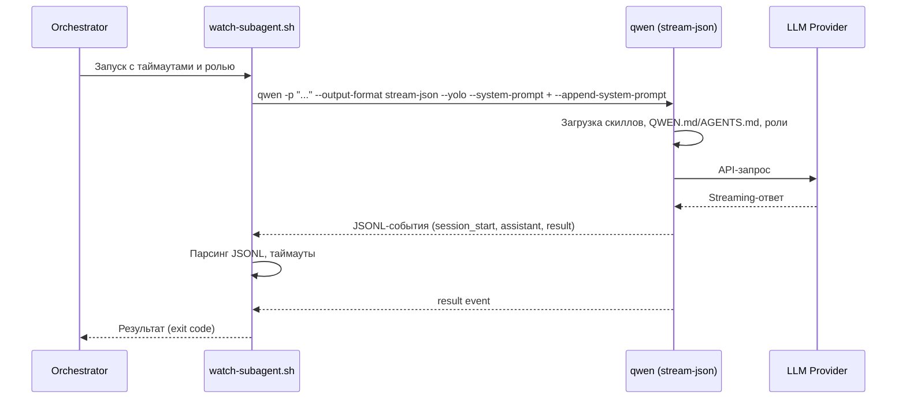

# Qwen CLI — Исследование для интеграции как сабагент

**Роль:** Аналитик (Шерлок)
**Дата:** 2026-05-10
**Объект:** Qwen Code v0.15.9 (`@qwen-code/qwen-code`, Node.js/TypeScript)
**Задача:** [TASK-research-qwen-cli](../../../todo/TASK-research-qwen-cli.todo.md)

---

## Сводка

Qwen Code (ранее известный как Qwen CLI) — open-source AI-coding-agent от Alibaba/Qwen Team, основанный на кодовой базе Google Gemini CLI. Версия 0.15.9, лицензия Apache-2.0. Node.js/TypeScript. Поддерживает мультипротокольные LLM-провайдеры (OpenAI, Anthropic, Google GenAI), имеет встроенные SubAgents, Skills, MCP и SDK (TypeScript, Python, Java). Qwen OAuth free tier прекращён 15.04.2026.

---

## Критерий 1. Системный промпт

### Возможности

| Опция | Поведение |
|-------|-----------|
| `--system-prompt <text>` | **Полная замена** дефолтного системного промпта для текущего запуска. Контекстные файлы (QWEN.md, AGENTS.md) и скиллы **добавляются поверх**. |
| `--append-system-prompt <text>` | **Дополнение** к текущему системному промпту (встроенному или из `--system-prompt`). Применяется после загрузки памяти и контекста. |
| Оба флага вместе | Допустимо комбинировать: `--system-prompt` задаёт базовый промпт, `--append-system-prompt` добавляет инструкции поверх. |

### Примеры CLI

```bash
# Полная замена системного промпта
qwen -p "Опиши архитектуру проекта" --system-prompt "Ты — экспертный AI-ассистент."

# Дополнение к дефолтному промпту
qwen -p "Отрефактори код" --append-system-prompt "Следуй стандартам PSR-12."

# Замена + дополнение (аналог нашему подходу в watch-subagent.sh)
qwen -p "Выполни задачу" \
  --system-prompt "scripts/subagent_system.txt" \
  --append-system-prompt "Возьми на себя роль из файла: docs/agents/roles/team/backend_developer_levsha.ru.md"
```

### Примечание

- `--system-prompt` применяется **только к текущему запуску** (single run).
- Контекстные файлы (QWEN.md, AGENTS.md) и загруженная память добавляются **после** `--system-prompt`.
- `--append-system-prompt` применяется **после** встроенного промпта и загруженной памяти.

### Оценка: ✅ Полная поддержка

Qwen Code предоставляет оба механизма — полную замену и дополнение — как CLI-флаги. Это идентично подходу Pi и полностью совместимо с нашим `watch-subagent.sh`.

---

## Критерий 2. Промпт агента / Роль

### Подход

Qwen Code не имеет встроенного механизма «ролей» как именованных сущностей. Роль инжектируется через `--append-system-prompt`, что указывает модели прочитать файл роли:

```bash
qwen -p "Выполни задачу" \
  --append-system-prompt "Возьми на себя роль из файла: docs/agents/roles/team/backend_developer_levsha.ru.md"
```

Модель самостоятельно прочитает файл роли при первом обращении через инструмент чтения файлов.

### Альтернативные подходы

1. **Inline-содержимое файла роли** — передать содержимое файла напрямую в `--append-system-prompt "$(cat role.md)"`. Минус: раздувает системный промпт.
2. **Через `@files`** — `qwen @role.md "Prompt"`. Минус: содержимое файла попадает в user-message, а не в system prompt.
3. **Через инструкцию прочитать файл** — оптимальный: экономит токены, модель загружает роль on-demand. Аналогично подходу Pi.

### Оценка: ✅ Полная поддержка (через --append-system-prompt)

Qwen Code позволяет гибко инжектировать контекст роли через `--append-system-prompt`. Наш подход с инструкцией «Возьми на себя роль из файла: ...» полностью совместим.

---

## Критерий 3. Скиллы

### Возможности

| Локация | Описание |
|---------|----------|
| `~/.qwen/skills/` | Персональные скиллы пользователя (глобальные) |
| `.qwen/skills/` | Проектные скиллы (в корне проекта) |
| `.agents/skills/` | Стандартные скиллы (второй приоритет после `.qwen/`) |
| Extension Skills | Скиллы из установленных расширений |
| Bundled Skills | Встроенные скиллы (поставляются с Qwen Code) |

### Механика

1. При старте Qwen Code сканирует директории скиллов (`SKILL_PROVIDER_CONFIG_DIRS = ['.qwen', '.agents']`).
2. Из каждого подкаталога с `SKILL.md` извлекается YAML frontmatter (`name`, `description`).
3. Скиллы регистрируются как инструменты и slash-команды (`/<skill-name>`).
4. Модель автоматически активирует скилл при совпадении задачи.
5. Поддерживается path-gating через `paths:` в YAML — скилл активируется только при работе с определёнными файлами.

### Формат SKILL.md

```markdown
---
name: my-skill
description: Описание скилла для автоматической активации
paths:
  - 'src/**/*.tsx'
---

# Инструкции скилла

...
```

### Можно ли задавать разные скиллы разным ролям

⚠️ Частично. Qwen Code не имеет явного CLI-флага для загрузки конкретных скиллов (`--skill` отсутствует). Скиллы загружаются автоматически из `.qwen/skills/` и `.agents/skills/`. Для разных ролей можно:
1. Размещать скиллы в `.qwen/skills/` проекта — все сабагенты получат их.
2. Использовать path-gating — скилл активируется только при обращении к определённым файлам.
3. Управлять доступностью через `--append-system-prompt` — инструктировать модель не использовать определённые скиллы.

Прямого CLI-механизма фильтрации скиллов (как `--skill` / `--no-skills` в Pi) **нет**.

### Оценка: ⚠️ Частичная поддержка

Скиллы поддерживаются из коробки, используют стандарт `.agents/skills/` и `.qwen/skills/`. Однако **нет CLI-управления** набором скиллов для конкретного запуска. Невозможно явно загрузить или отключить конкретный скилл через CLI-флаг.

---

## Критерий 4. AGENTS.md (контекстные файлы)

### Возможности

| Опция | Поведение |
|-------|-----------|
| Автообнаружение QWEN.md + AGENTS.md | Qwen Code загружает **оба** файла по умолчанию (`DEFAULT_CONTEXT_FILENAME = 'QWEN.md'`, `AGENT_CONTEXT_FILENAME = 'AGENTS.md'`) |
| `context.fileName` в settings | Можно переопределить имена файлов контекста (например, на `CUSTOM_AGENTS.md`) |

### Порядок загрузки

Qwen Code загружает контекстные файлы иерархически:

1. `~/.qwen/QWEN.md` — глобальные инструкции
2. Родительские директории от cwd вверх (до git root или корня ФС)
3. Текущая директория (`QWEN.md` и/или `AGENTS.md`)

### Взаимодействие с системным промптом

При `--system-prompt` (замена промпта) контекстные файлы **добавляются поверх**. Аналогично Pi.

### Примеры

```bash
# С автообнаружением (по умолчанию) — найдёт QWEN.md и AGENTS.md
qwen -p "Выполни задачу"

# Переопределение имени файла контекста через settings.json
# ~/.qwen/settings.json:
{
  "context": {
    "fileName": ["QWEN.md", "AGENTS.md", "CLAUDE.md"]
  }
}
```

### Оценка: ✅ Полная поддержка

Qwen Code автоматически обнаруживает и `QWEN.md`, и `AGENTS.md` из нашего проекта. Наш `AGENTS.md` в корне проекта будет загружен без дополнительных настроек.

---

## Критерий 5. Стандартная папка `.agents/skills/`

### Автосканирование

Qwen Code **поддерживает** автосканирование `.agents/skills/` из коробки. `SKILL_PROVIDER_CONFIG_DIRS = ['.qwen', '.agents']`.

| Локация | Правила сканирования |
|---------|---------------------|
| `~/.qwen/skills/` | Глобальные персональные скиллы |
| `~/.agents/skills/` | Глобальные стандартные скиллы |
| `.qwen/skills/` | Проектные скиллы (приоритет) |
| `.agents/skills/` | Проектные стандартные скиллы |
| Extension skills | Из установленных расширений |

### Наша структура

Наши скиллы лежат в `docs/agents/skills/`, а не в `.agents/skills/` или `.qwen/skills/`. Qwen Code **не автосканирует** `docs/agents/skills/`.

Для загрузки можно:
1. **Симлинк** — создать симлинку `.agents/skills/ → docs/agents/skills/`.
2. **Копия** — дублировать скиллы в `.qwen/skills/`.
3. **Через `--append-system-prompt`** — инструктировать модель загрузить `SKILL.md` вручную.

Отсутствует CLI-флаг `--skill <path>` (как в Pi), что ограничивает гибкость.

### Оценка: ✅ Поддерживается с минимальной настройкой

Стандарт `.agents/skills/` поддерживается из коробки. Наша структура `docs/agents/skills/` требует симлинки или другого обходного решения. Отсутствие `--skill` CLI-флага — минус.

---

## Критерий 6. Запуск как сабагент (JSON-режим)

### Возможности

| Опция | Поведение |
|-------|-----------|
| `-p` / `--prompt` | Headless-режим — один запрос и выход (non-interactive) |
| `--output-format text` | Текстовый вывод (по умолчанию) |
| `--output-format json` | JSON-массив всех сообщений (буферизованный, выдаётся в конце) |
| `--output-format stream-json` | JSONL-стриминг в реальном времени (как Pi `--mode json`) |
| `--include-partial-messages` | Частичные сообщения в stream-json |
| `--yolo` / `-y` | Auto-approve всех инструментов (без подтверждений) |
| `--approval-mode <mode>` | `plan` / `default` / `auto-edit` / `yolo` |
| `--max-session-turns <N>` | Ограничение числа витков |
| `--continue` / `-c` | Продолжить последнюю сессию проекта |
| `--resume <id>` | Возобновить конкретную сессию |
| `--session-id <id>` | Задать ID сессии |
| `--json-fd <N>` | Dual output — JSON на файловый дескриптор |
| `--json-file <path>` | Dual output — JSON в файл/FIFO |
| `--input-format stream-json` | Bidirectional JSON (в разработке) |
| stdin | Pipe: `echo "prompt" \| qwen` |

### Формат JSON

**JSON-режим** (`--output-format json`): выдаёт JSON-массив в конце сессии:

```json
[
  {"type": "system", "subtype": "session_start", "session_id": "...", "model": "qwen3.6-plus"},
  {"type": "assistant", "message": {"role": "assistant", "content": [...], "usage": {...}}},
  {"type": "result", "subtype": "success", "duration_ms": 1234, "result": "...", "usage": {...}}
]
```

**Stream-JSON-режим** (`--output-format stream-json`): JSONL-события в реальном времени:

```jsonl
{"type":"system","subtype":"session_start","session_id":"...","model":"qwen3.6-plus"}
{"type":"assistant","message":{"id":"...","role":"assistant","content":[...],"usage":{...}}}
{"type":"result","subtype":"success","duration_ms":1234,"result":"...","usage":{...}}
```

### Практические примеры запуска

```bash
# Простой headless-запрос
qwen -p "Объясни этот код"

# JSONL-стриминг (аналог pi --mode json --no-session)
qwen -p "Выполни задачу" \
  --output-format stream-json \
  --yolo

# С инъекцией роли (для сабагента)
qwen -p "Выполни задачу: todo/TASK-xxx.todo.md" \
  --output-format stream-json \
  --yolo \
  --system-prompt "scripts/subagent_system.txt" \
  --append-system-prompt "Возьми на себя роль из файла: docs/agents/roles/team/backend_developer_levsha.ru.md"

# Через pipe
echo "Проверь тесты" | qwen --output-format stream-json --yolo

# С ограничением витков
qwen -p "Сделай рефакторинг" --output-format json --yolo --max-session-turns 20
```

### Отсутствует

- **Явный ephemeral-режим** (как `--no-session` в Pi). Qwen Code сохраняет сессии в `~/.qwen/projects/<sanitized-cwd>/chats/` по умолчанию.
- **RPC-режим** (как `--mode rpc` в Pi). Bidirectional `--input-format stream-json` заявлен, но в разработке.

### Пример потока данных



### Оценка: ✅ Полная поддержка

Qwen Code предоставляет развитый headless-режим с JSONL-стримингом, аналогичный Pi. Поддержка `--yolo`, `--max-session-turns`, JSON/stream-json делает его пригодным для интеграции как сабагент. Отсутствие явного `--no-session` — незначительный минус (сессии сохраняются, но не влияют на работу).

---

## Критерий 7. Токены и стоимость

### Доступные метрики

В JSON-выходе каждое сообщение содержит объект `usage`:

```typescript
interface UsageMetadata {
  promptTokenCount: number;     // Входные токены
  candidatesTokenCount: number; // Выходные токены
  totalTokenCount: number;      // Общее количество токенов
  cachedContentTokenCount?: number; // Токены из кеша
}
```

### Доступ через JSON/JSONL

Метрики доступны в событиях `assistant` (в поле `message.usage`) и `result`:

```bash
# Извлечь usage из stream-json
qwen -p "prompt" --output-format stream-json --yolo 2>/dev/null | jq 'select(.type == "result") | .usage'
```

### В интерактивном режиме

Команда `/stats` показывает статистику сессии: модель, количество запросов, время сессии, использование токенов. Status line отображает использование контекста.

### SDK

Python SDK и TypeScript SDK предоставляют доступ к `usage` через программный API.

### Оценка: ✅ Полная поддержка

Полная телеметрия по токенам доступна через JSON/JSONL-вывод. Отсутствует явная разбивка стоимости в долларах (как у Pi), но токены подсчитываются.

---

## Критерий 8. Free tier

### Qwen OAuth (прекращён)

⚠️ Qwen OAuth free tier **прекращён 15.04.2026**. Ранее предоставлял 1000 запросов/день (с 13.04.2026 — 100 запросов/день), далее — полностью отключён.

### Текущие бесплатные возможности

| Провайдер | Бесплатные возможности |
|-----------|----------------------|
| Alibaba Cloud Coding Plan | Фиксированная месячная подписка (платная). Бесплатного тарифа нет. |
| Google Gemini API | Free tier: Gemini 2.5 Flash — 15 RPM, 1M tokens/min. |
| Ollama / LM Studio / vLLM | Полностью бесплатно при локальных моделях (GPU + RAM). |
| OpenRouter | Некоторые модели имеют free tier. |

### Сам инструмент

Qwen Code — **open-source** (Apache-2.0), сам по себе бесплатный. Стоимость определяется провайдером LLM.

### Оценка: ⚠️ Бесплатный инструмент, но нативный free tier прекращён

Qwen Code бесплатный, но нативный Qwen OAuth free tier отключён. Для бесплатного использования подходят Google Gemini API free tier или локальные модели через Ollama/vLLM.

---

## Критерий 9. Провайдеры и модели

### Поддерживаемые протоколы

Qwen Code поддерживает 3 протокола API через `modelProviders` в `settings.json`:

| Протокол | Описание |
|----------|----------|
| `openai` | OpenAI-compatible API (Qwen/Dashscope, OpenAI, OpenRouter, Fireworks, Ollama, vLLM, LM Studio) |
| `anthropic` | Anthropic Messages API (Claude) |
| `gemini` | Google Generative AI (Gemini) |
| `vertex-ai` | Google Vertex AI |

### Конфигурация через settings.json

```json
{
  "modelProviders": {
    "openai": [
      {"id": "qwen3.6-plus", "baseUrl": "https://dashscope.aliyuncs.com/compatible-mode/v1", "envKey": "DASHSCOPE_API_KEY"},
      {"id": "gpt-4o", "baseUrl": "https://api.openai.com/v1", "envKey": "OPENAI_API_KEY"},
      {"id": "qwen3:32b", "baseUrl": "http://localhost:11434/v1", "description": "Ollama local"}
    ],
    "anthropic": [
      {"id": "claude-sonnet-4-20250514", "envKey": "ANTHROPIC_API_KEY"}
    ],
    "gemini": [
      {"id": "gemini-2.5-pro", "envKey": "GEMINI_API_KEY"}
    ]
  },
  "model": {"name": "qwen3.6-plus"},
  "security": {"auth": {"selectedType": "openai"}}
}
```

### BYOK (Bring Your Own Key)

Да, полная поддержка. API-ключи передаются через:
- Environment variables
- `settings.json` → `env`
- Shell `export`

### Локальные модели

| Решение | Поддержка |
|---------|-----------|
| Ollama | ✅ Через `baseUrl: "http://localhost:11434/v1"` |
| vLLM | ✅ Через `baseUrl: "http://localhost:8000/v1"` |
| LM Studio | ✅ Через OpenAI-compatible endpoint |

### Переключение моделей

```bash
# CLI (если поддерживается)
# В интерактивном режиме:
/model

# Через settings.json:
"model": {"name": "claude-sonnet-4-20250514"}
```

### Coding Plan модели (Alibaba Cloud)

Qwen3.6-Plus, Qwen3.5-Plus, GLM-4.7, Kimi-K2.5 — через Alibaba Cloud Coding Plan.

### Оценка: ✅ Поддержка 3 протоколов, BYOK, Ollama/vLLM

Qwen Code поддерживает OpenAI, Anthropic и Google GenAI протоколы. BYOK через environment variables или settings.json. Локальные модели через Ollama/vLLM/LM Studio. Выбор провайдеров уже, чем у Pi (3 протокола vs 20+Named providers), но покрывает все основные.

---

## Критерий 10. Лицензия

### Информация

| Параметр | Значение |
|----------|----------|
| Пакет | `@qwen-code/qwen-code` |
| Организация | QwenLM (Alibaba) |
| Репозиторий | https://github.com/QwenLM/qwen-code |
| Лицензия | **Apache-2.0** |
| Основа | Форк Google Gemini CLI |
| Язык | TypeScript / Node.js |

### Условия

Apache-2.0 разрешает:
- Коммерческое использование
- Модификацию
- Распространение
- Private use
- Патентную лицензию

Требования: включить копию лицензии, уведомление об авторских правах, указать изменения.

### Оценка: ✅ Open source, Apache-2.0

---

## Вердикт

### ✅ Подходит (Score: 8/10)

Qwen Code **подходит** для использования как сабагент с нашей системой ролей и скиллов.

**Сильные стороны:**
1. Гибкая система системного промпта (`--system-prompt` + `--append-system-prompt`) — идентична Pi
2. JSONL-стриминг (`--output-format stream-json`) для интеграции
3. `--yolo` для non-interactive режима без подтверждений
4. Автообнаружение `AGENTS.md` + `QWEN.md` — полная совместимость с нашим проектом
5. Автосканирование `.agents/skills/` из коробки
6. Поддержка OpenAI/Anthropic/Gemini протоколов + BYOK + Ollama/vLLM
7. Apache-2.0 лицензия
8. SDK (TypeScript, Python, Java) для глубокой интеграции
9. Встроенные SubAgents (agent tool) — можно порождать вложенных агентов
10. `--max-session-turns` — контроль лимита витков

**Ограничения (по сравнению с Pi):**
1. **Нет CLI-управления скиллами** — отсутствуют флаги `--skill` / `--no-skills`. Нельзя явно загрузить или отфильтровать скиллы для конкретного запуска.
2. **Нет явного ephemeral-режима** — сессии сохраняются (нет аналога `--no-session`). Незначительно для headless-запусков, но может привести к накоплению данных.
3. **Нет CLI-переключения провайдеров/моделей** — модель задаётся через `settings.json`, а не CLI-флагом (`--model`). Переключение в интерактивном режиме через `/model`.
4. **Нет `--tools` фильтрации** — нельзя ограничить набор инструментов через CLI (как `--tools read,bash` в Pi).
5. **Нет явной разбивки стоимости** — подсчитываются токены, но нет калькуляции стоимости в долларах.
6. **Qwen OAuth free tier прекращён** — требуется API-ключ или подписка Coding Plan.

---

## Приложение А. Практические примеры запуска

### Запуск Бэкендера Левши (адаптация watch-subagent.sh для Qwen Code)

```bash
qwen -p "Выполни задачу: todo/TASK-feat-example.todo.md.
Следуй инструкциям из секции 'Инструкции для сабагента' в файле задачи и AGENTS.md." \
  --output-format stream-json \
  --yolo \
  --system-prompt "Ты — AI-ассистент, исполняющий задачи. Возвращай результат в stdout." \
  --append-system-prompt "Возьми на себя роль из файла: docs/agents/roles/team/backend_developer_levsha.ru.md"
```

### Запуск Аналитика (только чтение)

```bash
qwen -p "Проанализируй архитектуру проекта" \
  --output-format stream-json \
  --yolo \
  --append-system-prompt "Возьми на себя роль из файла: docs/agents/roles/team/system_analyst_sherlock.ru.md"
```

### Запуск Ревьювера

```bash
qwen -p "Проведи ревью PR #123" \
  --output-format stream-json \
  --yolo \
  --append-system-prompt "Возьми на себя роль из файла: docs/agents/roles/team/code_reviewer_backend_puaro.ru.md"
```

### Запуск с конкретной моделью

```bash
qwen -p "Объясни код" \
  --output-format json \
  --yolo
# Модель определяется в ~/.qwen/settings.json → model.name
```

---

## Приложение Б. Сравнение с Pi по ключевым критериям

| Критерий | Pi Coding Agent | Qwen Code |
|----------|-----------------|-----------|
| Системный промпт | `--system-prompt` + `--append-system-prompt` | `--system-prompt` + `--append-system-prompt` ✅ идентично |
| Роль | Через `--append-system-prompt` | Через `--append-system-prompt` ✅ идентично |
| Скиллы (CLI) | `--skill`, `--no-skills` | ❌ Нет CLI-управления |
| Скиллы (автоскан) | `.agents/skills/`, `.pi/skills/` | `.agents/skills/`, `.qwen/skills/` ✅ |
| AGENTS.md | ✅ AGENTS.md + CLAUDE.md | ✅ QWEN.md + AGENTS.md |
| JSONL-стриминг | `--mode json` | `--output-format stream-json` ✅ |
| Ephemeral | `--no-session` | ❌ Нет (сессии сохраняются) |
| YOLO | Нет (по умолчанию) | `--yolo` ✅ |
| Tools filter | `--tools read,bash` | ❌ Нет CLI-фильтрации |
| Провайдеры | 20+ Named providers | 3 протокола (OpenAI, Anthropic, Gemini) + BYOK |
| Локальные модели | Ollama, LM Studio, vLLM | Ollama, vLLM, LM Studio ✅ |
| Лицензия | MIT | Apache-2.0 |
| SDK | Нет | TypeScript, Python, Java ✅ |
| SubAgents | Нет (только через watch-subagent) | Встроенные (agent tool) ✅ |
| Стоимость в $ | ✅ Есть | ❌ Только токены |

---

## Источники

1. [Qwen Code — GitHub](https://github.com/QwenLM/qwen-code) — репозиторий и README
2. [Qwen Code Docs — Headless Mode](https://qwenlm.github.io/qwen-code-docs/en/users/features/headless/) — документация headless-режима
3. [Qwen Code Docs — Skills](https://qwenlm.github.io/qwen-code-docs/en/users/features/skills/) — документация системы скиллов
4. [Qwen Code Docs — Settings](https://qwenlm.github.io/qwen-code-docs/en/users/configuration/settings/) — конфигурация settings.json
5. Исходный код: `packages/core/src/skills/skill-manager.ts`, `packages/core/src/memory/const.ts`, `packages/cli/src/config/config.ts`
