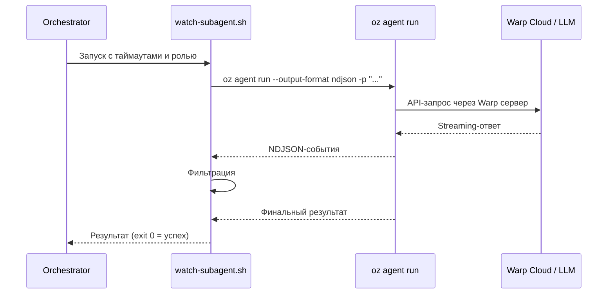

# Warp AI (Oz Agent) — Исследование для интеграции как сабагент

**Роль:** Аналитик (Шерлок)
**Дата:** 2026-05-10
**Объект:** Warp AI / Oz Agent CLI (`oz`, Rust, Denver Technologies / Warp.dev)
**Задача:** [TASK-research-warp-agent](../../../todo/done/TASK-research-warp-agent.todo.md)

---

## Сводка

Warp — AI-powered терминальный эмулятор на Rust от Warp.dev (Denver Technologies, Inc.), 57K+ звёзд на GitHub. Начиная с 2025 года — **open source** (двойная лицензия AGPL-3.0 / MIT). Warp включает встроенный AI-агент «Oz» и CLI-инструмент `oz` для программного запуска и оркестрации агентов. Oz способен делегировать выполнение другим CLI-агентам (Claude Code, OpenCode, Gemini CLI, Codex). Warp — это не классический CLI-coding-agent, а терминал с AI-функциями и платформа оркестрации облачных агентов.

---

## Критерий 1. Системный промпт

### Возможности

| Опция | Поведение |
|-------|-----------|
| `--config-file` / `-f` | Загрузка YAML/JSON конфигурации агента. Может содержать настройки системного промпта. |
| `--profile` | Выбор профиля агента (преднастроенная конфигурация). Список профилей: `oz agent profile list`. |
| `--skill` | Скилл может задавать базовый контекст (base prompt) для агента. |
| `--prompt` / `-p` | Пользовательский промпт (user message), а не системный. |
| WARP.md | Файл в корне проекта — инструкции для агента (аналог AGENTS.md, но специфичный для Warp). |

### Ограничения

**Нет прямых CLI-флагов** для замены или дополнения системного промпта:
- Нет `--system-prompt` (как у pi)
- Нет `--append-system-prompt` (как у pi)
- Системный промпт управляется через конфигурационные файлы (YAML/JSON) или профили

### Примеры CLI

```bash
# Запуск с конфигурационным файлом (может включать системный промпт)
oz agent run -f agent-config.yaml -p "Выполни задачу"

# Запуск с профилем (преднастроенный системный промпт)
oz agent run --profile backend-dev -p "Реализуй feature X"
```

### Сравнение с pi

| Функция | Pi | Warp Oz |
|---------|-----|---------|
| Полная замена системного промпта | `--system-prompt` | ❌ Только через config file |
| Дополнение системного промпта | `--append-system-prompt` | ❌ Нет прямого аналога |
| Файловое дополнение | `.pi/APPEND_SYSTEM.md` | config file / profile |
| Проектный контекст | AGENTS.md (авто) | WARP.md + AGENTS.md (вероятно) |

### Оценка: ⚠️ Частичная поддержка

Системный промпт настраивается через конфигурационные файлы и профили, но нет прямых CLI-флагов для инъекции. Для каждого агента/роли потребуется создать отдельный конфигурационный файл или профиль, что менее гибко, чем у pi.

---

## Критерий 2. Промпт агента / Роль

### Подход

Oz CLI не имеет встроенного механизма «ролей» как такового. Роль можно инжектировать через несколько механизмов:

1. **Через `--prompt`** — добавить инструкцию о роли в начало промпта:
   ```bash
   oz agent run -p "Возьми на себя роль из файла: docs/agents/roles/team/backend_developer_levsha.ru.md. Выполни задачу."
   ```
   Минус: инструкция о роли попадает в user message, а не в system prompt.

2. **Через `--profile`** — создать профиль агента с преднастроенным системным промптом:
   ```bash
   oz agent run --profile levsha -p "Выполни задачу: ..."
   ```

3. **Через `--config-file`** — создать YAML/JSON с системным промптом роли:
   ```bash
   oz agent run -f roles/backend-dev.yaml -p "Выполни задачу"
   ```

4. **Через `--skill`** — скилл может включать контекст роли.

### Альтернативный подход через Harness

Oz может делегировать выполнение другому CLI-агенту через систему harness:

```bash
# Запуск через Claude Code как harness
oz agent run --harness claude -p "Возьми на себя роль..."

# Запуск через OpenCode как harness
oz agent run --harness opencode -p "..."
```

В этом случае системный промпт управляется делегированным агентом (claude, opencode и т.д.), а Oz выступает как оркестратор.

### Оценка: ⚠️ Частичная поддержка (через config-file, profile или harness)

Нет прямого CLI-флага для инъекции роли (как `--append-system-prompt` у pi). Требуется предварительная настройка (создание профиля или конфигурационного файла).

---

## Критерий 3. Скиллы

### Возможности

| Опция | Поведение |
|-------|-----------|
| `--skill <spec>` | Загрузить скилл как базовый контекст для агента |
| Автосканирование | Oz сканирует `.agents/skills/`, `.warp/skills/`, `.claude/skills/`, `.codex/skills/` |
| Формат спецификации | `name`, `repo:name`, `org/repo:name`, или полный путь к `SKILL.md` |

### Механика

Система скиллов Warp следует [Agent Skills standard](https://agentskills.io/specification):

1. Oz сканирует директории скиллов при запуске
2. `--skill` загружает конкретный скилл как базовый контекст
3. Формат `SKILL.md` — стандартный (YAML frontmatter: `name` + `description`)
4. Публичный репозиторий скиллов: [`warpdotdev/oz-skills`](https://github.com/warpdotdev/oz-skills)

### Примеры

```bash
# Загрузить скилл по имени (ищется в .agents/skills/, .warp/skills/, .claude/skills/, .codex/skills/)
oz agent run --skill fix-errors -p "Исправь ошибки компиляции"

# Загрузить скилл из другого репозитория
oz agent run --skill warp-internal:code-review -p "Проведи ревью"

# Загрузить скилл с указанием org/repo
oz agent run --skill warpdotdev/warp-internal:code-review -p "Проведи ревью"

# Полный путь к SKILL.md
oz agent run --skill .agents/skills/my-skill/SKILL.md -p "Выполни"

# Комбинирование скилла и промпта
oz agent run --skill review-pr -p "Проведи ревью PR #123"
```

### Разные скиллы разным ролям

Да, поддерживается. Каждому вызову `oz agent run` можно передать свой `--skill`. Также можно создавать разные профили с разными наборами скиллов.

### Оценка: ✅ Полная поддержка

Warp реализует [Agent Skills standard](https://agentskills.io/specification) с развитым механизмом обнаружения, загрузки и управления скиллами. CLI-флаг `--skill` позволяет гибко назначать скиллы. Поддерживается назначение разных скиллов разным ролям через разные вызовы CLI или профили.

---

## Критерий 4. AGENTS.md (контекстные файлы)

### Возможности

| Файл | Статус |
|------|--------|
| WARP.md | ✅ Подтверждён — используется в репозитории Warp как основной файл инструкций для агента |
| AGENTS.md | ⚠️ Вероятно поддерживается — используется в репозитории `warpdotdev/oz-skills` |
| CLAUDE.md | ⚠️ Вероятно поддерживается — Oz сканирует `.claude/skills/`, может поддерживать и `CLAUDE.md` |

### Из исходного кода

Файл `WARP.md` в корне репозитория Warp содержит:
- Команды разработки (build, test, lint)
- Обзор архитектуры
- Руководства по стилю кодирования
- Паттерны тестирования
- Рабочий процесс PR

Аналогичный файл `AGENTS.md` присутствует в репозитории `warpdotdev/oz-skills` и содержит инструкции для агентов при работе с скиллами.

### Отключение

Нет подтверждённого CLI-флага для отключения загрузки контекстных файлов (аналог `--no-context-files` у pi).

### Оценка: ⚠️ Частичная поддержка

WARP.md подтверждён как основной файл инструкций для агента. AGENTS.md используется в суб-репозиториях. Точный порядок загрузки и поддержка автообнаружения из CWD/ancestor directories для Oz CLI не полностью подтверждены документацией.

---

## Критерий 5. Стандартная папка `.agents/skills/`

### Автосканирование

Oz **поддерживает** автосканирование `.agents/skills/` из коробки, с расширенным поиском по нескольким директориям:

| Локация | Поддержка |
|---------|-----------|
| `.agents/skills/` | ✅ Сканируется (подтверждено в `skill.rs`) |
| `.warp/skills/` | ✅ Сканируется |
| `.claude/skills/` | ✅ Сканируется |
| `.codex/skills/` | ✅ Сканируется |

### Подтверждение из исходного кода

Файл `crates/warp_cli/src/skill.rs`:

```rust
/// Simple skill names (searched with directory precedence):
/// code-review  // searches .agents/skills/, .warp/skills/,
///              // .claude/skills/, .codex/skills/
```

Репозиторий Warp содержит 20+ встроенных скиллов в `.agents/skills/`:
`add-feature-flag`, `add-telemetry`, `create-pr`, `dedupe-issue-local`, `diagnose-ci-failures`, `fix-errors`, `implement-specs`, `promote-feature`, `remove-feature-flag`, `resolve-merge-conflicts`, `review-pr`, `review-pr-local`, `rust-unit-tests`, `spec-driven-implementation`, `triage-issue-local`, `update-skill`, `warp-integration-test`, `warp-ui-guidelines`, `write-product-spec`, `write-tech-spec` и др.

### Наша структура

Наши скиллы лежат в `docs/agents/skills/`, а не в `.agents/skills/`. Для Oz потребуется:
1. Явный `--skill docs/agents/skills/agent-report/SKILL.md` — указание полного пути
2. Или символическая ссылка `.agents/skills/ → docs/agents/skills/`

### Оценка: ✅ Полная поддержка из коробки

Стандарт `.agents/skills/` поддерживается нативно. Расширенный поиск по 4 директориям (`.agents/`, `.warp/`, `.claude/`, `.codex/`). Наша структура `docs/agents/skills/` требует явного указания пути.

---

## Критерий 6. Запуск как сабагент (JSON-режим)

### Возможности

| Опция | Поведение |
|-------|-----------|
| `oz agent run -p "..." --output-format json` | Вывод результата в JSON |
| `oz agent run -p "..." --output-format ndjson` | Стриминг событий в NDJSON (newline-delimited JSON) |
| `oz agent run -p "..." --output-format text` | Простой текст |
| `oz agent run-cloud -p "..."` | Запуск агента в облаке |
| `--model <model_id>` | Выбор модели |
| `--harness <type>` | Выбор harness-а (oz/claude/opencode/gemini/codex) |
| `--cwd <path>` | Рабочая директория |
| `--mcp <spec>` | MCP-серверы |
| `--profile <id>` | Профиль агента |
| `--skill <spec>` | Скилл |

### Управление запусками

```bash
# Список запусков
oz run list

# Статус конкретного запуска
oz run get <run-id>

# Получить conversation
oz run conversation get <conversation-id>

# Потоковое чтение сообщений агента
oz run message watch <run-id>

# Отправка сообщения агенту (inter-agent messaging)
oz run message send --to <run-id> --subject "..." --body "..."
```

### Harness-система

Oz может делегировать выполнение другим CLI-агентам:

```bash
# Встроенный Oz harness
oz agent run --harness oz -p "Выполни задачу"

# Claude Code как harness
oz agent run --harness claude -p "Выполни задачу"

# OpenCode как harness
oz agent run --harness opencode -p "Выполни задачу"

# Gemini CLI как harness
oz agent run --harness gemini -p "Выполни задачу"

# Codex как harness
oz agent run --harness codex -p "Выполни задачу"
```

### Inter-agent messaging

Уникальная возможность — обмен сообщениями между запущенными агентами:

```bash
# Отправить сообщение другому агенту
oz run message send --to <recipient-run-id> --sender-run-id <my-run-id> \
  --subject "Review needed" --body "Проверь изменения в module X"

# Получить входящие сообщения
oz run message list <run-id>

# Читать сообщения в реальном времени
oz run message watch <run-id>
```

### Ключевые ограничения

1. **Требует учётную запись Warp** — `oz login`, `oz whoami`
2. **Требует серверное соединение** — облачная зависимость (Warp cloud)
3. **Нет `--no-session`** — аналога ephemeral-режима pi
4. **Формат NDJSON** — может быть менее детальным, чем JSONL-события pi

### Пример потока данных



### Оценка: ⚠️ Частичная поддержка

Технически Oz CLI поддерживает программный запуск с JSON/NDJSON-выводом и обладает уникальными возможностями (inter-agent messaging, harness delegation, scheduling). Однако **обязательная облачная зависимость** (требуется Warp-аккаунт и серверное соединение) делает его менее автономным, чем pi с его `--mode json --no-session`. Это платформа для оркестрации, а не standalone CLI-agent.

---

## Критерий 7. Токены и стоимость

### Доступные метрики

Из анализа исходного кода (`crates/ai/src/telemetry.rs`):

```rust
pub enum AITelemetryEvent {
    MerkleTreeSnapshotRebuildSuccess { duration },
    SyncCodebaseContextSuccess { total_sync_duration, flushed_node_count, ... },
    // ... технические метрики синхронизации контекста
}
```

### Ограничения

- **Нет прямого доступа к токенам** — телеметрия фокусируется на синхронизации контекста, а не на потреблении токенов
- **Отслеживание на стороне сервера** — Warp cloud отслеживает использование, но CLI не выводит токены/стоимость
- **Нет `usage` в CLI-выводе** — в отличие от pi, где `usage` доступен в каждом JSONL-событии
- **Вывод через `--output-format json`** — может включать некоторую usage-информацию, но это не подтверждено

### Оценка: ⚠️ Частичная поддержка

Токены и стоимость отслеживаются серверно (Warp cloud). Нет CLI-доступа к метрикам потребления. Нет аналога pi's `usage` объекта в JSONL-событиях.

---

## Критерий 8. Free tier

### Warp Terminal

Warp Terminal имеет бесплатный тариф:
- **Free:** Базовый терминал + ограниченные AI-запросы
- **Warp Pro:** ~$15/мес — неограниченные AI-запросы, расширенные возможности
- **Warp Business/Enterprise:** Командные функции, расширенное управление

### Oz Agent Cloud

Облачные агенты Oz могут иметь отдельные лимиты/тарификацию. Детали не полностью подтверждены.

### BYOK

Поддерживается BYOK (Bring Your Own Key) для:
- **Google** (Gemini API)
- **Anthropic** (Claude API)
- **OpenAI** (GPT API)
- **OpenRouter** (агрегатор)

При использовании BYOK стоимость определяется провайдером, а не Warp.

### Оценка: ⚠️ Free tier есть, но с ограничениями

Бесплатный тариф включает ограниченные AI-функции. Для полноценного использования как сабагента (неограниченные запуски, cloud agents) потребуется платная подписка или BYOK.

---

## Критерий 9. Провайдеры и модели

### BYOK (Bring Your Own Key)

Из исходного кода (`crates/ai/src/api_keys.rs`):

```rust
pub struct ApiKeys {
    pub google: Option<String>,
    pub anthropic: Option<String>,
    pub openai: Option<String>,
    pub open_router: Option<String>,
}
```

| Провайдер | API | Примечание |
|-----------|-----|------------|
| Anthropic | Claude серии | Claude Sonnet, Opus и т.д. |
| OpenAI | GPT серии | GPT-4o, GPT-5 и т.д. |
| Google | Gemini серии | Gemini 2.5 Pro, Flash и т.д. |
| OpenRouter | Агрегатор | Доступ к множеству моделей |

### Harness-делегирование

Oz может делегировать выполнение другим CLI-агентам, расширяя доступные модели:

| Harness | Модели |
|---------|--------|
| Oz (default) | Через Warp cloud или BYOK |
| Claude Code | Anthropic Claude |
| OpenCode | 75+ провайдеров (через OpenCode) |
| Gemini CLI | Google Gemini |
| Codex | OpenAI GPT |

### Переключение

```bash
# Список доступных моделей
oz model list

# Выбор модели
oz agent run --model gemini-2.5-pro -p "..."
oz agent run --model claude-sonnet-4 -p "..."

# Через harness
oz agent run --harness claude -p "..."
```

### Локальные модели

**Нет прямой поддержки** Ollama, LM Studio или vLLM через BYOK-интерфейс. Возможные обходные пути:
- Через OpenRouter (если поддерживает локальные модели)
- Через harness-делегирование агенту, поддерживающему Ollama (например, OpenCode)

### Оценка: ⚠️ 4 BYOK-провайдера + 4 harness-делегата

Меньше провайдеров напрямую, чем у pi (20+), но harness-система компенсирует это доступом к моделям других CLI-агентов. Нет прямой поддержки локальных моделей.

---

## Критерий 10. Лицензия

### Информация

| Параметр | Значение |
|----------|----------|
| Продукт | Warp Terminal + Oz Agent CLI |
| Разработчик | Denver Technologies, Inc. (Warp.dev) |
| Язык | Rust |
| Лицензия | **Двойная**: AGPL-3.0 + MIT |
| Репозиторий | https://github.com/warpdotdev/warp |
| Звёзды | 57,093+ |
| Статус | Open source с 2025 года |

### Условия

**AGPL-3.0** (основная):
- Копилефт — модификации должны распространяться под той же лицензией
- Сетевое использование (SaaS) требует предоставления исходного кода
- Коммерческое использование разрешено

**MIT** (дополнительная):
- Максимальная свобода использования
- Без ограничений на модификацию и распространение

### Серверная часть

README указывает: "The server portion of Warp will remain closed-source for now." — серверные компоненты (Warp Cloud) остаются проприетарными. Клиент полностью open source.

### Оценка: ✅ Open source, двойная лицензия AGPL-3.0 / MIT

Клиентское ПО полностью open source. Серверная часть (Warp Cloud) — проприетарная, но не требуется для локального использования (только для облачных агентов).

---

## Вердикт

### ⚠️ Частично подходит (7/10)

Warp Oz Agent CLI **частично подходит** для использования как сабагент с нашей системой ролей и скиллов. Технически инфраструктура мощная (JSON/NDJSON вывод, harness-делегирование, inter-agent messaging, скиллы), но архитектурные решения Warp (обязательная облачная зависимость, отсутствие прямых CLI-флагов для системного промпта) создают существенные ограничения для нашей модели использования.

### Сильные стороны

1. **Harness-система** — уникальная возможность делегировать выполнение Claude Code, OpenCode, Gemini CLI, Codex из единого CLI
2. **Inter-agent messaging** — обмен сообщениями между запущенными агентами (`oz run message send/watch/list`)
3. **Полная поддержка Agent Skills standard** — `--skill` CLI-флаг, автосканирование 4 директорий
4. **Cloud agents** — запуск агентов в облаке (`oz agent run-cloud`), scheduling (`oz schedule`)
5. **MCP-поддержка** — `--mcp` флаг для подключения MCP-серверов
6. **Open source** — AGPL-3.0 / MIT, 57K+ звёзд
7. **JSON/NDJSON вывод** — `--output-format json|ndjson` для программного парсинга
8. **Мультипровайдерный BYOK** — Google, Anthropic, OpenAI, OpenRouter

### Ключевые ограничения (для нашего use case)

1. **Обязательная облачная зависимость** — требует Warp-аккаунт и серверное соединение. Pi работает полностью автономно.
2. **Нет прямых CLI-флагов для системного промпта** — нет `--system-prompt` / `--append-system-prompt`. Требуется предварительная настройка через config file или profile.
3. **Нет ephemeral-режима** — нет аналога `--no-session` у pi. Сессии управляются серверно.
4. **Ограниченная телеметрия токенов** — нет доступа к потреблению токенов через CLI (в отличие от pi's `usage` объекта).
5. **Меньше прямых провайдеров** — 4 BYOK + 4 harness vs 20+ у pi. Нет прямой поддержки Ollama/LM Studio.

### Сравнение с Pi

| Аспект | Pi (текущий) | Warp Oz |
|--------|-------------|---------|
| Системный промпт | ✅ `--system-prompt` + `--append-system-prompt` | ⚠️ Только config file / profile |
| Скиллы | ✅ `--skill` CLI | ✅ `--skill` CLI, 4 директории поиска |
| JSON-режим | ✅ `--mode json --no-session` | ⚠️ `--output-format ndjson`, нет ephemeral |
| Ephemeral | ✅ `--no-session` | ❌ Нет аналога |
| Токены | ✅ Полная телеметрия в JSONL | ⚠️ Серверно, нет CLI-доступа |
| Провайдеры | ✅ 20+, BYOK, Ollama, LM Studio | ⚠️ 4 BYOK + 4 harness |
| Офлайн | ✅ Полностью автономен | ❌ Требует сервер |
| Harness delegation | ❌ Нет | ✅ Claude, OpenCode, Gemini, Codex |
| Inter-agent messaging | ❌ Нет | ✅ `oz run message send/watch` |
| Лицензия | MIT | AGPL-3.0 / MIT |

### Рекомендация

Warp Oz интересен как **потенциальная платформа оркестрации** (для запуска нескольких CLI-агентов через единую систему с harness delegation и inter-agent messaging), но **не как прямой replacement для pi** в роли сабагента. Для нашего текущего use case (запуск одного сабагента с конкретной ролью через `watch-subagent.sh`) pi остаётся более подходящим благодаря:
- Прямым CLI-флагам для системного промпта
- Полной автономности (без сервера)
- Ephemeral-режиму
- Детальной телеметрии токенов

**Возможный use case для Warp в будущем:** если нам потребуется оркестрация нескольких агентов (например, параллельный запуск Бэкендера + Ревьювера с обменом сообщениями), Warp Oz может стать ценным дополнением к нашей системе.

---

## Приложение А. Практические примеры запуска

### Запуск Oz с конкретной моделью и JSON-выводом

```bash
oz agent run --model gemini-2.5-pro --output-format json -p "Проанализируй архитектуру проекта"
```

### Запуск через harness Claude Code

```bash
oz agent run --harness claude --output-format ndjson -p "Реализуй feature X"
```

### Запуск с конкретным скиллом

```bash
oz agent run --skill fix-errors --output-format ndjson -p "Исправь ошибки компиляции"
```

### Запуск с профилем и MCP

```bash
oz agent run --profile backend-dev --mcp .mcp.json --output-format json -p "Выполни задачу"
```

### Облачный запуск

```bash
oz agent run-cloud -p "Реализуй feature Y" --name "feature-y-impl" --output-format json
```

### Inter-agent messaging

```bash
# Запустить первый агент
oz agent run -p "Напиши код" --name "coder"

# Запустить второй агент и отправить сообщение первому
oz agent run -p "Проведи ревью" --name "reviewer"
oz run message send --to <coder-run-id> --sender-run-id <reviewer-run-id> \
  --subject "Review" --body "Обрати внимание на module X"
```

---

## Приложение Б. Структура конфигурационного файла (предположительная)

### agent-config.yaml (пример)

```yaml
# Предположительная структура на основе анализа CLI-аргументов
model: gemini-2.5-pro
harness: oz
skills:
  - fix-errors
  - review-pr
system_prompt: |
  Ты — экспертный AI-ассистент.
  Следуй конвенциям проекта AGENTS.md.
mcp_servers:
  - path: .mcp.json
```

> ⚠️ Точная схема конфигурационного файла не документирована публично. Структура выше — предположительная на основе CLI-аргументов.

---

## Источники

1. [Warp GitHub Repository](https://github.com/warpdotdev/warp) — исходный код (AGPL-3.0 / MIT, 57K+ stars)
2. [Warp README](https://github.com/warpdotdev/warp/blob/master/README.md) — описание продукта, установка, open source plans
3. [Warp WARP.md](https://github.com/warpdotdev/warp/blob/master/WARP.md) — инструкции для агентов при работе с кодовой базой Warp
4. [Oz Skills Repository](https://github.com/warpdotdev/oz-skills) — публичный каталог скиллов, AGENTS.md, Agent Skills standard
5. [Warp Discussion #400](https://github.com/warpdotdev/Warp/discussions/400) — история open-sourcing Warp
