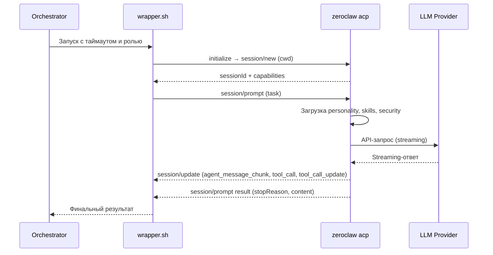

# Zeroclaw (zeroclaw-labs) — Исследование для интеграции как сабагент

**Роль:** Аналитик (Шерлок)
**Дата:** 2026-05-20
**Объект:** Zeroclaw v0.7.5 (`zeroclaw`, Rust, zeroclaw-labs/zeroclaw, 31.5k★)
**Задача:** [TASK-research-zeroclaw-agent](../../../todo/done/TASK-research-zeroclaw-agent.todo.md)

---

## Сводка

Zeroclaw — автономный AI-agent runtime, написанный на Rust (edition 2024). Единственный бинарник (~6.6 MB minimal kernel), конфигурируемый через TOML. Лицензия: MIT OR Apache-2.0 (dual). 31.5k звёзд, 200+ контрибьюторов. Поддерживает 25+ LLM-провайдеров (Anthropic, OpenAI, Ollama, OpenRouter, Gemini, Bedrock, Azure, DeepSeek, Groq, xAI и др.), 30+ каналов коммуникации (Discord, Telegram, Matrix, email, CLI, webhooks), ACP (Agent Client Protocol) для IDE-интеграции.

**Архитектурно Zeroclaw — не CLI-coding agent в традиционном смысле.** Это persistent daemon (gateway) с multi-channel доставкой. Интерактивная CLI-сессия (`zeroclaw agent`) — лишь один из каналов. Программный запуск возможен через ACP (JSON-RPC 2.0 over stdio) или gateway REST/WebSocket API. Personality system (7 markdown-шаблонов) и SkillForge (auto-discovery + evaluation pipeline) — прямые аналоги наших ролей и скиллов.

**Ключевой вывод:** Zeroclaw — мощная agent-платформа с rich-архитектурой, но его модель «daemon + channels» плохо соответствует нашему паттерну « ephemeral CLI-сабагент, запускаемый через wrapper». ACP-протокол частично закрывает потребность, но добавляет overhead.

> 📎 **Архитектурный анализ** (SOP engine, WASM plugins, hardware, loop detection, memory subsystem): [zeroclaw-comparison.md — EPIC-research-agent-frameworks-comparison](../framework-comparisons/zeroclaw-comparison.md)

---

## Критерий 1. Системный промпт

### Возможности

Zeroclaw не имеет CLI-флагов `--system-prompt` / `--append-system-prompt`. Системный промпт формируется из workspace-файлов (Personality System) — markdown-шаблонов, загружаемых из директории workspace.

| Механизм | Поведение |
|----------|-----------|
| `SOUL.md` | Кто ты есть — ядро personality, identity, boundaries, communication style |
| `IDENTITY.md` | Имя, vibe, emoji — краткая визитка агента |
| `USER.md` | Профиль пользователя — whom you're helping |
| `AGENTS.md` | Операционные инструкции — every session, memory system, safety, tools & skills |
| `TOOLS.md` | Пользовательские заметки по инструментам |
| `MEMORY.md` | Долгосрочная память (auto-injected in main session) |
| `HEARTBEAT.md` | Периодические задачи / health checks |
| `BOOTSTRAP.md` | One-time first-run ритуал (удаляется после выполнения) |

Personality-файлы загружаются модулем `personality.rs` из `workspace_dir` при старте сессии. Каждый файл обрезается до 20,000 символов (`MAX_FILE_CHARS`). Метод `PersonalityProfile::render()` объединяет все файлы в единый prompt fragment, подставляемый в system prompt.

### Примеры

```toml
# ~/.zeroclaw/config.toml
[agents.defaults]
workspace = "~/.zeroclaw/workspace"
# Personality-файлы читаются из workspace root
```

```bash
# Нет прямого CLI-механизма замены/дополнения промпта.
# Кастомизация — через редактирование workspace-файлов:
# ~/.zeroclaw/workspace/SOUL.md
# ~/.zeroclaw/workspace/AGENTS.md
```

### Сравнение с Pi и Codex

| Аспект | Pi | Codex CLI | Zeroclaw |
|--------|-----|-----------|----------|
| Полная замена (CLI) | ✅ `--system-prompt` | ✅ `-c model_instructions_file=...` | ❌ Нет CLI-флага |
| Дополнение (CLI) | ✅ `--append-system-prompt` | ❌ Нет | ❌ Нет CLI-флага |
| Файловая замена | ✅ `.pi/SYSTEM.md` | ✅ `model_instructions_file` в config | ✅ Workspace-файлы (7 шаблонов) |
| Файловое дополнение | ✅ `.pi/APPEND_SYSTEM.md` | ❌ Нет | ✅ Все 7 файлов объединяются |
| CLI inline | ✅ `--system-prompt "text"` | ❌ Только через файл | ❌ Нет |

### Оценка: ⚠️ Частичная поддержка

Personality System — мощный механизм (7 шаблонов, structured loading), но **нет CLI-флагов** для замены/дополнения промпта. Кастомизация возможна только через редактирование workspace-файлов или подмену `workspace_dir` в config. Для инъекции роли при запуске как сабагент нужно предварительно записать роль в SOUL.md или AGENTS.md.

---

## Критерий 2. Промпт агента / Роль

### Подход

Zeroclaw не имеет встроенного механизма «ролей» как отдельной сущности. Personality System — это identity/performance layer, а не role-switching mechanism.

| Механизм | Описание |
|----------|----------|
| SOUL.md | Основной файл personality — можно вставить роль сюда |
| AGENTS.md | Операционные инструкции — можно описать поведение роли |
| Workspace per-role | Создать отдельный workspace с разными personality-файлами |
| User prompt | Передача роли как часть промпта через канал |
| ACP `session/new` + `cwd` | Создать изолированную сессию с конкретным workspace |

### Инъекция роли

Поскольку нет `--append-system-prompt`, инъекция роли возможна тремя путями:

1. **Через workspace-файлы** — записать содержимое роли в `SOUL.md` workspace перед запуском. Гибко, но требует предварительной записи файла.

2. **Через несколько workspace** — создать отдельные workspace-директории для каждой роли (`~/.zeroclaw/workspaces/analyst/`, `~/.zeroclaw/workspaces/backend/`), каждая со своим `SOUL.md` + `AGENTS.md`. Затем указать нужный workspace в config или ACP-запросе.

3. **Через user prompt** — передать инструкцию «Возьми на себя роль из файла: ...» в промпте через ACP или gateway. Модель прочитает файл через `file_read` tool. Наименее надёжный вариант.

```bash
# Подход через ACP — изолированная сессия с workspace роли
echo '{"jsonrpc":"2.0","id":2,"method":"session/new","params":{"cwd":"/path/to/project"}}' | zeroclaw acp
```

### Оценка: ⚠️ Частичная поддержка

Personality System позволяет описать persona (SOUL.md) и операционные инструкции (AGENTS.md), но нет механизма быстрого переключения ролей. Каждый workspace — одна «роль». Для мультиролевой интеграции нужно создавать и управлять множеством workspace-директорий.

---

## Критерий 3. Скиллы

### Возможности

Zeroclaw имеет развитую систему скиллов с двумя слоями:

**Layer 1: Workspace Skills (локальные)**

| Механизм | Описание |
|----------|----------|
| `<workspace>/skills/<name>/SKILL.md` | Markdown-скилл — инструкции + frontmatter metadata |
| `<workspace>/skills/<name>/SKILL.toml` | TOML-скилл — структурированный manifest + tool definitions |
| `<workspace>/skills/<name>/manifest.toml` | Registry-формат (ClawHub) |
| `zeroclaw skills list` | Список установленных скиллов |
| `zeroclaw skills install <source>` | Установка из локальной директории, Git URL, registry, ClawHub |
| `zeroclaw skills remove <name>` | Удаление скилла |
| `zeroclaw skills audit <name>` | Аудит безопасности скилла |
| `zeroclaw skills test <name>` | Запуск TEST.sh валидации |

**Layer 2: SkillForge (auto-discovery pipeline)**

SkillForge — уникальная фича: автоматический Scout → Evaluate → Integrate pipeline. Сканирует GitHub и ClawHub на предмет новых скиллов, оценивает качество (min_score: 0.7), автоматически интегрирует прошедших кандидатов.

```toml
[skillforge]
enabled = true
auto_integrate = true
sources = ["github", "clawhub"]
scan_interval_hours = 24
min_score = 0.7
output_dir = "./skills"
```

### Prompt injection modes

```toml
[skills]
prompt_injection_mode = "full"     # полный текст инструкций в system prompt
prompt_injection_mode = "compact"  # только metadata, загрузка on-demand через read_skill
```

В compact-режиме агент загружает содержимое скилла через встроенный tool `read_skill` — аналог нашего подхода с `read` для SKILL.md.

### Разные скиллы разным ролям

Прямого механизма назначения скиллов конкретной роли **нет**. Все скиллы из `<workspace>/skills/` доступны глобально. Возможные обходные пути:

1. **Разные workspace** — каждая роль получает свой набор скиллов в своём workspace.
2. **Channel-level filtering** — `tools_allow` / `tools_deny` ограничивают инструменты для конкретного канала, но не скиллы.
3. **`prompt_injection_mode = "compact"`** — агент видит только metadata и загружает нужные on-demand.

### Оценка: ⚠️ Частичная поддержка

Мощная система скиллов (SKILL.md + SKILL.toml + SkillForge + compact mode + audit), но нет CLI-управления (`--skill`) и нет per-role назначения. Все скиллы глобальны в рамках workspace.

---

## Критерий 4. AGENTS.md (контекстные файлы)

### Возможности

| Механизм | Описание |
|----------|----------|
| AGENTS.md в workspace | ✅ Автозагрузка из workspace root — Personality System считывает его как один из 8 personality-файлов |
| AGENTS.md в проекте | ⚠️ При ACP `session/new` с `cwd` — агента sandbox'ит в проектный каталог, но personality-файлы читаются из daemon workspace, не из cwd |
| CLI-отключение | ❌ Нет единого флага для отключения загрузки AGENTS.md |

### Механика

AGENTS.md — один из 8 well-known personality-файлов (`PERSONALITY_FILES`). Загружается модулем `personality.rs` при старте сессии:

```rust
pub const PERSONALITY_FILES: &[&str] = &[
    "SOUL.md", "IDENTITY.md", "USER.md", "AGENTS.md",
    "TOOLS.md", "HEARTBEAT.md", "BOOTSTRAP.md", "MEMORY.md",
];
```

Из исходного кода видно, что Zeroclaw **автоматически загружает AGENTS.md** из workspace-директории. В контексте ACP-сессии с `cwd`, агент sandbox'ит файловые операции в `cwd`, но personality-файлы (включая AGENTS.md) продолжают читаться из daemon workspace (`workspace_dir`). Это архитектурное ограничение — контекст проекта и personality разделены.

### Проектные инструкции

Для инъекции контекста проекта (наш `AGENTS.md` в корне проекта) нужно:
- Либо скопировать/симлинкнуть `AGENTS.md` проекта в workspace Zeroclaw
- Либо передать контекст через промпт в ACP-сессии

### Оценка: ⚠️ Частичная поддержка

AGENTS.md загружается автоматически, но из daemon workspace, а не из корня проекта. Для проекта с собственным AGENTS.md требуется workaround (симлинк или копирование). В отличие от Pi, который автоматически находит AGENTS.md в cwd и ancestor-директориях.

---

## Критерий 5. Стандартная папка `.agents/skills/`

### Автосканирование

Zeroclaw **не поддерживает** автосканирование `.agents/skills/` или `docs/agents/skills/`.

| Локация | Поддержка сканирования |
|---------|----------------------|
| `<workspace>/skills/` | ✅ Workspace skills — основная локация |
| `$HOME/open-skills/` (opt-in) | ✅ Community open-skills (требуется `open_skills_enabled = true`) |
| ClawHub / zeroclaw-skills registry | ✅ Через `zeroclaw skills install` |
| `.agents/skills/` | ❌ Не поддерживается |
| `docs/agents/skills/` | ❌ Не поддерживается |

Из исходного кода (`crates/zeroclaw-runtime/src/skills/mod.rs`):

```rust
fn load_workspace_skills(workspace_dir: &Path, allow_scripts: bool) -> Vec<Skill> {
    let skills_dir = workspace_dir.join("skills");
    load_skills_from_directory(&skills_dir, allow_scripts)
}
```

Скиллы ищутся строго в `<workspace>/skills/<name>/`. Никакого автосканирования `.agents/skills/` нет.

### Наша структура

Наши скиллы лежат в `docs/agents/skills/`. Для загрузки в Zeroclaw нужно:

1. **Скопировать скиллы** в `<workspace>/skills/` — глобально для workspace.
2. **Создать символьную ссылку** `<workspace>/skills/project-name → docs/agents/skills/`.
3. **Использовать `zeroclaw skills install`** — из локальной директории.

### Оценка: ⚠️ Требует настройки

Нет автосканирования `.agents/skills/`. Проектные скиллы нужно явно устанавливать в workspace или симлинкать. Система установки (`zeroclaw skills install`) компенсирует частично, но для разных ролей с разными наборами — management overhead.

---

## Критерий 6. Запуск как сабагент (JSON-режим)

### Возможности

Zeroclaw предлагает два программных интерфейса для запуска как сабагент:

#### ACP (Agent Client Protocol)

JSON-RPC 2.0 over stdio — «LSP для агентов».

| Метод | Поведение |
|-------|-----------|
| `initialize` | Handshake → server capabilities, protocol version |
| `session/new` | Изолированная сессия с опциональным `cwd` |
| `session/prompt` | Промпт → стриминг событий `session/update` |
| `session/cancel` | Отмена in-flight промпта (ZeroClaw extension) |
| `session/stop` | Graceful shutdown сессии |
| `session/load` | Восстановление сессии из SQLite (ZeroClaw extension) |
| `session/resume` | Resume с историей (ZeroClaw extension) |
| `session/request_permission` | Approval gate → запрос к клиенту на подтверждение tool call |

```bash
# Запуск ACP-bridge
zeroclaw acp

# Пример взаимодействия
echo '{"jsonrpc":"2.0","id":1,"method":"initialize"}' | zeroclaw acp
echo '{"jsonrpc":"2.0","id":2,"method":"session/new","params":{"cwd":"/path/to/project"}}' | zeroclaw acp
echo '{"jsonrpc":"2.0","id":3,"method":"session/prompt","params":{"sessionId":"s-ab12cd","prompt":"Task"}}' | zeroclaw acp
```

События `session/update`:

| `sessionUpdate` | Когда | Key fields |
|---|---|---|
| `agent_message_chunk` | Каждый streaming-токен | `content.text` |
| `agent_thought_chunk` | Reasoning-токены | `content.text` |
| `tool_call` | Tool call initiated | `toolCallId`, `title`, `kind`, `status`, `rawInput` |
| `tool_call_update` | Tool call completed | `toolCallId`, `status`, `rawOutput` |

#### Gateway REST/WebSocket

```bash
# HTTP API
curl -X POST http://localhost:42617/api/chat -d '{"message":"Task"}'

# WebSocket done frame (с телеметрией)
{
  "type": "done",
  "full_response": "...",
  "input_tokens": 142,
  "output_tokens": 87,
  "tokens_used": 229,
  "cost_usd": 0.000456,
  "model": "claude-sonnet-4-20250514",
  "provider": "anthropic"
}
```

#### CLI non-interactive

```bash
# One-shot промпт
zeroclaw agent -m "One-shot message"
```

### Контроль таймаутов

| Механизм | Поведение |
|----------|-----------|
| ACP `session/cancel` | ✅ Встроенная отмена in-flight промпта |
| `sessionTimeoutSecs` (ACP config) | ✅ Таймаут сессии (default: 3600s) |
| Внешний `timeout` | ✅ Для CLI и ACP |

### Mermaid-диаграмма потока данных (ACP)



### Оценка: ✅ Полная поддержка (через ACP)

ACP — полноценный JSON-RPC 2.0 over stdio протокол с session isolation, streaming events, tool call tracking, permission gates и cancel support. Это лучше, чем JSONL-вывод Pi: структурированный bidirectional протокол с подтверждениями. Однако overhead выше: нужно запускать persistent процесс `zeroclaw acp`, а не одноразовый CLI-вызов.

---

## Критерий 7. Токены и стоимость

### Доступные метрики

| Источник | Метрики |
|----------|---------|
| Gateway WebSocket `done` frame | ✅ `input_tokens`, `output_tokens`, `tokens_used`, `cost_usd`, `model`, `provider` |
| Prometheus metrics | ✅ `zeroclaw_tokens_total{provider, kind="input|output"}`, `zeroclaw_provider_latency_ms` |
| Cost log file | ✅ `<workspace>/state/costs.jsonl` — one JSON line per LLM call |
| Receipts log | ✅ `<workspace>/receipts/<yyyy-mm-dd>.ndjson` — per tool invocation |
| ACP `session/prompt` result | ⚠️ В протоколе есть `content`, но токены не документированы в ACP-спецификации |
| `GET /api/cost` | ✅ Session, daily, monthly summary |

### Per-model pricing

```toml
[cost.prices]
# cost per 1M tokens: input, output
"claude-sonnet-4-20250514" = [3.0, 15.0]
"gpt-4o-mini" = [0.15, 0.6]
```

Модели без записи в `[cost.prices]` — нулевая стоимость, но токены подсчитываются.

### Observability

Полная observability-стек: structured logs (JSON), Prometheus metrics, OpenTelemetry traces, tool receipts (append-only NDJSON). Credential redaction на уровне logger.

### Оценка: ✅ Полная поддержка

Богатейшая телеметрия среди всех исследованных агентов. Prometheus + OTLP + cost log + receipts — enterprise-grade. Через gateway API доступны токены и стоимость в $. Ограничение: в ACP-протоколе телеметрия в `session/prompt` result не документирована явно.

---

## Критерий 8. Free tier

### Zeroclaw как продукт

Zeroclaw — **полностью бесплатный** open-source (MIT OR Apache-2.0) инструмент. Стоимость определяется провайдером LLM.

### Бесплатные модели / провайдеры

| Провайдер | Бесплатные возможности |
|-----------|----------------------|
| Ollama | ✅ Полностью бесплатно при локальных моделях (GPU + RAM) |
| Gemini API | ✅ Free tier: Gemini 2.5 Flash — 15 RPM, 1M tokens/min |
| Copilot OAuth | ✅ GitHub Copilot subscription (free for verified students/oss) |
| Gemini CLI shelling | ✅ Через auth `gemini` CLI (free tier) |
| Claude Code delegation | ✅ Через Claude Code login (Pro/Team subscription) |
| OpenRouter | ✅ Free models available |

### Затраты на запуск

Zeroclaw runtime потребляет минимум ресурсов — Rust binary ~6.6 MB (minimal). Но persistent daemon означает постоянное потребление памяти даже в idle.

### Оценка: ✅ Бесплатный инструмент, богатые бесплатные опции

Zeroclaw бесплатен, поддерживает множество провайдеров с free tier (Ollama, Gemini API, Copilot). Существенно лучше, чем Codex CLI ($20+/мес) или Claude Code ($20+/мес).

---

## Критерий 9. Провайдеры и модели

### Поддерживаемые провайдеры

**Native implementations (15):**

| Provider | Kind | Примечание |
|----------|------|-----------|
| Anthropic | `anthropic` | Claude серия, OAuth tokens (`sk-ant-oat*`) |
| OpenAI | `openai` | GPT серия, o-series reasoning |
| Ollama | `ollama` | Native `/api/chat`, structured output |
| Google Gemini | `gemini` | Gemini API |
| Gemini CLI | `gemini-cli` | Shells out to `gemini` CLI |
| Azure OpenAI | `azure-openai` | Enterprise OpenAI |
| Amazon Bedrock | `bedrock` | AWS credentials chain |
| GitHub Copilot | `copilot` | OAuth flow |
| OpenRouter | `openrouter` | Multi-vendor routing |
| Claude Code | `claude-code` | Delegation via MCP |
| Telnyx | `telnyx` | Voice AI |
| KiloCLI | `kilocli` | Local inference |
| Manifest | `manifest` | Auto-routing to cheapest model |
| Reliable (fallback) | `reliable` | Fallback-chain wrapper |
| Router (task-hint) | `router` | Task-based routing |

**OpenAI-compatible (~20+):**

Groq, Mistral, xAI/Grok, DeepSeek, Moonshot, Z.AI/GLM, MiniMax, Qianfan, Venice, Vercel AI Gateway, Cloudflare Gateway, OpenCode, Manifest, Synthetic — и любой другой OpenAI-совместимый endpoint.

**Итого: 25+ провайдеров** с 15 native + 20+ openai-compatible.

### BYOK

Полная поддержка. Credentials через:
1. Inline `api_key` в config (dev)
2. Encrypted secrets store (`~/.zeroclaw/secrets`)
3. Provider-specific env vars (`ANTHROPIC_API_KEY`, `OPENAI_API_KEY`, etc.)
4. Generic fallback (`ZEROCLAW_API_KEY`)

### Fallback & Routing

```toml
# Fallback chain
[providers.models.main]
kind = "reliable"
fallback_providers = ["claude", "openrouter", "local"]

# Task-hint routing
[providers.models.brain]
kind = "router"
default = "haiku"
routes = [
    { hint = "reasoning", provider = "deepseek-r1" },
    { hint = "vision",    provider = "gemini" },
]
```

Уникальная фича среди исследованных агентов — встроенный routing и fallback на уровне provider configuration.

### Сравнение с Pi и Codex

| Аспект | Pi (20+) | Codex (OpenAI+OSS) | Zeroclaw (25+) |
|--------|----------|---------------------|----------------|
| Native providers | 5 подписочных + 15 API | OpenAI + Ollama + LM Studio | 15 native + 20 compatible |
| Fallback chains | ❌ Нет | ❌ Нет | ✅ `reliable` provider |
| Task routing | ❌ Нет | ❌ Нет | ✅ `router` provider |
| OpenRouter | ✅ | ❌ | ✅ |
| Ollama | ✅ | ✅ (`--oss`) | ✅ (native) |
| Copilot OAuth | ✅ | ❌ | ✅ |

### Оценка: ✅ Поддержка 25+ провайдеров, routing и fallback

Самая богатая поддержка провайдеров среди всех исследованных агентов. Уникальные фичи: fallback chains, task-hint routing, Manifest auto-routing.

---

## Критерий 10. Лицензия

### Информация

| Параметр | Значение |
|----------|----------|
| Проект | zeroclaw-labs/zeroclaw |
| Версия | v0.7.5 |
| Лицензия | **MIT OR Apache-2.0** (dual) |
| Язык | Rust (edition 2024) |
| Звёзды | 31,471 |
| Репозиторий | https://github.com/zeroclaw-labs/zeroclaw |
| Кредиты | Harvard University, MIT, Sundai Club |

### Условия

Dual-licensed: пользователь выбирает любую из двух лицензий. MIT и Apache-2.0 — обе пермиссивные, совместимые между собой. Разрешают коммерческое использование, модификацию, распространение, private use.

**Trademark:** «ZeroClaw» name and logo — trademarks of ZeroClaw Labs. Не влияет на использование кода, но ограничивает использование бренда.

**CLA:** Contributors grant rights under both licenses (см. `docs/book/src/contributing/cla.md`).

### Оценка: ✅ Open source, MIT OR Apache-2.0

Максимальная свобода — dual-licensed. На уровне Pi (MIT) и Codex CLI (Apache-2.0).

---

## Вердикт

### ⚠️ Частично подходит (Score: 6/10)

Zeroclaw **частично подходит** для использования как сабагент с нашей системой ролей и скиллов. Мощнейшая agent-платформа с enterprise-grade архитектурой, но фундаментальное архитектурное несоответствие нашему паттерну использования.

### Сильные стороны

1. **ACP (Agent Client Protocol)** — полноценный JSON-RPC 2.0 over stdio для программного управления. Structured bidirectional protocol лучше, чем однонаправленный JSONL у Pi.
2. **25+ LLM-провайдеров** — самая богатая поддержка с native implementations, OpenAI-compatible, fallback chains и task-hint routing.
3. **Personality System** — 7 markdown-шаблонов (SOUL, IDENTITY, USER, AGENTS, TOOLS, HEARTBEAT, MEMORY) — прямые аналоги наших ролей.
4. **SkillForge** — auto-discovery pipeline (Scout → Evaluate → Integrate) для community skills. Уникальная фича.
5. **Enterprise-grade observability** — Prometheus + OTLP + cost log + receipts + credential redaction.
6. **Security model** — 6-слойная безопасность (autonomy, workspace boundary, shell policy, OS sandbox, tool receipts, OTP).
7. **Dual-licensed MIT OR Apache-2.0** — максимальная свобода.
8. **Rust binary** — ~6.6 MB minimal, быстрый, минимальное потребление ресурсов.

### Ключевые ограничения (vs Pi)

1. **Нет CLI-флагов для системного промпта** — нет `--system-prompt` / `--append-system-prompt`. Кастомизация только через workspace-файлы.
2. **Нет CLI для запуска как сабагент** — нет `--mode json --no-session`. Нужен ACP или gateway, что добавляет complexity.
3. **Persistent daemon model** — Zeroclaw спроектирован как always-on daemon, а не ephemeral CLI-утилита. Для нашего паттерна (запуск → задача → завершение) — overhead.
4. **Нет `--skill` CLI** — нельзя явно загрузить/фильтровать скиллы.
5. **AGENTS.md из workspace, не из cwd** — контекст проекта не загружается автоматически из корня проекта.
6. **Нет `.agents/skills/` автосканирования** — скиллы ищутся в `<workspace>/skills/`.
7. **Personality не равно Role** — SOUL.md описывает persona, а не рабочую роль. Переключение между ролями требует отдельных workspace.

### Сравнительная таблица Zeroclaw vs Pi vs Codex

| Критерий | Pi (10/10) | Codex CLI (6/10) | Zeroclaw (6/10) |
|----------|-----------|-----------------|-----------------|
| Системный промпт | ✅ replace + append (CLI) | ⚠️ replace only (file) | ⚠️ workspace files only |
| Роль | ✅ `--append-system-prompt` | ⚠️ user prompt / profile | ⚠️ workspace / SOUL.md |
| Скиллы | ✅ `--skill`, auto-scan, per-role | ⚠️ global only | ⚠️ rich system, no CLI, global |
| AGENTS.md | ✅ auto + `--no-context-files` | ✅ auto | ⚠️ workspace auto, not cwd |
| `.agents/skills/` | ✅ auto-scan | ❌ нет | ❌ нет |
| JSON-режим | ✅ `--mode json`, JSONL | ⚠️ `--json`, basic events | ✅ ACP (JSON-RPC 2.0) |
| Токены | ✅ per-turn в JSONL | ⚠️ TUI only | ✅ Prometheus + cost log + receipts |
| Free tier | ✅ MIT + free providers | ⚠️ Apache + paid OpenAI | ✅ MIT/Apache + 25+ providers |
| Провайдеры | ✅ 20+ | ⚠️ OpenAI + OSS | ✅ 25+ + routing + fallback |
| Лицензия | ✅ MIT | ✅ Apache-2.0 | ✅ MIT OR Apache-2.0 |

### Рекомендации

1. **Не заменяет Pi как основной сабагент** — отсутствие CLI-флагов для промпта и скиллов делает интеграцию через wrapper неудобной.
2. **Интересен как ACP-платформа** — если мигрировать на модель «persistent daemon + ACP sessions», Zeroclaw может быть мощнее Pi. Но это архитектурное изменение.
3. **SkillForge — референс для нашей системы скиллов** — auto-discovery pipeline с scoring и auto-integration стоит изучить для адаптации.
4. **Fallback + Routing** — уникальная фича, недоступная ни в одном другом агенте. Можно переиспользовать паттерн в нашем orchestrator.
5. **Personality System** — 7-шаблонная модель интереснее нашего подхода с одним файлом роли. Можно обогатить нашу систему ролей (добавить USER.md, TOOLS.md, MEMORY.md).

---

## Приложение А. Практические примеры запуска через ACP

### Запуск как сабагент через ACP (аналитик, read-only)

```bash
# 1. Запуск ACP-bridge
zeroclaw acp &

# 2. Инициализация
echo '{"jsonrpc":"2.0","id":1,"method":"initialize"}'

# 3. Создание сессии с workspace проекта
echo '{"jsonrpc":"2.0","id":2,"method":"session/new","params":{"cwd":"/home/dp/MyProjects/task-orchestrator"}}'

# 4. Отправка промпта с ролью
echo '{"jsonrpc":"2.0","id":3,"method":"session/prompt","params":{
  "sessionId": "s-ab12cd",
  "prompt": "Возьми на себя роль из файла: docs/agents/roles/team/system_analyst_sherlock.ru.md\nВыполни анализ архитектуры модуля Orchestrator."
}}'

# 5. Получение streaming-событий
# session/update → agent_message_chunk, tool_call, tool_call_update

# 6. Отмена при необходимости
echo '{"jsonrpc":"2.0","method":"session/cancel","params":{"sessionId":"s-ab12cd"}}'

# 7. Завершение
echo '{"jsonrpc":"2.0","id":4,"method":"session/stop","params":{"sessionId":"s-ab12cd"}}'
```

### Запуск через wrapper с таймаутом (гипотетический)

```bash
#!/bin/bash
# watch-zeroclaw.sh — гипотетический wrapper

SESSION_ID=$(echo '{"jsonrpc":"2.0","id":2,"method":"session/new","params":{"cwd":"'"$CWD"'"}}' \
  | zeroclaw acp 2>/dev/null | jq -r '.result.sessionId')

timeout 600 bash -c "
  echo '{\"jsonrpc\":\"2.0\",\"id\":3,\"method\":\"session/prompt\",\"params\":{\"sessionId\":\"$SESSION_ID\",\"prompt\":\"$PROMPT\"}}' \
  | zeroclaw acp 2>/dev/null
"
```

---

## Приложение Б. Примеры конфигурации

### Конфигурация для мультипровайдера с fallback

```toml
# ~/.zeroclaw/config.toml

default_provider = "main-chain"
default_model = "claude"

[providers.models.claude]
kind = "anthropic"
model = "claude-sonnet-4-20250514"
api_key = "sk-ant-..."

[providers.models.gpt]
kind = "openai"
model = "gpt-4o"
api_key = "sk-..."

[providers.models.local]
kind = "ollama"
base_url = "http://localhost:11434"
model = "qwen3.6:35b-a3b"

[providers.models.main-chain]
kind = "reliable"
fallback_providers = ["claude", "gpt", "local"]
```

### Конфигурация для YOLO-режима (dev box)

```toml
[autonomy]
mode = "yolo"

[providers.models.local]
kind = "ollama"
base_url = "http://localhost:11434"
model = "qwen3.6:35b-a3b"

[skills]
allow_scripts = true
prompt_injection_mode = "compact"
```

---

## Источники

1. [Zeroclaw — GitHub](https://github.com/zeroclaw-labs/zeroclaw) — README, architecture, AGENTS.md
2. [Zeroclaw docs: skills.md](https://github.com/zeroclaw-labs/zeroclaw/blob/master/docs/book/src/tools/skills.md) — система скиллов
3. [Zeroclaw docs: acp.md](https://github.com/zeroclaw-labs/zeroclaw/blob/master/docs/book/src/channels/acp.md) — ACP-протокол
4. [Zeroclaw docs: providers/catalog.md](https://github.com/zeroclaw-labs/zeroclaw/blob/master/docs/book/src/providers/catalog.md) — каталог провайдеров
5. [Zeroclaw source: personality.rs](https://github.com/zeroclaw-labs/zeroclaw/blob/master/crates/zeroclaw-runtime/src/agent/personality.rs) — personality system
