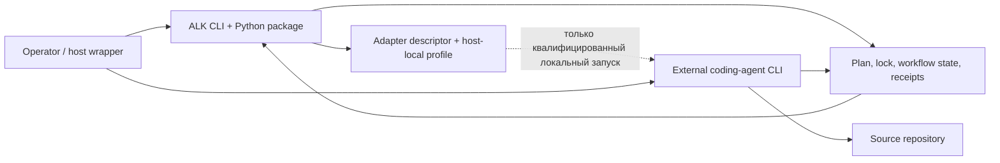

# Исследование: Agent Lifecycle Kit — контроллер жизненного цикла для задач coding agents

> **Проект:** [github.com/avksp/agent-lifecycle-kit](https://github.com/avksp/agent-lifecycle-kit)
> **Дата анализа:** 2026-08-12
> **Язык:** Python 3.11–3.14
> **Лицензия:** Apache-2.0
> **Snapshot (снимок):** release (выпуск) [`v1.62.0`](https://github.com/avksp/agent-lifecycle-kit/releases/tag/v1.62.0), tag commit (коммит тега) `88bc33f72070835a88422f499b10158bea099ab1`, опубликован 2026-08-12T06:15:53Z; `pyproject.toml` version (версия) `1.62.0`.
> **Дополнительный актуальный срез:** `main` HEAD `87201e09e356700e8fc5c39b5bc2fbbac591b399` от 2026-08-12T06:35:14Z (`Merge pull request #102 from avksp/docs/local-project-profile`); проверенные отличия от `v1.62.0` относятся к README/project-profile docs (документации профиля проекта).
> **GitHub metadata (метаданные на дату анализа):** 15★, 1 fork (ответвление), 0 open issues (открытых вопросов), created (создан) 2026-07-15, default branch (основная ветка) `main`; среди topics (тем) есть `agent-lifecycle`, `adapter-conformance`, `coding-agents`, `model-routing`, `task-orchestration`.
> **Аналитик:** Аналитик (Шерлок)

---

## Терминологическая пометка

- **ALK** — `Agent Lifecycle Kit`.
- **Lifecycle controller (контроллер жизненного цикла)** — слой, который хранит состояние задачи, план, доказательства, проверки и решения приёмки, но не выполняет модельную работу сам.
- **Host CLI (командный хост)** — внешний coding agent (агент программирования): Codex, Claude Code, Qwen Code, Goose, Pi, OpenCode и другие.
- **Frozen plan (замороженный план)** — проверенный plan manifest (манифест плана) и lock (замок), которые становятся источником authority (полномочий) для выполнения.
- **Receipt (квитанция/доказательство)** — schema-backed JSON artifact (JSON-артефакт со схемой), привязанный к lineage (происхождению), digest (хешу), state revision (ревизии состояния) и проверке.
- **Provider-neutral (нейтральный к поставщику)** — core contracts (контракты ядра) не содержат конкретных provider/model names (названий поставщиков/моделей); такие имена остаются в host-local profiles (локальных профилях хоста).

## 1. Обзор и классификация

**Итоговая классификация подтверждена:** ALK — **provider-neutral coding-agent lifecycle/evidence controller** (нейтральный к поставщику контроллер жизненного цикла и доказательств для задач coding agents), внешний слой над CLI-агентами. ALK **не является coding agent** (агентом программирования), **не является LLM runtime** (средой вызова модели) и **не является chain engine** (движком цепочек) уровня `task-orchestrator`.

Граница продукта подтверждается несколькими уровнями источников:

- **Documented claim (заявление документации):** README описывает ALK как слой, который связывает outcome (результат), plan (план), boundaries (границы), evidence (доказательства) и acceptance (приёмку), а команды поставщиков и выбор модели оставляет в adapters (описаниях внешних исполнителей) или host-local profiles (локальных профилях хоста) ([README v1.62.0](https://github.com/avksp/agent-lifecycle-kit/blob/v1.62.0/README.md)).
- **Documented claim:** architecture doc (документ архитектуры) отделяет ALK lifecycle truth (истину жизненного цикла: specification, plan, state, receipts, gates, final proof) от host CLIs and models (командных хостов и моделей), которые выполняют model work, editing and tool execution (модельную работу, правку файлов и вызовы инструментов) ([system architecture](https://github.com/avksp/agent-lifecycle-kit/blob/v1.62.0/docs/architecture/system-architecture.md)).
- **Code/test-confirmed fact (факт, подтверждённый кодом/тестом):** `workflow run` документирован и реализован как read-only (только чтение): `modelCallsStarted: false`, `stateWritten: false`, `hostLaunchStarted: false` ([managed lifecycle runner](https://github.com/avksp/agent-lifecycle-kit/blob/v1.62.0/docs/reference/managed-lifecycle-runner.md), [`managed_runner.py`](https://github.com/avksp/agent-lifecycle-kit/blob/v1.62.0/src/agent_lifecycle/workflow/managed_runner.py)).
- **Code-confirmed fact (факт, подтверждённый кодом):** локальный запуск существует, но generic launch (обобщённый запуск по дескриптору) fail-closed (завершается отказом). Managed launch (управляемый запуск) требует точный profile (профиль), явный `--launch`, frozen plan/state/lock/task/source/risk bindings (привязки замороженного плана, состояния, замка, задачи, исходников и риска) и использует `subprocess` с `shell=False` ([`launcher.py`](https://github.com/avksp/agent-lifecycle-kit/blob/v1.62.0/src/agent_lifecycle/adapter_sessions/launcher.py), [`process.py`](https://github.com/avksp/agent-lifecycle-kit/blob/v1.62.0/src/agent_lifecycle/adapter_sessions/process.py)).

### 1.1 Реальная граница продукта



ALK отвечает за authority (полномочия), gates (ворота), receipts (доказательства), lineage (происхождение), routing class (класс маршрутизации), budgets (ресурсные ограничения) и final proof (финальное доказательство). Внешний агент отвечает за исследование, правки кода и tool calls (вызовы инструментов).

## 2. Lifecycle and state model (модель жизненного цикла и состояния)

Документированный common lifecycle (общий жизненный цикл):

```text
task intake -> specification -> plan -> freeze -> execution -> audit -> final proof
```

В `how-alk-works.md` lifecycle (жизненный цикл) описан как draft intake (черновой вход) → reviewed plan (проверенный план) → frozen authority (замороженные полномочия) → host-owned work (работа внешнего хоста) → tests/evidence (тесты и доказательства) → independent audit (независимый аудит) → proof (доказательство) ([How ALK works](https://github.com/avksp/agent-lifecycle-kit/blob/v1.62.0/docs/guides/how-alk-works.md)). Для research (исследования) или planning (планирования) ALK может остановиться раньше: raw text/Markdown (сырой текст/Markdown) в `start --mode research|plan|review` остаётся reviewed draft intake (проверенным черновым входом), а не authorized implementation (разрешённой реализацией).

Код подтверждает stateful boundary (границу состояния):

| Участок | Что подтверждает |
| --- | --- |
| [`workflow/state.py`](https://github.com/avksp/agent-lifecycle-kit/blob/v1.62.0/src/agent_lifecycle/workflow/state.py) | `agent-workflow-state.v3`, `stateRevision`, atomic replace (атомарная замена), operation ledger (журнал операций), terminal/execution phases (терминальные и исполнительные фазы). |
| [`freeze/locks.py`](https://github.com/avksp/agent-lifecycle-kit/blob/v1.62.0/src/agent_lifecycle/freeze/locks.py) | `agent-plan-lock.v1` проверяет manifest hash (хеш манифеста) и plan revision (ревизию плана). |
| [`workflow/task_transitions.py`](https://github.com/avksp/agent-lifecycle-kit/blob/v1.62.0/src/agent_lifecycle/workflow/task_transitions.py) | Переходы задач требуют source revision (ревизию исходников), authorization (разрешение), dependencies (зависимости), expected artifact paths (ожидаемые пути артефактов), review (ревью), write-scope ownership (владение областью записи) и опциональный implementation audit (аудит реализации). |
| [`workflow/operation_kernel.py`](https://github.com/avksp/agent-lifecycle-kit/blob/v1.62.0/src/agent_lifecycle/workflow/operation_kernel.py) | За изменением состояния стоят optimistic revision (оптимистичная ревизия) и operation idempotency (идемпотентность операции). |
| [`tests/cli/test_workflow_managed_run.py`](https://github.com/avksp/agent-lifecycle-kit/blob/v1.62.0/tests/cli/test_workflow_managed_run.py) | Тест проверяет, что `workflow run` пишет receipt (доказательство), не меняет state (состояние) и fail-closes (отказывает) при mismatch (несовпадении) ревизии. |

**Вывод:** модель состояния у ALK сильнее обычного Markdown-журнала: source of truth (источник истины) — JSON state/receipts/locks, а не чат внешнего агента.

## 3. Orchestration (оркестрация)

ALK не задаёт линейную YAML-chain semantics (семантику YAML-цепочек) как `task-orchestrator`. Он управляет lifecycle around work packets (жизненным циклом вокруг пакетов работ): план может иметь workstreams with dependencies (потоки работ с зависимостями), `task compile` создаёт packets (пакеты), `workflow run` возвращает next action (следующее действие), а host/wrapper (хост/обёртка) запускает внешнего агента.

| Возможность | ALK v1.62.0 | Оценка |
| --- | --- | --- |
| **Chain engine (движок цепочек)** | Нет пользовательских YAML chains (YAML-цепочек) как runtime primitive (примитива среды выполнения). | ❌ |
| **DAG-like planning (планирование как DAG)** | Workstreams `dependsOn` в frozen plan; S2 completeness (полнота S2) требует acyclic workstream graph (ациклический граф потоков работ). | ✅ на уровне плана |
| **Managed next action (управляемое следующее действие)** | `workflow run` возвращает typed (типизированный) `agent-managed-lifecycle-next-action.v1` без запуска модели/хоста. | ✅ |
| **Subagents / multi-review (сабагенты / мульти-ревью)** | Review Mesh готовит assignments (назначения), imports results (импортирует результаты), synthesizes (синтезирует) и validates quorum (проверяет кворум); operator/host (оператор/хост) стартует внешние модели. | ✅ host-owned (на стороне хоста) |
| **Parallel workers (параллельные исполнители)** | `agent-plan-to-workers` skill и task packets поддерживают splitting (разделение), но core (ядро) не запускает N агентов автоматически. | ⚠️ governed packets (управляемые пакеты) |
| **Quality gates (ворота качества)** | Controller gates требуют bound (привязанного) `agent-controller-gate-receipt.v1`; implementation audit и final proof являются gates. | ✅ evidence gates (ворота по доказательствам) |
| **Retries / attempts (повторы / попытки)** | Controlled runner имеет bounded actions and caps (ограниченные действия и лимиты); retries — явные attempts (попытки), а не скрытые циклы. | ✅ bounded (ограничено) |
| **Circuit breaker (предохранитель отказов)** | Нет примитива, равного `CircuitBreakerAgentRunnerService`. | ❌ |
| **Budget (бюджет)** | Runner policy token caps (лимиты токенов политики запуска), model route max tokens (максимум токенов маршрута модели), phase resource measurements (измерения ресурсов фаз) и lifecycle cost receipts (доказательства стоимости). | ✅ resource receipts (ресурсные доказательства) |

`workflow-customization.md` важен для границ: custom workflow (пользовательский процесс) живёт в plan (плане), а lifecycle state machine (машина состояний жизненного цикла) фиксирована; новое состояние жизненного цикла требует изменения кода. Timeouts/attempts/retries (тайм-ауты, попытки и повторы) ограничены; breach (нарушение лимита) создаёт structured failure/block (структурированный сбой/блокер), а не бесконечное продолжение ([workflow customization](https://github.com/avksp/agent-lifecycle-kit/blob/v1.62.0/docs/reference/workflow-customization.md)).

## 4. Persistence and receipts (хранение и доказательства)

ALK — local CLI/package (локальный CLI-пакет), без server/daemon/database (сервера/демона/базы данных) по умолчанию. Persistence (хранение) file-backed (файловое): plan manifest, lock, workflow state, runner state, adapter sessions, receipts, event logs (манифест плана, замок, состояние процесса, состояние запуска, сессии адаптеров, доказательства и журналы событий).

Public contracts (публичные контракты) обширны и schema-backed (подкреплены схемами). `public-contracts.md` перечисляет стабильные schema ids (идентификаторы схем) для completion (завершения), runner state (состояния запуска), managed lifecycle (управляемого жизненного цикла), adapter sessions (сессий адаптеров), implementation audit (аудита реализации), proof integrity (целостности доказательств), sandbox boundaries (границ песочницы), model routing (маршрутизации моделей), Review Mesh и других поверхностей ([Public contracts](https://github.com/avksp/agent-lifecycle-kit/blob/v1.62.0/docs/reference/public-contracts.md)). Compatibility rules (правила совместимости) явные: schema ids immutable (идентификаторы схем неизменяемы), required fields (обязательные поля) не меняют смысл in-place (на месте), errors (ошибки) используют `agent-lifecycle-error.v1` со стабильным `code`.

Code-confirmed facts:

- `canonical_digest` используется в state identities (идентичностях состояния), receipts (доказательствах) и validation (валидации).
- `workflow/task_transitions.py` проверяет artifact paths (пути артефактов) по frozen templates (замороженным шаблонам) перед принятием result/review (результата/ревью).
- `audit/proof_integrity.py` строит stable finding ids (стабильные идентификаторы находок), root-cause evidence (доказательства первопричины), fix-impact receipts (доказательства влияния исправления) и append-only hash chains (дописываемые хеш-цепочки) с validation (валидацией).

**Сильная сторона:** словарь proof/receipt (доказательств) у ALK подробнее, чем у текущего `task-orchestrator`.

**Ограничение:** receipts (доказательства) подтверждают lifecycle evidence (доказательства жизненного цикла), но не доказывают semantic correctness (смысловую корректность) сами по себе. Семантическое решение остаётся за тестами, ревьюерами и внешними агентами.

## 5. Failure handling and recovery (обработка сбоев и восстановление)

### 5.1 Подтверждённые механизмы

| Механизм | Документация / код | Оценка |
| --- | --- | --- |
| Fail-closed lineage checks (отказ при нарушении происхождения) | `managed_runner.py` блокирует non-frozen plan (незамороженный план), lock mismatch (несовпадение замка), source revision mismatch (несовпадение ревизии исходников), state revision mismatch (несовпадение ревизии состояния). | ✅ code-confirmed |
| Operation idempotency (идемпотентность операции) | `state.py` operation ledger и `runner/core.py` operations ledger отклоняют duplicates (дубликаты). | ✅ code-confirmed |
| Bounded runner attempts (ограниченные попытки запуска) | `runner/core.py` `maxAttemptsPerTask`, `maxReroutesPerTask`, `maxSplitsPerTask`, `maxBillableTokens`. | ✅ code-confirmed |
| Stop/resume runner (остановка/возобновление запуска) | `request_runner_stop`, `resume_runner`, `STOPPED` status (статус). | ✅ code-confirmed |
| Host process timeout (тайм-аут процесса хоста) | `process.py` использует `subprocess.run(... timeout=...)` и завершает ограниченный процесс по тайм-ауту. | ✅ code-confirmed |
| Model route escalation (эскалация маршрута модели) | `model_routing/resolver.py` повышает route (маршрут) по failure class (классу сбоя), retry count (числу повторов), remediation loops (циклам исправления). | ✅ code-confirmed |
| Runner recovery receipts (доказательства восстановления запуска) | Public contract и tests регистрируют attempt snapshot (снимок попытки), worker lease (аренду исполнителя) и phase measurement schemas (схемы измерения фаз). | ✅ code/test-confirmed |

### 5.2 Что не равно resilience (устойчивости) `task-orchestrator`

ALK не даёт универсальную automatic retry/backoff + circuit breaker wrapper (автоматическую обёртку повторов/задержек и предохранителя отказов) вокруг каждого вызова хоста. Он даёт controlled state machine (управляемую машину состояний) и bounded retry attempts (ограниченные попытки), но не наш runner-level decorator stack (стек декораторов уровня запуска):

```text
task-orchestrator: AgentRunner -> Retry -> CircuitBreaker -> Budget -> JSONL parsing -> quality gates
ALK: frozen plan/state -> host-owned attempt -> result/review receipts -> audit/final proof
```

Поэтому ALK сильнее как слой proof and authority (доказательств и полномочий), но слабее как прямой subprocess orchestration engine (движок оркестрации процессов).

## 6. Frozen plans, evidence, audits and gates (замороженные планы, доказательства, аудиты и ворота)

Наиболее переносимый в `task-orchestrator` кластер — дисциплина source of truth (источника истины):

- raw text (сырой текст) не может разрешать реализацию в `implement` mode; `unified_start.py` требует frozen input (замороженный вход) и полные bindings (привязки);
- `verify_plan_lock` привязывает manifest digest (хеш манифеста) и plan revision (ревизию плана);
- plan completeness checks (проверки полноты плана) различаются по SDD tier S0/S1/S2; S2 требует DAG, budget policy (политику бюджета), context limits (лимиты контекста), security/release gates (ворота безопасности/релиза) и final audit gates (финальные ворота аудита) (`planning/completeness.py`);
- controller gates (ворота контроллера) требуют совпадающие receipt fields (поля доказательства): gate id, run id, package id, task id, attempt, phase, operation id, plan digest, source revision и verdict `PASS`;
- implementation acceptance (приёмка реализации) проверяет independent review (независимое ревью), write scope (область записи) и опциональный implementation audit (`workflow/task_transitions.py`);
- completion gate (ворота завершения) выбирает `STOP`, `CONTINUE`, `ESCALATE`, `SPLIT`, `FOLLOW_UP` по acceptance (приёмке), validation (валидации), blockers (блокерам), final proof и follow-up signals (сигналам продолжения) (`specification/completion_gate.py`);
- proof integrity (целостность доказательств) связывает stable finding identity (стабильную идентичность находки) → root cause (первопричину) → fix impact (влияние исправления) → hash chain (хеш-цепочку) → final proof (`docs/reference/evidence-integrity.md`, `audit/proof_integrity.py`).

**Для `task-orchestrator`:** этот кластер может усилить управление `task-via-subagents`, но не заменяет chain execution (исполнение цепочек).

## 7. Adapter model and support levels (модель адаптеров и уровни поддержки)

ALK содержит 12 bundled adapters (встроенных описаний адаптеров) в support matrix (матрице поддержки): Codex, Claude Code, Cursor, Gemini CLI, Goose, Grok Build, Hermes, Kimi Code, OpenCode, OpenInterpreter, Pi, Qwen Code ([Adapter support matrix](https://github.com/avksp/agent-lifecycle-kit/blob/v1.62.0/docs/adapters/support-matrix.md)).

Границы:

- adapters (адаптеры) содержат descriptors (дескрипторы) и capability manifests (манифесты возможностей);
- support level (уровень поддержки) описывает проверенный диапазон интеграции, а не качество модели;
- текущие bundled descriptors (встроенные дескрипторы) объявляют `managedLaunch.status: WRAPPER_ONLY`;
- exact-version local profiles (локальные профили точных версий) существуют, но actual launch (фактический запуск) требует qualification (квалификации), явного `--launch`, frozen plan identity (идентичности замороженного плана) и host-local environment allowlist (локального списка разрешённых переменных окружения хоста);
- конкретные provider/model names (названия поставщиков и моделей) остаются в host-local profiles, а не в portable core (переносимом ядре).

Код подтверждает консервативность запуска: generic descriptor-driven launch (обобщённый запуск по дескриптору) возвращает `BLOCKED` с `adapter-generic-launch-disabled`; local profile route (маршрут локального профиля) проверяет qualification, plan lock, frozen plan, risk profile and source revision (квалификацию, замок плана, замороженный план, профиль риска и ревизию исходников) перед `run_process` ([`launcher.py`](https://github.com/avksp/agent-lifecycle-kit/blob/v1.62.0/src/agent_lifecycle/adapter_sessions/launcher.py)).

**Verdict (вердикт) по adapter model:** полезный reference (ориентир) для support-level taxonomy (таксономии уровней поддержки) и fail-closed adapter declarations (объявлений адаптеров с отказом по умолчанию). Direct dependency (прямая зависимость) не подходит для PHP/Symfony core (ядра).

## 8. Context, resource and model routing (контекст, ресурсы и маршрутизация моделей)

ALK явно учитывает proportional depth (соразмерную глубину):

- S0/S1/S2 tiers (уровни) в `how-alk-works.md` и `planning/completeness.py`;
- small-model packets (пакеты для малых моделей) и context windows (контекстные окна) `4k-strict`, `8k`, `16k`, `32k`, `64k`, но не автоматическую LLM summarization (LLM-суммаризацию) как runtime feature (функцию среды выполнения);
- model routing (маршрутизацию моделей) по provider-neutral class (нейтральному классу): `budget`, `standard-code`, `strong-reasoning`, `local-strong-review` и др. в `model_routing/resolver.py`;
- route escalation (эскалацию маршрута) по failure signals (сигналам сбоя), retry counts (числу повторов) и high-risk classes (классам высокого риска);
- usage/resource receipts (доказательства использования ресурсов) и lifecycle cost accounting (учёт стоимости жизненного цикла), где USD optional (доллары опциональны), а host-attested usage (использование, засвидетельствованное хостом) отделено от core.

**Важное различие:** ALK model routing — это contract and decision artifact (контракт и артефакт решения). Он не является broker (посредником) provider APIs (API поставщиков) и не запускает модели скрыто.

## 9. Security and containment (безопасность и изоляция)

Security (безопасность) у ALK в основном evidence/governance (доказательства и управление), а не встроенный sandbox engine (движок песочницы):

- release neutrality scans (сканы нейтральности релиза) привязывают Git index/current revision (индекс Git/текущую ревизию) и держат ignored local evidence (игнорируемые локальные доказательства) за policy-limited flags (ограниченными политикой флагами) ([neutrality docs](https://github.com/avksp/agent-lifecycle-kit/blob/v1.62.0/docs/reference/neutrality.md), `policy/neutrality.policy.json`);
- local launch (локальный запуск) использует `--host-env-allow`; process output (вывод процесса) редактируется для common secrets (типичных секретов) и local paths (локальных путей) (`contracts/redaction.py`, `adapter_sessions/redaction.py`);
- `sandbox-boundaries.md` разделяет worktree write-scope (область записи рабочего дерева) и runtime filesystem/network/process/environment containment (изоляцию файловой системы, сети, процессов и окружения среды выполнения); `UNKNOWN` явен, а high-risk tasks (задачи высокого риска) по умолчанию принимают только настроенные проходящие статусы;
- `process.py` использует `shell=False`, bounded timeout (ограниченный тайм-аут) и output limits (лимиты вывода) для launch routes (маршрутов запуска);
- public receipts (публичные доказательства) не должны содержать secret values (значения секретов) или private env-file paths (приватные пути env-файлов).

**Ограничение:** ALK records sandbox receipts (фиксирует доказательства песочницы), но сам не предоставляет Docker/OS sandbox enforcement (принудительную Docker/OS-изоляцию), сопоставимую с Codex, Sandcastle или будущей `TASK-feat-docker-sandboxing` в `task-orchestrator`.

## 10. Extensibility, license and maturity (расширяемость, лицензия и зрелость)

| Axis (ось) | ALK v1.62.0 |
| --- | --- |
| **Distribution (распространение)** | PyPI package `agent-lifecycle-kit==1.62.0`, source checkout (исходный код), Python 3.11–3.14. |
| **License (лицензия)** | Apache-2.0. |
| **Dependencies (зависимости)** | `dependencies = []` в `pyproject.toml`; только build deps (зависимости сборки). |
| **Skills (навыки)** | 7 `SKILL.md` files (файлов) в `skills/`, `skills.sh.json`, Codex/Claude/Cursor/OpenCode plugin metadata (метаданные плагинов). |
| **Tests (тесты)** | Большой набор тестов по adapter sessions (сессиям адаптеров), contracts (контрактам), workflow (процессу), runner (запуску), audits (аудитам), policies (политикам), CLI. |
| **Maturity claim (заявление о зрелости)** | PyPI classifier `Development Status :: 5 - Production/Stable`; release cadence (частота выпусков) высокая. |

Оценка зрелости смешанная: code/test coverage (покрытие кодом/тестами) и contracts (контракты) существенны, но repository (репозиторий) молодой — created 2026-07-15, release cadence быстрый, а live adapter evidence (живые доказательства адаптеров) локальны и редактированы. Поэтому ALK стоит рассматривать как источник паттернов, а не как стабильную внешнюю зависимость для PHP core.

## 11. Сравнение с task-orchestrator

| Критерий | ALK | task-orchestrator | Вывод |
| --- | --- | --- | --- |
| **Уровень** | Lifecycle/evidence controller вокруг внешних host agents. | Chain execution engine для AI-agent orchestration. | Дополняющие слои. |
| **Execution (исполнение)** | Host-owned (на стороне хоста); core обычно read-only и receipt-driven (ведом доказательствами). | Запускает Pi/Codex processes через runners и парсит JSONL. | `task-orchestrator` ближе к runtime (среде выполнения). |
| **Workflow definition (описание процесса)** | Frozen plan/workstreams, fixed lifecycle transitions (замороженный план/потоки работ, фиксированные переходы жизненного цикла). | YAML chains, dynamic loops, conditional execution (YAML-цепочки, динамические циклы, условное выполнение). | Разные абстракции. |
| **State (состояние)** | Plan lock, workflow state, runner state, adapter sessions, receipts. | Chain context, task files, JSONL audit, metrics. | ALK сильнее по proof lineage (происхождению доказательств). |
| **Failure handling (сбои)** | Structured blockers, bounded runner attempts/reroute/split/token caps, host timeouts. | Retry/backoff, circuit breaker, fallback, quality gates, budget, fix_iterations. | `task-orchestrator` сильнее в автоматической устойчивости запуска. |
| **Quality (качество)** | Implementation audit, completion gate, proof integrity, controller gate receipts. | Shell quality gates и review/fix loops. | Можно сочетать: детерминированные ворота + проверяемые доказательства. |
| **Adapters (адаптеры)** | Support-level taxonomy, descriptors, `WRAPPER_ONLY`, host-local profiles. | Runner configs и Symfony services. | Заимствовать таксономию, не Python-слой. |
| **Security (безопасность)** | Redaction, env allowlist, sandbox evidence, neutrality scan. | Project rules, runner proxy, planned sandboxing. | ALK полезен как доказательный слой, не enforcement dependency (зависимость принудительной изоляции). |
| **Fit as dependency (пригодность как зависимость)** | Python CLI/package, другой source-of-truth model. | PHP/Symfony library. | Не core dependency. |

**Bottom line (итог):** ALK может усилить governance layer (слой управления) `task-orchestrator`, но не должен заменять chain execution (исполнение цепочек).

## 12. Сравнение с ближайшими соседями

| Критерий | ALK (#35) | Archon (#7) | Paperclip AI (#15) | Orca ADE (#30) | bx-dev (#31) | Herdr (#34) |
| --- | --- | --- | --- | --- | --- | --- |
| **Тип** | Lifecycle/evidence controller. | YAML DAG workflow engine. | Company-level meta-orchestrator. | Desktop/mobile manual harness. | Codex-skill workflow harness. | Terminal agent runtime. |
| **Кто запускает агента** | Host/wrapper; ALK может qualified-launch (квалифицированно запускать) только по явному profile (профилю). | Archon workflow executor через providers. | Server heartbeat adapters. | Human/ADE worktree UI. | Codex Lead skill/subagents. | Herdr server PTY commands. |
| **Source of truth (источник истины)** | Frozen ALK plan + receipts. | Workflow DB/events. | DB/company/issues/runs. | Worktrees/app state. | `.bx-dev/` + branch/PR. | Live PTY/session state. |
| **Главная сила** | Proof, audit, lineage, adapter support claims. | DAG/loops/parallel nodes. | Budget/governance/recovery на уровне организации. | Fan-out comparison UX. | Dev-session governance. | Persistent terminal control. |
| **Главный gap vs TO (разрыв с TO)** | Нет chain-level CB/fix_iterations/JSONL runner parity. | Нет CB/quality-gate/budget parity. | Нет chains/CB/quality gates. | Manual, no chain resilience. | Codex-specific, no runner resilience. | Нет structured result/gates. |
| **Best borrow (что заимствовать)** | Frozen authority, proof receipts, adapter support levels. | DAG/loop patterns. | Liveness/budget governance. | Worktree fan-out. | Session flags/report/merge protocol. | Ownership/state evidence. |

### qm / omnigent

`qm` #32 и `omnigent` #33 — активные, но незавершённые задачи эпика. Ожидаемо они ближе к meta-harness / platform-over-external-agents (мета-харнесу / платформе над внешними агентами). Этот отчёт **не использует** их planned claims (планируемые заявления) как completed evidence (завершённые доказательства).

## 13. Рекомендации adopt/adapt/reject (принять/адаптировать/отклонить)

| Рекомендация | Решение | Effort (усилие) | Риски |
| --- | --- | --- | --- |
| **Plan lock / frozen authority receipt (замок плана / доказательство полномочий)** | 🟡 Adapt | M | Нужно не дублировать todo/PR workflow; потребуется ясная граница с текущими task files. |
| **Controller gate receipt binding (привязка доказательства ворот)** | 🟡 Adapt | M | Может утяжелить простые цепочки; нужен lightweight режим. |
| **Implementation audit / final proof artifact (аудит реализации / финальное доказательство)** | 🟡 Adapt | M–L | Потребует стандарта task result/review для subagents и migration existing skills. |
| **Adapter support-level taxonomy (таксономия уровней поддержки адаптеров)** | 🟡 Adopt pattern | S–M | Не переносить терминологию `ports/adapters` в код; в docs можно говорить support levels для runners. |
| **Provider-neutral model class routing (нейтральные классы маршрутизации моделей)** | 🟡 Adapt | M | Риск конфликтовать с текущим `runner`/`model` config; provider/model names должны остаться Infrastructure (инфраструктурной) деталью. |
| **Receipt hash chain / proof integrity (хеш-цепочка доказательств / целостность)** | 🔵 R&D | L | Высокая ценность для release/security tasks, но избыточно для ordinary docs/feat. |
| **Local launch profile with env allowlist and redaction (локальный профиль запуска со списком env и редактированием секретов)** | 🟡 Adapt | M | Нельзя ломать существующий `run-subagent`; секреты должны оставаться локальными. |
| **ALK as core dependency (ALK как основная зависимость)** | 🔴 Reject | — | Python package, другой lifecycle source of truth, нет chain-level CB/fix_iterations parity; сложность вырастет без прямой runtime-выгоды. |
| **Use ALK side-by-side manually (ручное параллельное использование ALK)** | 🟢 Optional | S | Может быть полезно для внешнего audit/proof эксперимента, но вне core and CI until separate task. |

### 3–7 конкретных паттернов для backlog после review

1. **`agent-runner-support-level` for runners (уровни поддержки запускателей, P2):** documented support levels для Pi/Codex/OpenCode runners: declared/fixture/live-verified (заявлен/проверен фикстурой/проверен живым запуском), exact CLI versions (точные версии CLI), evidence path (путь доказательства).
2. **Subagent result receipt (доказательство результата сабагента, P2):** standard JSON/Markdown receipt для `task-via-subagents`: task id, run id, source revision, changed files, checks, blockers, evidence ids.
3. **Frozen subagent plan lock (замок плана сабагента, P2–P3):** freeze reviewed plan (замораживать проверенный план) до старта implementation subagents (сабагентов реализации); lock digest фиксировать в reports.
4. **Controller gate receipt (доказательство ворот контроллера, P3):** результат quality gate как bound receipt (привязанное доказательство) с operation id/source revision, а не только stdout команды.
5. **Proof integrity for high-risk bugfixes (целостность доказательств для рискованных исправлений, R&D):** stable finding id + root cause + fix impact + regression proof (стабильная находка, первопричина, влияние исправления, доказательство регрессии).
6. **Host env allowlist receipt (доказательство списка env хоста, P2):** явные env names (имена переменных окружения), переданные внешним агентам; только redacted metadata (отредактированные метаданные).
7. **Provider-neutral model class vocabulary (словарь нейтральных классов моделей, P3):** `budget/standard-code/strong-review` в config/docs, конкретные model names — в runner profiles.

## 14. Вердикт

**Итоговый verdict (вердикт):** 🟡 **заимствовать паттерны**, 🔴 **не использовать как core dependency (основную зависимость)**.

Гипотеза подтверждена: ALK — provider-neutral lifecycle controller outside coding agents (нейтральный к поставщику контроллер жизненного цикла вне агентов программирования). Он полезен тем, что превращает процессные договорённости в проверяемые артефакты: frozen authority (замороженные полномочия), schema-backed receipts (доказательства со схемами), support levels (уровни поддержки), proof integrity (целостность доказательств) и fail-closed lineage (отказ при нарушении происхождения). Он не заменяет `task-orchestrator`, потому что не даёт нашу центральную runtime-комбинацию (комбинацию среды выполнения): YAML chains + runner-level retry/backoff + circuit breaker + quality gates + budget + `fix_iterations` + JSONL audit.

## 15. Указатель источников

1. [README v1.62.0](https://github.com/avksp/agent-lifecycle-kit/blob/v1.62.0/README.md) — позиционирование, quick start (быстрый старт), features (возможности), adapter support (поддержка адаптеров), design boundaries (границы дизайна).
2. [Release v1.62.0](https://github.com/avksp/agent-lifecycle-kit/releases/tag/v1.62.0) and [CHANGELOG](https://github.com/avksp/agent-lifecycle-kit/blob/v1.62.0/CHANGELOG.md) — версия и содержание выпуска.
3. [System architecture](https://github.com/avksp/agent-lifecycle-kit/blob/v1.62.0/docs/architecture/system-architecture.md) — C0–C4 boundaries (границы), component map (карта компонентов), command call paths (пути вызовов команд).
4. [Public contracts](https://github.com/avksp/agent-lifecycle-kit/blob/v1.62.0/docs/reference/public-contracts.md) — stable schema ids (стабильные идентификаторы схем), compatibility rules (правила совместимости), proof/sandbox/review/runner contracts (контракты доказательств, песочницы, ревью и запуска).
5. [Workflow customization and execution controls](https://github.com/avksp/agent-lifecycle-kit/blob/v1.62.0/docs/reference/workflow-customization.md) and [Managed lifecycle runner](https://github.com/avksp/agent-lifecycle-kit/blob/v1.62.0/docs/reference/managed-lifecycle-runner.md) — lifecycle boundaries (границы жизненного цикла), retries (повторы), sessions (сессии), read-only next action (следующее действие без записи).

Дополнительно выборочно проверены primary source files (первичные файлы исходного кода) на `v1.62.0`: `src/agent_lifecycle/workflow/state.py`, `managed_runner.py`, `task_transitions.py`, `gates.py`, `runner/core.py`, `adapter_sessions/launcher.py`, `adapter_sessions/process.py`, `model_routing/resolver.py`, `audit/proof_integrity.py`, `planning/completeness.py`, `tests/cli/test_workflow_managed_run.py`, `tests/contracts/test_runner_recovery_schemas.py`.

## 16. Ограничения анализа

- ALK не устанавливался и не запускался; анализ основан на release tarball (архиве выпуска), GitHub API metadata, docs, code and tests (документации, коде и тестах).
- Live adapter claims (заявления о живой поддержке адаптеров) не проверялись на реальных Codex/Claude/OpenCode/Pi hosts; support claims (заявления поддержки) рассматриваются как source-tree evidence (доказательства из дерева исходников), а не independent reproduction (независимое воспроизведение).
- Full schema corpus (полный корпус схем) и все тесты не аудировались построчно; code confirmation (подтверждение кодом) выборочное и относится к темам из постановки.
- `main` изменился после `v1.62.0`; технические выводы привязаны к release tag (тегу выпуска), а current main head (текущий HEAD main) отмечен отдельно.
