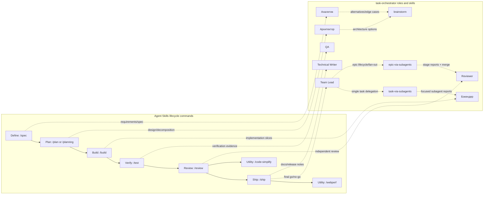

# Исследование: Agent Skills — skill pack для production-grade AI coding agents

> **Проект:** [github.com/addyosmani/agent-skills](https://github.com/addyosmani/agent-skills)
> **Дата анализа:** 2026-06-13
> **Версия:** snapshot `main` из GitHub archive, metadata GitHub API на дату анализа
> **Язык:** Markdown + Bash + JavaScript validator
> **Лицензия:** MIT
> **Аналитик:** Аналитик (Шерлок)

---

## 1. Обзор проекта

Agent Skills — это **skill pack** (пакет скиллов), а не runtime-фреймворк (рантайм-движок) и не оркестратор. Репозиторий поставляет структурированные `SKILL.md`, slash commands (слэш-команды), specialist personas (специализированные персоны), hooks (хуки) и reference checklists (справочные чеклисты), которые подключаются к Claude Code, Gemini CLI, Antigravity CLI, Cursor, OpenCode, GitHub Copilot, Windsurf, Kiro и другим агентным средам.

Ключевая идея: AI-agent (AI-агент) должен не «импровизировать», а следовать проверяемому engineering workflow (инженерному процессу): clarify → spec → plan → build → test → review → ship. В отличие от task-orchestrator, Agent Skills **не запускает процессы, не хранит состояние цепочки и не управляет retry/circuit breaker**. Все runtime-возможности делегированы host agent (агенту-хосту).

### Metadata GitHub repo

| Поле | Значение |
| --- | --- |
| **Repository** | `addyosmani/agent-skills` |
| **Description** | Production-grade engineering skills for AI coding agents |
| **Default branch** | `main` |
| **License** | MIT |
| **Stars / forks** | ~57.8k / ~6.2k на дату анализа |
| **Topics** | `agent-skills`, `antigravity`, `antigravity-ide`, `claude-code`, `cursor`, `skills` |
| **Created / pushed** | 2026-02-15 / 2026-06-11 |

### Структура

```text
agent-skills/
├── skills/                    # 24 скилла: 23 lifecycle + 1 meta-skill
├── agents/                    # 4 specialist personas
├── references/                # testing/security/performance/accessibility checklists
├── .claude/commands/          # 8 Claude Code commands
├── .gemini/commands/          # 8 Gemini CLI commands
├── commands/                  # 8 Antigravity commands
├── hooks/                     # Claude plugin hooks
├── docs/                      # setup guides + skill anatomy
├── scripts/validate-skills.js # validator for SKILL.md anatomy
├── .claude-plugin/            # Claude Code plugin manifest + marketplace metadata
└── plugin.json                # minimal Antigravity plugin manifest
```

### Ключевые характеристики

| Характеристика | Значение |
| --- | --- |
| **Тип** | Skill pack / prompt workflow library |
| **Модель выполнения** | Host-dependent: host agent выбирает и исполняет skill instructions |
| **Commands** | 6 lifecycle commands (`/spec`, `/plan` или `/planning`, `/build`, `/test`, `/review`, `/ship`) + 2 utility commands (`/code-simplify`, `/webperf`) |
| **Skills** | 24 `SKILL.md`: Define, Plan, Build, Verify, Review, Ship + meta-skill |
| **Personas** | `code-reviewer`, `test-engineer`, `security-auditor`, `web-performance-auditor` |
| **Hooks** | SessionStart meta-skill injection, SDD cache hooks, simplify-ignore hooks |
| **Validation** | `scripts/validate-skills.js`: frontmatter, required sections, cross-skill refs |
| **State management** | N/A для пакета; состояние делегировано host agent / IDE |
| **Error handling** | N/A для пакета; retry/failures делегированы host agent; в skills есть prompt-level guardrails |
| **License** | MIT; паттерны можно заимствовать, большие фрагменты текстов лучше не копировать |

### Plugin manifests vs наши conventions

| Аспект | Claude `.claude-plugin/plugin.json` | Antigravity `plugin.json` | Наши `docs/agents/*` conventions |
| --- | --- | --- | --- |
| Discovery unit | Package manifest для host agent: `commands`, `skills`, `agents` | Минимальный package manifest | Нет root manifest; discovery через `AGENTS.md`, role frontmatter и явные ссылки на `SKILL.md` |
| Identity metadata | `name`, `description`, `author`, `homepage`, `repository`, `license` | `name`, `version`, `description` | Role frontmatter: `agent`, `role`, `name`, `title`, `personality`, `skills`; skill frontmatter: `name`, `description` |
| Commands | `commands: ./.claude/commands` | Не объявлены | Оркестрация описана skills (`task-via-subagents`, `epic-via-subagents`, `brainstorm`) и CLI/docs, без slash-command manifest |
| Skills | `skills: ./skills` | Не объявлены | `docs/agents/skills/<skill>/SKILL.md`, подключение явно через роли или workflow |
| Personas/agents | `agents` array с Markdown-файлами personas | Не объявлены | `docs/agents/roles/team/*.md` с frontmatter, personality и linked skills |
| Validation/governance | Host читает manifest; repo дополнительно держит `scripts/validate-skills.js` | Только базовая metadata для host | Есть `make validate-todo` и conventions, но dedicated skill manifest/validator пока нет |
| Вывод | Хороший паттерн package-level discoverability | Слишком тонкий для governance | Можно заимствовать index/validator pattern, но не вводить runtime dependency |

---

## 2. Anatomy (анатомия) `SKILL.md`

Agent Skills формализует `SKILL.md` как discoverable workflow (обнаруживаемый рабочий процесс), а не как справочник знаний.

### Обязательный контракт

| Элемент | Назначение |
| --- | --- |
| `skills/<name>/SKILL.md` | Единственный обязательный файл скилла |
| YAML frontmatter | `name`, `description`; имя должно совпадать с каталогом |
| `description` | Что делает skill и когда его применять; до 1024 символов |
| Supporting files | Опциональны; используются для progressive disclosure (прогрессивной загрузки контекста) |
| Scripts | Опциональны; только если workflow реально требует runnable helper (исполняемого помощника) |

### Рекомендуемые секции

| Секция | Для чего нужна | Применимость к task-orchestrator |
| --- | --- | --- |
| Overview | Коротко объясняет цель workflow | Уже частично есть в наших skills, можно унифицировать |
| When to Use | Trigger conditions (условия применения) и исключения | Есть в наших skills как «Когда использовать» |
| Core Process / Workflow | Пошаговый процесс | Есть, но структура не везде единая |
| Specific Techniques / Patterns | Детали для отдельных сценариев | Полезно выносить в supporting files |
| Common Rationalizations | Таблица «отговорка → реальность» | Сильный паттерн для борьбы со skip-tests/skip-review |
| Red Flags | Наблюдаемые признаки нарушения workflow | Полезно для self-review и code review |
| Verification | Evidence-based exit criteria (критерии выхода с доказательствами) | Нужно стандартизировать в наших skills |

### Distinctive patterns

1. **Anti-rationalization (анти-рационализация):** skill заранее перечисляет типовые оправдания агента и коротко объясняет, почему их нельзя принимать.
2. **Red flags (красные флаги):** наблюдаемые симптомы, что агент нарушает процесс.
3. **Evidence over assumption:** каждый workflow завершается проверяемыми артефактами: test output, build output, review report, rollback plan.
4. **Progressive disclosure:** основной `SKILL.md` держится компактным, а длинные чеклисты и вспомогательные материалы загружаются только по необходимости.
5. **Validator-owned exemptions:** исключения из обязательных секций хранятся в validator script (скрипте-валидаторе), а не во frontmatter скилла; автор skill не может сам себя освободить от правил.

---

## 3. Lifecycle commands и orchestration model

Agent Skills описывает lifecycle (жизненный цикл) разработки через commands (команды) и skills (скиллы):



| Phase | Command | Primary skills | Смысл |
| --- | --- | --- | --- |
| Define | `/spec` | `spec-driven-development` | Сначала спецификация и границы, потом код |
| Plan | `/plan` / `/planning` | `planning-and-task-breakdown` | Декомпозиция на малые проверяемые задачи |
| Build | `/build` | `incremental-implementation`, `test-driven-development` | Тонкие вертикальные срезы, проверка каждого инкремента |
| Verify | `/test` | `test-driven-development`, `debugging-and-error-recovery` | Доказать поведение тестами и воспроизводимостью |
| Review | `/review` | `code-review-and-quality` | Пять осей ревью: correctness, readability, architecture, security, performance |
| Ship | `/ship` | `shipping-and-launch` + personas fan-out | Go/no-go решение, rollback plan, parallel review |
| Utility | `/code-simplify`, `/webperf` | `code-simplification`, `performance-optimization` | Упрощение и web performance audit |

### Orchestration rules

Agent Skills проводит жёсткую границу между слоями:

| Layer | Роль |
| --- | --- |
| **Skill** | The how (как выполнять workflow) |
| **Persona** | The who (какая профессиональная перспектива) |
| **Command** | The when (когда и как скомпоновать workflow) |

Главное правило: **персоны не вызывают другие персоны**. Оркестратором является пользователь или slash command. Единственный явно поддержанный multi-persona pattern (паттерн мультиперсонной оркестрации) — **parallel fan-out with merge**: `/ship` параллельно запускает code reviewer, security auditor и test engineer, а основной агент синтезирует результат.

Это важная guardrail (защитная граница): она предотвращает «persona-calls-persona» routing (маршрутизацию персонами), лишние пересказы, потерю информации и рост token cost (стоимости токенов).

### Сопоставление с нашими orchestration skills

| Наш skill | Ближайший pattern Agent Skills | Сходство | Отличие |
| --- | --- | --- | --- |
| `task-via-subagents` | Lifecycle command + focused persona invocation | Делегирует ограниченную задачу профильному агенту и требует отчёт/evidence | У нас orchestration управляется project skill и файлами отчётов; Agent Skills полагается на host slash command |
| `epic-via-subagents` | `/ship` fan-out + lifecycle sequencing | Наиболее близок к lifecycle/fan-out model: stages эпика распределяются между ролями, затем Team Lead делает merge результатов | У нас есть task/epic lifecycle, статусы, DoD, PR gates и связь с `todo/`; у Agent Skills fan-out prompt-level и без собственного state |
| `brainstorm` | Define/Plan exploration | Помогает на фазах `/spec` и `/plan`: альтернативы, риски, edge cases | Не является delivery lifecycle и не закрывает build/test/review/ship |

---

## 4. Сравнение с task-orchestrator

| Характеристика | task-orchestrator | Agent Skills |
| --- | --- | --- |
| **Тип** | CLI chain orchestrator (PHP/Symfony, DDD) | Skill pack / prompt workflow library |
| **Модель оркестрации** | Declarative YAML chains + static/dynamic execution | Sequential lifecycle commands + host-driven skill activation |
| **State management** | Chain state, session files, JSONL audit trail, resume для dynamic sessions | **N/A / host-dependent**: пакет не хранит состояние, relies on host agent/IDE |
| **Error handling** | Retry с backoff, circuit breaker, budget, quality gates, exit codes | **N/A / delegated to host agent**: skills задают verification/guardrails, но не выполняют retry |
| **Extensibility** | Custom runners, decorators, chain DSL, roles in config | New `SKILL.md`, personas, commands, setup guides, hooks |
| **Roles/personas** | Team roles in `docs/agents/roles/team/*`, role-specific skills | 4 specialist personas for targeted reviews |
| **Skills** | Project-specific operational skills (`task-via-subagents`, `run-subagent`, `brainstorm`) | Cross-project engineering workflow skills |
| **Quality gates** | Shell-based gates and explicit verification commands | Prompt-level evidence requirements in skills |
| **Sub-agents** | External orchestration via `run-subagent`, dynamic `brainstorm` chains | Host-dependent; `/ship` describes fan-out, Claude Code subagents execute it |
| **Validation** | `make validate-todo`, conventions, PHP checks | `scripts/validate-skills.js` for skill anatomy |
| **License risk** | Own project | MIT: patterns safe; avoid copying large text blocks |

### Что уже есть у нас

- Роли (`docs/agents/roles/team/*`) с frontmatter, personality и linked skills.
- Skills (`docs/agents/skills/*`) с operational workflows (рабочими процессами): `task-via-subagents`, `epic-via-subagents`, `run-subagent`, `brainstorm`, `agent-report`.
- Явные проверки через `make validate-todo`, PHPUnit, Psalm, Deptrac, PHPCS.
- Dynamic orchestration (динамическая оркестрация) для brainstorm: facilitator + participants + resume + audit trail.
- Жёсткие project rules в `AGENTS.md` и `todo/AGENTS.md`.

### Чего не хватает относительно Agent Skills

- Единой anatomy convention (конвенции анатомии) для `docs/agents/skills/*`.
- Validator for skills (валидатора скиллов), проверяющего frontmatter, sections, links, `depends_on`.
- Систематических anti-rationalization tables и red flags в каждом skill.
- Общего lifecycle map (карты жизненного цикла) Define → Plan → Build → Verify → Review → Ship для наших ролей/скиллов.
- Lightweight reference checklists (легковесных чеклистов) для testing/security/performance/documentation, подключаемых по progressive disclosure.

---

## 5. Стандартная comparison table

| Framework / Pack | Orchestration model | State management | Error handling | Extensibility | Applicability для task-orchestrator |
| --- | --- | --- | --- | --- | --- |
| **Agent Skills** | Host-driven skill activation + sequential lifecycle commands; `/ship` uses parallel fan-out with merge | **N/A / host-dependent**: no own persistent state; state delegated to Claude Code/Gemini/OpenCode/Cursor/etc. | **N/A / delegated to host agent**: no retry/CB/fallback; verification gates are prompt-level | `SKILL.md`, personas, commands, plugin manifests, hooks, references, validator | 🟡 Заимствовать паттерны: skill anatomy, anti-rationalization, validation, lifecycle mapping; не dependency |
| **task-orchestrator** | YAML static/dynamic chains; external runner orchestration; facilitator-led dynamic loops | Chain/session state + JSONL audit + resume for dynamic sessions | Retry with backoff, circuit breaker, budget limits, quality gates, exit codes | DDD modules, runner interfaces, decorators, chain DSL, roles config | Базовый продукт; Agent Skills дополняет authoring/operational guidance |

---

## 6. Паттерны для возможного заимствования

| Паттерн | Что заимствовать | Приоритет | Риск |
| --- | --- | ---: | ---: |
| **Skill anatomy convention** | Утвердить обязательные секции для наших `docs/agents/skills/*`: `Когда использовать`, `Как использовать`, `Проверка`, `Результат`, `Red Flags`, `Rationalizations` | P2 | R1 |
| **Skill anatomy validator** | Добавить docs-only validator (например, в `make validate-todo` или отдельный `make validate-agent-skills`) для frontmatter, `depends_on`, ссылок и обязательных секций | P2 | R1 |
| **Anti-rationalization tables** | В critical skills (`task-via-subagents`, `epic-via-subagents`, `run-subagent`) явно описать типовые оправдания: «пропущу review», «не запущу проверки», «сразу merge» | P2 | R1 |
| **Red flags for self-review** | Добавить наблюдаемые признаки нарушения workflow: незаполненный `pr`, unchecked DoD, изменения в `main`, отсутствие evidence | P2 | R1 |
| **Lifecycle command mapping** | Создать краткую карту наших ролей/skills к lifecycle: analysis → architecture → implementation → QA → review → docs → ship | P3 | R1 |
| **Reference checklists** | Вынести длинные повторяющиеся проверки в `docs/agents/references/*` и ссылаться на них из skills по progressive disclosure | P3 | R1 |
| **Persona composition guardrail** | Зафиксировать: роли не запускают роли; orchestration only через Тимлид/skill/chain. Fan-out допустим только когда отчёты независимы и есть merge step | P2 | R1 |

### Backlog candidates (без создания задач в рамках этого исследования)

1. `TASK-docs-agent-skills-anatomy-convention` — описать конвенцию для `docs/agents/skills/*`.
2. `TASK-tooling-validate-agent-skills` — добавить validator для skill frontmatter/sections/links.
3. `TASK-docs-add-anti-rationalization-to-critical-skills` — обновить `task-via-subagents`, `epic-via-subagents`, `run-subagent`.
4. `TASK-docs-agent-lifecycle-map` — добавить lifecycle map ролей и скиллов команды.

---

## 7. Риски и ограничения

### 7.1 Skill pack, не runtime

Agent Skills нельзя честно сравнивать с LangGraph/Archon/Paperclip как с runtime-orchestrator. У него нет собственных execution semantics (семантики выполнения), storage, retry, scheduling или sandboxing. Все эти возможности зависят от среды: Claude Code, Gemini CLI, OpenCode, Cursor, Copilot и т.д.

### 7.2 Host-specific behavior

Одинаковый `SKILL.md` в разных host agents работает по-разному:

- Claude Code plugin может auto-discover skills, commands и agents.
- Gemini CLI поддерживает skills и commands, но использует `/planning` вместо `/plan`.
- Cursor чаще работает через rules files (файлы правил), то есть context may be always-on.
- OpenCode полагается на `AGENTS.md` и `skill` tool (инструмент skill), а не native plugin.
- Copilot требует `*.agent.md` для custom agent personas.

### 7.3 License и копирование текста

MIT license допускает reuse, но для нашего проекта лучше **заимствовать паттерны, а не копировать большие фрагменты**. Причины: продуктовая идентичность, maintenance noise, риск stale prompt text, необходимость адаптации к русскоязычным ролям и DDD/Symfony контексту.

### 7.4 Over-constraining skills

Если механически навязать всем нашим skills один шаблон, можно ухудшить читаемость. Лучший путь — required minimum (frontmatter + purpose + usage + verification) и recommended sections для critical workflows.

---

## 8. Вердикт

**🔴 Не использовать как dependency, 🟡 заимствовать паттерны для authoring и governance skills.**

Agent Skills — сильный источник практик для **структурирования агентных инструкций**, но не замена task-orchestrator. Он не решает наши runtime-задачи: chain state, retry with backoff, circuit breaker, budget enforcement, quality gates, dynamic loops, JSONL audit. Эти механизмы остаются уникальной сильной стороной task-orchestrator.

**Рекомендация:**

1. Не добавлять Agent Skills как dependency.
2. Не копировать большие `SKILL.md` тексты.
3. Заимствовать 5 паттернов: anatomy convention, validator, anti-rationalization, red flags, persona composition guardrails.
4. Рассмотреть отдельные docs/tooling задачи после review исследования.

---

## 9. Указатель источников для деталей

Все источники — первичные файлы `addyosmani/agent-skills` и GitHub repo/API:

- [`README.md`](https://github.com/addyosmani/agent-skills/blob/main/README.md) — overview, commands, skills, project structure.
- [`docs/skill-anatomy.md`](https://github.com/addyosmani/agent-skills/blob/main/docs/skill-anatomy.md) — формат `SKILL.md`, frontmatter, sections, progressive disclosure.
- [`AGENTS.md`](https://github.com/addyosmani/agent-skills/blob/main/AGENTS.md) — rules for OpenCode, intent→skill mapping, persona/skill/command boundaries.
- [`agents/README.md`](https://github.com/addyosmani/agent-skills/blob/main/agents/README.md) — personas, direct invocation, fan-out, anti-patterns.
- [`references/orchestration-patterns.md`](https://github.com/addyosmani/agent-skills/blob/main/references/orchestration-patterns.md) — endorsed orchestration patterns and anti-patterns.
- [`scripts/validate-skills.js`](https://github.com/addyosmani/agent-skills/blob/main/scripts/validate-skills.js) — skill anatomy validator.
- [`commands/`](https://github.com/addyosmani/agent-skills/tree/main/commands), [`.claude/commands/`](https://github.com/addyosmani/agent-skills/tree/main/.claude/commands), [`.gemini/commands/`](https://github.com/addyosmani/agent-skills/tree/main/.gemini/commands) — slash command definitions.
- [`.claude-plugin/plugin.json`](https://github.com/addyosmani/agent-skills/blob/main/.claude-plugin/plugin.json) и [`plugin.json`](https://github.com/addyosmani/agent-skills/blob/main/plugin.json) — plugin manifests.
- [`LICENSE`](https://github.com/addyosmani/agent-skills/blob/main/LICENSE) — MIT license.

---

📚 **Источники:**
1. [github.com/addyosmani/agent-skills](https://github.com/addyosmani/agent-skills) — репозиторий проекта.
2. [README.md](https://github.com/addyosmani/agent-skills/blob/main/README.md) — lifecycle, supported agents/IDEs, list of skills.
3. [docs/skill-anatomy.md](https://github.com/addyosmani/agent-skills/blob/main/docs/skill-anatomy.md) — anatomy of `SKILL.md`.
4. [references/orchestration-patterns.md](https://github.com/addyosmani/agent-skills/blob/main/references/orchestration-patterns.md) — orchestration patterns.
5. [GitHub API: repos/addyosmani/agent-skills](https://api.github.com/repos/addyosmani/agent-skills) — metadata на дату анализа.
