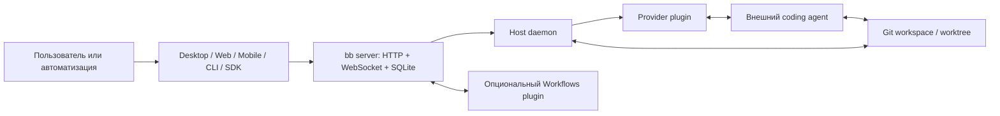

# Исследование: bb — agentic IDE и управляющая поверхность над внешними агентами

> **Проект:** [github.com/get-bb/bb](https://github.com/get-bb/bb), [getbb.app](https://getbb.app/)
> **Дата анализа:** 2026-08-29
> **Язык:** TypeScript (Node.js + Electron)
> **Лицензия:** MIT
> **Версия:** `bb-app` 0.40.0
> **Snapshot (снимок):** `main` [`fc94f46c13b89f54e9c8ba53600352df64b81798`](https://github.com/get-bb/bb/tree/fc94f46c13b89f54e9c8ba53600352df64b81798) от 2026-08-28
> **Аналитик:** Аналитик (Шерлок)

---

## 1. Резюме

**bb** — локальная `agentic IDE / control surface` (агентная среда разработки и управляющая поверхность) над внешними агентами программирования. Сам bb не реализует собственный цикл `LLM → tool call → observation`: рассуждение и работа с кодом выполняются процессами Claude Code, Codex, Cursor/ACP, Pi и других ACP-совместимых агентов.

Предварительная гипотеза «bb не является движком цепочек» подтверждена **только для ядра**. В поставку входит отключённый по умолчанию плагин `Workflows`, который выполняет устойчивые к перезапуску JavaScript-процессы в QuickJS, параллельно вызывает внешних агентов, проверяет структурированные результаты, ограничивает число вызовов и время, повторяет временные ошибки и возобновляет запуск через детерминированное воспроизведение. Поэтому точная классификация: **управляющая поверхность над внешними агентами с опциональным встроенным движком программируемых рабочих процессов**, но не самостоятельный агент программирования.

**Вердикт для task-orchestrator:**

- 🟡 **заимствовать паттерны** единой модели потоков, равноправных UI/CLI/API/SDK, контракта плагинов поставщиков, управляемого жизненного цикла рабочих деревьев Git и устойчивого воспроизведения вызовов рабочих процессов;
- 🟢 **допустим как опциональная ручная среда** рядом с task-orchestrator после отдельной проверки совместного владения рабочими деревьями и процессами;
- 🔴 **не использовать как основную зависимость**: иной стек TypeScript/Node/Electron, собственное локальное состояние и жизненный цикл, доверенная модель плагинов, неаутентифицированный прямой API и несовпадающая семантика YAML-цепочек, ворот качества, бюджета и `fix_iterations`.

---

## 2. Граница подтверждённых возможностей

### 2.1. Что делает bb

По [обзору системы](https://github.com/get-bb/bb/blob/fc94f46c13b89f54e9c8ba53600352df64b81798/docs/system-overview.md) bb предоставляет:

- desktop/web/mobile UI (настольный, браузерный и мобильный интерфейсы), CLI, HTTP API и публичный TypeScript SDK;
- сервер — источник истины в SQLite, HTTP API и WebSocket-события;
- `host daemon` (фоновый процесс хоста), который создаёт рабочие области и запускает процессы поставщиков;
- унифицированную модель `thread` (потока) и преобразование событий поставщиков в общий словарь;
- управляемые рабочие деревья Git, плагины, навыки, автоматизации и опциональные рабочие процессы.

### 2.2. Что остаётся ответственностью внешнего агента

Следующие свойства нельзя приписывать bb без привязки к конкретному плагину поставщика:

- качество рассуждения и изменения кода;
- поддержка инструментов, MCP и собственного контекстного окна;
- нативные подагенты, память и сжатие контекста;
- модель разрешений внутри агента и его собственные повторы;
- стоимость и доступность модели.

bb запускает процесс поставщика, передаёт ему настройки и нормализует наблюдаемые события. Например, команда `/compact` видна только для поставщика, явно объявившего такую возможность; это не собственный универсальный алгоритм сжатия bb.

---

## 3. Архитектура и поток управления



Монорепозиторий написан на TypeScript. Сервер и интерфейсы отделены от хоста выполнения: удалённый браузер или телефон является управляющей поверхностью, а агент продолжает работать на машине с `host daemon`. Это полезная граница для будущего разделения task-orchestrator на control plane (контур управления) и execution host (хост исполнения).

Публичные маршруты сервера находятся под `/api/v1/`. Для упакованной установки сервер по умолчанию использует порт `38886`, хост — `38887`, каталог данных — `~/.bb/`; значения настраиваются переменными окружения и конфигурацией.

---

## 4. Поддерживаемые внешние агенты

| Агент | Подтверждённая интеграция bb | Граница утверждения |
|---|---|---|
| Claude Code | Встроенный плагин `provider-claude-code`; настройки памяти, нативных подагентов и разрешений | Агентный цикл принадлежит Claude Code |
| Codex | Встроенный плагин `provider-codex`; настройки памяти и нативных подагентов | Агентный цикл принадлежит Codex |
| Cursor | Плагин ACP содержит известную интеграцию Cursor | Возможности определяются ACP-клиентом Cursor |
| Pi | Встроенный плагин `provider-pi` | Модели и инструменты принадлежат Pi |
| OpenCode | Автообнаружение через ACP при наличии `opencode` в `PATH` | bb не реализует внутренности OpenCode |
| Grok Build | Автообнаружение `grok` через ACP | Статус зависит от установленного CLI |
| omp | Автообнаружение `omp` через ACP | Это отдельный ACP-поставщик, а не функция ядра bb |
| Hermes Agent | Автообнаружение `hermes` через ACP | bb использует Hermes как внешний процесс |
| Иные ACP-агенты | Пользовательская запись `customAgents` в плагине ACP | Совместимость ограничена реализованным агентом протоколом ACP и настройками запуска |

Канонический перечень распространённых поставщиков приведён в поставляемом [`packages/bb-app/README.md` на исследованном снимке](https://github.com/get-bb/bb/blob/fc94f46c13b89f54e9c8ba53600352df64b81798/packages/bb-app/README.md#provider-credentials), на который отсылает корневой README: там перечислены Codex, Claude Code, Cursor, Pi, OpenCode, Grok Build и Hermes Agent, а в требованиях отдельно разрешён иной ACP-совместимый агент. omp упомянут ниже в том же файле среди индексируемых корней навыков; его фактическое подключение относится к ACP-плагину. Наличие агента в интерфейсе зависит от установленного CLI, включённого плагина и успешного обнаружения на выбранном хосте.

---

## 5. Модель threads

### 5.1. Создание и адресация

Поток связывает проект, среду выполнения, рабочую область и выбранного поставщика. CLI позволяет создать поток с явными `provider`, `model`, `environment` и режимом разрешений; при отсутствии выбора применяются настройки проекта и каталог моделей поставщика.

Потоки адресуются устойчивыми идентификаторами. CLI и SDK предоставляют создание, получение, перечисление, отправку сообщений и управление жизненным циклом. Пользователь может наблюдать поток в одном интерфейсе и продолжить управление из другого.

### 5.2. Состояния и жизненный цикл

Ядро использует состояния:

- `idle` — поток ожидает ввод;
- `starting` — процесс запускается;
- `active` — агент выполняет ход;
- `stopping` — остановка начата;
- `error` — запуск или выполнение завершились ошибкой.

Поддержаны операции `spawn`, `send`/`tell`, `wait`, `stop`, `fork`, архивирование/удаление, просмотр взаимодействий, редактирование сообщения и запрос сжатия для совместимого поставщика. `wait` делает жизненный цикл пригодным для автоматизации без разбора терминального экрана.

### 5.3. Параллельность, передача и ошибки

Несколько потоков выполняются параллельно в отдельных или общих средах. Интерфейс показывает живые события, позволяет направлять активный поток дополнительным сообщением и передавать управление между desktop/web/mobile/CLI без переноса процесса агента.

Отмена останавливает активный процесс через контракт поставщика. Ошибка сохраняется в состоянии потока; восстановление зависит от типа ошибки и поставщика. Отдельный встроенный плагин `provider-retry`, включённый в новых установках, умеет ждать известное окно восстановления подписки Codex/Claude Code и один раз продолжить существующий разговор. Это узкий механизм: ожидание хранится в памяти, пропадает при перезапуске bb и не является универсальным повтором шага.

### 5.4. Владение результатом

bb владеет записью потока, событиями, связью с рабочей областью и жизненным циклом процесса. Внешний агент владеет смыслом ответа и изменениями в файлах. Git остаётся источником истины для итогового кода; bb не разрешает смысловые конфликты слияния автоматически.

---

## 6. Git worktrees

По [документации рабочих деревьев](https://github.com/get-bb/bb/blob/fc94f46c13b89f54e9c8ba53600352df64b81798/docs/worktrees.md) bb умеет:

1. создавать управляемую среду как новое рабочее дерево и ветку;
2. размещать её под `<BB_DATA_DIR>/worktrees/<environment-id>/<repo-name>`;
3. копировать явно перечисленные локальные файлы через `.worktreeinclude`;
4. выполнять проектные сценарии настройки и очистки;
5. связывать несколько потоков с одной средой;
6. автоматически удалять рабочее дерево и ветку после удаления либо архивирования всех связанных потоков.

**Изоляция:** разные управляемые среды получают разные рабочие деревья и ветки. Это снижает файловые конфликты параллельных агентов, но не заменяет изоляцию процессов или сети.

**Владение:** bb владеет созданной им средой и её очисткой. Для обычного существующего каталога владение остаётся у пользователя.

**Конфликты:** bb предоставляет Git-среду, а не стратегию выбора результата. Конфликты веток и слияния разрешаются пользователем или внешним агентом средствами Git.

**Риск переноса:** автоматическая очистка ветки после архивирования потоков несовместима с правилами task-orchestrator без явного согласования владельца ресурса и защищённых состояний задачи/PR.

---

## 7. Plugins и self-customization

### 7.1. Формат и точки подключения

Плагин — npm-пакет или локальный каталог с разделом `bb` в `package.json`. Поддержаны вклады:

- серверный TypeScript-код;
- UI на React и боковые панели;
- код хоста;
- CLI-команды;
- навыки `SKILL.md`;
- темы и настройки;
- поставщики агентов через публичный plugin SDK (набор разработки плагинов).

Серверный TypeScript плагина может загружаться без отдельного этапа сборки. Плагины устанавливаются из встроенного каталога, marketplace (каталога), Git, npm и локального пути. Состояние плагина хранится под `<dataDir>/plugins/<id>/`; часть плагинов использует собственную SQLite.

### 7.2. Плагины поставщиков

Контракт поставщика нормализует нативный вывод во внутренние `thread`/`delta`-события. Архитектурный принцип документации — отсутствие привилегии у first-party plugins (встроенных плагинов): сторонний поставщик использует тот же публичный контракт. Это сильный ориентир для развития `AgentRunnerInterface`.

Часть API всё ещё имеет префикс `experimental_` и перечислена в `docs/api_to_audit.md`; считать весь plugin SDK стабильным нельзя.

### 7.3. Самонастройка и модель доверия

Агент внутри bb может использовать CLI, навыки и локальные файлы для создания или изменения плагина, после чего пользователь загружает его в bb. Это обеспечивает self-customization (самонастройку), но **не означает безопасное самоизменение**.

Обычный серверный/хостовый плагин выполняется с правами процесса bb и не имеет общей песочницы. Следовательно, Git/npm/marketplace-плагин является доверенным кодом с риском цепочки поставки. Изоляция QuickJS доказана только для встроенного плагина `Workflows`, а не для всех расширений.

Обновление и удаление зависят от источника установки; криптографическая подпись или обязательная проверка издателя в изученных источниках не подтверждены.

---

## 8. Multi-provider orchestration и Workflows

### 8.1. Базовый уровень

Поставщик и модель выбираются при создании потока. Пользователь может вести несколько параллельных потоков с разными поставщиками, сравнивать результаты, направлять их сообщениями и создавать дочерние потоки. Перенос контекста между разными поставщиками выполняется через общий поток, fork (ответвление), сообщения и файлы рабочей области; полная переносимость нативного состояния разговора не гарантируется.

Поддержка skills (навыков) объединяет собственные корни bb и нативные корни Codex, Claude Code, Pi, Cursor, OpenCode, omp, Grok и Hermes. Однако доступные инструменты и семантика разрешений остаются неодинаковыми.

### 8.2. Опциональный Workflows plugin

Встроенный плагин `builtin:workflows` отключён в новой установке. После включения он выполняет JavaScript в QuickJS и предоставляет `agent()`, `parallel()`, `pipeline()`, `phase()` и один уровень вложенного `workflow()`.

Подтверждённые свойства:

- выбор поставщика, модели, reasoning (режима рассуждения) и разрешений для каждого вызова агента;
- параллельные вызовы и единая FIFO-очередь с `maxConcurrentAgents`;
- `maxAgentCalls`, общий timeout (таймаут), отмена и retention (срок хранения);
- текстовый либо JSON Schema-валидируемый структурированный результат;
- две корректирующие попытки для невалидного структурированного результата;
- до двух повторов временной ошибки поставщика с ограниченной задержкой;
- SQLite-состояние запусков и вызовов;
- восстановление после перезапуска через повторное вычисление скрипта и воспроизведение успешного префикса по SHA-256 ключам;
- явный `resume`, просмотр статуса/истории, остановка и живой UI;
- QuickJS без Node, файловой системы, shell, сети, импортов, часов и случайности;
- один уровень дочернего рабочего процесса; grandchild (внук) запрещён.

Вызовы с успешным результатом могут воспроизводиться без повторного исполнения даже после файловых изменений, потому что `resume` ограничен той же рабочей областью. Это практичный, но требующий дисциплины контракт: воспроизведение результата не доказывает неизменность побочного эффекта.

### 8.3. Доказательства валидации и классификации повторов

Официальный [README плагина Workflows](https://github.com/get-bb/bb/blob/fc94f46c13b89f54e9c8ba53600352df64b81798/plugins/workflows/README.md#L96-L105) фиксирует оба контракта: структурированный результат проверяется Ajv, а после первой невалидной попытки допускаются две корректирующие; временный сбой поставщика повторяется не более двух раз. Реализация подтверждает детали:

- схема предварительно ограничивается безопасным подмножеством и [компилируется через `new Ajv({ strict: false, allErrors: true })`](https://github.com/get-bb/bb/blob/fc94f46c13b89f54e9c8ba53600352df64b81798/plugins/workflows/src/validation.ts#L250-L266), а значение результата [проверяется скомпилированным валидатором Ajv](https://github.com/get-bb/bb/blob/fc94f46c13b89f54e9c8ba53600352df64b81798/plugins/workflows/src/service.ts#L271-L290);
- функция [`isRetryableProviderFailure()`](https://github.com/get-bb/bb/blob/fc94f46c13b89f54e9c8ba53600352df64b81798/plugins/workflows/src/service.ts#L106-L134) сначала принимает явный SDK-маркер `retryable === true`, затем распознаёт только ограниченный набор статусов `429/500/502/503/504/529`, сетевых кодов и консервативных текстовых признаков перегрузки, ограничения частоты или сетевой ошибки;
- ошибки аутентификации, конфигурации, схемы и прочие детерминированные ошибки [явно исключены из повторов документацией плагина](https://github.com/get-bb/bb/blob/fc94f46c13b89f54e9c8ba53600352df64b81798/plugins/workflows/README.md#L96-L101); реализация использует разрешающий список признаков повторяемости, а не повторяет произвольную ошибку по умолчанию;
- [задержки заданы как `1 000` и `4 000` мс](https://github.com/get-bb/bb/blob/fc94f46c13b89f54e9c8ba53600352df64b81798/plugins/workflows/src/service.ts#L92-L100), то есть речь идёт о двух повторах после исходной попытки, а не о трёх повторах.

Следовательно, формулировка «повтор временной ошибки» означает конкретную разрешающую классификацию с приоритетом явного SDK-маркера, а JSON Schema — фактическую Ajv-проверку входной схемы и результата, не только указание в запросе агенту.

Плагин не подтверждает наличие:

- декларативных shell quality gates (ворот качества);
- circuit breaker (предохранителя отказов);
- денежного или токенного бюджета — `maxAgentCalls` является только лимитом вызовов;
- аналога `fix_iterations` с отдельной семантикой проверки/исправления;
- YAML-контракта цепочек task-orchestrator.

---

## 9. CLI, HTTP API и SDK

| Поверхность | Назначение | Автоматизация | Ограничения |
|---|---|---|---|
| CLI `bb` | Проекты, потоки, сообщения, ожидание, поставщики, плагины, автоматизации и рабочие процессы | Есть `--json`, машинные идентификаторы и команды ожидания | Контракт развивается вместе с приложением |
| HTTP API | Те же серверные ресурсы под `/api/v1/` | Пригоден для локальных интеграций | Прямой API неаутентифицирован |
| WebSocket | Живые изменения состояния и событий | Подходит для наблюдения без опроса | Требует восстановления соединения клиентом |
| TypeScript SDK | `import { BBSdk } from "bb-app"`; используется самим CLI | Наиболее типизированная программная поверхность | Привязывает потребителя к Node/TypeScript-пакету и версии bb |

Ошибки CLI возвращаются как ошибки команды; JSON-режим используется для машинного разбора. HTTP-обработчики и SDK используют типизированные схемы, но официальный стабильный внешний SLA (соглашение об уровне совместимости) для всех маршрутов не найден. Наличие `experimental_` API дополнительно требует фиксации версии интеграции.

### Аутентификация и удалённая граница

Прямой серверный API не имеет собственной аутентификации. Документация предупреждает, что доступ к нему позволяет выполнять команды и читать файлы. Привязка к wildcard-адресу выполняется только явно и предполагает доверенную сетевую границу.

Для удалённого доступа рекомендуются `bb connect` либо Tailscale. Их защитный контур нельзя заменять открытой публикацией портов. До отдельной проверки task-orchestrator не должен обращаться к bb API через недоверенную сеть.

---

## 10. Local-first, состояние и данные

### 10.1. Что локально

- сервер bb, SQLite и конфигурация;
- процессы внешних агентов на выбранном хосте;
- рабочие области и управляемые рабочие деревья;
- история потоков и события;
- данные и код установленных плагинов.

Основной каталог по умолчанию — `~/.bb/`. Удалённые браузер и телефон управляют процессом, но не переносят исполнение на устройство интерфейса.

### 10.2. Внешние зависимости

Для собственно bb обязательный облачный сервер не подтверждён: локальный режим работает самостоятельно. Сеть может потребоваться для:

- API выбранного модельного поставщика и его аутентификации;
- установки/обновления из npm, Git или marketplace;
- опционального `bb connect`;
- опциональной телеметрии PostHog.

Поставщик может быть локальным или удалённым; это не свойство ядра bb.

### 10.3. Резервное копирование, перенос и удаление

Размещение состояния в одном настраиваемом data directory (каталоге данных) делает файловое копирование технически возможным. Однако в изученной документации не найден канонический согласованный протокол backup/restore (резервного копирования и восстановления), экспорт всех данных или миграция между хостами. Простое копирование активной SQLite без остановки процесса нельзя считать подтверждённо безопасным.

Удаление потоков, сред и плагинов поддержано, а полный сброс удаляет управляемое состояние bb. При этом репозитории, внешние учётные данные поставщиков и данные вне каталога bb могут иметь отдельный жизненный цикл. Для production-сценария необходим отдельный проверенный порядок остановки, копирования SQLite, рабочих областей и восстановления.

---

## 11. Telemetry и security

### 11.1. Телеметрия

Официальная документация называет механизм **anonymous usage telemetry** (анонимной телеметрией использования). Сервер отправляет в PostHog события:

- `app_started`;
- `thread_created`;
- `user_message_sent`;
- `plugin_installed`.

При включённой телеметрии bb создаёт 16 случайных байт, кодирует их шестнадцатеричной строкой и постоянно хранит в файле `telemetry-id` внутри каталога данных. Это значение передаётся как `distinct_id` при каждом событии. Поэтому в строгом техническом смысле телеметрия **псевдонимная**, а не полностью анонимная: случайный идентификатор не содержит заявленной идентичности пользователя, но позволяет PostHog связывать события одной установки до удаления или замены файла.

Каждое событие содержит `app_version`, `arch` (`process.arch`), `platform` (`process.platform`) и `app_surface`; последнее значение берётся из контекста текущего запроса либо из настроенной поверхности приложения. К свойствам отдельных событий относятся, в частности, поставщик, признак дочернего потока и источник плагина. Содержимое prompt (запроса) в изученном коде события не передаётся. Запросы отправляются методом `POST` на endpoint (конечную точку) PostHog `https://us.i.posthog.com/capture/`.

Телеметрия отключается `BB_TELEMETRY=false`; пустой `BB_POSTHOG_API_KEY` также исключает отправку. Это вывод по исследуемому снимку исходников, а не гарантия будущих версий.

### 11.2. Секреты и разрешения

Учётные данные модели обрабатываются выбранным поставщиком и его CLI. bb хранит конфигурацию и запускает процессы с правами пользователя хоста. Режимы разрешений нормализуются в интерфейсе, но фактическое соблюдение операций зависит от конкретного поставщика.

Основные подтверждённые риски:

1. неаутентифицированный прямой HTTP API с возможностью команд и чтения файлов;
2. процессы агентов и обычных плагинов с правами пользователя;
3. установка исполняемого кода из marketplace/npm/Git/local path;
4. рабочие деревья изолируют Git-состояние, но не ОС и сеть;
5. экспериментальные API могут менять контракт;
6. мобильная/удалённая поверхность увеличивает сетевую поверхность атаки.

### 11.3. Положительные ограничения

- wildcard bind (привязка ко всем адресам) требует явного включения;
- Workflows использует ограниченный QuickJS-контекст;
- пути workflow ограничиваются рабочей областью, traversal (выход за каталог) отклоняется;
- JSON Schema ограничена безопасным подмножеством и лимитами размера/глубины;
- разрешения дочернего потока не должны превышать родительский/машинный предел;
- телеметрия отключаема.

Полной plugin sandboxing (изоляции плагинов), криптографической подписи расширений и безопасной публикации прямого API не подтверждено.

---

## 12. Сравнение с task-orchestrator

| Критерий | bb 0.40.0 | task-orchestrator | Вывод |
|---|---|---|---|
| Основной уровень | IDE/control surface над внешними агентами; опциональный workflow plugin | Движок декларативных цепочек внешних запускателей | Смежные, не взаимозаменяемые уровни |
| Оркестрация | Потоки, дочерние потоки, ручное направление; QuickJS workflows с parallel/pipeline | YAML chains, последовательные и динамические циклы | bb гибче как программируемый JS; task-orchestrator проще для управляемого конфигурационного контракта |
| Состояние | SQLite ядра + SQLite плагинов + рабочие области | Состояние исполнения и JSONL-аудит в контрактах проекта | У bb сильнее интерактивная долговечность; у task-orchestrator прозрачнее проектный контракт |
| Повторы | Узкий provider-reset plugin; в Workflows — 2 повтора временных ошибок и корректирующие попытки структуры | Retry с backoff на уровне runner/chain | Не считать механизмы bb полным эквивалентом |
| Circuit breaker | Не подтверждён | Есть | Преимущество task-orchestrator |
| Качество | JSON Schema для workflow-result; ручное сравнение и внешний агент | Shell quality gates + review/fix flow | Разные механизмы; schema не заменяет проверки проекта |
| Бюджет | `maxAgentCalls`, concurrency и timeout; денежный/токенный бюджет не подтверждён | Бюджетный контроль | Преимущество task-orchestrator |
| `fix_iterations` | Прямого аналога нет; JS может программировать цикл | Отдельная доменная семантика | Не переносить произвольный JS в Domain |
| Наблюдаемость | Живой UI, WebSocket, статусы, история workflow/threads | CLI и JSONL audit trail | bb сильнее интерактивно; task-orchestrator сильнее как простой переносимый журнал |
| Git | Управляемый полный lifecycle worktree | Git регулируется workflow проекта/агента | Паттерн полезен при явном владельце и запрете неожидаемой очистки |
| Безопасность | QuickJS только для workflows; прямой API без auth; плагины доверенные | Архитектурные правила, но shell требует усиления policy/sandbox | bb не является готовой защитной оболочкой task-orchestrator |
| Расширяемость | Плагины server/app/host/CLI/skills/providers | Symfony DI, модули, runner-интерфейсы, роли/skills | Заимствовать self-describing capability contract, не стек |
| API | UI + CLI + HTTP + WebSocket + TypeScript SDK | CLI и PHP/Application contracts | bb показывает ценность равноправных поверхностей |

### Ключевое различие устойчивости

`Workflows` сохраняет вызовы и умеет воспроизводить успешный префикс после перезапуска — это сильнее простого интерактивного потока. Но он не объединяет retry, circuit breaker, shell quality gates, budget и `fix_iterations` в единый доменный контракт. task-orchestrator сохраняет уникальную комбинацию этих механизмов.

---

## 13. Сравнение с ближайшими аналогами

| Инструмент | Почему близок | Общее с bb | Главное отличие |
|---|---|---|---|
| Orca ADE | Desktop/mobile ADE над внешними CLI-агентами | Параллельные агенты, worktrees, живое наблюдение, BYO-доступ | Orca ориентирован на ручной fan-out/compare/merge; bb имеет общий provider plugin API, HTTP/SDK и устойчивые программируемые Workflows |
| qm | Платформа над несколькими внешними harnesses (харнесами) | Единая поверхность, skills, scope-aware запуск внешних агентов | qm сильнее в multi-tenant scopes, governance, durable sandbox и security posture; bb — локальная IDE с потоками и плагинами UI/CLI |
| omnigent | Meta-harness над взаимозаменяемыми coding agents | Multi-provider, multi-device, policies/agents, рабочие области | omnigent сильнее в managed cloud hosts и OS sandboxing; bb — более цельная локальная интерактивная среда и plugin platform |
| Herdr | Постоянный runtime/control surface реальных внешних агентов | Фоновый сервер, CLI, состояния, удалённое управление, worktrees | Herdr предоставляет низкоуровневые PTY-примитивы; bb нормализует события поставщиков, хранит семантические threads и добавляет UI/API/Workflows |

### Позиционирование

```text
Herdr       = постоянный терминальный substrate (субстрат)
Orca ADE    = ручная параллельная ADE
bb          = программируемая IDE/control surface + опциональные workflows
qm          = multi-tenant platform/control plane
omnigent    = meta-harness + managed/sandboxed hosts
```

Границы пересекаются, но продукты оптимизированы под разные центры тяжести. bb ближе всего к Orca по пользовательскому сценарию и к Herdr по локальному хосту, а `Workflows` приближает его к оркестраторам уровня task-orchestrator.

---

## 14. Переносимые паттерны

| Приоритет | Паттерн | Польза для task-orchestrator | Ограничение / следующая проверка |
|---|---|---|---|
| P2 | **Единая thread-модель и равноправные CLI/API/SDK поверхности** | Один идентификатор запуска для управления, ожидания и наблюдения из разных клиентов | Нужен отдельный Application-контракт; не копировать HTTP API bb |
| P2 | **Provider-neutral plugin contract без привилегии встроенных поставщиков** | Упростит подключение runner'ов и capability discovery (обнаружение возможностей) | Сопоставить с `AgentRunnerInterface`, не вводить TypeScript plugin runtime |
| P2 | **Durable call ledger + longest-unchanged-prefix replay** (устойчивый журнал вызовов и воспроизведение неизменённого префикса) | Возобновление длинных динамических цепочек без повторения успешных вызовов | Требуется формальная идемпотентность и учёт побочных эффектов; SHA-ключа недостаточно |
| P2 | **Structured worker result с ограниченными corrective turns** (корректирующими ходами) | Детерминированная проверка результата сабагента до принятия | Использовать JSON Schema и собственный бюджет попыток |
| P3 | **Managed worktree lifecycle с provenance** (происхождением) | Изоляция параллельных запусков и предсказуемая очистка | Владелец, PR и статус задачи должны запрещать преждевременное удаление |
| P3 | **Live steering/handoff** (живое направление и передача управления) | Позволяет направить долгий запуск без его перезапуска | Нужны correlation ID (идентификатор корреляции) и правила аудита |
| R&D | **Self-describing plugins: provider + UI + CLI + skills** | Расширение может принести код, команды, интерфейс и инструкцию одной версией | Высокий supply-chain риск; сначала подпись, allowlist и sandbox policy |

### Что не переносить напрямую

- открытый локальный API без аутентификации как production-контракт;
- выполнение произвольного plugin-кода с правами процесса;
- JavaScript/QuickJS как второй основной язык доменной оркестрации;
- автоматическую очистку веток без проверки task/PR lifecycle;
- `experimental_` API как стабильную основу интеграции;
- IDE как замену файловым задачам, ролям, конвенциям и воспроизводимым цепочкам проекта.

---

## 15. Возможность внешнего использования рядом с task-orchestrator

bb **может быть опциональной ручной средой**, если пользователь запускает task-orchestrator и его агентов через согласованный provider/CLI слой. Потенциальная польза — живое наблюдение, параллельные потоки, удалённый интерфейс и управляемые worktrees.

Перед таким использованием необходимо проверить:

1. кто создаёт и удаляет рабочее дерево и ветку;
2. как идентификатор chain run (запуска цепочки) связывается с bb thread;
3. не перехватывает ли bb сигналы остановки/возобновления runner'а;
4. где находится канонический audit trail (журнал аудита);
5. как исключается открытие API в недоверенной сети;
6. не дублируются ли retry и budget policies (политики повторов и бюджета).

Без этой проверки bb должен оставаться независимым инструментом разработчика, а не частью production runtime (производственной среды исполнения).

---

## 16. Неизвестные данные и ограничения исследования

1. Не выполнен runtime benchmark (испытание производительности) и полный аудит безопасности.
2. Не подтверждён официальный SLA совместимости всех HTTP/SDK/plugin API.
3. Не найден канонический backup/restore и перенос полной установки между хостами.
4. Не подтверждены криптографические подписи или обязательная проверка издателя плагина.
5. Не проверена совместимость каждого стороннего ACP-агента на реальном запуске; зафиксирован контракт и механизм обнаружения.
6. Мобильный/Connect-контур изучен по документации, без проверки сетевого трафика.
7. Счётчики GitHub и список поставщиков быстро меняются; выводы привязаны к указанному коммиту.

Гипотеза для отдельной проверки: журнал вызовов `Workflows` и воспроизведение неизменённого префикса могут дать task-orchestrator более полезную модель resume (возобновления), чем повтор всей цепочки, если сначала формализовать идемпотентность и доказательства побочных эффектов.

---

## 17. Итоговый вердикт

| Решение | Оценка | Обоснование |
|---|---|---|
| Заимствовать паттерны | 🟡 Да | Provider-neutral contract, unified surfaces, durable replay, structured results, worktree lifecycle |
| Использовать как core dependency (основную зависимость) | 🔴 Нет | Иной стек и жизненный цикл, несовпадающий chain contract, доверенные плагины, direct API без auth |
| Использовать как внешнюю ручную среду | 🟢 Условно | Полезно для живого управления внешними агентами после отдельной проверки ownership/security |
| Заменить task-orchestrator | 🔴 Нет | Нет полного паритета retry/backoff/CB/gates/budget/fix_iterations и файловой governance-модели |

**Вывод:** наиболее ценный вклад bb — не «ещё один интерфейс чата», а связка семантического потока, нейтрального контракта поставщика, нескольких равноправных поверхностей и устойчивых программируемых рабочих процессов. Заимствовать следует контракты и инварианты, а не продукт или стек.

---

## 18. Первичные источники

- [Официальный сайт bb](https://getbb.app/)
- [README репозитория на исследованном коммите](https://github.com/get-bb/bb/blob/fc94f46c13b89f54e9c8ba53600352df64b81798/README.md)
- [System overview](https://github.com/get-bb/bb/blob/fc94f46c13b89f54e9c8ba53600352df64b81798/docs/system-overview.md)
- [Provider plugin API](https://github.com/get-bb/bb/blob/fc94f46c13b89f54e9c8ba53600352df64b81798/docs/provider-plugin-api.md)
- [Worktrees](https://github.com/get-bb/bb/blob/fc94f46c13b89f54e9c8ba53600352df64b81798/docs/worktrees.md)
- [Multiple devices and network boundaries](https://github.com/get-bb/bb/blob/fc94f46c13b89f54e9c8ba53600352df64b81798/docs/multiple-devices.md)
- [Configuration](https://github.com/get-bb/bb/blob/fc94f46c13b89f54e9c8ba53600352df64b81798/docs/configuration.md)
- [README пакета `bb-app`](https://github.com/get-bb/bb/blob/fc94f46c13b89f54e9c8ba53600352df64b81798/packages/bb-app/README.md)
- [Workflows built-in plugin](https://github.com/get-bb/bb/blob/fc94f46c13b89f54e9c8ba53600352df64b81798/plugins/workflows/README.md)
- [Workflows: Ajv validation](https://github.com/get-bb/bb/blob/fc94f46c13b89f54e9c8ba53600352df64b81798/plugins/workflows/src/validation.ts)
- [Workflows: retry and structured-result policy](https://github.com/get-bb/bb/blob/fc94f46c13b89f54e9c8ba53600352df64b81798/plugins/workflows/src/service.ts)
- [Provider guide and subscription recovery](https://github.com/get-bb/bb/blob/fc94f46c13b89f54e9c8ba53600352df64b81798/packages/templates/src/templates/bb-guide-providers.md)
- [Telemetry implementation](https://github.com/get-bb/bb/blob/fc94f46c13b89f54e9c8ba53600352df64b81798/apps/server/src/services/system/telemetry.ts)

---

## 19. История изменений

| Дата | Автор | Изменение |
|:---|:---|:---|
| 2026-08-29 | Аналитик (Шерлок) | Создан сравнительный отчёт по `bb-app` 0.40.0 и снимку `fc94f46c13b89f54e9c8ba53600352df64b81798`. |
| 2026-08-29 | Аналитик (Шерлок) | Доработка по замечаниям Ревьювера Бэка Пуаро: шапка приведена к формату серии; добавлены доказательства Ajv, SDK-маркера `retryable` и исключения детерминированных ошибок из повторов; перечень поставщиков привязан к `packages/bb-app/README.md`. |
| 2026-08-29 | Аналитик (Шерлок) | По CR-7 уточнено: канонический перечень поставщиков приведён в `packages/bb-app/README.md`, на который отсылает корневой README. |
