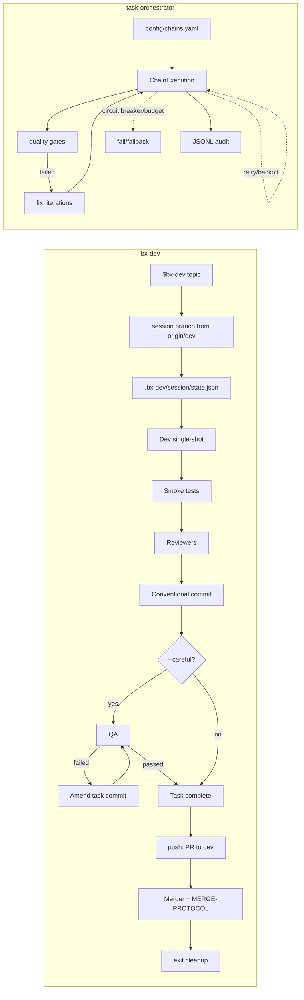

# Исследование: bx-dev — Codex-skill для ad-hoc dev-session orchestration

> **Проект:** [github.com/bish-x/bx-dev-skill](https://github.com/bish-x/bx-dev-skill)
> **Дата анализа:** 2026-07-26
> **Язык:** Markdown + Python support scripts (GitHub primary language: Python)
> **Лицензия:** не указана в GitHub metadata (`license: null`)
> **Snapshot:** `main` `dd7fa7a2f65e487e49847394bff6cd5986b5877e` (`pushed_at`: 2026-06-05T13:06:51Z; commit: `docs: add Russian README`)
> **GitHub metadata:** 17★, 5 forks, 1 open issue, created 2026-06-02, default branch `main`, topics: `ai-agents`, `automation`, `codex`, `codex-skill`, `developer-tools`
> **Аналитик:** Аналитик (Шерлок)

---

## Терминологическая пометка

- **Codex-skill** — устанавливаемая папка skill (скилла) для Codex, активируемая как `$bx-dev`.
- **manual workflow harness** — ручной контур workflow (рабочего процесса): skill не имеет собственного LLM runtime, а управляет внешним Codex runtime.
- **single-shot subagent** — одноразовый субагент: spawn → one final response → `close_agent`.
- **session branch** — сессионная Git-ветка для изоляции dev-сессии.
- **scout plan gate** — этап разведки/плана перед реализацией; при `--plan-approve` требует approval (подтверждение) пользователя.
- **BYO Codex runtime** — пользователь приносит свой установленный Codex runtime и авторизацию; `bx-dev` не поставляет модель.

---

## 1. Обзор проекта

`bx-dev` — самодостаточный **Codex-skill** для временных development sessions (сессий разработки) поверх обычного Git-репозитория. Он не является coding agent (кодинг-агентом), LLM SDK или приложением-шаблоном. README прямо формулирует: установка только добавляет `$bx-dev` в Codex, а сам skill координирует implementation, review, git commits, optional post-commit QA, PR creation, merge and cleanup.

Ключевой workflow:

1. `$bx-dev <topic>` создаёт session branch от `origin/dev` и state в `.bx-dev/<session-id>/`.
2. Пользователь даёт задачи в той же Codex-сессии.
3. В team mode Lead не пишет код сам: он spawn'ит Dev, reviewers, post-commit optional QA and Merger как одноразовых Codex subagents.
4. Каждая задача проходит scout → implement → smoke tests → review → conventional commit; при `--careful` после commit запускается QA, а найденные QA-исправления amend'ят task commit.
5. `push` запускает checks, push session branch, PR в `dev`, merge через Merger teammate (team mode) или напрямую (solo mode), затем sync session branch с `dev`.
6. `exit` пытается завершить leftover work, провести те же gates, переключиться на `dev`, удалить branch/state при безопасных условиях.

> ⚠️ **Классификация:** `bx-dev` — **Codex-specific manual workflow harness** (ручной workflow-контур для Codex), не самостоятельный agent runtime. Это ближе к нашим `task-via-subagents`/`epic-via-subagents`, чем к LangGraph/CrewAI или coding-agent CLI.

### Архитектура

```text
┌─────────────────────────────────────────────────────────────┐
│ Installed Codex skill: $CODEX_HOME/skills/bx-dev             │
│ • SKILL.md — main workflow contract                          │
│ • docs/CODEX-ORCHESTRATION.md — Codex subagent runtime map    │
│ • docs/MERGE-PROTOCOL.md — merge/conflict protocol            │
│ • templates/agents/bx-dev-merger.md — Merger worker prompt    │
│ • skill-library/ — 105 bundled support skills / 9 categories  │
└───────────────────────────────┬─────────────────────────────┘
                                │ invoked in target repository
                                ▼
┌─────────────────────────────────────────────────────────────┐
│ Target repository                                             │
│ • session branch from origin/dev: dev/<slug> or adhoc/<slug>  │
│ • .bx-dev/<session-id>/state.json                             │
│ • .bx-dev/<session-id>/brief.md / context.md / reports         │
│ • normal git commits and PR to dev                             │
└───────────────────────────────┬─────────────────────────────┘
                                │ natural-language spawn
                                ▼
┌─────────────────────────────────────────────────────────────┐
│ Codex runtime subagents                                      │
│ Dev → Bug/Security/Compliance Reviewers → Lead commit         │
│     → optional QA (--careful; amend on failure) → Merger       │
│ Each: spawn → wait_agent → final report → close_agent          │
└─────────────────────────────────────────────────────────────┘
```

### Ключевые характеристики

| Характеристика | Значение |
| --- | --- |
| **Тип** | `Codex-skill / manual workflow harness` |
| **Модель выполнения** | Lead-orchestrated single-shot subagents: Dev → reviewers → conventional commit → optional post-commit QA → Merger |
| **State management** | `.bx-dev/<session-id>/state.json`, `brief.md`, `context.md`, normal Git branch/commits/PR |
| **Runtime dependency** | Codex runtime with subagent tools, `git`, `jq`, GitHub CLI `gh`; `--solo` can run without subagents |
| **Branch model** | session branch from `origin/dev`: `dev/<slug>` by default, fallback `adhoc/<slug>` on ref collision |
| **Modes / flags** | `--solo`, `--careful`, `--no-review`, `--plan-approve`, `--no-sop`, deprecated no-op `--sop` |
| **Commit model** | Conventional Commits with scope `dev`; team mode: one commit per completed task, QA fixes amend it; solo mode: one commit on `push` |
| **Merge model** | PR to `dev`; default squash-on-push; `--no-sop` uses merge commit; Merger subagent follows separate MERGE-PROTOCOL |
| **Skill library** | 105 support skills in 9 categories: architecture, backend, documents, engineering, frontend, general, marketing, review-qa, system |

---

## 2. Возможности оркестрации — обзор

| Функция | bx-dev |
| --- | --- |
| **Chain / DAG engine** | ❌ Нет декларативных chain steps; workflow зашит в `SKILL.md` |
| **Agent loop** | ❌ Нет собственного LLM/tool loop; выполнение делегируется Codex runtime |
| **Subagents / multi-agent** | ✅ First-class внутри Codex: Dev, reviewers, QA, Merger как single-shot subagents |
| **Session state** | ✅ `.bx-dev/<session-id>/state.json` + reports/context |
| **Review/fix loop** | ✅ Bounded review rounds: smoke test fix max 2, review fix max 2, post-commit QA amend max 2 |
| **Quality gates** | ⚠️ Есть detected checks/smoke tests and PR/merge gates, но не reusable chain-level primitive |
| **Retry / backoff** | ❌ Нет universal retry/backoff на уровне runner/step |
| **Circuit breaker** | ❌ Нет circuit breaker; failure paths preserve session and ask user |
| **Budget control** | ❌ Нет token/cost/time budget в оркестраторе |
| **Human-in-the-loop** | ✅ `--plan-approve`, test-failure override, non-converged review override, exit abort choices |
| **Merge resilience** | ✅ Сильный `MERGE-PROTOCOL.md`: detect/setup/classify/resolve/smoke/verify/rollback |
| **Extensibility** | ✅ Support skills, role prompts, flags; но extension surface — Codex skill text, не typed PHP API |
| **Applicability to task-orchestrator** | 🟡 Pattern source for session UX and subagent governance; 🔴 not dependency |

---

## 3. Ключевые механизмы

### 3.1 🟡 Session state в `.bx-dev/<session-id>/`

`SKILL.md` задаёт три основных файла состояния:

```text
.bx-dev/<session-id>/state.json
.bx-dev/<session-id>/brief.md
.bx-dev/<session-id>/context.md
```

`state.json` хранит `active`, `branch`, `topic`, `mode`, logical teammates, actual `codex_agents`, `waiting_for`, `task_count`, `push_count`, flags, `dev_server_url`, `completed_tasks`. Важная деталь — state files обновляются через `jq`/heredoc, а не через `apply_patch`: skill явно защищает runtime-state от неатомарных/неаккуратных правок.

**Сравнение с task-orchestrator:** у нас сильнее machine-readable audit (JSONL audit trail в `DynamicLoop`), chain context and budget. У `bx-dev` лучше human-operational session resume (возобновление): `waiting_for`, `codex_agents`, `context.md` и recovery matrix позволяют понять, на каком этапе прервалась сессия.

**Паттерн для нас:** не заменять JSONL audit, но добавить более явный `session_state` для long-running subagent workflows: current role, branch, run id, waiting reason, human-action needed.

### 3.2 🟡 Single-shot subagent lifecycle

`CODEX-ORCHESTRATION.md` делает runtime contract явным:

1. Lead spawns role worker via natural language.
2. Lead persists returned `agent_id` in `codex_agents` before waiting.
3. Lead waits via `wait_agent`.
4. Final response is persisted.
5. Lead calls `close_agent(target=<agent_id>)`.
6. State marks role closed and clears teammate slot.

Final response should contain structured sections: `Status`, `Summary`, `Files changed`, `Files read`, `Verification`, `Findings`, `Blockers`, `Next input needed`.

**Сравнение с task-orchestrator:** наши `run-subagent`/`task-via-subagents` уже используют subagent reports, но `bx-dev` лучше формализует close lifecycle and stale-agent handling. Прямой Codex API (`wait_agent`, `close_agent`) не переносим, но **report contract + run id + explicit close/cleanup** переносимы как governance pattern.

### 3.3 🟡 Флаги режимов и строгий parsing

Поддерживаемые flags:

| Flag | Смысл |
| --- | --- |
| `--solo` | Lead работает напрямую, без subagents |
| `--careful` | Добавляет post-commit QA phase после task commit; QA-fixes amend'ят этот commit |
| `--no-review` | Пропускает reviewers в team mode |
| `--plan-approve` | Scout-only plan must be approved before implementation |
| `--no-sop` | PR merge instead of default squash |
| `--sop` | Deprecated no-op, accepted for compatibility |

Особо ценно, что `SKILL.md` требует **strict parsing — no inference**: неизвестные flags останавливают workflow, resolved flags обязательно показываются пользователю, несовместимые комбинации (`--solo` + `--careful`, `--solo` + `--plan-approve`) fail-fast.

**Сравнение с task-orchestrator:** у нас режимы workflow сейчас в значительной степени encoded (закодированы) в skills and chains. UX `bx-dev` показывает, что declarative mode flags (декларативные флаги режима) снижают скрытую магию.

### 3.4 🟡 Scout-plan gate (`--plan-approve`)

Dev prompt содержит mandatory SCOUT before code: parse intent, scan codebase, assess complexity, multi-perspective analysis, approach design, risk register, report to Lead. По умолчанию Dev делает scout and implement in one spawn. При `--plan-approve` Dev работает в `MODE: SCOUT_ONLY`, Lead закрывает scout agent, показывает plan пользователю и только после approval spawn'ит fresh Dev for implementation.

**Сравнение с task-orchestrator:** у нас есть роли Аналитик/Архитектор и рефлексия, но нет универсального flag-level HITL plan gate перед любым implementation subagent. Паттерн хорош как opt-in для рискованных задач.

### 3.5 🟡 Review/QA phases как bounded loops

`bx-dev` выбирает reviewers smartly:

- Bug Reviewer almost always for non-trivial tasks.
- Security Reviewer only on narrow security-sensitive file patterns.
- Compliance Reviewer if `AGENTS.md` or `CLAUDE.md` has substantive content.
- QA only with `--careful`.

Review loop bounded: after `CRITICAL/MAJOR`, Dev fixes and reviewers rerun; after 2 rounds non-convergence is surfaced to user. Важно: QA в task lifecycle стоит **после** conventional commit, то есть это post-commit gate; при QA-failure Dev исправляет найденное, а Lead делает `git commit --amend --no-edit` к тому же task commit. QA similarly has max 2 rounds.

**Сравнение с task-orchestrator:** наш `fix_iterations` более runtime-level and deterministic. `bx-dev` даёт полезный UX: optional post-commit QA as a flag and reviewer selection heuristics. Но resilience is human/Codex-driven: no circuit breaker, budget, fallback routing.

### 3.6 🟡 Merge Protocol как отдельный артефакт

`MERGE-PROTOCOL.md` — самый инженерно зрелый документ в bundle. Он задаёт architecture `DETECT -> SETUP -> CLASSIFY -> RESOLVE -> SEMANTIC-CHECK -> SMOKE-TEST -> VERIFY -> ROLLBACK`, conflict taxonomy (10 types), strategy table, NEVER/escape hatch rules, rollback semantics. `bx-dev-merger.md` превращает это в JSON status contract with exact statuses: `CLEAN`, `CONFLICT_RESOLVED`, `ROLLBACK_TEST_REGRESSION`, `STALE_BASELINE`, `BRANCH_PROTECTION_BLOCKED` and others.

**Сравнение с task-orchestrator:** в нашем проекте Git/PR rules находятся в AGENTS.md and workflow docs, а merge by AI requires explicit human confirmation. `bx-dev` не должен быть скопирован буквально, потому что его `push/exit` can run `gh pr merge`, что конфликтует с нашим запретом merge без явного пользователя. Но **separate merge-protocol artifact + structured merger status taxonomy** — полезный pattern для будущих PR automation docs.

### 3.7 🟡 Conventional commit per task

Team mode creates one conventional commit per completed task after review and before optional `--careful` QA. If post-commit QA finds issues, fixes are folded back via `git commit --amend --no-edit`, so the one-task-one-commit boundary remains intact. Solo accumulates dirty work until `push`, then creates one commit boundary. Scope is fixed `dev` and description language must match existing commits.

**Сравнение с task-orchestrator:** у нас Conventional Commits уже закреплены, но `bx-dev` полезен как reminder: commit boundary should align with task boundary, not with every micro-edit.

### 3.8 🟡 Skill-library governance

Bundle contains **105 support skills / 9 categories**:

| Category | Count |
| --- | ---: |
| architecture | 1 |
| backend | 12 |
| documents | 1 |
| engineering | 6 |
| frontend | 13 |
| general | 16 |
| marketing | 37 |
| review-qa | 12 |
| system | 7 |

`skill-library/INDEX.md` acts as category router; `MANIFEST.md` is flat inventory. README explicitly says support skills are bundled references and should not be installed separately unless intentionally reused. `.gitignore` excludes `.bx-dev/` and planning artifacts, `.gitattributes` normalizes text files.

**Сравнение с task-orchestrator:** наши `docs/agents/skills/*` are project-local and role-integrated. `bx-dev` shows a packaged skill-library distribution pattern: category indexes, manifest, and exclusions section. This is useful if task-orchestrator later ships installable skills.

---

## 4. Сравнение с task-orchestrator

| Критерий | bx-dev | task-orchestrator | Вывод |
| --- | --- | --- | --- |
| **Orchestration model** | Codex skill workflow: Lead → single-shot Dev/reviewers → conventional commit → optional post-commit QA/Merger | YAML chains, `ChainExecution`, `DynamicLoop`, `run-subagent`, `task-via-subagents` | `bx-dev` близок к нашим workflow skills, не к core runtime |
| **State management** | `.bx-dev/<session-id>/state.json`, `brief.md`, `context.md`, Git branch/PR | Chain context/payload, task files, JSONL audit, dynamic-loop session files | Заимствовать session resume metadata; JSONL audit оставить сильной стороной |
| **Error handling** | Fail-fast flags/state checks, bounded review rounds, post-commit QA amend rounds, test-fail prompts, merge rollback protocol | Retry/backoff, circuit breaker, fallback routing, quality gates, budget, `fix_iterations` | Наш resilience stack сильнее; `bx-dev` не dependency |
| **Extensibility** | Textual skill, bundled support skills, Codex runtime, flags | Symfony DI, DDD modules, runner configs, role/skill docs | Borrow skill packaging/governance, not runtime implementation |
| **Applicability** | Codex-only dev-session harness for repositories with `origin/dev` and GitHub CLI | PHP/Symfony CLI/library orchestrator for repeatable chains | Комплементарно; прямой перенос невозможен |

### 4.1 Где `bx-dev` сильнее как UX/reference

- Чистые mode flags: `--solo`, `--careful`, `--no-review`, `--plan-approve`, `--no-sop`.
- Explicit session state and recovery matrix.
- Structured single-shot subagent lifecycle with close discipline.
- Optional post-commit QA phase as one flag, with amend-on-failure semantics.
- Separate merge protocol + structured merger JSON status.
- Packaged support skill library with router/index/manifest.

### 4.2 Где task-orchestrator сильнее как runtime

- Chain-level retry with backoff and `CircuitBreakerAgentRunnerService`.
- Quality gates as deterministic shell checks in chain config.
- Budget control and fallback routing.
- `fix_iterations` as bounded runtime primitive, not only prompt-level loop.
- JSONL audit trail for machine-readable trace.
- DDD/Clean Architecture PHP implementation.
- Project Git rules: no `merge` without explicit human confirmation.

### 4.3 Mermaid-сопоставление



---

## 5. Сравнение с ближайшими аналогами

| Критерий | bx-dev (#31) | SwarmForge (#29) | Orca ADE (#30) | OmO (#23) | AgentCraft (#16) |
| --- | --- | --- | --- | --- | --- |
| **Тип** | Codex skill workflow harness | tmux swarm orchestration | Desktop/mobile ADE | OpenCode plugin/team mode | Proprietary GUI wrapper |
| **Runtime** | Codex subagents | external CLI agents in tmux | external CLI agents in worktrees | OpenCode runtime | external agents |
| **State** | `.bx-dev/` + Git branch/PR | `.swarmforge/` + handoff files | app/runtime state + worktrees | OpenCode SQLite + mailbox/tasks | local mission history |
| **Topology** | Central Lead → single-shot roles | peer-to-peer handoff daemon | human workbench fan-out | Lead + discipline/team agents | GUI teams/missions |
| **Merge/ship** | PR to `dev` + Merger protocol | role handoff commits | human compare/merge winner | plugin/team coordination | GUI product flow |
| **Best borrow** | flags, state, plan gate, merge protocol | handoff schema, role ownership, pack presets | fan-out/worktree monitoring | IntentGate/team mode | team UX only |
| **Not dependency because** | Codex-specific text skill | tmux/zsh/Babashka | Electron/mobile ADE | OpenCode plugin | closed product |

**Вывод по аналогам:** `bx-dev` is closest to our internal `task-via-subagents` and SwarmForge's governance discipline, while Orca is closer on Git/PR/worktree surface. Unlike Orca, `bx-dev` is not a desktop workbench; unlike SwarmForge, it is centralized under Lead rather than peer-to-peer.

---

## 6. Сводка по заимствованию

| Возможность | Статус для task-orchestrator | Описание |
| --- | --- | --- |
| Strict mode flags | 🟡 P2 | Make workflows explicit: solo/team/careful/no-review/plan-approve style switches |
| Scout plan approval gate | 🟡 P2 | HITL before implementation for risky tasks; implement as skill/workflow option |
| Session-state resume metadata | 🟡 P2 | Track waiting role, run id, branch, human-action-needed beside JSONL audit |
| Structured single-shot report/close contract | 🟡 P2 | Require subagent reports with task id/run id/status/files/checks/blockers/report path |
| MERGE-PROTOCOL artifact | 🟡 P3 | Separate merge/conflict protocol and status taxonomy; adapt to our no-merge-without-confirmation rule |
| Optional post-commit QA as flag | 🟡 P2 | `--careful` analogue for task workflows: add QA only after task commit; fold QA fixes back with amend to keep one commit per task |
| Skill-library category router + manifest | 🟡 P3 | Improve governance/discoverability of `docs/agents/skills/*` |
| Conventional commit per task | 🟡 P2 | Reinforce one task = one commit boundary where practical |
| Codex-specific runtime dependency | 🔴 — | Do not depend on `wait_agent`/`close_agent`/Codex skill internals |
| Auto `gh pr merge` flow | 🔴 — | Do not copy literally; conflicts with project rule requiring explicit user merge confirmation |

### Concrete patterns (3–7) для возможного заимствования

1. **Strict workflow flags (P2):** explicit `--plan-approve`, `--careful`, `--no-review` style options with fail-fast unknown-flag handling.
2. **Plan-approval gate (P2):** scout-only run before implementation when task risk/context demands human approval.
3. **Session resume state (P2):** small state file for subagent workflows: `waiting_for`, `agent_run_id`, branch, current gate, completed tasks.
4. **Structured subagent final report (P2):** status, summary, files changed/read, verification, findings, blockers, next input, report path.
5. **Optional post-commit QA phase (P2):** QA as explicit opt-in or risk-triggered phase after the task commit, with amend-on-failure instead of extra fix commits.
6. **Merge protocol as standalone doc (P3):** reusable conflict taxonomy/status contract, adapted to our PR protection and human merge confirmation.
7. **Skill-library governance (P3):** category router, flat manifest, exclusion rules, install boundary for reusable skills.

---

## 7. Вердикт

**Итоговый verdict:** 🟡 **заимствовать отдельные паттерны**, 🔴 **не использовать как dependency**.

**Почему заимствовать:** `bx-dev` is a clean mirror of our own subagent delivery loop in Codex form. It makes several UX and governance decisions explicit: session state, strict flags, scout gate, bounded review rounds, post-commit QA with amend semantics, conventional task commits, merge protocol, support skill library taxonomy.

**Почему не dependency:**

- Codex-specific: depends on Codex subagent lifecycle concepts (`wait_agent`, `send_input`, `close_agent`) and `$CODEX_HOME/skills` installation.
- Textual skill, not PHP/Symfony package or typed API.
- No own LLM runtime or agent-loop; BYO Codex runtime only.
- No universal runner-/chain-level retry/backoff, circuit breaker, budget control, fallback routing or JSONL audit comparable with `task-orchestrator`.
- Git flow targets `dev` and may run `gh pr merge`; our project forbids merge without explicit user confirmation.
- Support skill-library is broad but not task-orchestrator-specific; full import would add noise and duplicate local governance.

**Bottom line:** `bx-dev` is not a runtime foundation for `task-orchestrator`. It is a valuable **workflow reference** for making our human/subagent delivery cycle more explicit and recoverable.

---

## 8. Указатель источников для деталей

- [Repository metadata](https://api.github.com/repos/bish-x/bx-dev-skill) — snapshot, topics, stars/forks/issues, language, license.
- [README.md](https://raw.githubusercontent.com/bish-x/bx-dev-skill/main/README.md) and [README.ru.md](https://raw.githubusercontent.com/bish-x/bx-dev-skill/main/README.ru.md) — purpose, install, session commands, flags, requirements, skill-library counts.
- [`skills/bx-dev/SKILL.md`](https://raw.githubusercontent.com/bish-x/bx-dev-skill/main/skills/bx-dev/SKILL.md) — main lifecycle, flags, task loop, push/exit/recovery, role prompts.
- [`docs/CODEX-ORCHESTRATION.md`](https://raw.githubusercontent.com/bish-x/bx-dev-skill/main/skills/bx-dev/docs/CODEX-ORCHESTRATION.md) — authoritative Codex runtime mapping and report/close contract.
- [`docs/MERGE-PROTOCOL.md`](https://raw.githubusercontent.com/bish-x/bx-dev-skill/main/skills/bx-dev/docs/MERGE-PROTOCOL.md), [`templates/agents/bx-dev-merger.md`](https://raw.githubusercontent.com/bish-x/bx-dev-skill/main/skills/bx-dev/templates/agents/bx-dev-merger.md) — conflict protocol and merger JSON status contract.
- [`skill-library/INDEX.md`](https://raw.githubusercontent.com/bish-x/bx-dev-skill/main/skills/bx-dev/skill-library/INDEX.md), [`MANIFEST.md`](https://raw.githubusercontent.com/bish-x/bx-dev-skill/main/skills/bx-dev/skill-library/MANIFEST.md) — 105 support skills inventory.

📚 **Источники:**
1. [github.com/bish-x/bx-dev-skill](https://github.com/bish-x/bx-dev-skill) — repository and source snapshot.
2. [README.md](https://raw.githubusercontent.com/bish-x/bx-dev-skill/main/README.md) — workflow overview and install.
3. [`SKILL.md`](https://raw.githubusercontent.com/bish-x/bx-dev-skill/main/skills/bx-dev/SKILL.md) — main Codex skill contract.
4. [`CODEX-ORCHESTRATION.md`](https://raw.githubusercontent.com/bish-x/bx-dev-skill/main/skills/bx-dev/docs/CODEX-ORCHESTRATION.md) — subagent runtime contract.
5. [`MERGE-PROTOCOL.md`](https://raw.githubusercontent.com/bish-x/bx-dev-skill/main/skills/bx-dev/docs/MERGE-PROTOCOL.md) — merge/conflict protocol.

## 9. Limitations (Ограничения анализа)

- Не выполнялся локальный запуск `$bx-dev`; выводы основаны на primary docs and repository tree.
- 105 support skills не читались построчно; выводы по taxonomy/governance основаны на `INDEX.md`, `MANIFEST.md` and tree inventory.
- Нет подтверждения runtime behaviour вне документации Codex; всё, что касается actual subagent tool semantics, трактуется как documented contract (документированный контракт), а не проверенный runtime test.
