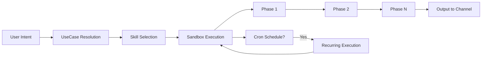

# Исследование: Duet — Always-on AI-агент для командной работы (проприетарный)

> **Проект:** [duet.so](https://duet.so/)
> **GitHub:** [aomni-com](https://github.com/aomni-com) (duet-skills, chat, duet-ai-starter — компоненты; ядро закрыто)
> **Дата анализа:** 2026-05-13
> **Язык:** TypeScript (Bun, Hono, React, Next.js)
> **Лицензия:** Проприетарный (ядро), MIT (duet-skills, chat SDK, duet-ai-starter)
> **Финансирование:** $4.4M (Aomni)
> **Аналитик:** Аналитик (Шерлок)

---

## 1. Обзор проекта

Duet (by Aomni) — проприетарный SaaS-продукт, позиционируемый как **«always-on AI agent built for teams»**. Автоматизирует GTM (Go-To-Market), product и ops workflows в едином shared workspace. Пользователь формулирует задачу на естественном языке → Duet автономно выполняет многошаговый workflow: исследования, создание контента, настройка scheduled pipelines, обработка писем, мониторинг конкурентов, деплой дашбордов и приложений.

Duet **не является** фреймворком оркестрации цепочек, SDK или workflow engine. Это **автономный бизнес-агент** (business agent SaaS), который работает на уровне целых бизнес-процессов (outbound campaign, competitor watch, support triage), а не отдельных chain steps. Ключевое отличие от всех исследованных проектов: Duet не даёт пользователю программного контроля над шагами оркестрации — пользователь формулирует intent, а Duet выбирает и выполняет skill (skill-driven orchestration).

### Публичные компоненты

| Репозиторий | Описание | Лицензия |
| --- | --- | --- |
| `aomni-com/duet-skills` | Кураторский реестр навыков (skills) и use cases (surface placements) | MIT |
| `aomni-com/chat` | Unified TypeScript SDK для чат-ботов (8 платформ) | MIT |
| `aomni-com/duet-ai-starter` | Full-stack starter (Hono + React + Vite + SQLite/Drizzle) | MIT |

**Ядро Duet** (sandbox runtime, chat-app, workspace, integrations) — закрытый код. Анализ основан на: (1) SKILL.md-файлах и TypeScript-типах из `duet-skills`, (2) API/типах из `chat` SDK, (3) метаданных сайта (JSON-LD), (4) структуре external-skills и use-cases.

### Архитектура (восстановленная)

```
duet/ (закрытый core)
├── sandbox/                    # Изолированная среда выполнения (container)
│   ├── runtime.ts              # Загрузка skills из @aomni-com/duet-skills/runtime
│   ├── default-skills/         # Примитивные навыки (firecrawl, cron, pdf, github...)
│   └── gateway/                # HTTP-доступ к sandbox-приложениям
├── chat-app/                   # Workspace UI (Next.js, Web/iOS/Android/Desktop)
│   ├── workspace/              # Shared team context, channels, artifacts
│   ├── surfaces/               # Home, desktop, mobile, channel, compose
│   ├── workflow-catalog/       # Use case registry → UI cards/dialogs
│   └── integrations/           # Composio toolkit connectors
├── duet-skills/                # Публичный реестр skills + use cases (MIT)
│   ├── skills/<id>/SKILL.md    # Frontmatter (id, model, tools) + body (prompt)
│   ├── src/types.ts            # Skill, UseCase, Surface, UseCaseCategory
│   ├── src/use-cases.ts        # Surface placements (metadata-only, no behavior)
│   ├── src/external-skills.ts  # KNOWN_DEFAULT_SKILL_IDS (19 default primitives)
│   └── src/generated.ts        # Auto-generated из SKILL.md → build-registry
├── chat/                       # Multi-platform chat SDK (MIT)
│   ├── adapters/               # Slack, Teams, GChat, Discord, Telegram, GitHub, Linear, WhatsApp
│   └── state/                  # Redis state backend
└── duet-ai-starter/            # Full-stack starter (MIT)
    ├── Hono API backend
    └── React frontend (Vite + TanStack Query + Drizzle SQLite)
```

### Ключевые характеристики

| Характеристика | Значение |
| --- | --- |
| **Тип** | Business Agent SaaS |
| **Модель выполнения** | Skill-driven: intent → skill selection → multi-phase autonomous execution |
| **State management** | Cloud-managed (workspace + channels + file artifacts + Convex tables) |
| **Интеграции** | Composio (19+ connectors: Sentry, GitHub, Gmail, Outlook, Stripe, PostHog...) |
| **Расширяемость** | SKILL.md-навыки + UseCase surface placements + 19 default tools |
| **Каналы** | 8 платформ через chat SDK (Slack, Teams, GChat, Discord, Telegram, GitHub, Linear, WhatsApp) |
| **Платформы** | Web, iOS, Android, Desktop |
| **Модель LLM** | claude-opus-4-7 (все публичные skills) |
| **Установка** | SaaS (duet.so), self-hosting не поддерживается |
| **Автор** | Aomni (основан 2024, $4.4M funding) |

### Основные компоненты

| Компонент | Назначение |
| --- | --- |
| Sandbox | Изолированная среда выполнения (container): LLM calls + tools + file system |
| Skills (SKILL.md) | Навыки с frontmatter (id, model, tools) + markdown body (system prompt) |
| Use Cases | Surface placements: карточки в UI с metadata (title, icon, nodes, deliverable) |
| Default Skills | 19 примитивов: cron, firecrawl, web-search, file-write, github, pdf, build-apps... |
| Industry Skills | 12 бизнес-навыков: deep-research, outbound-campaign, competitor-watch, email-triage... |
| Workspace | Shared team context: channels, artifacts, files |
| Chat SDK | Unified API для 8 чат-платформ |
| Composio Integration | 19+ сторонних сервисов через Composio connectors |
| Cron Tool | Scheduled pipelines: recurring execution по расписанию |
| Build-Apps Tool | Генерация и деплой мини-приложений (дашборды, трекеры) внутри sandbox |

---

## 2. Возможности оркестрации — обзор

| Функция | Duet |
| --- | --- |
| **Ролевые промпты** | ✅ SKILL.md: system prompt + model + tools per skill |
| **Multiple runners** | ❌ Один LLM provider (claude-opus-4-7) |
| **YAML-конфигурация** | ❌ Нет (SaaS, конфигурация через UI) |
| **Session persistence** | ✅ Workspace + channels + file artifacts |
| **Multi-agent** | ❌ Один агент per thread |
| **Scheduled tasks** | ✅ Cron tool (recurring pipelines, competitor watches, daily digests) |
| **Shared context** | ✅ Team workspace (shared channels, files, artifacts) |
| **Integrations** | ✅ 19+ через Composio |
| **Multi-channel** | ✅ 8 платформ через chat SDK |
| **App generation** | ✅ Build-apps tool (дашборды, трекеры, internal tools) |
| **File operations** | ✅ File-write, PDF, file-conversion |
| **Web scraping** | ✅ Firecrawl, web-search |
| **Media creation** | ✅ media-creation tool |
| **Human-in-the-loop** | ✅ Drafts только, не auto-send; approval gates в skills |

---

## 3. Анализ по 4 осям

### 3.1 Модель оркестрации

**Паттерн: Skill-driven autonomous execution**

Duet не использует DAG, graph, agent-loop (в классическом понимании `LLM → tool → observation → LLM → ...`) или pipeline. Вместо этого Duet реализует **skill-driven orchestration**: пользователь формулирует intent → Duet определяет подходящий skill (по UseCase registry) → автономно выполняет multi-phase workflow, описанный в SKILL.md.



**Как это работает:**

1. **Intent capture**: Пользователь пишет в channel или нажимает use case card в UI
2. **Skill resolution**: UseCase.primarySkillId → lookup в runtime registry (default + industry skills)
3. **System prompt injection**: SKILL.md body становится system prompt для sandbox
4. **Tool provisioning**: SKILL.md tools → sandbox активирует соответствующие tools
5. **Model selection**: SKILL.md model → sandbox использует указанную LLM
6. **Autonomous execution**: LLM автономно выполняет multi-phase workflow, описанный в SKILL.md
7. **Output delivery**: Результат доставляется в channel / workspace / deployed app

**Мультифазные workflows:** Каждый skill описывает 2–7 фаз выполнения. Примеры:

| Skill | Фазы |
| --- | --- |
| Outbound Campaign | Define ICP → Build list → Personalize & send → Triage replies |
| Competitor Watch | First run (baseline) → Recurring runs (diff) |
| Cross-Source Dashboard | Confirm sources → Confirm metrics → Sketch layout → Build → Wire data → Deploy → Schedule |
| Scheduled Pipeline | Define source → Pick cadence → Define transform → Pick destination → Define anomaly → Deploy → Observe |
| Support Ticket Triage | Pull queue → Classify → Draft replies → Route → Spot patterns |

**Scheduled execution (Cron):** Skills, требующие повторного выполнения (competitor-watch, scheduled-pipeline), используют `cron` tool для настройки расписания. Cron не является частью skill DSL — это tool, вызываемый агентом.

**Ключевое отличие от task-orchestrator:** Duet оркестирует **целые бизнес-процессы** (campaign → pipeline → dashboard), а не **шаги цепочки** (LLM call → shell command → quality gate). Уровень абстракции принципиально иной: Duet — это product, а не framework. Пользователь не контролирует шаги выполнения — он формулирует intent и получает результат.

**Сравнение с другими проектами:**

| Паттерн | Проекты | Duet |
| --- | --- | --- |
| Agent loop (LLM → tool → LLM) | 16/23 проектов | ❌ Не классический agent loop — skill-driven |
| DAG / Graph | LangGraph, Archon | ❌ Нет DAG |
| Meta-orchestration | Paperclip AI | Частично: UseCase registry, но без org governance |
| Subprocess SDK | Archon, Sandcastle | ❌ Нет subprocess management |
| Business agent SaaS | — | ✅ **Уникальная категория** |

### 3.2 State Management

**Паттерн: Cloud-managed workspace + file-based artifacts**

Duet не предоставляет программного API для state management. Состояние хранится и управляется инфраструктурой SaaS. Из публичных компонентов можно выделить:

**1. Team Workspace (cloud-managed):**
- Shared channels (Slack-like) для team-wide коммуникации
- Artifacts: файлы, дашборды, приложения, созданные агентом
- Workspace — единый контекст для всей команды

**2. File-based artifacts (sandbox filesystem):**
- Skills записывают результаты через `file-write` tool
- Структурированные файлы: `manifest.json`, `pipeline_{slug}/`, `campaigns/{slug}/`
- Pipeline state: «persist the latest state and the prior state for diffs»
- Snapshots для competitor-watch (raw + structured summary)

**3. Convex tables (вferred из SKILL.md):**
- Pipeline data: `pipeline_{slug}` с `cycledAt` и `payload` columns
- Dashboard data: cached panel data
- «Upsert semantics» для idempotency

**4. Channel state (chat SDK):**
- `createRedisState()` — Redis-backed state для multi-platform чат-ботов
- Thread subscriptions и message history

**5. Scheduled state (cron):**
- Cron tool хранит schedule + last run state
- Skills: «keep the last 30 cycles for trend/anomaly detection»

**Ключевые особенности:**
- **Нет явного state transfer между шагами:** State не передаётся через DTO/payload — LLM агент читает/пишет файлы напрямую
- **Нет схемы валидации:** Нет TypedDict, Zod schemas или JSON Schema для I/O
- **Idempotency через upsert:** «Re-running the same cycle must produce the same end state»
- **Baseline → Diff pattern:** Competitor-watch и scheduled-pipeline используют двухфазную модель: first run = baseline, subsequent runs = diff against previous

**Сравнение с task-orchestrator:**

| Аспект | task-orchestrator | Duet |
| --- | --- | --- |
| State transfer | Payload (JSON) между шагами | Файловая система + implicit context |
| Persistence | JSONL audit trail | Cloud-managed + file artifacts |
| Validation | JSON Schema (potentially) | Нет (LLM validates implicitly) |
| Between runs | Нет | ✅ Pipeline state, competitor snapshots |
| Team sharing | Нет | ✅ Shared workspace, channels |

### 3.3 Error Handling

**Паттерн: Prompt-driven defensive guidance, без explicit retry/ Circuit Breaker**

Duet **не имеет** программных механизмов error handling (retry с backoff, circuit breaker, error classification, fallback routing). Вместо этого error handling реализован на уровне **prompt engineering** — каждый SKILL.md содержит секцию «Gotchas» с руководством для LLM по предотвращению и обработке ошибок.

**Примеры prompt-driven error handling:**

| Skill | Gotcha (prompt-level) |
| --- | --- |
| Scheduled Pipeline | «Rate limits are real. Daily is usually fine. Hourly hits limits on some APIs.» |
| Scheduled Pipeline | «Idempotency is non-negotiable. Re-running the same cycle must produce the same end state.» |
| Competitor Watch | «Anti-bot fences exist. If a target serves you a CAPTCHA or 403, don't retry hammering — note it in the digest.» |
| Competitor Watch | «Save raw, summarize on output. Store the full snapshot so future diffs can compare back to raw state.» |
| Cross-Source Dashboard | «Cache or you will get rate-limited. Default cache: 10 minutes per panel.» |
| Email Triage | «Never fabricate facts. If a reply needs a number you don't have, write the draft with {TODO: confirm X} placeholders.» |
| Support Ticket Triage | «If the answer isn't crisp, don't fabricate — route instead.» |
| Outbound Campaign | «Domain warmup matters. New domains shouldn't send 50/day from day one. Default cap to 10/day for the first 2 weeks.» |

**Human approval gates (implicit HITL):**
- Email triage: «Wait for approval before sending. Drafts go to the inbox's draft folder, not the outbox.»
- Outbound campaign: «Show the user the first 5 drafts. They approve voice, tone, and personalization quality.»
- Cross-source dashboard: «Confirm with the user before building / making public.»

**Retry:** Нет явного retry mechanism. Если LLM-вызов завершается ошибкой, Duet, вероятно, показывает пользователю сообщение об ошибке. Нет exponential backoff, нет retry policy, нет fallback model.

**Circuit breaker:** Нет.

**Error classification:** Нет программной классификации. Gotchas в skills содержат вербальные инструкции по rate limiting, API limits, data quality, но нет формальной FATAL/TRANSIENT/UNKNOWN классификации.

**Fallback routing:** Нет. Все skills используют одну модель (claude-opus-4-7).

**Сравнение с task-orchestrator:**

| Аспект | task-orchestrator | Duet |
| --- | --- | --- |
| Retry с backoff | ✅ RetryingAgentRunner | ❌ Нет |
| Circuit breaker | ✅ CircuitBreakerAgentRunner | ❌ Нет |
| Error classification | ❌ (нет, но в roadmap) | ❌ Нет |
| Fallback model | ✅ FallbackRoutingAgentRunner | ❌ Нет |
| Budget control | ✅ BudgetChecker | ❌ Нет |
| Quality gates | ✅ Shell-based | ❌ Нет |
| Human approval | ❌ | ✅ Prompt-driven (drafts only) |
| Idempotency | ❌ | ✅ Prompt-driven (upsert) |

**Вывод:** Error handling Duet — примитивный. Вся обработка ошибок делегирована LLM через prompt engineering. Для SaaS-продукта с автоматическим выполнением бизнес-процессов это осознанный компромисс: простота ценой надёжности. Риски rate limiting, API errors и data quality не имеют программной защиты — только вербальные инструкции в system prompt.

### 3.4 Extensibility

**Паттерн: SKILL.md skills + UseCase surface placements + Composio integrations + chat SDK adapters**

Duet предоставляет 4 уровня расширяемости:

**1. SKILL.md Skills (наиболее развитый механизм)**

Формат skill:

```yaml
---
id: deep-research          # Уникальный ID (never rename, only deprecate)
name: Deep Research        # Человекочитаемое имя
description: Multi-source research with citations  # Tooltip / AI triggering
model: claude-opus-4-7     # Опциональный override модели
tools: [web-search, firecrawl, file-write]  # Опциональный список tools
---

You are a research agent. When given a query...  # Markdown body = system prompt
```

**Два уровня skills:**

| Уровень | Расположение | Загрузка |
| --- | --- | --- |
| Default skills | `chat-app/.../default-skills/` | Всегда, embedded в sandbox image |
| Industry skills | `aomni-com/duet-skills` | Через npm-пакет `@aomni-com/duet-skills` |

**Default skills (19 primitives):** `add-skill`, `ai-gateway`, `branded-content`, `build-apps`, `composio-credentials`, `create-skill`, `crm`, `cron`, `duet`, `env-vars`, `file-conversion`, `find-skills`, `firecrawl`, `github`, `go-to-market`, `impeccable`, `media-creation`, `pdf`, `webhook-collector`.

**Industry skills (12 в публичном реестре):** `branded-asset-generator`, `competitor-watch`, `cross-source-dashboard`, `deep-research`, `email-triage`, `internal-tracker-app`, `marketing-video`, `meeting-notes-to-actions`, `outbound-campaign`, `sales-meeting-prep`, `scheduled-pipeline`, `seo-content-writer`, `support-ticket-triage`.

**2. UseCase Surface Placements**

UseCase — это **чистая metadata** (no behavior). Строгое разделение: UseCase **не может** переопределять поведение skill (no systemPrompt, tools, model, body — enforced by TypeScript type system).

```typescript
// Compile-time guard against behavior overrides
type ForbiddenOnUseCase = 'systemPrompt' | 'tools' | 'model' | 'body'
type _AssertNoOverrides = ForbiddenOnUseCase extends keyof UseCase ? never : true
```

UseCase определяет:
- `primarySkillId` + `supportingSkillIds` — какие skills активировать
- `category` (engineering, growth, sales, operations, research...) — группировка в UI
- `deliverable` (app, automation, recurring, workflow) — badge в UI
- `nodes` (source → duet → output) — workflow diagram
- `requiredToolkits` — какие Composio connectors нужны
- `surfaces` (home, desktop, mobile, channel, compose) — где показывать
- `seedPrompt` — начальный промпт для запуска skill
- `whatYoullGet` / `whatIllAsk` — expectation-setting bullets

**3. Composio Integrations (19+ connectors)**

Skills объявляют требуемые integrations через `requiredToolkits`:
- Sentry, GitHub, Gmail, Outlook, Stripe, PostHog, Convex
- Google Search Console, Google Analytics, Linear
- Instantly, Lemlist (email outreach)
- Crustdata, FullEnrich, Apollo (enrichment)

**4. Chat SDK Adapters (8 platforms)**

Единый TypeScript SDK (`chat`) для кросс-платформенных чат-ботов:
- Slack, Microsoft Teams, Google Chat, Discord, Telegram, GitHub, Linear, WhatsApp
- Единый API: `bot.onNewMention()`, `bot.onSubscribedMessage()`
- Adapter pattern: `createSlackAdapter()`, `createTeamsAdapter()`, etc.
- Features: mentions, reactions, cards (JSX-based), modals, slash commands, streaming, file uploads, DMs

**Инварианты расширяемости (из duet-skills README):**

1. **Use cases cannot override skill behavior** — enforced by TypeScript
2. **Use cases are pure curation** — metadata only, no logic
3. **Every UseCase.skillId must resolve** — verified by build script
4. **Never rename a skill id** — only deprecate
5. **Two entrypoints:** runtime (full, sandbox only) + use-cases (metadata-only, browser-safe)
6. **Versioning:** minor = new skills, patch = UI tweaks, major = skill removal only

**Сравнение с task-orchestrator:**

| Аспект | task-orchestrator | Duet |
| --- | --- | --- |
| Формат расширения | YAML chains + PHP runners | SKILL.md + TypeScript UseCases |
| Skill registry | Нет | ✅ Build-registry с валидацией |
| Multi-channel | Нет | ✅ 8 платформ через chat SDK |
| Integration connectors | Нет | ✅ 19+ через Composio |
| App generation | Нет | ✅ Build-apps tool |
| Scheduled execution | Нет | ✅ Cron tool |
| UI surface management | Нет | ✅ UseCase surface placements |
| Behavioral separation | Нет | ✅ Strict skill/usecase split (TypeScript-enforced) |
| MCP | Нет (в roadmap) | ❌ Нет (Composio вместо MCP) |
| Custom runners | ✅ AgentRunnerInterface | ❌ Один hardcoded LLM |

---

## 4. Сравнение с task-orchestrator

### Что у них есть, чего нет у нас

| Возможность | Описание | Приоритет для заимствования |
| --- | --- | --- |
| **SKILL.md-навыки** | Декларативное описание agent capabilities (frontmatter + body) | 🟡 P3 — у нас YAML chains решают ту же задачу иначе |
| **UseCase surface placements** | Разделение capability (skill) и presentation (use case) | ⚠️ Не применимо — у нас CLI, не GUI |
| **Cron / Scheduled execution** | Повторяющиеся pipelines по расписанию (competitor watch, daily digests) | 🟡 P2 — cron-trigger для цепочек |
| **Shared team workspace** | Единый контекст для команды: channels, files, artifacts | ⚠️ Не применимо — другая ниша (SaaS vs CLI Bundle) |
| **Multi-channel delivery** | 8 чат-платформ через единый SDK | ⚠️ Не применимо — другая ниша |
| **Composio integrations** | 19+ сторонних сервисов через connectors | 🟡 P3 — аналог MCP для внешних API |
| **Build-apps tool** | Генерация и деплой мини-приложений внутри sandbox | ⚠️ Не применимо — другая ниша |
| **Pipeline baseline → diff pattern** | First run = baseline, subsequent = diff against previous | 🟡 P3 — для recurring chains с state comparison |
| **Prompt-driven gotchas** | Антипаттерны и обработка ошибок через system prompt | 🟡 P3 — enrich prompts с error guidance |
| **Idempotency via upsert** | «Re-running the same cycle must produce the same end state» | 🟡 P2 — для fix_iterations и dynamic loops |

### Что у нас есть, чего нет у них

| Возможность | Описание |
| --- | --- |
| **YAML chain orchestration** | Декларативные цепочки шагов с явным контролем потока |
| **Retry с exponential backoff** | RetryingAgentRunner |
| **Circuit breaker** | CircuitBreakerAgentRunner |
| **Quality gates (shell)** | Пост-execution валидация результатов |
| **Budget control** | BudgetChecker с лимитами на выполнение |
| **Fix iterations** | Dynamic loops: LLM → quality gate → retry |
| **Fallback routing** | FallbackRoutingAgentRunner |
| **JSONL audit trail** | Полный лог выполнения для анализа |
| **DDD / слоистая архитектура** | Domain/Application/Infrastructure separation |
| **Decorator pattern** | AgentRunnerInterface + decoration для cross-cutting concerns |
| **PHP/Symfony ecosystem** | Уникальная позиция в PHP-нише |

---

## 5. Паттерны для заимствования

### 🟡 P2 — Quick wins

| Паттерн | Суть | Обоснование |
| --- | --- | --- |
| **Cron-trigger для chains** | Запуск цепочки по расписанию (cron expression → chain execution) | Duet использует cron для recurring pipelines (daily, weekly). Для task-orchestrator: `cron: "0 2 * * *"` в chain config → автоматический запуск. Расширяет применимость chains за пределы ручного запуска |
| **Idempotency guidance в prompts** | Добавление инструкций по idempotency в system prompt runner'а | Duet: «Idempotency is non-negotiable. Re-running the same cycle must produce the same end state». Для fix_iterations: обогатить промпт runner'а инструкцией «повторное выполнение должно быть идемпотентным» |
| **Baseline → Diff pattern** | Первый run = baseline (snapshot), последующие = diff against previous | Для recurring chains: при повторном запуске сравнивать результат с предыдущим, показывать только delta. Аналог scheduled-pipeline и competitor-watch |

### 🟡 P3 — Среднесрочные

| Паттерн | Суть | Обоснование |
| --- | --- | --- |
| **SKILL.md-формат для chain templates** | Декларативное описание chain template (frontmatter: runner, tools; body: prompt) | Duet использует SKILL.md как де-факто стандарт. Для task-orchestrator: chain template = YAML chain + SKILL.md-подобный prompt enrichment |
| **UseCase/Skill separation** | Строгое разделение capability (skill) и presentation/surface (use case) | Duet: TypeScript-enforced запрет на behavioral overrides в UseCase. Для task-orchestrator: chain config = capability, CLI surface = presentation. Не смешивать |
| **Gotchas в system prompt** | Антипаттерны и edge cases в body SKILL.md | Duet: каждый skill содержит «Gotchas» секцию с known pitfalls. Для runner prompts: добавить секцию «Известные ограничения и антипаттерны» |
| **Multi-phase workflow в prompts** | Явное описание фаз выполнения (Phase 1 → Phase N) в system prompt | Duet: skills описывают 2–7 фаз. Для fix_iterations: enrich prompt с «фазами» исправления (diagnose → fix → verify) |
| **Pipeline state persistence** | Сохранение предыдущего состояния для diff/comparison | Duet: scheduled pipeline хранит «latest + prior state». Для recurring chains: persist output предыдущего run для comparison |

---

## 6. Вердикт

### 🟡 Заимствовать отдельные паттерны

**Обоснование:**

1. **Duet — не framework, а SaaS-продукт.** Dependency невозможна (проприетарный, cloud-only). Заимствование паттернов — единственный вариант.

2. **Уровень абстракции принципиально иной.** Duet работает на уровне целых бизнес-процессов (campaign, pipeline, dashboard), task-orchestrator — на уровне шагов цепочки (LLM call → shell → quality gate). Прямой transfer архитектуры невозможен и не нужен.

3. **Наибольшая ценность — в паттернах prompt engineering.** Duet демонстрирует зрелый подход к структурированию system prompts (multi-phase workflows, gotchas, idempotency guidance, output structure templates). Эти паттерны можно применить к runner prompts в task-orchestrator без архитектурных изменений.

4. **Cron-trigger — наиболее практически полезный паттерн.** Запуск chains по расписанию расширяет применимость task-orchestrator за пределы ручного запуска. Реализуемо как Infrastructure-слой (Symfony cron scheduler → chain executor).

5. **Skill/UseCase separation — архитектурный урок.** Duet демонстрирует строгий TypeScript-enforced запрет на mixing capabilities и presentation. Для task-orchestrator: не смешивать chain logic (Domain) с CLI surface (Presentation).

6. **Error handling — не их сильная сторона.** Все 5 наших ключевых отличий (retry, circuit breaker, quality gates, budget, fix_iterations) не имеют аналогов в Duet. Prompt-driven error handling — полезный, но недостаточный подход для production.

---

## 7. Источники

| Источник | URL |
| --- | --- |
| Duet — сайт | https://duet.so/ |
| Duet Skills — GitHub | https://github.com/aomni-com/duet-skills |
| Chat SDK — GitHub | https://github.com/aomni-com/chat |
| Duet AI Starter — GitHub | https://github.com/aomni-com/duet-ai-starter |
| Chat SDK docs | https://chat-sdk.dev/docs/getting-started |
