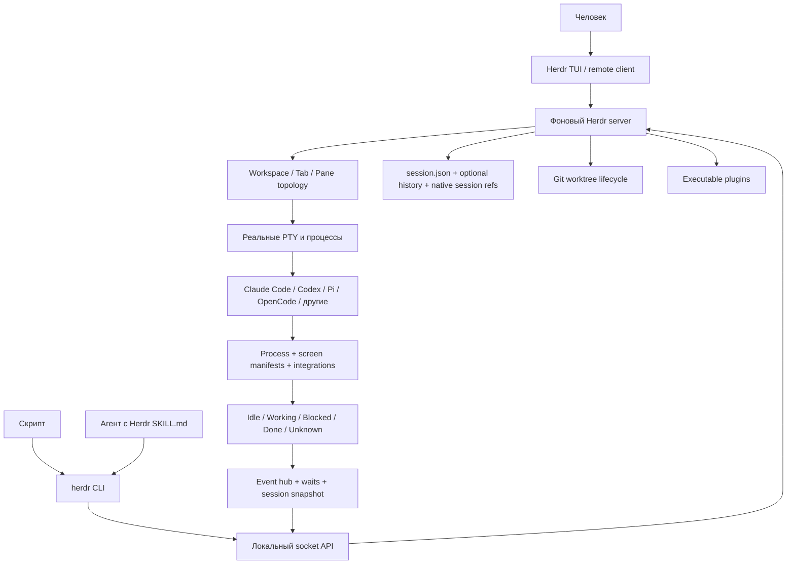

# Исследование: Herdr v0.8.0 — постоянная терминальная среда выполнения для агентов программирования

> **Проект:** [herdrdev/herdr](https://github.com/herdrdev/herdr/tree/v0.8.0) · [herdr.dev](https://herdr.dev/)
> **Дата анализа:** 2026-08-11
> **Язык:** Rust 2021
> **Лицензия:** Apache-2.0
> **Snapshot (снимок):** release (выпуск) `v0.8.0`, commit `346411fa21afd297f5ed3b3fa56f9e3fbf7654b7`, опубликован 2026-08-03
> **GitHub metadata (метаданные на дату анализа):** 27 071★, 1 902 forks (ответвления), 138 open issues (открытых вопросов), default branch (основная ветка) `master`
> **Аналитик:** Аналитик (Шерлок)

---

## Терминологическая пометка

- **Agent multiplexer (мультиплексор агентов)** — терминальный мультиплексор, который распознаёт процессы агентов и добавляет семантическое состояние поверх обычных терминалов.
- **Terminal agent runtime (терминальная среда выполнения агентов)** — постоянный сервер, владеющий PTY-процессами, разметкой терминалов и состоянием сеанса.
- **Control surface (управляющая поверхность)** — общий интерфейс командной строки и локального сокета для управления рабочими областями, панелями и агентами.
- **External agent CLI (внешний агент с командным интерфейсом)** — Claude Code, Codex, Pi, OpenCode или другой самостоятельный агент, который Herdr запускает внутри реального терминала, но не заменяет.
- **Lifecycle state (состояние жизненного цикла)** — `idle`, `working`, `blocked`, `done`, `unknown`.
- **Live handoff (передача живого сеанса)** — экспериментальная замена сервера с попыткой сохранить PTY и процессы.

## 1. Обзор и классификация

Herdr — **не агент программирования, не LLM SDK (комплект разработки) и не движок цепочек**. Он не вызывает модель, не выполняет собственный цикл `LLM → tool → observation` и не определяет последовательность ролей. Herdr предоставляет нижележащую постоянную терминальную среду для уже установленных агентов.

Выпуск `v0.8.0` описывает себя как terminal workspace manager (менеджер терминальных рабочих областей) и agent multiplexer (мультиплексор агентов). Основные обязанности:

1. держать реальные терминальные процессы в фоновом сервере;
2. отделять рабочие области, вкладки и панели;
3. распознавать внешних агентов и их состояние;
4. позволять человеку, скрипту или другому агенту запускать, опрашивать и читать агента;
5. восстанавливать форму сеанса и, когда возможно, нативно возобновлять разговор внешнего агента;
6. предоставлять управление через общий JSON-ориентированный интерфейс командной строки и локальный сокет.

### 1.1 Архитектура



Herdr разделяет три уровня управления:

| Уровень | Ответственность |
| --- | --- |
| **Layout (разметка)** | Создание `workspace`, `tab`, `pane`; расположение, фокус и перемещение терминалов. |
| **Pane (панель)** | Сырой терминал: команда, ввод, клавиши, чтение и ожидание текста. |
| **Agent (агент)** | Распознанный процесс: запуск, промпт, чтение, ожидание семантического состояния и нативное возобновление. |

Это удачное разделение: обычный сервер или тест не притворяется агентом, а агентные операции проверяют, что целевой процесс всё ещё владеет панелью.

### 1.2 Ключевые характеристики

| Характеристика | Herdr v0.8.0 |
| --- | --- |
| **Категория** | `terminal agent runtime / control surface` (терминальная среда выполнения и управляющая поверхность) |
| **Поставка** | Один бинарный файл Rust; macOS и Linux, Windows beta (предварительная поддержка) |
| **Модель выполнения** | Фоновый server (сервер) + один или несколько clients (клиентов) + реальные PTY |
| **Модель агентов** | BYO agent CLI (пользователь приносит агента): Herdr запускает и распознаёт внешний процесс |
| **Поддерживаемые виды запуска** | 21 канонический `--kind` в документации автоматизации; 19 агентов заявлены как проверенные/обнаруживаемые на продуктовой странице |
| **Состояния** | `idle`, `working`, `blocked`, `done`, `unknown` |
| **Управление** | CLI + локальный socket API (сокетный интерфейс), protocol 19, JSON Schema version 1, 90 методов в схеме выпуска |
| **Постоянство** | Живой detach/reattach; snapshot (снимок) разметки; опциональная история; нативное возобновление 16 агентов; экспериментальный live handoff |
| **Изоляция Git** | `worktree.list/create/open/remove` с provenance (происхождением) и событиями |
| **Расширение** | Исполняемые плагины, действия, события, панели, обработчики ссылок; без отдельного SDK |
| **Skill (навык)** | Поставляемый `skills/herdr/SKILL.md`; `herdr --skill` печатает согласованную с выпуском копию |
| **Лицензия** | Apache-2.0; в `v0.8.0` проект перелицензирован с AGPL-3.0-or-later |

## 2. Возможности оркестрации

| Возможность | Herdr v0.8.0 | Оценка |
| --- | --- | --- |
| **Chain / DAG (цепочка / граф)** | Нет декларативных шагов, зависимостей, условий или маршрутизации | ❌ |
| **Собственный agent loop (цикл агента)** | Нет; работу выполняет внешний агент | ❌ |
| **Multi-agent coordination (координация нескольких агентов)** | Один агент или скрипт может создать панели, запустить именованных агентов, отправить задания и ждать состояния | ✅ |
| **Parallel execution (параллельное выполнение)** | Несколько терминалов и агентов работают независимо; нет планировщика ресурсов или графа зависимостей | ⚠️ инфраструктурно |
| **Structured control (структурированное управление)** | Большинство управляющих команд возвращают JSON; есть схема запросов, ответов и событий | ✅ |
| **Structured result (структурированный результат агента)** | Нет; результат читается как терминальный текст, при потере истории предлагается файловый отчёт | ❌ |
| **State management (управление состоянием)** | Разметка и метаданные сеанса + состояние процессов + нативные ссылки возобновления | ✅ |
| **Retry/backoff (повтор/задержка)** | Нет универсальной политики повторов задания агента | ❌ |
| **Circuit breaker (автоматический выключатель)** | Нет | ❌ |
| **Quality gates (ворота качества)** | Можно запустить команду и ждать текст, но повторно используемого примитива ворот качества нет | ❌ |
| **Budget/cost (бюджет/стоимость)** | Нет; модель, токены и стоимость принадлежат внешнему агенту | ❌ |
| **Timeout (таймаут)** | Есть для запуска, промпта, ожидания состояния и текста; без явного значения многие ожидания бесконечны | ⚠️ |
| **Stall detection (обнаружение зависшего запроса)** | `agent_prompt_stalled`, если после отправки из нерабочего состояния за 5 секунд нет наблюдаемого перехода | ✅ узко |
| **Human-in-the-loop (человек в контуре)** | Herdr распознаёт экраны согласования как `blocked`, но не определяет политику разрешений | ⚠️ наблюдение |
| **Observability (наблюдаемость)** | Снимок сеанса, события, чтение панелей, `agent explain`, журнал сервера | ✅ оперативная |

Herdr предоставляет **примитивы координации**, а не готовый рабочий процесс. Семантику «реализация → ревью → исправление → проверка» должен задавать вызывающий скрипт, навык или человек.

## 3. Ключевые механизмы

### 3.1 Разделение панели и агента

`pane` существует независимо от агента. Команды панели управляют терминалом даже при смене процесса. Команды агента сначала разрешают текущего владельца панели и отклоняют действие, если распознанный агент больше не работает.

`agent start` не создаёт разметку: вызывающий код обязан сначала создать рабочую область, вкладку или разделить панель. Ответы создания содержат канонические идентификаторы, которые нужно читать из JSON, а не вычислять по позиции.

**Паттерн:** разделять physical execution slot (физическое место выполнения) и semantic worker (семантического исполнителя). Это снижает риск отправить агентный промпт тестовому процессу или заменившему агента shell (командной оболочке).

### 3.2 Полномочия источника состояния

Herdr определяет агента по foreground process (процессу переднего плана), затем выбирает один авторитетный источник состояния:

- полные lifecycle hooks (хуки жизненного цикла) или plugin (плагин), если интеграция сообщает весь цикл;
- screen manifest (манифест распознавания экрана), если полных хуков нет;
- внешний отчёт через socket API для пользовательских интеграций.

Смешивание двух источников для одного состояния намеренно исключено. `agent explain` показывает использованный манифест, совпавшее правило, видимые признаки и причину запасной классификации.

Ограничения существенны:

- неизвестный экран разрешения может временно стать `idle`, а не `blocked`;
- `unknown` означает только недостаток уверенности и не подтверждает успешное завершение;
- экранные правила зависят от интерфейса и версии внешнего агента;
- внешний `tmux` внутри панели скрывает вложенный процесс от Herdr.

**Паттерн:** состояние должно иметь `value + authority + evidence` (значение + источник полномочий + доказательство), а неопределённость должна быть отдельным состоянием, не эквивалентным успеху.

### 3.3 Событийное ожидание без подмены владельца

`agent.wait` принадлежит серверу и работает от событий. После разрешения цели ожидание фиксирует текущего владельца панели: новый агент в той же панели не может случайно удовлетворить старое ожидание.

`agent.prompt` может принять объект `wait` в том же запросе. Отправка промпта и начало ожидания выполняются атомарно, без гонки между двумя командами.

Защитные механизмы:

- `agent start` ждёт распознавания агента; стандартный предел — 30 секунд, допустимый диапазон — более 3 и не более 300 секунд;
- промпт из нерабочего состояния должен вызвать наблюдаемый переход за 5 секунд, иначе возвращается `agent_prompt_stalled`;
- обычное ожидание по умолчанию принимает `idle`, `done` или `blocked`;
- ошибки сервера печатаются как JSON и завершаются кодом 1, ошибки синтаксиса — кодом 2.

Однако ожидание отслеживает состояние агента, **не идентификатор конкретного хода**. Если агент уже работает, завершение прежнего хода может удовлетворить ожидание нового вызова. Для детерминированного исполнения цепочек этого недостаточно без собственного correlation id (идентификатора корреляции) и машинного результата.

### 3.4 Четыре разных пути сохранения

Herdr явно не смешивает постоянство процесса и восстановление интерфейса:

| Путь | Что сохраняется | Что теряется |
| --- | --- | --- |
| **Detach / reattach** | Исходные процессы, PTY, разметка, разговор | Ничего, пока сервер жив |
| **Snapshot restore (восстановление снимка)** | Рабочие области, вкладки, панели, каталоги, фокус | Исходные процессы; создаются новые оболочки |
| **Pane history replay (воспроизведение истории)** | Последний терминальный текст | Процесс и семантическое состояние; функция выключена по умолчанию |
| **Native agent resume (нативное возобновление агента)** | Разговор внешнего агента через его собственный session id/path | Произвольные процессы и неподдерживаемые агенты |
| **Live handoff** | По возможности PTY, процессы, агентные метаданные и состояние плагинов | Активные запросы, ожидания, подписки и сообщения между панелями могут прерваться |

Нативное возобновление в `v0.8.0` задокументировано для 16 агентов, включая Pi, OMP, Claude Code, Codex, Cursor Agent, OpenCode, Kilo Code и Hermes. Невалидная, устаревшая или повторяющаяся ссылка восстанавливается как обычная оболочка, а не угадывается.

**Паттерн:** разделять `process continuity`, `layout recovery`, `transcript recovery` и `conversation resume` (непрерывность процесса, восстановление разметки, текста и разговора). Одного поля `resumed=true` недостаточно.

### 3.5 Рабочие деревья Git как часть управляющего интерфейса

Методы `worktree.create/open/remove` связывают checkout (рабочую копию) с рабочей областью Herdr:

- создание возвращает `workspace`, `tab`, `root_pane` и `worktree`;
- существующая ветка открывается, отсутствующая создаётся от указанной базы или `HEAD`;
- удаление вызывает `git worktree remove`, но не удаляет ветку;
- события `worktree.created/opened/removed` синхронизируют внешние клиенты;
- записи рабочей области содержат provenance (происхождение) связанного рабочего дерева.

Это сильнее обычного shell-скрипта по наблюдаемости и слабее полноценного оркестратора по политике: Herdr не назначает роль, не определяет порядок ревью и не выбирает победившую ветку.

### 3.6 Навык, согласованный с версией среды

Поставляемый `SKILL.md` задаёт эксплуатационные инварианты:

1. использовать Herdr только при `HERDR_ENV=1`;
2. считать установленный бинарный файл источником истины для синтаксиса;
3. читать идентификаторы из JSON;
4. использовать `--current`, явный идентификатор или уникальное имя, а не текущий фокус другого клиента;
5. не красть фокус у пользователя для фоновой работы;
6. не закрывать ресурсы, которые агент не создавал;
7. после `blocked` или ошибки сначала читать состояние и вывод;
8. при недоступном полном тексте попросить агента записать Markdown-файл.

В `v0.8.0` появился `herdr --skill`: бинарный файл печатает копию навыка именно своего выпуска. Это снижает расхождение между документацией агента и фактическим протоколом.

Herdr сам не обнаруживает `AGENTS.md` и не внедряет роли. Навык устанавливается во внешний агент или добавляется в его инструкции. Значит, Herdr потребляет систему навыков агента-хоста, но не заменяет нашу модель `become-role` и файлов ролей.

### 3.7 Схема, события и плагины

Установленный Herdr может вывести полную JSON Schema (схему JSON) протокола. Схема `v0.8.0` содержит protocol 19, schema version 1 и 90 методов для сервера, сеанса, рабочих областей, рабочих деревьев, вкладок, панелей, агентов, событий, интеграций и плагинов.

`session.snapshot` даёт клиенту одноразовый полный снимок, после чего клиент должен подписаться на события. После переподключения или подозрения на пропущенные события снимок читается заново. Это классический `snapshot + event stream` (снимок + поток событий) для восстановления локальной проекции.

Плагины описываются `herdr-plugin.toml` и могут объявлять:

- build commands (команды сборки);
- startup hooks (хуки запуска);
- actions (действия);
- event hooks (обработчики событий);
- terminal panes (терминальные панели);
- link handlers (обработчики ссылок).

Отдельного ограниченного SDK нет: весь Herdr CLI является интерфейсом плагина. Это гибко, но расширяет доверенную поверхность.

### 3.8 Безопасность

Положительные механизмы:

- Unix-сокеты API и handoff ограничиваются правами владельца `0600`;
- временные каталоги SSH-моста создаются с правами `0700`;
- удалённое подключение использует обычную аутентификацию OpenSSH;
- история панелей выключена по умолчанию, потому что вывод может содержать токены, промпты и команды;
- `HERDR_ENV=1` защищает навык от управления чужим сфокусированным сеансом извне;
- значения клавиш и идентификаторы проверяются до записи в терминал.

Ограничения:

- процессы панелей работают с правами пользователя; песочницы и сетевой политики Herdr не предоставляет;
- плагины — обычный доверенный код с окружением пользователя и полным CLI; Herdr прямо не проверяет и не изолирует их;
- marketplace (каталог плагинов) — непроверяемый индекс GitHub-темы, а не курируемый реестр;
- Herdr наблюдает экран согласования внешнего агента, но не задаёт собственную политику разрешений;
- удалённые screen manifests (манифесты экрана) проверяются автоматически по умолчанию; проверку можно отключить, локальные правила имеют приоритет.

**Вывод по безопасности:** Herdr безопаснее самодельной записи клавиш по номеру панели, но не является песочницей или policy engine (движком политик). Для автономного CI его нужно окружать отдельными ограничениями.

## 4. Сравнение с task-orchestrator

| Критерий | Herdr v0.8.0 | task-orchestrator | Вывод |
| --- | --- | --- | --- |
| **Уровень** | Постоянная терминальная среда и управляющая поверхность | Движок многошаговых цепочек | Дополняющие уровни |
| **Исполнитель** | Любой распознанный интерактивный агент CLI | Pi/Codex через `AgentRunner` и JSONL | Herdr шире по UI-агентам; наш контракт строже |
| **Оркестрация** | Императивные create/start/prompt/wait/read | Static, dynamic, conditional YAML chains | Наш движок определяет процесс |
| **Роли и промпты** | Передаются вызывающим кодом или внешним агентом | Файлы ролей, `become-role`, системные промпты | Herdr не заменяет роли |
| **Результат** | Терминальный текст и состояние UI | Структурированный JSONL, DTO, exit codes (коды завершения) | Herdr недостаточен для машинного результата шага |
| **Постоянство процесса** | Сильная сторона: detach/reattach, native resume, handoff | Конечный subprocess (дочерний процесс) с журналом запуска | Herdr полезен для долгой интерактивной работы |
| **Состояние задания** | Состояние агента/панели, без идентификатора хода | Chain/step/round/session state и audit | Разные семантики |
| **Устойчивость** | Таймауты ожидания, узкий stall detector, восстановление сеанса | Retry/backoff, error classification, circuit breaker, fallback, liveness watcher | Наш слой существенно сильнее |
| **Качество** | Можно запускать проверки как команды | Quality-gate steps и `fix_iterations` | Не эквивалентно |
| **Бюджет** | Нет токенов, стоимости или времени цепочки | Budget (бюджет) цепочки/цикла и метрики | Herdr делегирует внешнему агенту |
| **Git isolation (изоляция Git)** | First-class worktree API (первоклассный интерфейс рабочих деревьев) | Отдельные навыки/процессы, нет общего API рабочих деревьев | Паттерн Herdr полезен |
| **Наблюдаемость** | Состояние живых UI, снимки, события, чтение терминала | JSONL audit, метрики, причины завершения, журналы `run-subagent` | Herdr лучше оперативно, мы лучше постфактум |
| **Безопасность** | Локальный сокет владельца; процессы и плагины не изолированы | Sandbox (песочница) зависит от runner; строгие правила проекта | Ни один слой сам по себе не решает всё |
| **Удалённая работа** | SSH attach (подключение), локальный тонкий клиент, телефон | Не является пользовательской поверхностью проекта | Herdr сильнее как рабочее место |
| **Зависимость** | Rust binary (бинарный файл) вне PHP/Symfony | Нативный проектовый runtime (среда проекта) | В core (ядро) не добавлять |

### 4.1 Где Herdr сильнее

- долгоживущие интерактивные агенты и терминальные процессы;
- единая топология нескольких рабочих областей, вкладок и панелей;
- состояние `blocked/done` и очередь внимания для человека;
- управление внешними агентами через один CLI/socket API;
- worktree lifecycle (жизненный цикл рабочих деревьев) и события;
- удалённое подключение и восстановление интерфейса;
- согласованный с выпуском навык оператора.

### 4.2 Где task-orchestrator сильнее

- декларативный и проверяемый рабочий процесс;
- роли, системные промпты и передача контекста между шагами;
- машинный результат исполнителя вместо чтения UI;
- повторные попытки, классификация ошибок, автоматический выключатель и fallback (запасной маршрут);
- бюджет, таймаут всей цепочки и метрики;
- ворота качества, условные ветви и итерации исправления;
- детерминированный JSONL audit trail (журнал аудита JSONL);
- слоистая архитектура и тестируемые доменные контракты.

### 4.3 Herdr и `run-subagent`

Herdr не является прямой заменой `docs/agents/skills/run-subagent/scripts/watch-subagent.sh`:

| Свойство | Herdr | `run-subagent` |
| --- | --- | --- |
| Процесс | Интерактивный и долгоживущий | Одноразовый `pi --mode json` / `codex exec --json` |
| Результат | Текст терминала + UI state | Финальное JSONL-событие и фильтры text/tools/files |
| Таймаут | На запуск/ожидание; часто необязателен | Обязательный soft + hard + stall с проверкой активности Linux |
| Постоянство | PTY, detach/reattach, native resume | Журнал и аварийный дамп, процесс завершается |
| Изоляция контекста | Терминал внешнего агента | `--ephemeral` / `--no-session` |
| Лучший сценарий | Человек наблюдает несколько долгих агентов | Автоматический конечный шаг с проверяемым завершением |

Рациональный вариант — не заменить одно другим, а рассматривать Herdr только как **опциональную рабочую среду ручной координации**. Любая будущая интеграция должна сохранять машинный контракт, обязательный таймаут и отдельный идентификатор задания.

## 5. Сравнение с ближайшими аналогами

### 5.1 Завершённые исследования

| Проект | Основной уровень | Главное отличие от Herdr |
| --- | --- | --- |
| **SwarmForge #29** | Роевой рабочий процесс на `tmux` + файлы handoff (передачи) + worktree по роли | SwarmForge задаёт топологию ролей и протокол передачи; Herdr даёт более общий терминальный substrate (субстрат), API и состояние UI без предписанного процесса |
| **Orca ADE #30** | Desktop/mobile ADE (рабочая среда) для fan-out (веерного запуска), сравнения и выбора ветки | Orca задаёт человеко-ориентированный сценарий «один промпт → N агентов → выбрать победителя»; Herdr предоставляет универсальные панели, события и worktree API без выбора победителя |
| **bx-dev #31** | Codex-skill workflow harness (контур рабочего процесса) | bx-dev задаёт Dev → review → commit → QA → Merger; Herdr запускает любые агенты, но не задаёт этапы, коммиты и критерии завершения |

Herdr занимает новый слой между обычным `tmux` и специализированным оркестратором: **agent-aware terminal runtime** (терминальная среда, понимающая агентов).

### 5.2 Незавершённые соседние исследования

`qm` #32 и `omnigent` #33 уже поставлены в эпик как платформы поверх внешних агентов, но их отдельные отчёты ещё не завершены. Поэтому подробное сравнение с ними сейчас было бы гипотезой. После их исследований стоит отдельно уточнить границу:

- Herdr — локальный терминальный runtime (среда выполнения), не multi-tenant SaaS (многопользовательская платформа);
- Herdr не предоставляет sandbox/policy/budget (песочницу, политики, бюджет);
- предполагаемое пересечение — унифицированное управление несколькими внешними агентами и постоянные сеансы.

## 6. Паттерны для заимствования

| Приоритет | Паттерн | Что адаптировать | Ограничение |
| --- | --- | --- | --- |
| 🟢 P2 | **State + authority + evidence** | Хранить не только состояние подчинённого агента, но источник и доказательство; `unknown` не считать успехом | Нельзя переносить screen scraping (разбор экрана) в core runner |
| 🟢 P2 | **Atomic submit-and-wait** | Объединить отправку задания и регистрацию ожидания; фиксировать исполнителя/run id до ожидания | Нужен correlation id конкретного задания, которого нет у Herdr |
| 🟢 P2 | **Prompt-stalled transition check** | После отправки требовать наблюдаемый переход состояния за короткое время | Это только ранний сигнал, не замена hard timeout |
| 🟡 P2–P3 | **Opaque IDs + caller context + ownership** | Непереиспользуемые идентификаторы, явная текущая цель, запрет удаления чужих ресурсов | Особенно полезно при будущих параллельных запусках |
| 🟡 P3 | **Worktree lifecycle API** | Create/open/remove без удаления ветки, provenance и события | Требует отдельной архитектурной задачи, не добавлять в skill случайно |
| 🟡 P3 | **Release-matched skill** | Команда, выдающая навык, согласованный с установленной версией CLI | Актуально для поставляемого PHAR и устанавливаемых skills |
| 🔵 R&D | **Snapshot + events resync** | Полный снимок + поток событий + повторный снимок после reconnect (переподключения) | Нужен только при появлении долгоживущего daemon/API (демона/интерфейса) |
| 🔵 R&D | **Layered resume semantics** | Раздельные признаки непрерывности процесса, восстановления состояния и возобновления разговора | Не сводить к одному `resume=true` |

### Не переносить

- экранное состояние как единственный авторитет завершения автоматической цепочки;
- бесконечные ожидания по умолчанию;
- плагины с полным окружением пользователя без отдельной модели доверия;
- терминальный текст как замену JSONL/DTO-контракту результата;
- Herdr как обязательную зависимость Symfony-приложения;
- автоматическое закрытие панелей, сеансов или рабочих деревьев без доказанного владения.

## 7. Вердикт

### 🟡 Заимствовать паттерны; 🔴 не использовать как основную зависимость; 🟢 рассматривать как опциональную ручную среду

| Решение | Вердикт | Обоснование |
| --- | --- | --- |
| **Использовать Herdr как core dependency (основную зависимость)** | 🔴 Нет | Другой стек и уровень; нет машинного результата шага, chain semantics (семантики цепочки), retry/CB/gates/budget |
| **Заменить `run-subagent`** | 🔴 Нет | Потеряется конечный JSONL-контракт, обязательные таймауты и изолированный одноразовый запуск |
| **Заимствовать координационные паттерны** | 🟡 Да | Состояние с источником, атомарное ожидание, владение ресурсом, worktree provenance, согласованный навык |
| **Использовать вручную рядом с проектом** | 🟢 Возможно | Удобно для долгих интерактивных агентов, удалённого наблюдения и нескольких терминалов |
| **Сделать экспериментальную интеграцию** | ⚪ Только отдельной задачей | Сначала нужен контракт correlation id, timeout, structured result и sandbox boundary |

Herdr подтверждает важное разделение ответственности:

```text
Herdr:              где живут и как наблюдаются интерактивные агенты
task-orchestrator:  в каком порядке они работают и как проверяется результат
```

Наиболее ценный вывод — не «перейти на Herdr», а усилить операционный контракт подчинённых агентов: явное владение, источник состояния, идентификатор запуска, атомарное ожидание и честная семантика восстановления.

## 8. Указатель источников

1. [Herdr v0.8.0 — release и release notes](https://github.com/herdrdev/herdr/releases/tag/v0.8.0) — версия, дата, перелицензирование, новые возможности и исправления.
2. [Agent automation v0.8.0](https://github.com/herdrdev/herdr/blob/v0.8.0/docs/next/website/src/content/docs/agent-automation.mdx) — примитивы, запуск, ожидание, состояния, чтение и рецепты координации.
3. [Session state v0.8.0](https://github.com/herdrdev/herdr/blob/v0.8.0/docs/next/website/src/content/docs/session-state.mdx) — detach, snapshot, history, native resume и live handoff.
4. [Socket API v0.8.0](https://github.com/herdrdev/herdr/blob/v0.8.0/docs/next/website/src/content/docs/socket-api.mdx) — методы, события, снимок, рабочие деревья и схема.
5. [Herdr SKILL.md v0.8.0](https://github.com/herdrdev/herdr/blob/v0.8.0/skills/herdr/SKILL.md) — инварианты безопасности и координации для агента.

Дополнительно сверены первичные файлы того же commit: `Cargo.toml`, `src/main.rs`, `src/agent_resume.rs`, `src/server/socket_paths.rs`, `src/api/schema.rs`, `docs/next/website/src/content/docs/agents.mdx` и `plugins.mdx`.

## 9. Ограничения анализа

- Herdr не устанавливался и не запускался: это анализ документации, API-схемы и исходников выпуска.
- Не проверялись точность экранного распознавания, нагрузка CPU/RAM и поведение удалённого соединения.
- Не проводился аудит безопасности; отмечены только документированные гарантии и очевидные границы доверия.
- GitHub-показатели изменяемы и приведены только на 2026-08-11; технические выводы привязаны к commit.
- Windows обозначен как beta (предварительная версия); вердикт основан прежде всего на Unix-поверхности.
- Сравнение с `qm` и `omnigent` отложено до завершения их собственных исследований.
