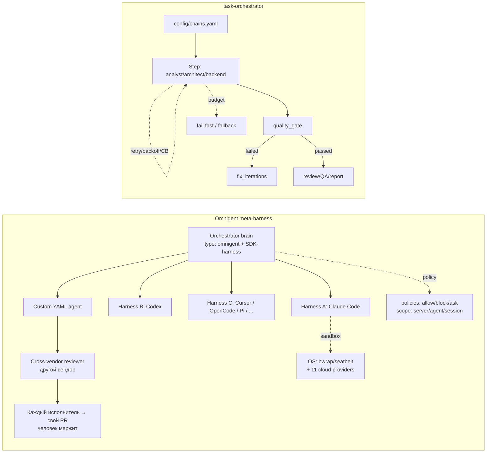

# Исследование: Omnigent — open-source meta-harness над внешними coding-агентами

> **Проект:** [github.com/omnigent-ai/omnigent](https://github.com/omnigent-ai/omnigent), [omnigent.ai](https://omnigent.ai), [PyPI](https://pypi.org/project/omnigent/)
> **Дата анализа:** 2026-08-14
> **Язык:** Python 3.12+ (менеджер пакетов `uv`)
> **Лицензия:** Apache-2.0 (GitHub metadata; классификатор PyPI: `License :: OSI Approved :: Apache Software License`)
> **PyPI:** `omnigent` `0.9.0` — *«Omnigent: declarative agent authoring and runtime framework»*; классификатор PyPI: **`Development Status :: 3 - Alpha`** (статус alpha подтверждён); `requires-python >=3.12`; автор пакета: Databricks, Inc.
> **Snapshot:** `main` `bee2b7518e7f98f227184903b61dd94086ea45f5` (`pushed_at`: 2026-08-14T03:01:29Z; commit: `feat(web): let bulk session delete clean up worktree branches (#4715)`, Daniel Lok). Ветка `main` опережает релиз PyPI: `pyproject.toml` на snapshot содержит `version = "0.10.0.dev0"`.
> **GitHub metadata:** 8 816★, 1 329 forks, 943 open issues, created 2026-06-11, default branch `main`, topics: `agent-framework`, `agent-governance`, `agent-orchestration`, `coding-agents`, `claude-code`, `codex`, `multi-agent`, `sandbox`, `python`
> **Аналитик:** Аналитик (Шерлок)

---

## Терминологическая пометка

Далее англоязычные термины используются в таких значениях:

- **meta-harness** — общий оркестрационный слой над внешними coding-агентами (харнесами): единый интерфейс, позволяющий менять или комбинировать агенты без переписывания.
- **harness** — связка «обёртка + среда выполнения» конкретного внешнего агента (Claude Code, Codex, Cursor, …).
- **native terminal wrapper** — нативная обёртка поверх tmux/PTY: оборачивает CLI внешнего агента в терминальной сессии с OS-sandbox.
- **SDK harness** — харнес, вызывающий не CLI, а программный SDK агента (Claude Agent SDK, OpenAI Agents SDK, Cursor SDK).
- **managed host** — облачная песочница, провизируемая сервером Omnigent на одну сессию (disposable, per-session).
- **policy** — декларативное правило (функция или CEL-выражение), проверяющее каждое действие агента: allow (разрешить) / block (заблокировать) / ask (приостановить для подтверждения человеком).
- **L7 egress proxy** — прокси исходящего трафика на уровне приложений (сетевой фильтр egress — исходящих соединений).
- **multi-agent supervision** — надзор одного агента над другим: ревью работы, разбиение задачи между агентами.
- **co-drive** — совместное управление: сообщения коллеги выполняются на вашей машине.
- **BYO (bring your own)** — модель «принеси свой» агент/подписку.
- **runner-/chain-level retry/backoff/CB** — повтор, задержка между повторами и circuit breaker (предохранитель отказов) на уровне запуска агента или всей цепочки.

---

## 1. Обзор проекта

Omnigent — **open-source meta-harness** (мета-харнес): общий оркестрационный слой над внешними coding-агентами (Claude Code, Codex, Cursor, OpenCode, Hermes, Pi) и агентами, написанными пользователем (декларативные YAML-определения). Суть продукта: единый интерфейс над харнесами — их можно менять и комбинировать без переписывания, поверх которого работают policies/governance (политики и управление), sandboxing (песочницы) и collaboration (совместная работа) с любого устройства — терминал, браузер, телефон, нативное desktop-приложение (macOS).

> ⚠️ **Классификация:** Omnigent — не LLM SDK (SDK для работы с LLM), не coding agent (кодинг-агент) и не server/CI-first chain engine (движок цепочек для CI). Это **open-source meta-harness / multi-device collaboration platform** (мета-харнес и платформа совместной работы с поддержкой множества устройств) поверх внешних coding-агентов. Архитектурная ценность — в **harness abstraction** (абстракции харнеса), **policies** (политиках), **cloud + OS sandboxing** (облачных и системных песочницах) и **multi-agent supervision** (надзоре нескольких агентов). **Статус: alpha** — API и поведение могут меняться.

### Архитектура

```text
┌─────────────────────────────────────────────────────────────────┐
│ Surfaces (поверхности)                                          │
│ • Terminal REPL (omnigent / omni)                                │
│ • Web UI (pnpm, localhost:6767 / deployed server)                │
│ • Native desktop app (macOS)                                     │
│ • Phone (LAN address или deployed server, mobile web UI)         │
└───────────────┬───────────────────────────────────┬─────────────┘
                │                                   │
                ▼                                   ▼
┌──────────────────────────────┐      ┌──────────────────────────┐
│ Server + API                 │      │ Harness abstraction       │
│ • sessions / projects        │      │ (meta-harness contract)   │
│ • accounts / auth / OIDC     │      │ swap/combine без rewrite │
│ • host registry / managed    │      └────────────┬─────────────┘
│   hosts (cloud sandboxes)    │                   │
│ • mcp_pool / permissions     │      ┌────────────▼─────────────┐
│ • collaboration (share/      │      │ Harness backends          │
│   co-drive/fork)             │      │ • native tmux/PTY:        │
└───────────────┬──────────────┘      │   claude/codex/cursor/    │
                │                     │   opencode/hermes/kiro/   │
                ▼                     │   pi/antigravity/kimi      │
┌──────────────────────────────┐      │ • SDK: claude-sdk / codex │
│ Policy engine                │      │   / cursor / agents-sdk / │
│ (spec + runtime)             │      │   copilot / antigravity   │
│ • function / CEL policies    │      └────────────┬─────────────┘
│ • scope: server/agent/session│                   │
│ • allow / block / ask        │      ┌────────────▼─────────────┐
│ • builtins: safety/cost/     │      │ Sandbox layer             │
│   routing/risk_score/…       │      │ • OS: bwrap(Linux) /      │
└──────────────────────────────┘      │   seatbelt(macOS) /       │
                                      │   Job Objects(Win) +      │
┌──────────────────────────────┐      │   L7 egress proxy         │
│ Custom agents (YAML)         │      │ • cloud providers (11):   │
│ (docs/AGENT_YAML_SPEC.md)    │      │   Modal/Daytona/Blaxel/   │
│ • executor + harness         │      │   E2B/CoreWeave/K8s/      │
│ • tools: function/mcp/agent  │      │   OpenShell/Boxlite/      │
│ • multi-agent supervision    │      │   Databricks/cwsandbox/   │
│   (Polly: 7 sub-agents,      │      │   Islo                    │
│    cross-vendor review)      │      └──────────────────────────┘
└──────────────────────────────┘
```

### Ключевые характеристики

| Характеристика | Значение |
| --- | --- |
| **Тип** | `meta-harness / multi-device collaboration platform` (мета-харнес и платформа совместной работы с разных устройств) |
| **Модель выполнения** | `harness abstraction`: один контракт над 12+ харнесами; orchestrator-«мозг» (`type: omnigent` executor + SDK-harness) делегирует работу внешним coding-агентам; multi-agent supervision через под-агентов в YAML |
| **Поддерживаемые харнесы** | Native (tmux/PTY + OS-sandbox): Claude Code, Codex, Cursor, OpenCode, Hermes, Kiro, Pi, Antigravity, Kimi. SDK: claude-sdk, codex, cursor, openai-agents (agents-sdk), copilot, antigravity. Дополнительно: OpenClaw (через ACP) |
| **Custom agents** | Декларативный YAML (`docs/AGENT_YAML_SPEC.md`): executor + harness, tools (function/mcp/agent), policies, `spawn`, `spec_version`; запуск `omnigent run <agent.yaml>` или каталог `examples/<name>/` |
| **Cloud sandbox providers** | 11: Modal, Daytona, Blaxel, Islo, E2B, CoreWeave, Kubernetes, OpenShell (NVIDIA), Boxlite, Databricks, cwsandbox — disposable, per-session managed hosts |
| **OS sandboxing** | `bwrap` (Linux, обязательно), `seatbelt` (macOS, встроенный), Job Objects (Windows, degraded — только process-tree, без FS/network изоляции) + L7 egress proxy |
| **Policies / governance** | Policy engine (spec + runtime): function/CEL, scope server/agent/session, действия allow/block/ask; builtins: safety (ask-before-shell, tool-call caps), cost (cost_budget с max_cost_usd + ask_thresholds), routing, risk_score, orchestration, github, google, prompt, working_dir, context |
| **Multi-agent supervision** | First-class: под-агенты в YAML (`type: agent`), cross-vendor review (дифф исполнителя ревьюит агент ДРУГОГО вендора), параллельные git worktrees, `spawn: true` (оркестратор создаёт child-сессии); пример Polly — 7 sub-agents |
| **State management** | Server-managed sessions/projects/accounts, host registry, managed hosts (cloud), git worktrees, per-session resources |
| **Multi-device surfaces** | Terminal REPL, web UI (:6767), native desktop (macOS), phone (mobile web UI через LAN/deployed server) |
| **Collaboration** | Share live session, co-drive (сообщения коллеги на вашей машине), fork conversation, multi-user accounts (invite-only), OIDC (Google/GitHub/Okta/Microsoft) |
| **Any-model** | API key, Claude/ChatGPT subscription (через `claude`/`codex` CLI), gateway (OpenAI-/Anthropic-compatible: OpenRouter, LiteLLM, Ollama, vLLM, Azure), Databricks workspace; defaults per agent |
| **MCP** | ✅ Custom-agent YAML: `tools: { type: mcp, url: ... }`; server `mcp_pool.py`; runner `mcp_manager.py` / `proxy_mcp_manager.py` |
| **Skill-конвенции** | Потребляет `.claude/skills/` + `AGENTS.md` (consumer); примеры содержат `skills/` (Polly); `.github/agents/*.yaml` — custom agent definitions (producer) |
| **Stack** | Python 3.12+ (`uv`), server (FastAPI-стиль), web UI (pnpm/Vite), native desktop (macOS); native terminal (tmux, node-pty/PTY); DB опции в deploy (PostgreSQL и др.) |
| **Зрелость** | **Alpha** (`Development Status :: 3 - Alpha` на PyPI); 28 релизов на PyPI (последний 0.9.0); 8 816★ за ~2 месяца (created 2026-06-11) |

---

## 2. Возможности оркестрации — обзор

| Функция | Omnigent |
| --- | --- |
| **Chain / DAG engine** | ❌ Нет декларативных YAML-chain steps уровня task-orchestrator; orchestrator-«мозг» (custom agent) сам решает, как делегировать — это agent-driven, не chain-driven |
| **Harness abstraction (meta-harness)** | ✅ First-class: один контракт над 12+ харнесами; swap/combine без переписывания; `--harness <name>`; `smart_routing_harness: auto` |
| **Multi-agent supervision** | ✅ First-class: под-агенты в YAML, cross-vendor review, параллельные worktrees, `spawn: true`; Polly — 7 sub-agents |
| **Custom agents (YAML)** | ✅ Декларативный YAML (`docs/AGENT_YAML_SPEC.md`): executor, harness, tools (function/mcp/agent), policies; агенты могут создавать агентов |
| **Policies / governance** | ✅ Policy engine: function/CEL, scope server/agent/session, allow/block/ask; spend caps, tool-call limits, ask-before-shell |
| **Cloud sandboxing** | ✅ 11 providers (Modal/Daytona/Blaxel/Islo/E2B/CoreWeave/K8s/OpenShell/Boxlite/Databricks/cwsandbox), disposable per-session managed hosts |
| **OS sandboxing** | ✅ bwrap (Linux) / seatbelt (macOS) / Job Objects (Windows) + L7 egress proxy; mandatory на Linux для native wrappers |
| **Collaboration** | ✅ Share session, co-drive, fork; multi-user accounts (invite-only), OIDC |
| **Multi-device** | ✅ Terminal / browser / phone / native desktop (macOS); сессии синхронизированы跨-устройств |
| **Quality gates** | ❌ Нет task-orchestrator-style chain-level deterministic gates (shell-проверок) как обязательного runtime primitive |
| **Retry / backoff** | ⚠️ Есть на **микроуровне** внутри agent loop: `runtime/llm_retry.py` (LLM-call retry с exponential backoff + error classification: ContextWindowExceeded/Permanent/Retryable), `runtime/tool_retry.py` (tool-call retry + timeout). **Нет chain-/runner-level retry** для шагов оркестрации |
| **Circuit breaker** | ❌ Нет аналога `CircuitBreakerAgentRunnerService` на уровне chain/runner |
| **Budget control** | ⚠️ На уровне platform/policy: `cost.cost_budget` policy (max_cost_usd + ask_thresholds_usd) per session/agent/server — это policy-enforced spend cap, не chain-step budget |
| **`fix_iterations`** | ❌ Нет bounded implement/review/fix loop уровня task-orchestrator |
| **JSONL audit trail** | ❌ Не заявлен chain-level JSONL audit trail уровня task-orchestrator; state хранится в server/session records |
| **CI/server-first execution** | ⚠️ Есть `omnigent server` + deploy (Docker/Render/Railway/Fly/Modal/Cloudflare), но продукт — multi-device collaboration-платформа, не Symfony CLI/CI-first chain-оркестратор |
| **Extensibility** | ✅ Custom YAML agents, 12+ harness backends, policies (function/CEL/builtins), MCP, cloud/OS sandbox providers, installable examples, `.claude/skills` + `AGENTS.md` |
| **DDD / Clean Architecture** | ⚠️ Модульная структура (24 каталога в `omnigent/`: entities, policies, runner, runtime, sandbox, server, terminals, tools…), но без формальных Domain/Application/Infrastructure-слоёв DDD |

---

## 3. Ключевые механизмы

### 3.1 🟡 Meta-harness abstraction (главная архитектурная ценность)

**Что у них:** README определяет продукт как «the open-source meta-harness for all your AI agents» — единый оркестрационный слой над внешними coding-агентами. Харнесы делятся на два семейства:

- **Native terminal wrappers** (tmux/PTY + OS-sandbox): `claude-native`, `codex-native`, `cursor-native`, `opencode-native`, `hermes-native`, `kiro-native`, `pi`-native, `antigravity-native`, `kimi`. Каждый оборачивает CLI внешнего агента в терминальной сессии (на Linux — обязательно в `bwrap` OS-sandbox). Файлы-бэкенды: `claude_native*.py`, `codex_native*.py`, `cursor_native*.py`, …, `terminals/control_bridge.py`, `terminals/pane_reaper.py`.
- **SDK harnesses**: `claude-sdk` (Claude Agent SDK), `codex`, `cursor`, `openai-agents` (agents-sdk), `copilot`, `antigravity`. Программный вызов SDK, не CLI-обёртка.

Контракт фиксируется в каталоге `omnigent/runtime/harnesses/` (`_executor_adapter.py`, `_runner.py`, `_scaffold.py`, `process_manager.py`) и `omnigent/runner/` (`routing.py`, `subagent_routing.py`, `tool_dispatch.py`, `turn_routing.py`). Менять харнес можно одной опцией: `omnigent run examples/polly/ --harness <harness>`, а orchestrator поддерживает `smart_routing_harness: auto` (маршрутизация «мозга» к доступному провайдеру).

**Оркестрационная значимость:** meta-harness абстрагирует разницу между агентами за единым интерфейсом — Claude Code, Codex, Cursor, OpenCode, Hermes, Pi, Antigravity, Kimi и custom YAML-агенты互换яемы. Это **control surface** (управляющая поверхность) над агентами: omnigent не становится модельным провайдером, а запускает внешние CLI/SDK с подпиской пользователя.

**Сравнение с task-orchestrator:** наш `AgentRunnerInterface` + `config/chains.yaml` похожи по идее (runner — внешняя команда/профиль). Но у нас runner встроен в **автоматизированную chain execution** с retry/CB/gates/budget, а у omnigent — в интерактивную multi-device collaboration-среду. Meta-harness abstraction — самый релевантный паттерн для нашего coding-agents-эпика и runner-модели: единый интерфейс над теми же агентами (Claude Code/Codex/Cursor/Pi/OpenCode).

### 3.2 🟡 Custom agents в YAML (богатая параллель ролям/`config/chains.yaml`)

**Что у них:** Агент — короткий YAML-файл (`docs/AGENT_YAML_SPEC.md`). Схема:

```yaml
spec_version: 1
name: my_agent
prompt: You are a helpful data analyst.

executor:
  type: omnigent          # или конкретный harness-тип
  harness: claude-sdk     # claude-native | codex | codex-native | cursor |
                           # cursor-native | hermes | opencode | pi | openai-agents | kimi | …
  config:
    smart_routing_harness: auto
  context_window: 1000000

spawn: true               # оркестратор может создавать child-сессии

tools:
  word_count:             # локальная Python-функция (схема auto-generated из сигнатуры)
    type: function
    callable: mypackage.mymodule.word_count
  docs:                   # MCP-сервер (локальная команда или remote URL)
    type: mcp
    url: https://example.com/mcp
  researcher:             # под-агент, которому супервизор может делегировать
    type: agent
    prompt: Search for relevant information and summarize it.
    tools:
      word_count: inherit
```

Запуск: `omnigent run path/to/my_agent.yaml` (или каталог `examples/<name>/`). Характеристика `handles_tools_internally` (как у Kimi) означает, что харнес владеет собственными tool'ами и не нуждается во внедрении `os_env`-блоков. Примеры: Polly (multi-agent coding orchestrator), Debby (двухголовый brainstorming), Deep Research, а также `.github/agents/*.yaml` (6 agent definitions: doc-classifier, doc-drafter, feature-blog-drafter/scout, release-notes-drafter, release-post-formatter).

**Оркестрационная значимость:** YAML-определение агента — это декларативный контракт «промпт + инструменты + под-агенты + политики». Поддержка `type: agent` (под-агент с наследованием tools) и `spawn: true` (динамическое создание child-сессий) делает multi-agent supervision first-class. Это близко к нашим ролям + `config/chains.yaml`, но target другой: omnigent определяет **агента** (с его toolset и под-агентами), а мы — **цепочку шагов** (с retry/gates/budget).

**Сравнение с task-orchestrator:** `config/chains.yaml` задаёт chains, roles, retry_policy, budget, fix_iterations. Custom-agent YAML задаёт executor + harness + tools + sub-agents + policies. Полезна идея **декларативного агента с toolset-inheritance для под-агентов** — отображается на наш `run-subagent`/`task-via-subagents`.

### 3.3 🟡 Policies / governance (релевантно quality gates / budget)

**Что у них:** Policies (политики) решают, что агенту разрешено: запуск shell-команд, редактирование файлов, трата токенов. Они проверяют каждое действие и разрешают, блокируют или приостанавливают для подтверждения (allow / block / ask). Архитектура policy engine:

- **Spec-уровень** (`omnigent/policies/`): `base.py`, `function.py`, `registry.py`, `schema.py`, `types.py`. Типы политик: `function` (handler + factory_params) и `cel` (CEL-выражения).
- **Runtime-уровень** (`omnigent/runtime/policies/`): `engine.py`, `enforcement.py`, `approval.py`, `builder.py`.
- **Runtime-типы** (`policies/types.py`): `EvaluationContext` (phase + content + resolved tool_name), `PolicyResult`, `ElicitationRequest` (запрос ASK, отображаемый как MCP-style elicitation).
- **Builtins** (`policies/builtins/`): `safety` (`ask_on_os_tools` — спросить перед shell/file-writes; `max_tool_calls_per_session` — лимит tool-вызовов), `cost` (`cost_budget` с `max_cost_usd` + `ask_thresholds_usd` — hard spend cap с soft-предупреждением), `routing`, `risk_score`, `orchestration`, `github`, `google`, `prompt`, `working_dir`, `context`, `_shell`.
- **Scope:** три уровня — **server-wide** (админ), **per-agent** (разработчик), **per-session** (пользователь); более строгие session-правила проверяются первыми. Определяются в server config или в YAML агента.
- Документация: `docs/POLICIES.md` (полный каталог и trust model).

Пример YAML:

```yaml
policies:
  approve_shell:
    type: function
    handler: omnigent.policies.builtins.safety.ask_on_os_tools   # спросить перед shell / file writes
  budget:
    type: function
    handler: omnigent.policies.builtins.cost.cost_budget
    factory_params:
      max_cost_usd: 5.00           # hard spend cap…
      ask_thresholds_usd: [3.00]   # …с soft warning на пути
```

**Оркестрационная значимость:** Policy engine — это гранулярный HITL/governance-механизм: декларативные правила, composeable, с явной трёхуровневой моделью scope и тремя действиями (allow/block/ask). Это **дополняет**, но не заменяет наши deterministic quality gates: omnigent-политики — про «разрешить/запретить/спросить» для отдельных действий агента, наши gates — про «обязательно проверить результат shell-командой».

**Сравнение с task-orchestrator:** у нас есть quality gates (shell-проверки качества) и budget control на уровне chain/step. Omnigent-модель интересна **гранулярным scope** (server/agent/session) и **approval-gates** (ask-before-risky-action) — это можно адаптировать как policy-слой поверх chain execution. Но важно: spend caps у omnigent — это platform/policy-level enforcement, а не chain-step budget.

### 3.4 🟡 Cloud + OS sandboxing (релевантно `TASK-feat-docker-sandboxing`)

**Что у них:** Два слоя песочниц:

- **Cloud sandbox providers (11):** Modal, Daytona, Blaxel, Islo, E2B, CoreWeave, Kubernetes, OpenShell (NVIDIA), Boxlite, Databricks, cwsandbox. Запускаются из CLI (`--extra <provider>`) или провизируются сервером на сессию как **managed hosts** (disposable, per-session) — ноутбук не должен оставаться онлайн. Устанавливаются как PyPI-extras (`omnigent[modal]`, `omnigent[e2b]`, …).
- **OS-sandboxing:** `bwrap`/bubblewrap (Linux, **обязательно** для native wrappers и `pi`-harness — без него терминалы не стартуют), `seatbelt` (macOS, встроенный, ничего дополнительно не нужно), Job Objects (Windows, degraded — содержит process-tree и resource limits, но **без** FS/network изоляции). Поверх — L7 egress proxy (сетевой фильтр исходящих соединений).
- Файлы: `omnigent/sandbox/bwrap.py`, `omnigent/sandbox/seatbelt.py`. Windows описан в README (Job Objects).

**Оркестрационная значимость:** Это самая богатая sandboxing-модель из исследованных: 11 cloud providers (plug-and-play через extras) + OS-level (bwrap/seatbelt/Job Objects) + сетевой egress-контроль. Cloud sandboxes — disposable per-session, что естественно для multi-device collaboration (сессия живёт в облаке, а не на ноутбуке).

**Сравнение с task-orchestrator:** у нас sandboxing — открытая задача (`TASK-feat-docker-sandboxing`). Omnigent даёт готовую таксономию провайдеров (cloud) и OS-level изоляцию. Однако 11 cloud providers + multi-device collaboration-модель для single-tenant CLI-оркестратора избыточны. Переносима идея **plug-and-play sandbox provider interface** и **OS-level sandbox с egress-контролем**.

### 3.5 🟡 Multi-agent supervision (релевантно review / сабагентам)

**Что у них:** Multi-agent supervision — first-class capability. Пример Polly (`examples/polly/config.yaml`) — multi-agent coding orchestrator, который **не пишет код сам**:

- **Оркестратор-«мозг»** (Claude Agent SDK, `executor: { type: omnigent, harness: claude-sdk }`) планирует и делегирует.
- **7 под-агентов:** `claude_code` (claude-native), `codex` (codex-native), `opencode` (opencode-native), `cursor` (cursor-native), `hermes` (hermes-native), `agy` (antigravity-native), `pi` (headless, review/explore-специалист). Каждый работает в собственном терминале.
- **Cross-vendor review:** дифф любого исполнителя ревьюит агент **ДРУГОГО** вендора (дополнительные вендоры расширяют возможности перекрёстной проверки).
- **Roster preflight:** перед делегированием — проверка доступности CLI на PATH (`command -v claude codex opencode cursor-agent hermes pi agy`); маршрутизация только к найденным.
- **PR-centric delivery:** каждый исполнитель открывает **собственный PR**; человек мержит, оркестратор никогда не мержит сам.
- `spawn: true` — оркестратор может создавать child-сессии и авторить custom agent configs. `smart_routing_harness: auto` — маршрутизация «мозга» к доступному провайдеру.
- Под-агенты (`type: agent` в YAML) наследуют tools (`inherit`).

**Оркестрационная значимость:** Polly — готовый образец **tech-lead-оркестратора**, параллельного нашему `task-via-subagents`/`epic-via-subagents`: разбиение задачи → делегирование → независимый cross-vendor review → PR-centric delivery. Roster preflight (проверка доступности runner'ов до dispatch) и cross-vendor review (исполнитель ≠ ревьюер по вендору) — конкретные переносимые паттерны.

**Сравнение с task-orchestrator:** у нас `run-subagent`/`task-via-subagents` делегируют сабагентам, и есть review в цепочках. Polly дополняет: **roster preflight** (проверить runner до запуска), **cross-vendor review** (ревьюер из другого вендора, чем исполнитель), **PR-centric delivery** (каждый исполнитель — свой PR, человек мержит).

### 3.6 🟢 Multi-device surfaces + collaboration — сильная product surface, не runtime dependency

**Surfaces:** терминал (REPL `omnigent`/`omni`), web UI (localhost:6767 или deployed server), native desktop (macOS app с OS-уведомлениями), phone (mobile web UI через LAN-адрес или deployed server). Сессии синхронизированы跨-устройств: сообщения, под-агенты, терминалы и файлы — in sync.

**Collaboration:** share live session (коллеги смотрят работу агента и общаются с ним), leave session, co-drive (коллега co-attach'ится; его сообщения выполняются на **вашей** машине), fork conversation (клонирование диалога на свою машину). Multi-user accounts управляются env-переменной `OMNIGENT_AUTH_ENABLED=1`; invite-only signup; OIDC (Google/GitHub/Okta/Microsoft) через `OMNIGENT_OIDC_ISSUER`.

**Server/deploy:** `omnigent server` + `docker compose up`, Render/Railway (one-click), Fly.io, Hugging Face Spaces, Modal, Cloudflare (serverless, scale-to-zero), Databricks Apps. Tailscale (private) / Cloudflare tunnel (public) достучаться до сервера на ноутбуке без deploy.

**Сравнение с task-orchestrator:** Это сильная product surface, но принципиально не core pattern для PHP/Symfony CLI library. Для нас переносимы только концепции **live run observability** и **collaboration (share/co-drive)** — но в single-tenant chain-оркестрации они избыточны. Phone/desktop/native apps — out of scope.

### 3.7 🟡 Any-model + skill-конвенции (consumer + producer)

**Any-model:** API key (Anthropic, OpenAI), Claude/ChatGPT subscription (через `claude`/`codex` CLI), gateway (любой OpenAI-/Anthropic-compatible `base_url`: OpenRouter, LiteLLM, Ollama, vLLM, Azure), Databricks workspace (`databricks` extra). Defaults — per agent (`omnigent setup`). Переключение модели mid-session через `/model`.

**Skill-конвенции:** Omnigent — и **consumer** (потребляет `.claude/skills/` + `AGENTS.md` — те же конвенции, что у нас), и **producer** (определяет custom-агентов в YAML: `.github/agents/*.yaml`, `examples/*/`). Репозиторий содержит собственные `AGENTS.md`, `CLAUDE.md`, `.claude/`. Примеры содержат `skills/` (Polly: `examples/polly/skills/`).

**Сравнение с task-orchestrator:** наш `AGENTS.md` + role files + `docs/agents/skills/` + `become-role` — аналогичная meta-agent layer. Полезно наблюдение: omnigent сочетает потребление skill-конвенций (`.claude/skills`/`AGENTS.md`) с собственным agent-definition-format (YAML) — то есть **consumer skills + producer agent-definitions в одном продукте**.

---

## 4. Сравнение с task-orchestrator

| Критерий | Omnigent | task-orchestrator | Вывод |
| --- | --- | --- | --- |
| **Orchestration model** | Meta-harness: единый контракт над 12+ харнесами; orchestrator-«мозг» (agent-driven) делегирует внешним агентам; multi-agent supervision через под-агентов | YAML chains (`config/chains.yaml`), static/dynamic chain execution, `DynamicLoop`, `run-subagent`/`task-via-subagents` | Omnigent — agent-driven делегирование; мы — deterministic chain execution |
| **State management** | Server-managed sessions/projects/accounts, host registry, managed hosts (cloud), git worktrees | Chain context/payload, JSONL audit trail, task files, Git branch под контролем оркестратора | Server-managed + cloud managed hosts полезны концептуально; app/state не переносить |
| **Error handling** | Микроуровень: `runtime/llm_retry.py` (LLM-call retry + exponential backoff + error classification: ContextWindow/Permanent/Retryable), `runtime/tool_retry.py` (tool-call retry + timeout). **Нет chain-/runner-level retry/CB/gates/budget/fix_iterations** | Retry с backoff, circuit breaker, fallback routing, quality gates, budget control, `fix_iterations` | Наш resilience stack существенно сильнее на chain-уровне; omnigent-cb/retry — только внутри agent loop |
| **Extensibility** | Custom YAML agents, 12+ harness backends (native + SDK), policies (function/CEL/builtins), 11 cloud + OS sandbox providers, MCP, installable examples | Role files, skills, runner configs, Symfony DI, DDD modules | Заимствовать harness abstraction, custom-agent YAML, policy engine, sandbox provider interface |
| **Applicability** | Python multi-device collaboration-платформа (alpha) поверх внешних coding-агентов | PHP/Symfony CLI/library, single-tenant chain-оркестрация | Комплементарные уровни; прямой перенос Python/web/desktop невозможен |

### 4.1 Где Omnigent сильнее

- **Harness abstraction:** единый интерфейс над 12+ харнесами (native tmux/PTY + SDK) + custom YAML — самый широкий охват coding-агентов в исследовании.
- **Sandboxing:** 11 cloud providers + OS-level (bwrap/seatbelt/Job Objects) + L7 egress proxy — самая богатая sandboxing-модель из исследованных.
- **Policies/governance:** гранулярный policy engine с трёхуровневым scope (server/agent/session), действиями allow/block/ask, spend caps и tool-call limits.
- **Multi-agent supervision:** first-class cross-vendor review, roster preflight, PR-centric delivery (Polly).
- **Multi-device + collaboration:** sessions синхронизированы跨-устройств; share/co-drive/fork; native desktop + phone.
- **Any-model:** API key + subscription + gateway + Databricks; per-agent defaults.

### 4.2 Где task-orchestrator сильнее

- **Automatic resilience на chain-уровне:** retry с backoff, `CircuitBreakerAgentRunnerService`, fallback routing — omnigent имеет retry только на микроуровне (LLM/tool-call), не chain/runner.
- **Quality gates:** deterministic shell-проверки качества в цепочках.
- **Budget control на chain/step-уровне:** у omnigent — только platform/policy-level spend cap.
- **`fix_iterations`:** bounded implement/review/fix loops.
- **JSONL audit trail:** chain-level machine-readable trace.
- **Clean Architecture / DDD:** PHP/Symfony модули с Domain/Application/Infrastructure boundaries; omnigent — модульный, но без формальных DDD-слоёв.
- **CI/server-first posture + single-tenant:** CLI/library execution как primary, не desktop/collaboration UI.
- **Зрелость:** task-orchestrator — стабильный; omnigent — **alpha** (API/поведение могут меняться).

### 4.3 Mermaid-сопоставление



---

## 5. Сравнение с ближайшими аналогами

| Критерий | Omnigent (#33) | qm (#32, ближайший аналог) | Orca ADE (#30) | OmO (#23) | bx-dev (#31) |
| --- | --- | --- | --- | --- | --- |
| **Тип** | Open-source meta-harness / multi-device collaboration platform | Multiplayer/multi-tenant agent-платформа-оркестратор над внешними харнесами | Open-source desktop/mobile ADE | OpenCode plugin (multi-agent) | Codex-skill / manual workflow harness |
| **Язык** | Python 3.12+ | TypeScript/Node | TypeScript + Electron | TypeScript (Bun) | Markdown + Python |
| **Harness-покрытие** | 12+ (native + SDK: Claude/Codex/Cursor/OpenCode/Hermes/Kiro/Pi/Antigravity/Kimi/custom YAML) | Pi/OpenCode/Codex/Claude Code (interface-backed субстраты) | Any CLI agent (BYO) | Built-in + custom (через OpenCode) | Codex (single-shot subagents) |
| **Sandboxing** | OS (bwrap/seatbelt/Job Objects) + 11 cloud providers + L7 egress | Per-scope durable sandbox | `git worktree` per task | — (делегировано OpenCode) | session branch от `origin/dev` |
| **Policies / governance** | Policy engine: function/CEL, scope server/agent/session, allow/block/ask, spend caps + tool limits | Security postures Strict/Auto/Dangerous + command policy | manual recovery/rerun; experimental dispatch-level retry | IntentGate + Discipline Agents + per-role permissions | strict flags + scout-plan gate + MERGE-PROTOCOL |
| **Multi-tenancy / collaboration** | Multi-user accounts (invite-only) + OIDC + share/co-drive/fork | Multi-tenant: per-employee scopes, Slack+web, org-governance | Human-in-the-loop desktop/mobile; experimental orchestration messages | Team Mode: Lead + 8 members, shared mailbox | Single-session `.bx-dev/` state |
| **Multi-device** | ✅ Terminal/browser/phone/native desktop (macOS) | Slack + web | ✅ Desktop + mobile companion | — (TUI/desktop) | — (CLI) |
| **Multi-agent supervision** | ✅ First-class: cross-vendor review, roster preflight, PR-centric (Polly) | ✅ platform-level | ✅ parallel fan-out + worker_done | ✅ Team Mode | single-shot subagents |
| **Resilience** | Микроуровень (LLM/tool-call retry+backoff+classification); нет chain-level CB/gates/budget/fix_iterations | platform-level governance | manual + experimental dispatch retry/circuit-break (3 failures) | runtime fallback + doom loop detection | fail-fast + bounded review + merge rollback |
| **Зрелость** | **Alpha** (PyPI 0.9.0, ≈2 месяца) | MIT, ≈8.8k★ | MIT, ≈15.3k★ | SUL-1.0 | Markdown skill |
| **Applicability to us** | Pattern source: harness abstraction, policies, sandboxing, supervision | Pattern source: multi-tenant governance, scopes, deployment-контракт | Pattern source: fan-out/worktree UX | Pattern source: IntentGate, proactive context | Pattern source: session/flags/merge-governance |

**Дельта omnigent vs qm (оба — meta-harness над внешними агентами):**

- **omnigent шире по harness-покрытию:** 12+ харнесов (native tmux/PTY для Claude/Codex/Cursor/OpenCode/Hermes/Kiro/Pi/Antigravity/Kimi + SDK-harnesses claude-sdk/codex/cursor/agents-sdk/copilot + custom YAML), тогда как qm — Pi/OpenCode/Codex/Claude Code через interface-backed субстраты.
- **omnigent богаче по sandboxing:** OS-level (bwrap/seatbelt/Job Objects + L7 egress) + 11 cloud providers, тогда как qm — per-scope durable sandbox.
- **omnigent богаче по policies:** гранулярный policy engine (function/CEL, server/agent/session, spend caps + tool limits + ask-before-risky), тогда как qm — security postures + command policy.
- **omnigent — native multi-device:** terminal/browser/phone/desktop (macOS) с跨-device синхронизацией сессий.
- **qm сильнее в multi-tenant/team/org-governance:** per-employee scopes, Slack+web, shared skills с org-governance, deployment-directory контракт + `qm` CLI. omnigent — collaboration (share/co-drive/fork), но слабее в enterprise multi-tenant/org-структурах.

**Вывод по аналогам:** omnigent — ближайший аналог qm (#32): оба — open-source meta-harness над внешними coding-агентами. omnigent шире по охвату харнесов и sandboxing и богаче по policy-engine, но alpha-статус и фокус на multi-device collaboration (а не multi-tenant team/org-governance, где силён qm). Orca ADE (#30) — параллельная ручная оркестрация (fan-out/worktree), OmO (#23) — plugin-уровень (IntentGate/Team Mode), bx-dev (#31) — Codex-specific single-shot workflow. Все четыре — не chain engine с resilience-primitives уровня task-orchestrator.

---

## 6. Сводка по заимствованию

| Возможность | Статус для task-orchestrator | Описание |
| --- | --- | --- |
| Meta-harness abstraction (единый интерфейс над харнесами) | 🟡 P2 | Pattern для coding-agents-эпика и runner-модели: единый контракт над Claude Code/Codex/Cursor/Pi/OpenCode + custom; swap/combine без переписывания. Реализовать как runner-abstraction, не как Python dependency |
| Custom-agent YAML с toolset-inheritance | 🟡 P2 | Декларативное определение агента (executor + harness + tools + sub-agents); `type: agent` с `tools: inherit` — модель для `run-subagent` |
| Policy engine с гранулярным scope | 🟡 P2/P3 | function/CEL-политики, scope server/agent/session, действия allow/block/ask; spend caps + tool-call limits + ask-before-risky — policy-слой поверх chain execution |
| Cloud sandbox provider interface | 🟡 P3 | Plug-and-play таксономия cloud-провайдеров (через extras) для `TASK-feat-docker-sandboxing`; 11 providers — референс, не все нужны |
| OS-level sandbox + L7 egress | 🟡 P2/P3 | bwrap/seatbelt + egress-proxy для автономного выполнения; релевантно `TASK-feat-docker-sandboxing` |
| Multi-agent supervision (cross-vendor review) | 🟡 P2 | Roster preflight (проверка runner до dispatch) + cross-vendor review (ревьюер ≠ исполнитель по вендору) + PR-centric delivery — усилить `task-via-subagents`/review |
| Roster preflight before dispatch | 🟡 P2 | Проверка доступности runner'ов до делегирования (как Polly: `command -v …` для каждого CLI) |
| Spend cap policy (max_cost + ask_thresholds) | 🟡 P3 | Дополнение к нашему budget: soft-warning thresholds перед hard stop |
| Live run observability / collaboration concept | 🟡 P3 | Идея dashboard/уведомлений для long-running chains; share/co-drive — не переносить (single-tenant) |
| Multi-device / native desktop / phone | 🟢 — | Do not port; outside PHP/Symfony CLI scope |
| Runtime dependency | 🔴 — | Do not depend on Omnigent: Python, alpha, multi-device collaboration-платформа, не single-tenant chain-оркестрация |

### Concrete patterns (7) для возможного заимствования

1. **Meta-harness abstraction (P2):** единый интерфейс (harness contract) над Claude Code/Codex/Cursor/Pi/OpenCode + custom runners; swap/combine через одну опцию; `smart_routing` к доступному провайдеру. Мост к coding-agents-эпику и `AgentRunnerInterface`.
2. **Custom-agent YAML с sub-agent toolset-inheritance (P2):** декларативное определение агента (executor + harness + tools + policies); под-агенты (`type: agent`) наследуют tools (`inherit`) — модель для `run-subagent`/ролей.
3. **Policy engine: гранулярный scope + allow/block/ask (P2/P3):** function/CEL-политики, трёхуровневый scope (server/agent/session), approval-gates (ask-before-risky) — policy-слой поверх chain execution.
4. **Cross-vendor review + roster preflight (P2):** ревьюер из ДРУГОГО вендора, чем исполнитель; preflight-проверка доступности CLI/runner'ов до dispatch (Polly).
5. **Spend cap policy с thresholds (P3):** `max_cost_usd` (hard stop) + `ask_thresholds_usd` (soft warnings) — дополнение к BudgetVo.
6. **OS-level sandbox + L7 egress proxy (P2/P3):** bwrap/seatbelt + сетевой egress-контроль для автономного выполнения — релевантно `TASK-feat-docker-sandboxing`.
7. **Cloud sandbox provider interface (P3):** plug-and-play таксономия провайдеров через конфиг/extras — референс архитектуры (не все 11 нужны для single-tenant).

---

## 7. Вердикт

**Предварительный verdict:** 🟡 **заимствовать отдельные паттерны**, 🔴 **не использовать как dependency**.

**Почему заимствовать:** Omnigent валидирует (подтверждает) мощный паттерн — **meta-harness abstraction** над внешними coding-агентами с единым контрактом, поверх которого работают policies, sandboxing и multi-agent supervision. Его harness abstraction (12+ харнесов + custom YAML), гранулярный policy engine (server/agent/session, allow/block/ask, spend caps), самая богатая sandboxing-модель (11 cloud + OS-level + egress) и cross-vendor multi-agent supervision (Polly) — релевантное вдохновение для coding-agents-эпика, runner-абстракции, `task-via-subagents`/review и `TASK-feat-docker-sandboxing`.

**Почему не dependency:**

- **Стек-мISMATCH:** Python 3.12+ (`uv`) + server + web UI (pnpm) + native desktop (macOS) vs PHP 8.4/Symfony 8/DDD.
- **Product-мISMATCH:** multi-device collaboration-платформа (terminal/browser/phone/desktop) vs single-tenant CLI/server-first chain-оркестрация.
- **Зрелость — alpha:** `Development Status :: 3 - Alpha` на PyPI; API/поведение/архитектура могут меняться; репозиторий создан 2026-06-11 (≈2 месяца на дату анализа).
- **Omnigent не имеет core automated resilience на chain/runner-уровне:** retry/backoff/error-classification есть только на микроуровне (LLM/tool-call внутри agent loop, `runtime/llm_retry.py`, `runtime/tool_retry.py`), но нет chain-level circuit breaker, deterministic quality gates, chain-step budget, `fix_iterations`, JSONL audit trail уровня task-orchestrator.
- **Agent-driven, не chain-driven:** orchestrator-«мозг» сам решает, как делегировать (custom-agent YAML), а не выполняет предписанную декларативную цепочку шагов с deterministic control.
- **Многое избыточно для single-tenant:** phone/desktop/co-drive/multi-device collaboration/11 cloud providers — избыточны для CLI chain-оркестратора.

**Bottom line:** Omnigent — сильный reference design для **meta-harness abstraction и multi-agent supervision**, не runtime-foundation для `task-orchestrator`. Самый ценный заимствования — harness abstraction (мост к coding-agents-эпику), custom-agent YAML, policy engine с гранулярным scope и OS+cloud sandboxing. Все они должны быть реализованы поверх нашей существующей chain/resilience-модели, а не вместо неё. ⚠️ С поправкой на alpha-статус: паттерны оценивать как архитектурное вдохновение, а не стабильный API.

---

## 8. Указатель источников для деталей

- [GitHub repository metadata](https://api.github.com/repos/omnigent-ai/omnigent) — license/stars/forks/issues/activity/topics; snapshot commit `bee2b7518e7f98f227184903b61dd94086ea45f5`.
- [README.md](https://github.com/omnigent-ai/omnigent/blob/main/README.md) — positioning, harnesses, cloud/OS sandboxes, policies, multi-device, collaboration, custom-agent YAML.
- [PyPI omnigent](https://pypi.org/project/omnigent/) — версия 0.9.0, `Development Status :: 3 - Alpha`, `requires-python >=3.12`, author Databricks, Inc.
- [`pyproject.toml`](https://github.com/omnigent-ai/omnigent/blob/main/pyproject.toml) — `version = "0.10.0.dev0"` (main опережает PyPI), extras (model/sandbox/SDK/storage), Apache-2.0 classifier.
- [`docs/AGENT_YAML_SPEC.md`](https://github.com/omnigent-ai/omnigent/blob/main/docs/AGENT_YAML_SPEC.md) — полная схема custom-agent YAML.
- [`docs/POLICIES.md`](https://github.com/omnigent-ai/omnigent/blob/main/docs/POLICIES.md) — каталог политик и trust model.
- [`omnigent/policies/`](https://github.com/omnigent-ai/omnigent/tree/main/omnigent/policies) + [`builtins/`](https://github.com/omnigent-ai/omnigent/tree/main/omnigent/policies/builtins) — policy engine (base/function/registry/schema/types + safety/cost/routing/risk_score/orchestration/…).
- [`omnigent/runtime/policies/`](https://github.com/omnigent-ai/omnigent/tree/main/omnigent/runtime/policies) — runtime enforcement (engine/enforcement/approval/builder).
- [`omnigent/sandbox/`](https://github.com/omnigent-ai/omnigent/tree/main/omnigent/sandbox) — OS-sandbox (`bwrap.py`, `seatbelt.py`).
- [`omnigent/runtime/harnesses/`](https://github.com/omnigent-ai/omnigent/tree/main/omnigent/runtime/harnesses) + [`omnigent/runner/`](https://github.com/omnigent-ai/omnigent/tree/main/omnigent/runner) — harness abstraction contract (executor adapter, runner, routing, subagent routing).
- [`omnigent/runtime/llm_retry.py`](https://github.com/omnigent-ai/omnigent/blob/main/omnigent/runtime/llm_retry.py) + [`tool_retry.py`](https://github.com/omnigent-ai/omnigent/blob/main/omnigent/runtime/tool_retry.py) — микроуровень retry/error-classification (LLM-call + tool-call).
- [`examples/polly/config.yaml`](https://github.com/omnigent-ai/omnigent/blob/main/examples/polly/config.yaml) — multi-agent supervision (7 sub-agents, cross-vendor review, roster preflight, PR-centric delivery).
- [`examples/kimi_hello.yaml`](https://github.com/omnigent-ai/omnigent/blob/main/examples/kimi_hello.yaml) — single-file custom-agent YAML (harness, handles_tools_internally).
- [`.github/agents/`](https://github.com/omnigent-ai/omnigent/tree/main/.github/agents) — 6 custom agent definitions (doc-classifier, doc-drafter, feature-blog-drafter/scout, release-notes-drafter, release-post-formatter).

📚 **Источники:**
1. [github.com/omnigent-ai/omnigent](https://github.com/omnigent-ai/omnigent) — repository metadata, source snapshot, harness/sandbox/policy structure.
2. [README.md](https://github.com/omnigent-ai/omnigent/blob/main/README.md) — capabilities, harnesses, sandboxes, policies, custom-agent YAML, multi-device/collaboration.
3. [pypi.org/project/omnigent](https://pypi.org/project/omnigent/) — версия 0.9.0, alpha-статус, requires-python, extras.
4. [docs/AGENT_YAML_SPEC.md](https://github.com/omnigent-ai/omnigent/blob/main/docs/AGENT_YAML_SPEC.md) — custom-agent YAML schema.
5. [examples/polly/config.yaml](https://github.com/omnigent-ai/omnigent/blob/main/examples/polly/config.yaml) — multi-agent supervision (cross-vendor review, roster preflight).
