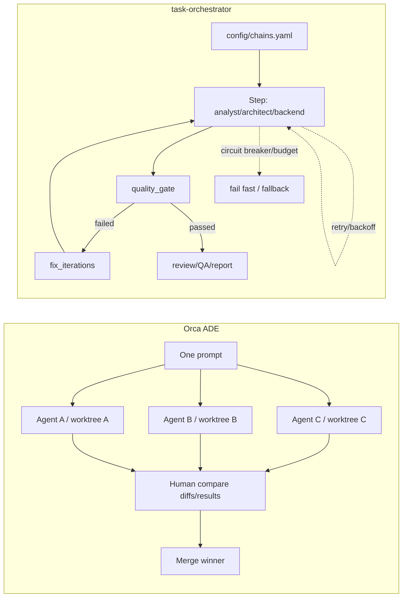

# Исследование: Orca ADE — desktop/mobile Agent Development Environment для параллельной оркестрации coding-агентов

> **Проект:** [github.com/stablyai/orca](https://github.com/stablyai/orca), [onorca.dev](https://www.onorca.dev/)
> **Дата анализа:** 2026-07-10
> **Язык:** TypeScript + Electron desktop + React Native/Expo mobile + native sidecars (Swift/Python/PowerShell)
> **Лицензия:** MIT (по GitHub metadata; `package.json` не содержит `license`)
> **Snapshot:** `main` `0f0e32952e7c33adbc8d03325c8ea9d241df1bb8` (`pushed_at`: 2026-07-10T10:56:55Z; commit: `Fix layout-aware find in the source editor (#8088)`)
> **GitHub metadata:** 15,693★, 1,227 forks, 1,332 open issues, created 2026-03-17, default branch `main`, topics: `ade`, `agent-ide`, `parallel-agents`, `worktrees`, `terminal`, `mobile-app`, `orchestration`, `yc-backed`
> **Аналитик:** Аналитик (Шерлок)

---


## Терминологическая пометка

Далее англоязычные термины используются в таких значениях:

- **manual parallel-agent harness** — ручной контур параллельной оркестрации агентов.
- **fan-out** — веерная раздача одной задачи нескольким агентам/запускам.
- **BYO (bring your own)** — модель «принеси свой», то есть использование собственной подписки/агента пользователя.
- **control surface** — управляющая поверхность: интерфейс контроля внешних агентов.
- **human-in-the-loop** — человек в контуре принятия решения.
- **workflow** — рабочий процесс.
- **workbench** — рабочее место/панель управления.
- **live monitoring** — наблюдение за живым запуском.
- **runner-/chain-level retry/backoff/CB** — повтор, задержка между повторами и circuit breaker (предохранитель отказов) на уровне запуска агента или всей цепочки.
- **dispatch-level retry/circuit-break** — повтор и размыкание контура на уровне отдельной dispatch-задачи Orca; по проверенным `skills/orchestration/SKILL.md` и `src/main/runtime/orchestration/db.ts` порог — 3 failures (отказа).

---

## 1. Обзор проекта

Orca — **Agent Development Environment (ADE, среда разработки для агентов)** и desktop/mobile orchestrator (оркестратор) поверх внешних coding-агентов. Суть продукта: запускать Codex, Claude Code, OpenCode, Pi и другие CLI-агенты бок о бок, каждый в собственном `git worktree` (рабочем дереве Git), наблюдать за ними в terminal IDE (терминальной среде), сравнивать результаты и вручную merge'ить (сливать) победителя.

> ⚠️ **Классификация:** Orca — не LLM SDK (SDK для работы с LLM), не coding agent (кодинг-агент) и не server/CI-first workflow engine (движок рабочих процессов для CI). Это **manual parallel-agent harness / ADE** (ручной контур параллельной оркестрации агентов) с сильным UX (пользовательский опыт) вокруг worktrees, terminal splits, mobile companion, tasks и automations.

### Архитектура

```text
┌─────────────────────────────────────────────────────────────┐
│ Orca Desktop (Electron + Vite + React)                       │
│ • Worktree-native IDE: sidebar, tabs/panes, editor, browser   │
│ • xterm.js terminal backend + WebGL + split panes             │
│ • Source control: diff review, commit, push, PR/checks        │
│ • Tasks: GitHub/Linear/Jira-linked work items                 │
│ • Automations: scheduled/manual prompt runs                   │
└───────────────┬───────────────────────────────┬─────────────┘
                │                               │
                ▼                               ▼
┌──────────────────────────────┐      ┌────────────────────────┐
│ Worktree runtime              │      │ Orchestration runtime   │
│ • git worktree per task       │      │ • messages/inbox        │
│ • branch/start-from refs      │      │ • tasks/dependencies    │
│ • terminal/browser/editor     │      │ • dispatch contexts     │
│   scoped per worktree         │      │ • worker_done/heartbeat │
│ • plain git remains usable    │      │ • decision gates        │
└───────────────┬──────────────┘      └────────────────────────┘
                │
                ▼
┌─────────────────────────────────────────────────────────────┐
│ External CLI agents (BYO subscription)                       │
│ Claude Code / Codex / OpenCode / Cursor CLI / Copilot / Pi /  │
│ Grok / Gemini / Droid / Kilo / Hermes / Goose / Qwen / ...    │
└─────────────────────────────────────────────────────────────┘
                ▲
                │ WebSocket RPC / pairing
┌───────────────┴─────────────────────────────────────────────┐
│ Orca Mobile Companion (React Native / Expo)                  │
│ • worktree status, terminal scrollback, replies              │
│ • source-control review/commit, account switcher             │
│ • push notifications when agents finish                      │
└─────────────────────────────────────────────────────────────┘
```

### Ключевые характеристики

| Характеристика | Значение |
| --- | --- |
| **Тип** | `ADE / manual parallel-agent harness` (ручной ADE-контур для параллельных coding-агентов) |
| **Модель выполнения** | `parallel worktree fan-out`: один prompt → N агентов в отдельных `git worktree` → compare → merge winner |
| **Поддерживаемые агенты** | Любой CLI-agent; README перечисляет Claude Code, Codex, Grok, Cursor, GitHub Copilot, OpenCode, MiMo Code, Amp, OpenClaude, Antigravity, Pi, oh-my-pi, Hermes Agent, Devin, Goose, Auggie, Autohand Code, Charm, Cline, Codebuff, Command Code, Continue, Droid, Kilocode, Kimi, Kiro, Mistral Vibe, Qwen Code, Rovo Dev и `+ any CLI agent` |
| **State management** | Desktop/runtime state + `git worktree`/branch/files; orchestration state (messages/tasks/dispatches/gates); mobile pairing token and WebSocket RPC |
| **Terminal model** | xterm.js-based terminal, WebGL rendering, split panes, scrollback search, Ghostty theme/font/cursor import, main-owned terminal snapshots for hidden pane recovery |
| **Mobile model** | iOS/Android companion: read-mostly monitor/control; desktop remains source of truth; no cloud relay in documented pairing flow |
| **Tasks / Automations** | GitHub/Linear/Jira work items; scheduled automations via CLI (`hourly`, `daily`, `weekdays`, cron/RRULE), manual run, rerun failed launches |
| **Meta-agent layer** | Repo ships `AGENTS.md`, `CLAUDE.md`, and installable `skills/*/SKILL.md` (`orca-cli`, `orchestration`, `computer-use`, `orca-linear`, emulators, per-workspace env) |
| **Stack** | Electron 42, electron-vite, React 19, Vite 7, TypeScript 5.9, xterm 6 beta, node-pty, ssh2, ws, yaml, zod, Monaco, Playwright; mobile: Expo/React Native; native sidecars: Swift/Python/PowerShell |

---

## 2. Возможности оркестрации — обзор

| Функция | Orca ADE |
| --- | --- |
| **Chain / DAG engine** | ⚠️ Есть experimental orchestration (messages/tasks/dispatches/decision gates) и coordinator loop, но core product — manual worktree orchestration, не декларативные YAML-chain steps |
| **Parallel fan-out** | ✅ First-class UX: один prompt можно раздать нескольким агентам в отдельных worktrees, сравнить результаты и merge'ить победителя |
| **Git worktree isolation** | ✅ Каждый task/workspace имеет собственную branch, files, terminal sessions, browser/editor scope |
| **BYO agent/subscription** | ✅ Orca запускает существующие CLI-агенты и использует подписки пользователя; не продаёт собственную модель |
| **Workspace config** | ✅ `orca.yaml`; в snapshot минимален (`scripts.setup`), а skills описывают более широкий contract (`environmentRecipes`, setup scripts, per-workspace env) |
| **Tasks** | ✅ Work items из GitHub/Linear/Jira; можно открыть worktree from task, review/PR без context switch |
| **Automations** | ✅ Scheduled/manual prompt runs через CLI; target repo/workspace, reuse/fresh session, precheck, rerun failed launch |
| **Orchestration messages** | ✅ Persistent messages, shared inbox, tasks, dispatch contexts, worker_done/escalation/heartbeat, decision gates |
| **Quality gates** | ⚠️ В репозитории есть reliability docs and precheck/validation для Orca features; но нет task-orchestrator-style chain-level deterministic gates как обязательного runtime primitive |
| **Retry / backoff** | ⚠️ Нет universal runner-/chain-level retry/backoff для agent steps; есть experimental dispatch-level retry: `failure_count` переносится между повторными dispatch и после 3 failures задача переводится в `failed` через `circuit_broken` |
| **Circuit breaker** | ⚠️ Нет аналога `CircuitBreakerAgentRunnerService` на уровне runner/chain; есть experimental dispatch-level `circuit_broken` после 3 failures |
| **Budget control** | ❌ Нет orchestrator-level budget; есть usage/rate-limit tracking для Claude/Codex accounts |
| **JSONL audit trail** | ❌ Не заявлен chain-level JSONL audit trail; state хранится в app/runtime records |
| **CI/server-first execution** | ⚠️ Есть `orca serve` headless Linux guide, но продукт всё равно Electron/ADE-first, а не Symfony CLI/CI-first |
| **Extensibility** | ✅ Any CLI agent, custom CLI agents, installable Skills, MCP endpoints, `orca` CLI, SSH/remote worktrees, emulator/computer-use surfaces |
| **DDD / Clean Architecture** | ❌ Не применимо: Electron/TypeScript app with modules and docs, не DDD library |

---

## 3. Ключевые механизмы

### 3.1 🟡 Parallel worktree fan-out

**Что у них:** README и docs формулируют главный workflow так: *Fan one prompt across five agents, each in its own isolated git worktree — compare the results and merge the winner*. Документация `Worktrees` уточняет модель:

- repo has base ref (обычно `origin/main`);
- each worktree has start-from ref;
- each worktree owns branch, files on disk and agent terminals;
- work/review/ship lifecycle scoped per worktree: agent terminals, editor tabs, browser tabs, diff review, commit/push/PR;
- plain git remains available: Orca-created worktree is a real `git worktree`.

**Оркестрационная значимость:** Orca оптимизирует **candidate generation and selection** (генерация и выбор кандидатов): дать одну задачу нескольким агентам/моделям, получить несколько branch/worktree outputs, сравнить diff/behavior и вручную выбрать winner (победителя). Это отличается от sequential chain execution (последовательного исполнения цепочки): здесь параллелизм — основной UX, а human (человек) остаётся decision maker (принимающим решение).

**Сравнение с task-orchestrator:** у нас есть `DynamicLoop` (динамический цикл) и `task-via-subagents`/`run-subagent`, но нет first-class fan-out comparison (веерного сравнения кандидатов) как runtime primitive. Наша модель сильнее в deterministic control (retry/CB/gates/budget), Orca сильнее в human-visible parallel exploration.

### 3.2 🟡 BYO agent/subscription model

**Что у них:** Orca explicitly says it works with any CLI agent — if it runs in a terminal, it runs in Orca. On the product site: *Bring your own Agent / Subscription*. То есть Orca не становится LLM provider (провайдером модели); он запускает внешние CLI и даёт пользователю hot-swap accounts, usage/rate-limit visibility and terminal/worktree UX.

**Оркестрационная значимость:** BYO снижает vendor lock-in (привязку к поставщику) и превращает Orca в **control surface** (управляющую поверхность) над агентами. В отличие от SDK-фреймворков, Orca не требует писать интеграцию к LLM API; достаточно CLI command.

**Сравнение с task-orchestrator:** наш `AgentRunnerInterface` и `config/chains.yaml` похожи по идее: runner (запускатель) является внешней командой/профилем. Отличие: у нас runner встроен в автоматизированную chain execution (исполнение цепочки), а у Orca — в интерактивный terminal/worktree UX.

### 3.3 🟡 `orca.yaml` workspace config

**Что у них:** В snapshot `orca.yaml` в корне репозитория минимален:

```yaml
scripts:
  setup: |
    node config/scripts/run-internal-dev-setup.mjs
    pnpm install
```

Но installable skill `orca-per-workspace-env` описывает расширенный `orca.yaml` contract для `environmentRecipes`: provider prerequisites, base snapshot, agent-auth snapshot, state file, `create/suspend/resume/destroy` lifecycle scripts, connection mode `orca serve` vs SSH, `orca vm recipe doctor`.

**Оркестрационная значимость:** `orca.yaml` — repo-owned workspace contract (контракт рабочего пространства репозитория): setup scripts and environment recipes live with the codebase, not in user memory. Это похоже на `config/chains.yaml`, но target другой: не цепочка шагов, а developer/agent environment (среда разработки/агента).

**Сравнение с task-orchestrator:** `config/chains.yaml` задаёт chains, roles, retry_policy, budget and fix_iterations. `orca.yaml` задаёт workspace/runtime setup. Для нас полезен не формат, а идея **workspace recipe adjacent to chain config**: preflight/setup metadata per project could reduce hidden assumptions before running agents.

### 3.4 🟢 Terminal/mobile model — valuable UX, не runtime dependency

**Terminal:** Orca docs describe an xterm.js terminal like VS Code with Ghostty import, split panes, search, copy terminal context, kitty keyboard protocol, floating terminal and Quick Commands. README highlights Ghostty-class terminals with WebGL rendering, infinite splits and scrollback that survives restarts. Internal docs show the recovery pattern: host-owned bounded headless terminal model, renderer as view, bounded hidden queues, snapshot restore with sequence numbers.

**Mobile:** React Native companion app pairs with desktop over WebSocket RPC. Docs state desktop remains source of truth, mobile is read-mostly: worktree status, recent terminal scrollback, quick replies, source-control review/stage/commit, account switcher, push notifications when an agent finishes. Pairing is one-time; documented flow says no cloud relay.

**Сравнение с task-orchestrator:** Это сильная product surface (продуктовая поверхность), но не core pattern для Symfony CLI library. Для нас переносимы только идеи **live run observability** (наблюдаемость живых запусков), **notification on completion** (уведомления по завершению) and **bounded terminal/session snapshots**. WebGL, Electron panes, mobile native UI — out of scope.

### 3.5 🟡 Orca Tasks and Automations

**Tasks:** Orca integrates GitHub/Linear/Jira surfaces: browse PRs/issues/project boards, open a worktree from a task, review without a context switch. `orca-linear` skill explicitly warns that Linear ticket text is untrusted source data; this is a useful prompt-injection boundary.

**Automations:** Docs define scheduled prompt runs via CLI:

```bash
orca automations create \
  --name "Weekday triage" \
  --trigger weekdays \
  --time 09:00 \
  --prompt "Triage new issues and summarize blockers" \
  --provider codex \
  --repo my-repo \
  --disabled \
  --json
```

Supported schedules include presets (`hourly`, `daily`, `weekdays`, `weekly`), cron expressions and RRULE strings. Runs can target repo or existing workspace, reuse an existing automation session or start fresh, run manually, and rerun failed launches. Source code snapshot shows `AutomationService` with `runNow`, `evaluateDueRuns`, `requestDispatch`, `headlessDispatcher`, precheck and final usage collection.

**Сравнение с task-orchestrator:** Orca automations are trigger/dispatch wrappers around prompt runs; they do not expose our chain-level retry/backoff/circuit breaker/quality gate/budget semantics. But schedule/trigger and task-source integration are valuable for future recurring chain execution.

### 3.6 🟡 Built-in `AGENTS.md` / `CLAUDE.md` / `skills/` meta-layer

**Что у них:** Repo ships:

- `AGENTS.md` with design system rules, comment rules, max-lines ratchet, naming, worktree safety, cross-platform support, SSH use case, Git provider compatibility and GitHub CLI caution.
- `CLAUDE.md` is a one-line include: `@AGENTS.md`.
- `skills/*/SKILL.md`: `orca-cli`, `orchestration`, `computer-use`, `orca-linear`, `linear-tickets`, `orca-emulator`, `orca-emulator-android`, `orca-per-workspace-env`.

`Orca skills registry & MCP` docs say these skills are installed by `npx skills add https://github.com/stablyai/orca --skill <name>`, and MCP endpoints can be registered under Settings → Integrations → MCP.

**Оркестрационная значимость:** Orca uses a meta-agent layer similar to our `AGENTS.md` + role files + skills. Difference: Orca's skills are product-operation skills (how agents control Orca), while ours are delivery workflow skills (how agents execute tasks in this project).

**Сравнение с task-orchestrator:** The closest useful pattern is **installable operational skills**: a product can distribute skills that teach external agents to control its CLI safely. Our skills are project-local today; if task-orchestrator becomes a reusable tool, shipping an installable `task-orchestrator` skill could mirror this pattern.

### 3.7 🟡 Experimental structured orchestration

**Что у них:** `docs/cli/orchestration` describes an experimental coordination layer:

- persistent terminal-to-terminal messages (`status`, `dispatch`, `worker_done`, `escalation`, `decision_gate`, `heartbeat`);
- tasks with dependencies and statuses (`pending`, `ready`, `dispatched`, `completed`, `failed`, `blocked`);
- dispatch contexts with `taskId` and `dispatchId`, failure count and heartbeat;
- decision gates;
- worker contract: send `worker_done` exactly once, include task/dispatch ids, send heartbeat, use `ask` for blocking questions;
- coordinator loop via `orca orchestration run --max-concurrent`.

Проверенные источники `skills/orchestration/SKILL.md` и `src/main/runtime/orchestration/db.ts` подтверждают experimental dispatch-level retry/circuit-break: `failure_count` накапливается между повторными dispatch для одной task, а после 3 failures dispatch получает статус `circuit_broken`, task переводится в `failed`. Это не feature parity с нашим `CircuitBreakerAgentRunnerService`: нет universal runner-/chain-level retry/backoff/CB для любых agent steps.

**Сравнение с task-orchestrator:** This is closer to SwarmForge-style structured handoff than to our deterministic chain runner. Useful pattern: `dispatchId` as completion authority (защита от stale retry completing wrong task) and structured `worker_done` report with files/report path.

---

## 4. Сравнение с task-orchestrator

| Критерий | Orca ADE | task-orchestrator | Вывод |
| --- | --- | --- | --- |
| **Orchestration model** | Manual parallel worktree fan-out + experimental messages/tasks/dispatches/gates | YAML chains (`config/chains.yaml`), static/dynamic chain execution, `DynamicLoop`, `run-subagent`/`task-via-subagents` | Orca лучше для human-visible parallel exploration; мы сильнее в deterministic automated execution |
| **State management** | Worktrees/branches/files, terminal/session/app state, orchestration DB-like records, mobile pairing | Chain context/payload, JSONL audit trail, task files, Git branch controlled by orchestrator | Worktree isolation и dispatch completion authority полезны; app/mobile state не переносить |
| **Error handling** | Fail-fast validations, automation rerun, precheck, source-control recovery docs; нет universal runner-/chain-level retry/backoff/CB/gates/budget для agent steps; есть experimental dispatch-level retry/circuit-break после 3 failures | Retry with backoff, circuit breaker, fallback routing, quality gates, budget control, `fix_iterations` | Наш resilience stack существенно сильнее; Orca не dependency |
| **Extensibility** | Any CLI agent, custom CLI agent, Skills, MCP endpoints, CLI, SSH, emulator/computer-use surfaces | Role files, skills, runner configs, Symfony DI, DDD modules | Заимствовать installable operational skill pattern and BYO runner ergonomics |
| **Applicability** | Desktop/mobile ADE for local/remote worktree management | PHP/Symfony CLI/library orchestrator for chain execution | Комплементарные инструменты; прямой перенос Electron/mobile невозможен |

### 4.1 Где Orca сильнее

- **UX parallelism:** worktrees, terminals, diffs and mobile status make N-agent comparison observable.
- **BYO ergonomics:** any CLI agent with user's own subscription; account usage/rate-limit surface.
- **Product integration:** GitHub/Linear/Jira, browser/design mode, source control and PR/checks in one UI.
- **Operational skills:** shipped `SKILL.md` files let external agents control Orca safely.
- **Mobile companion:** agent monitoring and quick replies from phone.

### 4.2 Где task-orchestrator сильнее

- **Automatic resilience:** retry with backoff, `CircuitBreakerAgentRunnerService`, fallback routing.
- **Quality gates:** deterministic shell checks in chains.
- **Budget control:** chain and step budget semantics.
- **`fix_iterations`:** bounded implement/review/fix loops.
- **JSONL audit trail:** chain-level machine-readable trace.
- **Clean Architecture / DDD:** PHP/Symfony modules with Domain/Application/Infrastructure boundaries.
- **CI/server-first posture:** CLI/library execution is primary, not desktop UI.

### 4.3 Mermaid-сопоставление



---

## 5. Сравнение с ближайшими аналогами

| Критерий | Orca ADE | SwarmForge (#29) | AgentCraft (#16) | Sandcastle (#20) |
| --- | --- | --- | --- | --- |
| **Тип** | Open-source desktop/mobile ADE | Open-source tmux-based swarm orchestration | Proprietary GUI wrapper | TypeScript sandbox orchestration library |
| **Основная изоляция** | `git worktree` per task/agent | `git worktree` per role | Git worktrees / containers (по публичным материалам) | Sandbox + git worktrees/branches |
| **Parallel model** | Fan-out prompt → N agents → compare → merge winner | Peer-to-peer role handoff pipeline | GUI team/mission management | Templates with parallel planner/executors |
| **Control plane** | Human-in-the-loop desktop/mobile + experimental orchestration | Daemon-owned file handoff + tmux sessions | GUI product | Programmatic library API |
| **Agent integration** | Any CLI agent, BYO subscription | codex/claude/copilot/grok backends | External agents | AgentProvider (Claude Code/Codex/Pi/OpenCode/custom) |
| **Resilience** | Manual recovery/rerun; no universal runner-/chain-level retry/backoff/CB/gates/budget; есть experimental dispatch-level retry/circuit-break после 3 failures | Validation/fail-fast; no retry/CB/gates/budget | Delegated to agents | Typed errors, idle timeout, worktree preservation; no chain CB/budget |
| **Applicability to us** | Pattern source for fan-out UX/worktree monitoring | Pattern source for governance/handoff/presets | Pattern source for GUI/team UX only | Pattern source for sandbox/branch lifecycle |

**Вывод по аналогам:** Orca is closest to AgentCraft in product category (visual manager for external agents), closest to SwarmForge in worktree/team coordination, and overlaps with Sandcastle only on worktree isolation. Orca's differentiator is maturity of desktop/mobile ADE and BYO CLI-agent breadth; its weakness for us is the same as SwarmForge/AgentCraft: it is not an automated chain engine with resilience primitives.

---

## 6. Сводка по заимствованию

| Возможность | Статус для task-orchestrator | Описание |
| --- | --- | --- |
| Parallel fan-out comparison | 🟡 P2 | Add optional workflow: one task → N runners/roles in isolated branches/worktrees → compare reports → human/quality-gate selects winner |
| Worktree isolation for parallel subagents | 🟡 P3 | Especially epic-level research/review or candidate implementations; requires merge/cleanup policy |
| Workspace recipe config | 🟡 P3 | Project-level setup/preflight/env recipes adjacent to chains; do not replace `config/chains.yaml` |
| BYO runner ergonomics | 🟡 P2 | Better document runner profile as external CLI + user's subscription/account; avoid pretending runner is model provider |
| Mobile/live monitoring concept | 🟡 P3 | Not native mobile; perhaps web/CLI status dashboard and notifications for long chain runs |
| Structured dispatch completion authority | 🟡 P2 | Use task/run ids in subagent reports to avoid stale completion ambiguity |
| Installable operational skill | 🟡 P3 | If task-orchestrator becomes reusable, ship `SKILL.md` for external agents to operate its CLI safely |
| Electron/WebGL terminal IDE | 🟢 — | Do not port; outside PHP/Symfony CLI scope |
| Native mobile companion | 🟢 — | Do not port; only borrow monitoring/notification idea |
| Runtime dependency | 🔴 — | Do not depend on Orca: stack, product surface and execution model do not match |

### Concrete patterns (3–7) для возможного заимствования

1. **Parallel fan-out candidate comparison (P2):** `one prompt → N runner profiles → independent outputs → compare/merge decision`; start as skill/workflow, not core rewrite.
2. **Structured `worker_done` / dispatch-id report (P2):** subagent report includes task id, dispatch/run id, status, files changed, checks, blockers, report path.
3. **BYO runner profile documentation (P2):** clarify that runner config launches external CLI using user's subscription; document account/rate-limit assumptions.
4. **Worktree isolation for parallel research/review (P3):** optional `git worktree` per subagent for fan-out tasks; needs cleanup and merge winner policy.
5. **Workspace setup/preflight recipe (P3):** project-owned setup script/precheck metadata before chain execution.
6. **Live run observability dashboard/notifications (P3):** chain status, current step, waiting-on-input, finish/fail notification; mobile is not required.
7. **Installable task-orchestrator skill (P3):** publish a `SKILL.md` teaching agents to run chains, inspect JSONL, and respect PR/git rules.

---

## 7. Вердикт

**Итоговый verdict:** 🟡 **заимствовать отдельные паттерны**, 🔴 **не использовать как dependency**.

**Почему заимствовать:** Orca validates (подтверждает) a useful adjacent pattern: manual parallel orchestration across real git worktrees with excellent observability. Its BYO agent/subscription model, worktree fan-out, mobile monitoring and installable operational skills are relevant inspiration for the next generation of `task-via-subagents` and long-running chain observability.

**Почему не dependency:**

- Stack mismatch: Electron/TypeScript/React Native/native sidecars vs PHP 8.4/Symfony 8/DDD.
- Product mismatch: desktop/mobile ADE vs CLI/server-first chain orchestrator.
- Orca lacks our core automated resilience package at runner-/chain-level: retry with backoff, circuit breaker, chain-level quality gates, budget control, `fix_iterations`, JSONL audit trail; its experimental dispatch-level retry/circuit-break after 3 failures is narrower.
- Human/manual compare is central to Orca; task-orchestrator's value is deterministic automated process control.
- Terminal/WebGL/mobile/browser features are UI infrastructure, not reusable runtime components for our library.

**Bottom line:** Orca is a strong reference design for **parallel agent workbench UX** (рабочее место параллельных агентов), not a runtime foundation for `task-orchestrator`. The most valuable borrow is fan-out comparison, but it should be implemented on top of our existing chain/resilience model, not instead of it.

---

## 8. Указатель источников для деталей

- [GitHub repository metadata](https://api.github.com/repos/stablyai/orca) — license/stars/forks/issues/activity/topics; snapshot commit from GitHub commits API.
- [README.md](https://github.com/stablyai/orca/blob/main/README.md) — positioning, supported agents, parallel worktrees, mobile, terminal, install/platforms.
- [`orca.yaml`](https://github.com/stablyai/orca/blob/main/orca.yaml) — current workspace setup script.
- [`AGENTS.md`](https://github.com/stablyai/orca/blob/main/AGENTS.md), [`CLAUDE.md`](https://github.com/stablyai/orca/blob/main/CLAUDE.md), [`skills/`](https://github.com/stablyai/orca/tree/main/skills) — meta-agent layer and installable Orca skills.
- [Worktrees docs](https://www.onorca.dev/docs/model/worktrees) — worktree-native model and lifecycle.
- [Terminal docs](https://www.onorca.dev/docs/terminal), [`docs/terminal-main-owned-state.md`](https://github.com/stablyai/orca/blob/main/docs/terminal-main-owned-state.md) — xterm/Ghostty terminal and main-owned recovery pattern.
- [Mobile companion docs](https://www.onorca.dev/docs/mobile), [`mobile/README.md`](https://github.com/stablyai/orca/blob/main/mobile/README.md) — pairing, WebSocket RPC, mobile capabilities.
- [Scheduled automations docs](https://www.onorca.dev/docs/cli/automations), [`src/main/automations/service.ts`](https://github.com/stablyai/orca/blob/main/src/main/automations/service.ts) — automation trigger/dispatch/rerun model.
- [Orchestration docs](https://www.onorca.dev/docs/cli/orchestration), [`skills/orchestration/SKILL.md`](https://github.com/stablyai/orca/blob/main/skills/orchestration/SKILL.md) — tasks, dispatches, worker_done, decision gates.
- [`package.json`](https://github.com/stablyai/orca/blob/main/package.json), [`electron.vite.config.ts`](https://github.com/stablyai/orca/blob/main/electron.vite.config.ts), [`native/`](https://github.com/stablyai/orca/tree/main/native), [`mobile/`](https://github.com/stablyai/orca/tree/main/mobile) — implementation stack.

📚 **Источники:**
1. [github.com/stablyai/orca](https://github.com/stablyai/orca) — repository metadata and source snapshot.
2. [README.md](https://github.com/stablyai/orca/blob/main/README.md) — product intent, features, supported CLI agents.
3. [onorca.dev/docs/model/worktrees](https://www.onorca.dev/docs/model/worktrees) — worktree model.
4. [onorca.dev/docs/cli/orchestration](https://www.onorca.dev/docs/cli/orchestration) — structured orchestration model.
5. [onorca.dev/docs/mobile](https://www.onorca.dev/docs/mobile) — mobile companion model.
