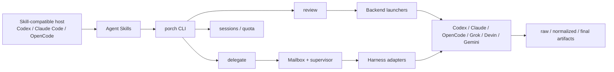

# Исследование pragmatic-orchestration: Agent Skills и `porch` над внешними CLI-агентами

> **Проект:** [`CodeAlive-AI/pragmatic-orchestration`](https://github.com/CodeAlive-AI/pragmatic-orchestration) — набор Agent Skills (агентских навыков) и CLI (интерфейс командной строки) `porch` над внешними агентскими CLI
> **Дата анализа:** 2026-09-22
> **Язык:** Python 3.11+ и Bash
> **Лицензия:** MIT
> **Snapshot:** ветка `main`, commit [`a72695dded7e2f28c185c3a2d770b26eb45528fa`](https://github.com/CodeAlive-AI/pragmatic-orchestration/tree/a72695dded7e2f28c185c3a2d770b26eb45528fa) от 2026-09-21 11:24:24 UTC; релизных тегов нет
> **GitHub metadata:** 23★, 2 forks, 0 open issues, created 2026-09-17, default branch `main`
> **Аналитик:** Аналитик (Шерлок)

---

## 0. Ограничения исследования

Исследование выполнено по снимку исходников, README, документации навыков, Python/Bash-реализации и офлайн-тестам. `porch` не устанавливался, реальные внешние харнесы не запускались, производительность и безопасность исходников полностью не аудировались.

Проект создан 2026-09-17 и быстро меняется. Локальный снимок `/tmp/research/pragmatic-orchestration` не содержит каталога `.git`, поэтому commit подтверждён через GitHub API для `main` на дату снимка. Выводы привязаны к указанному commit.

Утверждение README о «2–10× больше работы» — заявление авторов, а не установленный данным исследованием факт.

## 1. Краткий вывод и классификация

pragmatic-orchestration — **`orchestration skill suite / single-CLI delegation layer over external agents`** (набор навыков оркестрации и единый CLI-слой делегации над внешними агентами). Это не собственный coding agent (агент программирования) и не declarative chain engine (декларативный движок цепочек): рассуждение и изменение проекта выполняют Codex CLI, Claude Code, OpenCode, Grok Build и Devin CLI; Gemini поддерживается только для review (ревью). `porch` отвечает за выбор профиля, безопасные параметры запуска, веерное ревью, нормализацию событий, артефакты, наблюдение и управление работающей делегацией.

**Итоговый вердикт:**

- 🟡 **заимствовать паттерны:** жизненный цикл steer (перенаправления работающего запуска) с различением приёма и применения; закрытую схему событий; fail-closed (отказ по умолчанию) матрицу возможностей; deviation journal (журнал отклонений); поиск истории с исходными locator (указателями); fake-CLI тестирование;
- 🟡 **изучить отдельно:** интерактивный контракт `AgentRunner`, read-only (только чтение) режим ролей, multi-model review (мультимодельное ревью) с судьёй;
- 🔴 **не использовать как core dependency (основную зависимость):** Python+Bash-навык дублирует границу запуска CLI, не встраивается естественно в PHP/Symfony DDD и не заменяет устойчивость `ChainExecution`;
- 🔴 **не переносить:** собственный индекс историй без необходимости, ACP (Agent Client Protocol) только ради унификации пакетных запусков, инфраструктуру `remote-agents` в ядро движка.

## 2. Архитектура и границы ответственности



Граница принципиальна:

- **харнес** владеет agent loop (циклом агента), инструментами, моделью и фактическими изменениями;
- **`porch`** владеет запуском, политикой режима, наблюдением, нормализацией и управлением;
- **вызывающий родитель** владеет постановкой, супервизией, проверкой и приёмкой;
- **Agent Skill** обучает родителя дисциплине использования CLI, но не является технической песочницей.

В отличие от `task-orchestrator`, первичным артефактом здесь является не YAML-цепочка, а контракт одной задачи и живая супервизия сильной родительской модели.

## 3. Четыре режима `porch`

| Режим | Назначение | Контракт и границы |
|---|---|---|
| `review` | Независимые мнения и поиск дефектов | Всегда read-only; `ask`, `basic`, `specialists` возвращают независимые ответы без автоматического ранжирования; `super` и `ultra` добавляют судью. Gemini допустим только здесь. |
| `delegate` | Выполнение одной задачи одним явно выбранным агентом | Полный доступ; steerable (управляемый) запуск по умолчанию, `--one-shot` отключает steer, `--detach` возвращает run id. Родитель обязан наблюдать и проверять результат. |
| `sessions` | Read-only навигация по локальным историям харнесов | Читает нативные JSONL/SQLite/каталоги потоково, без собственного индекса, БД или кэша; выдаёт locator до исходной записи и отчёт полноты сканирования. |
| `quota` | Просмотр остатков квот | Диагностическая поверхность для Codex/Grok; не планировщик бюджета цепочки и не замена нашему `ExecutionBudgetVo`. |

### 3.1. Глубины review и роль судьи

| Глубина | Механика |
|---|---|
| `basic` | Два прохода: безопасность и корректность, с проверкой цитируемого кода. |
| `specialists` | Добавляет производительность, архитектуру и согласованность; итог оценивает вызывающий агент. |
| `super` | 9 параллельных discovery-проходов (поиска), детерминированное объединение, затем один LLM-судья. |
| `ultra` | 20 discovery-проходов: 4 широких, матрица 3×5 специалистов и gap probe (поиск пробела), затем судья с резервным вариантом. |

Название `dedup-findings.py` вводит в заблуждение: скрипт **не выполняет семантическую дедупликацию**, а извлекает, маркирует источником, сортирует и перенумеровывает находки. Семантические решения `VALID`, `DUPLICATE`, `FALSE_POSITIVE`, `DOWNGRADE` принимает LLM-судья по `judge.txt`; `validate_judge_output.py` затем fail-closed проверяет, что решение дано ровно для каждой находки. Следовательно, автоматический результат остаётся модельной оценкой и требует человеческой или родительской приёмки.

## 4. Steerable delegation: устройство и семантика

### 4.1. Поток управления

```mermaid
sequenceDiagram
    participant Parent as Родитель
    participant CLI as porch
    participant Box as Mailbox
    participant Sup as Supervisor
    participant Adapter as Harness adapter
    participant Agent as Внешний агент

    Parent->>CLI: delegate --detach
    CLI->>Sup: start task
    Sup->>Agent: initial prompt
    Parent->>CLI: steer RUN_ID --mode auto
    CLI->>Box: enqueue(client_id, seq)
    Box-->>Parent: accepted
    Sup->>Box: consume by seq
    Sup->>Adapter: steer(content, mode)
    Adapter->>Agent: backend-specific delivery
    Agent-->>Adapter: asynchronous evidence
    Adapter-->>Sup: steer_ack(status, evidence)
    Sup->>Box: monotonic reconciliation
    Parent->>CLI: events/status/wait/watch
```

### 4.2. Mailbox и supervisor

`Mailbox` сериализует конкурентных писателей через `flock`, выделяет монотонный `seq` и атомарно пишет `msg-NNNNNN.json`. `client_id` обеспечивает идемпотентность: повтор с теми же content hash (хешем содержимого), mode и kind возвращает существующую запись, а конфликт отклоняется. Для имени файла используется SHA-256-безопасное представление, исходный id остаётся в JSON.

Один supervisor является единственным потребителем. Он сначала осушает mailbox, затем события адаптера, поддерживает heartbeat (сигнал жизни), закрывает mailbox при терминальном переходе и переводит незавершённые сообщения в явный failure (сбой), а не оставляет их в подвешенном состоянии.

### 4.3. Режимы steer

- `auto` — рекомендуемый режим; адаптер выбирает штатную семантику своего харнеса;
- `queue` — поставить указание в очередь/следующий ход, если backend это поддерживает;
- `interrupt` — прервать текущий ход и отправить новую инструкцию; неподдерживаемый режим отклоняется, а не молча понижается.

Семантика различается по backend: Codex использует app-server, OpenCode — loopback HTTP/SSE, Grok и Devin — ACP stdio; Claude не поддерживает interrupt. `backend_contract.py` хранит честную матрицу transport (транспорта), steer и interrupt вместо фиктивно единого интерфейса.

### 4.4. Ранги статуса и доказательства

`_STEER_SUCCESS_RANK` не позволяет более позднему слабому событию понизить подтверждённый статус: `accepted` (0) → `delivering` (1) → `request_sent` (2) → `queued`/`awaiting_queue_resolution` (3) → `running` (4) → `merged` (5) → `completed`/`applied`/`delivered` (10). Терминальные ошибки (`failed`, `rejected`, `cancelled`, `dropped`, `abandoned` и другие) обрабатываются отдельно.

При одинаковом ранге `_EVIDENCE_RANK` предпочитает более сильное доказательство: запись prompt request (запроса промпта) слабее backend queue entry (записи очереди), та слабее running prompt id (идентификатора выполняемого промпта), а терминальный prompt completion/cancellation (завершение/отмена промпта) сильнее промежуточных сигналов.

Ключевой инвариант: **`accepted` означает только локальную запись в mailbox; даже `completed` подтверждает жизненный цикл сообщения, но не выполнение требуемого изменения.** Семантическое применение проверяется по последующим событиям, diff (разнице файлов), артефактам и независимым проверкам.

## 5. Наблюдаемость

### 5.1. Контракт `porch`

- stdout — чистый финальный ответ или машинный JSONL режима;
- stderr — живой прогресс и диагностика;
- per-run (на запуск) артефакты разделены на `raw`, `normalized`, `final`, а steerable-запуск дополнительно хранит registry state (состояние реестра), mailbox, audit и control;
- `PorchEvent` имеет закрытый `KNOWN_EVENT_TYPES`; неизвестные типы не попадают в normalized-артефакт и фиксируются как protocol drift (расхождение протокола);
- финальный текст собирается по явным правилам: авторитетный `result` приоритетнее delta (фрагментов), пустой result не стирает непустые фрагменты;
- opt-in debug tape (включаемая лента отладки) отмечает стадии `RAW → PARSED → NORMALIZED → RENDERED → FINAL`, имеет монотонные номера, предел записей/байтов и честные счётчики overflow/dropped/gaps (переполнения, потерь и разрывов).

### 5.2. Сравнение с `task-orchestrator`

Наш [`audit.jsonl`](../../guide/observability.md) фиксирует `chain_start`, `step_start`, `step_result`, `chain_result`, стоимость, длительность и статус static-цепочек. Это сильнее как бизнес-аудит цепочки, но слабее как transport-level observability (наблюдаемость транспорта): Pi/Codex JSONL-парсеры молча игнорируют неизвестные записи, `AgentResultVo` хранит только итог и метрики, нет общего закрытого события инструмента/хода/steer и raw/normalized/final слоёв.

**Вердикт:** заимствовать закрытую схему и разделение артефактов при проектировании потокового/интерактивного `AgentRunner`, но не подменять ими chain audit. Это два уровня: события транспорта и аудит бизнес-исполнения.

## 6. Матрица доступа fail-closed

`mode_policy.py` задаёт закрытые capability (возможности): filesystem (`none/read/write`), shell, web, memory, subagents, steer, interrupt и `access_class` (`readonly/yolo`). Неизвестный режим и неизвестная возможность завершаются ошибкой. Инварианты запрещают write в readonly и требуют write для yolo.

| Семейство | FS | Shell/Web | Memory/Subagents | Steer/Interrupt | Класс |
|---|---|---|---|---|---|
| `review` | read | да/да | нет/нет | нет/нет | readonly |
| `delegate` | write | да/да | да/да | нет/нет | yolo |
| `delegate-steerable` | write | да/да | да/да | да/да | yolo |

Backend-specific (зависящие от харнеса) флаги остаются в launchers/adapters, а общая матрица задаёт намерение. Это соответствует принципу «capability policy (политика возможностей) отдельно от enforcement (принудительного применения)».

У `task-orchestrator` есть строгие процессные запреты в `AGENTS.md` и сырые флаги профилей runner, но нет машинно проверяемого read-only режима для аналитической роли. **Вердикт:** применить паттерн fail-closed и capability-first (сначала возможности), предварительно отделив неизменяемый project policy ceiling (верхний предел правил проекта) от выбираемого режима. Нельзя считать текстовую инструкцию песочницей; read-only должен обеспечиваться флагами харнеса или ОС.

## 7. ACP: почему отказ обоснован и что это значит для нас

`ACP-RESEARCH.md` признаёт преимущества ACP для IDE и интерактивных клиентов: инициализация, capability negotiation (согласование возможностей), сессии, потоки сообщений/инструментов, permission requests (запросы разрешений), отмена и явный `stopReason`. Но для коротких batch (пакетных) запусков ACP переносит сложность в клиента:

- нужны двунаправленный клиент, аутентификация, жизненный цикл сервера и сессии;
- permission, cancellation (отмена), shutdown (остановка), сбор финала и артефактов остаются ответственностью `porch`;
- safety flags (флаги безопасности) и режимы остаются backend-specific;
- Codex и Claude требуют адаптерных процессов;
- fan-out, судья, таймауты и агрегация не входят в ACP.

Тезис **«ACP не песочница» подтверждён**: session mode (режим сессии) и permission mediation (посредничество подтверждений) не изолируют файловую систему и процессы; агент может выполнять собственные инструменты вне клиентских `fs/*`/`terminal/*`.

Для текущего `AgentRunner` прямой headless CLI соответствует нашему контракту однократного запуска. **Вердикт:** не вводить ACP-подобный слой ради унификации. Пересмотреть решение только при продуктовом требовании интерактивных возобновляемых сессий, UI подтверждений и достаточно единообразной поддержке харнесов.

## 8. Дисциплина делегирования

`delegate.md` формализует практики, частично отсутствующие в наших [`run-subagent`](../../agents/skills/run-subagent/SKILL.md) и [`task-via-subagents`](../../agents/skills/task-via-subagents/SKILL.md):

1. контракт содержит цель, точный root, ограниченный результат, scope/non-goals (границы/не-цели), совместимость, критерии и проверки;
2. каждый исполнитель проверяется в первую минуту — понимание, план, первые действия;
3. далее родитель адаптивно проверяет прогресс примерно каждые 5–15 минут;
4. heartbeat и живой процесс сами по себе не доказывают прогресс;
5. родитель остаётся активным и владеет scope, супервизией, проверкой и приёмкой;
6. успешный exit и summary (резюме) исполнителя не являются независимой проверкой;
7. для более слабого исполнителя обязателен deviation journal: ожидание, наблюдение, доказательство, причина, действие и остаточный риск; журнал не расширяет scope.

Наш `watch-subagent.sh` сильнее в автоматических soft/hard/stall timeout (мягком/жёстком/простое), liveness-проверке и диагностических дампах, а `task-via-subagents` — в обязательных self-review/review и Git/PR-процессе. Но first-minute check, периодические содержательные контрольные точки и deviation journal не закреплены.

**Вердикт:** deviation journal и checkpoint-протокол — P2 quick win (быстрая доработка) для навыков; применять журнал пропорционально риску/разрыву возможностей, а не создавать файл для каждой тривиальной делегации.

## 9. Поиск по историям сессий

`sessions` поддерживает 12+ семейств хранилищ (Claude Code, Codex CLI/Desktop, OpenCode, Grok, Devin, Gemini, Cursor, Claude Desktop, Qwen Code, Kimi Code, OMP и собственные запуски `porch`). Архитектурно ценны:

- чтение нативных файлов/SQLite read-only без собственного индекса, БД или кэша;
- двухосевая классификация `kind` и `authorship`, чтобы не считать инъекцию оркестратора человеческим prompt (запросом);
- locator к исходной строке/таблице/ключу;
- `_summary` с malformed, truncated, unreadable и `scan_complete`;
- алгоритм `roots → list → grep → show around → raw locator → coverage`;
- turn analytics (аналитика ходов), flags (флаги проблем) и stats (статистика) для ретроспектив.

В `task-orchestrator` есть разрозненные журналы `watch-subagent`, rollout (трассы) Codex и chain audit, но нет сквозного навигатора. **Вердикт:** полезно как R&D для ретроспектив и анализа эффективности, однако сначала определить минимальную общую схему и требования приватности/редактирования секретов. Не копировать 12 парсеров и не создавать индекс до подтверждённого пользовательского сценария.

## 10. `remote-agents` как отдельный инфраструктурный класс

Второй навык управляет выделенными Linux/Windows-хостами: Terraform, AWS SSM Session Manager для SSH без публичного TCP/22, один UDP-порт WireGuard для SMB work bridge (моста рабочей папки), жизненный цикл питания, durable workers (устойчивые фоновые исполнители), headless Windows desktop (безголовый рабочий стол), read-only наблюдение и ограниченное visual QA (визуальное тестирование).

Это **remote execution infrastructure skill** (инфраструктурный навык удалённого исполнения), а не часть оркестрационного ядра. Он показывает важные принципы — отсутствие публичного ingress (входящего доступа), долговечный процесс при разрыве SSH, bounded visual QA и доказательства очистки, — но его AWS/Windows/Terraform-реализация не относится к `AgentRunner` или `ChainExecution`. **Вердикт:** не dependency; изучать отдельно при появлении удалённых runner hosts (хостов запускателей).

## 11. Офлайн-тестирование

Репозиторий содержит fake executables (поддельные CLI) для Claude, Codex, Devin, Gemini, Grok и OpenCode и тестирует без реальных API:

- безопасность argv/env и разделение режимов;
- закрытую схему событий и protocol drift;
- stdout/stderr и полноту финального текста;
- concurrent mailbox writers (конкурентных писателей), seq, идемпотентность и terminal cleanup;
- backend-specific steer, queue, interrupt, cancellation и race conditions (гонки);
- detached run, wait/wait-any, pagination (пагинацию), registry recovery;
- историю с malformed/truncated/unavailable stores (повреждёнными/обрезанными/недоступными хранилищами).

**Вердикт:** заимствовать fake-CLI fixtures (фикстуры поддельных CLI) для интеграционных тестов Pi/Codex `AgentRunner`, особенно для schema drift, зависания, отмены, неизвестных событий и восстановления после частичной записи.

## 12. Единая матрица сравнения

| Критерий | pragmatic-orchestration | task-orchestrator | Вывод |
|---|---|---|---|
| Модель оркестрации | Императивная задача одному агенту + живая супервизия; fan-out только в review | Декларативные YAML-цепочки, conditional/static execution и dynamic loops | Дополняющие уровни; `porch` не заменяет chain engine. |
| State management | Файловый per-run registry, mailbox, audit, артефакты; нативные сессии харнесов | Результат вызова, chain audit; durable state в `DynamicLoop` | У `porch` подробнее live-run state; у нас сильнее business chain state. |
| Error handling | Явные exit codes, partial results, timeout/cancel/recovery, fail-closed schema/policy; backend-specific lifecycle | Retry/backoff, classification, Circuit Breaker, fallback, budget, quality gates | У нас сильнее автоматическая устойчивость цепочки; у `porch` — интерактивный lifecycle. |
| Extensibility | JSON agent profiles, backend contract/adapters, Agent Skills, shell/Python workflows | DDD-интерфейсы, DI, модули, YAML chain/roles | Копировать паттерны контрактов, не реализацию/зависимость. |
| Безопасность | Review read-only flags, delegate full access, capability matrix; нет собственной песочницы | Процессные запреты + runner flags; нет общей capability matrix или sandbox | Нужна enforceable fail-closed политика; инструкции не являются изоляцией. |
| Наблюдаемость | Closed events, raw/normalized/final, debug tape, live events/status/watch | Chain-level `audit.jsonl`, metrics/report | Слои следует объединить концептуально, не смешивать. |

## 13. Сравнение с ближайшими аналогами трека

| Проект | Сходство | Отличие pragmatic-orchestration |
|---|---|---|
| qm (#32) | Платформа над внешними харнесами, skills, безопасность | qm — multi-tenant control plane (многопользовательский управляющий слой) с Postgres/sandbox; `porch` — локальный тонкий CLI без tenant/platform state. |
| omnigent (#33) | Meta-harness, много харнесов, политики, supervision | omnigent шире по cloud/OS sandbox и collaboration; `porch` проще, но глубже формализует steer mailbox/evidence и CLI-артефакты. |
| bx-dev (#31) | Skill-driven workflow и родительская координация | bx-dev предписывает Dev→review→commit→QA→merge lifecycle; `porch` не задаёт Git lifecycle, зато поддерживает несколько харнесов и живой steer. |
| Herdr (#34) | Управление живыми внешними агентами, ожидание, события | Herdr владеет постоянными PTY и терминальной surface (поверхностью); `porch` владеет per-run supervisor/mailbox и задачной дисциплиной без общего PTY-сервера. |
| bb (#36) | Provider-neutral threads, live steering, workflows | bb — IDE/control surface с SQLite, UI/API и worktrees; `porch` — skill+CLI, без IDE и durable workflow engine. |
| T3 Code (#37) | Нормализация харнесов, долгие сессии, permissions, interruption | T3 Code владеет server event journal и thread/worktree product state; `porch` легче и файловый, но его steer acceptance/evidence описан детальнее. |

## 14. Маппинг паттернов и вердикты

| # | Паттерн | Маппинг | Пробел | Вердикт | Приоритет |
|---:|---|---|---|---|---|
| 1 | Mailbox + supervisor + steer adapter | `AgentRunner`, `RunAgentProcessLifecycleService`, `ChainExecution` | Вызов шага атомарен; нет handle (дескриптора) живого запуска и команды коррекции | **study/apply design**: спроектировать async execution handle, lifecycle и capability; не добавлять ad hoc сигнал процессу | P1, High |
| 2 | Accepted ≠ applied + evidence ranks | Будущий контракт команды живому runner, audit | Сейчас есть только итог вызова | **apply** как обязательная семантика любого интерактивного API | P1, Medium |
| 3 | Closed `PorchEvent` + raw/normalized/final | Pi/Codex parsers, `AgentResultVo`, observability | Неизвестные JSONL события игнорируются, поток не является доменным контрактом | **apply** при расширении событий; сохранять raw и fail on drift по согласованной политике | P1, Medium |
| 4 | Fail-closed mode capabilities | role profiles, `AgentRunRequestVo.tools`, AGENTS.md | Нет нормализованного read-only режима и backend capability contract | **study/apply**; сначала threat model (модель угроз) и enforcement | P1, Medium/High |
| 5 | Deviation journal + first-minute check | `run-subagent`, `task-via-subagents` | Есть таймауты и ревью, нет содержательной ранней проверки/журнала | **apply** пропорционально риску | P2, Low |
| 6 | Multi-model review + judge | quality gate/reviewer workflow | Один ролевой review, нет структурированной агрегации находок | **study** как read-only тип шага; измерить стоимость, полноту и ложные срабатывания | P2, Medium/High |
| 7 | Native history search + locator | audit, `var/log/watch-subagent`, Codex rollouts | Нет единой ретроспективы | **R&D**; начать с 2 текущих runner и privacy contract | P3, Medium |
| 8 | Fake CLI integration suite | AgentRunner Integration tests | Есть parser tests, но меньше lifecycle/drift fixtures | **apply** | P2, Low/Medium |
| 9 | ACP transport | AgentRunner | Для batch не снимает backend-specific сложность | **skip now**; пересмотреть для интерактивных сессий | P3/R&D |
| 10 | `remote-agents` infrastructure | Будущая remote runner infrastructure | Нет такого продуктового требования | **не core dependency** | Separate track |

## 15. Проверка семи гипотез тимлида

| # | Гипотеза | Результат | Доказательство и уточнение |
|---:|---|---|---|
| 1 | Steer живого шага применим к `AgentRunner`/`ChainExecution` | **Подтверждена как архитектурный кандидат** | Mailbox, supervisor, adapters и rank reconciliation дают воспроизводимую модель. Перенос требует нового async lifecycle/capability, а не расширения текущего синхронного результата. `accepted ≠ applied` должно быть инвариантом. |
| 2 | Закрытая схема событий и контракт потоков усилят наблюдаемость | **Подтверждена** | `events.py` отвергает неизвестные типы, артефакты разделены, debug tape ограничен и сообщает потери. Наш audit остаётся отдельным chain-level слоем. |
| 3 | Fail-closed матрица и read-only режим нужны аналитическим ролям | **Подтверждена с оговоркой** | Матрица явно запрещает неизвестные режимы и write в review. Но read-only реален только при backend/OS enforcement; текст роли и ACP mode недостаточны. |
| 4 | Deviation journal почти бесплатно усилит делегирование | **Подтверждена с ограничением** | Протокол хорошо дополняет наши таймауты/review и фиксирует неизвестные отклонения. Обязательность разумна для слабых/рискованных исполнителей; для каждой простой задачи создаст шум. |
| 5 | ACP не нужен для batch; ACP не песочница | **Подтверждена** | Исследование ACP показывает сохранение permission/lifecycle/backend complexity и отсутствие protocol-level isolation. Прямой CLI соответствует текущему `AgentRunner`. |
| 6 | Мультимодельное review с судьёй стоит рассмотреть как тип шага | **Частично подтверждена** | Pipeline реализован и fail-closed валидирует полноту verdicts, но «deterministic dedup» фактически только union/sort/reindex; семантику решает LLM. Нужна локальная оценка стоимости и качества до переноса. |
| 7 | Sessions-поиск полезен для ретроспектив | **Подтверждена как R&D** | Locator, coverage summary и отсутствие индекса уменьшают риск недоказуемых выводов. Полный перенос 12+ парсеров преждевременен; начать следует с Pi/Codex и требований приватности. |

**Итог:** пять гипотез подтверждены, одна подтверждена с оговоркой, одна подтверждена частично; полностью опровергнутых нет. Формулировка гипотезы 6 о «детерминированной дедупликации» уточнена: детерминирован только этап объединения, семантическая дедупликация выполняется LLM-судьёй.

## 16. Приоритетные рекомендации

1. **P1 — контракт живого запуска:** отдельно спроектировать execution handle, lifecycle, command id, steer capability и статусы доставки; не связывать эту механику напрямую с конкретным Codex transport.
2. **P1 — события runner:** при следующем расширении `AgentRunner` определить закрытый enum/DTO событий, политику protocol drift и raw/normalized/final provenance (происхождение).
3. **P1 — режимы доступа:** нормализовать capability intent и fail closed; доказать read-only тестом попытки записи для каждого backend.
4. **P2 — навыки делегирования:** добавить first-minute semantic check (содержательную проверку первой минуты), адаптивные контрольные точки и deviation journal для рискованных/слабых назначений.
5. **P2 — fake CLI:** расширить интеграционные фикстуры сценариями malformed JSONL, unknown event, delayed completion, cancellation race и partial output.
6. **P2 R&D — review judge:** сравнить одиночное ревью Пуаро и 3–5 независимых read-only ревьюеров с судьёй на наборе прошлых дефектов; не принимать судью за независимое доказательство.
7. **P3 R&D — session analytics:** прототипировать read-only поиск только по фактически используемым Pi/Codex данным с locator и coverage report.

Backlog-задачи реализации в рамках исследования не создавались: это требует отдельного решения пользователя.

## 17. Итоговый вердикт

pragmatic-orchestration не конкурирует с `task-orchestrator` как движок цепочек. Он закрывает соседний уровень — **оперативное управление одним внешним агентом и дисциплину родительской супервизии**. Наш продукт сильнее в декларативной цепочке, retry/backoff, Circuit Breaker, fallback, budget, quality gates и DDD-границах. `porch` сильнее в живом steer, честной backend capability matrix, транспортной наблюдаемости, независимом fan-out review и навигации по нативным историям.

Наиболее ценен не Python/Bash-код как зависимость, а четыре инварианта:

1. локальный приём команды не равен её доставке и тем более выполнению;
2. неизвестное событие или режим нельзя молча считать поддержанным;
3. read-only — технически обеспечиваемая capability, а не название режима;
4. родитель сохраняет ответственность за scope, супервизию и независимую проверку.

### Источники

📚 Внешние первоисточники:

- [README на исследованном commit](https://github.com/CodeAlive-AI/pragmatic-orchestration/blob/a72695dded7e2f28c185c3a2d770b26eb45528fa/README.md) — позиционирование, режимы и поддерживаемые харнесы.
- [SKILL.md pragmatic-orchestration](https://github.com/CodeAlive-AI/pragmatic-orchestration/blob/a72695dded7e2f28c185c3a2d770b26eb45528fa/skills/pragmatic-orchestration/SKILL.md) — публичный decision map (карта решений) и CLI-контракт.
- [Runtime contracts](https://github.com/CodeAlive-AI/pragmatic-orchestration/blob/a72695dded7e2f28c185c3a2d770b26eb45528fa/skills/pragmatic-orchestration/references/runtime-contracts.md) — события, артефакты и политика режимов.
- [Delegate mode](https://github.com/CodeAlive-AI/pragmatic-orchestration/blob/a72695dded7e2f28c185c3a2d770b26eb45528fa/skills/pragmatic-orchestration/references/delegate.md) — супервизия, steer и deviation journal.
- [ACP evaluation](https://github.com/CodeAlive-AI/pragmatic-orchestration/blob/a72695dded7e2f28c185c3a2d770b26eb45528fa/skills/pragmatic-orchestration/ACP-RESEARCH.md) — решение по транспорту и границам безопасности.
