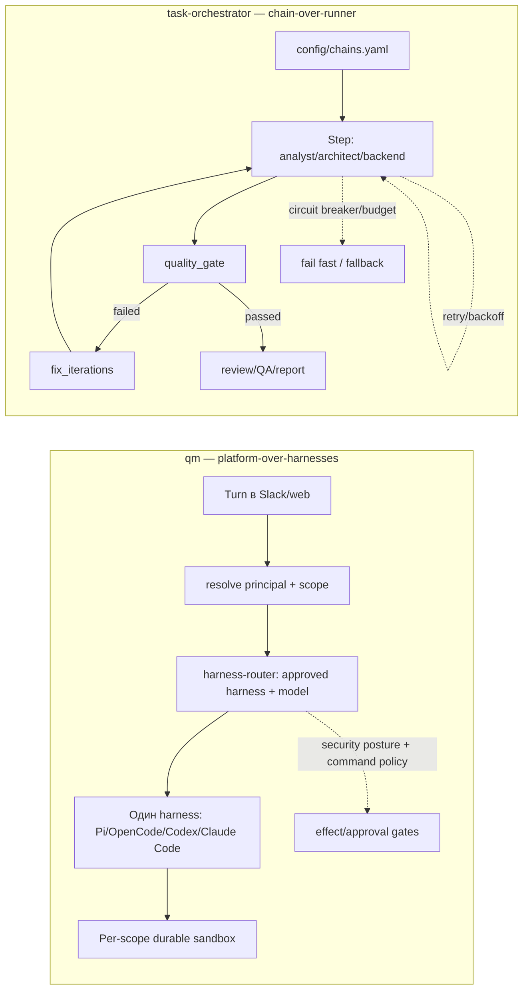

# Исследование: qm (yc-software/qm) — multiplayer/multi-tenant agent-платформа-оркестратор над внешними харнесами

> **Проект:** [github.com/yc-software/qm](https://github.com/yc-software/qm), npm [`@yc-software/qm`](https://www.npmjs.com/package/@yc-software/qm), [x.com/qm__dev](https://x.com/qm__dev)
> **Дата анализа:** 2026-08-14
> **Язык:** TypeScript (Node + Fastify; Slack через Bolt; web UI на Vite + Lit)
> **Лицензия:** MIT
> **Snapshot:** `main` `9ff90fc770d60658ae6c350b691204b5a5b3e394` (`pushed_at`: 2026-08-14T03:28:43Z; commit: `credits: record co-authors the squash merges dropped`)
> **npm `@yc-software/qm`:** `0.1.4` (published 2026-07-31) — это **deployment-CLI** (control-plane), а не runtime; описание пакета: *«Control-plane CLI for portable QM deployments on Docker, Fly, and AWS»*; 0 runtime-зависимостей.
> **GitHub metadata:** 13,475★, 1,583 forks, 214 open issues, created 2026-07-29, default branch `main`, topics: `ai`, `assistant`, `harness`, `qm`, description: *«Multiplayer agent harness for work»*.
> **Аналитик:** Аналитик (Шерлок)

---

## Терминологическая пометка

Далее англоязычные термины используются в таких значениях:

- **harness** — «упряжь»: внешний coding-агент (Pi, OpenCode, Codex, Claude Code), который выполняет agent loop; qm не дублирует loop, а направляет в него turn (ход).
- **multiplayer / multi-tenant** — модель, в которой каждый сотрудник получает изолированную область (scope) и работает независимо, сохраняя возможность совместной работы в общих каналах/проектах.
- **scope** — область видимости (личная человека или общая комната/проект) со своей памятью, файлами, keychain-вьюшкой, правами, cron'ами, веб-приложениями и durable sandbox.
- **security posture** — режим безопасности (Strict / Auto / Dangerous), задаваемый на уровне организации; вложенная область может только ужесточать его.
- **predeclared command policy** — заранее заданная политика команд: правила одобрения и жёсткие запреты (hard denials) для деструктивных операций; действует во всех режимах, включая Dangerous.
- **deployment directory** — каталог развёртывания: зафиксированная в git директория, содержащая конфигурацию организации, sandbox-слой и плагины; единственный интерпретатор — `qm` CLI.
- **substrate** — субстрат: реализация одного из контрактов (harness / session store / sandbox / memory), подключаемая через wiring-файл.
- **durable sandbox** — постоянная песочница: «свой компьютер» области, где установленные инструменты остаются установленными между запусками.
- **provenance-labelled** — данные, помеченные источником происхождения (user input, tool result, webhook, overheard), чтобы классификатор-скринер знал, какие данные проверять.
- **shadow / enforce rollout** — режимы внедрения внешнего скринера: `shadow` (сравнение с встроенным, без блокировки) и `enforce` (блокировка по решению прокси).
- **skill pack** — набор навыков, импортируемый из git-репозитория.

---

## 1. Обзор проекта

`qm` — это **multiplayer agent harness for work**: не отдельный агент и не LLM SDK, а **слой-платформа поверх внешних coding-агентов**. Суть продукта: каждый сотрудник организации получает изолированную область (scope) с собственной памятью, файлами, keychain-вьюшкой, правами, cron'ами, веб-приложениями и durable sandbox; поверх — Slack и web, а админка задаёт org-config, security posture и доступные harness'ы/модели. Любой turn (ход) проходит через единое ядро, которое направляет его в один из внешних harness'ов (Pi, OpenCode, Codex, Claude Code), а само ядро энфорсит identity, scope, grants, delivery и детерминированные effect-gate'ы вокруг него.

> ⚠️ **Классификация:** `qm` — не LLM SDK, не coding agent (агент программирования) и не декларативный chain-движок. Это **multiplayer/multi-tenant agent platform-оркестратор / harness-over-external-agents** (мультиплеерная/мультитенантная платформа-оркестратор поверх внешних харнесов): BYO harness + model, per-employee scopes, Slack/web-поверхности, per-scope durable sandbox, shared skills governance, security postures + command policy, deployment-directory контракт. Ближайший аналог в сводке — Orca ADE (#30, ADE/ручной харнес над внешними агентами), но qm — уровень выше: multi-tenant платформа с identity/delivery/sandbox, а не single-user desktop ADE.

### Архитектура

```text
┌───────────────────────────────────────────────────────────────┐
│ Surfaces (опциональные плагины над HTTP API ядра)               │
│ • web UI (Vite + Lit), admin panel, public portal               │
│ • Slack (in-process Bolt-плагин, ядро его стартует и держит)    │
└───────────────┬───────────────────────────────────────────────┘
                │ HTTP API (Fastify) / прямой service-client (Slack)
                ▼
┌───────────────────────────────────────────────────────────────┐
│ Headless core (generic TypeScript на Node)                      │
│ • API · identity · policy · scheduler                           │
│ • Agent loop = направление turn'а в один из harness'ов          │
│   (Pi, OpenCode, Codex, Claude Code) через harness-router       │
│ • Малый фиксированный tool-surface; инструмент `execute`         │
│   запускает команды в sandbox области                            │
│ • security-posture (Strict/Auto/Dangerous) + command-policy      │
└───────┬───────────────────────────────────────┬───────────────┘
        │                                       │
        ▼                                       ▼
┌──────────────────────────┐      ┌──────────────────────────────┐
│ Per-scope durable sandbox │      │ Postgres                      │
│ • files · tools            │      │ sessions · memory · queue      │
│ • залогиненные сервисы      │      │ deployment_layer · audit       │
│ • свои инструменты остаются │      └──────────────────────────────┘
└──────────────────────────┘
        ▲
        │ substrate: Docker / Fly (Machines) / AWS (ECS Fargate + Lambda MicroVM)
```

Каждый substrate (harness, session store, sandbox, memory) вынесен за интерфейс, поэтому production-реализации подключаются одним wiring-файлом. Всё специфичное для организации (org-config, кастомные tools/skills, sandbox-image, инфраструктура) живёт в **deployment directory**, который валидирует и разворачивает [`qm` CLI](https://github.com/yc-software/qm/blob/main/cli/README.md).

### Ключевые характеристики

| Характеристика | Значение |
| --- | --- |
| **Тип** | `multiplayer/multi-tenant agent platform-оркестратор` (платформа-оркестратор над внешними harness'ами) |
| **Модель выполнения** | `per-turn scope-resolved routing`: для turn'а резолвится principal + scope, выбирается одобренный harness + модель, harness выполняет agent loop, ядро энфорсит identity/scope/grants/delivery/gates вокруг него |
| **Поддерживаемые harness'ы** | Pi, OpenCode, Codex, Claude Code (все «drive the same core»); реализации в `src/harness/` (`pi-harness.ts`, `opencode-harness.ts`, `codex-harness.ts`/`codex-app-server.ts`, `claude-harness.ts`) + `mock-harness.ts` |
| **State management** | `persistent` (Postgres: sessions, memory, queue, `deployment_layer`, audit); per-scope workspace/files/keychain-view; durable sandbox с immutable digest-pinned rootfs |
| **Surfaces** | web UI (Vite + Lit), admin, public portal (опциональные плагины над HTTP API); Slack (in-process Bolt-плагин) |
| **Security postures** | Strict (HITL на каждый tool call) / Auto (дефолт; классификатор скринит provenance-labelled external data + tool results) / Dangerous (без скрининга и пауз); predeclared command policy действует во всех режимах |
| **Skills** | scope-owned, shareable by grant, admin-gated promotion to org, skill packs из git; формат `SKILL.md` (frontmatter `name`+`description`); 19 seed-навыков в `skills-seed/` |
| **Background work** | crons и watches (выполняют работу, пока никто не смотрит) |
| **Stack** | Node + Fastify (HTTP), Bolt (Slack), Vite + Lit (web), Postgres; `qm` CLI (TypeScript, 0 runtime-зависимостей, shells out to Docker/Flyctl/AWS CLI/Git) |

---

## 2. Возможности оркестрации — обзор

| Функция | qm |
| --- | --- |
| **Chain / DAG engine** | ❌ Нет декларативных YAML-chain steps; единица работы — turn (ход), направляемый в один harness |
| **Multi-harness abstraction** | ✅ First-class: Pi/OpenCode/Codex/Claude Code за одним интерфейсом (`HarnessTurnInput`/`HarnessTurnResult`); `harness-router` резолвит одобренный harness + модель per scope |
| **Per-turn scope resolution** | ✅ Для каждого turn'а резолвится principal и scope; ядро энфорсит identity, scope, grants, audience checks, delivery |
| **Multi-tenant isolation** | ✅ Каждый сотрудник/комната — изолированная область (память, файлы, keychain-view, права, crons, web apps, durable sandbox) |
| **Security posture composition** | ✅ Org-floor + scope-can-only-tighten (`composeSecurityPosture`, `composePolicy`); predeclared command policy с hard denials во всех режимах |
| **Content screening** | ✅ Auto: классификатор скринит provenance-labelled external data + tool results; внешний screening-proxy контракт (shadow/enforce); fail-closed при недоступности |
| **Durable per-scope sandbox** | ✅ Свой «компьютер» области; установленные инструменты остаются; immutable digest-pinned rootfs; substrates: Docker / Fly / AWS (ECS Fargate + Lambda MicroVM) |
| **Shared skills governance** | ✅ scope-owned + grant-sharing + admin-gated org-promotion + git skill packs + frontmatter-validation + collision/sync-engine |
| **Background work** | ✅ crons и watches |
| **Quality gates** | ❌ Нет task-orchestrator-style chain-level deterministic gates как runtime primitive; эквивалент — effect-gate'ы и approval-gate вокруг harness tool-call'ов |
| **Retry / backoff** | ⚠️ Platform-level bounded backoff есть только в узких местах (например, throttled screening-запросы повторяются с bounded backoff внутри классификации); **нет universal runner-/chain-level retry/backoff** для agent steps — loop делегирован harness'ам |
| **Circuit breaker** | ❌ Нет аналога `CircuitBreakerAgentRunnerService` на уровне runner/chain |
| **Budget control** | ❌ Нет orchestrator-level budget для chain steps; spend-checks есть на уровне browser-runner и sandbox-credentials |
| **JSONL audit trail** | ❌ Нет chain-level JSONL audit; есть audit-события в Postgres (security-relevant actions, deployment_layer, admin content reads) |
| **`fix_iterations`** | ❌ Нет bounded implement/review/fix loops как runtime primitive |
| **DDD / Clean Architecture** | ❌ Не применимо: TypeScript platform с модулями в `src/` (harness, sandbox, skills, security, policy, sessions, memory, cron, connectors, ...), не DDD library |
| **Extensibility** | ✅ Harness interface + harness-router, sandbox substrates за интерфейсами, skill packs из git, deployment directory контракт, plugin surfaces, `@yc-software/qm/contract` для conformance-тестов |

---

## 3. Ключевые механизмы

### 3.1 🟡 Multi-harness abstraction за одним интерфейсом

**Что у них:** README формулирует ядро так: *«Pi, OpenCode, Codex, and Claude Code all drive the same core, so a deployment isn't tied to any single vendor»*. В исходниках (`src/harness/`) это материализовано:

- интерфейс контракта `Harness` с `HarnessTurnInput` / `HarnessTurnResult` (`harness.ts`): turn получает session, history, tools (`ToolContext`), system prompt, model, callbacks (`emit`, `tape`, `onProgress`, `onDelta`) и gate'ы (`toolApprovalGate`, `screenExternalContent`, `screenToolResult`); возвращает `reply`, `pendingApprovals`, `pausedOnApproval`, `modelCalls`, `cacheUsage`;
- реализации под каждого агента: `pi-harness.ts` (+ `pi-tools.ts`), `opencode-harness.ts` (+ `opencode-plugin.ts`), `codex-harness.ts` (+ `codex-app-server.ts`), `claude-harness.ts`, плюс `mock-harness.ts` для тестов и `replay.ts`/`tape-fold.ts` для воспроизведения;
- `harness-router.ts` (`resolveRuntimeChoice` / `resolveRuntimeChoiceDurable`): резолвит `RuntimeChoice { harnessId, modelId }` из approved-harnesses + org base + scope-override + явного запроса; не-approved/не-supported runtime бросает `NonRetryableTurnError` (fail-fast);
- вспомогательные: `context-compaction.ts` (platform-level контекстные сводки), `goal.ts`, `grind.ts`.

**Оркестрационная значимость:** qm не дублирует agent loop — он **абстрагирует выбор и запуск harness'а**, оставляя за собой identity/scope/grants/delivery/gates. Это «control plane над BYO coding-агентами»: добавление нового harness'а = реализация контракта `Harness` + регистрация в approved-списке, без переписывания loop'а.

**Сравнение с task-orchestrator:** это **прямой мост к нашему coding-agents-эпику и runner-модели**. Наш `AgentRunnerInterface` + `config/chains.yaml` (runner-профиль = внешний CLI) — та же идея (запускаем внешний CLI, не дублируем LLM), но у нас runner встроен в автоматизированную chain execution, а у qm — в per-turn платформенную маршрутизацию с policy-энфорсментом. Самое ценное для заимствования: **единый interface + router, резолвящий approved-runner+модель per scope, с fail-fast на не-approved runtime**.

### 3.2 🟡 Security postures + predeclared command policy

**Что у них** (`src/security/security-posture.ts`, `src/policy/command-policy.ts`):

- `SECURITY_POSTURES = ["dangerous", "auto", "strict"]`. `resolveSecurityPolicy` отображает posture в `ResolvedSecurityPolicy { inboundScreening: "off"|"external", toolApprovals: "none"|"all" }`:
  - **Strict** — `toolApprovals: "all"` (каждый tool call встаёт на паузу для человеческого одобрения, кроме двух no-effect turn-эндеров);
  - **Auto** (дефолт) — `inboundScreening: "external"` (классификатор скринит provenance-labelled external data и tool results до попадания в модель);
  - **Dangerous** — без скрининга и пауз.
- `composeSecurityPosture(orgFloor, scope?)` — вложенная область может только **ужесточать** org-floor (`POSTURE_RANK: dangerous < auto < strict`).
- **Predeclared command policy** (`ORG_FLOOR_RULES`) действует во **всех** режимах, включая Dangerous:
  - recursive delete (`rm ... -r`/`--recursive`) → `require_approval`;
  - `git push --force` → `require_approval`;
  - `drop/truncate table` → `require_approval` (destructive SQL);
  - `mkfs` / fork-bomb `:(){...` → `deny` (hard denial);
  - `curl ... | sh/bash` → `require_approval` (pipe-to-shell).
- `composePolicy(orgFloor, scope?)` — scope может только дополнять правила; `mode: denylist|allowlist`; решения `allow | deny | require_approval`.
- Screening-классификатор: встроенный model-classifier в Auto, либо внешний `securityScreen` proxy (HTTPS, `shadow`/`enforce`, chunked: ≤16k chars, 1.6k overlapping chunks, ≤2 in flight). `parseSecurityScreenVerdict` — fail-closed: некорректный/отсутствующий вердикт → Strict.
- `SECURITY_SCREEN_SYSTEM_PROMPT` — детальный промпт-классификатор: различает обычный бизнес-запрос и инъекцию/эксфильтрацию, с источниками (`sender`, `tool_result:<name>`, `conversation-header`).

**Оркестрационная значимость:** Это **defense-in-depth с композицией «только ужесточение»** и **hard denials, не отключаемые никаким режимом**. SECURITY.md честно фиксирует пределы: command policy bypassable (это «speed bump», не sandbox), screening неполный/эвристический, sandbox-credentials plaintext-in-use, audience-floor имеет дыры, egress-энфорсмент условный. Это зрелая и честная модель.

**Сравнение с task-orchestrator:** релевантно нашему контуру sandboxing/approval gates (`TASK-feat-docker-sandboxing`, quality gates). Самое ценное: **(а)** композиция org-floor + scope-can-only-tighten (нельзя «разрешить» ниже орг-пола); **(б)** predeclared floor с hard denials (mkfs/fork-bomb), действующий всегда; **(в)** модель решений `allow/deny/require_approval` для approval-gate.

### 3.3 🟡 Deliberately-out-of-agent actions («стены, а не дыры»)

**Что у них:** SECURITY.md выделяет три действия, намеренно исключённые из agent self-API (хотя они есть в web-портале):

- **изменение admin-grants** — только в портале, на turn'е аутентифицированного админа (иначе prompt-injected агент мог бы эскалировать свои привилегии);
- **имперсонация** — агент всегда действует от principal, резолвленного для turn'а; никакого self-API «действовать как другой»;
- **решения по одобрению команд** — это human-judgment на turn'е одобряющего; agent-reachable approval-route схлопнул бы HITL-gate в одно model-решение.

Общий принцип: *каждое из этих решений авторизует **будущее** поведение агента, поэтому само решение должно прийти извне агента*. Эти ограничения выглядят как «parity gaps» в аудите, но это **стены, а не дыры**, и их нельзя «чинить» без пересмотра логики.

**Сравнение с task-orchestrator:** ценный design-principle для наших approval gates: решения, авторизующие будущие действия агента (повышение прав, смена identity, авто-одобрение), не должны быть агент-достижимы. Это уточняет границы HITL в нашем sandboxing-контуре.

### 3.4 🟡 Deployment directory контракт (generic core + org-слой)

**Что у них** (`cli/README.md`, `docs/deploy-directory.md`): qm-ядро generic; всё специфичное для организации живёт в **deployment directory**, единственный интерпретатор которого — `qm` CLI. Контракт:

- **Layout:** `qm.config.jsonc` (committed, без секретов), `package.json` (пинит точную версию `@yc-software/qm`, что была при scaffold'инге; `contract: 1` — только compatibility floor), `deployment.md` + `.codex/skills/deploy-qm/` (материализованный agent-runbook), `.env.example`/`.env`, `slack-app-manifest.yml`, `sandbox/` (`Dockerfile`, `tools/<id>/tool.json`+`<binary>`, `skills/<id>/SKILL.md`+text-assets), `plugins/<name>/Dockerfile`, `infra/`.
- **`qm` CLI** (`@yc-software/qm`): standalone deployment-CLI, **не runtime**; деплоит long-running QM-сервисы на Docker / Fly / AWS (ECS Fargate ARM64 + Lambda MicroVM agent computers); 0 runtime-зависимостей, shells out to Docker/Flyctl/AWS CLI/Git.
- **Команды:** `init`, `check` (static, no network, JSON keyed to clause ids), `doctor` (read-only external), `infra render/build-image/...`, `conformance`, `plan`, `up [--yes]`, `slack render`, `outputs`, `proof`, `secrets push`, `status`, `logs`, `down`, `rollback`, `sandbox build/publish`.
- **Contract clauses** с явным статусом `ENFORCED` / `VALIDATED-ONLY` / `RESERVED`: `config.v1`, `config.no-secret-values`, `secrets.computed-set`, `sandbox.descriptors`, `sandbox.approvals-tighten`, `runtime.layer-resolved`, `aws.rendered-task`, `aws.live-drift`, `sandbox.aws-substrate`, `target.provider-registry` — ENFORCED; `sandbox.egress` — VALIDATED-ONLY (runtime-энфорсмент явно не заявлен); `extension.deployment-data-proxy` — RESERVED.
- **`@yc-software/qm/contract`** — semver-stable программный surface для conformance-тестов (config-loading, layer-validation/parsing, env-derivation, approval-compilation, contract-version). Несовместимое изменение каталога = bump contract major.
- **Tool descriptors:** approvals могут **только ужесточать** (deny/require_approval для своего tool, никогда allow/loosen). Raw approval-паттерны обязаны начинаться с `\b<binary-or-id>\b`. Skills требуют `name`+`description` frontmatter.
- **Deployment-layer store:** Postgres-таблица `deployment_layer`, версионирование по каноническому SHA-256 content-hash, audit-event, source-authenticated `PUT/GET /v1/deployment-layer`; immutable digest-pinned образы (не mutable теги).
- **AWS rollback:** `rollback` восстанавливает code+config единым юнитом под deploy-lease и печатает pre-deploy RDS-snapshot (дата восстанавливается оператором отдельно).

**Оркестрационная значимость:** Это **референс разделения generic-core / org-слой с interface-backed субстратами и явным статусом контракта**. `qm init` материализует deployment-skill для агента, который проходит инфраструктуру/веб-вход/connector-credentials/Slack/deploy/verify — без checkout'а исходников. Особенно ценна модель **clause status**: ENFORCED (код rejecting/тестирует сегодня) / VALIDATED-ONLY (проверяется, но runtime-энфорсмент явно отсутствует) / RESERVED (слот совместимости без заявленной реализации).

**Сравнение с task-orchestrator:** релевантно нашему разделению config/deploy и module-системе (`src/Component/ModuleSystem/`, `config/`). Перенимаема не реализация (TS/AWS/Fly), а принципы: **(а)** generic-core + committed org-слой за одним интерпретатором; **(б)** interface-backed субстраты (harness/session-store/sandbox/memory) подключаются wiring-файлом — прямая аналогия нашим runner/module-интерфейсам; **(в)** явный contract-version + clause-status вместо неявных «джентльменских» соглашений.

### 3.5 🟡 Shared skills governance (scope-owned + grant + org-promotion + git packs)

**Что у них:** README: *«Skills are scope-owned and shareable by grant, with admin-gated promotion to the whole org and skill packs imported from git repositories»*. В исходниках (`src/skills/`):

- `frontmatter.ts` — валидация (требуется `name`+`description`); `normalize.ts`; `skill-name.ts`; `skill-collision.ts` (разрешение коллизий);
- `pack-fetcher.ts` + `skill-pack-store.ts` + `skill-bundle-store.ts` — импорт skill-packs из git, хранение;
- `materialize.ts` + `materialization-paths.ts` — материализация навыков в sandbox области;
- `skill-sync-engine.ts` — синхронизация; `ingest.ts`; `seed.ts`.
- **19 seed-навыков** в `skills-seed/`: `admin`, `browse`, `cloud-cli`, `connect-apps`, `dropbox`, `email-draft-in-voice`, `email-voice-profile`, `github-gitlab`, `google-drive-sheets`, `google-workspace`, `interactive-login`, `linear`, `memory`, `morning-digest`, `popular-web-designs`, `publish`, `slack-drafts`, `taste-skill`, `use-shared-credential`.
- Формат: `SKILL.md` (YAML frontmatter + markdown body), discovery из нескольких мест, валидация frontmatter. Sandbox-skills доставляются text-assets; binaries — в образ.

**qm как consumer, не producer skill-runtayme:** сам qm **потребляет** те же конвенции, что и наш проект: `.codex/skills/{deploy-qm, dev-instance, update-qm, upstream-pr}`, `.claude/skills/{dev-instance, update-qm, upstream-pr}`, `AGENTS.md`, `CLAUDE.md` (one-line include `@AGENTS.md`). Это навыки, **учащие внешних агентов оперировать qm** (деплоить, обновлять private-fork, слать upstream PR), а не определяющие агент-рантайм.

**Сравнение с task-orchestrator:** богатая параллель нашим skills (`docs/agents/skills/` + `SKILL.md` + meta-skill `become-role`) и роли `docs/agents/roles/team/*`. Самое ценное для заимствования: **(а)** scope-ownership + grant-sharing (навык принадлежит области, делится по разрешению); **(б)** admin-gated promotion to org (повышение личного навыка до орг-уровня через gate); **(в)** git skill-packs (импорт наборов навыков из репозитория) — развитие нашей идеи installable skill; **(г)** frontmatter-validation + collision-handling + sync-engine (инженерная зрелость реестра навыков).

### 3.6 🟡 Per-scope durable sandbox

**Что у них:** README: *«one of those tools is `execute`, which runs commands in the scope's own isolated sandbox — its durable computer, where installed tools stay installed»*. В исходниках (`src/sandbox/`):

- substrates: `local-sandbox.ts`, `docker-exec.ts`, `aws-sandbox.ts` (Lambda MicroVM), `sprites-sandbox.ts` (Fly Machines), `smolmachines-sandbox.ts`;
- `ro-layers.ts` (read-only слои), `sandbox-routing.ts`, `sandbox-env.ts`, `sandbox-migrate.ts` + `sandbox-migration-runner.ts` (миграции), `tar.ts`, `await-process-exit.ts`, `exec-process-session.ts`, `process-poll.ts` (liveness).

Каждая область имеет свой durable sandbox; образы — immutable, digest-pinned (не mutable теги). AWS: `sandbox.backend: "sprites"` (operator-published layer-image) или `"aws"`/default (Lambda MicroVM image/version). `sandbox publish` пушит OCI-образ, резолвит immutable digest, записывает pin в config/durable manifest.

**Сравнение с task-orchestrator:** релевантно `TASK-feat-docker-sandboxing`. Перенимаемы принципы: **(а)** durable, scope-изолированный sandbox как «свой компьютер» области; **(б)** immutable digest-pinned rootfs (никаких mutable тегов); **(в)** read-only слои + миграции sandbox-состояния. Сама multi-backend реализация (Docker/Fly/AWS) — out of scope для нашего single-tenant CLI.

### 3.7 🟡 Background work (crons/watches) и dependency cooldown

**Что у них:** README: *«Crons and watches run work while nobody's watching»*. В `src/cron/`, `src/wake/`, `src/triggers/` (`run-trigger.ts`, `trigger-store.ts`, `consent-notice.ts`, `edit-notice.ts`, `keychain-ask.ts`, `provenance.ts`). Отдельно — supply-chain defense: `.npmrc` с `min-release-age=7` (новые npm-версии должны «отлежаться» 7 дней перед входом в lockfile), `.node-version` pin; CI ставит через `npm ci` из committed lockfiles и не подвержен cooldown.

**Сравнение с task-orchestrator:** crons/watches — концептуальная параллель для будущих recurring chain execution (см. также Orca Automations, Oz cron, Duet cron-tool, Multica autopilot). Dependency cooldown — полезный supply-chain паттерн, ортогональный к нашему PHP/Composer-стеку (но идея «возраст новой зависимости перед lockfile» применима через Composer `--no-update`/audit).

---

## 4. Сравнение с task-orchestrator

| Критерий | qm | task-orchestrator | Вывод |
| --- | --- | --- | --- |
| **Orchestration model** | Per-turn scope-resolved routing одного turn'а в один из внешних harness'ов поверх multi-tenant платформы; background crons/watches | YAML chains (`config/chains.yaml`), static/dynamic chain execution, `DynamicLoop`, `run-subagent`/`task-via-subagents` | qm = platform-over-harnesses (per-turn); мы = chain-over-runner (multi-step). Комплементарные уровни |
| **State management** | Postgres (sessions, memory, queue, `deployment_layer`, audit); per-scope workspace/keychain/durable sandbox | Chain context/payload, JSONL audit trail, task files, Git branch под контролем оркестратора | qm сильнее в persistent multi-tenant state; мы — в chain-level machine-readable JSONL audit |
| **Error handling** | Platform-level: audit, scope isolation, security screening fail-closed, command policy; **нет universal runner-/chain-level retry/backoff/CB/budget/fix_iterations** для agent steps (loop делегирован harness'ам); bounded backoff только в узких местах (throttled screening) | Retry with backoff, circuit breaker, fallback routing, quality gates, budget control, `fix_iterations` | Наш resilience-stack существенно сильнее на chain/runner-уровне; qm не dependency |
| **Extensibility** | Harness interface + harness-router, sandbox substrates за интерфейсами, skill packs из git, deployment directory контракт, plugin surfaces, `@yc-software/qm/contract` | Role files, skills, runner configs, Symfony DI, DDD modules | Заимствовать multi-harness interface+router, skills governance, deployment contract, command policy |
| **Applicability** | Multi-tenant TS/Node SaaS-платформа (Slack/web/admin), self-hosted в облаке оператора | Single-tenant PHP/Symfony CLI/library chain-оркестратор, CI/server-first | Прямой перенос невозможен; только patterns |

### 4.1 Где qm сильнее

- **Multi-harness abstraction:** Pi/OpenCode/Codex/Claude Code за одним интерфейсом (`Harness`), с router'ом (`resolveRuntimeChoice`), резолвящим approved harness+модель per scope, и fail-fast (`NonRetryableTurnError`) на не-approved runtime.
- **Security posture composition:** org-floor + scope-can-only-tighten; predeclared command policy с hard denials (mkfs/fork-bomb), действующими во всех режимах; fail-closed screening; честная threat-model с known limitations.
- **Shared skills governance:** scope-owned + grant-sharing + admin-gated org-promotion + git skill packs + frontmatter-validation + collision/sync-engine — наиболее зрелая инженерия реестра навыков в исследовании.
- **Deployment directory контракт:** generic core + committed org-слой за одним интерпретатором; interface-backed substrates; явный clause-status (ENFORCED/VALIDATED-ONLY/RESERVED); immutable digest-pinned образы; SHA-256-versioned deployment-layer store.
- **Per-scope durable sandbox:** изолированный «компьютер» области, где инструменты остаются установленными; immutable rootfs.
- **Threat-model honesty:** «deliberately portal-only actions» как design-principle (стены, а не дыры).

### 4.2 Где task-orchestrator сильнее

- **Chain-level deterministic execution:** YAML chains, шаги, роли, явная последовательность.
- **Resilience-stack:** retry with backoff, `CircuitBreakerAgentRunnerService`, fallback routing — всего этого нет на qm core (loop делегирован harness'ам).
- **Quality gates:** детерминированные shell-проверки в цепочках.
- **Budget control:** chain/step-бюджет.
- **`fix_iterations`:** bounded implement/review/fix loops.
- **JSONL audit trail:** chain-level machine-readable trace.
- **Clean Architecture / DDD:** PHP/Symfony-модули с границами Domain/Application/Infrastructure.
- **CI/server-first posture:** CLI/library — primary, а не Slack/web-платформа.

### 4.3 Mermaid-сопоставление



---

## 5. Сравнение с ближайшими аналогами

| Критерий | qm (#32) | Orca ADE (#30) | OmO (#23) | bx-dev (#31) |
| --- | --- | --- | --- | --- |
| **Тип** | Multi-tenant agent platform-оркестратор над внешними harness'ами | Desktop/mobile ADE (manual parallel-agent harness) | Plugin-оркестратор поверх OpenCode | Codex-skill/manual workflow harness |
| **Тенантность** | Multi-tenant (per-employee scopes, Slack/web/admin) | Single-user desktop/mobile | Single-user (внутри OpenCode) | Single-user session |
| **Harness'ы** | Pi/OpenCode/Codex/Claude Code (один интерфейс + router) | Any CLI agent (BYO), fan-out в worktrees | OpenCode (+ расширения) | Codex |
| **Изоляция** | Per-scope durable sandbox (Docker/Fly/AWS) | `git worktree` per task/agent | Сессия OpenCode | Session branch + `.bx-dev/` state |
| **Параллелизм** | Multi-user concurrency + background crons/watches | Fan-out 1 prompt → N agents → merge winner | Team Mode: Lead + 8 members | Sequential single-shot subagents |
| **Security** | Strict/Auto/Dangerous + command policy (hard denials always) + fail-closed screening | Manual recovery/rerun; experimental dispatch-level retry/CB | (наследовано от OpenCode) | Strict flags + MERGE-PROTOCOL |
| **Skills** | scope-owned + grant + admin-gated org-promotion + git packs | Installable Orca Skills | Skill-Embedded MCPs | 105 support skills / 9 categories |
| **Resilience** | Platform-level; нет runner-/chain-level retry/CB/budget/fix_iterations | Нет universal retry/CB; experimental dispatch-level после 3 failures | Runtime fallback + doom-loop detection | Fail-fast + bounded review rounds; нет retry/CB/budget |
| **Applicability to us** | Patterns: multi-harness interface+router, security posture+command policy, skills governance, deployment contract, durable sandbox | Patterns: fan-out comparison, worktree monitoring, BYO ergonomics | Patterns: IntentGate, Skill-Embedded MCPs | Patterns: session-state, strict flags, MERGE-PROTOCOL |

**Вывод по аналогам:** qm — ближайший к Orca ADE по идеи «абстрагировать внешние coding-агенты», но **уровень выше**: вместо single-user desktop ADE с worktree fan-out — multi-tenant платформа с identity/scope/delivery/durable-sandbox, Slack/web/admin и skills governance. От OmO отличается осью: OmO — in-loop координация внутри одного harness'а (Team Mode, IntentGate), qm — platform-level tenancy/identity/delivery поверх нескольких harness'ов. От bx-dev — масштабом: bx-dev — single-user Codex-skill dev-session harness, qm — multi-tenant платформа над четырьмя harness'ами. Дельта qm vs Orca: **multiplayer/multi-tenant + Slack/web + per-scope durable sandboxes + shared skills governance + security postures + deployment-directory контракт**. Дельта по resilience у всех одна: ни у кого нет нашего chain-level retry/CB/budget/fix_iterations/JSONL.

---

## 6. Сводка по заимствованию

| Возможность | Статус для task-orchestrator | Описание |
| --- | --- | --- |
| Multi-harness interface + router | 🟡 P2 | Один интерфейс над Pi/Codex/Claude Code/OpenCode + router, резолвящий approved runner+модель, fail-fast на не-approved. Прямой мост к coding-agents-эпику и runner-архитектуре |
| Security posture composition (org-floor + tighten-only) | 🟡 P2/P3 | Org-floor posture + scope-can-only-tighten для approval-gate/quality-gate-уровней; релевантно sandboxing/approval gates |
| Predeclared command policy floor (hard denials) | 🟡 P2 | ORG_FLOOR_RULES-паттерн (recursive delete/force push/destructive SQL/curl\|sh → require_approval; mkfs/fork-bomb → deny), действующий всегда; релевантно `TASK-feat-docker-sandboxing` и approval gates |
| Shared skills governance | 🟡 P3 | scope-owned + grant-sharing + admin-gated org-promotion + git skill packs + frontmatter-validation + collision/sync-engine; развитие наших `SKILL.md`/`become-role` и будущей shared-skill-таксономии |
| Deployment directory контракт | 🟡 P3 | generic-core + committed org-слой + interface-backed substrates + явный clause-status (ENFORCED/VALIDATED-ONLY/RESERVED); референс config/deploy-разделения и module-system |
| Per-scope durable sandbox + immutable image pins | 🟡 P3 | durable scope-изолированный sandbox + immutable digest-pinned rootfs; релевантно `TASK-feat-docker-sandboxing` |
| Provenance-labelled content screening (fail-closed) | 🟡 P3 | Auto-классификатор с fail-closed enforcement + shadow/enforce rollout + внешний proxy-контракт; обработка untrusted data в approval gates |
| Deliberately-out-of-agent actions («стены, не дыры») | 🟡 P3 | design-principle: решения, авторизующие будущее поведение агента (повышение прав, смена identity, авто-одобрение), не агент-достижимы; уточняет границы HITL |
| Background crons/watches | 🟡 P3 | концепция для будущих recurring chain execution (перекликается с Orca/Oz/Duet/Multica) |
| Skill pack import из git | 🟡 P3 | развитие идеи installable skill (см. Agent Skills #28, Orca #30) |
| Multi-tenant Slack/web/admin-платформа | 🔴 — | Не переносить: принципиально избыточно для single-tenant PHP/Symfony CLI |
| Postgres/Bolt/Vite/Lit/AWS/Fly-стек | 🔴 — | Не переносить: другой язык/экосистема/инфраструктура |
| Runtime dependency | 🔴 — | Не зависеть от qm: multi-tenant TS/Node SaaS-платформа, не PHP/Symfony single-tenant chain-оркестрация |

### Concrete patterns (8) для возможного заимствования

1. **Multi-harness `Harness` interface + `resolveRuntimeChoice` router (P2):** единый контракт turn→harness с approved-списком runner+модель и `NonRetryableTurnError` fail-fast на не-approved runtime; прямой мост к coding-agents-эпику.
2. **Security posture composition (P2/P3):** org-floor + scope-can-only-tighten (`composeSecurityPosture`/`composePolicy`); для нашего approval-gate/quality-gate.
3. **Predeclared command-policy floor с hard denials (P2):** `ORG_FLOOR_RULES`-паттерн (recursive delete, force push, destructive SQL, curl\|sh → require_approval; mkfs/fork-bomb → deny), действующий во всех режимах; для `TASK-feat-docker-sandboxing`.
4. **Решения `allow/deny/require_approval` для approval-gate (P2):** явная модель решений + raw-паттерны, обязанные начинаться с `\b<binary>\b`; scope может только ужесточать.
5. **Shared skills governance (P3):** scope-ownership + grant-sharing + admin-gated org-promotion + git skill-packs + frontmatter-validation + collision/sync-engine; для развития `docs/agents/skills/` и `become-role`.
6. **Deployment-directory контракт + clause-status (P3):** generic-core + committed org-слой + interface-backed substrates + явный статус контракта (ENFORCED/VALIDATED-ONLY/RESERVED); референс для `config/`/module-system.
7. **Per-scope durable sandbox + immutable image pins (P3):** scope-изолированный durable sandbox + immutable digest-pinned rootfs + read-only слои; для `TASK-feat-docker-sandboxing`.
8. **Deliberately-out-of-agent actions (P3):** design-principle «стены, не дыры» — решения, авторизующие будущее поведение агента, не агент-достижимы; уточняет границы HITL в нашем sandboxing-контуре.

---

## 7. Вердикт

**Итоговый verdict:** 🟡 **заимствовать отдельные паттерны**, 🔴 **не использовать как dependency**.

**Почему заимствовать:** qm — наиболее зрелая в исследовании реализация **multi-harness abstraction за одним интерфейсом с policy-энфорсментом вокруг неё**. Его `Harness`-контракт + `harness-router`, композиция security-posture «только ужесточение» с always-on hard denials, зрелый реестр skills (scope-owned + grant + org-promotion + git packs + валидация), deployment-directory контракт с явным clause-status и durable per-scope sandbox — релевантные источники паттернов для нашего coding-agents-эпика, runner-архитектуры, sandboxing-контура и skills-системы. Особенно ценен принцип «deliberately-out-of-agent actions» для проектирования HITL-границ.

**Почему не dependency:**

- **Stack mismatch:** TypeScript/Node + Fastify/Bolt/Vite/Lit + Postgres vs PHP 8.4/Symfony 8/DDD.
- **Product mismatch:** multi-tenant Slack/web/admin SaaS-платформа для команд vs single-tenant CI/server-first chain-оркестратор-library.
- **Resilience mismatch:** у qm core **нет** universal runner-/chain-level retry/backoff/circuit breaker/quality gates/budget/`fix_iterations` — loop делегирован harness'ам; bounded backoff есть лишь в узких местах (throttled screening). Наш resilience-stack — сильная сторона, не закрытая qm.
- **Scope mismatch:** multiplayer/multi-tenant (per-employee workspaces, Slack/web, org-admin) принципиально избыточен для нашей single-tenant chain-модели.
- **CLI ≠ runtime:** npm `@yc-software/qm` — это deployment-CLI (control-plane), а не встраиваемый runtime; интеграция невозможна технически.

**Bottom line:** qm — сильный reference-design для **multi-harness платформы с policy-энфорсментом и skills-governance**, а не runtime-foundation для `task-orchestrator`. Самые ценные заимствования — multi-harness interface+router и security-posture/command-policy — должны ложиться на нашу существующую chain/resilience-модель, а не заменять её.

---

## 8. Указатель источников для деталей

- [GitHub repository metadata](https://api.github.com/repos/yc-software/qm) — license/stars/forks/issues/topics; snapshot commit `9ff90fc770d60658ae6c350b691204b5a5b3e394`.
- [README.md](https://github.com/yc-software/qm/blob/main/README.md) — What is QM, features (scopes, Slack+web, admin, web apps, shared skills, background work), multi-harness модель, architecture (Postgres ↔ core ↔ sandbox), security postures, deployment (deployment repo vs private fork), `qm init`.
- [`cli/README.md`](https://github.com/yc-software/qm/blob/main/cli/README.md) — `qm` CLI, deployment-directory layout, commands, package contract (`@yc-software/qm/contract`).
- [`docs/deploy-directory.md`](https://github.com/yc-software/qm/blob/main/docs/deploy-directory.md) — normative contract: layout, configuration, security-screen proxy, secrets, tool descriptors, delivery/pins, targets/prerequisites, commands/conformance/versioning, clause status.
- [`SECURITY.md`](https://github.com/yc-software/qm/blob/main/SECURITY.md) — threat model, scope, protected assets/actors, trust boundaries, deliberately portal-only actions, known limitations, dependency cooldown.
- [`src/harness/harness.ts`](https://github.com/yc-software/qm/blob/main/src/harness/harness.ts), [`harness-router.ts`](https://github.com/yc-software/qm/blob/main/src/harness/harness-router.ts) — `Harness`/`HarnessTurnInput`/`HarnessTurnResult` + `resolveRuntimeChoice`.
- [`src/security/security-posture.ts`](https://github.com/yc-software/qm/blob/main/src/security/security-posture.ts), [`src/policy/command-policy.ts`](https://github.com/yc-software/qm/blob/main/src/policy/command-policy.ts) — postures, `composeSecurityPosture`/`composePolicy`, `ORG_FLOOR_RULES`.
- [`src/skills/`](https://github.com/yc-software/qm/tree/main/src/skills), [`skills-seed/`](https://github.com/yc-software/qm/tree/main/skills-seed) — skills governance (frontmatter/pack-fetcher/collision/sync) и 19 seed-навыков.
- [`src/sandbox/`](https://github.com/yc-software/qm/tree/main/src/sandbox) — substrate backends (docker/aws/sprites/smolmachines/local), ro-layers, migrations.
- [`CONTRIBUTING.md`](https://github.com/yc-software/qm/blob/main/CONTRIBUTING.md), [`AGENTS.md`](https://github.com/yc-software/qm/blob/main/AGENTS.md) — модель контрибуции (human-written text в `adrs/`), zero-comments policy, review-процесс.
- [`@yc-software/qm` — npm](https://www.npmjs.com/package/@yc-software/qm) — `0.1.4`, deployment-CLI, MIT, 0 runtime-deps.

📚 **Источники:**
1. [github.com/yc-software/qm](https://github.com/yc-software/qm) — repository metadata и source snapshot.
2. [README.md](https://github.com/yc-software/qm/blob/main/README.md) — product intent, features, multi-harness модель, architecture, security postures, deployment.
3. [cli/README.md](https://github.com/yc-software/qm/blob/main/cli/README.md) + [docs/deploy-directory.md](https://github.com/yc-software/qm/blob/main/docs/deploy-directory.md) — deployment-directory контракт и `qm` CLI.
4. [SECURITY.md](https://github.com/yc-software/qm/blob/main/SECURITY.md) — threat model, postures, known limitations, deliberately portal-only actions.
5. [src/harness/](https://github.com/yc-software/qm/tree/main/src/harness) + [src/security/](https://github.com/yc-software/qm/tree/main/src/security) + [src/policy/](https://github.com/yc-software/qm/tree/main/src/policy) — multi-harness abstraction, security-posture и command-policy в коде.
