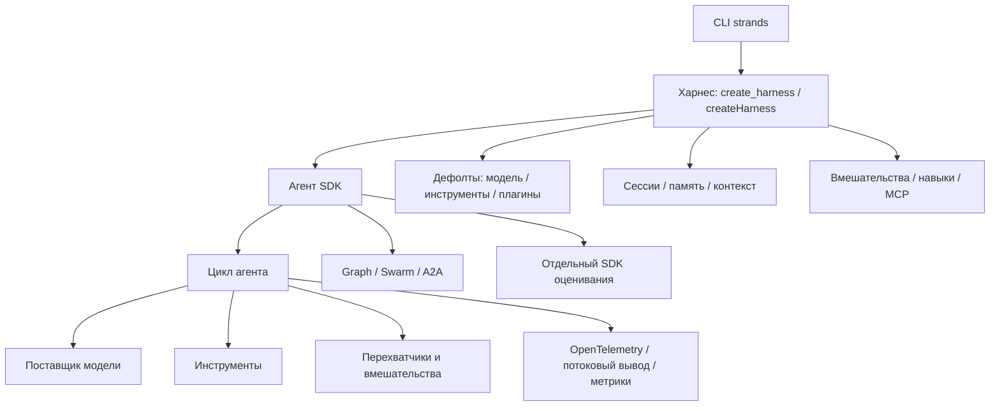

# Исследование Strands Agents Harness SDK: встроенный цикл агента и собранный харнес

> **Проект:** [`strands-agents/harness-sdk`](https://github.com/strands-agents/harness-sdk) — монорепозиторий харнеса Strands, SDK для Python и TypeScript, интерфейс командной строки (CLI) и SDK оценивания
> **Дата анализа:** 2026-09-23
> **Языки:** Python 3.10+ и TypeScript / Node.js 22+
> **Лицензия:** Apache-2.0
> **Снимок:** ветка `main`, фиксация (commit) [`fec042766488cfb2627f1998897b1cc0fc238d3f`](https://github.com/strands-agents/harness-sdk/tree/fec042766488cfb2627f1998897b1cc0fc238d3f) от 2026-09-22; теги `python/v1.57.0`, `typescript/v1.19.0`, `harness-python/v0.1.2`, `harness-typescript/v0.1.1`, `harness-cli/v0.1.1`
> **Аналитик:** Аналитик (Шерлок)

---

## 0. Ограничения исследования

Исследование выполнено по локальному снимку `/tmp/research/strands-harness-sdk`: исходникам Python как основной реализации, документации обеих SDK, собранному Python-харнесу, CLI и документам команды. Пакеты не устанавливались, модели и внешние сервисы не запускались, производительность и безопасность исходников полностью не аудировались.

Заявления о «дефолтах, выбранных по измерениям» (benchmarked defaults) и готовности к промышленной эксплуатации принадлежат авторам. Код подтверждает состав, документирование и переопределяемость дефолтов, но исследование не воспроизводило их измерения.

SDK развивается быстрее харнеса: исследованный Python SDK имеет тег `v1.57.0`, а Python-харнес — `v0.1.2`. Кроме того, стратегия `ContextManager` и проверка атаками (red teaming) помечены как экспериментальные. Выводы привязаны к указанной фиксации.

## 1. Краткий вывод и классификация

Strands — **SDK и фреймворк агентов с собранным харнесом** (SDK / agent framework with assembled harness). Его ядро исполняет встроенный в процесс приложения цикл `model → tool → model`, а не запускает внешние CLI-агенты и не исполняет декларативные YAML-цепочки. Над SDK расположен `create_harness()` / `createHarness()` — фабрика готового агента с переопределяемыми моделью, инструментами, сессиями, памятью, управлением контекстом и вмешательствами. Команда `strands` — тонкая терминальная поверхность над этим харнесом, а не самостоятельный движок оркестрации ([структура монорепозитория и границы слоёв](https://github.com/strands-agents/harness-sdk/blob/fec042766488cfb2627f1998897b1cc0fc238d3f/README.md#L39-L51)).

**Итоговый вердикт:**

- 🟡 **заимствовать паттерны:** типизированные причины завершения; лимиты одного вызова; низкоуровневые перехватчики (hooks) и типизированные вмешательства (interventions); раздельные контракты сессии, памяти и контекста; документированные переопределяемые дефолты; многоуровневую наблюдаемость; таксономию оценивания;
- 🟡 **изучить отдельно:** машинно обеспечиваемую политику команд до исполнения, события внутри запуска внешнего агента, симуляторы и оценщики траекторий, возобновляемые контрольные точки (checkpoints);
- 🔴 **не использовать как зависимость (dependency):** Python/TypeScript SDK владеет циклом модели и инструментов, тогда как PHP-движок `task-orchestrator` оркестрирует внешние CLI-запускатели. Интеграция дублировала бы `AgentRunner` либо потребовала смены архитектуры;
- 🔴 **не переносить как есть:** `Graph`/`Swarm`/A2A вместо `ChainExecution`, защитные ограничения Bedrock и экспериментальное управление контекстом самим агентом.

## 2. Два уровня продукта

Фабрика `create_harness()` возвращает обычный `strands.Agent`; любой дефолт можно переопределить, а параметры SDK в `agent_kwargs` имеют приоритет над упрощёнными параметрами харнеса ([`agent.py`, строки 249–273](https://github.com/strands-agents/harness-sdk/blob/fec042766488cfb2627f1998897b1cc0fc238d3f/harness-py/src/strands_harness/agent.py#L249-L273)). Дефолты вынесены явно: модель, режим контекста, кэширование, восемь встроенных инструментов, плагины, глубина сабагентов и каталоги состояния ([`defaults.py`](https://github.com/strands-agents/harness-sdk/blob/fec042766488cfb2627f1998897b1cc0fc238d3f/harness-py/src/strands_harness/defaults.py#L5-L39)).

Это не эквивалент наших YAML-профилей. Харнес собирает одного агента внутри процесса (in-process agent); `ChainExecution` связывает несколько запусков внешних CLI и детерминированных проверок. Полезен принцип: **одна рекомендуемая фабрика, явный реестр дефолтов, единая справка и однозначный приоритет переопределений**.

## 3. Контроли жизненного цикла: ограниченный и объяснимый вызов

Один вызов агента принимает три независимых лимита: число ходов, выходные токены и суммарные токены. Они проверяются перед следующим ходом, поэтому текущий модельный вызов может превысить токеновый предел, а уже начатые инструменты завершаются. При одновременном достижении лимитов приоритет причин — ходы, суммарные токены, выходные токены ([контроли жизненного цикла](https://github.com/strands-agents/harness-sdk/blob/fec042766488cfb2627f1998897b1cc0fc238d3f/site/src/content/docs/user-guide/sdk/agents/lifecycle-controls.mdx#L24-L78), строки 24–78).

`AgentResult.stop_reason` — типизированный результат завершения. Снимок содержит `cancelled`, `checkpoint`, `content_filtered`, `end_turn`, `guardrail_intervened`, `interrupt`, три `limit_*`, `max_tokens`, `stop_sequence` и `tool_use` ([`StopReason`](https://github.com/strands-agents/harness-sdk/blob/fec042766488cfb2627f1998897b1cc0fc238d3f/strands-py/src/strands/types/event_loop.py#L39-L66)). Внешняя отмена идемпотентна, но кооперативна: выполняющийся инструмент обязан сам опрашивать сигнал отмены.

Сравнение с нами:

- `AgentResultVo` хранит `isError`, `exitCode`, `timedOut`, токены и ходы, но не причину штатного либо ограниченного завершения;
- бюджет `ChainExecution` ограничивает стоимость цепочки, а не токены и ходы одного вызова;
- `fix_iterations` и `DynamicLoop.maxRounds` ограничивают внешнюю оркестрацию, а не внутренний цикл CLI-агента;
- таймаут (timeout) у нас обычно представлен ошибкой, тогда как Strands различает штатное завершение, исчерпание лимита, отмену, фильтрацию и паузу.

**Вердикт:** заимствовать закрытый контракт причины завершения, но не копировать список буквально. Нужен нейтральный перечень (enum) уровня `AgentRunner` — например, `completed`, `turn_limit`, `token_limit`, `cost_limit`, `cancelled`, `timed_out`, `policy_denied`, `runner_error` — плюс исходная причина поставщика. Причина завершения не должна подменять классификацию ошибки для повторов.

## 4. Перехватчики, вмешательства и управление поведением

Перехватчики — низкоуровневые типизированные события до и после вызова агента, модели, инструмента и узла многоагентной оркестрации (multi-agent orchestration). Несколько подписчиков компонуются, для порядка есть числовой приоритет; обработчики обратного вызова (callbacks) могут наблюдать и изменять поведение ([перехватчики](https://github.com/strands-agents/harness-sdk/blob/fec042766488cfb2627f1998897b1cc0fc238d3f/site/src/content/docs/user-guide/sdk/agents/hooks.mdx#L13-L34), строки 13–34 и 130–165).

Вмешательства строятся поверх перехватчиков и заменяют неявное изменение события типизированными решениями:

- `Proceed` — продолжить;
- `Deny` — запретить и прекратить дальнейшие проверки;
- `Guide` — вернуть модели пояснение и повторить решение;
- `Confirm` — приостановить инструмент до ответа человека;
- `Transform` — изменить содержимое.

Методы покрывают границы до вызова агента, до/после инструмента и до/после модели; порядок, короткое замыкание и политика сбоя обработчика формализованы ([вмешательства](https://github.com/strands-agents/harness-sdk/blob/fec042766488cfb2627f1998897b1cc0fc238d3f/site/src/content/docs/user-guide/sdk/agents/interventions/index.mdx#L40-L107), строки 40–107 и 109–159). Важное ограничение: `Guide` после модели не имеет встроенного лимита повторов — обработчик обязан обеспечить сходимость.

Управление поведением (steering) применяет эту модель к ожидающему вызову инструмента (pending tool call) или модельному ответу: отменяет действие, добавляет контекстную обратную связь и даёт модели исправиться. Это управление **внутри** цикла агента, а не проверка качества после шага (post-step quality gate).

У `task-orchestrator` проверка качества запускает команду оболочки отдельным шагом после результата. Поэтому прямой перенос в `ChainExecution` ограничен:

- до/после шага можно добавить политики, аудит и проверку запроса;
- перехватить каждый вызов инструмента внешнего Pi/Codex нельзя без потокового событийного контракта запускателя;
- `Guide` соответствует не обычному повтору того же запроса, а корректирующей обратной связи, близкой к управляемой итерации исправления.

**Вердикт:** P1 — заимствовать разделение низкоуровневого события и высокоуровневого типизированного решения; P2 — исследовать конвейер политик шага (policy pipeline) `before_step` / `after_step`. Не называть это вмешательством внутри цикла, пока `AgentRunner` не предоставляет события инструмента.

## 5. Защитные ограничения и политика инструментов

Терминология требует уточнения. Отдельный раздел **защитных ограничений (Guardrails)** Strands в основном описывает фильтрацию входа/выхода на границе модели, прежде всего Amazon Bedrock Guardrails, редактирование заблокированного содержимого и `stop_reason=guardrail_intervened` ([защитные ограничения](https://github.com/strands-agents/harness-sdk/blob/fec042766488cfb2627f1998897b1cc0fc238d3f/site/src/content/docs/user-guide/sdk/safety-security/guardrails.mdx#L20-L56), строки 20–56). Проверку вызова инструмента **до исполнения** обеспечивают перехватчики и вмешательства, в том числе `Deny`, `Confirm` и авторизация Cedar, а не универсальный объект `Guardrail`.

Следовательно, гипотеза о наличии нужной точки контроля верна, но механизм назван неточно. Strands не предоставляет готовую нейтральную политику разрешённых команд оболочки для нашего PHP/CLI-слоя.

**Вердикт:** заимствовать решение с отказом по умолчанию (fail-closed) до эффекта и раздельные ответы `deny / confirm / guide`; собственную политику команд (command policy) проектировать на границе `ChainExecution` и запускателя. Для роли только для чтения (read-only) одной текстовой инструкции недостаточно.

## 6. Управление состоянием: три разных задачи

Strands разделяет состояние, которое у нас частично смешивается в классе данных (payload) и файлах динамической сессии (dynamic session):

| Контракт Strands | Назначение | Сопоставление с `task-orchestrator` | Вывод |
|---|---|---|---|
| Диспетчер сессий (Session manager) | Сохраняет сообщения, состояние агента, оркестратора, узлов и переходов; восстанавливает продолжение | `DynamicLoopSessionStateVo`, журнал и `resumeDir` сохраняют раунды, историю и журнал фасилитатора | Заимствовать явную границу снимка и восстановления; не переносить формат. |
| Диспетчер памяти (Memory manager) | Долговременные знания между сессиями: поиск, внедрение и извлечение | Полноценного аналога нет; контекст передаётся явно | Исследовать только при подтверждённом сценарии; есть риски приватности и недетерминизма. |
| Диспетчер беседы и контекста (Conversation/context manager) | Удерживает текущую сессию в окне модели: скользящее окно, сводка, выгрузка и закрепление | Ограничение класса данных и история DynamicLoop без общего сжатия с учётом токенов (token-aware compaction) | Изучить для длинных циклов; сначала детерминированные лимиты и происхождение сводки. |

Документация Strands прямо различает эти три класса: сессия возобновляет полную беседу, управление беседой удерживает её в окне, память переносит знания между сессиями без воспроизведения всей истории ([обзор памяти](https://github.com/strands-agents/harness-sdk/blob/fec042766488cfb2627f1998897b1cc0fc238d3f/site/src/content/docs/user-guide/sdk/memory/overview.mdx#L15-L23), строки 15–23 и 80–82).

Режим `context_manager="auto"` обрезает большие результаты инструментов и суммаризует старые сообщения при 85% окна; `agentic` даёт модели инструменты `summarize_context`, `truncate_context`, `pin_context`, но помечен экспериментальным ([встроенные режимы](https://github.com/strands-agents/harness-sdk/blob/fec042766488cfb2627f1998897b1cc0fc238d3f/site/src/content/docs/user-guide/sdk/context-management/built-in-modes.mdx#L13-L57), строки 13–57 и 80–107).

## 7. Многоагентность: `Graph`, `Swarm` и A2A

Strands предлагает несколько разных моделей, которые нельзя объединять под одним названием:

- агент как инструмент (agent as tool) — родитель решает, когда вызвать специалиста;
- [`Graph`](https://github.com/strands-agents/harness-sdk/blob/fec042766488cfb2627f1998897b1cc0fc238d3f/site/src/content/docs/user-guide/sdk/multi-agent/graph.mdx) — заранее заданные узлы и рёбра, условные переходы, циклы, лимит выполнений и таймаут;
- [`Swarm`](https://github.com/strands-agents/harness-sdk/blob/fec042766488cfb2627f1998897b1cc0fc238d3f/site/src/content/docs/user-guide/sdk/multi-agent/swarm.mdx) — автономные передачи между агентами с общим контекстом (shared context), лимитами передач и итераций, таймаутом и обнаружением повторяющихся передач;
- [рабочий процесс (workflow)](https://github.com/strands-agents/harness-sdk/blob/fec042766488cfb2627f1998897b1cc0fc238d3f/site/src/content/docs/user-guide/sdk/multi-agent/workflow.mdx) — реализуемый в коде направленный ациклический граф (DAG), а не отдельный встроенный оркестратор Python наравне с `Graph`/`Swarm`;
- [A2A](https://github.com/strands-agents/harness-sdk/blob/fec042766488cfb2627f1998897b1cc0fc238d3f/site/src/content/docs/user-guide/sdk/multi-agent/agent-to-agent.mdx) — сервер и исполнитель, адаптирующие агент Strands к межпроцессному протоколу взаимодействия агентов (Agent-to-Agent protocol).

`Graph` ближе к условным цепочкам, но владеет узлами агентов внутри процесса и их состоянием. `Swarm` ближе к динамической ролевой дискуссии, но маршрут выбирают агенты через передачу, а не фасилитатор `DynamicLoop`. A2A решает сетевую совместимость сервисов, которой в текущем однопроцессном CLI-сценарии нет. A2A пока не поддерживается внутри `Swarm`: для удалённых A2A-агентов документация рекомендует `Graph` ([A2A в шаблонах `Swarm`](https://github.com/strands-agents/harness-sdk/blob/fec042766488cfb2627f1998897b1cc0fc238d3f/site/src/content/docs/user-guide/sdk/multi-agent/agent-to-agent.mdx#L279-L283)).

**Вердикт:** не зависимость и не замена `ChainExecution`. Заимствовать ограничители графа и роя, а также обнаружение повторяющихся передач как идеи для будущих динамических цепочек. A2A пересматривать только при появлении удалённых независимо развёрнутых агентов и требований совместимости.

## 8. Обработка ошибок

Обработка ошибок у Strands многоуровневая:

1. Ошибка инструмента по умолчанию преобразуется в результат инструмента (tool result), после чего модель может изменить план.
2. `ModelRetryStrategy` повторяет только `ModelThrottledException` с экспоненциальной задержкой; дефолты — шесть попыток, начальная задержка 4 секунды, максимум 240 секунд. Метод `is_retryable()` можно переопределить ([`_retry.py`, строки 21–70](https://github.com/strands-agents/harness-sdk/blob/fec042766488cfb2627f1998897b1cc0fc238d3f/strands-py/src/strands/event_loop/_retry.py#L21-L70)).
3. Перехватчики позволяют реализовать повтор инструмента или иную обработку исключения.
4. Вмешательства имеют `on_error=throw|proceed|deny` для собственного сбоя политики.
5. `max_tokens` вызывает исключение, тогда как `limit_*` возвращает штатный частичный результат.

Универсальной встроенной классификации `fatal/transient/unknown`, маршрутизации на запасной вариант (fallback routing) или предохранителя отказов (circuit breaker) на уровне поставщика в исследованных путях не найдено. В этой части наши `ErrorClassificationVo`, `RetryingAgentRunnerService`, резервный вариант и `CircuitBreakerAgentRunnerService` сильнее на границе внешнего запуска.

**Вердикт:** заимствовать различение штатного исчерпания лимита, исключения и восстанавливаемой ошибки инструмента (recoverable tool error), но не стратегию повтора как замену нашей. Strands подтверждает ценность узкой политики повтора: повторять только явно подходящие ошибки.

## 9. SDK оценивания как отдельный класс качества

`strands-agents-evals` отделён от среды выполнения (runtime) и предоставляет:

- оценщики (evaluators) результата, отдельного инструмента, трассы и полной сессии;
- детерминированные проверки и модель-судью (LLM-as-judge) для качества, безопасности, траектории, достижения цели и восстановления после ошибок;
- детекторы (detectors) для обнаружения и диагностики сбоев;
- экспериментальную проверку атаками по категориям утечки промпта, эксфильтрации данных, вредного содержимого и чрезмерных полномочий;
- `ActorSimulator` и `ToolSimulator` для многоходовых сценариев и инструментов без реальной инфраструктуры;
- CLI `strands-evals` для запуска экспериментов и отчётов.

Это шире наших проверок качества: проверка оболочки детерминированно проверяет репозиторий после шага, но не оценивает выбор инструмента, траекторию, качество восстановления, безопасность диалога или статистическую регрессию на наборе случаев.

**Вердикт:** подтверждено как направление исследования, а не готовая зависимость. Начинать следует с нейтральной к запускателю схемы трассы (runner-neutral trace schema), набора сохранённых случаев и детерминированных оценщиков; модельные судьи и проверка атаками не должны блокировать CI без калибровки.

## 10. Переносимость моделей и расширяемость

Поставщики первой стороны — Bedrock, Anthropic, OpenAI и Google; общественные (`community`) пакеты добавляют Ollama, LiteLLM, Mistral, Llama API, llama.cpp, SageMaker, Vercel и Writer; для остальных интеграций предусмотрен пользовательский интерфейс `Model`. Общий контракт покрывает потоковый вывод (streaming), вызов инструментов (tool calling) и структурированный результат (structured output), но возможности вроде кэширования запросов (prompt caching) различаются ([таблица поставщиков](https://github.com/strands-agents/harness-sdk/blob/fec042766488cfb2627f1998897b1cc0fc238d3f/site/src/content/docs/user-guide/sdk/model-providers/index.mdx#L29-L68)).

Расширяемость строится слоями: модели, [инструменты/MCP](https://github.com/strands-agents/harness-sdk/blob/fec042766488cfb2627f1998897b1cc0fc238d3f/site/src/content/docs/user-guide/sdk/tools/mcp-tools.mdx), перехватчики, плагины, вмешательства, диспетчеры сессий, памяти и контекста, а также многоагентные плагины. Собранный харнес также загружает [`SKILL.md` в формате agentskills.io](https://github.com/strands-agents/harness-sdk/blob/fec042766488cfb2627f1998897b1cc0fc238d3f/site/src/content/docs/user-guide/harness/configure/skills.mdx) из `./.agent/skills` или явно заданных каталогов. Решение команды явно рекомендует низкоуровневые перехватчики как основу, а пользовательские высокоуровневые абстракции — поверх них. Этот принцип применим к нам: универсальное событие отдельно, `RetryPolicy`/`CommandPolicy`/`QualityPolicy` отдельно.

## 11. Наблюдаемость

Strands встраивает трассы, метрики и журналы OpenTelemetry. Трасса содержит участок (span) вызова модели или инструмента, параметры, сообщения, токены и вход/выход инструмента; события также доступны потоково. Оценивание может строиться по тем же трассам ([наблюдаемость](https://github.com/strands-agents/harness-sdk/blob/fec042766488cfb2627f1998897b1cc0fc238d3f/site/src/content/docs/user-guide/sdk/observability-evaluation/observability.mdx#L20-L62), строки 20–62).

Наш `audit.jsonl` сильнее как бизнес-аудит декларативной статической цепочки (static chain): `chain_start`, `step_start`, `step_result`, `chain_result`, стоимость и длительность. Но он не покрывает динамическую цепочку и не видит модельные/инструментальные события внутри внешнего CLI.

**Вердикт:** не заменять аудит OpenTelemetry. Заимствовать двухуровневую модель:

1. телеметрия транспорта и запускателя (transport/runner telemetry) — модель, инструмент, поток, повтор и отмена, если запускатель способен её выдать;
2. бизнес-аудит оркестрации (business orchestration audit) — цепь, шаг, бюджет, проверка, итерация и итог.

Обязательны редактирование секретов, выбор атрибутов и выборочное сохранение (sampling), поскольку участки модели и инструмента могут содержать промпты и результаты.

## 12. Единая матрица сравнения

| Критерий | Strands Harness SDK | `task-orchestrator` | Вывод |
|---|---|---|---|
| Модель оркестрации | Встроенный цикл агента; агент как инструмент, `Graph`, `Swarm`, A2A; готовый харнес над SDK | Декларативные YAML-цепочки над внешними CLI-запускателями, статическое и динамическое исполнение | Разные уровни; Strands не заменяет внешний движок цепочек. |
| Управление состоянием | Сообщения и состояние агента, снимки сессий, многоагентное состояние, хранилища памяти, диспетчеры контекста | Результат запуска, класс данных, аудит; файловая модель сессии и возобновления DynamicLoop | Заимствовать разделение сессии, памяти и контекста, а также контракт снимка. |
| Обработка ошибок | Ошибка инструмента → модель; повтор при ограничении частоты с задержкой; перехватчики; причины завершения; без подтверждённого предохранителя отказов | Классификация ошибок, повтор с задержкой, предохранитель отказов, резервный вариант, таймаут, бюджет, проверки | Мы сильнее на межпроцессной устойчивости; Strands — внутри цикла и по причинам остановки. |
| Расширяемость | Модели, инструменты, MCP, перехватчики, плагины, вмешательства, диспетчеры, многоагентные плагины | DDD-интерфейсы, внедрение зависимостей, реализации запускателей, YAML-роли и цепочки | Заимствовать многоуровневый API: низкоуровневые события и высокоуровневые политики. |
| Контроль качества | Вмешательства среды выполнения и отдельный SDK оценивания | Проверки оболочки после шагов, ролевое ревью | Дополняющие классы: превентивная политика, детерминированная проверка, автономное оценивание. |
| Наблюдаемость | Участки моделей и инструментов OpenTelemetry, метрики, журналы, потоковый вывод, трассы оценивания | JSONL-аудит цепочки, отчёты и метрики запускателя | Нужны оба слоя с корреляцией, не единый перегруженный журнал. |

## 13. Сравнение с ближайшими аналогами трека

| Проект | Сходство со Strands | Отличие Strands |
|---|---|---|
| OpenHands SDK (#6) | Python SDK, собственный цикл, инструменты, перехватчики, сжатие контекста, сабагенты | У Strands паритет Python/TypeScript дополнен отдельными харнесом и SDK оценивания; также Strands формализует `stop_reason` и лимиты. OpenHands сильнее привязан к модели «действие — наблюдение» (Action/Observation) и песочнице агента программирования. |
| Mastra AI (#10) | TypeScript SDK, агентный цикл, рабочие процессы, память, обработчики и оценивание | Strands даёт Python+TS и готовый харнес; Mastra имеет более явный предметно-ориентированный язык пошаговых процессов (step workflow DSL). |
| Agno (#14) | Python SDK, команды, рабочие процессы, сессии, память, защитные ограничения, оценивание и сжатие | Agno богаче строительными блоками рабочего процесса и резервными вариантами по типу ошибки; Strands сильнее разделяет низкоуровневые перехватчики и типизированные вмешательства, а также стремится к паритету Python/TS. |
| omnigent (#33) | Несколько агентов, политики, сессии, контроли песочницы | omnigent — мета-харнес над внешними CLI программирования и облачными песочницами или песочницами операционной системы; Strands сам исполняет цикл модели и инструментов и не является управляющим слоем над внешними харнесами. |

## 14. Проверка семи гипотез тимлида

| # | Гипотеза | Классификация | Результат и уточнение |
|---:|---|---|---|
| 1 | Контроли жизненного цикла дают формализованный контракт завершения; нам полезны причины завершения | **Подтверждена** | Есть лимиты ходов и токенов, отмена и закрытый `StopReason`. Для нас полезна нейтральная причина завершения (termination reason), но её нужно отделить от классификации ошибок и сохранить исходную причину поставщика. |
| 2 | Перехватчики и вмешательства дают контроль во время итерации и применимы как проверка перед шагом | **Уточнена** | Контроль внутри цикла подтверждён, включая `Guide` и `Confirm`. В `ChainExecution` применима только политика до/после внешнего шага; перехват вызова инструмента требует нового событийного контракта `AgentRunner`. |
| 3 | Защитные ограничения проверяют вызовы инструментов до исполнения | **Опровергнута в терминологии, подтверждена по потребности** | Защитные ограничения Strands — прежде всего политика входа и выхода модели, особенно Bedrock. Проверку вызовов инструментов выполняют перехватчики, вмешательства и Cedar. Кандидат на режим только для чтения и список разрешений остаётся обоснованным, но это политика команд, а не перенос защитных ограничений Bedrock. |
| 4 | Дефолты харнеса — один вызов, документированные и переопределяемые дефолты | **Подтверждена с оговоркой** | Фабрика, явные константы, полная справка и приоритет переопределений SDK подтверждены. Качество «выбрано по измерениям» не воспроизводилось; ранняя версия харнеса требует осторожности. |
| 5 | `Graph`/`Swarm`/A2A полезны для оценки будущей многоагентной модели | **Подтверждена с отрицательным текущим решением** | Все три механизма реализованы, `Graph` и `Swarm` имеют состояние и ограничители. A2A сейчас не нужен: цепочки живут внутри одного движка и нет удалённых независимых сервисов агентов. |
| 6 | SDK оценивания — отдельный перспективный класс контроля качества | **Подтверждена** | Есть оценщики, детекторы, проверка атаками, симуляторы акторов и инструментов, а также CLI. Направление исследования обосновано; экспериментальные и основанные на LLM проверки нельзя без калибровки считать доказательством. |
| 7 | SDK классифицирует ошибки и имеет повтор с задержкой и предохранитель отказов | **Уточнена** | Задержка подтверждена для ограничения частоты модели и расширяется через `is_retryable`; ошибки инструментов возвращаются модели. Универсальная таксономия фатальных и повторяемых ошибок и предохранитель отказов не подтверждены. Наш механизм уровня запускателя шире. |

**Итог:** три гипотезы подтверждены (#1, #4, #6), две уточнены (#2, #7), одна подтверждена с отрицательным решением о текущем применении (#5), одна опровергнута терминологически при подтверждённой потребности (#3).

## 15. Переносимые паттерны

| Приоритет | Паттерн | Польза | Ограничение / следующая проверка |
|---|---|---|---|
| P1 | `TerminationReason` и исходная причина | Отличает успех, лимит, отмену, таймаут и запрет политики без разбора текста | Спроектировать совместимость Pi/Codex и миграцию `AgentResultVo`; не смешивать с классификацией для повторов. |
| P1 | Типизированные решения политики: продолжить, запретить, направить, подтвердить | Единая семантика превентивных проверок и участия человека в принятии решения (human-in-the-loop) | Сначала модель угроз (threat model), принудительное применение и предел числа `Guide`. |
| P1 | Низкоуровневые события и высокоуровневые политики | Не превращает перехватчики в неструктурированную бизнес-логику | Определить доступные события пакетного CLI; не обещать перехватчики уровня инструмента без данных запускателя. |
| P2 | Явный реестр дефолтов харнеса и приоритет переопределений | Устраняет скрытые дефолты YAML-профилей и упрощает диагностику | Инвентаризировать текущие дефолты, генерировать справку из валидируемой схемы. |
| P2 | Разделение сессии, памяти и контекста | Уточняет владение и жизненный цикл состояния | Начать со снимка сессии и бюджета контекста; память требует контракта приватности. |
| P2 | Таксономия оценивания на уровне трассы и сессии | Проверяет траекторию и восстановление, а не только код завершения | Создать прототип на сохранённых трассах с детерминированными оценщиками до моделей-судей. |
| P2 | Два слоя наблюдаемости | Связывает подробности запускателя с бизнес-аудитом цепочки | Нужны идентификаторы корреляции, редактирование и политика хранения. |

Задачи реализации в резерве (backlog) в рамках исследования не создавались: это требует отдельного решения пользователя.

## 16. Риски стабильности и совместимости

`team/COMPATIBILITY.md` считает допустимыми в малых и исправляющих выпусках (minor/patch releases) расширение объединений типов и превращение публичного поля в свойство с новой валидацией или побочным эффектом. `team/DECISIONS.md` также допускает некоторые нарушающие изменения для явно включённой возможности (opt-in breaking changes) без крупного выпуска. Это осознанная, но менее строгая политика, чем ожидание неизменного закрытого контракта.

Практический вывод: при возможной интеграции потребовались бы фиксация версии (pinning), контрактные тесты и обработка неизвестных событий. Для текущего решения «не зависимость» этот риск дополнительно подтверждает перенос идей, а не SDK.

## 17. Итоговый вердикт

Strands подтверждает, что промышленная среда выполнения агента (production-grade agent runtime) должна отдельно формализовать:

1. почему остановился вызов;
2. где можно наблюдать или изменить решение до эффекта;
3. чем отличаются сессия, долговременная память и управление окном контекста;
4. как телеметрия среды выполнения связывается с автономным оцениванием;
5. какие дефолты включены и кто побеждает при переопределении.

`task-orchestrator` решает соседнюю задачу и сохраняет преимущество в декларативных цепочках над внешними запускателями, повторах и классификации ошибок, предохранителе отказов, резервных вариантах, бюджетах, проверках качества оболочки и `fix_iterations`. Наиболее ценный результат — не интеграция Strands, а усиление наших контрактов завершения, политик до эффекта, состояния и наблюдаемости.

### Источники

📚 Внешние первоисточники:

- [Монорепозиторий на исследованной фиксации](https://github.com/strands-agents/harness-sdk/tree/fec042766488cfb2627f1998897b1cc0fc238d3f) — код SDK, харнеса, CLI, оценивания и документации.
- [README на исследованной фиксации](https://github.com/strands-agents/harness-sdk/blob/fec042766488cfb2627f1998897b1cc0fc238d3f/README.md) — позиционирование и границы пакетов.
- [Контроли жизненного цикла](https://github.com/strands-agents/harness-sdk/blob/fec042766488cfb2627f1998897b1cc0fc238d3f/site/src/content/docs/user-guide/sdk/agents/lifecycle-controls.mdx) — лимиты, отмена, причины завершения и восстановление.
- [Вмешательства](https://github.com/strands-agents/harness-sdk/blob/fec042766488cfb2627f1998897b1cc0fc238d3f/site/src/content/docs/user-guide/sdk/agents/interventions/index.mdx) — типизированные решения и порядок применения.
- [SDK оценивания Strands](https://github.com/strands-agents/harness-sdk/blob/fec042766488cfb2627f1998897b1cc0fc238d3f/site/src/content/docs/user-guide/evals-sdk/index.mdx) — оценщики, детекторы, проверка атаками и симуляторы.
