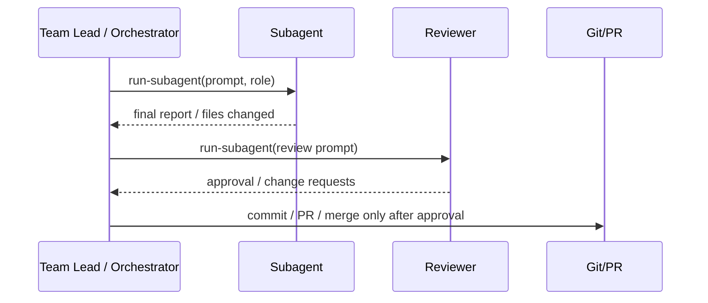
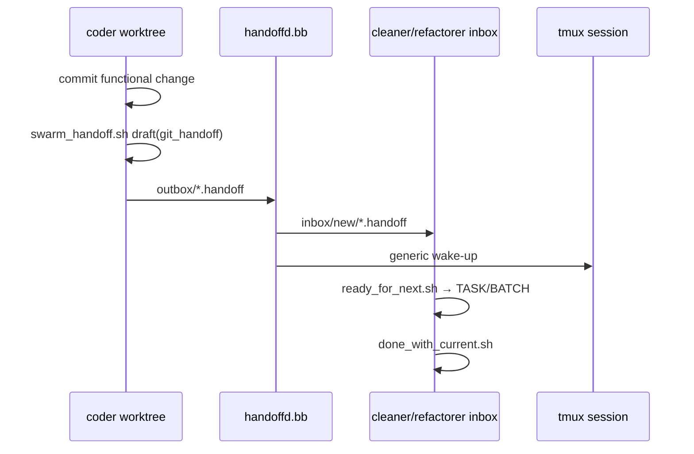

# Исследование: SwarmForge — tmux-based swarm orchestration platform для AI-агентов

> **Проект:** [github.com/unclebob/swarm-forge](https://github.com/unclebob/swarm-forge)
> **Дата анализа:** 2026-06-18
> **Язык:** Babashka/Clojure + zsh/shell (`tmux`, `git`)
> **Лицензия:** не указана в metadata GitHub (`NOASSERTION`)
> **Snapshot:** `main` `01d4ee498c7bc2bf4370b399e8c47ec55906a67b`; `two-pack` `6484065446eb30473dfdde2e77097a985a47078c`; `four-pack` `70c4792d1d648163ce8d7fe39f6d1e512f0e954d`; `six-pack` `01343cebf5416fc37d0de41911ebaee47dfd04b7`
> **Аналитик:** Аналитик (Шерлок)

---

## 1. Обзор проекта

SwarmForge — **локальная tmux-based swarm orchestration platform** (платформа оркестрации роя на базе `tmux`) от Robert C. Martin (`unclebob`). Ключевая идея: несколько внешних AI-агентов работают как равноправные роли в отдельных `git worktree` (рабочих деревьях Git), получают роль через `swarmforge/roles/<role>.prompt`, читают layered constitution (слоистую «конституцию» инструкций), а между ролями передают работу через daemon-owned file transport (файловый транспорт под управлением daemon (фонового процесса)).

> ⚠️ **Классификация:** SwarmForge — **система оркестрации внешних AI-агентов**, а не coding agent (кодинг-агент) и не LLM SDK (SDK для прямой работы с LLM). Ближайшие аналоги в нашем research: AgentCraft (#16, GUI wrapper поверх внешних агентов + worktrees) и Factory Missions (#17, multi-agent software-development orchestration). Но SwarmForge ближе к нашей внутренней модели `docs/agents/roles/team/*` + `AGENTS.md` + `docs/conventions/` + `task-via-subagents`: роли, workflow, handoff и governance вынесены в файлы-инструкции.

### Архитектура

```
┌─────────────────────────────────────────────────────────────┐
│ Runnable branch: two-pack / four-pack / six-pack            │
│ • ./swarm wrapper                                           │
│ • swarmforge/swarmforge.conf                                │
│ • swarmforge/roles/<role>.prompt                            │
│ • swarmforge/constitution/articles/project.prompt            │
│ • local-*.prompt additions or same-name article overrides    │
└──────────────────────────┬──────────────────────────────────┘
                           │ copies shared scripts/articles from main
                           ▼
┌─────────────────────────────────────────────────────────────┐
│ swarmforge.bb launcher                                      │
│ • Parses config-driven topology                             │
│ • Validates roles, agents, receive modes, helper scripts     │
│ • Initializes git repo if needed                            │
│ • Creates git worktree per role under .worktrees/            │
│ • Writes .swarmforge/roles.tsv + sessions.tsv + tmux-socket  │
│ • Starts one tmux session per role                           │
│ • Opens Terminal.app / iTerm2 / Ghostty / Windows Terminal   │
│ • Starts handoffd.bb                                        │
└──────────────┬───────────────────────────────┬──────────────┘
               │                               │
               ▼                               ▼
┌─────────────────────────────┐     ┌─────────────────────────┐
│ Role worktree/session        │     │ handoffd.bb daemon       │
│ • SWARMFORGE_ROLE=<role>     │     │ • Owns tmux socket       │
│ • PATH includes helper scripts│    │ • Polls outbox/          │
│ • Agent backend: codex/      │     │ • Validates recipients   │
│   claude/copilot/grok        │     │ • Copies inbox files     │
│ • Reads constitution + role  │     │ • Sends generic wake-up  │
└──────────────┬──────────────┘     └───────────┬─────────────┘
               │                                │
               ▼                                ▼
┌─────────────────────────────────────────────────────────────┐
│ Handoff protocol                                             │
│ outbox/tmp → outbox → sent/failed                            │
│ inbox/new → inbox/in_process → inbox/completed               │
│ Types: awake | git_handoff | note                            │
│ Helpers: swarm_handoff.sh, ready_for_next.sh,                │
│          done_with_current.sh                                │
└─────────────────────────────────────────────────────────────┘
```

### Ключевые характеристики

| Характеристика | Значение |
| --- | --- |
| **Тип** | `swarm-orchestration` (оркестрация роя внешних AI-агентов) |
| **Модель выполнения** | peer-to-peer handoff pipeline (пиринговая цепочка handoff'ов) через daemon-delivered files |
| **Поддерживаемые backends** | `codex`, `claude`, `copilot`, `grok` — выбираются per role (для каждой роли) |
| **Топология** | `swarmforge.conf`: `window <role> <agent> <worktree> [task|batch] [extra-cli-args...]` |
| **State management** | локальная файловая структура `.swarmforge/`, durable handoff files, `git worktree` per role |
| **Prompt governance** | layered constitution: shared articles на `main` + local additions/overrides в runnable-ветках |
| **Pack presets** | `two-pack`, `four-pack`, `six-pack` — runnable workflows под разную сложность |
| **Terminal model** | desktop-first: Terminal.app/iTerm2/Ghostty/Windows Terminal + `tmux`; fallback `SWARMFORGE_TERMINAL=none` |
| **Обработка ошибок** | fail-fast validation, handoff `failed/`, ambiguous-state errors; нет retry/backoff/CB/quality gates/budget |
| **Тесты проекта** | `bb test`: `test/swarmforge/handoff_test.clj`, `test/swarmforge/script_test.clj` |

---

## 2. Возможности оркестрации — обзор

| Функция | SwarmForge |
| --- | --- |
| **Chain / DAG engine** | ❌ Нет декларативных chain steps; workflow выражен ролями и handoff'ами |
| **Peer-to-peer messaging** | ✅ `handoffd.bb` + durable inbox/outbox files |
| **Config-driven topology** | ✅ `swarmforge.conf` задаёт роли, backend, worktree, receive mode, extra args |
| **Layered constitution** | ✅ shared articles + `local-*.prompt` additions + same-name overrides |
| **Role prompts** | ✅ `swarmforge/roles/<role>.prompt` per runnable branch |
| **Pack presets** | ✅ `two-pack`, `four-pack`, `six-pack` |
| **Git worktree isolation** | ✅ `.worktrees/<name>`, branch `swarmforge-<worktree>` per role |
| **Batch receive mode** | ✅ `task` / `batch`; batch groups equal-priority inbox items |
| **Backend selection per role** | ✅ `codex`, `claude`, `copilot`, `grok` |
| **Structured handoff validation** | ✅ strict draft headers, reserved fields, commit canonicalization, role validation |
| **Audit trail** | ✅ handoff headers: `created_at`, `enqueued_at`, `dequeued_at`, `completed_at`; `sent/failed/completed` directories |
| **Cleanup window** | ✅ first window is intentional shutdown path; closes tmux sessions and tracked windows |
| **Window watchdog** | ✅ reopens non-cleanup tracked terminal windows |
| **Retry / backoff** | ❌ Нет |
| **Circuit breaker** | ❌ Нет |
| **Quality gates** | ❌ Нет orchestrator-level gates; verification is prompt-driven per role |
| **Budget control** | ❌ Нет |
| **CI/server-first execution** | 🔴 Нет; desktop-first local tool |
| **DDD / Clean Architecture** | ❌ Не применимо: scripts + prompts, не layered application code |

---

## 3. Оркестрационные возможности

### 3.1 🟡 Layered Constitution с явной override-семантикой

**Что у них:** `constitution.prompt` — entry point (точка входа) для системных правил. Runnable-ветки читают `swarmforge/constitution/articles/*`. Shared articles живут на `main`:

- `engineering.prompt` — engineering rules: TDD, CRAP/DRY/mutation tooling, acceptance pipeline, verification guardrails.
- `handoffs.prompt` — protocol rules: как отправлять/принимать `awake`, `git_handoff`, `note`; запрет прямых tmux notifications.
- `workflow.prompt` — worktree discipline, temp files, failure conditions.

Startup copies missing shared articles into runnable branch and each role worktree, **skipping existing files**. Отсюда две семантики:

| Механизм | Значение |
| --- | --- |
| `local-*.prompt` | addition/specialization (добавление/специализация): shared article остаётся валиден, local file уточняет или сужает правила |
| same-name shared article (`workflow.prompt`, `engineering.prompt`) | override (замещение): branch file с тем же именем блокирует копирование shared article |

Примеры snapshot'а:

- `two-pack` содержит собственные `engineering.prompt` и `workflow.prompt` — это full override shared articles, плюс `project.prompt`.
- `six-pack` содержит `local-engineering.prompt` и `local-workflow.prompt` — это additions к shared `engineering.prompt`/`workflow.prompt`.
- `project.prompt` фиксирует локальную topology (топологию), язык проекта и ownership rules.

**Сравнение с task-orchestrator:** у нас есть похожая слоистость: [`AGENTS.md`](../../../AGENTS.md) → [`docs/conventions/index.md`](../../conventions/index.md) → role files [`docs/agents/roles/team/*`](../../agents/roles/team/) → skill files [`docs/agents/skills/*/SKILL.md`](../../agents/skills/). Но override-семантика не формализована так явно: нет соглашения «local-* дополняет, same-name замещает». Это ценный governance pattern (паттерн управления инструкциями).

**Как адаптировать:** описать в conventions (конвенциях) или agent docs явный precedence (приоритет) инструкций: global → project → role → skill → task, а также различить extension vs replacement. Не переносить формат `.prompt` напрямую; достаточно Markdown frontmatter + docs conventions.

### 3.2 🟡 Handoff Protocol: daemon-owned file transport

**Что у них:** Агенты не имеют прямого доступа к `tmux` socket (сокету tmux) и не отправляют `tmux send-keys` сами. Они пишут draft handoff file (черновик handoff'а) только с заголовками и вызывают `swarm_handoff.sh <draft-file>`. Helper validates (валидирует) draft, генерирует canonical payload (каноническое тело), atomically moves (атомарно перемещает) файл в `outbox/`. `handoffd.bb` polls (опрашивает) outbox, доставляет копии в recipients' inbox, sends generic wake-up (отправляет универсальное уведомление).

```text
.swarmforge/handoffs/
  outbox/
    tmp/
  sent/
  failed/
  inbox/
    new/
    in_process/
    completed/
```

Поддерживаются только 3 типа:

| Type | Смысл | Draft fields |
| --- | --- | --- |
| `awake` | presence/wakeup signal (сигнал присутствия/пробуждения) | `type`, `to`, `priority` |
| `git_handoff` | recipient должен merge/process commit | `type`, `to`, `priority`, `task`, `commit` |
| `note` | короткое сообщение до 80 символов | `type`, `to`, `priority`, `message` |

Ключевые правила:

- `priority` — две цифры `00..99`; lower number = earlier processing.
- Role names may not contain underscores (чтобы recipient list в filename был читаемым).
- `git_handoff` commit должен быть ровно 10 hex characters, resolves to exactly one commit, canonicalized via git.
- Agents cannot write reserved headers: `id`, `from`, `role`, `recipient`, timestamps.
- Payload генерируется helper'ом, а не агентом: `merge_and_process <sender> <commit>`.
- `ready_for_next.sh` moves `inbox/new` → `inbox/in_process`, prints `TASK:`/`BATCH:`/`NO_TASK`.
- `done_with_current.sh` moves work to `completed` and immediately checks for next work.

**Оркестрационная значимость:** Это не просто «сообщения между агентами», а protocol boundary (граница протокола): агент не управляет transport details (деталями транспорта), не пишет runtime headers, не формирует long body. Всё опасное нормализуется helper'ами и daemon'ом.

**Сравнение с task-orchestrator:** наш `run-subagent` запускает subagent (сабагента) как child process (дочерний процесс) и получает финальный stdout/report. Это **hierarchical delegation** (иерархическое делегирование): orchestrator контролирует порядок, git и проверки. SwarmForge — **peer-to-peer daemon messaging** (пиринговые сообщения через daemon): роли равноправны, каждая сама принимает/завершает work items. Для текущего `task-orchestrator` peer-to-peer модель избыточна, но **structured handoff schema** (структурированная схема handoff'а) полезна для отчётов сабагентов.

### 3.3 🟡 Config-driven topology (`swarmforge.conf`)

**Что у них:** Топология роя — не hardcoded scripts, а config file:

```conf
window <role> <agent> <worktree> [task|batch] [extra-cli-args...]
```

Snapshot runnable-веток:

| Branch | Config | Flow |
| --- | --- | --- |
| `two-pack` | `coder codex master`, `cleaner codex cleaner batch` | `coder → cleaner → coder` |
| `four-pack` | `specifier`, `coder`, `refactorer`, `architect batch` | `specifier → coder → refactorer → architect → specifier` |
| `six-pack` | `specifier`, `coder`, `cleaner`, `architect`, `hardender batch`, `QA` | `specifier → coder → cleaner → architect → hardender → QA → completion` |

`swarmforge.bb` validates duplicate roles, duplicate worktrees, supported backends, receive modes, role prompt existence and invalid role/worktree names. It writes normalized state to `.swarmforge/roles.tsv`, so helper scripts read runtime state instead of reparsing config.

**Сравнение с task-orchestrator:** у нас [`config/chains.yaml`](../../../config/chains.yaml) задаёт role delegation profiles (профили делегирования ролей): role → prompt file → command (`pi`, `codex`, model/reasoning/provider). Это уже близкий pattern. Различие: SwarmForge config задаёт **team topology** (кто с кем работает и в каком worktree), а наш config задаёт **runner profile** (как запустить роль), а workflow хранится в skills (`task-via-subagents`, `epic-via-subagents`) и task files.

**Как адаптировать:** возможный backlog — добавить declarative team topology (декларативную топологию команды) поверх существующих role profiles: presets вроде `quick-task`, `full-review`, `research`, где указаны роли, порядок review, batch/fan-out semantics. Это должно быть docs/skill-level расширение, не core runtime rewrite.

### 3.4 🟡 Pack presets: two-pack / four-pack / six-pack

**Что у них:** Runnable branches — это готовые presets (пресеты) под сложность задачи:

#### `two-pack`

- `coder`: TDD + unit tests + behavior slice.
- `cleaner` (`batch`): cleanup, CRAP, DRY, architecture review, mutation hardening.
- Без Gherkin, acceptance, QA, property tests.

#### `four-pack`

- `specifier`: Gherkin acceptance specification, approval before handoff.
- `coder`: implementation with TDD + generated acceptance tests.
- `refactorer`: cleanup, coverage, CRAP/DRY, mutation-site scans, property-test support.
- `architect` (`batch`): module boundaries, mutation, DRY, soft Gherkin mutation, final notification.

#### `six-pack`

- `specifier`: accepted Gherkin specs + end-to-end QA procedures.
- `coder`: implementation.
- `cleaner`: local cleanup.
- `architect`: boundaries/dependency direction/property testing.
- `hardender` (`batch`): mutation hardening + CRAP/DRY + soft Gherkin mutation.
- `QA`: independent final verification through UI, completion notification to all roles.

**Оркестрационная значимость:** Pack presets encode workflow complexity (кодируют сложность workflow) не через условные операторы, а через набор ролей и ownership boundaries (границы владения). Это очень похоже на наши роли `team_lead_alex`, `system_analyst_sherlock`, `backend_developer_*`, `code_reviewer_backend_puaro`, `qa_backend_house`, `technical_writer_*`.

**Как адаптировать:** формализовать presets для наших skills:

- `two-pack` analogue: implementer + reviewer/cleaner для малых tasks.
- `four-pack` analogue: analyst/spec → backend → reviewer → QA.
- `six-pack` analogue: analyst → architect → backend → reviewer → QA → writer.

При этом наш control plane (контур управления) должен остаться у Тимлида/оркестратора, а не переходить к peer-to-peer ролям.

### 3.5 🟡 Git worktree per role

**Что у них:** Если `worktree` не `master` и не `none`, launcher создаёт `.worktrees/<worktree>` через:

```sh
git worktree add --force -B swarmforge-<worktree> <path> HEAD
```

Каждая role получает свой checkout, local scripts, `.swarmforge/roles.tsv`, `.swarmforge/tmux-socket`, and handoff dirs. Shared `.swarmforge/` and `.worktrees/` are excluded from Git.

**Сравнение с task-orchestrator:** у нас рабочая ветка одна (`task/*`), а сабагенты обычно работают в той же рабочей копии под контролем оркестратора. Для параллельных независимых research/review tasks `git worktree` per subagent мог бы снизить конфликты, но требует строгого merge policy и cleanup. Sandcastle также подтверждает ценность worktree isolation (изоляции через worktree), но делает это на уровне sandbox lifecycle.

**Как адаптировать:** P3/R&D: worktree isolation for parallel subagents (изоляция параллельных сабагентов), особенно для epic-level fan-out. Не смешивать с runtime sandboxing: worktree не ограничивает процессы, сеть и filesystem outside repo.

### 3.6 🟡 Cleanup window + window watchdog

**Что у них:** First configured window (первое окно в `swarmforge.conf`) — cleanup window (окно очистки). Closing it is the intentional shutdown path: SwarmForge tears down tmux sessions, closes tracked windows, and stops the swarm. Closing other tracked windows is non-destructive: watchdog reopens the terminal and reattaches to the same tmux session.

**Оркестрационная значимость:** Single shutdown path (единственный путь завершения) уменьшает случайные partial shutdowns (частичные остановки). Это хороший lifecycle pattern для interactive desktop tool.

**Сравнение с task-orchestrator:** у нас нет desktop windows; lifecycle управляется shell commands, `watch-subagent.sh` soft/hard/stall timeouts and Git workflow. Прямое заимствование не нужно. Идея применима как **single owner of cleanup**: только оркестратор/Тимлид делает commit/push/merge/cleanup, сабагенты не трогают git control plane.

### 3.7 🟢 Terminal/desktop automation — не переносить

SwarmForge consciously desktop-first (локальный desktop-first инструмент): Terminal.app via AppleScript, iTerm2, Ghostty, Windows Terminal (`wt.exe`), `tmux` socket per project, window IDs, watchdog. Это даёт observability (наблюдаемость) для человека, но плохо переносится в CI/server-first окружение.

**Вердикт:** не переносить в PHP/Symfony core. Для task-orchestrator важнее batch/CI режим, deterministic logs (детерминированные логи), JSONL audit trail and validation gates.

---

## 4. Сравнение с task-orchestrator

| Критерий | SwarmForge | task-orchestrator | Вывод |
| --- | --- | --- | --- |
| **Orchestration model** | Peer-to-peer swarm: roles hand off commits through daemon-delivered files; topology in `swarmforge.conf` | Chain-based orchestration: YAML chains + controlled runner calls + subagent skills | Заимствовать structured handoff и presets; не переносить peer-to-peer control plane |
| **State management** | `.swarmforge/` files, `roles.tsv`, durable inbox/outbox/sent/failed/completed, `git worktree` per role | Payload/context, JSONL audit trail, task files, Git branch controlled by orchestrator | Handoff audit headers полезны; worktrees — P3 для parallel fan-out |
| **Error handling** | Strict validation, fail-fast config errors, `failed/` handoffs, ambiguous task state errors; no retry/backoff | Retry with backoff, circuit breaker, fallback routing, quality gates, budget control | Наши fault-tolerance mechanisms сильнее; SwarmForge не dependency |
| **Extensibility** | New role prompt + config line + backend support; terminal adapters; local constitution articles | Role files, skills, `config/chains.yaml`, Symfony DI, DDD modules | Override semantics и team presets — ценные governance patterns |
| **Applicability** | Local desktop swarm for observing multiple CLI agents in tmux | CLI/CI-oriented PHP/Symfony chain orchestrator | Прямой runtime перенос не подходит; patterns можно адаптировать как docs/config conventions |

### 4.1 Наша модель ролей vs SwarmForge roles

| Аспект | SwarmForge | task-orchestrator |
| --- | --- | --- |
| Role definition | `swarmforge/roles/<role>.prompt` plain prompt | Markdown role files with frontmatter/personality/skills in [`docs/agents/roles/team/*`](../../agents/roles/team/) |
| Shared rules | `constitution.prompt` + `articles/*.prompt` | [`AGENTS.md`](../../../AGENTS.md) + [`docs/conventions/index.md`](../../conventions/index.md) |
| Skill/workflow | Prompt instructions inside role + constitution | [`docs/agents/skills/*/SKILL.md`](../../agents/skills/) with scripts/resources |
| Role launch | `swarmforge.conf` line selects backend/worktree/mode | [`config/chains.yaml`](../../../config/chains.yaml) maps role to runner/model/system prompt |
| Delegation | Role sends `git_handoff` to another role | Orchestrator runs `run-subagent` and controls review/fix/PR |
| Git ownership | Each role can commit and hand off | Тимлид/оркестратор controls commit/push/PR/merge (сабагенты обычно не коммитят) |

**Ключевое различие:** SwarmForge pushes agency down to roles (роль сама решает handoff/commit), task-orchestrator keeps agency in orchestrator (оркестратор управляет процессом). Для нашего проекта это осознанно безопаснее: меньше distributed decision-making (распределённого принятия решений), проще enforce AGENTS.md и PR rules.

### 4.2 Сравнение с `task-via-subagents` / `epic-via-subagents`

SwarmForge `handoffd.bb` и наши skills решают сходную задачу — передать работу между специализациями, но на разных topology levels:





**Вывод:** peer-to-peer handoff хорош для long-lived local swarm (долгоживущего локального роя), но для нашего PR workflow (workflow pull request'ов) безопаснее централизованное orchestration authority (централизованная власть оркестратора).

---

## 5. Сводка по заимствованию

| Возможность | Статус в продукте | Описание |
| --- | --- | --- |
| Layered constitution override semantics | 🟡 P2 | Явно описать precedence и difference between `local-*` additions vs same-name replacement для наших agent docs |
| Structured handoff schema | 🟡 P2 | Стандартизировать subagent reports: task id, status, changed files, tests, next action, blockers |
| Config-driven team topology presets | 🟡 P3 | Presets для role pipelines: quick task / full task / research / epic review |
| Batch receive mode | 🟡 P3 | Для fan-out review: сгруппировать несколько independent findings/reports перед merge decision |
| Git worktree per parallel role | 🟡 P3 | Изоляция параллельных сабагентов в epic-level workflows |
| Single cleanup/shutdown owner | 🟡 P2 | Формализовать: только orchestrator/Team Lead owns commit/push/merge/cleanup; subagents do not bypass control plane |
| Role ownership boundaries | 🟡 P2 | Более явно фиксировать `Owns` / `Does Not Own` в наших role files and skills |
| Desktop terminal automation | 🟢 — | Не переносить: AppleScript/Terminal/Ghostty/Windows Terminal/tmux не подходят для CI/server-first |
| Peer-to-peer daemon messaging | 🟢 — | Не переносить в core сейчас: сложнее контролировать PR/Git workflow; можно изучать как R&D для long-lived swarms |
| Runtime dependency | 🔴 — | Не брать dependency: стек zsh+tmux+Babashka, desktop-first, нет retry/CB/gates/budget |

### Concrete patterns (3–7) для возможного заимствования

1. **Layered constitution with explicit override semantics (P2):** formal precedence and `local-*` additive convention.
2. **Strict handoff draft schema (P2):** agents provide small structured fields; orchestrator/helpers generate canonical body and audit metadata.
3. **Role ownership blocks (P2):** `Owns` / `Does Not Own` / `Handoff` sections for roles and skills.
4. **Pack presets by task complexity (P3):** `two-pack`/`four-pack`/`six-pack` analogues for our subagent workflows.
5. **Batch review/receive semantics (P3):** aggregate equal-priority review items before action.
6. **Worktree isolation for parallel subagents (P3):** especially epic fan-out and independent research tasks.
7. **Single cleanup/control owner (P2):** explicit rule that only orchestrator finalizes git state.

---

## 6. Вердикт

**Итоговый verdict:** 🟡 **заимствовать отдельные паттерны**, 🔴 **не использовать как dependency**.

**Почему заимствовать:** SwarmForge независимо подтверждает ценность уже близких нам решений: role prompts, layered instructions, config-driven team setup, handoff discipline, git worktrees, presets под сложность задачи. Особенно ценно то, что Robert C. Martin формализует роли через ownership boundaries and workflow protocols — это хорошо ложится на наши `docs/agents/roles/team/*`, `AGENTS.md`, conventions and skills.

**Почему не dependency:**

- Desktop-first runtime: `tmux`, AppleScript/Terminal.app/iTerm2/Ghostty/Windows Terminal.
- Stack mismatch: Babashka/Clojure + zsh scripts vs PHP 8.4/Symfony 8.0/DDD.
- Нет core mechanisms task-orchestrator: retry with backoff, circuit breaker, quality gates, budget control, JSONL audit trail at chain level.
- Peer-to-peer agents can commit/handoff independently; our governance deliberately centralizes git/PR control in Team Lead/orchestrator.
- No CI/server-first contract; SwarmForge optimizes for visible local swarm sessions.

**Bottom line:** SwarmForge — отличный reference design (референс-дизайн) для **agent governance and swarm coordination**, но не runtime foundation (основа рантайма) для task-orchestrator.

---

## 7. Указатель источников для деталей

- [`README.md`](https://github.com/unclebob/swarm-forge/blob/main/README.md) — documentary branch overview: packs, constitution, config, terminal behavior, cleanup window.
- [`swarmforge/handoff-protocol.md`](https://github.com/unclebob/swarm-forge/blob/main/swarmforge/handoff-protocol.md) — full handoff protocol: directory layout, message types, helpers, daemon responsibilities.
- [`swarmforge/constitution/articles/`](https://github.com/unclebob/swarm-forge/tree/main/swarmforge/constitution/articles) — shared `engineering.prompt`, `handoffs.prompt`, `workflow.prompt`.
- [`swarmforge/scripts/`](https://github.com/unclebob/swarm-forge/tree/main/swarmforge/scripts) — `swarmforge.bb`, `handoffd.bb`, `swarm_handoff.bb`, `ready_for_next*.bb`, `done_with_current*.bb`, `handoff_lib.bb`.
- Runnable branches via GitHub tree/raw API: [`two-pack`](https://github.com/unclebob/swarm-forge/tree/two-pack), [`four-pack`](https://github.com/unclebob/swarm-forge/tree/four-pack), [`six-pack`](https://github.com/unclebob/swarm-forge/tree/six-pack) — `swarmforge.conf`, `roles/*.prompt`, local constitution articles.

📚 **Источники:**
1. [github.com/unclebob/swarm-forge](https://github.com/unclebob/swarm-forge) — repository metadata and branches.
2. [README.md](https://github.com/unclebob/swarm-forge/blob/main/README.md) — main documentary branch.
3. [handoff-protocol.md](https://github.com/unclebob/swarm-forge/blob/main/swarmforge/handoff-protocol.md) — protocol specification.
4. [scripts directory](https://github.com/unclebob/swarm-forge/tree/main/swarmforge/scripts) — Babashka operational scripts.
5. [six-pack branch](https://github.com/unclebob/swarm-forge/tree/six-pack) — full runnable workflow preset.
