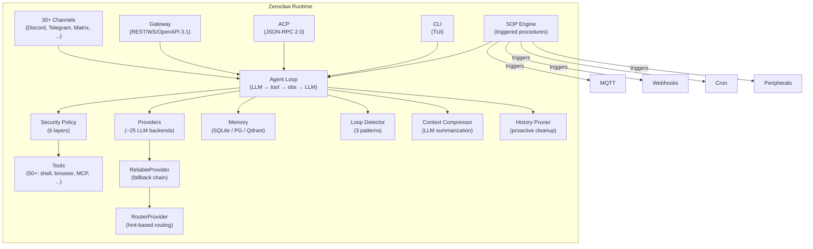

# Исследование: Zeroclaw — Rust-рантайм автономного AI-ассистента с SOP-движком

> **Проект:** [github.com/zeroclaw-labs/zeroclaw](https://github.com/zeroclaw-labs/zeroclaw) (★ 31.5k, MIT OR Apache-2.0)
> **Дата анализа:** 2026-05-20
> **Язык:** Rust (edition 2024)
> **Лицензия:** MIT OR Apache-2.0 (dual-licensed)
> **Версия:** 0.7.5
> **Аналитик:** Аналитик (Шерлок)

---

## 1. Обзор проекта

Zeroclaw — **agent runtime: единый Rust-бинар, конфигурируемый и запускаемый на любой ОС**. Общается с LLM-провайдерами (Anthropic, OpenAI, Ollama и ~20 других), достигает мира через 30+ каналов (Discord, Telegram, Matrix, email, voice, webhooks, CLI, ACP) и действует через инструменты (shell, browser, HTTP, hardware, MCP-серверы). Всё работает на машине пользователя, с его ключами, в его workspace.

> ⚠️ **Примечание:** Zeroclaw — не фреймворк для построения агентов, не workflow engine и не SaaS. Это **agent runtime** — конфигурируемый бинар, запускаемый как CLI, systemd-сервис или Docker-контейнер. Архитектурно ближе к OpenClaw (multi-channel personal assistant), чем к task-orchestrator (chain orchestrator).

### Связь с OpenClaw

**Zeroclaw тематически связан с OpenClaw, но не является форком.** Оба проекта:

| Признак | Zeroclaw | OpenClaw |
|---|---|---|
| **Организация** | `zeroclaw-labs` (создана 2026-02-15) | `openclaw` |
| **Язык** | Rust (edition 2024) | TypeScript (Node.js) |
| **Топики GitHub** | `openclaw`, `zeroclaw`, `agent`, `agentic` | `openclaw`, `crustacean`, `molty`, `own-your-data` |
| **Звёзды** | 31.5k | 362k |
| **Контрибьюторы (топ-3)** | `theonlyhennygod` (902), `chumyin` (465), `singlerider` (184) | `steipete` (29358), `vincentkoc` (5564), `shakkernerd` (2994) |
| **Перекрытие контрибьюторов** | Нет общих топ-10 контрибьюторов | — |

Вывод: **независимые проекты, разделяющие «crustacean»-тематику и философию «you own the agent»**. Zeroclaw включает тему `openclaw` — признание экосистемы, а не fork-отношение. Уникальное для Zeroclaw: Rust-стек, SOP-движок, hardware-поддержка, криптографические tool receipts.

### Позиционирование

> «You own the agent. You own the data. You own the machine it runs on.» — Zeroclaw Philosophy

Четыре принципа (в порядке приоритета):
1. **You own it** — binary на вашей машине, ваши ключи, ваша БД. Нет telemetry, нет cloud tenancy.
2. **Security-first, with escape hatches** — default autonomy = `supervised`, OS-level sandboxes, tool receipts.
3. **Minimal** — Rust binary, feature flags, tens of MB. Microkernel roadmap (RFC #5574).
4. **Provider-agnostic** — Anthropic, OpenAI, Ollama, Bedrock, Gemini, Azure и ~20 других.

Zeroclaw прямо заявляет: **«Not a framework. You don't build apps on top of Zeroclaw. You configure it and connect channels.»**

### Архитектура

```
crates/
 zeroclaw-api/             # Трейты: Provider, Channel, Tool, Memory, Observer, RuntimeAdapter, Peripheral
 zeroclaw-config/          # Конфигурация: TOML-схема, autonomy, cost/tracker, policy, secrets, workspace
 zeroclaw-providers/       # LLM-провайдеры: Anthropic, OpenAI, Ollama, Bedrock, Gemini, Azure, Router, Reliable
 zeroclaw-memory/          # Память: SQLite, PostgreSQL, Qdrant, embeddings, knowledge graph, decay, consolidation
 zeroclaw-channels/        # 30+ каналов: Discord, Telegram, Matrix, Slack, WhatsApp, IRC, email, voice, ACP, webhooks
 zeroclaw-tools/           # Инструменты: shell, browser, HTTP, MCP, memory ops, delegate, swarm, schedule, git
 zeroclaw-runtime/         # Ядро: agent loop, SOP engine, security, cost tracking, cron, skills, observability
 zeroclaw-gateway/         # HTTP/WS gateway: REST API, WebSocket, SSE, ACP, OpenAPI 3.1, WebAuthn, TLS
 zeroclaw-plugins/         # WASM plugin system: manifest.toml, signature verification, skill discovery
 zeroclaw-tui/             # TUI onboarding wizard
 zeroclaw-hardware/        # Hardware: GPIO, I2C, SPI, USB (RPi, STM32, Arduino, ESP32)
 zeroclaw-infra/           # Инфра: session store (SQLite), debounce, stall watchdog
 zeroclaw-macros/          # Proc macros для config schema
 zeroclaw-tool-call-parser/ # Streaming tool-call parser
 robot-kit/                # Robot Kit: drive, listen, look, speak, sense, safety
 aardvark-sys/             # FFI для Total Phase Aardvark
 apps/tauri/               # Tauri Desktop/Mobile app
```

**Ключевые характеристики:**

| Характеристика | Значение |
| --- | --- |
| **Тип** | Agent runtime (personal AI assistant infrastructure) |
| **Модель выполнения** | Agent loop (LLM → tool call → observation → LLM → ...) + SOP engine (triggered procedures) |
| **State management** | SQLite / PostgreSQL / Qdrant (pluggable Memory trait) + session persistence |
| **Провайдеры** | ~25 через trait Provider (Anthropic, OpenAI, Ollama, Bedrock, Gemini, Azure, OpenRouter и др.) |
| **Расширяемость** | Trait-driven (Provider/Channel/Tool/Memory/Observer/Peripheral) + WASM plugins + MCP |
| **Каналы** | 30+ (Discord, Telegram, Matrix, Slack, WhatsApp, Signal, IRC, email, voice, ACP, webhooks и т.д.) |
| **Model failover** | `ReliableProvider`: fallback chain + per-provider retry с exponential backoff |
| **Model routing** | `RouterProvider`: hint-based routing + cost-optimized resolution |
| **SOP engine** | Event-triggered procedures (MQTT/webhook/cron/peripheral) + approval gates + resumable runs |
| **Security** | 6 уровней: channel pairing → autonomy → workspace boundary → command policy → OS sandbox → tool receipts |
| **Loop detection** | 3 паттерна: exact repeat / ping-pong / no-progress; Warning → Block → Break |
| **Context management** | History pruner + context compressor (LLM summarization) + probe tiers |
| **Sub-agents** | `DelegateTool` (sync/background/parallel) + `SwarmTool` (pipeline/parallel/router) |
| **Hardware** | GPIO/I2C/SPI/USB (RPi, STM32, Arduino, ESP32) |
| **Plugin system** | WASM plugins с manifest.toml, signature verification, skill discovery |
| **Cost tracking** | Per-model pricing (3-tier lookup), per-turn usage, BudgetCheck |
| **Бюджетный контроль** | ⚠️ Cost tracking + per-turn usage, но нет явного hard-stop budget guard |
| **Лицензия** | MIT OR Apache-2.0 |

---

## 2. Возможности оркестрации — обзор

| Функция | Zeroclaw | task-orchestrator |
| --- | --- | --- |
| **Язык** | Rust (edition 2024) | PHP 8.4 (Symfony 8.0) |
| **Тип** | Agent runtime (personal AI assistant) | Chain-based orchestrator (Symfony Bundle) |
| **Модель оркестрации** | Agent loop + SOP engine (triggered procedures) | YAML chains (sequential/dynamic) |
| **State management** | Pluggable Memory trait (SQLite/PG/Qdrant) | In-memory + JSONL audit |
| **Error handling** | ReliableProvider (fallback chain + retry + error classification) | Retry + Circuit Breaker + Fallback |
| **Quality Gates** | ⚠️ SOP Checkpoint steps (human approval) | ✅ Shell-based quality gates |
| **Бюджетный контроль** | ⚠️ Cost tracking (no hard-stop) | ✅ BudgetVo с hard-stop |
| **Итерационные циклы** | ⚠️ Agent loop с max_tool_iterations, SOP steps | ✅ fix_iterations + DynamicLoop |
| **Fallback routing** | ✅ RouterProvider (hint-based + cost-optimized) | ✅ Fallback routing |
| **Circuit Breaker** | ❌ Нет — fallback chain без breaker pattern | ✅ Circuit Breaker decorator |
| **Audit Trail** | ✅ Cryptographic tool receipts + SOP audit | ✅ JSONL audit trail |
| **Ролевые промпты** | ✅ Personality system (7 markdown templates) | ✅ role.md per chain step |
| **Multiple runners** | ✅ ~25 provider implementations | ✅ Multiple agent runners |
| **DDD-архитектура** | ❌ Trait-driven modular crates | ✅ Domain/Application/Infrastructure |
| **Decorator pattern** | ❌ Прямой вызов через trait | ✅ AgentRunnerInterface decoration |
| **Loop detection** | ✅ 3 паттерна (exact repeat / ping-pong / no-progress) | ❌ Нет |
| **Context management** | ✅ Pruner + compressor + probe tiers | ❌ Нет (общий payload) |
| **Sub-agents** | ✅ DelegateTool (3 режима) + SwarmTool (3 стратегии) | ❌ Нет |
| **SOP engine** | ✅ Event-triggered + approval gates + resumable runs | ❌ Нет |
| **Security model** | ✅ 6 уровней + OS sandboxes + tool receipts | ❌ Нет |
| **MCP support** | ✅ MCP client (tools + transport) | ❌ Нет |
| **Plugin system** | ✅ WASM plugins + signature verification | ❌ Нет |
| **Multi-channel** | ✅ 30+ channels | ❌ CLI only |
| **Hardware** | ✅ GPIO/I2C/SPI/USB | ❌ Нет |
| **Статус проекта** | Активный (v0.7.5, 24 контрибьютора в последнем релизе) | Активный |

---

## 3. Детальный анализ по 4 осям

### 3.1 Модель оркестрации

Zeroclaw использует **две ортогональные модели оркестрации:**

#### Agent Loop (основная)

Стандартная модель `LLM → tool call → observation → LLM → ...` с развитыми guardrails:

- **`max_tool_iterations`** — лимит итераций (default: 10). Защита от runaway loops.
- **`LoopDetector`** — детектор зацикливания с 3 паттернами:
  - *Exact repeat* — одинаковый tool + args 3+ раз подряд → Warning → Block → Break
  - *Ping-pong* — два инструмента чередуются 4+ цикла → Warning → Block
  - *No progress* — один tool 5+ раз с одинаковым result_hash → Warning → Block
- **`ModelSwitchCallback`** — runtime переключение модели через tool `model_switch`
- **`SecurityPolicy`** — проверка каждого tool call на соответствие autonomy level, workspace boundary, command policy

#### SOP Engine (вторичная)

**Standard Operating Procedures** — event-triggered procedures с управляемым жизненным циклом:

```toml
# SOP.toml — определение процедуры
[[triggers]]
type = "cron"
expression = "0 6 * * 1-5"  # каждый будний день в 6:00

[[triggers]]
type = "webhook"
path = "/deploy"

[[triggers]]
type = "mqtt"
topic = "home/alert"

[[steps]]
kind = "execute"              # или "checkpoint" (human approval)
prompt = "Run tests and report"

[[steps]]
kind = "checkpoint"           # пауза для approval
prompt = "Review test results before deploy"
```

- **5 режимов выполнения:** `Auto`, `Supervised` (default), `StepByStep`, `PriorityBased`, `Deterministic`
- **4 типа триггеров:** MQTT, webhook, cron, peripheral (hardware)
- **Cooldown + concurrency limits** — per-SOP и global
- **Resumable runs** — `sop_status`, `sop_approve`, `sop_advance` tools
- **Deterministic mode** — последовательное выполнение без LLM round-trips, step output → next step input
- **Audit trail** — SOP run state persisted в Memory backend, category `sop`

**Оркестрационная значимость:** SOP engine — это **ограниченная форма chain orchestration**: последовательность шагов, triggered events, approval gates, resumable runs. Deterministic mode особенно интересен: steps pipe outputs как inputs, checkpoint steps pause для human approval — модель, близкая к нашим YAML chains + quality gates.

**Ключевые отличия от task-orchestrator:**
- SOP steps управляют agent loop (одним агентом), а не runner calls (разными агентами)
- Нет retry/CB/budget на уровне SOP steps
- Нет quality gates (shell-based verification) — только checkpoint (human approval)
- Нет branching/parallel execution в SOP steps

---

### 3.2 State Management

Zeroclaw использует **pluggable Memory trait** с развитой инфраструктурой:

```
zeroclaw-memory/
 traits.rs        # trait Memory: store, recall, search, export, purge
 sqlite.rs        # SQLite backend
 postgres.rs      # PostgreSQL backend
 qdrant.rs        # Qdrant vector DB backend
 embeddings.rs    # Embedding generation (provider-agnostic)
 knowledge_graph.rs      # Knowledge graph (in-memory)
 knowledge_graph_pg.rs   # Knowledge graph (PostgreSQL)
 vector.rs        # Vector storage abstraction
 decay.rs         # Memory decay (time-based importance degradation)
 consolidation.rs # Memory consolidation (merge similar, deduplicate)
 importance.rs    # Importance scoring (0.0–1.0)
 namespaced.rs    # Namespace isolation between agents/contexts
 audit.rs         # Audit entries (category-based)
 snapshot.rs      # Memory snapshots
 response_cache.rs # LLM response caching
 lucid.rs         # Lucid memory (structured extraction)
 hygiene.rs       # Memory hygiene (cleanup policies)
 markdown.rs      # Markdown import/export
 conflict.rs      # Conflict resolution
 chunker.rs       # Text chunking for embeddings
 policy.rs        # Memory policy (retention, privacy)
```

**Категории памяти:**
- **Core** — долгосрочные факты, предпочтения, решения
- **Daily** — ежедневные session logs
- **Conversation** — контекст разговора
- **Custom** — пользовательские категории

**Namespaced isolation:** каждый sub-agent / delegate agent получает собственное namespace, предотвращая cross-contamination.

**Context management в agent loop:**
- **`HistoryPruner`** — проактивная обрезка истории: удаление orphaned tool messages, collapse tool_result pairs, token estimation с 1.2x safety margin
- **`ContextCompressor`** — LLM-based summarization при context overflow с probe tiers (2M → 1M → 512K → 200K → 128K → 64K → 32K)
- **`parse_context_limit_from_error()`** — автоматическое определение context window limit из error message провайдера
- **`emergency_history_trim()`** — экстренная обрезка при переполнении

**Сравнение с task-orchestrator:**
| Аспект | Zeroclaw | task-orchestrator |
|---|---|---|
| Storage | Pluggable (SQLite/PG/Qdrant) | In-memory + JSONL file |
| Memory categories | Core/Daily/Conversation/Custom | Нет |
| Namespace isolation | ✅ Per-agent namespaces | Нет |
| Context pruning | ✅ Proactive (HistoryPruner) | Нет |
| Context compression | ✅ LLM summarization | Нет |
| Context limit detection | ✅ Auto from error message | Нет |
| Embeddings / Vector | ✅ Qdrant + provider-agnostic | Нет |
| Knowledge graph | ✅ In-memory + PostgreSQL | Нет |
| Memory decay | ✅ Time-based importance | Нет |
| Session persistence | ✅ SQLite session store | Нет |

**Вывод:** Zeroclaw имеет наиболее развитую memory subsystem из всех исследованных проектов. Для текущего этапа task-orchestrator (конечные цепочки) — overengineering. Но паттерны **HistoryPruner** (proactive cleanup) и **parse_context_limit_from_error()** (auto-detect context window) — полезные quick wins.

---

### 3.3 Error Handling

Zeroclaw реализует **многоуровневую обработку ошибок:**

#### Provider level: ReliableProvider

```toml
[providers.models.primary]
kind = "reliable"
fallback_providers = ["claude", "haiku", "local"]
```

- **Fallback chain:** primary → fallback1 → fallback2 → ... → error
- **Per-provider retry:** 2 попытки с exponential backoff (2s, 4s) перед fallback
- **Error classification:** retryable vs non-retryable

```rust
pub fn is_non_retryable(err: &anyhow::Error) -> bool {
    // Context window errors → retryable (can truncate history)
    // Tool schema errors → retryable (can switch to prompt-guided)
    // 4xx errors → non-retryable (except 429 rate-limit и 408 timeout)
    // Auth failure keywords → non-retryable
    // Model not found keywords → non-retryable
}

pub fn is_context_window_exceeded(err: &anyhow::Error) -> bool { ... }
```

Уникально: **context window errors считаются retryable** — ReliableProvider не сразу fallback, а даёт agent loop шанс обрезать историю.

#### Provider level: RouterProvider

```toml
[providers.models.brain]
kind = "router"
default = "haiku"
routes = [
    { hint = "reasoning", provider = "deepseek-r1" },
    { hint = "cheap",     provider = "haiku" },
    { hint = "vision",    provider = "gemini" },
]
```

- **Hint-based routing:** channels/tools/SOPs emit hints через request metadata
- **Cost-optimized resolution:** `resolve_cost_optimized()` — выбор cheapest route с capability filtering (vision, tools)
- **Composable:** `reliable` оборачивает `router`, `router` указывает на `reliable`

#### Agent level: LoopDetector

| Паттерн | Порог | Реакция |
|---|---|---|
| Exact repeat (tool + args) | 3+ consecutive | Warning → Block → Break |
| Ping-pong (A ↔ B) | 4+ cycles | Warning → Block |
| No progress (same result) | 5+ with same result_hash | Warning → Block |

Эскалация: `Ok` → `Warning` (inject system nudge) → `Block` (refuse tool call) → `Break` (terminate turn).

#### SOP level: Run lifecycle

- Per-SOP concurrency limit
- Global concurrency limit (`max_concurrent_total`)
- Per-SOP cooldown (`cooldown_secs`)
- Deterministic mode: step output → next step input, без LLM round-trips

**Сравнение с task-orchestrator:**

| Аспект | Zeroclaw | task-orchestrator |
|---|---|---|
| Retry с backoff | ✅ 2 retries, 2s/4s exponential | ✅ Настраиваемый retry + exponential backoff |
| Circuit Breaker | ❌ Нет (только fallback chain) | ✅ Circuit Breaker decorator |
| Fallback chain | ✅ Per-model с auto-retry | ✅ Fallback routing per chain step |
| Error classification | ✅ Retryable/non-retryable + context window + auth + model_not_found | ⚠️ Базовый (все errors = retry) |
| Loop detection | ✅ 3 паттерна, эскалация Warning/Block/Break | ❌ Нет |
| Budget hard-stop | ❌ Cost tracking без hard-stop | ✅ BudgetVo с исключением |
| Model routing | ✅ Hint-based + cost-optimized | ❌ Нет |
| SOP concurrency control | ✅ Per-SOP + global limits | ❌ Нет |

**Вывод:** Zeroclaw не имеет circuit breaker — его роль выполняет fallback chain. Error classification развитая (аналогично Hermes Agent и OpenClaw). Loop detection — уникальная возможность, не встреченная в других проектах в такой формализации. Model routing (hint-based + cost-optimized) — ценный паттерн.

---

### 3.4 Extensibility

Zeroclaw построен на **trait-driven modular architecture** — 14 workspace crates с чёткими extension points:

```
Extension Points (traits в zeroclaw-api):
 ├── Provider      — LLM provider (~25 implementations)
 ├── Channel       — Messaging channel (30+ implementations)
 ├── Tool          — Agent tool (50+ implementations)
 ├── Memory        — Storage backend (SQLite, PostgreSQL, Qdrant, None)
 ├── Observer      — Observability (OTel, Prometheus, Log, Verbose, DORA, Multi)
 ├── RuntimeAdapter — Platform adaptation (native, Docker, WASM, cloudflare-workers)
 ├── Sandbox       — OS-level isolation (Landlock, Bubblewrap, Firejail, Docker, Seatbelt)
 └── Peripheral    — Hardware boards (RPi, STM32, Arduino, ESP32)
```

**WASM Plugin System** (`zeroclaw-plugins`):
- `manifest.toml` — описание плагина (name, version, capabilities, wasm_path)
- Signature verification (Strict/Permissive/Disabled modes)
- Skill discovery: plugins содержат `skills/` подкаталоги
- Capability-based sandboxing: `ChannelPlugin`, `ToolPlugin`

**MCP Client** (`zeroclaw-tools/mcp_client.rs`, `mcp_protocol.rs`, `mcp_transport.rs`):
- Full MCP client: tools + resources
- Deferred MCP: lazy tool registration

**Skill System** (`zeroclaw-runtime/skills/`):
- SKILL.md-based skill definitions
- SkillForge: scout (discovery) → evaluate → integrate
- Skill HTTP: remote skill hosting
- Skill suggestions: AI-generated skill recommendations

**Сравнение с task-orchestrator:**

| Аспект | Zeroclaw | task-orchestrator |
|---|---|---|
| Extension model | Rust traits + WASM plugins | PHP interfaces (DDD layers) |
| Plugin system | ✅ WASM с signature verification | ❌ Нет |
| MCP | ✅ Full client (tools + transport) | ❌ Нет |
| Skills | ✅ SKILL.md + SkillForge + HTTP | ❌ Нет |
| Custom providers | ✅ Provider trait | ✅ AgentRunnerInterface |
| Custom tools | ✅ Tool trait (50+ built-in) | ❌ Shell-based quality gates only |
| Observability | ✅ OTel + Prometheus + Log | ❌ JSONL audit trail |
| Hardware | ✅ Peripheral trait (4 платформы) | ❌ Нет |
| Config format | TOML (schema-driven, per-property CRUD) | YAML chains |

**Вывод:** Zeroclaw — наиболее расширяемый из исследованных single-agent runtime. Trait-driven crates + WASM plugins + MCP + SkillForge — зрелая extensibility модель. Для task-orchestrator актуален паттерн trait-based extension (уже есть через interfaces), но WASM/MCP — перспектива P3+.

---

## 4. Сравнение с task-orchestrator

### Что у нас лучше

| Возможность | task-orchestrator | Zeroclaw |
|---|---|---|
| **Chain orchestration** | ✅ YAML chains (sequential + dynamic loops) | ⚠️ SOP engine (ограниченный: no branching/parallel) |
| **Retry + Circuit Breaker** | ✅ Decorator pattern (Retry → CB → Budget → Runner) | ⚠️ Retry только (no CB) |
| **Quality Gates** | ✅ Shell-based post-execution verification | ❌ Нет (только checkpoint = human approval) |
| **Бюджетный контроль** | ✅ BudgetVo с hard-stop исключением | ⚠️ Cost tracking без hard-stop |
| **Fix iterations** | ✅ DynamicLoop с max_iterations | ❌ Нет (только max_tool_iterations в agent loop) |
| **Decorator pattern** | ✅ AgentRunnerInterface + decoration | ❌ Прямой вызов через trait |
| **DDD-архитектура** | ✅ Domain/Application/Infrastructure | ❌ Trait-driven modular crates (нет DDD) |

### Что у Zeroclaw лучше (паттерны для заимствования)

| Паттерн | Приоритет | Обоснование |
|---|---|---|
| **Loop detection (3 паттерна)** | 🟢 P2 Quick win | Для fix_iterations: detect exact repeat / ping-pong / no-progress. Warning → Block → Break. Реализуемо как ChainStepDecorator |
| **Error classification** | 🟢 P2 Quick win | Retryable/non-retryable: context window errors → retryable, auth/403/404 → non-retryable. Дополнение к RetryingAgentRunner |
| **Hint-based model routing** | 🟡 P2-P3 | RouterProvider: `hint:reasoning` → Sonnet, `hint:cheap` → Haiku. Per-step model override в chains |
| **Cost-optimized routing** | 🟡 P3 | resolve_cost_optimized(): выбор cheapest provider с capability filtering |
| **History pruning** | 🟡 P3 | Proactive cleanup: orphaned tool messages, collapsed pairs. Для длинных chains и fix_iterations |
| **Context limit auto-detection** | 🟢 P2 Quick win | parse_context_limit_from_error(): auto-detect context window из error message. Для retry logic |
| **SOP Deterministic mode** | 🟡 P3 | Steps pipe outputs as inputs, без LLM round-trips. Модель для future "fast chains" |
| **Cryptographic tool receipts** | 🔵 R&D | Signed audit chain. Для enterprise-grade audit trail |
| **6-layer security model** | 🔵 R&D | Channel → Autonomy → Workspace → Command → Sandbox → Receipts. Для CI/CD autonomous execution |

### Что не подходит

| Аспект | Причина |
|---|---|
| **WASM Plugin system** | Overengineering для текущего этапа. PHP не имеет аналогичной runtime изоляции |
| **30+ channels** | task-orchestrator = CLI-first Symfony bundle, не multi-channel assistant |
| **Hardware (GPIO/I2C/SPI)** | Вне scope проекта |
| **Knowledge graph / Vector DB** | Overengineering для chain orchestration |
| **TOML config** | Мы используем YAML chains — TOML для другого уровня конфигурации |

---

## 5. Mermaid-диаграмма архитектуры



---

## 6. Сводка по оркестрации

| Фича | Источник | Приоритет | Обоснование |
|---|---|---|---|
| Loop detection (3 паттерна) | Zeroclaw | 🟢 P2 Quick win | Для fix_iterations: detect stuck patterns. 3 эскалации: Warning → Block → Break |
| Error classification | Zeroclaw | 🟢 P2 Quick win | Retryable/non-retryable: context errors → retryable, auth/403/404 → non-retryable |
| Context limit auto-detection | Zeroclaw | 🟢 P2 Quick win | parse_context_limit_from_error(): regex-парсинг error messages провайдера |
| Hint-based model routing | Zeroclaw | 🟡 P2-P3 | Per-step model override через hint routing. Composable с fallback chains |
| History pruning (proactive) | Zeroclaw | 🟡 P3 | Orphaned tool messages + collapsed pairs. Для длинных chains и fix_iterations |
| SOP Deterministic mode | Zeroclaw | 🟡 P3 | Steps pipe outputs, no LLM round-trips. Модель для "fast chains" |
| Cost-optimized routing | Zeroclaw | 🟡 P3 | Cheapest qualifying provider с capability filtering |
| Cryptographic tool receipts | Zeroclaw | 🔵 R&D | Signed audit chain. Enterprise-grade audit |
| 6-layer security model | Zeroclaw | 🔵 R&D | Channel → Autonomy → Workspace → Command → Sandbox → Receipts |

---

## 7. Вердикт

**🟡 Заимствовать отдельные паттерны.** Zeroclaw — не dependency (разный стек: Rust vs PHP) и не прямой конкурент (agent runtime vs chain orchestrator). Но содержит **три quick-win паттерна**, не встреченные в такой формализации в других проектах:

1. **Loop detection (3 паттерна + эскалация)** — наиболее развитый stuck detection из исследованных. Реализуемо как `LoopDetectionDecorator` поверх `AgentRunnerInterface` для `DynamicLoop`.

2. **Error classification (context window = retryable)** — уникальный подход: context window errors не Abort, а retryable (agent loop может обрезать историю). Дополнение к нашему `RetryingAgentRunner`.

3. **Context limit auto-detection** — regex-парсинг error messages для определения context window limit. Практичный паттерн для multi-provider scenarios.

SOP engine — интересная модель для будущего развития: event-triggered chains + approval gates + deterministic mode. Но для текущего этапа — P3/R&D.

---

## 8. Указатель источников

### Zeroclaw

- [`README.md`](https://github.com/zeroclaw-labs/zeroclaw/blob/master/README.md) — Overview, philosophy, architecture diagram, installation
- [`Cargo.toml`](https://github.com/zeroclaw-labs/zeroclaw/blob/master/Cargo.toml) — Workspace: 14 crates, feature flags, stability tiers
- [`AGENTS.md`](https://github.com/zeroclaw-labs/zeroclaw/blob/master/AGENTS.md) — Cross-tool agent instructions, extension points, stability tiers
- [`docs/book/src/philosophy.md`](https://github.com/zeroclaw-labs/zeroclaw/blob/master/docs/book/src/philosophy.md) — Four opinions: own it, security-first, minimal, provider-agnostic
- [`docs/book/src/architecture/overview.md`](https://github.com/zeroclaw-labs/zeroclaw/blob/master/docs/book/src/architecture/overview.md) — Architecture overview with Mermaid diagrams
- [`docs/book/src/sop/index.md`](https://github.com/zeroclaw-labs/zeroclaw/blob/master/docs/book/src/sop/index.md) — SOP engine: triggers, steps, approval gates, resumable runs
- [`docs/book/src/providers/fallback-and-routing.md`](https://github.com/zeroclaw-labs/zeroclaw/blob/master/docs/book/src/providers/fallback-and-routing.md) — ReliableProvider + RouterProvider, composition
- [`docs/book/src/security/overview.md`](https://github.com/zeroclaw-labs/zeroclaw/blob/master/docs/book/src/security/overview.md) — 6-layer security model
- [`crates/zeroclaw-runtime/src/agent/loop_.rs`](https://github.com/zeroclaw-labs/zeroclaw/blob/master/crates/zeroclaw-runtime/src/agent/loop_.rs) — Agent loop: tool iterations, budget check, history management
- [`crates/zeroclaw-runtime/src/agent/loop_detector.rs`](https://github.com/zeroclaw-labs/zeroclaw/blob/master/crates/zeroclaw-runtime/src/agent/loop_detector.rs) — Loop detection: exact repeat, ping-pong, no progress
- [`crates/zeroclaw-providers/src/reliable.rs`](https://github.com/zeroclaw-labs/zeroclaw/blob/master/crates/zeroclaw-providers/src/reliable.rs) — ReliableProvider: fallback chain, error classification
- [`crates/zeroclaw-providers/src/router.rs`](https://github.com/zeroclaw-labs/zeroclaw/blob/master/crates/zeroclaw-providers/src/router.rs) — RouterProvider: hint-based + cost-optimized routing
- [`crates/zeroclaw-runtime/src/sop/engine.rs`](https://github.com/zeroclaw-labs/zeroclaw/blob/master/crates/zeroclaw-runtime/src/sop/engine.rs) — SOP engine: trigger matching, run lifecycle, deterministic mode
- [`crates/zeroclaw-runtime/src/sop/types.rs`](https://github.com/zeroclaw-labs/zeroclaw/blob/master/crates/zeroclaw-runtime/src/sop/types.rs) — SOP types: Priority, ExecutionMode, Trigger, StepKind
- [`crates/zeroclaw-runtime/src/agent/context_compressor.rs`](https://github.com/zeroclaw-labs/zeroclaw/blob/master/crates/zeroclaw-runtime/src/agent/context_compressor.rs) — Context compression: probe tiers, error parsing
- [`crates/zeroclaw-runtime/src/agent/history_pruner.rs`](https://github.com/zeroclaw-labs/zeroclaw/blob/master/crates/zeroclaw-runtime/src/agent/history_pruner.rs) — History pruning: orphaned messages, protected indices
- [`crates/zeroclaw-runtime/src/agent/cost.rs`](https://github.com/zeroclaw-labs/zeroclaw/blob/master/crates/zeroclaw-runtime/src/agent/cost.rs) — Cost tracking: 3-tier pricing, per-scope usage
- [`crates/zeroclaw-runtime/src/tools/delegate.rs`](https://github.com/zeroclaw-labs/zeroclaw/blob/master/crates/zeroclaw-runtime/src/tools/delegate.rs) — DelegateTool: sync/background/parallel sub-agents
- [`crates/zeroclaw-tools/src/swarm.rs`](https://github.com/zeroclaw-labs/zeroclaw/blob/master/crates/zeroclaw-tools/src/swarm.rs) — SwarmTool: pipeline/parallel/router strategies
- [`crates/zeroclaw-plugins/src/host.rs`](https://github.com/zeroclaw-labs/zeroclaw/blob/master/crates/zeroclaw-plugins/src/host.rs) — WASM plugin host: discovery, signature verification
- [`crates/zeroclaw-api/src/runtime_traits.rs`](https://github.com/zeroclaw-labs/zeroclaw/blob/master/crates/zeroclaw-api/src/runtime_traits.rs) — RuntimeAdapter trait: shell, FS, long-running, memory budget
- [`crates/zeroclaw-runtime/src/security/traits.rs`](https://github.com/zeroclaw-labs/zeroclaw/blob/master/crates/zeroclaw-runtime/src/security/traits.rs) — Sandbox trait: wrap_command, is_available
- [`crates/zeroclaw-config/src/autonomy.rs`](https://github.com/zeroclaw-labs/zeroclaw/blob/master/crates/zeroclaw-config/src/autonomy.rs) — AutonomyLevel: ReadOnly / Supervised / Full
- [`crates/zeroclaw-memory/src/traits.rs`](https://github.com/zeroclaw-labs/zeroclaw/blob/master/crates/zeroclaw-memory/src/traits.rs) — Memory trait re-export
- [`crates/zeroclaw-api/src/memory_traits.rs`](https://github.com/zeroclaw-labs/zeroclaw/blob/master/crates/zeroclaw-api/src/memory_traits.rs) — Memory entry, categories, namespaces, export

### OpenClaw (для сравнения связи)

- [`docs/research/framework-comparisons/metagpt-openclaw-comparison.md`](metagpt-openclaw-comparison.md) — Исследование OpenClaw (#9 в agent-frameworks-summary.md)
- [`github.com/openclaw/openclaw`](https://github.com/openclaw/openclaw) — OpenClaw repository

---

📚 **Источники:**
1. [github.com/zeroclaw-labs/zeroclaw](https://github.com/zeroclaw-labs/zeroclaw) — репозиторий Zeroclaw
2. [zeroclawlabs.ai](https://www.zeroclawlabs.ai/) — официальный сайт
3. [docs/book/src/philosophy.md](https://github.com/zeroclaw-labs/zeroclaw/blob/master/docs/book/src/philosophy.md) — философия проекта
4. [docs/book/src/sop/index.md](https://github.com/zeroclaw-labs/zeroclaw/blob/master/docs/book/src/sop/index.md) — SOP engine документация
5. [docs/book/src/providers/fallback-and-routing.md](https://github.com/zeroclaw-labs/zeroclaw/blob/master/docs/book/src/providers/fallback-and-routing.md) — fallback and routing
