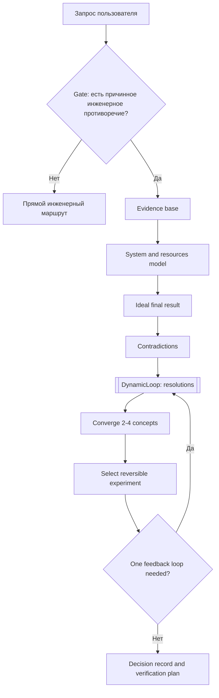

# Исследование TRIZ-метода для task-orchestrator

> **Задача:** [TASK-research-triz-method](../../../todo/done/TASK-research-triz-method.todo.md)
> **Дата исследования:** 2026-08-12
> **Аналитик:** Аналитик Шерлок
> **Объект:** TRIZ (теория решения изобретательских задач, Theory of Inventive Problem Solving) и репозиторий [`snow-ghost/triz`](https://github.com/snow-ghost/triz)

## 1. Reverse Briefing (подтверждение понимания)

Я понял задачу так:

- нужно исследовать не новый фреймворк, а **метод разрешения инженерных противоречий**, пригодный для последующей реализации в `task-orchestrator`;
- нужно отделить классический TRIZ от программной адаптации в `snow-ghost/triz` и явно указать границы применимости;
- нужно сопоставить workflow (рабочий процесс) TRIZ с текущими примитивами проекта: [`ChainDefinition`](../../guide/architecture.md#модуль-chaindefinition), [`ChainExecution`](../../guide/architecture.md#модуль-chainexecution), [`DynamicLoop`](../../guide/architecture.md#модуль-dynamicloop), условное ветвление, роли и skills (скиллы);
- нужно сравнить четыре варианта реализации и дать вердикт с фазированным планом;
- нельзя писать код, создавать новые `todo`-задачи, выполнять commit (коммит), push (публикацию ветки), PR (запрос на слияние) или merge (слияние).

## 2. Срез источников и проверяемость

### 2.1. Внешний репозиторий `snow-ghost/triz`

| Поле | Значение |
| --- | --- |
| URL | <https://github.com/snow-ghost/triz> |
| Дата обращения | 2026-08-12 |
| Основная ветка (default branch) | `main` |
| Снимок `main` (snapshot) | `a6afacae49e36b257a049c08dc639effe5588d19` |
| Дата коммита (commit date) | 2026-08-05T19:44:45Z |
| Сообщение коммита (commit message) | `Correct v0.1.0 release date` |
| Метка версии (tag) | `v0.1.0` |
| Снимок метки (tag snapshot) | `baf54da752977205b9bad6c57f8d92261527426e` |
| Лицензия | MIT |
| Описание GitHub | `Portable evidence-first TRIZ Agent Skill for software engineering contradictions` |
| Заявленный статус | `version 0.1 is an evaluated prototype` |

Изученные файлы snapshot `main`:

- `README.md`;
- `skills/triz/SKILL.md`;
- `skills/triz/references/core-method.md`;
- `skills/triz/references/inventive-principles.md`;
- `skills/triz/references/software-patterns.md`;
- `skills/triz/references/examples.md`;
- `skills/triz/references/sources.md`;
- `docs/plan.md`;
- `docs/research.md`;
- `docs/evaluation.md`;
- `evals/README.md`;
- `evals/rubric.md`.

### 2.2. Надёжные источники по TRIZ

| Источник | URL | Дата обращения | Что использовано |
| --- | --- | --- | --- |
| MATRIZ Knowledge Base: Contradictions | <https://wiki.matriz.org/docs/triz/problem-solving-tools-5890/contradictions/> | 2026-08-12 | Различие engineering/technical contradiction (инженерное/техническое противоречие) и physical contradiction (физическое противоречие). |
| MATRIZ Knowledge Base: Ideal Final Result | <https://wiki.matriz.org/docs/triz/problem-solving-tools-5890/ariz-5892/ideal-final-result-5922/> | 2026-08-12 | Определение ideal final result (идеальный конечный результат) как модели лучшего решения с минимальными изменениями и без ухудшений. |
| AI TRIZ: TRIZ Body of Knowledge | <https://www.aitriz.org/triz/triz-body-of-knowledge> | 2026-08-12 | Подтверждение, что contradictions, ideality, ARIZ, Substance-Field Analysis, inventive principles и separation являются отдельными частями корпуса TRIZ. |
| arXiv: TRIZ Agents | <https://arxiv.org/abs/2506.18783v1> | 2026-08-12 | Пример multi-agent (многоагентного) TRIZ-workflow и ограничения: стоимость, prompt sensitivity (чувствительность к промптам), отсутствие feedback loop (петли обратной связи). |
| `snow-ghost/triz` sources | <https://github.com/snow-ghost/triz/blob/main/skills/triz/references/sources.md> | 2026-08-12 | Самоописание границ пакета: это software-oriented workflow, не полная ARIZ-85C, не 76 standard solutions и не официальная contradiction matrix (матрица противоречий). |

## 3. Факты и выводы: разделение

### 3.1. Факты из источников

- MATRIZ описывает два типа противоречий: engineering/technical contradiction — улучшение одного параметра ухудшает другой; physical contradiction — один параметр имеет два обоснованных конфликтующих требования.
- MATRIZ определяет ideal final result как модель лучшего решения, где проблема устраняется с минимальными изменениями системы и без ухудшения параметров.
- `snow-ghost/triz` реализует TRIZ как Agent Skill (скилл агента), а не как runtime-framework (исполняемый фреймворк), CLI (командную утилиту) или оркестратор.
- `snow-ghost/triz` явно не реализует полную ARIZ-85C, 76 standard solutions (76 стандартных решений), Substance-Field Analysis (вещественно-полевой анализ) и каноническую contradiction matrix 39×39.
- `snow-ghost/triz` хранит канонический workflow в `skills/triz/SKILL.md`, а расширенные материалы загружает через `references/*.md` по необходимости.
- Оценка `snow-ghost/triz` v0.1 exploratory (исследовательская): финальный smoke (дымовой прогон) показал предпочтение TRIZ на 3/3 выбранных кейсах, но кейсы были выбраны после настройки, поэтому общий прирост качества не доказан.

### 3.2. Выводы для `task-orchestrator`

- TRIZ полезен только при причинном trade-off (компромиссном конфликте): конкретное действие улучшает одну сторону и через понятный механизм ухудшает другую.
- Для обычного бага, стандартного паттерна или задачи без измерений TRIZ должен быть отклонён gate (проверкой применимости) и заменён прямым инженерным маршрутом.
- Безопасный ближайший дизайн для `task-orchestrator` — **Phase 0–1 now**: переносимый skill (скилл) с явной активацией и статическая/условная YAML-chain (YAML-цепочка) для воспроизводимого TRIZ-workflow. Полный гибрид chain + [`DynamicLoop`](../../guide/architecture.md#модуль-dynamicloop) стоит **defer** (отложить) до решения по composition (композиции запусков) и eval (оценке качества).
- Важно: текущие chain-типы являются раздельными (`static`, `conditional`, `dynamic`). «Гибрид» сейчас означает ручную или внешнюю композицию нескольких запусков; вложенный динамический шаг (dynamic step) внутри YAML-chain — отдельная будущая feat-доработка.
- Новый модуль имеет смысл только после накопления повторяемых сценариев, метрик качества и потребности в собственных VO (value objects, объекты-значения), invariants (инвариантах), аудит-модели или API (программном контракте).

## 4. Суть метода TRIZ

**TRIZ** — метод системного поиска решений для задач, где прямое улучшение одного свойства системы ухудшает другое свойство или где один элемент должен обладать противоположными состояниями при разных условиях.

### 4.1. Какую проблему решает

TRIZ борется с ранним выбором midpoint compromise (срединного компромисса). Вместо ответа «сделаем немного быстрее, но немного менее надёжно» метод требует:

1. доказать, что конфликт причинный;
2. сформулировать противоречие;
3. найти разделение конфликтующих состояний по времени, структуре, условию или масштабу;
4. переиспользовать ресурсы системы;
5. выбрать проверяемый эксперимент.

### 4.2. Ключевые концепции

| Концепция | Смысл для инженерной задачи | Пример в software (программной системе) |
| --- | --- | --- |
| Technical contradiction (техническое противоречие) | Действие улучшает параметр X, но ухудшает Y через понятный механизм. | Полный набор тестов повышает compliance coverage (покрытие соответствия требованиям), но ухудшает feedback latency (скорость обратной связи), потому что блокирует первый результат. |
| Physical contradiction (физическое противоречие) | Один элемент должен иметь противоположные состояния при разных условиях. | Validation (валидация) должна быть strict (строгой) для внешнего API и flexible (гибкой) для внутренних миграций. |
| Ideal final result (идеальный конечный результат) | Направление поиска: полезная функция выполняется существующим ресурсом без вреда и лишней механики. | Существующий CI (не новый сервис) даёт быстрый сигнал разработчику и сохраняет полный compliance gate (обязательную проверку соответствия). |
| Separation (разделение) | Разнести конфликтующие состояния по времени, пространству/структуре, условию или масштабу. | Быстрые targeted tests (целевые тесты) до merge gate (ворот слияния), полный suite (набор тестов) — параллельно и до release. |
| Inventive principles (изобретательские принципы) | Каталог подсказок для генерации механизмов, а не доказательство решения. | Segmentation (сегментация) → разделить горячий и холодный путь; Feedback (обратная связь) → адаптивная выборка трассировок. |
| Resources (ресурсы) | Уже доступные данные, метаданные, время, топология, capacity (ёмкость), control signals (управляющие сигналы), ошибки. | Использовать transaction log (журнал транзакций) как durable source (надёжный источник), а не вводить новый брокер. |

### 4.3. Границы метода

TRIZ **не нужен**, если:

- это routine bug (обычный дефект) с воспроизводимым исправлением;
- проблему закрывает известный стандартный паттерн без остаточного противоречия;
- нет причинного действия, которое одновременно создаёт пользу и вред;
- данных недостаточно и сначала нужна measurement task (задача измерения);
- вопрос является обычной приоритизацией или продуктовым выбором без инженерного механизма.

### 4.4. Отличие от ARIZ-85C, 76 стандартов и матрицы 39×39

- **ARIZ-85C** — формальный алгоритм решения изобретательских задач. Он глубже и тяжелее, чем компактный TRIZ-workflow для кодового агента.
- **76 standard solutions** — отдельный корпус решений TRIZ, исторически связанный с substance-field analysis. Он не обязателен для первого программного workflow.
- **Contradiction matrix 39×39** — классическая таблица параметров и принципов для физических систем. В программных задачах прямой lookup (поиск по таблице) неоднозначен: параметры вроде веса, формы или температуры требуют эвристического переноса. Поэтому в MVP матрица не должна быть маршрутизатором.

## 5. Архитектура `snow-ghost/triz`

### 5.1. Что реализовано

`skills/triz/SKILL.md` кодирует compact workflow (компактный процесс):

```text
gate → evidence → system/resources → ideal final result → contradictions → resolutions → convergence → select/verify → feedback loop
```

Главные свойства:

- frontmatter содержит только `name` и `description`, чтобы сохранить переносимость;
- `description` задаёт положительные и отрицательные триггеры;
- основной `SKILL.md` короткий и процедурный;
- `references/core-method.md` загружается для deep pass (глубокого прохода);
- `references/software-patterns.md` загружается после инспекции репозитория;
- `references/inventive-principles.md` загружается только когда разделение и ресурсы не дали достаточно концепций;
- `references/examples.md` нужен для калибровки routing (маршрутизации);
- `references/sources.md` фиксирует источники и scope (границы).

### 5.2. Gate и workflow

| Этап | Что делает skill |
| --- | --- |
| Choose depth | Выбирает quick pass (быстрый проход), deep pass или skip (отказ от TRIZ). |
| Pass the gate | Проверяет факты, причинный конфликт, наличие дешёвого измерения или стандартного паттерна. |
| Build evidence base | Делит вход на facts (факты), constraints (ограничения), assumptions (допущения), unknowns (неизвестное). |
| Model system/resources | Называет функцию, вред, границу системы, supersystem (надсистему) и существующие ресурсы. |
| State ideal final result | Формулирует направление решения без обещания невозможного. |
| Formulate contradictions | Пишет техническое, обратное техническое и при необходимости физическое противоречие. |
| Generate resolutions | Пробует separation, resource reassignment (переназначение функции), затем inventive principles. |
| Converge concepts | Оставляет 2–4 концепции с механизмом, ресурсом, риском и falsifying check (проверкой на опровержение). |
| Select and verify | Ранжирует по снятию противоречия, evidence, feasibility (реализуемости), reversibility (обратимости), blast radius (радиусу поражения) и стоимости проверки. |
| One feedback loop | Делает одну ревизию после критики или теста, затем останавливается. |

### 5.3. Design rationale (обоснование дизайна)

`snow-ghost/triz` явно проектировался против двух рисков:

1. **Context overload (перегрузка контекста):** слишком полный skill ухудшает выбор и повышает стоимость; поэтому основной файл компактный.
2. **Framework theater (театральное следование фреймворку):** агент может проиграть baseline (базовому ответу), если терминология метода вытесняет расчёты и конкретику; поэтому TRIZ-trace скрывается при неявном применении.

Отдельно важно: стандартный инженерный паттерн считается валидным результатом. Skill не должен переименовывать transactional outbox (транзакционный outbox) или feature flags (флаги возможностей) в «изобретение».

### 5.4. Eval-подход v0.1

`evals/` реализует paired evaluation (парное сравнение):

- `baseline`: агент без локального TRIZ-скилла;
- `triz`: тот же агент с локальным `skills/triz`;
- ответы перемешиваются в A/B;
- judge (судья) оценивает вслепую по 7 шкалам 0–2;
- отдельно штрафуется `framework_theater` на 0–3 балла;
- фиксируются critical errors (критические ошибки) и preference (предпочтение).

Факт по v0.1: после настройки финальный regression smoke дал TRIZ preference 3/3 и +1.67 mean delta (средняя разница), но это не независимое доказательство общего эффекта, потому что кейсы были выбраны после анализа ошибок.

## 6. Маппинг TRIZ workflow → примитивы `task-orchestrator`

| Шаг TRIZ | Примитив `task-orchestrator` | Роли и артефакты | Комментарий |
| --- | --- | --- | --- |
| Gate: TRIZ или прямой метод | Conditional chain (условная цепочка) через `when:`-выражения и `ConditionalExecutionStrategyService` | Аналитик Шерлок как router (маршрутизатор) | Реально существующий примитив — step-level (на уровне шага) условие по `passed`, `exitCode`, `status` предыдущего именованного шага (`==`, `!=`). Смысловой gate (маршрутизация по тексту ответа агента) сейчас не является готовым примитивом. Для текущего MVP gate должен быть только deterministic `quality_gate` (детерминированная проверка pass/fail). `tool` (инструментальный шаг) не считать готовым gate: его stdout не является условием `when:`; tool/output conditions (условия по выводу tool) — отдельная feat-доработка. |
| Evidence base | Role context (контекст роли), чтение `AGENTS.md`, [`Конвенций`](../../conventions/index.md), кода, тестов, логов | Аналитик Шерлок | Выход: facts/constraints/assumptions/unknowns. |
| Модель системы и ресурсов | Static step (статический шаг) в YAML-chain | Архитектор Гэндальф | Выход: граница системы, useful function, harmful effect, ресурсы. |
| Ideal final result | Static step | Архитектор Гэндальф + Аналитик Шерлок | Выход: одно directional statement (направляющее утверждение). |
| Формулировка противоречий | Static step | Аналитик Шерлок | Выход: technical contradiction, inverted contradiction, optional physical contradiction. |
| Генерация разрешений | [`DynamicLoop`](../../guide/architecture.md#модуль-dynamicloop) как отдельная dynamic-цепочка или будущий компонуемый шаг | Архитектор Гэндальф, Архитектор Локи, при необходимости Бэкендер | `max_rounds` ограничивает число раундов, но сам по себе не гарантирует TRIZ-стадии. Для фазности нужны TRIZ prompts (промпты стадий) на уровне ролей/цепочки, либо будущая feat-доработка `phase`/`round_goal` (цель раунда) в DSL; без этого фазность лучше держать в static/conditional части. |
| Сходимость концепций | DynamicLoop finalize или отдельный static step | Архитектор Локи + Аналитик Шерлок | Выход: 2–4 концепции; Локи ищет слепые зоны и residual trade-off (остаточный компромисс). |
| Выбор и проверка | Static decision step + optional quality gate (проверка качества) | QA Хаус, Ревьювер Пуаро, Бэкендер | Для docs/analysis — план эксперимента; для будущей реализации — тесты и проверки. |
| Feedback loop | Один ограниченный `DynamicLoop` revision round (раунд ревизии) | Фасилитатор + профильные роли | Не превращать в бесконечную генерацию принципов; лимит задаётся настройками dynamic-цепочки (`max_rounds`, budget), а не неявным поведением агента. |
| Decision record (запись решения) | Markdown report (отчёт) + JSONL audit (журнал аудита) | Аналитик Шерлок | Итог должен вести инженерным решением, а не демонстрацией методологии. |

### 6.1. Диаграмма исполнения



## 7. Сравнение вариантов реализации

| Вариант | Усилие | Соответствие конвенциям | Плюсы | Ограничения | Когда выбирать |
| --- | --- | --- | --- | --- | --- |
| 1. Порт skill «как есть» | S | Высокое: `docs/agents/skills` без нового runtime-кода | Быстро; сохраняет progressive disclosure; можно использовать вручную сразу | Сам каталог skill недостаточен: нужны привязки в frontmatter целевых ролей (`skills:`) или manual explicit invocation (ручной явный вызов); нет state (состояния), audit (аудита) и chain-gate | Как Phase 0 для ручного использования и проверки формата skill. |
| 2. YAML-chain (`ChainDefinition`) | M | Высокое: использует существующий DSL (предметный язык) цепочек | Воспроизводимый линейный workflow; простой audit; понятная маршрутизация шагов | Слабая дивергенция; gate в MVP только через `quality_gate`; условия по `tool` output (выводу tool) не готовы | Когда нужен управляемый scripted process (сценарный процесс) без нового Domain. |
| 3a. Гибрид: ручные последовательные запуски | S/M | Высокое: композиция на уровне оператора/Тимлида | Позволяет проверить TRIZ-flow без нового DSL; минимальный риск | Нет единого audit trail (журнала аудита), выше ручная дисциплина; фазность DynamicLoop обеспечивается промптами, а не `max_rounds` | Как промежуточная проверка перед автоматизацией. |
| 3b. Гибрид: wrapper command (команда-обёртка) | M | Высокое при размещении в Presentation/Application (слой представления/приложения), без нового Domain | Даёт единый запуск static/conditional + dynamic частей; можно централизовать параметры и отчёт | Требует решения по I/O contract (контракту ввода/вывода), audit trail и ошибкам композиции | Если eval подтвердит пользу гибрида и нужна удобная команда. |
| 3c. Гибрид: nested DSL (вложенный DSL) | L | Требует отдельного дизайна `ChainDefinition`/`ChainExecution` | Наиболее цельная модель: dynamic step внутри chain, единая история выполнения | Крупный blast radius (радиус изменений); нужно проектировать resume, budget, audit, errors и `phase`/`round_goal` | Только после отдельного архитектурного решения о composition. |
| 4. Новый модуль TRIZ Domain | L | Потенциально высокое, но только при наличии устойчивого контракта | Нативные VO, invariants (инварианты), audit model (модель аудита), API, тестируемые правила | Риск overengineering (переусложнения); преждевременно до проверки спроса и eval; если правила выражаются chain/skill, Domain не нужен | Отложить до фазы full, если появятся невыразимые chain/skill бизнес-правила. |

### 7.1. Честные альтернативы

| Альтернатива | Усилие | Сильная сторона | Слабое место | Вердикт |
| --- | --- | --- | --- | --- |
| Skill-first + eval | S → M/L | Минимальная цена старта; быстро проверяет полезность метода | Не даёт оркестрации ролей и аудита в chain | **Лучший ближайший маршрут:** Phase 0 + skeleton eval. |
| Static-only chain | M | Максимальная воспроизводимость и простота | Меньше дивергенции и критики концепций | Подходит для Phase 1 сейчас. |
| Dynamic-only | M | Хорошо генерирует и критикует идеи | Плохо гарантирует gate/evidence/IFR/contradiction; `max_rounds` не кодирует TRIZ-стадии | Не выбирать как основной MVP. |
| External wrapper | M | Автоматизирует композицию без ломки DSL | Отдельный контракт ошибок, аудита и UX (пользовательского опыта) | Кандидат после eval и решения по composition. |

### 7.2. Вердикт

**Вердикт: implement Phase 0–1 now; full hybrid defer до eval/composition decision (решения об оценке и композиции).**

Обоснование:

- TRIZ workflow содержит линейные обязательные этапы и дивергентную генерацию решений. Но текущая архитектура не даёт готового вложенного dynamic step (динамического шага) и не даёт смыслового route selector (выбора маршрута) из вывода агента.
- Ближайшая ценность достигается без нового кода: skill с явной привязкой к ролям/ручным вызовом и static/conditional YAML-chain с `quality_gate`.
- Полный гибрид лучше всего подходит как целевой дизайн, но только после проверки полезности на eval и выбора механики composition: ручные последовательные запуски, wrapper command или nested DSL.
- Новый Domain-модуль преждевременен: `snow-ghost/triz` v0.1 сам признаёт exploratory status, а в проекте пока нет подтверждённых внутренних сценариев, stable I/O contract и правил, невыразимых chain/skill.

## 8. Рекомендация и фазированный план

### Фаза 0 — Skill MVP (S)

Цель: дать команде ручной TRIZ-скилл без изменения runtime-кода.

Prerequisites (предпосылки):

- согласовать лицензионно допустимый объём переноса из MIT-репозитория;
- адаптировать формулировки под правила документации проекта;
- добавить skill в `docs/agents/skills/triz/SKILL.md` с условными `references/`;
- **обязательно выбрать режим активации:**
  - привязать `triz` во frontmatter целевых ролей (`skills:`) — например, Аналитик Шерлок, Архитектор Гэндальф/Локи;
  - либо оставить режим manual explicit invocation (ручной явный вызов), где пользователь/Тимлид прямо просит применить TRIZ и агент читает `SKILL.md` по пути.

Результат:

- выбранные роли получают skill для ручного применения или есть документированный ручной путь вызова;
- нет нового кода и новых слоёв.

### Фаза 1 — Scripted TRIZ chain (M)

Цель: описать линейный workflow в YAML.

Содержание:

- chain: gate → evidence → model/resources → IFR → contradictions → concepts → selection;
- роли: Аналитик Шерлок, Архитектор Гэндальф, Архитектор Локи, QA Хаус;
- output contract (контракт вывода): decision record с facts/unknowns, contradiction, concepts, experiment.

Prerequisites:

- стабильный формат chain definitions;
- проверка ссылок на role prompts;
- примеры входных задач;
- для автоматического gate в MVP: только детерминированный `quality_gate` с кодом выхода; простого текста агентского вывода текущим `when:` недостаточно;
- если нужен gate по `tool` stdout или по структурированному agent output (выводу агента), это отдельная feat-доработка tool/output conditions.

### Фаза 2 — Hybrid chain + `DynamicLoop` (defer, S/M → M → L по способу композиции)

Цель: заменить генерацию и ревизию концепций на dynamic loop только после Phase 0–1 и первичной оценки.

Варианты реализации effort (усилия):

| Способ композиции | Усилие | Что это означает |
| --- | --- | --- |
| Ручные последовательные запуски | S/M | Оператор запускает scripted chain, затем отдельный dynamic chain, затем синтез. |
| Wrapper command (команда-обёртка) | M | Одна CLI-команда координирует несколько существующих chain-запусков и собирает итоговый отчёт. |
| Nested DSL (вложенный DSL) | L | YAML-chain получает нативный dynamic step/composition primitive (примитив композиции). |

Содержание:

- static/conditional chain до формулировки contradiction;
- отдельный запуск `DynamicLoop` для separation/resources/principles или будущий компонуемый dynamic step;
- TRIZ prompts для раундов: separation, resource reassignment, inventive principles, software patterns, critique;
- один feedback loop;
- budget limits (лимиты бюджета) и stopping rules (правила остановки);
- финальный synthesis (синтез) от Аналитика или Архитектора.

Prerequisites:

- условное ветвление из `EPIC-sprint-8-conditional-branching` уже закрыто в [`todo/done/EPIC-sprint-8-conditional-branching.md`](../../../todo/done/EPIC-sprint-8-conditional-branching.md), но его текущая гранулярность — шаговые `when:`-условия;
- зрелость `DynamicLoop` для управляемой фасилитации;
- решение о способе композиции static/conditional и dynamic частей;
- если нужна строгая фазность внутри `DynamicLoop`, нужна отдельная feat-доработка `phase`/`round_goal`; иначе фазность остаётся в static/conditional chain и prompts;
- договорённость о формате audit trail (журнала аудита).

### Фаза 3 — Evaluation (M/L)

Цель: проверить, что TRIZ-chain улучшает решения на подходящих кейсах и не ухудшает routine cases (рутинные случаи).

Подварианты:

| Подход | Усилие | Содержание |
| --- | --- | --- |
| Harness skeleton (каркас оценочного стенда) | M | Структура кейсов, runner-команда, rubric (рубрика), сохранение A/B артефактов, без большой кампании. |
| Behavioral blind A/B campaign (поведенческая слепая A/B-кампания) | L | Достаточная выборка кейсов, независимое blind scoring, анализ статистики и ошибок routing/framework theater. |

Минимальное содержание:

- baseline chain vs TRIZ chain;
- blind scoring по рубрике, похожей на `snow-ghost/triz/evals/rubric.md`;
- негативные кейсы: routine bug, standard pattern, insufficient evidence;
- метрики: correctness (корректность), routing, evidence discipline, verification plan, framework theater.

### Фаза 4 — Native TRIZ module (L, defer)

Цель: вводить только при доказанной повторяемости и недостаточности chain/skill.

Условия старта:

- есть не менее 10–20 внутренних кейсов;
- есть stable I/O contract (стабильный контракт ввода/вывода): входная модель проблемы, evidence, contradiction, concepts, experiment, decision record;
- нужны типизированные VO, собственные Domain-сервисы и invariants: причинный trade-off доказан, unknowns отделены от facts, output содержит falsifying check, selection опирается на evidence;
- нужна audit model/API: история gate decisions (решений gate), выбранные принципы, отклонённые варианты, правила остановки, связь с задачей/PR;
- появились правила, которые невыразимы chain/skill без хрупких промптов или shell-проверок;
- цепочки перестают быть достаточными из-за бизнес-инвариантов.

## 9. Draft порождаемых feat-задач

> Ниже только draft (черновики). Новые `todo`-задачи в рамках текущей research-задачи не создавались.

1. `TASK-feat-triz-skill` — добавить `docs/agents/skills/triz/` с компактным `SKILL.md` и references, адаптированными под проект; указать режим активации через role frontmatter (`skills:`) или manual explicit invocation.
2. `TASK-feat-triz-yaml-chain` — описать TRIZ scripted workflow в `config/chains.yaml` или отдельном chain-файле по существующему DSL; gate в MVP — через `quality_gate`.
3. `TASK-feat-triz-output-conditions` — если потребуется, добавить условия по `tool` stdout / structured agent output как отдельную feat-доработку, не смешивать с TRIZ-chain MVP.
4. `TASK-feat-triz-dynamic-loop-manual-composition` — проверить ручные последовательные запуски scripted chain + `DynamicLoop` + synthesis.
5. `TASK-feat-triz-wrapper-command` — добавить wrapper command для композиции static/conditional и dynamic частей после eval/composition decision.
6. `TASK-feat-triz-nested-dsl` — исследовать/реализовать nested DSL с dynamic step только отдельным крупным дизайном.
7. `TASK-feat-triz-eval-harness-skeleton` — создать внутренний paired eval skeleton для baseline vs TRIZ-chain без внешних сервисов в тестах.
8. `TASK-feat-triz-blind-ab-campaign` — провести behavioral blind A/B campaign после появления skeleton и набора кейсов.
9. `TASK-feat-triz-docs-guide` — задокументировать, когда запускать TRIZ, когда отказывать gate и как читать decision record.
10. `TASK-research-triz-native-module-readiness` — повторно оценить необходимость Domain-модуля после накопления кейсов, stable I/O contract и невыразимых chain/skill правил.

## 10. Интеграция с существующими возможностями

| Возможность проекта | Как использовать для TRIZ |
| --- | --- |
| Роли команды | Аналитик Шерлок формулирует facts/constraints/contradictions; Архитектор Гэндальф строит системную модель; Архитектор Локи ищет контрпримеры; QA Хаус задаёт falsifying checks; Ревьювер Пуаро проверяет реализационные риски. |
| Условное ветвление | Gate может быть выражен через шаговые `when:`-условия, если результат gate сводится к `passed`, `exitCode` или `status` предыдущего шага. Для MVP использовать `quality_gate`; `tool` stdout и смысловой agent output не являются готовыми условиями и требуют отдельной feat-доработки. Это предотвращает «TRIZ-для-всего». |
| `DynamicLoop` | Раунды генерации separation/resources/principles и один feedback loop. Важно: `max_rounds` только ограничивает цикл; TRIZ-фазы должны задаваться prompts или будущими `phase`/`round_goal`, иначе фазность остаётся во внешней static/conditional chain. |
| Brainstorm | Можно использовать как fallback (запасной маршрут) для широкого поиска, но TRIZ отличается строгим causal gate и проверкой противоречий. |
| `AGENTS.md` и `Конвенции` | Evidence base для репозиторных задач: границы слоёв, запреты, обязательные проверки, workflow задач. |
| GitIdentity | Не часть метода TRIZ. В будущих feat-задачах важен только для корректной identity (идентичности) agent commits (коммитов агента) и PR по правилам проекта. |

## 11. Риски и ограничения

- **Ложные срабатывания gate.** Агент может принять обычный trade-off (компромиссный конфликт) за TRIZ-задачу. Нужны отрицательные примеры и прямой маршрут (direct route).
- **Framework theater.** Методологический отчёт может вытеснить инженерную конкретику. В пользовательском результате TRIZ-trace должен быть кратким или скрытым, если TRIZ не просили явно.
- **Перегрузка контекста.** Полный перенос всех справочников ухудшит выбор. Нужна progressive disclosure: основной `SKILL.md` короткий, references грузятся условно; сам каталог skill бесполезен без role binding (привязки к роли) или явного ручного вызова.
- **Фальшивая фазность DynamicLoop.** `max_rounds` не гарантирует стадии TRIZ; без prompts или `phase`/`round_goal` агент может смешать separation, resources, principles и critique.
- **Недоказанная полезность v0.1.** Результаты `snow-ghost/triz` являются exploratory, а не доказанным lift (улучшением качества).
- **Преждевременный Domain-модуль.** Без внутренних кейсов, stable I/O contract, audit model/API и невыразимых chain/skill правил новый bounded context создаст долг.

## 12. Итоговая рекомендация

Реализовывать TRIZ в `task-orchestrator` стоит, но не как новый модуль на первом шаге.

Рекомендуемый маршрут:

1. **implement now:** начать с переносимого skill MVP, но обязательно выбрать role binding через frontmatter (`skills:`) или manual explicit invocation;
2. **implement now:** описать scripted YAML-chain с `quality_gate` как единственным MVP-gate;
3. **evaluate:** добавить harness skeleton и собрать первые A/B-артефакты;
4. **defer:** полный гибрид chain + `DynamicLoop` внедрять только после eval/composition decision; сначала выбрать ручные последовательные запуски, wrapper command или nested DSL;
5. **defer:** решение о native module принять только после данных, stable I/O contract, audit model/API и правил, невыразимых chain/skill.

Статус решения: **implement Phase 0–1 now; full hybrid defer; Domain module defer**.
