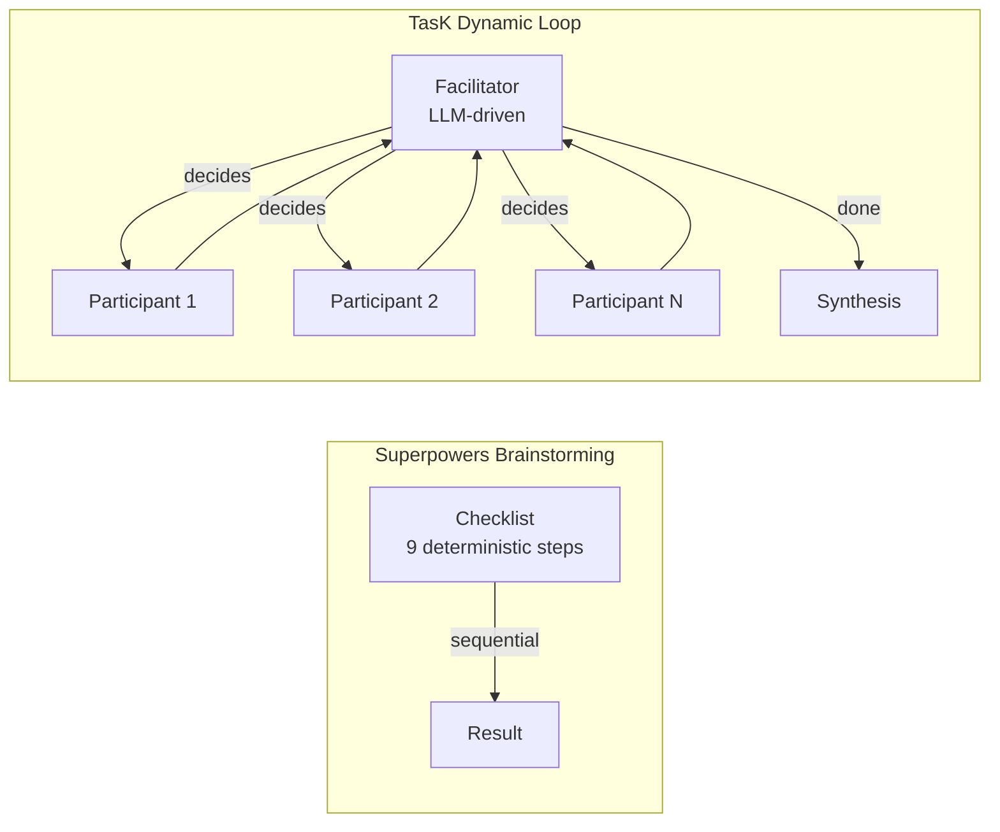

# Исследование: Superpowers Brainstorming Skill — сравнение с TasK Orchestrator Dynamic Loop

> **Проект:** [github.com/obra/superpowers](https://github.com/obra/superpowers) — skill [`brainstorming/SKILL.md`](https://github.com/obra/superpowers/blob/main/skills/brainstorming/SKILL.md)
> **Дата анализа:** 2026-04-16
> **Аналитик:** Аналитик (pi)

---

## 1. Обзор Superpowers Brainstorming Skill

Brainstorming Skill — навык (skill) из проекта obra/superpowers для структурирования взаимодействия AI с пользователем при проектировании. Ключевая идея: **design before implementation** — обязательный фаза дизайна с gate-проверкой до перехода к коду.

### Процесс (9 шагов)

| Шаг | Описание | Тип |
|---|---|---|
| 1. Explore project context | Изучение файлов, документации, коммитов | Input |
| 2. Offer visual companion | Предложить визуальный инструмент (браузер) для mockup'ов | Optional |
| 3. Ask clarifying questions | Уточнение по одному вопросу за раз | Interactive |
| 4. Propose 2-3 approaches | Варианты с trade-offs и рекомендацией | Output |
| 5. Present design | Пошаговое представление дизайна с валидацией | Interactive |
| 6. Write design doc | Сохранение спецификации в Markdown | Output |
| 7. Spec self-review | Проверка на placeholders, contradictions, ambiguity | Validation |
| 8. User review | Пользователь проверяет написанную спецификацию | Gate |
| 9. Transition to implementation | Передача в writing-plans skill | Transition |

### Ключевые принципы

| Принцип | Суть |
|---|---|
| **HARD-GATE** | Запрет на реализацию до одобрения дизайна — для ВСЕХ проектов, включая «простые» |
| **One question at a time** | Фокус на уточнении, не перегружать пользователя |
| **Multiple choice preferred** | Легче отвечать, чем open-ended |
| **2-3 approaches** | Обязательно предложить несколько вариантов с trade-offs |
| **YAGNI ruthlessly** | Удалить ненужные фичи из дизайна |
| **Incremental validation** | Дизайн секция за секцией, с approval после каждой |
| **Decomposition** | Слишком большой проект → разбить на подпроекты |
| **Design for isolation** | Модульность, well-defined interfaces |
| **Self-review** | Проверка спецификации: placeholders, contradictions, ambiguity |

### Anti-patterns

- **"This Is Too Simple To Need A Design"** — каждый проект проходит через процесс, даже однострочные утилиты
- **Jumping to implementation** — HARD-GATE блокирует вызов любых implementation skill'ов

---

## 2. Сравнительная таблица

### 2.1. Концептуальное сравнение

| Концепт | Superpowers Brainstorming | TasK Dynamic Loop | Пересечение |
|---|---|---|---|
| **Управление процессом** | Checklist (9 шагов), deterministic | Facilitator (LLM), emergent | 🔀 Разные подходы |
| **Роль фасилитатора** | Нет — AI сам следует checklist'у | Да — выделенная роль `facilitator` решает кому дать слово | Наш гибче |
| **Роли участников** | AI + User (2 стороны) | Facilitator + N участников (ролей) | Наш богаче |
| **Gate перед реализацией** | HARD-GATE (design approval) | Quality Gate (shell-команда) | 🔀 Разная семантика |
| **Итеративность** | Design ↔ clarification cycles | Facilitator ↔ Participant rounds | Аналог |
| **Self-review** | Проверка spec: placeholders, contradictions | Quality Gate: shell-команды (lint, tests) | 🔀 Разные уровни |
| **Бюджет/лимиты** | Нет (бесконечный диалог) | BudgetVo (maxCostTotal, maxCostPerStep) | Наш строже |
| **Audit trail** | Дизайн-документ (Markdown) | JSONL audit trail | Оба имеют |
| **Multiple approaches** | Обязательное требование (2-3) | Нет — facilitator решает | Стоит взять |
| **Decomposition** | Явный шаг в процессе | Нет | Стоит взять |
| **One question at a time** | Принцип взаимодействия | Нет — facilitator может задавать несколько | Стоит взять |

### 2.2. Функциональное сравнение

| Функция | Superpowers | TasK Orchestrator | Статус |
|---|---|---|---|
| **Фасилитатор** | Нет (AI = facilitator + designer) | ✅ Выделенная роль, JSON-решение | ✅ У нас лучше |
| **Множественные роли** | Нет (AI + User) | ✅ N ролей (.md промпты) | ✅ У нас лучше |
| **Budget control** | Нет | ✅ BudgetVo + CheckDynamicBudgetService | ✅ У нас лучше |
| **Quality gates** | Self-review (text analysis) | ✅ Shell-команды (QualityGateVo) | ✅ У нас лучше |
| **Circuit breaker** | Нет | ✅ CircuitBreakerAgentRunner | ✅ У нас лучше |
| **Retry** | Нет | ✅ RetryingAgentRunner + RetryPolicyVo | ✅ У нас лучше |
| **Fallback runner** | Нет | ✅ FallbackConfigVo | ✅ У нас лучше |
| **Audit trail** | Design doc (Markdown) | ✅ JSONL + session files | ✅ У нас лучше |
| **Checklist-driven process** | ✅ 9 обязательных шагов | ❌ Нет — facilitator решает | 🔴 Берём |
| **Multiple approaches** | ✅ Обязательно 2-3 варианта | ❌ Нет | 🔴 Берём |
| **Decomposition** | ✅ Явный шаг при большом scope | ❌ Нет | 🟡 Берём позже |
| **Self-review** | ✅ Spec validation (4 критерия) | ❌ Нет текстового self-review | 🔴 Берём |
| **One question at a time** | ✅ Принцип общения | ❌ Нет — facilitator свободен | 🟡 Берём позже |
| **HARD-GATE** | ✅ Запрет реализации до дизайна | ❌ Нет — цепочка выполняется полностью | 🟡 Берём позже |
| **Visual companion** | ✅ Браузерный mockup-инструмент | ❌ Нет | 🟢 Не берём |
| **Design for isolation** | ✅ Принцип модульности | ✅ DDD layers, interfaces | ✅ Паритет |
| **YAGNI** | ✅ Явный принцип | ❌ Нет явного принципа | 🟡 Стоит внедрить |

---

## 3. Анализ пересечений

### 3.1. С Dynamic Loop (Facilitator + Participants)

Brainstorming skill описывает **детерминированный** процесс: checklist из 9 шагов, которые AI выполняет последовательно. Наш dynamic loop — **эмерджентный** процесс: фасилитатор (LLM) решает, кому дать слово в каждом раунде.

**Ключевое различие:**



**Пересечение:** Оба подхода реализуют итеративный процесс с уточнением и валидацией. Но:
- Superpowers = **scripted** (предсказуемый, но негибкий)
- TasK = **adaptive** (гибкий, но зависит от качества фасилитатора)

**Вывод:** Наш dynamic loop — более мощная модель. Но checklist-driven подход полезен для **дисциплинирования** фасилитатора — можно добавить в промпт фасилитатора инструкции следовать определённому процессу.

### 3.2. Со Static Chain (Fixed Steps)

Static chain — фиксированные шаги с retry-группами. Это ближе к brainstorming checklist: тоже последовательность шагов. Но:

| Аспект | Static Chain | Brainstorming Checklist |
|---|---|---|
| **Порядок** | Фиксированный YAML | Фиксированный checklist |
| **Условия перехода** | Quality gate (exit code) | User approval |
| **Итерации** | fixIterationGroup (retry) | Design revision cycle |
| **Gate тип** | Shell-команда | Текстовый review |

**Пересечение:** Static chain может быть использован для реализации brainstorming-подобного процесса: шаги = checklist items, quality gate = approval check. Но это требует дополнительного функционала (см. рекомендации).

---

## 4. Рекомендации: что заимствовать (MoSCoW)

### 🔴 Must Have

#### 4.1. Self-Review Step для dynamic loop

**Что:** Добавить «self-review» раунд в dynamic loop перед finalize.

**Проблема:** Сейчас facilitator может завершить dynamic loop с synthesis, содержащим:
- Незавершённые мысли («...и так далее»)
- Противоречия между ответами участников
- Пропущенные аспекты topic

**Решение:** После `isDone()` от фасилитатора, но перед finalize, добавить **self-review раунд**:
1. Facilitator получает synthesis + journal
2. Проверяет по 4 критериям (по аналогии с Superpowers):
   - **Placeholder scan:** Нет ли TBD, TODO, «...»?
   - **Internal consistency:** Нет ли противоречий?
   - **Completeness:** Все ли аспекты topic покрыты?
   - **Ambiguity:** Можно ли что-то трактовать двояко?
3. Если найдены проблемы → ещё один раунд уточнения
4. Если чисто → finalize

**Архитектурное влияние:**
- Новое поле в `DynamicChainContextVo`: `bool $enableSelfReview = false`
- Новый метод в `RunDynamicLoopService`: `executeSelfReviewTurn()`
- Обновление facilitator prompt: добавить self-review инструкции
- Новое VO: `SelfReviewResultVo(passed: bool, issues: list<string>)`

**Трудозатраты:** ~1 день (prompt engineering + 1 новый VO + 1 новый метод)

#### 4.2. «Propose Multiple Approaches» инструкция для facilitator

**Что:** Добавить в системный промпт фасилитатора инструкцию: при brainstorming сложных тем предлагать 2-3 варианта решений с trade-offs.

**Проблема:** Фасилитатор может принять первое предложенное решение, не исследовав альтернативы.

**Решение:** Расширить `facilitatorAppendPrompt` инструкцией:
```
When the discussion reaches a decision point, ALWAYS propose 2-3 approaches
with trade-offs before converging. Lead with your recommended option.
```

**Архитектурное влияние:**
- Без изменений в коде — только в role prompt файле (facilitator `.md`)
- Опционально: добавить `bool $requireMultipleApproaches` в `DynamicChainContextVo`

**Трудозатраты:** ~2 часа (prompt update + тестирование)

### 🟡 Should Have

#### 4.3. Checklist-aware facilitator prompt

**Что:** Добавить в промпт фасилитатора структурированный checklist (упрощённая версия brainstorming skill):

```
Follow this process:
1. EXPLORE — understand the topic and constraints
2. CLARIFY — ask one question at a time to refine understanding
3. PROPOSE — offer 2-3 approaches with trade-offs
4. SYNTHESIZE — converge on the best approach
5. REVIEW — self-check synthesis for completeness
6. FINALIZE — produce final synthesis
```

**Проблема:** Фасилитатор «плавает» — иногда углубляется в детали, иногда поспешно завершает. Checklist дисциплинирует.

**Решение:** Добавить в `FacilitatorResponseVo` поле `phase: ?string` (`explore|clarify|propose|synthesize|review|finalize`) и отслеживать прогресс по фазам в `DynamicLoopExecution`.

**Архитектурное влияние:**
- Новое поле в `FacilitatorResponseVo`: `private ?string $phase = null`
- Новое поле в `FacilitatorResponseParserInterface`: парсить `phase` из JSON
- Новое поле в `DynamicLoopExecution`: `private ?string $currentPhase = null`
- Обновление facilitator prompt: добавить phase tracking
- Опционально: `DynamicBudgetCheckVo` может учитывать фазу (больше budget на explore, меньше на finalize)

**Трудозатраты:** ~2 дня (VO изменения + parser + prompt + тесты)

#### 4.4. YAGNI-проверка как post-loop hook

**Что:** После завершения dynamic loop — автоматическая проверка результата на «over-engineering».

**Проблема:** LLM-агенты склонны предлагать избыточные решения. Superpowers явно борется с этим через YAGNI-принцип.

**Решение:** Добавить post-loop hook, который вызывает отдельный агент (или reuse фасилитатора) с YAGNI-промптом:
```
Review the synthesis and remove any features, components, or complexity
that are not directly required by the topic. Apply YAGNI ruthlessly.
```

**Архитектурное влияние:**
- Новое поле в `ChainDefinitionVo`: `bool $enableYagniCheck = false`
- Новый метод в `RunDynamicLoopService`: `executeYagniCheck()`
- Или: реализовать как отдельный static chain step (каскад dynamic → static)

**Трудозатраты:** ~1 день

### 🟢 Could Have

#### 4.5. HARD-GATE как специальный тип шага

**Что:** Тип шага `gate` в static chain, который требует явного подтверждения (через CLI prompt) перед переходом к следующему шагу.

**Проблема:** Brainstorming skill имеет HARD-GATE: «Do NOT invoke any implementation skill until design is approved». В автоматической цепочке нет точки останова для human approval.

**Решение:**
- Новый `ChainStepTypeEnum::GATE` = `gate`
- Шаг типа `gate` приостанавливает цепочку и ждёт ввода из CLI
- `app:agent:orchestrate` приостанавливается и показывает prompt: «Approve design? [Y/n]»

**Архитектурное влияние:**
- Новое значение в `ChainStepTypeEnum`: `GATE = 'gate'`
- Новый interface: `HumanApprovalInterface` (адаптер для CLI/web)
- Обновление `ExecuteStaticStepService`: обработка `gate` типа
- CLI integration: interactive prompt при gate-шаге

**Трудозатраты:** ~2-3 дня

#### 4.6. Decomposition step

**Что:** Если фасилитатор определяет, что topic слишком большой — предлагает разбить на под-топики и запустить отдельные dynamic loops.

**Проблема:** Brainstorming skill имеет явный шаг: «if the request describes multiple independent subsystems, flag this immediately».

**Решение:** Добавить в ответ фасилитатора поле `decomposition: ?list<string>` — список под-топиков. Если facilitator возвращает decomposition → прервать loop и вернуть список под-топиков как результат.

**Архитектурное влияние:**
- Новое поле в `FacilitatorResponseVo`: `private ?array $decomposition = null`
- Обновление `RunDynamicLoopService`: обработка decomposition
- Новое поле в `DynamicLoopResultVo`: `?array $decomposition`
- Use case уровень: оркестрация нескольких dynamic loops по decomposition

**Трудозатраты:** ~3 дня

---

## 5. Сводная таблица заимствований

| Заимствование | Приоритет | Обоснование | Трудозатраты |
|---|---|---|---|
| Self-review step | 🔴 Must | Улучшает качество synthesis, предотвращает неполные результаты | ~1 день |
| Multiple approaches prompt | 🔴 Must | Расширяет пространство решений, минимальные трудозатраты | ~2 часа |
| Checklist-aware facilitator | 🟡 Should | Дисциплинирует фасилитатора, делает процесс предсказуемее | ~2 дня |
| YAGNI post-loop check | 🟡 Should | Борется с over-engineering, полезно для design-сессий | ~1 день |
| HARD-GATE step type | 🟢 Could | Human-in-the-loop для критичных решений | ~2-3 дня |
| Decomposition step | 🟢 Could | Для больших topics, каскад оркестрации | ~3 дня |

---

## 6. Оценка влияния на архитектуру библиотеки

### 6.1. Изменения в Domain

| Компонент | Изменение | Приоритет |
|---|---|---|
| `FacilitatorResponseVo` | Добавить `phase`, `decomposition` | Should / Could |
| `DynamicChainContextVo` | Добавить `enableSelfReview`, `requireMultipleApproaches` | Must |
| `DynamicLoopResultVo` | Добавить `decomposition` | Could |
| `DynamicLoopExecution` | Добавить `currentPhase`, self-review state | Should |
| `ChainStepTypeEnum` | Добавить `GATE` | Could |
| Новое: `SelfReviewResultVo` | Результат self-review (passed, issues) | Must |

### 6.2. Изменения в Application

| Компонент | Изменение | Приоритет |
|---|---|---|
| `OrchestrateChainCommandHandler` | Передавать новые параметры контекста | Must |
| `OrchestrateChainResultDto` | Отражать self-review и decomposition | Should |

### 6.3. Без изменений

- `Infrastructure` — не затронут (prompt changes = файлы .md, не PHP)
- `Symfony Bundle` — не затронут (параметры контекста задаются через chain YAML)
- `composer.json` — без изменений

### 6.4. Обратная совместимость

Все изменения — **additive** (новые поля с default-значениями):
- `enableSelfReview = false` → backward compatible
- `requireMultipleApproaches = false` → backward compatible
- `phase = null` → backward compatible

Существующие chain YAML работают без изменений.

---

## 7. Выводы

### Что Superpowers делает лучше

1. **Дисциплина процесса** — явный checklist гарантирует, что все этапы пройдены. Наш фасилитатор может «проскочить» этапы.
2. **Multiple approaches** — обязательное требование 2-3 вариантов. У нас это на усмотрение фасилитатора.
3. **Self-review** — проверка результата на полноту и непротиворечивость перед финализацией.
4. **YAGNI** — явный принцип удаления избыточности.
5. **HARD-GATE** — запрет на реализацию до одобрения (полезно для human-in-the-loop).

### Что TasK Orchestrator делает лучше

1. **Multi-agent** — несколько ролей с разными перспективами (не только AI ↔ User).
2. **Facilitator-driven** — LLM решает, кому дать слово, адаптируется к контексту.
3. **Budget control** — защита от runaway spending.
4. **Resilience** — circuit breaker, retry, fallback runner.
5. **Audit trail** — JSONL логирование для воспроизводимости.
6. **Quality gates** — автоматические shell-команды для проверки.

### Синтез

Superpowers Brainstorming Skill — это **procedural** подход (checklist), а TasK Dynamic Loop — **adaptive** подход (LLM-driven). Они не конкурируют, а дополняют друг друга:

- **Procedural discipline** (Superpowers) → внедрить в facilitator prompts
- **Adaptive orchestration** (TasK) → оставить как есть, это наше преимущество

Рекомендуемая стратегия: **borrow principles, not implementation** — заимствовать принципы (checklist, multiple approaches, self-review, YAGNI) и внедрить их через prompt engineering и минимальные расширения Domain-слоя.

---

## 8. Указатель источников

- [`skills/brainstorming/SKILL.md`](https://github.com/obra/superpowers/blob/main/skills/brainstorming/SKILL.md) — основной файл skill (164 строки)
- [`RunDynamicLoopService`](../../src/Domain/Service/Chain/RunDynamicLoopService.php) — наша реализация dynamic loop
- [`ExecuteDynamicTurnService`](../../src/Domain/Service/Chain/ExecuteDynamicTurnService.php) — выполнение facilitator/participant turns
- [`FacilitatorResponseVo`](../../src/Domain/ValueObject/FacilitatorResponseVo.php) — VO ответа фасилитатора
- [`QualityGateVo`](../../src/Domain/ValueObject/QualityGateVo.php) — VO описания quality gate
