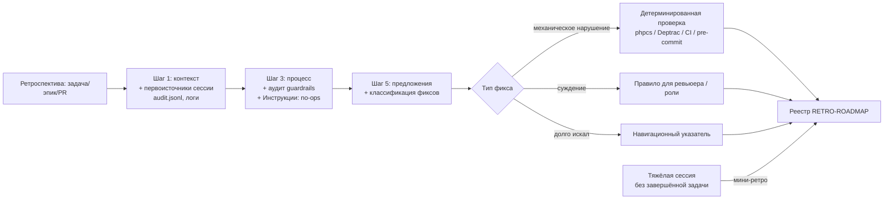

# EPIC-docs-retro-skill-improvements: Улучшение цикла самоулучшения: ретроспектива по итогам сравнения с /retro (Matt Pocock Skills)

## 0. Простое описание (Human Brief)

### Проблема простыми словами (Problem)
Ретроспектива после задач и эпиков находит проблемы, но почти все предложения превращаются в прозаические правила в инструкциях (`AGENTS.md`, файлы ролей). Выполнение таких правил зависит от послушания модели, а не от машинной проверки — и одна и та же проблема может повториться, потому что «агент забыл». Сравнение с навыком `/retro` из Matt Pocock Skills ([исследование](../docs/research/framework-comparisons/mattpocock-retro-skill-comparison.md)) показало: значительную часть находок можно превращать в детерминированные проверки (guardrails), которые падают, а не «надеются». Кроме того, у нас нет лёгкого пути зафиксировать выводы «тяжёлой сессии», когда агент буксовал, но задача ещё не завершена.

### Варианты или путь решения (Solution Sketch)
Переработать аналитические шаги навыка `retrospective`: классификация находок по типу фикса («проверка вместо прозы»), аудит подключённости существующих проверок, направление «Инструкции» (пустые инструкции, разросшийся стиринг), первоисточники сессии (`audit.jsonl`, логи). Добавить лёгкий сессионный режим мини-ретро. Закрепить дисциплину пилотом: перевести одно существующее прозаическое правило (запрет стековых PR) в падающую CI-проверку.

### Ожидаемый результат (Expected Result)
Следующие ретроспективы предлагают исправления с классификацией «проверка / проза» и проверяют, что существующие проверки подключены и работают (Must). При выполнении Should-задач: минимум одно прежнее прозаическое правило (запрет стековых PR) подкреплено автоматической проверкой, а после тяжёлой сессии можно быстро зафиксировать выводы без полного шаблона ретроспективы.

## 1. Концепция и цель (Concept and Goal)

### История (User Story или Job Story)

> **Job Story:** Когда агент заметно буксовал в сессии или ретроспектива вновь находит механическую ошибку, я хочу, чтобы вывод превращался в детерминированную проверку или точный указатель, а не в очередной абзац правил, чтобы та же проблема не повторялась из-за «забывчивости» модели.

### Цель по SMART (Goal)
До 2026-10-31 переработать навык `retrospective` по итогам [исследования](../docs/research/framework-comparisons/mattpocock-retro-skill-comparison.md) и внедрить пилотную проверку: (1) в Шаге 5 — классификация предложений «симптом → тип фикса» с правилом «механическое нарушение → детерминированная проверка, проза — только для суждений»; (2) в Шаге 3 — аудит подключённости существующих guardrails; (3) в Шаге 3 — направление «Инструкции» (no-ops, разросшийся стиринг); (4) в Шаге 1 — первоисточники сессии (`audit.jsonl`, логи) с трассировкой находок к конкретным моментам; (5) при выполнении Should-задач — сессионный режим мини-ретро и пилотная CI-проверка запрета стековых PR. Проверка: обновлённый навык применён в реальной ретроспективе; при выполнении задачи пилота — автоматический тест отклоняет стековый сценарий (создание реального стекового PR запрещено правилом) и не мешает обычным веткам и hotfix-веткам.

## 2. Контекст и границы (Context and Scope)
*   **In Scope (Что делаем):**
    *   `docs/agents/skills/retrospective/SKILL.md` — Шаги 1, 3, 5 и раздел «Когда использовать»
    *   `docs/agents/skills/retrospective/assets/retrospective-template.md` — шаблон под классификацию фиксов
    *   Исполняемый код CI-детектора стековых PR и его автоматические тесты (`bin/` / `scripts/`, `tests/`)
    *   Конфигурация подключения тестов детектора к локальным проверкам и CI (`Makefile`, `composer.json`, `.github/workflows/`)
    *   Сопутствующие документы, упоминающие процесс ретроспектив (поиском по ключевым словам)
*   **Out of Scope (Чего НЕ делаем):**
    *   Перепроектирование реестра `RETRO-ROADMAP.md`: пороги эскалации, статусы и порядок записей не меняются
    *   Автоматическое применение предложений ретроспективы без согласования — human-in-the-loop сохраняется
    *   Массовый перевод правил из `AGENTS.md` в проверки — только один пилот на правиле запрета стековых PR
    *   Изменения PHP-кода библиотеки, кроме кода CI-проверки
    *   Заимствования «в обратную сторону» (для репозитория Matt Pocock Skills)

## 3. Требования, MoSCoW (Requirements)

### 🔴 Блокирующие требования (Must Have)
- [ ] В навыке `retrospective` (Шаг 5) появилась классификация предложений «симптом → тип фикса»: навигационный указатель / автоматическая проверка / правило для ревьюера / правка стиринга — с правилом «механическое нарушение → детерминированная проверка; проза — только для суждений»
- [ ] В анализе процесса (Шаг 3) появился аудит подключённости существующих проверок: существующая, но не подключённая или молча сломанная проверка — сама находка
- [ ] В анализе процесса (Шаг 3) появилось направление «Инструкции»: пустые инструкции (no-ops) и разросшийся стиринг
- [ ] В сборе контекста (Шаг 1) появились первоисточники сессии: `audit.jsonl` и логи сессии; находки трассируются к конкретным моментам
- [ ] Задачи изменения навыка проходят цикл проектирования процессов PM1–PM5 ([RACI, раздел 6](../docs/agents/raci-matrix.md#6-специализированный-цикл-проектирование-процессов-взаимодействия-команды)) до этапа `DC`

### 🟡 Важные требования (Should Have)
- [ ] Сессионный режим мини-ретро: лёгкий вход после тяжёлой сессии без завершённой задачи, с записью в реестр
- [ ] Пилотная CI-проверка запрета стековых PR: отклоняет стековый сценарий в автоматическом тесте, допускает hotfix-ветки от production tag (информирующий режим до подтверждения алгоритма; блокирующий — решение владельца)
- [ ] В направлении «Инструменты» (Шаг 3) — анализ дорогих вызовов инструментов и доступа к информации

### 🟢 Желательно (Could Have)
- [ ] Mermaid-диаграмма обновлённой модели ретроспективы в `SKILL.md` или исследовании

### ⚫ Не в этот раз (Won't Have)
- [ ] Перенос правил из `AGENTS.md` в проверки сверх одного пилота
- [ ] Изменение порогов эскалации и формата реестра `RETRO-ROADMAP.md`
- [ ] Автоматическое внедрение предложений ретроспективы без согласования

## 4. Техническое решение (Solution Design)
Изменения сосредоточены в двух местах: (1) документы навыка `retrospective` — `SKILL.md` и шаблон; (2) CI-детектор стековых PR — отдельный workflow, вспомогательный скрипт и автоматические тесты с явным подключением к проверкам. PHP-код библиотеки (`src/`) не затрагивается.

Модель изменений навыка проектируется через цикл PM1–PM5: тимлид — автор модели, аналитик — проверка, технический писатель — оформление ([RACI, раздел 6](../docs/agents/raci-matrix.md#6-специализированный-цикл-проектирование-процессов-взаимодействия-команды)). Принципы заимствуются без копирования структуры Matt Pocock Skills (без `CODING_STANDARDS.md` и команды `/retro`): borrow principles, not implementation.

## 5. План реализации (Implementation Plan)

- [ ] [TASK-docs-retro-skill-redesign](TASK-docs-retro-skill-redesign.todo.md) — переработка аналитических шагов навыка `retrospective`: классификация фиксов (Шаг 5), аудит guardrails (Шаг 3), направление «Инструкции» (Шаг 3), первоисточники сессии (Шаг 1). Цикл PM1–PM5.
- [ ] [TASK-docs-retro-session-mode](TASK-docs-retro-session-mode.todo.md) — сессионный режим мини-ретро: лёгкий вход после тяжёлой сессии без завершённой задачи. Цикл PM1–PM5. Зависит от переработки навыка.
- [ ] [TASK-ci-stacked-pr-detector](TASK-ci-stacked-pr-detector.todo.md) — пилот «проверка вместо прозы»: CI-проверка запрета стековых PR (с допуском hotfix-веток). Независима от задач документации, может выполняться параллельно.

## 6. Критерии приёмки эпика (Definition of Done)
- [ ] Все требования Must Have выполнены и подтверждены критериями соответствующих задач
- [ ] Обновлённый навык проверен двояко: минимум одна реальная ретроспектива по обновлённому навыку (классификация фиксов применена) и разбор подготовленных сценариев для остальных новых правил (аудит guardrails, no-ops, контракт доказательств, трассировка)
- [ ] Задачи Should Have ([TASK-docs-retro-session-mode](TASK-docs-retro-session-mode.todo.md), [TASK-ci-stacked-pr-detector](TASK-ci-stacked-pr-detector.todo.md)) выполнены либо их перенос/отказ явно зафиксирован решением владельца в этом эпике
- [ ] Если CI-пилот выполнялся — решение владельца о режиме пилота (информирующий/блокирующий) зафиксировано в задаче
- [ ] Сопутствующие документы (`AGENTS.md`, `SKILL.md` скиллов, `docs/guide/*`) проверены поиском на устаревшие упоминания процесса ретроспектив
- [ ] Отсутствуют блокирующие замечания

## 7. Инструкция по релизу (Release Notes and Deployment)
- [ ] Не требуется: изменения — документы навыка и CI-workflow. Если CI-проверка меняет поведение contributors-пайплайна — заметка в `CHANGELOG.md` (решает исполнитель задачи пилота).

## 8. Риски и зависимости (Risks and Dependencies)
- **Обязательный цикл PM1–PM5** для задач изменения навыка: консультации аналитика, архитектора и тестировщика на этапах модели — заранее закладывать время
- **Ложные срабатывания CI-проверки стековых PR**: PR, не перебазированный после чужого мержа (штатная ситуация до merge), и hotfix-ветки от production tag — место и логика проверки определяются в задаче пилота
- **Разрастание навыка**: новые категории не должны превратить `SKILL.md` в разросшийся стиринг — то самое, с чем боремся; лимит — за счёт выноса таблиц в `assets/`
- **Подмена human-in-the-loop**: классификация фиксов не означает автоматического внедрения проверок — создание остаётся по регламенту с согласованием
- **Обязательность CI-статуса**: required status check настраивается в защите ветки GitHub отдельно от workflow — файл workflow сам не блокирует merge; решение и настройка — владелец
- **Подключение тестов детектора**: текущий CI не вызывает `make check` целиком — тесты подключаются явно и локально, и в CI
- **Приёмка сессионного режима** зависит от наличия реальной тяжёлой сессии — ошибки не создаются искусственно; при отсутствии сессии — перенос с согласованием владельца

## 9. Источники (Sources)
- [Исследование: навык `/retro` (Matt Pocock Skills) — сравнение с `retrospective`](../docs/research/framework-comparisons/mattpocock-retro-skill-comparison.md) — основание эпика
- [`skills/engineering/retro/SKILL.md` (Matt Pocock Skills)](https://github.com/mattpocock/skills/blob/main/skills/engineering/retro/SKILL.md) — первоисточник
- [`docs/engineering/retro.md` (Matt Pocock Skills)](https://github.com/mattpocock/skills/blob/main/docs/engineering/retro.md) — документация с самокритикой слабых мест
- [Ретроспектива инцидента стековых PR](../docs/agents/team-retro/2026-09-24_10-39-stacked-prs-incident.md) — прецедент прозаического правила для пилота
- [Матрица RACI, раздел 6](../docs/agents/raci-matrix.md#6-специализированный-цикл-проектирование-процессов-взаимодействия-команды) — цикл PM1–PM5 для задач изменения навыка

## 10. Комментарии (Comments)
- RACI-исключение: research-отчёт (источник эпика) оформлен Тимлидом по прямому поручению владельца в интерактивной сессии 2026-09-29 (тип `research` закреплён за Аналитиком); зафиксировано в заголовке исследования
- Участники задач определяются по виду работ каждой задачи: задачи изменения навыка — цикл PM1–PM5 (автор модели — тимлид, проверка — аналитик, оформление — техпис); задача CI-пилота — RACI-исключение, зафиксированное в самой задаче: для типа `ci` применяется распределение строки `build` раздела 5.6 матрицы
- Консультации при декомпозиции: аналитик (два раунда — противоречия исправлены) и архитектор ([отчёт](../docs/agents/reports/system-architect-gandalf/2026-09-29_21-07_retro-epic-decomposition-consultation.md)) — замечания учтены в задачах

## История изменений (Change History)
| Дата | Автор (роль) | Изменение |
| :--- | :--- | :--- |
| 2026-09-29 13:59:05 (1790690345) | Тимлид Алекс (pi) | Создание эпика |
| 2026-09-29 14:00:28 (1790690428) | Тимлид Алекс (pi) | Заполнение по шаблону: цель, границы, MoSCoW, план из трёх задач |
| 2026-09-29 14:20:00 (1790691600) | Тимлид Алекс (pi) | Замечание консультации аналитика: демонстрация CI-пилота на реальном стековом PR заменена автоматическим тестом |
| 2026-09-29 14:45:00 (1790693100) | Тимлид Алекс (pi) | Замечания консультаций аналитика и архитектора: RACI-исключение для типа ci, разделение Must/Should по CI-пилоту, новые риски (обязательность статуса, подключение тестов, приёмка сессионного режима) |
| 2026-09-29 15:10:00 (1790694600) | Тимлид Алекс (pi) | Финал консультации аналитика (раунд 3): область расширена кодом и тестами детектора, SMART/Expected Result синхронизированы с Must/Should, симметричное правило переноса для Should-задач, приёмочная проверка всех новых правил |
