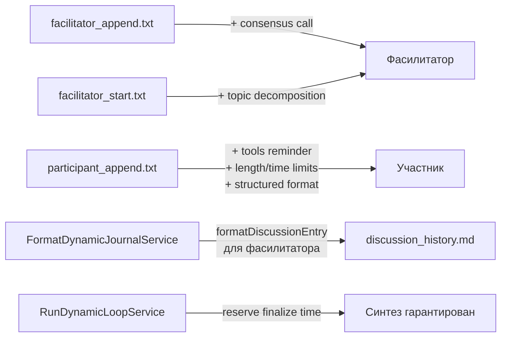

---
# Metadata (Метаданные)
type: epic
created: 2026-04-27
value: V3
complexity: C2
priority: P1
author: Тимлид (Алекс) (pi)
assignee: Тимлид (Алекс) (pi)
status: done
branch: feat/brainstorm-improvements
pr: https://github.com/prikotov/task-orchestrator/pull/82
---

# EPIC-feat-brainstorm-improvements: Улучшение процесса brainstorm-сессий

## 1. Concept and Goal (Концепция и цель)
### Story (Job Story)
> Когда я провожу brainstorm-сессию через `app:agent:orchestrate --chain=brainstorm`, я хочу получать человекочитаемый протокол обсуждения с финальным синтезом за один прогон, чтобы не тратить время на ручное чтение discussion_history и восстановление потерянных результатов.

### Goal (Цель по SMART)
Устранить 6 проблем, выявленных при ретроспективе первого brainstorm (2026-04-27): (1) таймаут убивает синтез, (2) discussion_history содержит JSON вместо человекочитаемого протокола, (3) участники не используют tools для проверки фактов в коде, (4) ответы участников раздуты до 12-18K символов, (5) фасилитатор не умеет фиксировать консенсус, (6) роли не имеют явных зон ответственности для фасилитатора. Ожидаемый результат: при следующем запуске brainstorm синтез гарантированно формируется, discussion_history читается человеком без JSON, участники лаконичны и проверяют факты в коде.

## 2. Context and Scope (Контекст и границы)
*   **In Scope (Что делаем):**
    *   Правки промптов brainstorm (6 файлов в `config/prompts/brainstorm/`)
    *   Правка `FormatDynamicJournalService::formatDiscussionEntry()` — человекочитаемый формат для фасилитатора
    *   Резервирование времени на finalize в `RunDynamicLoopService`
    *   Добавление зон ответственности в front matter файлов ролей
*   **Out of Scope (Чего НЕ делаем):**
    *   Изменение архитектуры dynamic-цикла (новые интерфейсы, новые сервисы)
    *   Суммаризация контекста (не актуально — контекст уже передаётся через списки файлов)
    *   Изменение SKILL.md (документация для пользователя — отдельная задача)
    *   Баланс участия через квоты (фасилитатор сам решает на основе зон ответственности)

## 3. Requirements (Требования, MoSCoW)

### 🔴 Must Have (Блокирующие требования)
- [ ] Фасилитатор пишет в discussion_history человекочитаемый текст, а не JSON
- [ ] Финальный синтез (finalize) гарантированно вызывается до истечения max_time
- [ ] Участники имеют лимит длины ответа (≤ 3000 символов) и времени (5-7 минут)
- [ ] Участники знают о tools и могут проверять факты в коде
- [ ] Фасилитатор имеет правило consensus call — фиксировать консенсус и двигаться дальше

### 🟡 Should Have (Важные требования)
- [ ] Фасилитатор декомпозирует тему на подвопросы в начале сессии
- [ ] Зоны ответственности ролей прописаны в front matter файлов ролей
- [ ] Ответ участника имеет структурированный формат (Позиция → Аргумент → Контраргумент → Что принимаешь)

### 🟢 Could Have (Желательно)
- [ ] SKILL.md обновлён с рекомендациями по memory_limit

### ⚫ Won't Have (Не в этот раз)
- [ ] Суммаризация контекста (не требуется — архитектура уже использует списки файлов)
- [ ] Квоты участия (фасилитатор решает на основе зон ответственности)
- [ ] Метрики сходимости (отложено до следующей ретроспективы)
- [ ] Явное голосование (отложено до следующей ретроспективы)

## 4. Solution Design (Техническое решение)
Изменения затрагивают два слоя:

1. **Промпты** (`config/prompts/brainstorm/`): точечные правки в 4 из 7 файлов. Без изменения структуры шаблонов — только дополнение инструкций.
2. **Код**: `FormatDynamicJournalService::formatDiscussionEntry()` — разная логика форматирования для фасилитатора (человекочитаемый текст) и участника (как сейчас). `RunDynamicLoopService` — резервирование времени на finalize.

## 5. Implementation Plan (План реализации)

- [x] [TASK-feat-brainstorm-human-readable-protocol](done/TASK-feat-brainstorm-human-readable-protocol.todo.md) — Человекочитаемый формат discussion_history для фасилитатора (код) → **Бэкендер Левша** ✅
- [x] [TASK-feat-brainstorm-finalize-time-guarantee](done/TASK-feat-brainstorm-finalize-time-guarantee.todo.md) — Гарантия вызова finalize до истечения max_time (код) → **Бэкендер Левша** ✅
- [x] [TASK-feat-brainstorm-participant-prompts](done/TASK-feat-brainstorm-participant-prompts.todo.md) — Лимиты + tools + структура ответа (промпты) → **Бэкендер Тони** ✅
- [x] [TASK-feat-brainstorm-facilitator-prompts](done/TASK-feat-brainstorm-facilitator-prompts.todo.md) — Consensus call + декомпозиция темы (промпты) → **Бэкендер Тони** ✅
- [x] [TASK-feat-brainstorm-role-expertise](done/TASK-feat-brainstorm-role-expertise.todo.md) — Зоны ответственности в front matter ролей (docs) → **Тех. писатель Гермиона**

## 6. Definition of Done (Критерии приёмки эпика)
- [ ] Все задачи Must Have выполнены
- [ ] PHPUnit проходит
- [ ] Psalm проходит
- [ ] Внесённые изменения не ломают существующие цепочки (implement и другие)

## 7. Release Notes and Deployment (Инструкция по релизу)
- [ ] Изменения промптов и кода — backward compatible, никаких миграций
- [ ] Рекомендуется обновить memory_limit до 2G при запуске brainstorm (описать в SKILL.md)

## 8. Risks and Dependencies (Риски и зависимости)
- Изменение `formatDiscussionEntry()` может сломать парсинг ответа фасилитатора — нужно убедиться, что JSON-парсинг (`FacilitatorResponse`) работает с системным промптом, а не с discussion_history
- Увеличение длины промптов участника/фасилитатора увеличит input_tokens — но экономия за счёт сокращения output_tokens (лимит 3000 символов) должна компенсировать
- Зоны ответственности в front matter ролей — если формат front matter не поддерживает произвольные поля, может потребоваться согласование

## 9. Sources (Источники)
- [ ] [Ретроспектива brainstorm](../var/sessions/brainstorm/2026-04-27_06-46-57/discussion_history.md)
- [ ] [Промпты brainstorm](../config/prompts/brainstorm/)
- [ ] [FormatDynamicJournalService](../src/Module/Orchestrator/Domain/Service/Chain/Dynamic/FormatDynamicJournalService.php)
- [ ] [RunDynamicLoopService](../src/Module/Orchestrator/Domain/Service/Chain/Dynamic/RunDynamicLoopService.php)
- [ ] [SKILL.md brainstorm](../docs/agents/skills/brainstorm/SKILL.md)
- [ ] [Файлы ролей](../docs/agents/roles/team/)

## 10. Comments (Комментарии)
Ретроспектива проведена по результатам первого brainstorm в проекте (2026-04-27, 13 раундов, 64 минуты). Основные проблемы: таймаут убил синтез (result.md = Interrupted), discussion_history содержит JSON-ответы фасилитатора, участники пишут по 12-18K символов и не проверяют факты в коде.

## Change History (История изменений)
| Дата | Автор (роль) | Изменение |
| :--- | :--- | :--- |
| 2026-04-27 | Тимлид (Алекс) (pi) | Создание эпика |
