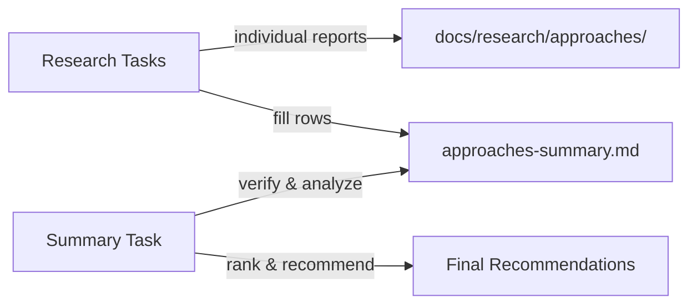

---
# Metadata (Метаданные)
type: epic
created: 2026-07-27
value: V3
complexity: C4
priority: P2
author: Тимлид (Алекс)
assignee: Аналитик (Шерлок)
status: in_progress
branch: task/research-why-software-factories-fail
---

# EPIC-research-approaches-comparison: Сравнительное исследование подходов и процессов разработки с AI-агентами (SDLC/PDLC)

## 1. Concept and Goal (Концепция и цель)
### Story (Job Story)
> **Job Story:** Когда мы проектируем и улучшаем наш процесс оркестрации AI-агентов и role-based workflow (роли команды, скиллы, конвенции, AGENTS.md), я хочу систематически исследовать внешние подходы и процессы разработки с AI (SDLC/PDLC: front-loaded alignment, spec-driven development, dark vs lit factory, context engineering, quality/reward-механизмы), чтобы определить, какие паттерны принять или адаптировать — и валидировать/уточнить собственный процесс task-orchestrator.

### Goal (Цель по SMART)
Исследовать серию подходов/процессов разработки с AI-агентами по единой методологии из 8 критериев. По каждому подходу — comparison-отчёт в `docs/research/approaches/` с маппингом на наш процесс (роли, скиллы, конвенции, AGENTS.md) и вердиктом: adopt (принять) / adapt (адаптировать) / reject (отклонить). Сводная таблица с классификацией и рекомендациями в `docs/research/approaches-summary.md`.

## 2. Context and Scope (Контекст и границы)
*   **In Scope (Что делаем):**
    *   Исследование каждого подхода/процесса по единой методологии (8 критериев)
    *   Индивидуальные comparison-отчёты в `docs/research/approaches/`
    *   Сводная таблица с классификацией и рекомендациями в `docs/research/approaches-summary.md`
    *   Чёткий вердикт по каждому подходу: adopt / adapt / reject — с обоснованием и оценкой усилий
*   **Out of Scope (Чего НЕ делаем):**
    *   Написание кода интеграции или изменение процесса — только исследование и рекомендации
    *   Бенчмарки производительности
    *   Глубокий code review исходников сторонних инструментов — анализ на уровне докладов, статей, документации

## 3. Requirements (Требования, MoSCoW)

### 🔴 Must Have (Блокирующие требования)
- [ ] Каждый подход исследован по единой методологии из 8 критериев
- [ ] По каждому подходу создан отчёт в `docs/research/approaches/<approach-slug>-comparison.md`
- [ ] Сводная таблица в `docs/research/approaches-summary.md`
- [ ] Чёткий вердикт по каждому: adopt / adapt / reject — с обоснованием
- [ ] Явный маппинг каждого подхода на роли/скиллы/конвенции/AGENTS.md task-orchestrator

### 🟡 Should Have (Важные требования)
- [ ] Выявление пробелов (gap'ов) в нашем процессе, которые подход подсвечивает
- [ ] Оценка усилий внедрения (effort) для каждого adopt/adapt-решения
- [ ] Сравнительная таблица с группировкой по категориям (процессная модель, уровень автономии, механизм качества)

### 🟢 Could Have (Желательно)
- [ ] Визуализация (Mermaid-диаграммы) ключевых различий и маппинга на наш процесс

### ⚫ Won't Have (Не в этот раз)
- [ ] Код интеграции любого из подходов
- [ ] Изменение AGENTS.md/конвенций/ролей по результатам — отдельными задачами вне эпика

## 4. Solution Design (Техническое решение)

Исследование проводится в два этапа:

**Этап 1 — Индивидуальные research-задачи (параллельные):** каждая задача изучает один подход/процесс, пишет отдельный comparison-документ и заполняет свою строку в сводной таблице `docs/research/approaches-summary.md`. Задачи независимы, могут выполняться параллельно разными сабагентами.

**Этап 2 — Финальная задача:** после завершения серии исследований финальная задача проверяет полноту таблицы, выявляет тренды, ранжирует подходы и составляет итоговые рекомендации.

Все отчёты размещаются в `docs/research/approaches/`.

**Единая методология — 8 критериев оценки подхода:**

1. **Тезис / проблема** — какую проблему разработки с AI решает подход
2. **Модель процесса (SDLC/PDLC)** — стадии, цикл, gate'ы (контрольные точки), порядок
3. **Уровень автономии (dark vs lit factory)** — где человек, где агент; модель review и approval
4. **Механизм качества / поддерживаемости** — как обеспечивается качество кода (review, gates, reward-сигналы, поддерживаемость)
5. **Context engineering** — управление контекстом (compaction, subagents, спецификации как source of truth)
6. **Артефакты процесса** — что становится «исходником» (specs/plans/research), идемпотентность, воспроизводимость
7. **Маппинг на наш процесс** — соответствие ролям/скиллам/конвенциям/AGENTS.md task-orchestrator
8. **Применяемость (вердикт)** — adopt / adapt / reject + оценка усилий + выявленные gap'ы

## 5. Implementation Plan (План реализации)

### Этап 1: Индивидуальные исследования (параллельные)

- [x] [TASK-research-why-software-factories-fail](done/TASK-research-why-software-factories-fail.todo.md) — Dex Horthy «Why Software Factories Fail» (Harness Engineering is not Enough), AI Engineer World's Fair. Подход: front-loaded alignment (4 шага), dark vs lit factory, провал maintainability-награды.
- [x] [TASK-research-agents-crew](done/TASK-research-agents-crew.todo.md) — Rai220/agents_crew: «сотрудник — это каталог, а не промпт». Подход: роль-каталог с регламентом, память по специальности (`lessons.md`, `projects/`), мета-харнес, консультации соседей. Проверка гипотезы про отсутствие персистентной памяти у наших ролей.

### Этап 2: Сводный анализ (после завершения серии исследований)

- [ ] TASK-research-approaches-summary — Сводная таблица и итоговые рекомендации (создаётся по мере накопления подходов)

## 6. Definition of Done (Критерии приёмки эпика)
- [ ] Все индивидуальные research-задачи выполнены
- [ ] Каждый comparison-документ создан в `docs/research/approaches/`
- [ ] Сводная таблица `docs/research/approaches-summary.md` создана и заполнена
- [ ] По каждому подходу есть вердикт: adopt / adapt / reject
- [ ] Финальная задача с ранжированием и рекомендациями выполнена

## 7. Release Notes and Deployment (Инструкция по релизу)
Не требуется — эпик содержит только исследовательские задачи (docs).

## 8. Risks and Dependencies (Риски и зависимости)
- Подходы описаны в статьях/докладах/твитах — первоисточники могут быть недоступны напрямую (X/Twitter блокирует боты); использовать добросовестные вторичные источники и сверять с каноническими блогами авторов
- Подходы активно эволюционируют — информация может устаревать
- Маппинг на наш процесс требует актуального знания ролей/скиллов/конвенций — опираться на AGENTS.md и `docs/conventions/`
- Риск «натягивания» чужого подхода на наш процесс — вердикт adopt/adapt/reject давать строго с обоснованием и оценкой усилий

## 9. Sources (Источники)
- Прецеденты: `todo/done/EPIC-research-coding-agents-comparison.md`, `todo/done/EPIC-research-agent-frameworks-comparison.md`
- Существующие comparison-документы: `docs/research/`
- Ссылки на первоисточники — в индивидуальных задачах

## 10. Comments (Комментарии)
Эпик открывает третий ресерч-профиль — «подходы/процессы» (SDLC/PDLC), дополняющий два завершённых трека: CLI-агенты кодинга (`EPIC-research-coding-agents-comparison`) и фреймворки оркестрации (`EPIC-research-agent-frameworks-comparison`). В отличие от двух предыдущих треков, оценивающих инструменты (CLI surface, JSON-режим, лицензия, провайдеры), этот трек оценивает процессные ИДЕИ: стадии процесса, модель review, механизм качества, context engineering — и применимость к нашему role-based workflow. Задачи Этапа 1 можно выполнять в любом порядке и параллельно.

## Change History (История изменений)
| Дата | Автор (роль) | Изменение |
| :--- | :--- | :--- |
| 2026-07-27 | Тимлид (Алекс) | Создание эпика. Третий ресерч-трек: подходы/процессы разработки с AI. Первая задача — TASK-research-why-software-factories-fail. |
| 2026-07-27 | Тимлид (Алекс) | Stage 1: TASK-research-why-software-factories-fail выполнена — вердикт **adapt** (23/24). Гипотеза про `program design` подтверждена: шаг не формализован в шаблоне `task.md`. Файл задачи перенесён в `todo/done/`. Эпик остаётся в работе (Этап 2 — сводный анализ — после накопления подходов). |
| 2026-08-16 | Тимлид (Алекс) | Добавлена задача TASK-research-agents-crew (Rai220/agents_crew, предложен пользователем): роль-каталог + память по специальности + мета-харнес. |
| 2026-08-16 | Тимлид (Алекс) | Stage 1: TASK-research-agents-crew выполнена (PR #350) — вердикт **adapt** (22/24). Гипотеза про персистентную память ролей подтверждена. Файл задачи перенесён в `todo/done/`. Эпик остаётся в работе (Этап 2 — сводный анализ — после накопления подходов). |
