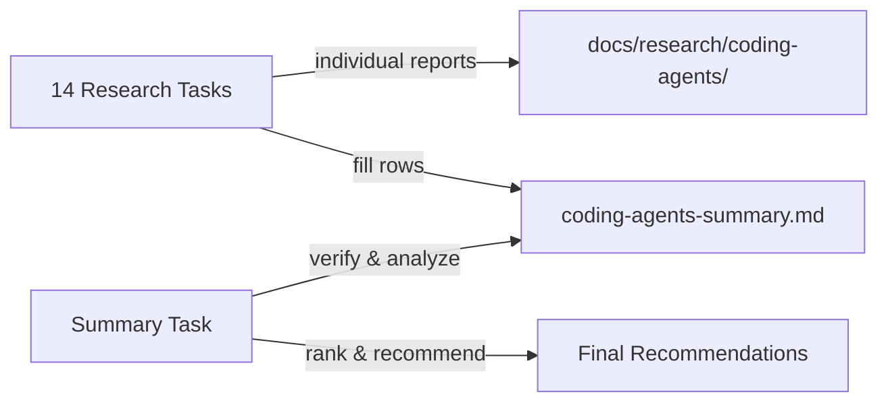

---
# Metadata (Метаданные)
type: epic
created: 2026-05-09
value: V3
complexity: C4
priority: P2
author: Тимлид (Алекс)
assignee: Аналитик (Шерлок)
status: todo
pr: "#171"
branch: epic/research-coding-agents-comparison
---

# EPIC-research-coding-agents-comparison: Сравнительное исследование CLI-агентов кодинга

## 1. Concept and Goal (Концепция и цель)
### Story (Job Story)
> **Job Story:** Когда мы подключаем AI-агенты как сабагентов к ролям команды (docs/agents/roles/team/), я хочу провести систематическое исследование CLI-агентов кодинга, чтобы определить, какие из них подходят для работы с нашей системой ролей, скиллов и системных промптов — и выбрать лучших кандидатов для интеграции.

### Goal (Цель по SMART)
Исследовать 14 CLI-агентов кодинга по единой методологии из 10 критериев (системный промпт, роль, скиллы, AGENTS.md, запуск как сабагент, токены, free tier, провайдеры, лицензия). По каждому — вердикт: подходит / частично подходит / не подходит. Сводная таблица в `docs/research/coding-agents-summary.md`. Срок: до конца Q2 2026.

## 2. Context and Scope (Контекст и границы)
*   **In Scope (Что делаем):**
    *   Исследование каждого CLI-агента по единой методологии (10 критериев)
    *   Индивидуальные comparison-отчёты в `docs/research/coding-agents/`
    *   Сводная таблица с классификацией и рекомендациями в `docs/research/coding-agents-summary.md`
    *   Чёткий вердикт по каждому агенту
*   **Out of Scope (Чего НЕ делаем):**
    *   Написание кода интеграции — только исследование
    *   Глубокий code review исходников — анализ на уровне документации и CLI-интерфейса
    *   Бенчмарки производительности

## 3. Requirements (Требования, MoSCoW)

### 🔴 Must Have (Блокирующие требования)
- [ ] Каждый агент исследован по единой методологии из 10 критериев
- [ ] По каждому агенту создан отчёт в `docs/research/coding-agents/<agent-slug>-comparison.md`
- [ ] Сводная таблица в `docs/research/coding-agents-summary.md` со всеми 14 агентами
- [ ] Чёткий вердикт по каждому: подходит / частично подходит / не подходит — с обоснованием
- [ ] Итоговые рекомендации по приоритетам интеграции

### 🟡 Should Have (Важные требования)
- [ ] Сравнительная таблица с группировкой по категориям (open source, проприетарный)
- [ ] Ранжирование агентов по степени пригодности для сабагент-интеграции
- [ ] Выявление общих паттернов CLI-интерфейсов агентов

### 🟢 Could Have (Желательно)
- [ ] Визуализация (Mermaid-диаграммы) ключевых различий
- [ ] Практические примеры запуска каждого агента в JSON-режиме

### ⚫ Won't Have (Не в этот раз)
- [ ] Код интеграции любого из агентов
- [ ] Performance-бенчмарки
- [ ] Глубокий анализ исходного кода агентов

## 4. Solution Design (Техническое решение)

Исследование проводится в два этапа:

**Этап 1 — Индивидуальные research-задачи (14 задач, параллельные):** каждая задача изучает один CLI-агент, пишет отдельный comparison-документ и заполняет свою строку в сводной таблице `docs/research/coding-agents-summary.md`. Задачи независимы, могут выполняться параллельно разными сабагентами.

**Этап 2 — Финальная задача:** после завершения всех 14 исследований финальная задача проверяет полноту таблицы, выявляет тренды, ранжирует агенты и составляет итоговые рекомендации.

Все отчёты размещаются в `docs/research/coding-agents/`.

**Единая методология — 10 критериев оценки:**

1. **Системный промпт** — замена, дополнение, передача файла роли
2. **Промпт агента / роль** — инъекция контекста роли через CLI/env/файл
3. **Скиллы (skills)** — встроенная поддержка, подключение файлов/каталогов
4. **AGENTS.md** — автообнаружение, отключение, альтернативные форматы
5. **Стандартная папка .agents/skills/** — автосканирование, явное подключение
6. **Запуск как сабагент** — JSON-режим, programmatic API, контроль таймаутов
7. **Токены и стоимость** — отслеживание потребления, расчёт стоимости
8. **Free tier** — наличие бесплатного тарифа, лимиты
9. **Провайдеры и модели** — список провайдеров, BYOK, локальные модели
10. **Лицензия** — open source / проприетарный, тип лицензии

## 5. Implementation Plan (План реализации)

### Этап 1: Индивидуальные исследования (параллельные)

- [x] [TASK-research-pi-coding-agent](done/TASK-research-pi-coding-agent.todo.md) — Pi Coding Agent (Node.js/TypeScript, @earendil-works/pi-coding-agent)
- [x] [TASK-research-codex-cli](done/TASK-research-codex-cli.todo.md) — Codex CLI (OpenAI, Rust) ✅ Частично подходит (6/10)
- [x] [TASK-research-opencode-cli](done/TASK-research-opencode-cli.todo.md) — OpenCode (Go)
- [x] [TASK-research-kilocode-cli](done/TASK-research-kilocode-cli.todo.md) — Kilo Code CLI (TypeScript)
- [x] [TASK-research-gemini-cli](done/TASK-research-gemini-cli.todo.md) — Gemini CLI (Google, TypeScript)
- [x] [TASK-research-claude-code-agent](done/TASK-research-claude-code-agent.todo.md) — Claude Code (Anthropic, проприетарный)
- [x] [TASK-research-qwen-cli](done/TASK-research-qwen-cli.todo.md) — Qwen CLI (Alibaba/Qwen, Python)
- [ ] [TASK-research-goose-agent](TASK-research-goose-agent.todo.md) — Goose (Block/Square, Go)
- [ ] [TASK-research-droid-agent](TASK-research-droid-agent.todo.md) — Droid
- [ ] [TASK-research-warp-agent](TASK-research-warp-agent.todo.md) — Warp (Warp AI, Rust-терминал)
- [ ] [TASK-research-crush-agent](TASK-research-crush-agent.todo.md) — Crush (Charmbracelet, Go)
- [ ] [TASK-research-openclaw-agent](TASK-research-openclaw-agent.todo.md) — OpenClaw (Python)
- [ ] [TASK-research-copilot-cli](TASK-research-copilot-cli.todo.md) — GitHub Copilot CLI (проприетарный)
- [ ] [TASK-research-hermes-agent](TASK-research-hermes-agent.todo.md) — Hermes (Nous Research)

### Этап 2: Сводный анализ (после завершения Этапа 1)

- [ ] [TASK-research-coding-agents-summary](TASK-research-coding-agents-summary.todo.md) — Сводная таблица и итоговые рекомендации

## 6. Definition of Done (Критерии приёмки эпика)
- [ ] Все 14 индивидуальных research-задач выполнены
- [ ] Каждый comparison-документ создан в `docs/research/coding-agents/`
- [ ] Сводная таблица `docs/research/coding-agents-summary.md` создана и заполнена
- [ ] По каждому агенту есть вердикт: подходит / частично подходит / не подходит
- [ ] Финальная задача с ранжированием и рекомендациями выполнена

## 7. Release Notes and Deployment (Инструкция по релизу)
Не требуется — эпик содержит только исследовательские задачи (docs).

## 8. Risks and Dependencies (Риски и зависимости)
- 14 агентов — значительный объём исследования
- Многие агенты активно развиваются — информация может устареть
- Проприетарные продукты (Claude Code, Copilot CLI, Gemini CLI) — анализ только по документации
- Названия некоторых агентов могут быть неоднозначны — нужно уточнять, какой именно проект имеется в виду
- Разные языки/экосистемы (TypeScript, Rust, Go, Python) — оценка применимости паттернов

## 9. Sources (Источники)
- Прецедент: `todo/done/EPIC-research-agent-frameworks-comparison.md`
- Существующие comparison-документы: `docs/research/`
- Ссылки на репозитории и документацию — в индивидуальных задачах

## 10. Comments (Комментарии)
Эпик объединяет исследование CLI-агентов кодинга в единый трек с чётким финальным артефактом — сводной таблицей. Задачи Этапа 1 можно выполнять в любом порядке и параллельно. Задача Этапа 2 запускается только после завершения всех 14 исследований. Pi Coding Agent уже подключён как сабагент — его исследование послужит референс-точкой и бенчмарком для остальных.

## Change History (История изменений)
| Дата | Автор (роль) | Изменение |
| :--- | :--- | :--- |
| 2026-05-09 | Тимлид (Алекс) | Создание эпика |
