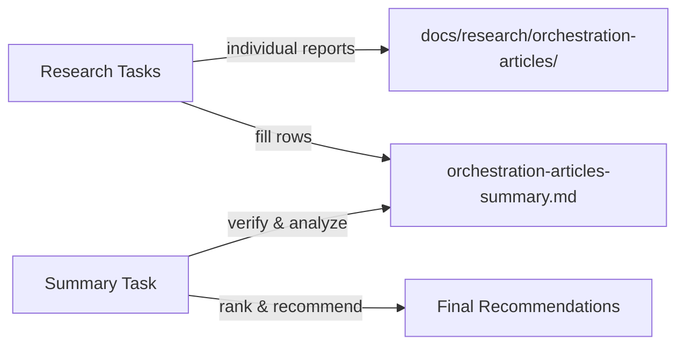

---
# Metadata (Метаданные)
type: epic
created: 2026-07-29
value: V3
complexity: C3
priority: P2
author: Тимлид Алекс (pi)
assignee: Аналитик Шерлок (pi)
status: todo
branch: —
pr:
---

# EPIC-research-orchestration-articles: Исследование статей по оркестрации (Orchestration Patterns, Saga, Choreography vs Orchestration)

## 0. Простое описание (Human Brief)

### Проблема простыми словами (Problem)
Движок оркестрации AI-агентов развивается без систематического обзора классических и современных паттернов оркестрации (orchestrator tax, saga, choreography vs orchestration, compensation, failure handling). Архитектурные решения принимаются вслепую: команда рискует повторно изобретать колёса и упускать проверенные решения, которые уже описаны в литературе по распределённым системам.

### Варианты или путь решения (Solution Sketch)
Серия исследовательских задач по единой методологии из 6 критериев: каждая статья изучается отдельной задачей, по ней пишется research-отчёт с маппингом на компоненты task-orchestrator и вердиктом apply / study / skip. Финальная задача сводит результаты в таблицу с классификацией и рекомендациями.

### Ожидаемый результат (Expected Result)
По каждому известному паттерну оркестрации есть обоснованный вердикт: применять его в task-orchestrator или нет — с маппингом на конкретные модули и оценкой усилий. Сводная таблица с ранжированием паттернов служит основой для планирования доработок движка.

## 1. Concept and Goal (Концепция и цель)
### Story (Job Story)
> **Job Story:** Когда мы проектируем и улучшаем нашу систему оркестрации AI-агентов (chain-based execution, retry, circuit breaker, dynamic loops), я хочу систематически исследовать классические и современные статьи по оркестрации (orchestrator tax, saga pattern, choreography vs orchestration, saga interactions, failure handling, compensation), чтобы определить, какие паттерны и anti-patternы применимы к нашему движку — и избежать повторного изобретения колёс.

### Goal (Цель по SMART)
Исследовать серию статей по оркестрации по единой методологии из 6 критериев. По каждой статье — research-отчёт в `docs/research/orchestration-articles/` с маппингом на нашу архитектуру (chain execution, retry, circuit breaker, dynamic loops) и вердиктом: apply (применить) / study (изучить детально) / skip (пропустить). Сводная таблица с классификацией и рекомендациями в `docs/research/orchestration-articles-summary.md`.

## 2. Context and Scope (Контекст и границы)
* **In Scope (Что делаем):**
  * Исследование каждой статьи по единой методологии (6 критериев)
  * Индивидуальные research-отчёты в `docs/research/orchestration-articles/`
  * Сводная таблица с классификацией и рекомендациями в `docs/research/orchestration-articles-summary.md`
  * Чёткий вердикт по каждой статье: apply / study / skip — с обоснованием
  * Явный маппинг каждого паттерна на компоненты task-orchestrator (AgentRunner, ChainExecution, DynamicLoop, GitIdentity)
* **Out of Scope (Чего НЕ делаем):**
  * Написание кода реализации паттернов — только исследование и рекомендации
  * Полное перепроектирование архитектуры — только при наличии явных gaps
  * Бенчмарки производительности

## 3. Requirements (Требования, MoSCoW)

### 🔴 Must Have (Блокирующие требования)
- [ ] Каждая статья исследована по единой методологии из 6 критериев
- [ ] По каждой статье создан отчёт в `docs/research/orchestration-articles/<article-slug>-research.md`
- [ ] Сводная таблица в `docs/research/orchestration-articles-summary.md`
- [ ] Чёткий вердикт по каждой: apply / study / skip — с обоснованием
- [ ] Явный маппинг каждого паттерна на компоненты task-orchestrator

### 🟡 Should Have (Важные требования)
- [ ] Выявление gaps в нашей архитектуре, которые статья подсвечивает
- [ ] Оценка усилий внедрения (effort) для каждого apply-решения
- [ ] Сравнительная таблица с группировкой по категориям (pattern type, domain, failure handling)

### 🟢 Could Have (Желательно)
- [ ] Визуализация (Mermaid-диаграммы) ключевых паттернов и маппинга на нашу архитектуру

### ⚫ Won't Have (Не в этот раз)
- [ ] Код реализации любого из паттернов
- [ ] Изменение архитектуры по результатам — отдельными задачами вне эпика

## 4. Solution Design (Техническое решение)

Исследование проводится в два этапа:

**Этап 1 — Индивидуальные research-задачи (параллельные):** каждая задача изучает одну статью, пишет отдельный research-документ и заполняет свою строку в сводной таблице `docs/research/orchestration-articles-summary.md`. Задачи независимы, могут выполняться параллельно разными сабагентами.

**Этап 2 — Финальная задача:** после завершения серии исследований финальная задача проверяет полноту таблицы, выявляет тренды, ранжирует паттерны и составляет итоговые рекомендации.

Все отчёты размещаются в `docs/research/orchestration-articles/`.

**Единая методология — 6 критериев оценки статьи:**

1. **Тезис / проблема** — какую проблему оркестрации решает статья
2. **Паттерн / концепция** — ключевая идея (orchestrator tax, saga, choreography, compensation, retries)
3. **Область применения (domain)** — микросервисы, workflows, AI-агенты, distributed systems
4. **Failure handling** — как обрабатываются сбои (retry, circuit breaker, compensation, sagas)
5. **Маппинг на нашу архитектуру** — соответствие компонентам task-orchestrator (AgentRunner, ChainExecution, DynamicLoop, GitIdentity)
6. **Применяемость (вердикт)** — apply / study / skip + оценка усилий + выявленные gap'ы

## 5. Implementation Plan (План реализации)

### Этап 1: Индивидуальные исследования (параллельные)

- [x] [TASK-research-orchestrator-tax](done/TASK-research-orchestrator-tax.todo.md) — Martin Fowler «Orchestrator Tax» (https://martinfowler.com/articles/orchestrator-tax.html). Overhead от централизованной оркестрации, альтернативы (choreography), когда стоит платить цену.

### Этап 2: Сводный анализ (после завершения серии исследований)

- [ ] TASK-research-orchestration-articles-summary — Сводная таблица и итоговые рекомендации (создаётся по мере накопления статей)

## 6. Definition of Done (Критерии приёмки эпика)
- [ ] Все индивидуальные research-задачи выполнены
- [ ] Каждый research-документ создан в `docs/research/orchestration-articles/`
- [ ] Сводная таблица `docs/research/orchestration-articles-summary.md` создана и заполнена
- [ ] По каждой статье есть вердикт: apply / study / skip
- [ ] Финальная задача с ранжированием и рекомендациями выполнена

## 7. Release Notes and Deployment (Инструкция по релизу)
Не требуется — эпик содержит только исследовательские задачи (docs).

## 8. Risks and Dependencies (Риски и зависимости)
- Статьи могут быть недоступны напрямую (paywall, archived) — использовать добросовестные вторичные источники
- Паттерны из микросервисов могут не полностью映射 на AI-агентов — маппинг с осторожностью
- Некоторые статьи могут быть устаревшими — учитывать дату публикации

## 9. Sources (Источники)
- Прецеденты: `todo/EPIC-research-approaches-comparison.todo.md`, `todo/done/EPIC-research-coding-agents-comparison.md`, `todo/done/EPIC-research-agent-frameworks-comparison.md`
- Существующие research-документы: `docs/research/`
- Первоисточники: Martin Fowler, blogposts, conference talks

## 10. Comments (Комментарии)
Эпик открывает четвёртый ресерч-профиль — «статьи по оркестрации» (patterns, anti-patterns, choreography vs orchestration, saga), дополняющий три трека: подходы/процессы (`EPIC-research-approaches-comparison`), CLI-агенты кодинга (`EPIC-research-coding-agents-comparison`), фреймворки оркестрации (`EPIC-research-agent-frameworks-comparison`). В отличие от трека «подходы/процессы» (SDLC/PDLC, dark vs lit factory), этот трек фокусируется на **технических паттернах оркестрации** (orchestrator tax, sagas, compensation, choreography). Задачи Этапа 1 можно выполнять в любом порядке и параллельно.

## Change History (История изменений)
| Дата | Автор (роль) | Изменение |
| :--- | :--- | :--- |
| 2026-07-29 | Тимлид (Алекс) | Создание эпика. Четвёртый ресерч-трек: статьи по оркестрации (patterns, anti-patterns). Первая задача — TASK-research-orchestrator-tax. |
| 2026-08-16 | Бэкендер Левша (pi) | Миграция на формат todo-md 0.0.10: файл переименован в `EPIC-*.todo.md`, статус `pending` → `todo`, добавлены разделы Human Brief и поле `pr`, формат author/assignee приведён к виду «Роль (агент)». |
