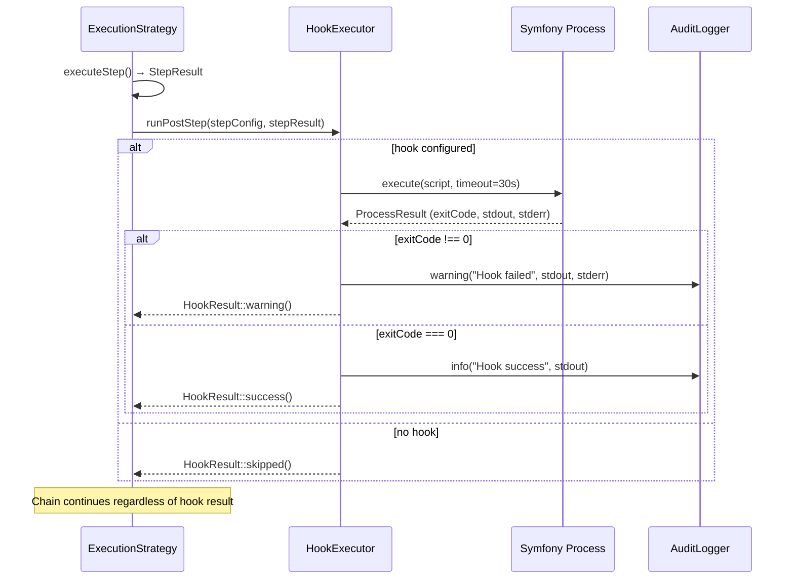

# EPIC-sprint-10-hooks-debt-cleanup: Sprint 10 — Hooks + Debt Cleanup

## 1. Concept and Goal (Концепция и цель)
### Story (Job Story)
> Когда нужно добавить custom-логику после выполнения шага цепочки (webhook-уведомление, запись метрики, нотификация) — единственный способ: писать новый сервис и тащить его в DI. Когда [`ChainDefinitionVo`](../src/Module/Orchestrator/Domain/ValueObject/ChainDefinitionVo.php) остаётся God-VO (546 LOC, 17 параметров, 3 фабричных метода) — ISP violation, каждая стратегия видит поля, которые ей не нужны. Когда static/conditional стратегии не поддерживают resume — падение на 8-м из 10 шагов = всё сначала для дорогих LLM-вызовов. Я хочу добавить `post_step` hooks через Symfony Process, завершить ChainDefinitionVo split и зафиксировать ADR паттерна checkpoint + resume, чтобы цепочки получили observability, код — чистые контракты, а команда — план на Q4.

### Goal (Цель по SMART)
Реализовать `post_step` hooks MVP (shell-скрипты через Symfony Process, таймаут 30с, hook failure = warning, не failure цепочки, stdout/stderr → audit log), завершить расщепление [`ChainDefinitionVo`](../src/Module/Orchestrator/Domain/ValueObject/ChainDefinitionVo.php) (546 LOC) на `StaticChainDefinitionVo`, `DynamicChainDefinitionVo`, `ConditionalChainDefinitionVo` с общим `ChainDefinitionInterface`, зафиксировать ADR паттерна checkpoint + resume для static/conditional стратегий. Срок: Sprint 10 (22 сентября — 05 октября).

## 2. Context and Scope (Контекст и границы)
### Предпосылки
- ExecutionStrategyInterface (Sprint 3) ✅ — 3 стратегии: Static, Dynamic, Conditional
- CommandHandler rewrite (Sprint 4) ✅ — диспетчер через tagged iterator
- [`SharedChainDefinitionVo`](../src/Module/Orchestrator/Domain/ValueObject/SharedChainDefinitionVo.php) (Sprint 4) ✅ — создан, но не подключён как тип параметра
- Conditional Branching (Sprint 8) ✅ — `when:` expressions + ConditionalExecutionStrategy
- Model failover + Error classification + MetricsCollector (Sprint 9) ✅ — observability foundation
- ADR-008: Shared Kernel Contract ✅ — заложен контракт для ChainDefinitionVo split

### Источники
- Roadmap: [`docs/releases/ROADMAP-2026-Q2-Q3.md`](../docs/releases/ROADMAP-2026-Q2-Q3.md) — секция Sprint 10
- Анализ Локи: [`docs/research/loki-roadmap-review-2026-05.md`](../docs/research/loki-roadmap-review-2026-05.md) — рекомендованный состав Sprint 10

### In Scope (Что делаем)
- `post_step` hooks MVP: shell-скрипты через Symfony Process, таймаут 30с, failure = warning
- ChainDefinitionVo split завершение: Static/Dynamic/Conditional sub-VO с общим ChainDefinitionInterface
- ADR: Resume для static/conditional цепочек (checkpoint + resume паттерн, без кода)

### Out of Scope (Чего НЕ делаем)
- `pre_step` hooks (control flow — это conditional branching через `when:`, Sprint 8)
- Parallel execution (Q4 2026)
- Persistent metrics storage (in-memory достаточно для MVP)
- Sub-agents (отложено до Q4)
- Resume implementation (только ADR, реализация — Q4)
- Security Policy (отменено: security theater)

## 3. Requirements (Требования, MoSCoW)
### 🔴 Must Have (Блокирующие требования)
- [ ] Hooks system: `post_step` MVP — shell-скрипты выполняются после каждого шага через Symfony Process
- [ ] Hook failure = warning, не failure цепочки
- [ ] Hook timeout (30 секунд)
- [ ] YAML DSL: `post_step` в chain step config (`post_step: "scripts/notify.sh"`, опционально)
- [ ] ChainDefinitionVo split завершён — Static/Dynamic/Conditional sub-VO с общим ChainDefinitionInterface
- [ ] ADR: Resume для static цепочек — паттерн checkpoint + resume зафиксирован
- [ ] `vendor/bin/phpunit` и `vendor/bin/psalm` — зелёные
- [ ] Deptrac green

### 🟡 Should Have (Важные требования)
- [ ] Unit-тесты ≥80% покрытия нового кода
- [ ] Hook stdout/stderr — в audit log

### 🟢 Could Have (Желательно)
- [ ] Hook pipeline: несколько post_step hooks на один шаг (массив в YAML)

### ⚫ Won't Have (Не в этот раз)
- [ ] `pre_step` hooks (control flow — следующий спринт)
- [ ] Parallel execution
- [ ] Persistent metrics storage
- [ ] Sub-agents
- [ ] Resume implementation (только ADR)

## 4. Solution Design (Техническое решение)

### Архитектурный подход

Sprint 10 фокусируется на observability через hooks и устранении техдолга God-VO:
1. **Hooks system** — `post_step` hook = shell-скрипт через [`Symfony\Process`](https://symfony.com/doc/current/components/process.html). Hook executor в Infrastructure-слое. Hook config в [`ChainStepVo`](../src/Module/Orchestrator/Domain/ValueObject/ChainStepVo.php) (`?string $postStep`). Вызов после успешного выполнения шага в стратегии.
2. **ChainDefinitionVo split** — завершение работы, начатой в Sprint 4: [`ChainDefinitionVo`](../src/Module/Orchestrator/Domain/ValueObject/ChainDefinitionVo.php) (546 LOC) → `StaticChainDefinitionVo`, `DynamicChainDefinitionVo`, `ConditionalChainDefinitionVo` + общий `ChainDefinitionInterface`. `SharedChainDefinitionVo` уже существует.
3. **ADR** — чисто документальная задача, без кода.

### Поток данных: Post-Step Hook

### Затронутые модули

| Модуль | Изменения |
|---|---|
| `Orchestrator\Domain` | `ChainDefinitionInterface` (новый), `StaticChainDefinitionVo` (новый), `DynamicChainDefinitionVo` (новый), `ConditionalChainDefinitionVo` (новый), `ChainStepVo` (+ `?string $postStep`), `HookExecutorInterface` (новый), `HookResultVo` (новый) |
| `Orchestrator\Application` | ExecutionStrategy — вызов hook executor после шага |
| `Orchestrator\Infrastructure` | `ShellHookExecutor` (новый, через Symfony Process) |
| `config/` | `chains.yaml` — YAML DSL: `post_step` на уровне шага |
| `docs/adr/` | ADR: Resume для static цепочек |

## 5. Implementation Plan (План реализации)

Порядок задач — по зависимостям:

- [ ] [TASK-refactor-chain-definition-split](TASK-refactor-chain-definition-split.todo.md) — ChainDefinitionVo split завершение (основа для hooks — step config изменится)
- [ ] [TASK-feat-hooks-post-step](TASK-feat-hooks-post-step.todo.md) — Hooks system: post_step MVP (зависит от обновлённого ChainStepVo)
- [ ] [TASK-docs-resume-adr](TASK-docs-resume-adr.todo.md) — ADR: Resume для static цепочек (ADR, не блокирует код)

## 6. Definition of Done (Критерии приёмки эпика)
- [ ] Все задачи из **Must Have** выполнены и протестированы
- [ ] `post_step` hooks работают (shell-скрипты через Symfony Process, таймаут 30с)
- [ ] Hook failure = warning в лог, не failure цепочки
- [ ] Hook stdout/stderr — в audit log
- [ ] [`ChainDefinitionVo`](../src/Module/Orchestrator/Domain/ValueObject/ChainDefinitionVo.php) расщеплён на `StaticChainDefinitionVo`, `DynamicChainDefinitionVo`, `ConditionalChainDefinitionVo`
- [ ] `ChainDefinitionInterface` введён и все стратегии типизированы через него
- [ ] Resume ADR записан в `docs/adr/`
- [ ] `vendor/bin/phpunit` и `vendor/bin/psalm` — зелёные
- [ ] Deptrac green
- [ ] Roadmap: Sprint 10 чекбоксы отмечены

## 7. Release Notes and Deployment (Инструкция по релизу)
- [ ] Обновить `docs/guide/architecture.md` — Hooks system, ChainDefinitionVo split
- [ ] Обновить `config/chains.yaml` примерами `post_step` конфигурации
- [ ] ADR Resume добавлен в `docs/adr/`

## 8. Risks and Dependencies (Риски и зависимости)
- **Shell-скрипты = attack surface.** Если мы отменили Security Policy как security theater, добавление shell-скриптов как хуков — потенциально противоречиво. Митигация: `post_step` hooks — observability/notification, не control flow. Выполняются с правами процесса оркестратора. Контроль доступа — через OS sandbox при необходимости.
- **ChainDefinitionVo split — ~15 файлов.** Sprint 4 создал [`SharedChainDefinitionVo`](../src/Module/Orchestrator/Domain/ValueObject/SharedChainDefinitionVo.php), но оригинальный `ChainDefinitionVo` не стал легче (546 LOC). Зависимости от Sprint 4 (ChainDefinitionVo split) ✅ и ADR-008 (Shared Kernel Contract) ✅.
- **Hook executor location:** Infrastructure-слой (Symfony Process — техническая зависимость). Interface — в Domain. Проверить Deptrac на правильность зависимостей.
- **Зависимость от Sprint 9:** MetricsCollector (in-memory) может использоваться hook executor'ом для записи метрик hook execution.

## 9. Sources (Источники)
- [ ] [Roadmap 2026 Q2–Q3: Sprint 10](../docs/releases/ROADMAP-2026-Q2-Q3.md)
- [ ] [Анализ Локи: Sprint 9–10](../docs/research/loki-roadmap-review-2026-05.md)
- [ ] [ADR-006: ExecutionStrategy composition](../docs/adr/006-execution-strategy-composition.md)
- [ ] [ADR-008: Shared Kernel Contract](../docs/adr/008-shared-kernel-contract.md)
- [ ] [Конвенции проекта](../docs/conventions/index.md)

## 10. Comments (Комментарии)
- Sprint 10 полностью основан на рекомендациях Локи из [`docs/research/loki-roadmap-review-2026-05.md`](../docs/research/loki-roadmap-review-2026-05.md). Sub-agent ADR — отложен до Q4.
- Порядок выполнения: сначала `TASK-refactor-chain-definition-split` (основа), потом `TASK-feat-hooks-post-step` (зависит от обновлённого `ChainStepVo`), параллельно — `TASK-docs-resume-adr` (ADR, не блокирует код).
- Hooks MVP scope: только `post_step` (observability/notification). `pre_step` = conditional branching (уже есть через `when:`), отдельная задача с другим risk profile.
- ChainDefinitionVo split — техдолг от Sprint 4: [`SharedChainDefinitionVo`](../src/Module/Orchestrator/Domain/ValueObject/SharedChainDefinitionVo.php) создан, но оригинальный VO (546 LOC, 17 параметров, 3 фабричных метода) не стал легче.

## Change History (История изменений)
| Дата | Автор (роль) | Изменение |
| :--- | :--- | :--- |
| 2026-05-02 | system_analyst_sherlock (Шерлок) | Создание эпика |
