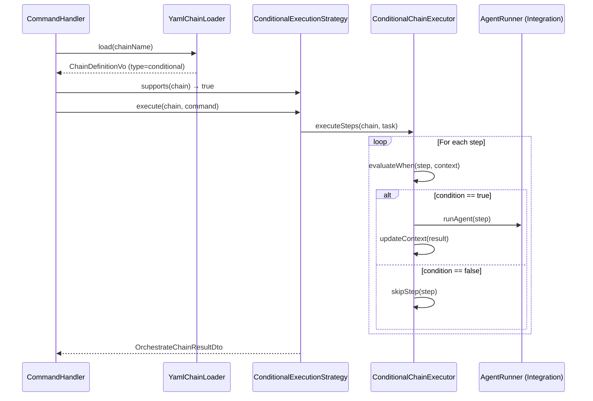

# EPIC-sprint-8-conditional-branching: Conditional Branching — первая roadmap-фича

## 1. Concept and Goal (Концепция и цель)
### Story (Job Story)
> Когда static-цепочки поддерживают только линейное выполнение шагов, а AI-agent фреймворки (LangGraph, Archon, Mastra AI, Agno) подтверждают потребность в conditional branching, я хочу добавить `when:` expressions в YAML DSL и третью реализацию [`ExecutionStrategyInterface`](../../src/Module/Orchestrator/Application/Service/Chain/ExecutionStrategyInterface.php), чтобы цепочки могли ветвиться по результатам предыдущих шагов (exit code, status, output patterns).

### Goal (Цель по SMART)
Реализовать условное ветвление (`when:` expressions) в YAML-chain DSL + [`ConditionalExecutionStrategy`](../../src/Module/Orchestrator/Application/Service/Chain/ExecutionStrategyInterface.php) как третью реализацию `ExecutionStrategyInterface`. Integration-паттерн валидируется на ≥2 стратегиях (G6). Обратная совместимость: цепочки без `when:` работают без изменений. Срок: Sprint 8 (11 августа — 24 августа).

## 2. Context and Scope (Контекст и границы)
### Предпосылки
- ExecutionStrategyInterface (Sprint 3) ✅ — 3 метода: `execute()`, `resume()`, `supports()`
- CommandHandler rewrite (Sprint 4) ✅ — диспетчер через tagged iterator
- StaticExecution split (Sprint 7) ✅ — отдельный модуль, Integration-паттерн задокументирован
- ADR-006 (ExecutionStrategy composition) ✅ — триггер: conditional branching
- Roadmap: Sprint 8 — подтверждён 4+ фреймворками (LangGraph conditional edges, Archon `when:`, Mastra AI `.branch()`, Agno Condition + Router)

### In Scope (Что делаем)
- Audit isolation в StaticExecution (tech debt от Локи: RunStaticChainService конструирует Orchestrator DTO)
- YAML DSL: `when:` expressions — условное ветвление внутри цепочки
- [`ConditionalExecutionStrategy`](../../src/Module/Orchestrator/Application/Service/Chain/ExecutionStrategyInterface.php) — третья реализация `ExecutionStrategyInterface`
- Integration-слой для ConditionalExecutionStrategy (валидация G6)
- Unit + Integration тесты

### Out of Scope (Чего НЕ делаем)
- Parallel execution (Q4 2026)
- Sub-agents (Q4 2026)
- Error classification (Sprint 10)
- Security Policy (Sprint 9)
- Dynamic split

## 3. Requirements (Требования, MoSCoW)
### 🔴 Must Have (Блокирующие требования)
- [ ] Audit-ответственность вынесена из `RunStaticChainService` в отдельный сервис StaticExecution Domain
- [ ] YAML поддерживает `when:` expressions на уровне шага: простые условия (`result.exitCode == 0`, `result.status == "success"`)
- [ ] [`ChainDefinitionVo`](../../src/Module/Orchestrator/Domain/ValueObject/ChainDefinitionVo.php) расширен для хранения conditional branches (новый тип или расширение `ChainTypeEnum`)
- [ ] `ConditionalExecutionStrategy` реализует [`ExecutionStrategyInterface`](../../src/Module/Orchestrator/Application/Service/Chain/ExecutionStrategyInterface.php) (`execute()`, `resume()`, `supports()`)
- [ ] Integration-слой для Conditional Branching создан по тому же паттерну, что StaticExecution (без God-interface)
- [ ] Обратная совместимость: цепочки без `when:` работают без изменений
- [ ] `vendor/bin/phpunit` и `vendor/bin/psalm` — зелёные
- [ ] Deptrac green

### 🟡 Should Have (Важные требования)
- [ ] Integration-тесты с реальными YAML-файлами, содержащими `when:` conditions
- [ ] ADR-009: Conditional Branching DSL syntax и семантика
- [ ] Unit-тесты ≥80% покрытия нового кода Domain/Application

### 🟢 Could Have (Желательно)
- [ ] Расширенные conditions: `result.output contains "error"`, comparison operators (`>`, `<`, `>=`, `<=`)
- [ ] `else:` fallback branch в YAML DSL

### ⚫ Won't Have (Не в этот раз)
- [ ] Nested conditions (when внутри when)
- [ ] Parallel execution в ветках
- [ ] Condition на основе LLM-вывода (semantic conditions)
- [ ] Dynamic split

## 4. Solution Design (Техническое решение)

### Архитектурный подход

Conditional Branching реализуется через расширение существующего Strategy pattern. Новая стратегия — `ConditionalExecutionStrategy` — будет третьей реализацией `ExecutionStrategyInterface` после `StaticExecutionStrategy` и `DynamicExecutionStrategy`.

### Поток данных



### YAML DSL Syntax (предложение)

```yaml
chains:
  deploy:
    description: "Deploy с проверками"
    type: conditional
    steps:
      - type: agent
        role: backend_developer_levsha
        name: build
      - type: quality_gate
        command: 'vendor/bin/phpunit'
        label: 'Tests'
        name: tests
      - type: agent
        role: backend_developer_levsha
        name: deploy
        when: 'steps.tests.passed == true'
      - type: agent
        role: code_reviewer_backend_puaro
        name: rollback
        when: 'steps.tests.passed == false'
```

### Затронутые модули

| Модуль | Изменения |
|---|---|
| `StaticExecution` | Audit isolation: вынос AuditLoggerInterface-зависимости |
| `Orchestrator\Domain` | Расширение `ChainTypeEnum`, [`ChainStepVo`](../../src/Module/Orchestrator/Domain/ValueObject/ChainStepVo.php), новый VO для conditions |
| `Orchestrator\Infrastructure` | Расширение `YamlChainLoader` для `when:` parsing |
| `Orchestrator\Application` | `ConditionalExecutionStrategy` (новый) |
| `Orchestrator\Integration` | Integration Service для ConditionalExecution (если отдельный модуль) |

## 5. Implementation Plan (План реализации)

Порядок задач — по зависимостям:

- [ ] [TASK-refactor-static-audit-isolation](TASK-refactor-static-audit-isolation.todo.md) — Audit isolation в StaticExecution (tech debt от Локи)
- [ ] [TASK-feat-conditional-yaml-dsl](TASK-feat-conditional-yaml-dsl.todo.md) — YAML DSL `when:` expressions
- [ ] [TASK-feat-conditional-execution-strategy](TASK-feat-conditional-execution-strategy.todo.md) — ConditionalExecutionStrategy
- [ ] [TASK-feat-conditional-integration-layer](TASK-feat-conditional-integration-layer.todo.md) — Integration-слой для Conditional Branching

## 6. Definition of Done (Критерии приёмки эпика)
- [ ] Все 4 задачи выполнены и протестированы
- [ ] YAML поддерживает `when:` expressions; цепочки без `when:` работают без изменений
- [ ] `ConditionalExecutionStrategy` — третья реализация [`ExecutionStrategyInterface`](../../src/Module/Orchestrator/Application/Service/Chain/ExecutionStrategyInterface.php), подхватывается tagged iterator в [`OrchestrateChainCommandHandler`](../../src/Module/Orchestrator/Application/UseCase/Command/OrchestrateChain/OrchestrateChainCommandHandler.php)
- [ ] Integration-паттерн валидирован на 3-й стратегии (G6): Integration-слой < 200 LOC, без God-interface
- [ ] Audit isolation: `RunStaticChainService` не зависит от Orchestrator Domain DTO
- [ ] `vendor/bin/phpunit` и `vendor/bin/psalm` — зелёные
- [ ] Deptrac green
- [ ] Roadmap: Sprint 8 чекбоксы отмечены `[x]`

## 7. Release Notes and Deployment (Инструкция по релизу)
- [ ] Обновить `config/chains.yaml` примерами `when:` expressions
- [ ] Обновить `docs/guide/architecture.md` — Conditional Branching как третий тип стратегии
- [ ] ADR-009 создан (если Should Have реализован)

## 8. Risks and Dependencies (Риски и зависимости)
- **R-6 (унаследованный):** Integration-паттерн может не масштабироваться на Conditional Branching. Sprint 8 — точка валидации G6. Если паттерн треснет — откат: conditional logic внутри Orchestrator без отдельного Integration-слоя.
- **R-2 (из Roadmap):** Выбор синтаксиса `when:` DSL может стать предметом обсуждений. Митигация: зафиксировать DSL в ADR до реализации.
- **Зависимость:** ExecutionStrategyInterface ✅, CommandHandler rewrite ✅, Static split ✅ — все закрыты.
- **Зависимость (внутренняя):** Audit isolation (Task 4) должна быть завершена до ConditionalExecutionStrategy (Task 2), чтобы ConditionalStrategy не унаследовала Audit-зависимость от StaticExecution.

## 9. Sources (Источники)
- [ ] [Roadmap 2026 Q2–Q3: Sprint 8](../docs/releases/ROADMAP-2026-Q2-Q3.md)
- [ ] [ADR-006: ExecutionStrategy composition](../docs/adr/006-execution-strategy-composition.md)
- [ ] [ADR-008: Shared Kernel Contract](../docs/adr/008-shared-kernel-contract.md)
- [ ] [EPIC-refactor-orchestrator-p3 (P3 завершён)](EPIC-refactor-orchestrator-p3.md)
- [ ] [Research: AI-agent frameworks summary](../docs/research/agent-frameworks-summary.md)

## 10. Comments (Комментарии)
- Conditional Branching — первая roadmap-фича (не декомпозиция). Качество реализации задаст паттерн для последующих фич (parallel execution, sub-agents).
- Tech debt от Локи (audit isolation) включён в эпик, т.к. `RunStaticChainService` напрямую конструирует `ChainResultAuditDto` из Orchestrator Domain — это нарушение границ модулей, которое усилится при добавлении ConditionalExecutionStrategy.
- `ConditionalExecutionStrategy` логически ближе к StaticExecution (линейное выполнение с ветвлением), чем к Dynamic (фасилитатор + участники). Однако отдельный модуль ConditionalExecution не планируется до стабилизации Integration-паттерна (решение — после валидации G6).

## Change History (История изменений)
| Дата | Автор (роль) | Изменение |
| :--- | :--- | :--- |
| 2026-05-01 | system_analyst_sherlock (Шерлок) | Создание эпика |
