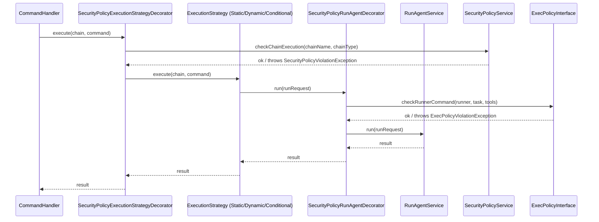

# EPIC-sprint-9-security-policy: Security Policy (Foundation) — безопасность автономного выполнения

## 1. Concept and Goal (Концепция и цель)
### Story (Job Story)
> Когда AI-агент в оркестрации выполняет shell-команды (quality gates, agent runs) без ограничений, а фреймворки (Codex, Claude Code, Copilot Cloud Agent) подтверждают потребность в exec policy и permissions, я хочу создать модуль SecurityPolicy с декларативными правилами (exec rules) и permission system, чтобы цепочки выполнялись только с явно разрешёнными runner'ами, инструментами и командами.

### Goal (Цель по SMART)
Реализовать модуль `SecurityPolicy` (`src/Module/SecurityPolicy/`) с: (1) rule-based exec policy для фильтрации команд и runner-вызовов, (2) permission system для ограничения доступных runner'ов/tools/models per chain, (3) decorator-интеграция в Orchestrator через Dependency Inversion (ports в Orchestrator Domain, реализация в SecurityPolicy Infrastructure). ADR фиксирует модель: rules filter → permission check → execution. Срок: Sprint 9 (25 августа — 07 сентября).

## 2. Context and Scope (Контекст и границы)
### Предпосылки
- Security Policy анализ Локи (Sprint 2, AI#14) ✅ — [`security-policy-cross-cutting-analysis.md`](../docs/releases/security-policy-cross-cutting-analysis.md)
- ChainDefinitionInterface (Sprint 4, AI#10) ✅ — `SharedChainDefinitionVo`, split завершён
- ExecutionStrategy pattern (Sprint 3–4) ✅ — decorator-friendly architecture
- StaticExecution split (Sprint 7) ✅ — Integration-паттерн валидирован
- Brainstorm #2 консенсус: SecurityPolicy — **безусловный отдельный модуль**, cross-cutting concern с собственным Ubiquitous Language

### Аналитические выводы (из анализа Локи)
1. **Permission model — единая** для Static и Dynamic: exec policy (rules filter), runner/tool/model restrictions — через одни и те же interfaces. Различие — только в точках применения (per-step для Static, per-role/per-turn для Dynamic).
2. **Shared Kernel НЕ расширяется** — interfaces (ports) размещаются в `Orchestrator/Domain/Service/Security/`.
3. **Decorator pattern** — консистентно с retry/circuit breaker (`RetryingAgentRunner`, `CircuitBreakerAgentRunner`).
4. **Dependency Inversion** — Orchestrator Domain определяет interfaces, SecurityPolicy Infrastructure их реализует.

### In Scope (Что делаем)
- ADR-010: Security Policy Architecture
- Модуль `SecurityPolicy` — Domain слой (rules, permissions, policy service)
- Ports (interfaces) в `Orchestrator/Domain/Service/Security/`
- Infrastructure-реализация ports в SecurityPolicy
- Decorators для интеграции: `SecurityPolicyRunAgentDecorator`, `SecurityPolicyExecutionStrategyDecorator`
- YAML DSL: `permissions:` block для per-chain configuration
- Unit + Integration тесты

### Out of Scope (Чего НЕ делаем)
- Docker sandboxing (Q4 R&D)
- Guardian / LLM safety reviewer (Sprint 10+)
- Org-level policy engine (долгосрочная перспектива)
- Per-path filesystem permissions (требует container isolation)
- Dynamic split
- Security UI / CLI commands для управления политиками

## 3. Requirements (Требования, MoSCoW)
### 🔴 Must Have (Блокирующие требования)
- [ ] ADR-010: Security Policy Architecture — зафиксирована модель rules → permissions → execution
- [ ] Модуль `SecurityPolicy` (`src/Module/SecurityPolicy/`) с Domain слоем: [`Entity`](../docs/conventions/layers/domain/entity.md) (ExecRule), [`Value Object`](../docs/conventions/core_patterns/value-object.md) (Permission, RuleId, RuleAction), [`Enum`](../docs/conventions/core_patterns/enum.md) (RuleType, PermissionAction)
- [ ] `ExecPolicyInterface` (port в Orchestrator Domain) + реализация в SecurityPolicy Infrastructure
- [ ] `ChainSecurityPolicyInterface` (port в Orchestrator Domain) + реализация в SecurityPolicy Infrastructure
- [ ] Domain [`Exception`](../docs/conventions/core_patterns/exception.md): `SecurityPolicyViolationException`, `ExecPolicyViolationException`
- [ ] `SecurityPolicyRunAgentDecorator` — decorator для [`RunAgentServiceInterface`](../src/Module/Orchestrator/Domain/Service/Integration/RunAgentServiceInterface.php)
- [ ] Unit-тесты на все rule-типы ≥80% покрытия Domain/Application
- [ ] `vendor/bin/phpunit` и `vendor/bin/psalm` — зелёные
- [ ] Deptrac green

### 🟡 Should Have (Важные требования)
- [ ] `SecurityPolicyExecutionStrategyDecorator` — decorator для [`ExecutionStrategyInterface`](../src/Module/Orchestrator/Application/Service/Chain/ExecutionStrategyInterface.php)
- [ ] YAML DSL: `permissions:` block в chain configuration
- [ ] Exec policy файл: внешний файл с rules (аналог Codex `.rules`)
- [ ] Integration-тесты с реальными YAML-chain конфигурациями

### 🟢 Could Have (Желательно)
- [ ] Configurable rule severity: warn vs deny (блокировка vs логирование)
- [ ] Rule composition: AND/OR для комбинирования условий

### ⚫ Won't Have (Не в этот раз)
- [ ] Docker sandboxing
- [ ] LLM-based safety reviewer (Guardian)
- [ ] Org-level policy engine
- [ ] Per-path filesystem permissions
- [ ] Runtime policy hot-reload
- [ ] Audit trail / logging для denied operations (отдельная задача)

## 4. Solution Design (Техническое решение)

### Архитектурный подход

SecurityPolicy — отдельный модуль с собственным Ubiquitous Language. Интеграция с Orchestrator через **Dependency Inversion**: Orchestrator Domain определяет ports (interfaces), SecurityPolicy Infrastructure реализует их. Decorator pattern для внедрения checks.

### Поток данных



### Структура модуля SecurityPolicy

```
src/Module/SecurityPolicy/
├── Domain/
│   ├── Entity/
│   │   └── ExecRule.php                      # Декларативное правило (banned prefix, allowed runner, etc.)
│   ├── Enum/
│   │   ├── RuleActionEnum.php                # allow | deny
│   │   ├── RuleTargetEnum.php                # command | runner | tool | model | chain
│   │   └── RuleSeverityEnum.php              # block | warn
│   ├── Exception/
│   │   ├── SecurityPolicyException.php       # базовый exception модуля
│   │   ├── SecurityPolicyViolationException.php
│   │   └── ExecPolicyViolationException.php
│   ├── Service/
│   │   ├── ExecPolicyCheckService.php        # проверка exec rules
│   │   └── SecurityPolicyService.php         # агрегация: chain-level + exec-level checks
│   └── ValueObject/
│       ├── ExecRuleId.php                    # идентификатор правила
│       ├── Permission.php                    # allow/deny для конкретного ресурса
│       ├── PermissionSet.php                 # набор permissions для chain
│       └── RulePattern.php                   # паттерн匹配 (glob/regex/exact)
├── Application/
│   └── Service/
│       └── SecurityPolicyApplicationService.php  # Application-level orchestration
├── Infrastructure/
│   ├── Orchestrator/                         # Реализация ports Orchestrator'а
│   │   ├── ChainSecurityPolicy.php           # implements ChainSecurityPolicyInterface
│   │   └── ExecPolicyCheck.php              # implements ExecPolicyInterface
│   └── Persistence/
│       └── InMemoryExecRuleRepository.php    # In-memory для Sprint 9
└── Integration/                              # (пока пусто — интеграция через Orchestrator ports)
```

### Ports в Orchestrator Domain

```php
// src/Module/Orchestrator/Domain/Service/Security/
interface ChainSecurityPolicyInterface
{
    /** @throws SecurityPolicyViolationException */
    public function checkChainExecution(string $chainName, ChainTypeEnum $type): void;
}

interface ExecPolicyInterface
{
    /** @throws ExecPolicyViolationException */
    public function checkRunnerCommand(string $runnerName, string $task, ?string $tools = null): void;
    /** @throws ExecPolicyViolationException */
    public function checkShellCommand(string $command): void;
}
```

### Зависимости (Deptrac)

```
SecurityPolicy Infrastructure → Orchestrator Domain (interfaces only) ✅
Orchestrator Domain → (не зависит от SecurityPolicy) ✅
Orchestrator Application → Orchestrator Domain (interfaces) ✅
```

## 5. Implementation Plan (План реализации)

Порядок задач — по зависимостям:

- [x] [TASK-docs-security-policy-adr](done/TASK-docs-security-policy-adr.todo.md) — ADR-010: Security Policy Architecture ✅
- [ ] [TASK-feat-security-policy-domain](TASK-feat-security-policy-domain.todo.md) — Domain слой модуля SecurityPolicy
- [ ] [TASK-feat-security-policy-ports](TASK-feat-security-policy-ports.todo.md) — Ports (interfaces) в Orchestrator Domain
- [ ] [TASK-feat-security-policy-infrastructure](TASK-feat-security-policy-infrastructure.todo.md) — Infrastructure реализация ports + Decorators
- [ ] [TASK-feat-security-policy-yaml-dsl](TASK-feat-security-policy-yaml-dsl.todo.md) — YAML DSL `permissions:` block + Exec policy файл
- [ ] [TASK-test-security-policy-integration](TASK-test-security-policy-integration.todo.md) — Integration тесты end-to-end

## 6. Definition of Done (Критерии приёмки эпика)
- [ ] ADR-010 записан в `docs/adr/`
- [ ] Модуль `SecurityPolicy` (`src/Module/SecurityPolicy/`) создан с Domain/Application/Infrastructure слоями
- [ ] `ExecPolicyInterface` и `ChainSecurityPolicyInterface` в `Orchestrator/Domain/Service/Security/`
- [ ] `SecurityPolicyRunAgentDecorator` внедряется через DI — проверяет exec policy перед agent run
- [ ] Exec policy фильтрует: banned prefixes (`bash -c`, `rm -rf`), разрешённые runners, tools
- [ ] Permission system ограничивает доступные runners/tools/models per chain
- [ ] Unit-тесты ≥80% покрытия Domain/Application нового модуля
- [ ] `vendor/bin/phpunit` и `vendor/bin/psalm` — зелёные
- [ ] Deptrac green (на 3+ модулях: Orchestrator, StaticExecution, SecurityPolicy)
- [ ] Roadmap: Sprint 9 чекбоксы отмечены `[x]`

## 7. Release Notes and Deployment (Инструкция по релизу)
- [ ] Обновить `config/services.yaml` — добавить SecurityPolicy DI-конфигурацию
- [ ] Обновить `docs/guide/architecture.md` — SecurityPolicy как третий модуль, ports diagram
- [ ] Добавить пример `permissions:` block в `apps/console/config/agent_chains.yaml`
- [ ] Создать default exec policy файл (например, `config/security_policy.yaml`)

## 8. Risks and Dependencies (Риски и зависимости)
- **R-4 (унаследованный):** Security Policy cross-cutting может потребовать architecture decision. **Митигация:** анализ Локи (Sprint 2) уже проведён, архитектурные решения зафиксированы.
- **Deptrac на 3+ модулях:** SecurityPolicy — третий модуль (после Orchestrator, StaticExecution). Deptrac-конфигурация должна быть обновлена. Если возникнут circular dependency — interfaces перемещаются в shared location.
- **Зависимость:** ExecutionStrategy pattern ✅, Decorator pattern (retry/circuit breaker) ✅, StaticExecution Integration-паттерн ✅ — все закрыты.
- **Зависимость (внутренняя):** ADR-010 (Task 1) должен быть завершён до Domain (Task 2). Ports (Task 3) — до Infrastructure (Task 4). Infrastructure — до YAML DSL (Task 5) и Integration тестов (Task 6).

## 9. Sources (Источники)
- [ ] [Roadmap 2026 Q2–Q3: Sprint 9](../docs/releases/ROADMAP-2026-Q2-Q3.md)
- [ ] [Security Policy Cross-Cutting Analysis (Локи)](../docs/releases/security-policy-cross-cutting-analysis.md)
- [ ] [Архитектура проекта](../docs/guide/architecture.md)
- [ ] [Конвенции проекта](../docs/conventions/index.md)
- [ ] [ADR-006: ExecutionStrategy Composition](../docs/adr/006-execution-strategy-composition.md)
- [ ] [ADR-008: Shared Kernel Contract](../docs/adr/008-shared-kernel-contract.md)
- [ ] [Research: AI-agent frameworks summary](../docs/research/agent-frameworks-summary.md)
- [ ] [Протокол brainstorm #2](../var/sessions/brainstorm/2026-04-30_16-02-26/result.md)

## 10. Comments (Комментарии)
- SecurityPolicy — первый cross-cutting concern модуль в проекте (не bounded context). Его успешная реализация задаст паттерн для других cross-cutting concerns (hooks system, audit trail).
- Decorator approach означает, что SecurityPolicy checks можно **включать/выключать** через DI-конфигурацию без изменения Domain-кода.
- В Sprint 9 реализуется **foundation** — rule-based checks без LLM. Guardian/LLM safety reviewer (Sprint 10+) добавит semantic analysis поверх.
- Exec policy файл (аналог Codex `.rules`) — Should Have, но его дизайн проработан в ADR-010, чтобы избежать breaking changes при добавлении.

## Change History (История изменений)
| Дата | Автор (роль) | Изменение |
| :--- | :--- | :--- |
| 2026-05-02 | system_analyst (Шерлок) | Создание эпика |
