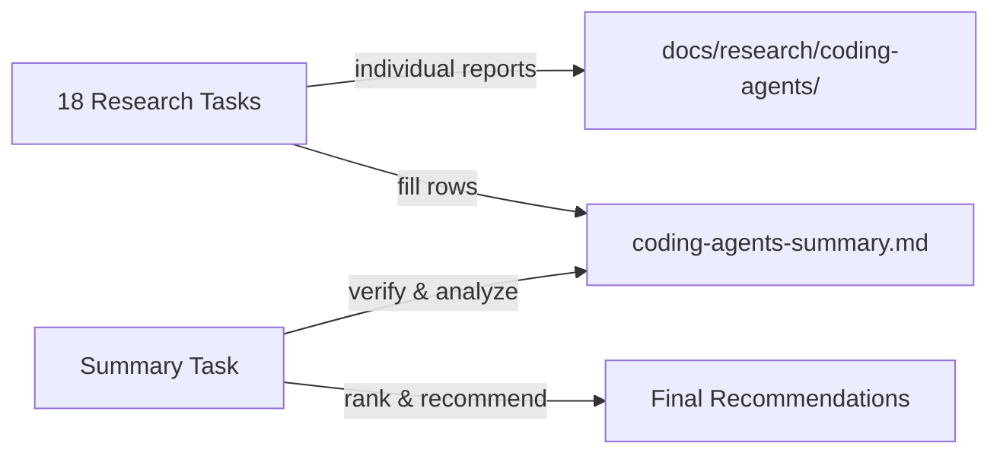

---
# Metadata (Метаданные)
type: epic
created: 2026-05-09
value: V3
complexity: C4
priority: P2
author: Тимлид (Алекс)
assignee: Аналитик (Шерлок)
status: in_progress
reopened: 2026-08-03
pr: "#171"
branch: epic/research-coding-agents-comparison
---

# EPIC-research-coding-agents-comparison: Сравнительное исследование CLI-агентов кодинга

## 1. Concept and Goal (Концепция и цель)
### Story (Job Story)
> **Job Story:** Когда мы подключаем AI-агенты как сабагентов к ролям команды (docs/agents/roles/team/), я хочу провести систематическое исследование CLI-агентов кодинга, чтобы определить, какие из них подходят для работы с нашей системой ролей, скиллов и системных промптов — и выбрать лучших кандидатов для интеграции.

### Goal (Цель по SMART)
Исследовать 18 CLI-агентов кодинга по единой методологии из 10 критериев (системный промпт, роль, скиллы, AGENTS.md, запуск как сабагент, токены, free tier, провайдеры, лицензия). По каждому — вердикт: подходит / частично подходит / не подходит. Сводная таблица в `docs/research/coding-agents-summary.md`. Срок: до конца Q2 2026.

## 2. Context and Scope (Контекст и границы)
*   **In Scope (Что делаем):**
    *   Исследование каждого CLI-агента по единой методологии (10 критериев)
    *   Индивидуальные comparison-отчёты в `docs/research/coding-agents/`
    *   Сводная таблица с классификацией и рекомендациями в `docs/research/coding-agents-summary.md`
    *   Чёткий вердикт по каждому агенту
*   **Out of Scope (Чего НЕ делаем):**
    *   Написание кода интеграции — только исследование
    *   Глубокий code review исходников — анализ на уровне документации и CLI-интерфейса
    *   Бенчмарки производительности

## 3. Requirements (Требования, MoSCoW)

### 🔴 Must Have (Блокирующие требования)
- [x] Каждый агент исследован по единой методологии из 10 критериев
- [x] По каждому агенту создан отчёт в `docs/research/coding-agents/<agent-slug>-comparison.md`
- [x] Сводная таблица в `docs/research/coding-agents-summary.md` со всеми 18 агентами
- [x] Чёткий вердикт по каждому: подходит / частично подходит / не подходит — с обоснованием
- [x] Итоговые рекомендации по приоритетам интеграции

### 🟡 Should Have (Важные требования)
- [x] Сравнительная таблица с группировкой по категориям (open source, проприетарный)
- [x] Ранжирование агентов по степени пригодности для сабагент-интеграции
- [x] Выявление общих паттернов CLI-интерфейсов агентов

### 🟢 Could Have (Желательно)
- [x] Визуализация (Mermaid-диаграммы) ключевых различий
- [x] Практические примеры запуска каждого агента в JSON-режиме

### ⚫ Won't Have (Не в этот раз)
- [x] Код интеграции любого из агентов
- [x] Performance-бенчмарки
- [x] Глубокий анализ исходного кода агентов

## 4. Solution Design (Техническое решение)

Исследование проводится в два этапа:

**Этап 1 — Индивидуальные research-задачи (18 задач, параллельные):** каждая задача изучает один CLI-агент, пишет отдельный comparison-документ и заполняет свою строку в сводной таблице `docs/research/coding-agents-summary.md`. Задачи независимы, могут выполняться параллельно разными сабагентами.

**Этап 2 — Финальная задача:** после завершения всех 18 исследований финальная задача проверяет полноту таблицы, выявляет тренды, ранжирует агенты и составляет итоговые рекомендации.

Все отчёты размещаются в `docs/research/coding-agents/`.

**Единая методология — 10 критериев оценки:**

1. **Системный промпт** — замена, дополнение, передача файла роли
2. **Промпт агента / роль** — инъекция контекста роли через CLI/env/файл
3. **Скиллы (skills)** — встроенная поддержка, подключение файлов/каталогов
4. **AGENTS.md** — автообнаружение, отключение, альтернативные форматы
5. **Стандартная папка .agents/skills/** — автосканирование, явное подключение
6. **Запуск как сабагент** — JSON-режим, programmatic API, контроль таймаутов
7. **Токены и стоимость** — отслеживание потребления, расчёт стоимости
8. **Free tier** — наличие бесплатного тарифа, лимиты
9. **Провайдеры и модели** — список провайдеров, BYOK, локальные модели
10. **Лицензия** — open source / проприетарный, тип лицензии

## 5. Implementation Plan (План реализации)

### Этап 1: Индивидуальные исследования (параллельные)

- [x] [TASK-research-pi-coding-agent](TASK-research-pi-coding-agent.todo.md) — Pi Coding Agent (Node.js/TypeScript, @earendil-works/pi-coding-agent)
- [x] [TASK-research-codex-cli](TASK-research-codex-cli.todo.md) — Codex CLI (OpenAI, Rust) ✅ Частично подходит (6/10)
- [x] [TASK-research-opencode-cli](TASK-research-opencode-cli.todo.md) — OpenCode (Go)
- [x] [TASK-research-kilocode-cli](TASK-research-kilocode-cli.todo.md) — Kilo Code CLI (TypeScript)
- [x] [TASK-research-gemini-cli](TASK-research-gemini-cli.todo.md) — Gemini CLI (Google, TypeScript)
- [x] [TASK-research-claude-code-agent](TASK-research-claude-code-agent.todo.md) — Claude Code (Anthropic, проприетарный)
- [x] [TASK-research-qwen-cli](TASK-research-qwen-cli.todo.md) — Qwen CLI (Alibaba/Qwen, Python)
- [x] [TASK-research-goose-agent](TASK-research-goose-agent.todo.md) — Goose (Block/Square, Go)
- [x] [TASK-research-droid-agent](TASK-research-droid-agent.todo.md) — Droid
- [x] [TASK-research-warp-agent](TASK-research-warp-agent.todo.md) — Warp (Warp AI, Rust-терминал)
- [x] [TASK-research-crush-agent](TASK-research-crush-agent.todo.md) — Crush (Charmbracelet, Go)
- [x] [TASK-research-openclaw-agent](TASK-research-openclaw-agent.todo.md) — OpenClaw (Python)
- [x] [TASK-research-copilot-cli](TASK-research-copilot-cli.todo.md) — GitHub Copilot CLI (проприетарный)
- [x] [TASK-research-hermes-agent](TASK-research-hermes-agent.todo.md) — Hermes (Nous Research)

### Этап 1i: Дополнительные исследования (2026-07-24)

- [x] [TASK-research-omp-coding-agent](TASK-research-omp-coding-agent.todo.md) — omp / Oh My Pi (`@oh-my-pi/pi-coding-agent`, MIT, TypeScript+Bun+Rust), форк Pi от can1357. Вердикт ✅ Подходит (10/10): новый кандидат #1, Pi остаётся fallback/baseline.

### Этап 2: Сводный анализ (после завершения Этапа 1)

- [x] [TASK-research-coding-agents-summary](TASK-research-coding-agents-summary.todo.md) — Сводная таблица и итоговые рекомендации

### Этап 1d: Дополнительные исследования (2026-05-13)

- [x] [TASK-research-codebuff](TASK-research-codebuff.todo.md) — Codebuff (TypeScript, Apache-2.0, мультиагентный)

### Этап 1e: Дополнительные исследования (2026-05-20)

- [x] [TASK-research-zeroclaw-agent](TASK-research-zeroclaw-agent.todo.md) — Zeroclaw (zeroclaw-labs, Rust, agent runtime)

- [x] ~~TASK-research-oh-my-openagent~~ → перенесён в EPIC-research-agent-frameworks-comparison (OmO — система оркестрации, не кодинг-агент)

### Этап 1h: Дополнительные исследования (2026-06-17)

- [x] [TASK-research-zcode-coding-agent](TASK-research-zcode-coding-agent.todo.md) — ZCode (Z.AI / Zhipu, desktop GUI-агент, GLM-5.2) *(PR #269, merge подтверждён пользователем)*

### Этап 1j: Дополнительные исследования (2026-07-28)

- [x] [TASK-research-nanoclaw](TASK-research-nanoclaw.todo.md) — NanoClaw (`nanocoai/nanoclaw`, security-first alternative to OpenClaw, Anthropic Agents SDK). **❌ Не подходит (4/10, 21/30)** — К6-блокер сохранён (архитектурно ≡ OpenClaw, Docker-only). Канонический репозиторий — `nanocoai/nanoclaw` (`gavrielc/nanoclaw` — раннее зеркало).
- [x] [TASK-research-nanocoder](TASK-research-nanocoder.todo.md) — Nanocoder (`Nano-Collective/nanocoder`, `@nanocollective/nanocoder`, local-first, MIT). **⚠️ Частично (7/10, 22/30)** — К6 (CLI JSON) закрыт (`--json` + `--acp`), BYOM (Ollama/OpenRouter/OpenAI-compatible).

### Этап 1k: Дополнительные исследования (2026-08-03)

- [ ] [TASK-research-deepagents](../TASK-research-deepagents.todo.md) — Deep Agents (`langchain-ai/deepagents`, Python, MIT, ≈27.3k★; agent-харнес на LangGraph + CLI-продукт **Deep Agents Code** «similar to Claude Code or Cursor», «Inspired by Claude Code»; sub-agents, filesystem, context management, HITL, skills-on-demand, tools/MCP, BYO LLM/model-agnostic). Перенесён из `EPIC-research-agent-frameworks-comparison` (зеркальный прецедент строки 125: OmO ушли отсюда в frameworks; deepagents возвращён как coding-агент). Предварительный verdict: ✅ Подходит (подтвердить по 10 критериям).

## 6. Definition of Done (Критерии приёмки эпика)
- [x] Все 20 индивидуальных research-задач выполнены
- [x] Каждый comparison-документ создан в `docs/research/coding-agents/`
- [x] Сводная таблица `docs/research/coding-agents-summary.md` создана и заполнена
- [x] По каждому агенту есть вердикт: подходит / частично подходит / не подходит
- [x] Финальная задача с ранжированием и рекомендациями выполнена

## 7. Release Notes and Deployment (Инструкция по релизу)
Не требуется — эпик содержит только исследовательские задачи (docs).

## 8. Risks and Dependencies (Риски и зависимости)
- 20 агентов — значительный объём исследования
- Многие агенты активно развиваются — информация может устареть
- Проприетарные продукты (Claude Code, Factory Droid, ZCode, GitHub Copilot CLI) — анализ только по документации
- Названия некоторых агентов могут быть неоднозначны — нужно уточнять, какой именно проект имеется в виду
- Разные языки/экосистемы (TypeScript, Rust, Go, Python) — оценка применимости паттернов

## 9. Sources (Источники)
- Прецедент: `todo/done/EPIC-research-agent-frameworks-comparison.md`
- Существующие comparison-документы: `docs/research/`
- Ссылки на репозитории и документацию — в индивидуальных задачах

## 10. Comments (Комментарии)
Эпик объединяет исследование CLI-агентов кодинга в единый трек с чётким финальным артефактом — сводной таблицей. Задачи Этапа 1 можно выполнять в любом порядке и параллельно. Задача Этапа 2 запускается только после завершения всех 20 исследований. Pi Coding Agent уже подключён как сабагент — его исследование послужит референс-точкой и бенчмарком для остальных.

## Change History (История изменений)
| Дата | Автор (роль) | Изменение |
| :--- | :--- | :--- |
| 2026-05-09 | Тимлид (Алекс) | Создание эпика |
| 2026-06-17 | Аналитик (Шерлок) | Stage 1h: исследование ZCode (Z.AI) добавлено. Вердикт ❌ Не подходит (4/10) — desktop GUI без headless/JSON-режима (К6 — блокер). Возникший вопрос о необходимости research во втором эпике (`agent-frameworks`) закрыт: субагенты ZCode (read-only Explore + roadmap кастомных) — feature продукта, а не система оркестрации; отдельного исследования в `EPIC-research-agent-frameworks-comparison` не требуется. |
| 2026-07-24 | Аналитик (Шерлок) | Stage 1i: добавлено исследование omp (Oh My Pi). Сводка обновлена до 18 исследований; omp поставлен #1 как надмножество Pi, Pi сохранён как baseline/fallback. |
| 2026-07-28 | Тимлид (Алекс) | Stage 1j (post-epic): постановка research-задач на NanoClaw и Nanocoder. Происхождение: проверка по телеграм-посту — из «zero, nano, pi» уже ресерчены `zero`=ZeroClaw (#7, 6/10) и `pi` (#2, 10/10); `nano` отсутствует → два кандидата (NanoClaw как Claw-семейство, Nanocoder как независимый local-first агент). Сводная таблица обновляется один раз для обоих во избежание конфликта слияния. |
| 2026-07-28 | Аналитик (Шерлок) | Stage 1j выполнен: исследования NanoClaw и Nanocoder завершены. NanoClaw (`nanocoai/nanoclaw`) — ❌ Не подходит (4/10, 21/30), К6-блокер сохранён (≡ OpenClaw, Docker-only). Nanocoder (`Nano-Collective/nanocoder`) — ⚠️ Частично (7/10, 22/30), К6 закрыт (`--json`+`--acp`), local-first BYOM. Сводная таблица обновлена до 20 исследований (NanoClaw #14, Nanocoder #11). PR #331. |
| 2026-08-03 | Тимлид (Алекс) | Эпик reopened (статус `in_progress`, стадия `1k`): добавлена постановка TASK-research-deepagents — `langchain-ai/deepagents` (Python, MIT, ≈27.3k★; agent-харнес на LangGraph + CLI-продукт Deep Agents Code «similar to Claude Code», «Inspired by Claude Code»; BYO LLM/model-agnostic, skills/MCP, HITL, sub-agents, programmatic API). Перенесён из `EPIC-research-agent-frameworks-comparison` по решению пользователя (coding-агент по аналогии с Claude Code). Предварительный verdict: ✅ Подходит (подтвердить по 10 критериям). |
