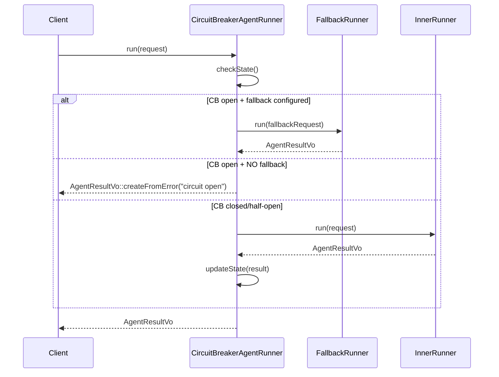
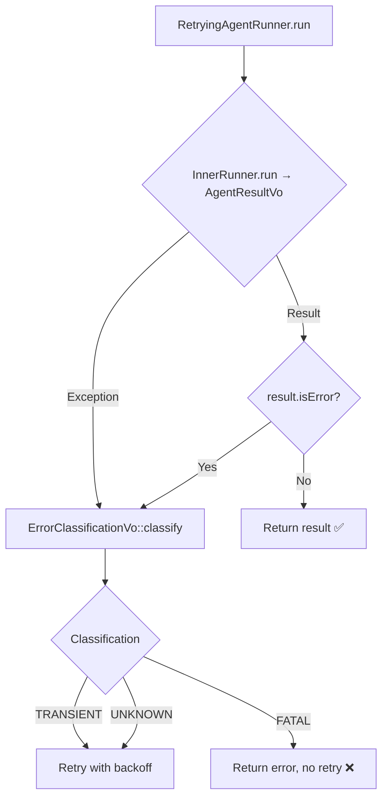

# EPIC-sprint-9-resilience-observability: Sprint 9 — Resilience + Observability

## 1. Concept and Goal (Концепция и цель)
### Story (Job Story)
> Когда Circuit Breaker agent runner переходит в open-состояние и блокирует вызов, вся цепочка падает, хотя fallback runner может быть уже сконфигурирован через `FallbackConfigVo`. Когда RetryingAgentRunner retry-all без разбора между FATAL и TRANSIENT ошибками. Когда нет агрегированных метрик о работе цепочек — я хочу добавить model failover (CB open → fallback), упрощённую error classification и MetricsCollector, чтобы цепочки стали отказоустойчивыми, а команда получила observability-фундамент.

### Goal (Цель по SMART)
Реализовать model failover (CB open → trigger fallback runner, если сконфигурирован через [`FallbackConfigVo`](../src/Module/Orchestrator/Domain/ValueObject/FallbackConfigVo.php)), упрощённую error classification (FATAL/TRANSIENT по `exitCode`/`isTimedOut()` в [`RetryingAgentRunner`](../src/Module/AgentRunner/Infrastructure/Service/RetryingAgentRunner.php)), [`MetricsCollectorInterface`](../src/Module/AgentRunner/Domain/Service/AgentRunnerInterface.php) в Domain с in-memory реализацией в Infrastructure, и зафиксировать ADR о Dynamic split. Срок: Sprint 9 (08 сентября — 21 сентября).

## 2. Context and Scope (Контекст и границы)
### Предпосылки
- ExecutionStrategyInterface (Sprint 3) ✅ — 3 стратегии: Static, Dynamic, Conditional
- CommandHandler rewrite (Sprint 4) ✅ — диспетчер через tagged iterator
- StaticExecution split (Sprint 7) ✅ — Integration-паттерн валидирован на Static
- Conditional Branching (Sprint 8) ✅ — Integration-паттерн валидирован на 2 стратегиях (G6)
- CircuitBreakerAgentRunner существует — но CB open = error, не fallback
- FallbackConfigVo + RoleConfigVo::$fallback существуют — но не связаны с CB
- RetryingAgentRunner retry-all без разбора FATAL/TRANSIENT

### Источники
- Roadmap: [`docs/releases/ROADMAP-2026-Q2-Q3.md`](../docs/releases/ROADMAP-2026-Q2-Q3.md) — секция Sprint 9
- Анализ Локи: [`docs/research/analytical/loki-roadmap-review-2026-05.md`](../docs/research/analytical/loki-roadmap-review-2026-05.md) — рекомендованный состав Sprint 9

### In Scope (Что делаем)
- Model failover: CB open → автоматически триггерит fallback runner (wiring через [`RoleConfigVo::$fallback`](../src/Module/Orchestrator/Domain/ValueObject/RoleConfigVo.php))
- Error classification: [`ErrorClassificationVo`](../src/Module/AgentRunner/Domain/ValueObject/AgentResultVo.php) в Domain AgentRunner (FATAL/TRANSIENT/UNKNOWN)
- MetricsCollectorInterface в Domain + in-memory реализация в Infrastructure
- ADR: Dynamic split — решение принято и зафиксировано

### Out of Scope (Чего НЕ делаем)
- Loop detection (отменено: `maxIterations` ограничивает, pain 0/10)
- Typed I/O / JSON Schema (отменено: нет structured output между шагами, pain 1/10)
- Sub-agent ADR (отложено до Q4)
- Hooks system (Sprint 10)
- Parallel execution (Q4 2026)
- Security Policy (отменено: security theater)

## 3. Requirements (Требования, MoSCoW)
### 🔴 Must Have (Блокирующие требования)
- [x] Model failover: CB open → автоматически триггерит fallback runner (если сконфигурирован через [`FallbackConfigVo`](../src/Module/Orchestrator/Domain/ValueObject/FallbackConfigVo.php))
- [x] Error classification: [`RetryingAgentRunner`](../src/Module/AgentRunner/Infrastructure/Service/RetryingAgentRunner.php) различает FATAL/TRANSIENT по exitCode/timeout, не retry на FATAL
- [x] `MetricsCollectorInterface` в Domain + in-memory реализация в Infrastructure
- [x] ADR: Dynamic split — решение принято и зафиксировано
- [x] `vendor/bin/phpunit` и `vendor/bin/psalm` — зелёные
- [x] Deptrac green

### 🟡 Should Have (Важные требования)
- [x] Unit-тесты ≥80% покрытия нового кода
- [x] Интеграция MetricsCollector в существующие decorator'ы ([`RetryingAgentRunner`](../src/Module/AgentRunner/Infrastructure/Service/RetryingAgentRunner.php), [`CircuitBreakerAgentRunner`](../src/Module/AgentRunner/Infrastructure/Service/CircuitBreakerAgentRunner.php))

### 🟢 Could Have (Желательно)
- [ ] MetricsCollector: простые агрегации (avg duration per chain, error rate per runner)

### ⚫ Won't Have (Не в этот раз)
- [ ] Persistent metrics storage (in-memory достаточно для MVP)
- [ ] Error classification по тексту ошибки (только exitCode/timeout)
- [ ] Cooldown-механизм отдельный от CB resetTimeoutSeconds
- [ ] Model failover через отдельный FailoverAgentRunner decorator (Вариант B из отчёта Локи)

## 4. Solution Design (Техническое решение)

### Архитектурный подход

Sprint 9 фокусируется на wiring существующих механизмов, а не на новой архитектуре:
1. **Model failover** — связать [`CircuitBreakerAgentRunner`](../src/Module/AgentRunner/Infrastructure/Service/CircuitBreakerAgentRunner.php) с [`FallbackConfigVo`](../src/Module/Orchestrator/Domain/ValueObject/FallbackConfigVo.php) через [`RoleConfigVo::$fallback`](../src/Module/Orchestrator/Domain/ValueObject/RoleConfigVo.php). Вариант A из отчёта Локи: CB open → trigger fallback
2. **Error classification** — [`Value Object`](../docs/conventions/core_patterns/value-object.md) `ErrorClassificationVo` в Domain AgentRunner, интеграция в [`RetryingAgentRunner`](../src/Module/AgentRunner/Infrastructure/Service/RetryingAgentRunner.php)
3. **MetricsCollector** — [`Interface`](../docs/conventions/core_patterns/external-service.md) в Domain (AgentRunner или Orchestrator), in-memory реализация в Infrastructure
4. **ADR** — чисто документальная задача

### Поток данных: Model Failover

### Поток данных: Error Classification

### Затронутые модули

| Модуль | Изменения |
|---|---|
| `AgentRunner\Domain` | `ErrorClassificationVo` (новый [`Value Object`](../docs/conventions/core_patterns/value-object.md)), `MetricsCollectorInterface` (новый [`Interface`](../docs/conventions/core_patterns/external-service.md)) |
| `AgentRunner\Infrastructure` | `CircuitBreakerAgentRunner` — fallback wiring, `RetryingAgentRunner` — classification, `InMemoryMetricsCollector` (новый) |
| `Orchestrator\Domain` | Чтение `RoleConfigVo::$fallback` для передачи в CB runner |
| `docs/adr/` | ADR Dynamic split |

## 5. Implementation Plan (План реализации)

Порядок задач — по зависимостям и pain level:

- [x] [TASK-feat-model-failover](done/TASK-feat-model-failover.todo.md) — Model failover: CB open → trigger fallback (pain 7/10, 1 день) ✅
- [x] [TASK-feat-error-classification](done/TASK-feat-error-classification.todo.md) — Error classification: упрощённая по exitCode/timeout (pain 2/10, 0.5 дня) ✅
- [x] [TASK-feat-metrics-collector](done/TASK-feat-metrics-collector.todo.md) — MetricsCollectorInterface + in-memory реализация (pain 5/10, 1 день) ✅
- [x] [TASK-docs-dynamic-split-adr](done/TASK-docs-dynamic-split-adr.todo.md) — ADR: Dynamic split — решение (2 часа) ✅

## 6. Definition of Done (Критерии приёмки эпика)
- [x] Все задачи из **Must Have** выполнены и протестированы
- [x] CB open → fallback runner (если сконфигурирован через [`FallbackConfigVo`](../src/Module/Orchestrator/Domain/ValueObject/FallbackConfigVo.php))
- [x] [`RetryingAgentRunner`](../src/Module/AgentRunner/Infrastructure/Service/RetryingAgentRunner.php) классифицирует ошибки по `exitCode`/`isTimedOut`/`isError` (FATAL/TRANSIENT)
- [x] `MetricsCollectorInterface` в Domain + in-memory реализация в Infrastructure
- [x] ADR Dynamic split записан в `docs/adr/`
- [x] `vendor/bin/phpunit` и `vendor/bin/psalm` — зелёные
- [x] Deptrac green
- [x] Roadmap: Sprint 9 чекбоксы отмечены

## 7. Release Notes and Deployment (Инструкция по релизу)
- [ ] Обновить `docs/guide/architecture.md` — Model failover, Error classification, MetricsCollector
- [ ] Обновить `config/chains.yaml` примерами fallback-конфигурации
- [ ] ADR Dynamic split добавлен в `docs/adr/`

## 8. Risks and Dependencies (Риски и зависимости)
- **Semantic confusion:** `FallbackConfigVo` — это runner failover (Pi → Codex), не model failover (Claude → GPT). Вариант A (через `RoleConfigVo::$fallback`) — wiring существующего механизма, не новый. Если нужен model-level failover — отдельная задача.
- **Error classification по exitCode:** разные runner'ы могут иметь разную семантику exit code. Митигация: консервативные правила (FATAL только при exitCode ≥ 100 — process crash), по умолчанию TRANSIENT.
- **Зависимости:** Sprint 8 завершён ✅ — Integration-паттерн валидирован, Conditional Branching работает.
- **Deptrac:** Новый `MetricsCollectorInterface` в AgentRunner\Domain может создать нежелательные зависимости от Orchestrator. Митигация: MetricsCollectorInterface в AgentRunner (агностичный к Orchestrator).

## 9. Sources (Источники)
- [ ] [Roadmap 2026 Q2–Q3: Sprint 9](../docs/releases/ROADMAP-2026-Q2-Q3.md)
- [ ] [Анализ Локи: Sprint 9–10](../docs/research/analytical/loki-roadmap-review-2026-05.md)
- [ ] [ADR-006: ExecutionStrategy composition](../docs/adr/006-execution-strategy-composition.md)
- [ ] [ADR-008: Shared Kernel Contract](../docs/adr/008-shared-kernel-contract.md)
- [ ] [Конвенции проекта](../docs/conventions/index.md)

## 10. Comments (Комментарии)
- Sprint 9 полностью основан на рекомендациях Локи из [`docs/research/analytical/loki-roadmap-review-2026-05.md`](../docs/research/analytical/loki-roadmap-review-2026-05.md). Loop detection, Typed I/O, Sub-agent ADR — отменены или отложены.
- Model failover — wiring существующего кода (CB + FallbackConfigVo), не новая архитектура. Это снижает риск.
- MetricsCollector — foundation для hooks system в Sprint 10. Hook pipeline будет использовать metrics.
- ADR Dynamic split закрывает OQ-6 из roadmap. Sprint 8 валидировал Integration-паттерн на 2 стратегиях — пора принимать решение.

## Change History (История изменений)
| Дата | Автор (роль) | Изменение |
| :--- | :--- | :--- |
| 2026-05-02 | system_analyst_sherlock (Шерлок) | Создание эпика |
